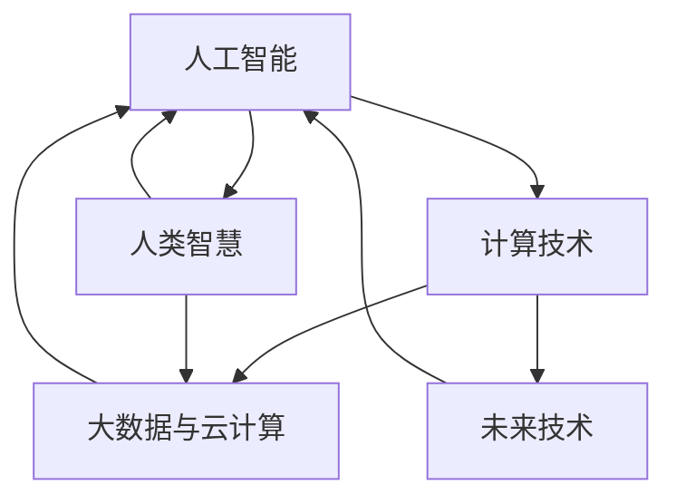

                 

# 解决人类面临的重大挑战：人类计算的使命

> 关键词：人工智能,计算,人类智慧,科学创新,未来发展

## 1. 背景介绍

### 1.1 问题由来
随着信息时代的到来，人类社会面临着一系列前所未有的重大挑战，包括气候变化、医疗健康、经济危机、社会不公等。这些问题不仅影响着人类的日常生活，更是威胁到全球的可持续发展。如何在数字化的浪潮中，充分发挥计算技术的潜力，为解决这些挑战提供新的解决方案，成为科技界的共同使命。

### 1.2 问题核心关键点
人类计算的使命，在于将强大的计算能力与人类智慧相结合，通过数据分析、模拟仿真、优化决策等技术手段，为解决复杂问题提供新思路和新方法。这需要跨学科的协作、多技术的融合以及不断的创新探索。

### 1.3 问题研究意义
深入理解人类计算的使命，对于推动科技进步、提升社会福祉、实现可持续发展具有重要意义。通过人类计算，我们可以更加精准地预测气候变化趋势，制定更加有效的应对策略；可以提升医疗诊断的准确性，降低治疗成本；可以优化资源配置，缓解经济危机和社会不公；可以探索更加公平、透明的决策机制，促进社会公正。

## 2. 核心概念与联系

### 2.1 核心概念概述

为了更好地理解人类计算的使命，本节将介绍几个密切相关的核心概念：

- 人工智能(AI)：通过计算技术模拟人类智能，涵盖感知、学习、推理、决策等多个方面。
- 人类智慧：人类社会在历史长河中积累的智慧和经验，包括科学知识、文化传统、道德伦理等。
- 计算技术：包括计算机硬件、软件、算法等，是实现人工智能和人类计算的基础。
- 大数据与云计算：提供海量数据存储和处理能力，为复杂问题建模和模拟提供支持。
- 未来技术：如量子计算、脑机接口、增强现实等，拓展了人类计算的边界和可能性。

这些核心概念之间的逻辑关系可以通过以下Mermaid流程图来展示：



这个流程图展示了几类关键概念及其之间的关系：

1. 人工智能通过计算技术模拟人类智能，借鉴人类智慧。
2. 计算技术依赖于大数据和云计算等基础设施。
3. 未来技术如量子计算、脑机接口等，为人类计算提供了新的可能性。

这些概念共同构成了人类计算的基石，使得我们能够通过计算技术解决复杂问题，实现新的突破。

## 3. 核心算法原理 & 具体操作步骤
### 3.1 算法原理概述

人类计算的核心在于利用计算技术，结合人类智慧，解决复杂问题。其基本原理包括：

- 数据驱动：通过收集、分析海量数据，挖掘隐藏在数据中的规律和模式，为问题解决提供依据。
- 模型建模：构建数学模型或仿真模型，模拟现实世界中的复杂系统，进行预测和优化。
- 优化决策：通过算法和优化方法，在给定约束条件下，寻找最优解或满意解，实现目标。

### 3.2 算法步骤详解

人类计算的实施一般包括以下几个关键步骤：

**Step 1: 问题建模与数据采集**
- 明确问题目标和约束条件，将问题转化为可计算的形式。
- 采集相关数据，包括历史数据、实时数据、模拟数据等，为模型提供基础。

**Step 2: 数据预处理与特征工程**
- 对采集到的数据进行清洗、去噪、归一化等预处理，提高数据质量。
- 通过特征工程，提取有意义的特征，为模型提供有效的输入。

**Step 3: 模型选择与训练**
- 选择合适的模型，如神经网络、深度学习、强化学习等，进行模型训练。
- 使用训练数据集，调整模型参数，优化模型性能。

**Step 4: 模型评估与优化**
- 在测试数据集上评估模型性能，如准确率、召回率、F1值等。
- 根据评估结果，进行模型优化，如调整参数、改进算法等。

**Step 5: 部署与应用**
- 将训练好的模型部署到实际应用环境中，如智能系统、自动化工具等。
- 结合人类智慧，进行决策和判断，解决实际问题。

### 3.3 算法优缺点

人类计算的优点在于：

- 数据驱动：利用大数据和复杂模型，能够处理更复杂的问题。
- 模型多样化：涵盖机器学习、深度学习、强化学习等多种算法，适应不同问题。
- 优化能力强：通过优化算法，能够寻找最优解或满意解。
- 知识整合：结合人类智慧，能够更好地理解问题背景和解决方案。

同时，也存在以下缺点：

- 数据依赖：需要大量高质量的数据，获取和处理数据成本高。
- 计算复杂：复杂问题需要大量计算资源，存在计算瓶颈。
- 模型复杂：模型构建和优化过程复杂，需要专业知识和技能。
- 解释性不足：深度学习模型等复杂模型，往往难以解释其决策过程。

尽管存在这些局限性，但人类计算仍是最为有效的方法之一，通过不断地技术创新和优化，将能够更广泛地应用于各个领域，解决更多人类面临的挑战。

### 3.4 算法应用领域

人类计算的应用领域广泛，涵盖科学计算、工程设计、金融分析、医疗健康等多个领域。

- 科学计算：通过模拟和计算，探索自然界中的基本规律，如气候变化、宇宙演化等。
- 工程设计：利用计算模型优化产品设计，提升产品性能和竞争力。
- 金融分析：通过数据分析和建模，预测市场趋势，制定投资策略。
- 医疗健康：通过医学影像分析、疾病预测等技术，提升诊断和治疗效果。
- 社会治理：利用大数据和智能算法，优化资源配置，提升公共服务质量。

以上仅是部分应用领域，随着计算技术的不断进步，人类计算的应用范围将进一步扩大，解决更多复杂问题。

## 4. 数学模型和公式 & 详细讲解 & 举例说明

### 4.1 数学模型构建

本节将使用数学语言对人类计算的核心过程进行更加严格的刻画。

假设有一个复杂问题 $P$，其目标是找到一个最优解 $x^*$。通过数据 $D$ 和计算模型 $M$，我们可以将问题 $P$ 转化为一个计算模型 $M(x;\theta)$，其中 $\theta$ 为模型参数。优化目标为最小化损失函数 $L(x^*, x) = L(M(x^*), x)$，通过优化算法 $A$ 更新参数 $\theta$，最终得到最优解 $x^*$。

### 4.2 公式推导过程

以线性回归问题为例，展示模型构建和优化的数学过程。

假设数据集 $D = \{(x_i, y_i)\}_{i=1}^N$，其中 $x_i \in \mathbb{R}^d$ 为输入，$y_i \in \mathbb{R}$ 为输出。目标是通过线性回归模型 $M(x;w) = w^T x$ 拟合数据，最小化损失函数 $L(y_i, M(x_i;w)) = \frac{1}{2N} \sum_{i=1}^N (y_i - M(x_i;w))^2$。

使用梯度下降算法优化，目标函数为：

$$
w^* = \mathop{\arg\min}_{w} \frac{1}{2N} \sum_{i=1}^N (y_i - w^T x_i)^2
$$

根据梯度下降法，更新规则为：

$$
w \leftarrow w - \eta \nabla_{w}L(w)
$$

其中 $\nabla_{w}L(w)$ 为损失函数对参数 $w$ 的梯度，可以通过链式法则计算得到：

$$
\nabla_{w}L(w) = \frac{1}{N} \sum_{i=1}^N (y_i - w^T x_i) x_i
$$

通过上述过程，可以得到最小化损失函数的目标解 $w^*$。

### 4.3 案例分析与讲解

以医疗影像分析为例，展示人类计算的具体应用过程。

假设需要判断一张医疗影像是否包含肿瘤，通过深度学习模型 $M(x;w)$ 对影像 $x$ 进行分类。首先，收集包含肿瘤和不含肿瘤的影像数据 $D = \{(x_i, y_i)\}_{i=1}^N$，其中 $x_i$ 为影像，$y_i \in \{0, 1\}$ 为标签。

构建卷积神经网络模型 $M(x;w)$，最小化交叉熵损失函数 $L(y_i, M(x_i;w)) = -\frac{1}{N} \sum_{i=1}^N [y_i \log M(x_i;w) + (1-y_i) \log (1-M(x_i;w))]$。

使用梯度下降算法更新参数 $w$，最终得到最优解 $w^*$。训练完成后，对新影像 $x'$ 进行预测，得到肿瘤诊断结果。

## 5. 项目实践：代码实例和详细解释说明
### 5.1 开发环境搭建

在进行人类计算的实践前，我们需要准备好开发环境。以下是使用Python进行TensorFlow开发的环境配置流程：

1. 安装Anaconda：从官网下载并安装Anaconda，用于创建独立的Python环境。

2. 创建并激活虚拟环境：
```bash
conda create -n tf-env python=3.8 
conda activate tf-env
```

3. 安装TensorFlow：根据CUDA版本，从官网获取对应的安装命令。例如：
```bash
conda install tensorflow -c tensorflow -c conda-forge
```

4. 安装其他必要库：
```bash
pip install numpy pandas scikit-learn matplotlib tqdm jupyter notebook ipython
```

完成上述步骤后，即可在`tf-env`环境中开始实践。

### 5.2 源代码详细实现

下面我以医疗影像分类为例，给出使用TensorFlow对卷积神经网络进行训练和预测的Python代码实现。

首先，定义数据处理函数：

```python
import tensorflow as tf
from tensorflow.keras.preprocessing.image import ImageDataGenerator
from tensorflow.keras.utils import to_categorical

train_data = ImageDataGenerator(rescale=1./255)
test_data = ImageDataGenerator(rescale=1./255)

train_generator = train_data.flow_from_directory(
        'train_data_dir',
        target_size=(256, 256),
        batch_size=32,
        class_mode='binary')

test_generator = test_data.flow_from_directory(
        'test_data_dir',
        target_size=(256, 256),
        batch_size=32,
        class_mode='binary')
```

然后，定义模型和损失函数：

```python
from tensorflow.keras import layers, models

model = models.Sequential()
model.add(layers.Conv2D(32, (3, 3), activation='relu', input_shape=(256, 256, 3)))
model.add(layers.MaxPooling2D((2, 2)))
model.add(layers.Conv2D(64, (3, 3), activation='relu'))
model.add(layers.MaxPooling2D((2, 2)))
model.add(layers.Conv2D(128, (3, 3), activation='relu'))
model.add(layers.MaxPooling2D((2, 2)))
model.add(layers.Flatten())
model.add(layers.Dense(512, activation='relu'))
model.add(layers.Dense(1, activation='sigmoid'))

loss = 'binary_crossentropy'
```

接着，定义训练和评估函数：

```python
from tensorflow.keras.callbacks import EarlyStopping

early_stopping = EarlyStopping(patience=5, restore_best_weights=True)

model.compile(optimizer='adam', loss=loss, metrics=['accuracy'])

model.fit(train_generator, epochs=50, validation_data=test_generator, callbacks=[early_stopping])
```

最后，启动训练流程并在测试集上评估：

```python
test_loss, test_acc = model.evaluate(test_generator)
print('Test accuracy:', test_acc)
```

以上就是使用TensorFlow对医疗影像分类任务进行训练和预测的完整代码实现。可以看到，TensorFlow的高级API使得模型构建和训练过程非常简便，开发者可以将更多精力放在数据处理和模型优化上。

### 5.3 代码解读与分析

让我们再详细解读一下关键代码的实现细节：

**ImageDataGenerator类**：
- `rescale`方法：对输入数据进行归一化处理，将像素值缩放到0-1范围内。
- `flow_from_directory`方法：从指定目录加载图像数据，并自动进行分类标注。

**Sequential模型**：
- `Conv2D`和`MaxPooling2D`层：构建卷积神经网络，进行特征提取和降维。
- `Flatten`层：将多维特征展平，为全连接层提供输入。
- `Dense`层：构建全连接层，进行分类决策。

**模型编译与训练**：
- `compile`方法：设置优化器、损失函数和评估指标。
- `fit`方法：使用训练数据集对模型进行训练，设置验证集和回调函数，避免过拟合。
- `evaluate`方法：在测试数据集上评估模型性能，打印准确率。

**EarlyStopping回调函数**：
- `patience`参数：设置早期停止的耐心，即在连续未提升时停止训练。
- `restore_best_weights`参数：是否在停止训练后恢复最佳权重。

通过这些代码，我们可以清晰地看到TensorFlow的高效性和易用性，轻松实现复杂模型的训练和预测。

## 6. 实际应用场景
### 6.1 智慧城市管理

智慧城市是现代城市治理的重要方向，通过大数据和智能算法的应用，可以提升城市管理的智能化水平，构建更加安全、高效、可持续的宜居环境。

例如，在智慧交通领域，通过实时收集交通流量、车辆位置、天气情况等数据，利用机器学习模型预测交通拥堵情况，优化交通信号控制，减少交通拥堵，提升出行效率。在智慧能源领域，通过传感器监测能源使用情况，预测能源需求，优化能源分配，实现绿色低碳的可持续发展。

### 6.2 环境保护与气候变化

环境保护和气候变化是全球面临的重大挑战，需要利用计算技术进行系统性的分析和决策。

例如，通过遥感数据和大气模型，模拟和预测气候变化趋势，制定减排和适应策略。利用环境监测数据和机器学习模型，实时监测水质、空气质量、土壤污染等指标，及时预警环境风险，保护生态环境。

### 6.3 医疗健康管理

医疗健康是关系到人类生命质量的关键领域，通过大数据和智能算法，可以提升医疗诊断和治疗的准确性和效率。

例如，利用医学影像分析技术，自动检测和诊断疾病，减少误诊和漏诊。通过电子病历和大数据分析，发现疾病趋势和规律，优化诊疗方案，提高医疗资源利用率。利用智能推荐系统，个性化推荐治疗方案和药品，提升患者治疗效果。

### 6.4 金融风险管理

金融市场存在诸多不确定性和风险，利用计算技术可以提升风险管理和投资决策的准确性。

例如，通过金融数据和机器学习模型，实时监测市场波动，预测金融风险，制定应对策略。利用信用评分和行为数据分析，评估客户信用风险，优化信贷审批和风险控制。利用自然语言处理技术，自动分析金融新闻和报告，提取重要信息，辅助投资决策。

### 6.5 社会治理与公共安全

社会治理和公共安全是保障社会稳定和发展的关键环节，通过计算技术可以提高治理效率和决策准确性。

例如，利用大数据和机器学习模型，分析社会事件和舆情趋势，制定应对策略。通过智能监控和图像识别技术，实时监测公共安全事件，及时预警和处理。利用社会网络分析和情感分析技术，理解社会动态和公众情绪，优化社会治理方案。

## 7. 工具和资源推荐
### 7.1 学习资源推荐

为了帮助开发者系统掌握人类计算的理论基础和实践技巧，这里推荐一些优质的学习资源：

1. 《深度学习》系列课程：斯坦福大学开设的深度学习课程，涵盖机器学习、深度学习、卷积神经网络等基础和前沿内容，提供丰富的讲义和代码。

2. 《机器学习实战》书籍：Google工程师编写的实战指南，介绍机器学习模型的构建和应用，包括TensorFlow、Keras等工具的使用。

3. 《人类计算》系列论文：涵盖人类计算的多个应用领域，如气候预测、医疗诊断、金融分析等，提供最新的研究进展和技术突破。

4. 《自然语言处理入门》课程：斯坦福大学开设的NLP入门课程，涵盖NLP基本概念和常用算法，提供丰富的实践案例和代码示例。

5. 《计算机视觉入门》课程：斯坦福大学开设的计算机视觉课程，涵盖图像处理、特征提取、目标检测等技术，提供全面的实践指导。

通过对这些资源的学习实践，相信你一定能够快速掌握人类计算的精髓，并用于解决实际的复杂问题。

### 7.2 开发工具推荐

高效的开发离不开优秀的工具支持。以下是几款用于人类计算开发的常用工具：

1. TensorFlow：Google开发的深度学习框架，支持大规模分布式计算，适用于各种复杂模型的训练和推理。

2. PyTorch：Facebook开发的深度学习框架，灵活的动态计算图，适用于快速迭代研究和原型开发。

3. OpenCV：开源计算机视觉库，提供丰富的图像处理和分析工具，适用于计算机视觉应用开发。

4. Matplotlib：Python数据可视化库，支持绘制各类图表和动画，适用于数据分析和可视化。

5. Jupyter Notebook：交互式编程环境，支持Python、R等语言，便于开发和协作。

6. Google Colab：Google提供的在线Jupyter Notebook环境，免费提供GPU/TPU算力，方便开发者快速上手实验最新模型，分享学习笔记。

合理利用这些工具，可以显著提升人类计算任务的开发效率，加快创新迭代的步伐。

### 7.3 相关论文推荐

人类计算的发展源于学界的持续研究。以下是几篇奠基性的相关论文，推荐阅读：

1. Neural Networks and Deep Learning（神经网络与深度学习）：由深度学习专家Ian Goodfellow、Yoshua Bengio和Aaron Courville合著，全面介绍了深度学习的基础和应用。

2. Reinforcement Learning: An Introduction（强化学习入门）：由深度学习专家Richard Sutton和Andrew Barto合著，介绍强化学习的基本概念和算法。

3. AI Superpowers: China, Silicon Valley, and the New World Order（AI超级大国）：由李开复撰写，讨论AI技术的全球竞争和未来趋势，提供丰富的数据和分析。

4. The Road to Superintelligence（通往超级智能之路）：由AI研究专家Nick Bostrom撰写，探讨AI技术的发展路径和潜在风险，提供深刻的思考和见解。

5. AlphaGo Zero: Mastering the Game of Go without Human Knowledge（AlphaGo Zero：无人类知识下围棋）：由DeepMind团队撰写，介绍AlphaGo Zero的成功案例和创新技术。

这些论文代表了大计算发展的趋势和前沿，通过学习这些成果，可以帮助研究者把握学科前进方向，激发更多的创新灵感。

## 8. 总结：未来发展趋势与挑战
### 8.1 总结

本文对人类计算的使命和核心过程进行了全面系统的介绍。首先阐述了人类计算在解决复杂问题中的重要性和应用前景，明确了计算技术、大数据、人类智慧等关键要素。其次，从原理到实践，详细讲解了人类计算的数学模型和具体操作步骤，提供了完整的代码实例。同时，本文还广泛探讨了人类计算在智慧城市、环境保护、医疗健康、金融风险管理、社会治理等领域的实际应用，展示了其广阔的应用前景。此外，本文精选了人类计算技术的各类学习资源，力求为读者提供全方位的技术指引。

通过本文的系统梳理，可以看到，人类计算在推动科技进步、提升社会福祉、实现可持续发展等方面发挥着越来越重要的作用。未来，伴随计算技术的不断进步，人类计算将拓展到更多领域，解决更多复杂问题。

### 8.2 未来发展趋势

展望未来，人类计算将呈现以下几个发展趋势：

1. 数据驱动：随着数据量的不断增长，数据驱动的计算将成为主流，提升问题解决的准确性和效率。

2. 模型多样化：未来的计算模型将更加多样化，涵盖深度学习、强化学习、符号推理等，适应不同类型的问题。

3. 跨领域融合：不同领域的计算技术将更加紧密结合，实现多学科协同创新，解决更多跨学科问题。

4. 智能辅助：计算技术将更多地与人类智慧结合，提升决策的智能化和可解释性。

5. 计算泛化：计算模型将在更多领域实现泛化应用，解决实际问题。

6. 人机协作：计算技术与人类协作将成为未来计算的核心，推动人工智能与人类智能的融合。

以上趋势凸显了人类计算的广阔前景，这些方向的探索发展，必将进一步提升计算技术的能力和应用范围，为解决复杂问题提供新的解决方案。

### 8.3 面临的挑战

尽管人类计算技术已经取得了瞩目成就，但在迈向更加智能化、普适化应用的过程中，仍面临诸多挑战：

1. 数据质量瓶颈：高质量数据的获取和处理成本高，限制了计算模型的应用范围。

2. 模型复杂度：复杂的计算模型需要大量的计算资源，存在计算瓶颈。

3. 算法透明性：复杂模型的决策过程难以解释，影响应用的可信度和可信度。

4. 安全与伦理：计算模型的偏见和有害信息可能对社会产生负面影响，需要进一步完善法律法规和伦理规范。

5. 资源消耗：大规模计算任务对计算资源和能耗的需求大，需要寻找新的资源优化方法。

6. 知识整合：跨领域的知识整合和融合，需要克服知识异构性和复杂性。

这些挑战需要我们在技术、伦理、政策等多个维度协同努力，才能更好地发挥人类计算的潜力，为人类社会带来更大的福祉。

### 8.4 研究展望

面对人类计算面临的挑战，未来的研究需要在以下几个方面寻求新的突破：

1. 无监督学习：通过无监督学习技术，提高模型对未标注数据的利用能力，降低对标注数据的依赖。

2. 知识增强：将符号化知识与计算模型结合，提升模型的知识整合能力和泛化能力。

3. 分布式计算：利用分布式计算技术，提高计算效率和资源利用率。

4. 跨模态融合：融合视觉、语音、文本等多模态信息，提升问题解决的全面性和准确性。

5. 安全与隐私：研究计算模型的安全性和隐私保护，确保数据和算法的透明性和可信度。

6. 智能决策：结合人类智慧和计算技术，提升决策的智能化和可解释性，实现人机协同决策。

这些研究方向的探索，将引领人类计算技术的不断进步，为解决人类面临的重大挑战提供新的解决方案。

## 9. 附录：常见问题与解答

**Q1：如何利用人类计算解决复杂问题？**

A: 利用人类计算解决复杂问题，一般包括以下几个步骤：
1. 问题建模与数据采集：明确问题目标和约束条件，收集相关数据。
2. 数据预处理与特征工程：清洗、去噪、归一化等预处理，提取有意义的特征。
3. 模型选择与训练：选择合适的模型，利用训练数据进行模型训练。
4. 模型评估与优化：在测试数据集上评估模型性能，根据评估结果进行优化。
5. 部署与应用：将训练好的模型部署到实际应用环境中，结合人类智慧进行决策。

**Q2：人类计算与传统计算有什么不同？**

A: 人类计算与传统计算的主要区别在于：
1. 数据驱动：人类计算强调数据驱动，利用大数据和复杂模型进行问题解决。
2. 智能辅助：人类计算结合人类智慧，提升决策的智能化和可解释性。
3. 跨学科融合：人类计算涵盖多个学科，实现多学科协同创新。
4. 人机协作：人类计算强调人机协作，实现计算技术与人类智能的融合。

**Q3：人类计算需要哪些资源支持？**

A: 人类计算需要以下资源支持：
1. 数据资源：高质量的数据资源，包括结构化数据、非结构化数据、传感器数据等。
2. 计算资源：高性能的计算设备和算力，包括CPU、GPU、TPU等。
3. 算法资源：丰富的计算算法和模型，涵盖深度学习、强化学习、自然语言处理等。
4. 跨学科知识：多学科的跨领域知识，包括科学、工程、社会科学等。
5. 技术支持：先进的技术工具和平台，包括编程语言、开发环境、云服务等。

**Q4：人类计算如何应用在实际问题中？**

A: 人类计算在实际问题中的应用广泛，涵盖以下领域：
1. 智慧城市管理：通过大数据和智能算法，提升城市管理的智能化水平。
2. 环境保护与气候变化：利用计算技术进行系统性分析和决策。
3. 医疗健康管理：提升医疗诊断和治疗的准确性和效率。
4. 金融风险管理：通过计算技术，提升风险管理和投资决策的准确性。
5. 社会治理与公共安全：提高治理效率和决策准确性。

**Q5：未来人类计算的发展方向是什么？**

A: 未来人类计算的发展方向包括：
1. 数据驱动：充分利用大数据和复杂模型，提升问题解决的准确性和效率。
2. 模型多样化：涵盖深度学习、强化学习、符号推理等，适应不同类型的问题。
3. 跨领域融合：实现多学科协同创新，解决更多跨学科问题。
4. 智能辅助：提升决策的智能化和可解释性。
5. 计算泛化：实现计算模型在更多领域的泛化应用。
6. 人机协作：实现计算技术与人类智能的融合，推动人工智能与人类智能的协同创新。

通过这些问题与解答，希望能为读者提供更加深入的理解和指导，帮助他们在实际应用中更好地发挥人类计算的潜力，解决复杂问题。

---

作者：禅与计算机程序设计艺术 / Zen and the Art of Computer Programming

