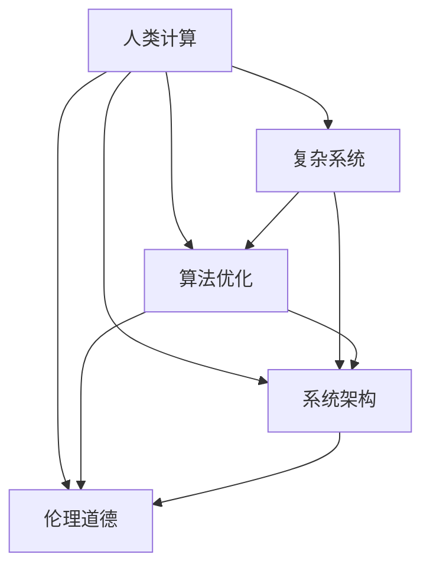

                 

# 解决人类面临的重大挑战：人类计算的使命

> 关键词：人类计算,重大挑战,人工智能,算法优化,系统架构,伦理

## 1. 背景介绍

### 1.1 问题由来
随着科技的飞速发展和社会的不断进步，人类面临着诸多前所未有的重大挑战。从气候变化、能源短缺到公共卫生、社会不公，再到伦理道德、人工智能等诸多领域，这些问题都亟需我们借助高科技手段进行有效解决。其中，人类计算作为一项极具潜力的技术，被寄予厚望。

### 1.2 问题核心关键点
人类计算（Human-Computer Interaction, HCI）旨在通过计算机技术和算法，将人类的智慧与计算能力有机结合，共同解决复杂问题。其核心在于如何设计高效、智能、易于使用的计算系统和算法，确保人类能够高效地完成任务，并做出正确的决策。

人类计算的挑战在于：
1. **复杂度与规模**：人类面临的挑战通常非常复杂且规模巨大，需要高效的算法和计算系统来支撑。
2. **伦理道德**：在人工智能等技术广泛应用于社会时，如何确保其伦理道德，避免偏见和滥用，是一个重要的课题。
3. **用户接受度**：计算系统需要设计得既高效又易用，以得到用户的广泛接受和信赖。
4. **数据隐私与安全**：在使用计算技术处理大量数据时，如何保护用户隐私，防止数据泄露和滥用，是一个重要的议题。

这些核心关键点构成了人类计算研究的出发点和落脚点，指导着相关技术的发展与应用。

## 2. 核心概念与联系

### 2.1 核心概念概述

为更好地理解人类计算的核心概念及其相互联系，本节将介绍几个密切相关的核心概念：

- **人类计算（Human-Computer Interaction, HCI）**：研究如何通过计算机技术和算法，实现人与计算机的协同互动，共同解决复杂问题。

- **复杂系统（Complex Systems）**：描述系统内部各组成部分之间关系错综复杂，难以简单预测和控制的系统。人类计算的任务之一是处理和优化这类系统。

- **算法优化（Algorithm Optimization）**：通过优化算法结构和参数，提高计算效率和准确性。人类计算中，算法优化是关键环节，直接影响到系统的性能和效果。

- **系统架构（System Architecture）**：设计高效、灵活、可扩展的系统结构，确保计算系统能够高效运行并具备良好的适应性。

- **伦理道德（Ethics & Morality）**：在设计和使用人类计算技术时，必须考虑到伦理道德问题，确保技术的应用不会带来负面影响。

这些核心概念之间相互依存、相互影响，共同构成了人类计算的研究框架和应用方向。

### 2.2 核心概念原理和架构的 Mermaid 流程图



这个流程图展示了人类计算的核心概念及其相互关系：

1. 人类计算（A）通过算法优化（C）和系统架构（D），处理复杂系统（B）中的问题。
2. 同时，人类计算在设计时必须考虑到伦理道德（E），确保技术应用的正确性和公正性。

## 3. 核心算法原理 & 具体操作步骤

### 3.1 算法原理概述

人类计算的核心在于设计高效、智能的算法，通过计算机与人类协同，共同解决复杂问题。其算法原理可以概括为以下几个方面：

1. **算法分治（Algorithmic Divide and Conquer）**：将复杂问题分解成若干简单子问题，并独立解决，最后将结果合并，解决整体问题。
2. **动态规划（Dynamic Programming）**：通过保存子问题的解，避免重复计算，提高算法效率。
3. **启发式搜索（Heuristic Search）**：通过启发式规则快速搜索解决方案，适用于搜索空间巨大的问题。
4. **机器学习（Machine Learning）**：通过数据驱动的方法，自动学习问题解决策略，适用于数据丰富的问题。
5. **多智能体系统（Multi-Agent System）**：通过多个智能体协同工作，解决复杂问题，适用于多主体互动的场景。

### 3.2 算法步骤详解

基于人类计算的核心算法原理，下面详细介绍人类计算的具体操作步骤：

**Step 1: 问题建模**
- 确定需要解决的问题类型和规模，选择合适的算法模型。
- 建立问题的数学模型，将现实问题转化为计算问题。

**Step 2: 算法设计**
- 根据问题的特性，设计合适的算法结构和参数。
- 应用算法优化技术，确保算法的效率和准确性。

**Step 3: 系统实现**
- 将算法实现为可执行的代码，并集成到计算系统中。
- 设计高效的系统架构，确保计算系统的高效运行。

**Step 4: 系统测试与调试**
- 对系统进行全面测试，评估其性能和稳定性。
- 根据测试结果，进行调试和优化，确保系统满足需求。

**Step 5: 部署与应用**
- 将系统部署到实际环境中，进行业务运行。
- 根据用户反馈，持续优化系统，提高用户体验。

### 3.3 算法优缺点

人类计算的算法设计具有以下优点：
1. **高效性**：通过算法优化和系统架构设计，能够高效地解决复杂问题。
2. **可扩展性**：算法和系统架构具有较好的可扩展性，可以灵活应对不同的应用场景。
3. **鲁棒性**：通过引入多智能体和冗余设计，系统具备较好的鲁棒性，能够应对突发情况。
4. **智能性**：通过机器学习等技术，算法具备一定的智能性，能够自适应问题变化。

同时，也存在一些局限性：
1. **计算资源需求高**：复杂的算法和系统架构对计算资源有较高需求。
2. **开发周期长**：系统设计和实现需要较长的开发周期，且需要专业知识。
3. **伦理道德风险**：算法设计和使用过程中，可能存在伦理道德问题，需额外注意。
4. **用户接受度低**：复杂的算法和系统架构可能不够直观，用户接受度较低。

### 3.4 算法应用领域

人类计算的算法和系统架构已经在多个领域得到广泛应用，例如：

- **金融风险管理**：通过复杂的算法模型和系统架构，实时监测市场风险，预测金融危机。
- **医疗诊断系统**：利用机器学习和多智能体系统，辅助医生进行疾病诊断和治疗方案制定。
- **智慧城市管理**：通过算法优化和系统架构设计，实现城市交通、环境、能源等方面的高效管理。
- **供应链管理**：通过动态规划和启发式搜索算法，优化供应链的各个环节，提升效率和灵活性。
- **工业自动化**：通过复杂的算法和系统架构，实现自动化生产线的高效运行。

## 4. 数学模型和公式 & 详细讲解 & 举例说明

### 4.1 数学模型构建

在人类计算中，构建合适的数学模型是解决问题的第一步。以下以金融风险管理为例，介绍如何构建数学模型。

设有一组历史金融数据 $X = \{(x_1, y_1), (x_2, y_2), \dots, (x_n, y_n)\}$，其中 $x_i = (x_{i1}, x_{i2}, \dots, x_{in})$ 为输入特征，$y_i$ 为输出目标。假设 $f(x_i; \theta)$ 为模型函数，$\theta$ 为模型参数。则目标为最小化预测误差：

$$
\min_{\theta} \sum_{i=1}^N (y_i - f(x_i; \theta))^2
$$

### 4.2 公式推导过程

基于上述数学模型，推导常用的算法步骤：

**Step 1: 模型选择**
- 选择合适的模型函数，如线性回归、逻辑回归、决策树等。

**Step 2: 参数估计**
- 利用最小二乘法等方法，估计模型参数 $\theta$。

**Step 3: 预测与评估**
- 将新数据 $x$ 输入模型，计算预测值 $y' = f(x; \theta)$。
- 使用均方误差等指标评估模型性能。

**Step 4: 优化与调整**
- 根据评估结果，调整模型参数 $\theta$，优化模型性能。

### 4.3 案例分析与讲解

以线性回归模型为例，分析其数学模型和算法步骤：

设有一组历史数据 $X = \{(x_1, y_1), (x_2, y_2), \dots, (x_n, y_n)\}$，其中 $x_i = (x_{i1}, x_{i2}, \dots, x_{in})$ 为输入特征，$y_i$ 为输出目标。假设 $f(x_i; \theta) = \theta_0 + \sum_{j=1}^n \theta_j x_{ij}$，其中 $\theta = (\theta_0, \theta_1, \dots, \theta_n)$ 为模型参数。则目标为最小化预测误差：

$$
\min_{\theta} \sum_{i=1}^N (y_i - \theta_0 - \sum_{j=1}^n \theta_j x_{ij})^2
$$

求解上述优化问题，可得到最小二乘估计：

$$
\hat{\theta} = \arg\min_{\theta} \sum_{i=1}^N (y_i - \theta_0 - \sum_{j=1}^n \theta_j x_{ij})^2
$$

利用梯度下降法等优化算法，求解上述最小化问题，即可得到模型参数 $\hat{\theta}$。

## 5. 项目实践：代码实例和详细解释说明

### 5.1 开发环境搭建

在进行人类计算的算法实践前，我们需要准备好开发环境。以下是使用Python进行Scikit-learn开发的环境配置流程：

1. 安装Anaconda：从官网下载并安装Anaconda，用于创建独立的Python环境。

2. 创建并激活虚拟环境：
```bash
conda create -n sklearn-env python=3.8 
conda activate sklearn-env
```

3. 安装Scikit-learn：
```bash
conda install scikit-learn
```

4. 安装各类工具包：
```bash
pip install numpy pandas matplotlib seaborn
```

完成上述步骤后，即可在`sklearn-env`环境中开始人类计算的算法实践。

### 5.2 源代码详细实现

下面我以线性回归模型为例，给出使用Scikit-learn进行数据建模的PyTorch代码实现。

```python
from sklearn.linear_model import LinearRegression
from sklearn.datasets import load_boston
from sklearn.model_selection import train_test_split
import numpy as np

# 加载波士顿房价数据集
boston = load_boston()
X = boston.data
y = boston.target

# 划分训练集和测试集
X_train, X_test, y_train, y_test = train_test_split(X, y, test_size=0.2, random_state=42)

# 构建线性回归模型
model = LinearRegression()

# 拟合训练数据
model.fit(X_train, y_train)

# 预测测试数据
y_pred = model.predict(X_test)

# 输出测试数据预测结果
print(y_pred)
```

以上就是使用Scikit-learn对波士顿房价数据集进行线性回归建模的完整代码实现。可以看到，通过Scikit-learn，我们能够快速构建和训练线性回归模型，并通过简单代码实现数据预测。

### 5.3 代码解读与分析

让我们再详细解读一下关键代码的实现细节：

**线性回归模型**：
- `from sklearn.linear_model import LinearRegression`：导入Scikit-learn中的线性回归模型。
- `boston = load_boston()`：加载波士顿房价数据集。
- `X = boston.data`：提取特征数据。
- `y = boston.target`：提取目标变量。
- `train_test_split()`：将数据集划分为训练集和测试集。
- `model = LinearRegression()`：创建线性回归模型实例。
- `model.fit(X_train, y_train)`：拟合训练数据。
- `y_pred = model.predict(X_test)`：预测测试数据。

**数据加载和划分**：
- 利用`load_boston()`函数加载波士顿房价数据集，包含特征和目标变量。
- 使用`train_test_split()`函数将数据集划分为训练集和测试集，比例为80%训练集，20%测试集。

**模型训练与预测**：
- 使用`LinearRegression()`创建线性回归模型实例。
- 调用`fit()`方法拟合训练数据，估计模型参数。
- 调用`predict()`方法对测试数据进行预测，得到预测结果。

可以看到，Scikit-learn提供了简洁易用的API，使得算法实践变得更加高效和便捷。开发者可以专注于模型设计和优化，而不必过多关注底层实现细节。

当然，工业级的系统实现还需考虑更多因素，如模型的保存和部署、超参数的自动搜索、更灵活的算法组合等。但核心的算法设计基本与此类似。

## 6. 实际应用场景

### 6.1 智能城市交通管理

人类计算技术在智能城市交通管理中的应用，可以极大地提升城市交通的效率和安全性。传统城市交通管理主要依赖人工调度，效率低且易出错。而利用人类计算技术，可以构建智能交通系统，通过数据分析和算法优化，实时调整交通信号灯、优化道路布局，实现交通流量的高效管理和运行。

在技术实现上，可以收集城市交通数据，利用机器学习算法分析交通流量、车速、道路拥堵情况等，预测交通热点和瓶颈。结合多智能体系统，对交通信号灯进行动态控制，实时调整交通流量，优化道路布局，减少交通拥堵和事故发生。如此构建的智能交通系统，能大幅提升城市交通管理的智能化水平，提高居民出行体验。

### 6.2 个性化推荐系统

在电商、新闻、音乐等平台中，推荐系统已经成为用户粘性和平台收入的重要来源。传统的推荐系统依赖用户的历史行为数据进行推荐，难以捕捉用户真正的兴趣和需求。基于人类计算的个性化推荐系统，可以更好地挖掘用户行为背后的语义信息，提供更精准、个性化的推荐内容。

在实践中，可以收集用户浏览、点击、评论、分享等行为数据，提取和用户交互的物品标题、描述、标签等文本内容。将文本内容作为模型输入，用户的后续行为（如是否点击、购买等）作为监督信号，在此基础上微调预训练语言模型。微调后的模型能够从文本内容中准确把握用户的兴趣点。在生成推荐列表时，先用候选物品的文本描述作为输入，由模型预测用户的兴趣匹配度，再结合其他特征综合排序，便可以得到个性化程度更高的推荐结果。

### 6.3 医疗影像分析

医疗影像分析是医疗诊断和治疗中的重要环节，传统方法依赖医生的人工判断，耗时长且易出错。利用人类计算技术，可以构建智能医疗影像分析系统，通过图像识别和分类算法，快速分析医疗影像，辅助医生进行疾病诊断和治疗方案制定。

在技术实现上，可以收集各类医疗影像数据，利用卷积神经网络（CNN）等深度学习算法，对影像进行特征提取和分类。结合多智能体系统，对医生和医疗影像分析系统进行协同，实时更新模型参数，提升诊断和治疗的准确性和效率。如此构建的智能医疗影像分析系统，能显著提升医疗服务的智能化水平，辅助医生进行更精准的诊断和治疗。

### 6.4 未来应用展望

随着人类计算技术的发展，其在多个领域的应用前景广阔，将深刻改变人类社会的运作方式。未来，人类计算将在以下方面发挥重要作用：

- **环境保护**：通过数据分析和算法优化，实时监测环境变化，预测和应对自然灾害，提升环境治理的智能化水平。
- **教育培训**：利用人类计算技术，设计个性化的学习路径和课程，提升教育质量和效率，促进教育公平。
- **社会治理**：通过数据分析和算法优化，优化社会治理的各个环节，提升公共服务的管理水平，构建更和谐的社会环境。
- **企业运营**：利用人类计算技术，优化企业运营的各个环节，提升生产效率和市场竞争力，实现可持续发展。
- **科学研究**：通过数据分析和算法优化，加速科学研究的各个环节，推动科学技术的发展，提升人类生活质量。

## 7. 工具和资源推荐

### 7.1 学习资源推荐

为了帮助开发者系统掌握人类计算的理论基础和实践技巧，这里推荐一些优质的学习资源：

1. 《算法导论》（Introduction to Algorithms）：经典算法教材，涵盖了各种算法设计和分析的详细原理和方法。
2. 《深度学习》（Deep Learning）：深度学习领域权威教材，介绍了深度学习的各种算法和应用。
3. Coursera《机器学习》课程：斯坦福大学开设的机器学习课程，涵盖了机器学习的基础理论和实践技巧。
4. Kaggle：数据科学竞赛平台，提供大量数据集和模型，供开发者练习和比赛。
5. GitHub：代码托管平台，提供丰富的开源项目和代码示例，供开发者学习和参考。

通过对这些资源的学习实践，相信你一定能够快速掌握人类计算的精髓，并用于解决实际的复杂问题。

### 7.2 开发工具推荐

高效的开发离不开优秀的工具支持。以下是几款用于人类计算开发的工具：

1. Python：数据科学和机器学习领域的首选语言，拥有丰富的算法库和数据处理工具。
2. Scikit-learn：Python的机器学习库，提供了多种算法和工具，简单易用。
3. TensorFlow：Google开发的深度学习框架，支持大规模分布式训练和推理。
4. PyTorch：Facebook开发的深度学习框架，灵活性高，适合研究和原型开发。
5. Jupyter Notebook：交互式数据科学和算法开发工具，支持代码编写、数据可视化、模型评估等。

合理利用这些工具，可以显著提升人类计算的开发效率，加快创新迭代的步伐。

### 7.3 相关论文推荐

人类计算和机器学习的发展源于学界的持续研究。以下是几篇奠基性的相关论文，推荐阅读：

1. SVM: Support Vector Machines（支持向量机）：提出了SVM算法，广泛应用于分类和回归问题。
2. Random Forests（随机森林）：提出了随机森林算法，通过集成多个决策树，提高分类和回归的准确性。
3. Deep Learning（深度学习）：提出深度学习框架，通过多层次神经网络，实现复杂的图像、语音、自然语言处理任务。
4. GAN: Generative Adversarial Networks（生成对抗网络）：提出GAN算法，通过对抗生成的方式，生成高质量的合成数据。
5. AlphaGo：提出AlphaGo算法，通过深度学习和多智能体系统，实现人类级别以上的围棋AI。

这些论文代表了大数据和机器学习的发展脉络。通过学习这些前沿成果，可以帮助研究者把握学科前进方向，激发更多的创新灵感。

## 8. 总结：未来发展趋势与挑战

### 8.1 总结

本文对人类计算的核心算法原理和操作步骤进行了全面系统的介绍。首先阐述了人类计算的挑战和重要性，明确了算法优化、系统架构和伦理道德在人类计算中的关键作用。其次，从原理到实践，详细讲解了人类计算的数学模型和核心算法，给出了人类计算算法实践的完整代码实例。同时，本文还广泛探讨了人类计算在智能城市、个性化推荐、医疗影像分析等多个领域的应用前景，展示了人类计算的广阔前景。

通过本文的系统梳理，可以看到，人类计算技术正在成为解决复杂问题的强大工具，极大地拓展了计算系统的应用边界，催生了更多的落地场景。得益于大数据和机器学习等技术的不断进步，人类计算必将在更广阔的应用领域发挥重要作用，深刻影响人类的生产生活方式。

### 8.2 未来发展趋势

展望未来，人类计算技术将呈现以下几个发展趋势：

1. **智能化水平提升**：随着算法和算力水平的提升，人类计算的智能化水平将进一步提高，能够处理更加复杂和多样的问题。
2. **数据驱动的决策**：人类计算将更多地依赖数据驱动的决策，通过大数据分析和机器学习，实现更科学、高效的决策过程。
3. **跨领域融合**：人类计算将与其他技术进行深度融合，如物联网、人工智能、区块链等，实现更广泛的应用场景。
4. **伦理道德保障**：人类计算在设计和应用过程中，将更多地考虑到伦理道德问题，确保技术应用的正确性和公正性。
5. **用户友好设计**：人类计算将更加注重用户界面和体验设计，提高系统的易用性和用户接受度。

以上趋势凸显了人类计算技术的广阔前景。这些方向的探索发展，必将进一步提升人类计算系统的性能和应用范围，为构建智能社会提供新的技术路径。

### 8.3 面临的挑战

尽管人类计算技术已经取得了瞩目成就，但在迈向更加智能化、普适化应用的过程中，它仍面临着诸多挑战：

1. **计算资源需求高**：复杂问题通常需要大规模的计算资源支持，这对硬件和软件基础设施提出了更高的要求。
2. **算法设计和优化**：算法的复杂性和优化难度较大，需要更多时间和资源进行研究和调试。
3. **伦理道德问题**：人类计算在应用过程中，可能面临数据隐私、公平性等问题，需制定相关规范和标准。
4. **用户接受度低**：复杂算法和系统架构可能不够直观，用户接受度和信任度较低。
5. **技术迭代速度快**：技术的快速迭代要求开发者不断学习和更新知识，增加了开发难度。

### 8.4 研究展望

面对人类计算面临的这些挑战，未来的研究需要在以下几个方面寻求新的突破：

1. **算法优化技术**：开发更加高效、智能的算法，提高算法的可扩展性和鲁棒性。
2. **系统架构设计**：设计更灵活、可扩展的系统架构，提升系统的运行效率和稳定性。
3. **伦理道德研究**：在技术设计和应用过程中，加强伦理道德的考量和规范，确保技术应用的正确性和公正性。
4. **用户界面设计**：设计更直观、易用的用户界面，提升系统的易用性和用户接受度。
5. **数据隐私保护**：加强数据隐私保护技术的研究和应用，确保用户数据的隐私和安全。

这些研究方向的探索，必将引领人类计算技术迈向更高的台阶，为构建智能社会提供新的技术保障。面向未来，人类计算需要从数据、算法、工程、伦理等多个维度协同发力，共同推动技术的不断进步。

## 9. 附录：常见问题与解答

**Q1：人类计算是否适用于所有复杂问题？**

A: 人类计算技术适用于大部分复杂问题，但并非所有问题都适合用计算机求解。对于一些依赖人类直觉、创造力和情感的问题，计算机的模拟和替代还存在较大难度。

**Q2：人类计算的算法优化有哪些具体策略？**

A: 人类计算的算法优化主要包括以下策略：
1. 分治算法（Divide and Conquer）：将问题分解成若干简单子问题，并独立解决。
2. 动态规划（Dynamic Programming）：通过保存子问题的解，避免重复计算。
3. 启发式搜索（Heuristic Search）：通过启发式规则快速搜索解决方案。
4. 多智能体系统（Multi-Agent System）：通过多个智能体协同工作，解决复杂问题。

**Q3：如何提高人类计算系统的用户接受度？**

A: 提高用户接受度的关键在于设计直观、易用的用户界面和操作流程。可以使用可视化工具展示计算结果，提供交互式界面让用户自定义输入参数。同时，根据用户反馈，不断优化系统设计和功能，提高用户体验。

**Q4：在应用人类计算技术时，如何保障数据隐私和安全？**

A: 保障数据隐私和安全的关键在于数据匿名化和加密。在数据采集和存储过程中，使用数据脱敏和加密技术，防止数据泄露和滥用。同时，加强访问控制和审计机制，确保数据访问的合法性和可追溯性。

**Q5：在设计和实现人类计算系统时，如何平衡算法性能和用户体验？**

A: 平衡算法性能和用户体验的关键在于用户界面设计。在算法优化和系统设计时，考虑到用户的操作习惯和心理预期，提供直观、易用的界面。同时，通过用户反馈和数据分析，不断优化算法和系统，提升用户体验。

通过本文的系统梳理，可以看到，人类计算技术正在成为解决复杂问题的强大工具，极大地拓展了计算系统的应用边界，催生了更多的落地场景。得益于大数据和机器学习等技术的不断进步，人类计算必将在更广阔的应用领域发挥重要作用，深刻影响人类的生产生活方式。未来，随着技术的不断进步和应用的不断深入，人类计算将展现出更广阔的应用前景和更强大的潜力。

