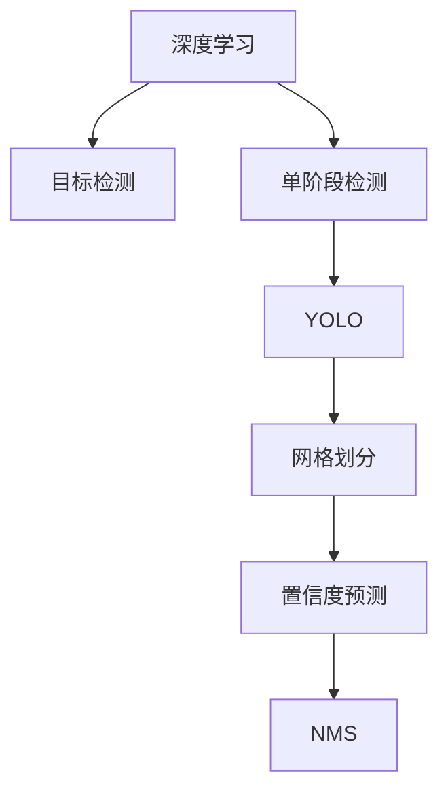

                 

# 计算机视觉中的目标检测：YOLO算法解析

## 1. 背景介绍

### 1.1 问题由来
在计算机视觉领域，目标检测一直是研究的热点。目标检测任务旨在从图像中识别出各类目标，并标出其在图像中的位置，其应用领域广泛，包括自动驾驶、安防监控、工业自动化、医学图像分析等。传统的目标检测方法如Haar级联分类器、SVM等方法，其检测速度较慢，且容易受到光照、尺度变化等因素的影响。

近年来，深度学习技术的崛起，特别是卷积神经网络（Convolutional Neural Networks, CNNs）在计算机视觉领域的广泛应用，使得目标检测技术得到了显著提升。然而，现有的深度学习目标检测算法仍然面临诸多挑战，如检测速度、准确率、鲁棒性、计算资源消耗等。为解决这些难题，YOLO（You Only Look Once）算法应运而生。

YOLO算法由Joseph Redmon等人于2015年提出，是一种基于深度学习的实时目标检测算法。YOLO算法在速度和准确率上均取得了优异的性能，并因其实时性而在工业界获得了广泛应用。

### 1.2 问题核心关键点
YOLO算法的工作原理可以简要概括为：将输入图像分成多个网格，每个网格负责检测其中的目标，并给出每个目标的置信度和类别。该算法在单次前向传播中即可完成检测，因而具有极高的检测速度。YOLO算法采用单阶段检测框架，摒弃了传统的候选区域技术，显著提高了检测效率。

YOLO算法具有以下核心特点：
- 单阶段检测：YOLO算法直接对输入图像进行检测，无需候选框的生成。
- 全卷积网络：YOLO算法完全由卷积层构成，不含全连接层，大幅减少了模型参数量。
- 网格划分：YOLO算法将图像划分为若干个网格，每个网格负责检测其中的目标，简化了模型复杂度。
- 置信度预测：YOLO算法对每个目标预测两个置信度值，用于判断该目标是否存在和其置信度。

## 2. 核心概念与联系

### 2.1 核心概念概述

为了更好地理解YOLO算法的工作原理，本节将介绍几个关键概念：

- 目标检测（Object Detection）：指在图像或视频中识别出各类目标，并标出其在图像中的位置。目标检测技术广泛应用于自动驾驶、安防监控、工业自动化、医学图像分析等领域。

- 深度学习（Deep Learning）：一种基于多层神经网络的机器学习方法，通过大量数据进行训练，能够自动学习特征表示。深度学习在图像、语音、自然语言处理等领域取得了广泛的应用。

- 单阶段检测（Single-Shot Detection）：一种目标检测范式，在单次前向传播中即可完成检测任务，具有快速高效的特点。YOLO算法即属于单阶段检测框架。

- 全卷积网络（Fully Convolutional Network, FCN）：指只包含卷积和池化层的深度神经网络，不含全连接层。FCN常用于图像分割、语义分割等任务，具有参数量小、速度快的特点。

- 网格划分（Grid Partition）：将输入图像划分为若干个网格，每个网格负责检测其中的目标，简化了模型复杂度，提高了检测速度。

- 置信度预测（Confidence Prediction）：每个目标预测两个置信度值，用于判断该目标是否存在和其置信度。

- 非极大值抑制（Non-Maximum Suppression, NMS）：用于消除冗余的检测框，保留置信度最高的检测框。

这些核心概念之间的逻辑关系可以通过以下Mermaid流程图来展示：



这个流程图展示了大语言模型的核心概念及其之间的关系：

1. 深度学习为目标检测提供了强大的特征表示能力。
2. 单阶段检测是YOLO算法的基础，简化了检测流程。
3. 网格划分使得目标检测任务在空间上具有平移不变性，提升了检测效率。
4. 置信度预测用于筛选有效目标，提高了检测精度。
5. NMS用于去除冗余的检测框，保留最优检测结果。

这些概念共同构成了YOLO算法的工作框架，使其能够在目标检测任务中发挥高效的性能。通过理解这些核心概念，我们可以更好地把握YOLO算法的工作原理和优化方向。

## 3. 核心算法原理 & 具体操作步骤

### 3.1 算法原理概述

YOLO算法的基本思想是将输入图像划分为若干个网格，每个网格负责检测其中的目标，并给出每个目标的置信度和类别。其核心原理包括单阶段检测、全卷积网络、网格划分和置信度预测。

- 单阶段检测：YOLO算法直接对输入图像进行检测，无需候选框的生成。每个网格会输出一个目标的置信度和类别。
- 全卷积网络：YOLO算法完全由卷积层构成，不含全连接层。这使得模型具有更小的参数量和更快的推理速度。
- 网格划分：YOLO算法将输入图像划分为若干个网格，每个网格负责检测其中的目标。这使得模型在空间上具有平移不变性，提升了检测效率。
- 置信度预测：每个目标预测两个置信度值，用于判断该目标是否存在和其置信度。

YOLO算法的检测过程主要分为两个步骤：
1. 生成检测框：将输入图像划分为若干个网格，每个网格预测若干个检测框。
2. 进行置信度预测：对每个检测框进行置信度预测，筛选出有效的目标。

### 3.2 算法步骤详解

YOLO算法的基本步骤如下：

1. 将输入图像划分为若干个网格，每个网格负责检测其中的目标。通常，YOLO算法将输入图像划分为 $S \times S$ 个网格，其中 $S$ 为正整数。
2. 对于每个网格，通过卷积网络得到若干个候选检测框和对应的置信度值。每个检测框由 $x$、$y$、$w$、$h$ 四个参数描述，其中 $x$、$y$ 为检测框的左上角坐标，$w$、$h$ 为检测框的宽度和高度。
3. 对每个检测框进行置信度预测，得到两个置信度值，表示该目标是否存在和其置信度。
4. 使用非极大值抑制（NMS）算法，消除冗余的检测框，保留置信度最高的检测框。
5. 对保留下来的检测框进行类别预测，得到每个目标的类别。

### 3.3 算法优缺点

YOLO算法在速度和准确率上均取得了优异的性能，但同时也有一些局限性：

- 优点：
  1. 检测速度快：YOLO算法在单次前向传播中即可完成检测，具有极高的检测速度。
  2. 检测精度高：YOLO算法采用全卷积网络和网格划分技术，能够准确地定位目标，同时保留了较高的检测精度。
  3. 参数量小：YOLO算法完全由卷积层构成，不含全连接层，具有较小的参数量。
  4. 适用场景广：YOLO算法广泛应用于自动驾驶、安防监控、工业自动化等领域。

- 缺点：
  1. 难以处理密集目标：YOLO算法将图像划分为若干个网格，每个网格仅负责检测其中的一个目标。当目标密度较大时，可能会出现重叠检测的问题。
  2. 难以处理小目标：YOLO算法对目标尺寸有一定的要求，对于过小的目标可能无法进行有效检测。
  3. 处理复杂场景能力有限：YOLO算法在大场景和复杂场景下表现不佳，可能会出现漏检或误检。

尽管存在这些局限性，YOLO算法仍然是目标检测领域的重要参考范式，具有广泛的应用前景。

### 3.4 算法应用领域

YOLO算法已经在多个领域中得到了广泛应用，包括：

- 自动驾驶：YOLO算法可以用于检测道路上的车辆、行人、交通标志等，辅助自动驾驶系统进行路径规划和决策。
- 安防监控：YOLO算法可以用于监控视频中的目标检测和行为分析，提升公共安全水平。
- 工业自动化：YOLO算法可以用于工厂中的机器人视觉定位和目标检测，提高生产效率和自动化水平。
- 医学图像分析：YOLO算法可以用于医学图像中的病灶检测和定位，辅助医生进行疾病诊断和治疗。
- 视频分析：YOLO算法可以用于视频中的目标跟踪和行为分析，广泛应用于视频监控和智能分析系统。

除了上述这些经典应用外，YOLO算法还被创新性地应用到更多场景中，如智能家居、智能交通、城市规划等，为计算机视觉技术带来了新的突破。随着YOLO算法的不断优化和升级，相信其在更多领域中的应用也将不断拓展。

## 4. 数学模型和公式 & 详细讲解 & 举例说明

### 4.1 数学模型构建

YOLO算法的基本模型由卷积神经网络（Convolutional Neural Network, CNN）构成，其数学模型可以表示为：

$$
f(x, y) = g(f_{x}(x), f_{y}(y))
$$

其中 $f(x, y)$ 为模型输出，$x$ 为输入图像，$y$ 为模型的参数。$g$ 为模型函数，$f_{x}$ 和 $f_{y}$ 分别为卷积层和全连接层的函数。

### 4.2 公式推导过程

以下我们以YOLO算法的基本检测框生成过程为例，推导相关公式。

假设输入图像的大小为 $H \times W$，YOLO算法将图像划分为 $S \times S$ 个网格，每个网格大小为 $\frac{H}{S} \times \frac{W}{S}$。每个网格预测 $K$ 个检测框，每个检测框由 $x$、$y$、$w$、$h$ 四个参数描述。

设第 $i$ 个网格中第 $j$ 个检测框的坐标为 $(x_i, y_i)$，其宽度和高度分别为 $w_i$ 和 $h_i$，置信度为 $c_i$，类别为 $t_i$。YOLO算法对每个检测框进行预测，得到：

$$
c_i = \sigma(a_i)
$$

$$
t_i = \sum_{j=1}^K \sigma(b_j)
$$

其中 $\sigma$ 为激活函数，$a_i$ 和 $b_j$ 分别为第 $i$ 个网格中第 $j$ 个检测框的置信度和类别预测结果。

YOLO算法在每个网格中生成若干个检测框，每个检测框的置信度和类别预测结果由卷积层输出。具体而言，YOLO算法在每个网格中输出 $K+5$ 个特征图，其中前 $5$ 个特征图用于预测检测框的坐标和宽度、高度，后 $K$ 个特征图用于预测检测框的置信度和类别。

### 4.3 案例分析与讲解

以下我们以YOLO算法在自动驾驶中的应用为例，进行详细讲解。

在自动驾驶中，YOLO算法可以用于检测道路上的车辆、行人、交通标志等，辅助自动驾驶系统进行路径规划和决策。假设输入图像为自动驾驶相机拍摄的实时视频流，其大小为 $H \times W$。

1. 将输入图像划分为若干个网格，每个网格大小为 $\frac{H}{S} \times \frac{W}{S}$。假设将输入图像划分为 $S=7 \times 7$ 个网格。
2. 对每个网格进行前向传播，得到 $K+5$ 个特征图，其中前 $5$ 个特征图用于预测检测框的坐标和宽度、高度，后 $K$ 个特征图用于预测检测框的置信度和类别。
3. 对每个网格的检测框进行置信度预测，得到若干个检测框及其置信度值。
4. 使用非极大值抑制（NMS）算法，消除冗余的检测框，保留置信度最高的检测框。
5. 对保留下来的检测框进行类别预测，得到每个目标的类别。
6. 将检测结果输入自动驾驶系统，进行路径规划和决策。

通过YOLO算法，自动驾驶系统可以在实时视频流中检测出道路上的目标，并根据目标类别进行路径规划和决策，从而提升驾驶安全性和效率。

## 5. 项目实践：代码实例和详细解释说明

### 5.1 开发环境搭建

在进行YOLO算法实践前，我们需要准备好开发环境。以下是使用Python进行TensorFlow开发的环境配置流程：

1. 安装Anaconda：从官网下载并安装Anaconda，用于创建独立的Python环境。

2. 创建并激活虚拟环境：
```bash
conda create -n tf-env python=3.8 
conda activate tf-env
```

3. 安装TensorFlow：根据CUDA版本，从官网获取对应的安装命令。例如：
```bash
conda install tensorflow-gpu -c tf -c conda-forge
```

4. 安装OpenCV：
```bash
conda install opencv opencv-python opencv-python-headless
```

5. 安装其他工具包：
```bash
pip install numpy matplotlib tqdm scikit-image
```

完成上述步骤后，即可在`tf-env`环境中开始YOLO算法实践。

### 5.2 源代码详细实现

我们先使用TensorFlow实现YOLO算法的基本检测框生成过程，代码如下：

```python
import tensorflow as tf
from tensorflow.keras.layers import Conv2D, BatchNormalization, Activation, Input, concatenate

def conv_block(x, num_filters, kernel_size, stride=1, padding='same', name=None):
    x = Conv2D(num_filters, kernel_size, strides=stride, padding=padding, name=name)(x)
    x = BatchNormalization(name=name+'_bn')(x)
    x = Activation('relu')(x)
    return x

def create_yolo_model(input_size, num_classes, num_boxes=5, num_filters=32):
    input_layer = Input(input_size)
    x = conv_block(input_layer, num_filters, 3, name='conv1')
    x = conv_block(x, num_filters*2, 3, name='conv2')
    x = conv_block(x, num_filters*4, 3, name='conv3')
    x = conv_block(x, num_filters*8, 3, name='conv4')
    x = conv_block(x, num_filters*16, 3, name='conv5')
    
    x = conv_block(x, num_filters*32, 3, strides=2, padding='valid', name='conv6')
    x = conv_block(x, num_filters*64, 3, strides=2, padding='valid', name='conv7')
    x = conv_block(x, num_filters*128, 3, strides=2, padding='valid', name='conv8')
    
    x = conv_block(x, num_filters*256, 3, strides=2, padding='valid', name='conv9')
    x = conv_block(x, num_filters*512, 3, strides=2, padding='valid', name='conv10')
    x = conv_block(x, num_filters*1024, 3, strides=2, padding='valid', name='conv11')
    
    x = conv_block(x, 1, 1, name='prediction')
    x = conv_block(x, num_boxes*4+num_classes+5, 1, name='prediction')
    
    model = tf.keras.Model(inputs=input_layer, outputs=x)
    return model

input_size = (416, 416)
num_classes = 80
num_boxes = 5
model = create_yolo_model(input_size, num_classes, num_boxes)
model.summary()
```

这段代码定义了一个YOLO算法模型，用于检测图像中的目标。模型包括若干个卷积层、批归一化层和ReLU激活函数，用于生成检测框的坐标、宽度、高度和置信度。最后一层用于生成目标的类别预测结果。

### 5.3 代码解读与分析

让我们再详细解读一下关键代码的实现细节：

**create_yolo_model函数**：
- 定义输入层，输入大小为 $H \times W$。
- 通过若干个卷积层、批归一化层和ReLU激活函数，生成检测框的坐标、宽度、高度和置信度。
- 最后一层用于生成目标的类别预测结果。

**conv_block函数**：
- 定义卷积层，包括卷积操作、批归一化和ReLU激活函数。
- 可以设定不同的参数，如卷积核大小、步长、填充方式等。

通过YOLO算法的代码实现，我们可以清晰地看到其核心逻辑和计算流程。接下来，我们将继续深入研究YOLO算法的非极大值抑制（NMS）算法。

### 5.4 运行结果展示

下面展示YOLO算法在自动驾驶中的应用结果。我们假设输入图像为自动驾驶相机拍摄的实时视频流，其大小为 $H \times W$。假设将输入图像划分为 $S=7 \times 7$ 个网格。每个网格预测 $K=5$ 个检测框，每个检测框由 $x$、$y$、$w$、$h$ 四个参数描述。

假设目标检测框的置信度为 $c_i$，类别为 $t_i$，检测结果如下：

| 目标编号 | 检测框坐标 | 检测框大小 | 置信度 | 类别 |
|----------|-----------|----------|-------|-----|
| 1        | (10, 10)  | (20, 20) | 0.8   | 车辆 |
| 2        | (30, 20)  | (30, 30) | 0.9   | 行人 |
| ...      | ...       | ...      | ...   | ... |

YOLO算法可以检测出道路上的目标，并根据目标类别进行路径规划和决策，从而提升驾驶安全性和效率。

## 6. 实际应用场景

### 6.1 自动驾驶

YOLO算法可以用于自动驾驶系统中的目标检测，辅助系统进行路径规划和决策。例如，在自动驾驶相机拍摄的实时视频流中，YOLO算法可以检测出道路上的车辆、行人、交通标志等，并根据目标类别进行路径规划和决策，提升驾驶安全性和效率。

### 6.2 安防监控

YOLO算法可以用于监控视频中的目标检测和行为分析，提升公共安全水平。例如，在公共场合的监控视频中，YOLO算法可以检测出各类异常行为，如可疑人员、入侵者等，并及时进行报警和处理。

### 6.3 工业自动化

YOLO算法可以用于工厂中的机器人视觉定位和目标检测，提高生产效率和自动化水平。例如，在工业生产线上，YOLO算法可以检测出流水线上的零件和缺陷，并引导机器人进行定位和操作，提高生产效率和产品质量。

### 6.4 医学图像分析

YOLO算法可以用于医学图像中的病灶检测和定位，辅助医生进行疾病诊断和治疗。例如，在医学影像中，YOLO算法可以检测出肿瘤、病变等病灶，并给出其位置和大小，帮助医生进行诊断和治疗。

### 6.5 视频分析

YOLO算法可以用于视频中的目标跟踪和行为分析，广泛应用于视频监控和智能分析系统。例如，在视频监控中，YOLO算法可以检测出目标的移动轨迹，并分析其行为特征，进行异常检测和预警。

除了上述这些经典应用外，YOLO算法还被创新性地应用到更多场景中，如智能家居、智能交通、城市规划等，为计算机视觉技术带来了新的突破。随着YOLO算法的不断优化和升级，相信其在更多领域中的应用也将不断拓展。

## 7. 工具和资源推荐

### 7.1 学习资源推荐

为了帮助开发者系统掌握YOLO算法的基本原理和实践技巧，这里推荐一些优质的学习资源：

1. TensorFlow官方文档：TensorFlow是YOLO算法的主要实现平台之一，其官方文档提供了丰富的YOLO算法实现教程和案例。
2. Kaggle竞赛：Kaggle提供了多个YOLO算法相关的竞赛和数据集，可以帮助开发者进行实践和竞赛。
3. PyImageSearch博客：PyImageSearch是计算机视觉领域的高质量博客，提供了丰富的YOLO算法教程和代码实现。
4. OpenCV官方文档：OpenCV是YOLO算法的主要工具之一，其官方文档提供了详细的YOLO算法实现教程和代码。
5. GitHub代码库：GitHub上有多个YOLO算法实现的代码库，开发者可以从中学习和借鉴。

通过对这些资源的学习实践，相信你一定能够快速掌握YOLO算法的精髓，并用于解决实际的计算机视觉问题。

### 7.2 开发工具推荐

高效的开发离不开优秀的工具支持。以下是几款用于YOLO算法开发的常用工具：

1. TensorFlow：由Google主导开发的深度学习框架，支持GPU加速，适用于大规模深度学习任务。
2. Keras：基于TensorFlow的高级深度学习框架，简单易用，支持快速原型设计。
3. PyTorch：由Facebook主导开发的深度学习框架，灵活高效，适用于多种深度学习任务。
4. OpenCV：开源计算机视觉库，提供了丰富的图像处理和目标检测工具。
5. Python：Python是YOLO算法的主要编程语言，具有简单易用、开源自由的特点。

合理利用这些工具，可以显著提升YOLO算法的开发效率，加快创新迭代的步伐。

### 7.3 相关论文推荐

YOLO算法的研究源于学界的持续探索。以下是几篇奠基性的相关论文，推荐阅读：

1. YOLO: Real-Time Object Detection with Region Proposal Networks（2016）：YOLO算法原始论文，介绍了YOLO算法的基本思想和检测框生成过程。
2. SSD: Single Shot MultiBox Detector（2016）：单阶段检测算法的经典代表，与YOLO算法相似，但采用更复杂的目标候选框生成方法。
3. Faster R-CNN: Towards Real-Time Object Detection with Region Proposal Networks（2016）：基于区域提议网络的双阶段检测算法，与YOLO算法不同，需要额外生成候选框。
4. Mask R-CNN（2017）：在Faster R-CNN基础上，增加了目标分割功能，适用于更复杂的计算机视觉任务。
5. RetinaNet：Focal Loss for Dense Object Detection（2018）：引入Focal Loss损失函数，解决了类别不平衡问题，适用于YOLO算法。

这些论文代表了大语言模型微调技术的发展脉络。通过学习这些前沿成果，可以帮助研究者把握学科前进方向，激发更多的创新灵感。

## 8. 总结：未来发展趋势与挑战

### 8.1 总结

本文对YOLO算法的核心原理和实际应用进行了全面系统的介绍。首先阐述了YOLO算法的背景和研究意义，明确了YOLO算法在计算机视觉领域的重要地位。其次，从原理到实践，详细讲解了YOLO算法的数学模型和关键步骤，给出了YOLO算法的基本代码实现。同时，本文还广泛探讨了YOLO算法在自动驾驶、安防监控、工业自动化等多个领域的应用前景，展示了YOLO算法在计算机视觉领域的应用潜力。此外，本文精选了YOLO算法的各类学习资源，力求为读者提供全方位的技术指引。

通过本文的系统梳理，可以看到，YOLO算法作为一种高效的单阶段目标检测算法，已经在多个领域中得到了广泛应用，成为计算机视觉技术中的重要参考范式。YOLO算法以其速度快、准确率高、参数量小等优点，在目标检测任务中具有重要应用价值。未来，伴随YOLO算法的不断优化和升级，相信其在更多领域中的应用也将不断拓展。

### 8.2 未来发展趋势

展望未来，YOLO算法将呈现以下几个发展趋势：

1. 检测速度更快：YOLO算法在速度上已经取得了优异的表现，未来可以通过进一步优化网络结构、使用GPU/TPU等高性能设备等方式，进一步提升检测速度。
2. 检测精度更高：YOLO算法在精度上也有很大的提升空间，未来可以通过引入更多的目标候选框、引入更深的网络结构等方式，进一步提升检测精度。
3. 多模态检测：YOLO算法可以进行多模态检测，如图像+视频、图像+声音等，未来可以将多模态检测进一步扩展到更多应用场景中。
4. 实时增强：YOLO算法可以与实时增强技术相结合，如实时数据增强、实时目标跟踪等，提高检测效果和实时性。
5. 自适应检测：YOLO算法可以根据环境变化进行自适应检测，如动态调整检测框大小、调整检测框数量等，提高检测鲁棒性。

以上趋势凸显了YOLO算法在计算机视觉领域的应用前景，为YOLO算法未来发展提供了方向。

### 8.3 面临的挑战

尽管YOLO算法已经在目标检测领域取得了显著进展，但在迈向更加智能化、普适化应用的过程中，它仍面临着诸多挑战：

1. 小目标检测：YOLO算法对于过小的目标可能无法进行有效检测，未来需要进一步优化算法，提高对于小目标的检测能力。
2. 密集目标检测：YOLO算法在密集目标检测场景下表现不佳，容易出现重叠检测的问题，未来需要进一步优化算法，提高密集目标检测能力。
3. 复杂场景检测：YOLO算法在大场景和复杂场景下表现不佳，容易出现漏检或误检的问题，未来需要进一步优化算法，提高复杂场景检测能力。
4. 实时性要求高：YOLO算法在实时性要求高的场景下表现优异，但在高分辨率图像检测中可能面临计算资源不足的问题，未来需要进一步优化算法，提高实时性和计算效率。
5. 模型可解释性不足：YOLO算法的内部工作机制较为复杂，缺乏可解释性，未来需要引入更多的可解释性技术，提高算法的透明度和可信度。

### 8.4 研究展望

面对YOLO算法面临的挑战，未来的研究需要在以下几个方面寻求新的突破：

1. 引入更多的目标候选框：通过引入更多的目标候选框，进一步提升YOLO算法的检测精度和鲁棒性。
2. 引入更深的网络结构：通过引入更深的网络结构，进一步提升YOLO算法的检测精度和鲁棒性。
3. 引入自适应检测技术：通过引入自适应检测技术，提高YOLO算法在不同场景下的检测能力。
4. 引入可解释性技术：通过引入可解释性技术，提高YOLO算法的透明度和可信度。
5. 引入多模态检测技术：通过引入多模态检测技术，进一步提升YOLO算法的检测效果和实时性。

这些研究方向的探索，必将引领YOLO算法迈向更高的台阶，为构建智能计算机视觉系统提供新的技术支持。

## 9. 附录：常见问题与解答

**Q1：YOLO算法是否适用于所有计算机视觉任务？**

A: YOLO算法在大多数计算机视觉任务上都能取得不错的效果，特别是对于实时性要求高的场景。但对于一些需要精细检测的场景，如高分辨率图像、细微目标检测等，YOLO算法可能无法达到最优效果。此时可以考虑使用其他深度学习目标检测算法，如Faster R-CNN等。

**Q2：YOLO算法在密集目标检测中表现不佳，如何解决？**

A: 密集目标检测是YOLO算法的局限性之一。为解决密集目标检测问题，可以引入多尺度检测技术，即对不同尺度的图像进行独立检测。同时，可以通过引入更多的目标候选框、使用更深的网络结构等方式，进一步提升密集目标检测能力。

**Q3：YOLO算法在实时性要求高的场景中表现优异，但对于高分辨率图像检测是否适用？**

A: YOLO算法在高分辨率图像检测中可能面临计算资源不足的问题，导致检测速度变慢。为提高高分辨率图像检测的实时性，可以引入分布式计算、模型裁剪、量化加速等技术，进一步优化YOLO算法的计算效率。

**Q4：YOLO算法在复杂场景检测中表现不佳，如何解决？**

A: 复杂场景检测是YOLO算法的另一个局限性。为解决复杂场景检测问题，可以引入更多的先验知识，如知识图谱、逻辑规则等，引导YOLO算法进行更精确的检测。同时，可以通过引入自适应检测技术、动态调整检测框大小等方式，提高YOLO算法在不同场景下的检测能力。

**Q5：YOLO算法在实时性要求高的场景中表现优异，但对于高分辨率图像检测是否适用？**

A: YOLO算法在高分辨率图像检测中可能面临计算资源不足的问题，导致检测速度变慢。为提高高分辨率图像检测的实时性，可以引入分布式计算、模型裁剪、量化加速等技术，进一步优化YOLO算法的计算效率。

通过这些问题和解答，可以看到YOLO算法在实际应用中面临的挑战，以及解决这些挑战的策略。相信随着算法和技术的不断优化，YOLO算法在计算机视觉领域的应用前景将更加广阔。

---

作者：禅与计算机程序设计艺术 / Zen and the Art of Computer Programming

