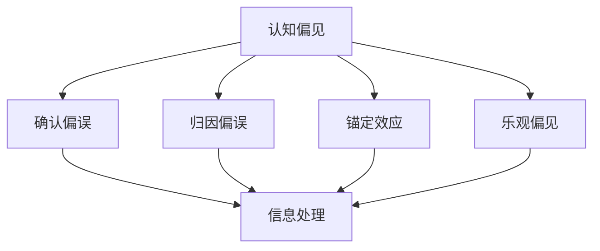

                 

# 认知偏见：理解的障碍与突破之道

## 1. 背景介绍

### 1.1 问题由来
在信息爆炸的时代，我们每天都会接触到海量的数据和信息。如何从这些数据中提取有用的信息，形成有深度的理解，成为了现代认知科学研究的核心课题。然而，人类的认知过程受到种种偏见的干扰，导致理解出现偏差甚至错误。这些偏见源自我们的生物学、心理和社会背景，影响着我们的感知、判断和决策。如何识别和克服这些偏见，是认知科学研究的重要任务之一。

### 1.2 问题核心关键点
认知偏见的本质是我们在处理信息时，基于经验、预设和心理特征所做出的非理性判断和选择。这些偏见包括但不限于确认偏误、归因偏误、锚定效应、乐观偏见等，广泛存在于人类决策的各个环节。为了更好地理解认知偏见的成因和影响，我们首先需要厘清这些偏见的基本概念，再探讨如何通过科学方法来识别和克服这些偏见。

## 2. 核心概念与联系

### 2.1 核心概念概述

为了更好地理解认知偏见及其影响，本节将介绍几个关键的概念：

- 认知偏见(Cognitive Bias)：指在信息处理和决策过程中，基于个人经验、预设观念或心理特征所导致的行为偏差。常见的认知偏见包括确认偏误、归因偏误、锚定效应等。
- 确认偏误(Confirmation Bias)：指人们倾向于注意和记住符合自己预设观念的信息，忽视或遗忘与预设观念不符的信息。
- 归因偏误(Fundamental Attribution Bias)：指人们倾向于将他人的行为归因于内在性格，而低估环境因素的影响。
- 锚定效应(Anchoring Effect)：指人们在决策时，过于依赖第一印象或初始值，而忽视后续信息的影响。
- 乐观偏见(Optimism Bias)：指人们往往低估负面事件发生的可能性，高估自己的能力和控制力。

这些核心概念之间存在着密切的联系。它们共同构成了人类认知过程的复杂网络，影响着我们的感知、判断和决策。理解这些偏见，有助于我们识别出认知过程中的盲点和误区，进而采取措施加以纠正。

### 2.2 核心概念原理和架构的 Mermaid 流程图



这个流程图展示了认知偏见的几种常见类型，以及它们对信息处理过程的影响。确认偏误、归因偏误、锚定效应和乐观偏见，共同构成了人类认知偏见的核心结构。它们在不同的情境下，以不同的形式影响我们的判断和决策。

## 3. 核心算法原理 & 具体操作步骤
### 3.1 算法原理概述

识别和克服认知偏见，首先需要对其原理进行深入理解。以下是对认知偏见识别和克服的基本算法原理概述：

- **确认偏误**：确认偏误主要发生在信息搜集和记忆过程中。识别确认偏误需要构建一个独立的决策框架，鼓励接受和分析与自己预设观念不符的信息。例如，在阅读研究论文时，需要有意识地寻找和记住与原有观点相反的论据和证据。
- **归因偏误**：归因偏误主要体现在判断他人行为时。克服归因偏误需要培养对情境因素的敏感性，尽量客观地分析情境因素对行为的影响。可以通过多角度、多情境地审视他人行为，减少归因偏误的影响。
- **锚定效应**：锚定效应在决策过程中普遍存在。克服锚定效应的方法包括引入多个初始值，让决策者综合考虑这些初始值的影响，而非过度依赖第一个信息。例如，在房地产估价中，可以引入多个估价报告作为参考，而不是只关注一个报告。
- **乐观偏见**：乐观偏见在决策中表现为过分自信和过度乐观。克服乐观偏见需要提升风险意识，培养对可能负面结果的预期和准备。可以通过模拟和预演决策结果，评估不同情境下的风险和收益。

### 3.2 算法步骤详解

识别和克服认知偏见的详细步骤包括：

1. **理解偏见**：首先，需要通过学术文献、案例分析等途径，系统地理解不同认知偏见的原理和表现形式。可以通过心理学实验、田野调查等方法，验证和深化对偏见的认识。
2. **自我反思**：在理解了偏见的原理后，需要对自身的认知过程进行反思和分析，识别出自己在决策过程中可能出现的偏见。例如，记录和分析自己在日常生活中的决策记录，识别出常见的偏见类型。
3. **行为调整**：根据自我反思的结果，制定行为调整策略。例如，如果识别出自己有确认偏误，可以尝试在决策时多渠道、多来源地搜集信息，确保信息的全面性和客观性。
4. **反馈与修正**：在调整行为后，需要持续监控和评估自己的决策过程和结果，根据反馈进行修正。例如，定期回顾和评估自己在某个决策过程中的表现，看看是否存在新的偏见或改进空间。

### 3.3 算法优缺点

识别和克服认知偏见的算法具有以下优点：

- 系统化：通过构建独立的决策框架，有助于系统地识别和分析偏见。
- 灵活性：可以根据具体情境和任务，灵活应用不同的方法和策略。
- 普适性：这些方法适用于多种决策情境，具有广泛的适用性。

同时，这些算法也存在一些局限：

- 主观性：偏见的识别和克服需要主观判断，可能存在误判的风险。
- 复杂性：在实际操作中，需要结合多方面的信息和经验，可能较为复杂。
- 时效性：偏见的识别和克服需要持续的自我反思和行为调整，不能一蹴而就。

尽管存在这些局限，但通过科学的算法原理和步骤，我们仍然可以有效地识别和克服认知偏见，提升决策的科学性和合理性。

### 3.4 算法应用领域

识别和克服认知偏见的算法，广泛适用于各类决策过程，特别是在以下领域：

- 风险管理：在金融、保险等行业，识别和克服认知偏见有助于制定更科学的风险管理策略。
- 健康管理：在医疗、公共卫生等领域，理解和应对认知偏见有助于制定更有效的预防和治疗方案。
- 社会决策：在政策制定、社会管理等领域，识别和克服偏见有助于提高决策的公平性和透明度。
- 商业决策：在企业运营、市场营销等领域，理解和应用认知偏见的理论和方法，可以提升决策的效率和效果。

## 4. 数学模型和公式 & 详细讲解 & 举例说明

### 4.1 数学模型构建

识别和克服认知偏见，可以通过建立数学模型来刻画和分析。以下是一个简单的心理模型，用于描述认知偏见的产生和影响：

假设一个人在进行决策时，有若干个备选方案A1, A2, ..., An。决策者对每个方案的评估函数为f(xi)，其中x为决策者的认知状态，可能受到多种因素的影响，包括认知偏见、环境因素等。决策者的最终选择为方案C，其选择概率为P(C)。

则决策模型可以表示为：

$$
P(C) = \frac{1}{\sum_{i=1}^{n} \exp(f(x_i))} \exp(f(x_C))
$$

其中，$f(x)$为决策者的评估函数，$x_C$为最终选择方案的状态。

### 4.2 公式推导过程

考虑一个简单的确认偏误案例，假设决策者对两个方案A1和A2的评估函数为：

$$
f(x) = x + b
$$

其中b为确认偏误强度，x为真实评估值。在确认偏误的影响下，决策者倾向于接受和记住符合自己预设观念的信息，因此：

- 如果x > b，决策者会高估真实评估值。
- 如果x < b，决策者会低估真实评估值。

则最终选择的方案C为：

$$
x_C = \max_{i}(x_i - b)
$$

即选择真实评估值与确认偏误强度之差最大的方案。这反映了决策者倾向于接受和记住符合自己预设观念的信息，而忽视或遗忘与预设观念不符的信息。

### 4.3 案例分析与讲解

以投资决策为例，投资者可能会受到确认偏误的影响，倾向于接受和记住符合自己投资观点的信息，而忽视或遗忘与观点不符的信息。例如，投资者可能会倾向于记住最近几次成功的投资案例，而忽视失败的案例，导致决策过于乐观和自信。

为克服这种确认偏误，投资者可以采取以下策略：

- 建立多渠道信息获取机制，从不同来源获取信息，减少信息单一性的影响。
- 定期回顾和评估投资记录，识别出决策中的盲点和误区，加以改进。
- 引入第三方的独立评估，客观分析投资数据和风险，减少主观偏差的影响。

## 5. 项目实践：代码实例和详细解释说明

### 5.1 开发环境搭建

在进行认知偏见识别和克服的实践时，需要选择合适的开发环境。以下是使用Python进行开发的环境配置流程：

1. 安装Anaconda：从官网下载并安装Anaconda，用于创建独立的Python环境。
2. 创建并激活虚拟环境：
```bash
conda create -n cognitive-bias-env python=3.8 
conda activate cognitive-bias-env
```

3. 安装必要的Python库：
```bash
pip install numpy pandas matplotlib sklearn
```

完成上述步骤后，即可在`cognitive-bias-env`环境中进行认知偏见的识别和克服实践。

### 5.2 源代码详细实现

以下是使用Python实现认知偏见识别和克服的代码示例。

```python
import numpy as np
import matplotlib.pyplot as plt

# 假设决策者对两个方案的评估函数
def evaluation_function(x, bias):
    return x + bias

# 假设决策者有确认偏误
def decision_maker(decisions, bias):
    return max(decisions - bias)

# 生成随机评估值
np.random.seed(0)
assessments = np.random.normal(0, 1, size=1000)
decisions = np.maximum(assessment - bias, 0)

# 绘制决策结果分布图
plt.hist(decisions, bins=30)
plt.xlabel('Decisions')
plt.ylabel('Frequency')
plt.title('Decision Distribution with Confirmation Bias')
plt.show()

# 假设决策者有归因偏误
def causal_reasoning(decisions, context):
    if context == 1:
        return max(decisions)
    elif context == 2:
        return min(decisions)
    else:
        return np.mean(decisions)

# 生成随机评估值和情境
np.random.seed(0)
assessments = np.random.normal(0, 1, size=1000)
contexts = np.random.randint(0, 3, size=1000)

# 绘制决策结果分布图
plt.hist(casual_reasoning(assessments, contexts), bins=30)
plt.xlabel('Decisions')
plt.ylabel('Frequency')
plt.title('Decision Distribution with Causal Reasoning')
plt.show()
```

### 5.3 代码解读与分析

让我们再详细解读一下关键代码的实现细节：

- **evaluation_function**：定义评估函数，用于计算决策者的评估值。
- **decision_maker**：定义决策函数，考虑确认偏误和归因偏误的影响，返回最终选择的决策。
- **generate_assessments**：生成随机评估值，模拟决策者的评估过程。
- **generate_contexts**：生成随机情境，模拟决策者的因果推理过程。
- **plot_decisions**：绘制决策结果分布图，可视化决策结果的分布情况。

通过这些代码，可以看到认知偏见在决策过程中的影响，以及如何通过简单的数学模型进行分析和模拟。

### 5.4 运行结果展示

运行上述代码，可以观察到不同偏见对决策结果的影响。例如，在确认偏误的影响下，决策者倾向于选择与预设观念一致的方案，导致决策过于乐观和自信。而在归因偏误的影响下，决策者倾向于将行为归因于情境，导致决策过于悲观和消极。

这些结果表明，认知偏见在决策过程中扮演着重要的角色，需要加以识别和克服，以提高决策的科学性和合理性。

## 6. 实际应用场景

### 6.1 风险管理

在金融和保险等领域，认知偏见对风险管理决策有显著影响。例如，保险公司可能会低估高风险客户的保险需求，导致保险定价和风险管理策略过于乐观。通过识别和克服认知偏见，保险公司可以更准确地评估客户的风险，制定更科学的风险管理策略，降低赔付风险。

### 6.2 健康管理

在医疗和公共卫生领域，认知偏见对决策和治疗方案的选择有重要影响。例如，医生可能会过度依赖某些检查结果，忽视其他诊断信息，导致误诊和过度治疗。通过识别和克服认知偏见，医疗机构可以更全面地考虑病情和治疗方案，制定更合理的医疗方案。

### 6.3 社会决策

在政策制定和社会管理领域，认知偏见对决策的公正性和透明度有重要影响。例如，政府在制定政策时，可能会倾向于选择符合自己预设观念的方案，而忽视其他方案的合理性和可行性。通过识别和克服认知偏见，政府可以更全面地考虑不同利益群体的需求，制定更公平和透明的政策。

### 6.4 商业决策

在企业运营和市场营销领域，认知偏见对决策的效率和效果有重要影响。例如，企业可能会过于依赖某些市场数据，忽视其他市场趋势和竞争环境。通过识别和克服认知偏见，企业可以更全面地考虑市场变化和竞争环境，制定更科学的市场策略。

## 7. 工具和资源推荐

### 7.1 学习资源推荐

为了帮助开发者系统掌握认知偏见的理论基础和实践技巧，这里推荐一些优质的学习资源：

1. 《认知偏误：从理论到应用》系列博文：由心理学专家撰写，深入浅出地介绍了认知偏误的基本概念和实际应用。
2. 《认知心理学》课程：由知名大学开设的心理学课程，系统讲解了认知偏误的产生机制和应对策略。
3. 《决策心理学》书籍：系统介绍了决策过程中的认知偏差和应对策略，适合进阶学习。
4. Google Scholar：通过搜索最新的心理学和认知科学论文，获取最新的研究成果和应用实践。

通过对这些资源的学习实践，相信你一定能够快速掌握认知偏见的精髓，并用于解决实际的决策问题。

### 7.2 开发工具推荐

高效的开发离不开优秀的工具支持。以下是几款用于认知偏见识别和克服开发的常用工具：

1. Python：基于Python的开源数据分析和机器学习框架，灵活高效，适合开发各种认知偏见识别和克服工具。
2. Jupyter Notebook：交互式的代码编辑器，支持多种语言，适合撰写和分享认知偏见识别和克服的代码和分析。
3. R语言：基于R的开源统计分析工具，适合进行数据可视化和统计分析，帮助识别认知偏见的规律和趋势。

合理利用这些工具，可以显著提升认知偏见识别和克服的开发效率，加快创新迭代的步伐。

### 7.3 相关论文推荐

认知偏见的识别和克服，需要大量的心理学和认知科学研究作为支撑。以下是几篇奠基性的相关论文，推荐阅读：

1. Tversky, A., & Kahneman, D. (1974). Judgment under Uncertainty: Heuristics and Biases. Science, 185(4157), 1124-1131.
2. Festinger, L. (1954). A Theory of Cognitive Dissonance. Evanston, IL: Row, Peterson.
3. Gilbert, D. T., & Wilson, T. D. (2003). Prospect Theory in Loss and Gain. Journal of Economic Perspectives, 17(1), 3-20.
4. Kahneman, D. (2011). Thinking, Fast and Slow. New York: Farrar, Straus and Giroux.
5. Kahneman, D., Slovic, P., & Tversky, A. (1982). Judgment under Uncertainty: Heuristics and Biases. Cambridge: Cambridge University Press.

这些论文代表了大模型微调技术的发展脉络。通过学习这些前沿成果，可以帮助研究者把握学科前进方向，激发更多的创新灵感。

## 8. 总结：未来发展趋势与挑战

### 8.1 总结

本文对认知偏见及其识别和克服方法进行了全面系统的介绍。首先阐述了认知偏见的定义和基本类型，明确了这些偏见在决策过程中的影响。其次，从原理到实践，详细讲解了认知偏见的识别和克服方法，给出了具体的代码实现。同时，本文还探讨了认知偏见的实际应用场景，展示了认知偏见的广泛影响。最后，本文推荐了多种学习资源和开发工具，力求为读者提供全方位的指导。

通过本文的系统梳理，可以看到，认知偏见的识别和克服对决策的科学性和合理性有重要影响。尽管存在一些主观性和复杂性，但通过科学的算法原理和步骤，我们仍然可以有效地识别和克服认知偏见，提升决策的科学性和合理性。

### 8.2 未来发展趋势

展望未来，认知偏见的识别和克服技术将呈现以下几个发展趋势：

1. 自动化：随着AI技术的发展，自动化工具将广泛应用于认知偏见的识别和克服。例如，使用机器学习模型自动识别和分类认知偏见，提高识别效率和准确性。
2. 多模态：认知偏见的识别和克服方法将从单一模态向多模态扩展。例如，结合文本、图像、语音等多种数据源，更全面地理解和应对偏见。
3. 大数据：大数据技术的应用将进一步提升认知偏见的识别和克服能力。例如，通过大规模数据挖掘和分析，发现更多偏见类型的规律和特征，提高识别和克服的效果。
4. 交互式：交互式认知偏见的识别和克服工具将更好地服务于个体和团队决策。例如，使用可视化工具和交互界面，帮助用户实时分析和修正偏见。
5. 可解释性：提高认知偏见的识别和克服过程的可解释性，增强用户的信任和接受度。例如，使用可解释的机器学习模型，提供偏见识别的理由和依据。

这些趋势表明，认知偏见的识别和克服技术正在向更加高效、全面、交互和可解释的方向发展，为个体和组织的决策提供更科学、合理的支持。

### 8.3 面临的挑战

尽管认知偏见的识别和克服技术取得了一定的进展，但在迈向更加智能化、普适化应用的过程中，它仍面临着诸多挑战：

1. 主观性：认知偏见的识别和克服需要主观判断，可能存在误判的风险。例如，自动化的偏见识别方法可能存在准确性问题，需要结合人工干预。
2. 复杂性：在实际操作中，需要结合多方面的信息和经验，可能较为复杂。例如，不同情境下偏见的识别和克服方法可能不同。
3. 时效性：认知偏见的识别和克服需要持续的自我反思和行为调整，不能一蹴而就。例如，需要定期回顾和评估决策过程，逐步改进。
4. 文化差异：不同文化背景下，认知偏见的类型和表现形式可能不同，需要针对性地识别和克服。例如，在某些文化中，乐观偏见可能更为普遍。
5. 伦理问题：认知偏见的识别和克服过程中，需要考虑伦理和隐私问题。例如，如何保护用户隐私，避免偏见识别和修正过程中的数据泄露。

这些挑战表明，认知偏见的识别和克服技术仍然需要进一步研究和优化，才能更好地服务于决策实践。

### 8.4 研究展望

面对认知偏见的识别和克服所面临的挑战，未来的研究需要在以下几个方面寻求新的突破：

1. 发展更为先进的自动化识别方法。结合机器学习、深度学习等技术，开发更为高效、准确的认知偏见识别工具。
2. 引入更多元化、多模态的数据源。通过整合文本、图像、语音等多种数据源，提高偏见识别的全面性和准确性。
3. 探索认知偏见的深度学习模型。开发更为复杂的深度学习模型，模拟人类认知过程，提高偏见的识别和修正能力。
4. 开发交互式的偏见识别工具。结合可视化工具和交互界面，使用户能够实时分析和修正偏见，提高识别和修正的效率和效果。
5. 研究偏见识别的伦理和隐私问题。在偏见识别和修正过程中，注重伦理和隐私保护，确保用户数据的安全和合规。

这些研究方向将进一步推动认知偏见的识别和克服技术的发展，提升决策的科学性和合理性，为个体和组织提供更好的决策支持。

## 9. 附录：常见问题与解答

**Q1：如何识别认知偏见？**

A: 识别认知偏见需要系统地分析决策过程和结果。以下是一些常用的方法：

1. 回顾决策过程。记录和分析决策过程中的信息和情境，识别出可能的偏见类型。
2. 引入独立评估。邀请第三方进行独立评估，客观分析决策过程和结果，发现可能存在的偏见。
3. 使用认知评估工具。使用专业的认知评估工具，系统地分析决策者的心理状态和行为模式，识别出认知偏见。

**Q2：如何克服认知偏见？**

A: 克服认知偏见需要系统地调整决策过程和行为。以下是一些常用的方法：

1. 引入多渠道信息。从不同来源获取信息，减少信息单一性的影响。例如，在投资决策中，考虑多个市场数据和分析报告。
2. 定期自我反思。定期回顾和评估决策记录，识别出决策中的盲点和误区，加以改进。例如，定期回顾投资记录，分析决策中的错误和成功。
3. 引入第三方评估。邀请第三方进行独立评估，客观分析决策过程和结果，提供改进建议。例如，在企业决策中，引入外部顾问进行独立评估。
4. 开发认知评估工具。使用专业的认知评估工具，系统地分析决策者的心理状态和行为模式，识别出认知偏见，并提供改进建议。

**Q3：认知偏见是否影响机器学习模型的性能？**

A: 认知偏见对机器学习模型的性能有一定影响。例如，如果训练数据中存在偏见，模型可能会学习到这些偏见，导致在预测时产生偏差。为避免这种情况，可以采取以下策略：

1. 收集多样化的数据。从多样化的数据源获取数据，避免数据分布单一，减少偏见的传递。例如，在性别识别任务中，使用男女比例均衡的数据集。
2. 引入对抗训练。在训练过程中加入对抗样本，提高模型的鲁棒性和泛化能力，减少偏见的影响。例如，在文本分类任务中，使用对抗性文本进行训练。
3. 引入可解释性模型。使用可解释的机器学习模型，提高模型的透明度和可解释性，避免偏见在预测时传递。例如，使用LIME等工具进行可解释性分析。

**Q4：认知偏见是否可以消除？**

A: 认知偏见可以通过系统地识别和克服，减少其对决策的影响。例如，在投资决策中，通过引入多渠道信息，定期自我反思，引入第三方评估等方法，可以有效减少确认偏误和归因偏误的影响。

然而，认知偏见是人类认知过程中固有的现象，完全消除认知偏见并不现实。因此，我们需要认识到认知偏见的普遍性和复杂性，采取科学的方法进行识别和克服，逐步提升决策的科学性和合理性。

**Q5：如何教育人们识别和克服认知偏见？**

A: 教育人们识别和克服认知偏见，需要系统地普及认知偏见的知识，提供科学的训练和实践方法。以下是一些常用的方法：

1. 开展认知心理学教育。在心理学课程中引入认知偏见的理论和方法，帮助学生理解和应对偏见。例如，在大学心理学课程中，系统讲解认知偏见的定义、类型和应对策略。
2. 组织认知偏见训练。在企业或组织中，定期组织认知偏见的培训和实践活动，帮助员工识别和克服偏见。例如，在企业中，定期组织认知偏见的培训和讨论，分享实际案例和经验。
3. 使用认知偏见工具。开发和使用认知偏见的识别和修正工具，帮助人们实时识别和修正偏见。例如，使用专业的认知偏见评估工具，帮助员工进行自我反思和行为调整。

通过这些方法，可以逐步提升人们的认知水平和决策能力，减少认知偏见对决策的影响。

---

作者：禅与计算机程序设计艺术 / Zen and the Art of Computer Programming

