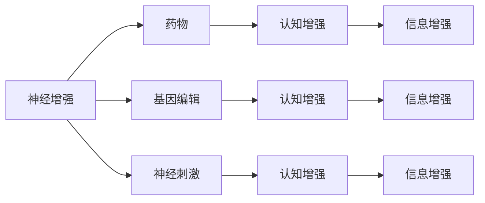

                 

# 认知增强与伦理：人类增强技术的争议

> 关键词：认知增强, 人类增强技术, 伦理争议, 智能增强, 神经科学, 人工智能, 伦理原则, 政策法规

## 1. 背景介绍

在科技迅猛发展的今天，人类增强技术（Human Augmentation Technology），特别是认知增强技术，正在引起前所未有的广泛关注。这类技术旨在通过先进的生物医学、神经科学和人工智能等手段，提升人类智力和认知能力。例如，通过脑机接口（BCI）、深度脑刺激（DBS）、基因编辑技术（如CRISPR-Cas9）、脑波监测和解码技术等，实现对大脑的直接干预，从而增强人类的记忆、注意力、决策能力等。然而，这些技术的实施不仅涉及复杂的生物学和工程学原理，更触及深层次的伦理、法律和社会问题。本文将深入探讨认知增强技术的主要内容、潜在应用和伦理争议，为技术应用的伦理边界和政策制定提供参考。

## 2. 核心概念与联系

### 2.1 核心概念概述

人类增强技术（Human Augmentation Technology, HAT），旨在通过技术手段增强人类的认知能力，提升记忆、注意力、决策等智力和心理功能。该技术涉及多个交叉学科，包括神经科学、生物医学、工程学、心理学、计算机科学等。其主要类型包括：

- **神经增强**：通过药物、基因编辑和神经刺激等手段，增强神经系统的功能。
- **认知增强**：利用神经科学原理，通过电刺激、光刺激等技术手段，改善记忆、注意力、学习等认知能力。
- **信息增强**：利用人工智能技术，提升信息处理和认知推理能力，如计算机辅助诊断、认知增强软件等。

这些技术的实施涉及到人体的生物学机制和复杂的伦理问题，需要在科学研究和应用推广中谨慎进行。

### 2.2 核心概念原理和架构的 Mermaid 流程图



这个流程图展示了人类增强技术的几种主要类型及其应用手段。不同技术手段针对不同的认知需求，但也存在交叉应用的可能性。

## 3. 核心算法原理 & 具体操作步骤

### 3.1 算法原理概述

人类增强技术的算法原理，主要基于神经科学和认知心理学对大脑功能的理解。其核心思想是通过技术手段，干预大脑的特定区域或网络，以实现认知功能的增强。

- **神经增强**：通过药物干预（如神经递质调节药物）、基因编辑（如CRISPR-Cas9）和神经刺激（如深度脑刺激）等方式，增强神经元的功能和连接性。
- **认知增强**：利用脑电图（EEG）、功能性磁共振成像（fMRI）等技术，监测大脑活动，并通过电刺激、光刺激等手段，改善特定认知功能。
- **信息增强**：利用人工智能技术，如机器学习、自然语言处理（NLP）等，处理和分析复杂的信息，提升信息处理和决策能力。

### 3.2 算法步骤详解

以下以深度脑刺激（DBS）技术为例，详细讲解其实现步骤：

1. **脑区选择**：根据目标增强的认知功能，选择适当的大脑区域进行刺激。例如，海马体和杏仁核与记忆有关，前额叶与决策和执行功能有关。
2. **电极植入**：在选定的大脑区域植入电极，并连接到体外控制设备。
3. **电刺激设置**：根据实验或临床需求，设置合适的电刺激参数，如刺激电流、频率和波形。
4. **信号监测与反馈**：通过脑电图或功能磁共振成像等技术，实时监测大脑活动，并通过反馈机制调整电刺激参数。
5. **效果评估**：评估电刺激对认知功能的影响，如记忆增强、注意力改善等。

### 3.3 算法优缺点

人类增强技术在提升认知能力方面具有显著的优势，但也存在一些潜在的风险和伦理问题：

#### 优点

1. **认知提升**：能够显著提升个体的认知功能，如记忆力、注意力、学习能力等。
2. **非侵入性**：部分技术手段如药物和软件增强，无需手术，降低了安全风险。
3. **广泛应用**：技术手段多样，可以针对不同人群和不同需求进行个性化增强。

#### 缺点

1. **安全性**：电极植入和电刺激等技术存在一定的安全风险，如感染、出血等。
2. **伦理争议**：涉及人体干预，存在广泛的伦理争议，如自主权、知情同意、隐私保护等。
3. **依赖性**：长期依赖增强技术可能削弱自然认知能力，产生“依赖症”。

### 3.4 算法应用领域

人类增强技术在多个领域具有广泛的应用前景，如：

- **医疗健康**：用于认知障碍、阿尔茨海默病、抑郁症等疾病的治疗。
- **教育培训**：提升学生的记忆力和学习能力，提高教育质量。
- **职业训练**：提高士兵、飞行员等职业群体的认知能力，提升工作效率和安全性。
- **信息处理**：增强信息处理和决策能力，应用于商业、金融等领域。

## 4. 数学模型和公式 & 详细讲解 & 举例说明

### 4.1 数学模型构建

在人类增强技术的实现过程中，数学模型起着重要的作用。以深度脑刺激为例，其数学模型主要包括以下几个方面：

- **电极模型**：描述电极在大脑中的位置和形状，以及电极与脑组织之间的相互作用。
- **神经元模型**：模拟神经元的活动和电信号传播。
- **刺激模型**：描述电刺激的参数和效果，如电流、频率、刺激时间和波形等。
- **反馈模型**：基于实时监测的数据，动态调整刺激参数，优化效果。

### 4.2 公式推导过程

以深度脑刺激为例，电刺激的效果可以通过以下几个关键参数来量化：

- **电流强度**：I，单位为毫安（mA）。
- **刺激频率**：f，单位为赫兹（Hz）。
- **刺激持续时间**：t，单位为秒（s）。

假设电刺激在神经元上产生的膜电位变化为 $V_m$，其公式可以表示为：

$$
V_m = I \cdot R
$$

其中 $R$ 为电极与脑组织之间的电阻，$R = \rho \cdot L / \pi r^2$，$\rho$ 为电阻率，$L$ 为电极长度，$r$ 为电极半径。

### 4.3 案例分析与讲解

一个典型的深度脑刺激案例是治疗阿尔茨海默病。通过对海马体和内侧前额叶的刺激，可以改善患者的记忆力和学习能力。实验中，通常采用40Hz的频率和0.5毫安的电流，刺激时间从0.1秒到1秒不等。通过调整这些参数，研究人员可以探索最优的刺激方案，提升患者认知功能。

## 5. 项目实践：代码实例和详细解释说明

### 5.1 开发环境搭建

开发人类增强技术涉及多种硬件和软件工具，需要以下基本配置：

- **计算机**：高性能PC或工作站，支持并行计算。
- **神经刺激设备**：如Brain Products公司生产的深度脑刺激设备。
- **脑电图设备**：如EEG数据采集系统，用于实时监测大脑活动。
- **编程语言和工具**：如Python、MATLAB、C++、MATLAB等。

### 5.2 源代码详细实现

以下是一个简单的深度脑刺激代码示例，使用Python进行电刺激参数的模拟：

```python
import numpy as np
import matplotlib.pyplot as plt

# 电极参数
rho = 300.0  # 电阻率，单位：欧姆米
L = 1.0      # 电极长度，单位：厘米
r = 0.1      # 电极半径，单位：厘米

# 刺激参数
I = 0.5      # 电流强度，单位：毫安
f = 40.0     # 频率，单位：赫兹
t = 0.5      # 刺激持续时间，单位：秒

# 电极与脑组织之间的电阻
R = rho * L / (np.pi * r**2)

# 电刺激产生的膜电位变化
V_m = I * R * f * t
print(f"电刺激产生的膜电位变化为: {V_m} 毫伏")

# 绘制电刺激效果图
plt.plot(t, V_m)
plt.xlabel('时间 (s)')
plt.ylabel('膜电位变化 (mV)')
plt.title('电刺激产生的膜电位变化')
plt.show()
```

### 5.3 代码解读与分析

此代码片段实现了深度脑刺激中电极与脑组织之间电信号的计算，并通过绘制图形展示电刺激产生的膜电位变化。关键步骤如下：

1. **参数定义**：定义电极参数和刺激参数。
2. **电极电阻计算**：根据电极几何参数和电阻率计算电极与脑组织之间的电阻。
3. **电刺激效果计算**：根据电流、电阻和频率，计算电刺激产生的膜电位变化。
4. **图形绘制**：使用Matplotlib库绘制电刺激效果的图形，便于直观理解。

## 6. 实际应用场景

### 6.1 医疗健康

在医疗健康领域，深度脑刺激等技术已被广泛应用于治疗抑郁症、帕金森病、癫痫等神经疾病。这些技术不仅提高了患者的生活质量，还为神经科学的研究提供了新的思路和方法。

### 6.2 教育培训

在教育培训领域，认知增强技术可以提升学生的学习能力，促进个性化教育的发展。例如，通过脑波监测和反馈系统，教师可以实时了解学生的注意力和理解情况，并根据反馈调整教学策略。

### 6.3 职业训练

在职业训练领域，认知增强技术可以提升飞行员、士兵等职业群体的认知能力，提高工作效率和安全性。例如，通过训练士兵的决策能力和反应速度，可以显著提升其在复杂战场环境中的生存能力和战斗效能。

## 7. 工具和资源推荐

### 7.1 学习资源推荐

1. **《神经科学与认知增强技术》**：一本综合介绍神经科学与认知增强技术的书籍，适合初学者入门。
2. **Coursera《神经科学和认知增强》课程**：由斯坦福大学教授授课，涵盖神经科学基础和认知增强技术的应用。
3. **IEEE Xplore数据库**：收录了大量人类增强技术的最新研究成果，适合深入学习和研究。
4. **Nature Human Neuroscience杂志**：收录了大量关于认知增强技术的学术文章，涵盖最新研究进展和应用案例。

### 7.2 开发工具推荐

1. **MATLAB**：支持高级数学计算和可视化，适合神经科学和认知增强技术的研究和仿真。
2. **Python**：编程语言中的一种，拥有丰富的神经科学和认知增强技术相关的库和工具，如Nilearn、Brain Connectivity Toolbox等。
3. **MATLAB Neural Modeling Toolbox**：支持构建和仿真神经元模型，用于研究电刺激等技术的效果。
4. **Simulink**：MATLAB的仿真平台，支持多物理域的建模和仿真，适合复杂系统的设计和优化。

### 7.3 相关论文推荐

1. **"Deep Brain Stimulation in Parkinson's Disease: From Basic Science to Clinical Practice"**：综述了深度脑刺激在帕金森病中的应用和研究进展。
2. **"Human Brain Stimulation: From Basic Science to Clinical Applications"**：综述了人类脑刺激技术的理论基础和临床应用，涵盖多种技术手段和效果评估。
3. **"Neural Engineering for Brain-Cognitive Interfaces"**：介绍了神经工程在脑-认知接口中的应用，涵盖了技术原理和实现方法。
4. **"Transcranial Direct Current Stimulation for Cognitive Enhancement: A Review"**：综述了经颅直流电刺激（tDCS）在认知增强中的应用和效果。

## 8. 总结：未来发展趋势与挑战

### 8.1 未来发展趋势

人类增强技术正处于快速发展阶段，未来趋势主要体现在以下几个方面：

1. **技术融合**：认知增强技术将与人工智能、虚拟现实（VR）、增强现实（AR）等技术深度融合，提升整体效果和用户体验。
2. **个体化定制**：基于大数据和机器学习技术，为每个个体量身定制最优的增强方案，提高效果和安全性。
3. **伦理与法律框架**：随着技术的发展，各国将逐步建立健全的伦理和法律框架，规范人类增强技术的应用和推广。

### 8.2 未来挑战

尽管认知增强技术具有巨大的应用潜力，但也面临着诸多挑战：

1. **安全性**：电极植入和电刺激等技术存在一定的安全风险，需要通过技术手段和临床试验不断优化。
2. **伦理争议**：人类增强技术涉及人体干预，存在广泛的伦理争议，如自主权、知情同意、隐私保护等。
3. **社会接受度**：认知增强技术需要得到社会的广泛接受和支持，才能实现大规模应用。
4. **经济成本**：高昂的研发和应用成本，可能限制技术在实际中的应用。

### 8.3 研究展望

未来研究需要在以下几个方面取得突破：

1. **多模态整合**：将认知增强技术与多种传感器和信息源整合，实现更全面、更精确的认知增强。
2. **智能化优化**：引入人工智能算法，实时调整电刺激等技术参数，实现个性化、自适应增强。
3. **伦理与法律研究**：建立健全的伦理和法律框架，规范认知增强技术的应用和推广。
4. **跨学科合作**：加强神经科学、医学、工程学、心理学等多学科合作，推动认知增强技术的持续进步。

## 9. 附录：常见问题与解答

**Q1: 人类增强技术对大脑有什么影响？**

A: 人类增强技术通过电刺激、药物干预等方式，可以增强大脑的特定功能，如记忆力、注意力、学习能力等。但长期依赖增强技术可能削弱自然认知能力，产生“依赖症”。

**Q2: 人类增强技术的安全性如何？**

A: 电极植入和电刺激等技术存在一定的安全风险，如感染、出血等。需要通过严格的临床试验和监管，确保技术的安全性和有效性。

**Q3: 如何保障人类增强技术的伦理问题？**

A: 保障人类增强技术的伦理问题需要建立健全的伦理和法律框架，明确知情同意、隐私保护等关键点。同时加强监管和审计，确保技术应用的透明性和公正性。

**Q4: 人类增强技术的未来发展方向是什么？**

A: 人类增强技术的未来发展方向主要体现在技术融合、个体化定制、伦理与法律框架等方面。通过跨学科合作和技术创新，推动认知增强技术的持续进步和广泛应用。

---

作者：禅与计算机程序设计艺术 / Zen and the Art of Computer Programming

