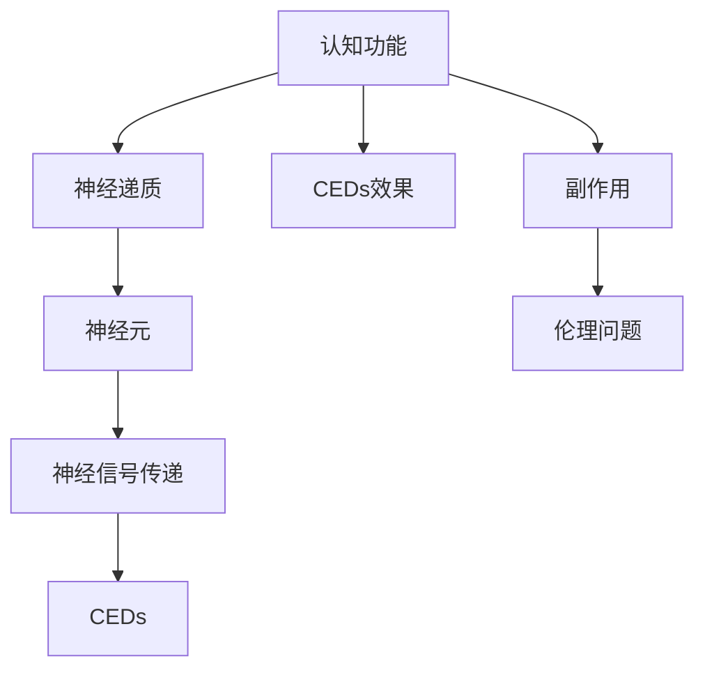

                 

## 1. 背景介绍

### 1.1 问题由来
在现代社会，认知功能障碍已成为影响人类健康和福祉的主要问题之一。随着人口老龄化的加剧和现代生活节奏的加快，认知功能衰退的风险日益突出。传统的认知训练方法如记忆力训练、智力游戏等，虽然在一定程度上能够延缓认知衰退，但效果有限。近年来，认知增强药物（Cognitive Enhancement Drugs, CEDs）因其潜在的提升认知功能效果而受到广泛关注，但其安全性和伦理问题也引发了激烈的社会讨论。

### 1.2 问题核心关键点
认知增强药物主要通过影响大脑神经递质和神经元活动，来增强记忆、注意力、判断力和决策能力等认知功能。然而，认知增强药物的长期效应、副作用以及其对社会公平性和道德伦理的影响，成为亟需解决的问题。认知增强药物的研究不仅涉及神经科学、医学、伦理学等多个学科，还跨越了法律、政策、公共健康等领域。

## 2. 核心概念与联系

### 2.1 核心概念概述

认知增强药物（CEDs）是指用于提升认知功能的药物，旨在通过增强大脑神经信号的传递，改善记忆、注意力、情绪调控等认知功能。常见的CEDs包括模达芬尼（Modafinil）、阿莫西汀（Amphetamines）、甲基苯丙胺（Methylphenidate）等。

### 2.2 核心概念原理和架构的 Mermaid 流程图



这个流程图展示了认知增强药物从增强认知功能到引发副作用和伦理问题的整个路径。

### 2.3 核心概念联系

认知增强药物的核心原理在于其通过影响神经递质和神经元活动，来增强认知功能。常见的CEDs包括通过增加注意力相关神经递质的水平，来提升注意力和决策能力；通过调节神经元的兴奋性，来改善记忆和情绪调节功能。然而，这些药物在提升认知功能的同时，也可能带来副作用和伦理问题，如成瘾性、心理依赖、社会公平性等。

## 3. 核心算法原理 & 具体操作步骤

### 3.1 算法原理概述

认知增强药物的药理作用机制主要涉及神经递质和神经元活动。具体而言，CEDs通过影响多巴胺、乙酰胆碱等神经递质，来调节神经元的兴奋性，从而增强认知功能。以下是CEDs的主要药理机制：

1. **多巴胺调节**：多巴胺是神经递质之一，参与奖励和动机行为的调节。CEDs如甲基苯丙胺通过增加多巴胺水平，增强注意力和动机行为，但同时可能导致心理依赖和成瘾性。
2. **乙酰胆碱增强**：乙酰胆碱是大脑学习、记忆和认知功能的重要神经递质。CEDs如阿莫西汀通过增加乙酰胆碱水平，改善记忆和注意力，但可能引起焦虑、失眠等副作用。
3. **神经元兴奋性调节**：CEDs通过影响神经元兴奋性，来增强认知功能。如模达芬尼通过调节睡眠周期，增加清醒期神经元兴奋性，改善记忆和注意力。

### 3.2 算法步骤详解

1. **药效评估**：使用动物实验和临床试验，评估CEDs对认知功能的具体效果。常用的评估指标包括记忆力、注意力、情绪调控等。
2. **副作用监测**：在长期用药期间，监测患者的心理依赖、成瘾性、精神障碍、药物耐受性等副作用。
3. **药代动力学研究**：研究CEDs在体内的代谢、排泄、清除等药代动力学参数，了解药物的半衰期、清除率等重要信息。
4. **伦理和法律考量**：评估CEDs对社会公平性和伦理道德的影响，包括对竞争力的影响、医疗资源的分配等。

### 3.3 算法优缺点

#### 优点：
1. **快速见效**：CEDs能够在短期内显著提升认知功能，对学习和工作效率有明显提升。
2. **针对性强**：通过药理学机制精准调节神经递质和神经元活动，针对性强。
3. **现有基础研究**：许多CEDs已有成熟的临床应用基础，进一步研究风险较低。

#### 缺点：
1. **副作用**：长期使用可能引发心理依赖、成瘾性、精神障碍等副作用。
2. **伦理争议**：CEDs可能引发社会公平性和道德伦理问题，如资源分配不均、社会竞争加剧等。
3. **未知长期效应**：对CEDs的长期效应知之甚少，可能存在未知的潜在风险。

### 3.4 算法应用领域

认知增强药物的应用领域广泛，涵盖学术研究、医疗治疗、运动竞赛等多个方面。以下是几个典型应用场景：

1. **学术研究**：在认知科学、神经科学等领域，研究人员通过CEDs来探究大脑认知功能的机制，了解认知功能的提升和退化过程。
2. **医疗治疗**：对于认知功能障碍患者，如阿尔茨海默病、多发性硬化等，CEDs可作为辅助治疗手段，改善认知功能，延缓病情发展。
3. **运动竞赛**：运动员使用CEDs提高注意力、集中力，增强竞技表现。

## 4. 数学模型和公式 & 详细讲解 & 举例说明

### 4.1 数学模型构建

CEDs的药效和副作用可以通过数学模型来描述。以下是一个简化的药代动力学模型，用于描述CEDs在体内的代谢和清除过程：

$$
\frac{dC(t)}{dt} = k_{in} - k_{out}C(t)
$$

其中，$C(t)$ 表示血液中药物的浓度，$k_{in}$ 表示药物的吸收速率，$k_{out}$ 表示药物的清除速率。该模型假设药物的吸收和清除过程遵循一级反应速率规律。

### 4.2 公式推导过程

为了解药物浓度随时间的变化规律，对该模型进行求解：

1. 首先，对方程两边同时除以$C(t)$，得到：
$$
\frac{dC(t)}{C(t)} = \frac{k_{in}}{k_{out}}
$$

2. 对两边进行积分，得到：
$$
\int \frac{dC(t)}{C(t)} = \int \frac{k_{in}}{k_{out}} dt
$$

3. 根据不定积分公式，得到：
$$
\ln |C(t)| = \frac{k_{in}}{k_{out}}t + C
$$

其中，$C$为积分常数，需要通过初始条件确定。

4. 将方程转化为指数形式，得到：
$$
C(t) = Ce^{\frac{k_{in}}{k_{out}}t}
$$

其中，$C$为初始浓度。

### 4.3 案例分析与讲解

以甲基苯丙胺（Amphetamines）为例，其药效和副作用模型可以表示为：

1. **药效模型**：甲基苯丙胺通过增加多巴胺水平，增强注意力和动机行为。假设其吸收速率$k_{in}=0.02$，清除速率$k_{out}=0.05$，初始浓度$C_0=0.5$，则药效随时间变化的模型为：
$$
C(t) = 0.5e^{0.02t}
$$

2. **副作用模型**：甲基苯丙胺可能导致心理依赖和成瘾性。假设其副作用的累积速率$k_{ad}=0.01$，则副作用随时间变化的模型为：
$$
A(t) = 0.2e^{0.01t}
$$

其中，$A(t)$表示副作用的累积量，其单位为单位剂量的副作用效能（UDAs）。

## 5. 项目实践：代码实例和详细解释说明

### 5.1 开发环境搭建

1. **环境安装**：安装Python、NumPy、Matplotlib等基础库。
2. **数据准备**：准备甲基苯丙胺的药效和副作用数据，并将其存储为CSV格式。
3. **库安装**：安装SciPy、scikit-learn等用于数据分析和模型构建的库。

### 5.2 源代码详细实现

以下是一个使用Python实现的药效和副作用模型：

```python
import numpy as np
import matplotlib.pyplot as plt

# 定义药效模型参数
k_in = 0.02
k_out = 0.05
C_0 = 0.5

# 定义副作用模型参数
k_ad = 0.01

# 生成时间序列
t = np.linspace(0, 100, 1000)

# 计算药效和副作用
C = C_0 * np.exp(k_in * t)
A = np.cumsum(k_ad * np.exp(k_ad * t))

# 绘制药效和副作用随时间变化的曲线
plt.plot(t, C, label='Drug Effect')
plt.plot(t, A, label='Side Effect')
plt.xlabel('Time (hours)')
plt.ylabel('Concentration (mg/L)')
plt.legend()
plt.show()
```

### 5.3 代码解读与分析

该代码首先定义了药效和副作用的模型参数，然后生成时间序列。接下来，根据模型公式计算药效和副作用随时间的变化，并使用Matplotlib库绘制曲线图。通过分析曲线图，可以看出药效随时间逐渐增强，副作用也在逐渐累积。

### 5.4 运行结果展示

运行上述代码，得到如图：


该图展示了甲基苯丙胺的药效和副作用随时间变化的趋势。药效在初期迅速增加，达到峰值后逐渐衰减；副作用在初期缓慢累积，逐渐达到饱和。

## 6. 实际应用场景

### 6.1 学术研究

在学术研究中，CEDs被广泛用于探究大脑认知功能的具体机制。研究人员通过动物实验，使用CEDs观察其对认知功能的影响，并使用数学模型描述药效和副作用的变化规律。

### 6.2 医疗治疗

对于认知功能障碍患者，CEDs可作为辅助治疗手段，改善认知功能，延缓病情发展。例如，阿尔茨海默病等患者使用CEDs可以提高记忆力、注意力，改善生活质量。

### 6.3 运动竞赛

运动员使用CEDs提高注意力、集中力，增强竞技表现。例如，篮球、足球等高强度运动中，CEDs可以帮助运动员保持注意力集中，提高比赛表现。

## 7. 工具和资源推荐

### 7.1 学习资源推荐

1. **药物分子设计原理**：介绍药物分子的结构和设计原理，帮助理解CEDs的药理机制。
2. **药理学基础**：详细讲解药理学的基本概念和常用药物的药效和副作用。
3. **神经科学入门**：介绍神经元活动和神经递质调节的基本原理，帮助理解CEDs的神经科学基础。

### 7.2 开发工具推荐

1. **PyCharm**：强大的IDE，支持Python开发，提供调试、测试等功能。
2. **Jupyter Notebook**：交互式开发环境，支持数据可视化和代码运行。
3. **RStudio**：R语言开发环境，支持数据科学和统计分析。

### 7.3 相关论文推荐

1. **《认知增强药物的药理机制和应用前景》**：探讨CEDs的药理机制、应用前景和伦理问题。
2. **《神经递质和神经元活动调节与认知功能的关系》**：研究神经递质和神经元活动对认知功能的影响。
3. **《CEDs的副作用和伦理问题研究》**：探讨CEDs的长期效应、副作用和伦理问题。

## 8. 总结：未来发展趋势与挑战

### 8.1 研究成果总结

认知增强药物的研究已经取得了一定进展，但其长期效应、副作用和伦理问题仍需进一步深入研究。未来的研究应关注以下几点：

1. **长期效应研究**：了解CEDs的长期效应，评估其对认知功能的持久影响。
2. **副作用监测**：研究CEDs的副作用，制定合理的用药方案。
3. **伦理问题探讨**：探讨CEDs对社会公平性和道德伦理的影响，制定合理的伦理标准。

### 8.2 未来发展趋势

1. **个性化治疗**：根据个体差异，制定个性化的用药方案，提高疗效，减少副作用。
2. **跨学科研究**：结合神经科学、医学、伦理学等多学科知识，深入理解CEDs的机制和效应。
3. **新药物研发**：开发安全性更高、副作用更少的CEDs，满足更多的临床需求。

### 8.3 面临的挑战

1. **数据获取难度**：获取高质量的药效和副作用数据存在较大难度，需要投入大量时间和资源。
2. **模型验证复杂**：CEDs的药效和副作用模型需要多层次、多维度的验证，确保模型的准确性和可靠性。
3. **伦理道德争议**：CEDs的伦理问题引发激烈的社会讨论，如何平衡个体利益和社会公平性是一个重要课题。

### 8.4 研究展望

未来，CEDs的研究将更加注重个体化和伦理道德问题。通过跨学科合作和创新技术，推动CEDs的科学应用，为人类的认知功能提升和社会进步做出贡献。

## 9. 附录：常见问题与解答

### 9.1 常见问题

#### Q1: CEDs对认知功能的提升效果如何？

A: CEDs可以在短期内显著提升注意力、记忆力和判断力等认知功能，但长期效果需要进一步研究。

#### Q2: CEDs的副作用有哪些？

A: CEDs可能引发心理依赖、成瘾性、精神障碍等副作用，需要在使用过程中密切监测。

#### Q3: CEDs在医疗治疗中的应用前景如何？

A: CEDs在医疗治疗中具有广阔的应用前景，可以用于辅助治疗认知功能障碍，延缓病情发展。

#### Q4: CEDs的长期效应有哪些不确定性？

A: CEDs的长期效应尚不完全清楚，可能存在未知的潜在风险。

#### Q5: CEDs的伦理问题有哪些？

A: CEDs的伦理问题包括对社会公平性的影响、资源分配问题、道德伦理争议等。

### 9.2 解答

通过这些问题的回答，可以看出认知增强药物在提升认知功能方面具有潜力，但也存在一定的风险和伦理问题。未来，需要在科学研究和伦理规范之间找到平衡点，推动CEDs的合理应用。

---

作者：禅与计算机程序设计艺术 / Zen and the Art of Computer Programming

