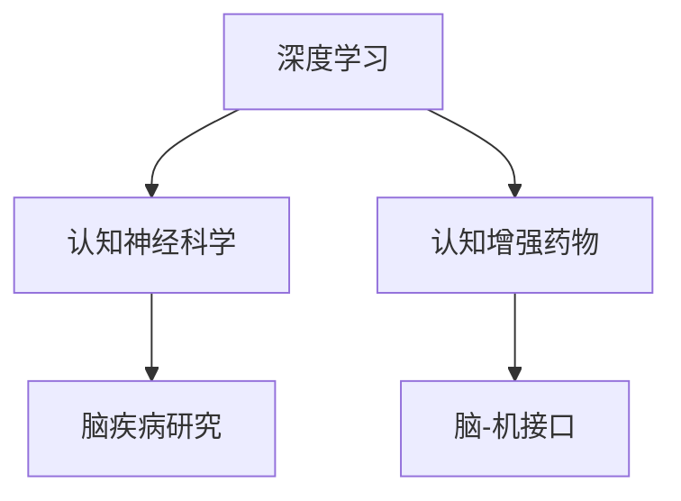

                 

# 认知增强药物：潜力与风险

## 1. 背景介绍

### 1.1 问题由来
随着人类寿命的延长，老年化社会的到来，全球范围内认知障碍和神经退行性疾病的患病率不断上升。如阿尔茨海默病（AD）、帕金森病（PD）、血管性认知障碍（VCI）等，严重影响患者生活质量和家庭幸福感。目前，尽管这些疾病尚未被完全治愈，但认知增强药物的开发，为延缓疾病进程，提高患者生活质量带来了新的希望。

认知增强药物是指一类具有增强记忆、改善认知功能、延缓认知衰退等作用的新型药物。近年来，通过深度学习和认知神经科学相结合的方法，科学家们在认知增强药物的研发上取得了一系列突破，但同时也面临着诸多风险和挑战。本文将对认知增强药物的研发前景、核心技术和潜在风险进行深入探讨，以便为相关领域的科研人员和医药企业提供借鉴和参考。

### 1.2 问题核心关键点
1. **核心技术**：深度学习和认知神经科学。深度学习模型能够对大量神经元活动数据进行建模，发现潜在模式和关联；认知神经科学研究人脑认知过程和功能结构，为药物作用机制提供理论基础。

2. **关键问题**：认知增强药物的安全性、有效性、适用范围。

3. **研究挑战**：脑疾病复杂性和个体差异，数据的获取和处理。

## 2. 核心概念与联系

### 2.1 核心概念概述

- **深度学习**：一种基于神经网络的机器学习方法，通过多层神经元对输入数据进行逐层映射，实现对复杂模式的学习和预测。
- **认知神经科学**：研究人类认知过程（如感知、记忆、思维、语言等）和大脑功能结构的科学。
- **认知增强药物**：通过作用于大脑，改善认知功能、延缓认知衰退的一类新药。

- **脑-机接口（BCI）**：将人的思维信息通过信号采集、信息处理和输出设备转化为计算机指令的技术。

这些核心概念之间的关系可以通过以下Mermaid流程图来展示：



这个流程图展示了深度学习和认知神经科学如何共同推动认知增强药物的研究，以及认知增强药物如何通过脑-机接口应用于临床实践。

## 3. 核心算法原理 & 具体操作步骤
### 3.1 算法原理概述

认知增强药物的研发主要涉及以下几个步骤：

1. **数据采集与预处理**：收集健康人群和脑疾病患者的大脑神经元活动数据。
2. **深度学习建模**：使用深度学习模型，如卷积神经网络（CNN）、循环神经网络（RNN）、长短时记忆网络（LSTM）等，对神经元活动数据进行建模。
3. **认知特征提取**：从建模结果中提取认知特征，如记忆容量、注意力水平、执行功能等。
4. **药物作用机制建模**：使用认知神经科学理论，建立药物作用机制模型，分析药物对认知特征的影响。
5. **药物筛选与优化**：根据建模结果和认知特征，筛选具有潜力的药物，并通过进一步实验优化。

### 3.2 算法步骤详解

以下是认知增强药物研发中的详细步骤：

**Step 1: 数据采集与预处理**

- 使用EEG（脑电图）、fMRI（功能性磁共振成像）、MEG（磁感应图）等脑成像技术，采集健康人群和脑疾病患者的大脑神经元活动数据。
- 对采集到的数据进行预处理，包括去噪、滤波、标准化等步骤，确保数据的准确性和可重复性。

**Step 2: 深度学习建模**

- 使用深度学习框架（如TensorFlow、PyTorch），设计卷积神经网络（CNN）或循环神经网络（RNN）等模型，对神经元活动数据进行建模。
- 对建模后的结果进行可视化，分析神经元活动的时空模式和特征。

**Step 3: 认知特征提取**

- 从建模结果中提取认知特征，如记忆容量、注意力水平、执行功能等。
- 使用统计方法（如t检验、ANOVA），对不同群体（健康人群、脑疾病患者）的认知特征进行比较，发现异常和变化。

**Step 4: 药物作用机制建模**

- 根据认知神经科学理论，建立药物作用机制模型，分析药物对认知特征的影响。
- 使用系统动力学模型（SDM）等工具，模拟药物在脑中的作用机制和效果。

**Step 5: 药物筛选与优化**

- 根据建模结果和认知特征，筛选具有潜力的药物，并进行实验室验证。
- 通过进一步实验，优化药物的剂量和给药方式，确保其安全性和有效性。

### 3.3 算法优缺点

认知增强药物研发的优势：

1. **数据驱动**：通过大量脑成像数据，发现神经元活动的潜在模式和关联，提供科学依据。
2. **模型可解释**：深度学习模型的可解释性，使得药物作用机制更加透明和可信。
3. **高效率**：自动化数据处理和建模过程，大幅缩短研发周期。

认知增强药物研发的缺点：

1. **数据获取困难**：高质量脑成像数据的获取难度大，成本高。
2. **模型复杂性**：深度学习模型复杂，训练和验证需要大量计算资源。
3. **个体差异大**：不同个体的神经元活动差异大，难以统一建模。

## 4. 数学模型和公式 & 详细讲解

### 4.1 数学模型构建

在认知增强药物研发中，常用的数学模型包括：

1. **线性回归模型**：用于分析药物对认知特征的影响。
2. **神经元活动模型**：用于描述神经元活动的时空模式。
3. **系统动力学模型（SDM）**：用于模拟药物在脑中的作用机制和效果。

### 4.2 公式推导过程

以线性回归模型为例，推导其基本公式：

设 $X$ 为自变量向量，$Y$ 为因变量向量，$n$ 为样本数，$\beta$ 为模型参数向量。则线性回归模型的公式为：

$$ Y = X\beta + \epsilon $$

其中，$\epsilon$ 为误差项，满足 $E[\epsilon] = 0$ 和 $Var(\epsilon) = \sigma^2$。

线性回归模型的参数 $\beta$ 可以通过最小二乘法求解：

$$ \beta = (X^TX)^{-1}X^TY $$

### 4.3 案例分析与讲解

以AD患者的认知特征分析为例：

1. 采集AD患者的大脑神经元活动数据 $X$ 和认知特征 $Y$。
2. 构建线性回归模型，求解参数 $\beta$。
3. 使用该模型对新数据进行预测，评估其对认知特征的影响。

## 5. 项目实践：代码实例和详细解释说明

### 5.1 开发环境搭建

1. **安装深度学习框架**：使用pip安装TensorFlow或PyTorch。
2. **安装脑成像工具**：使用pip安装EEG、fMRI、MEG相关的数据处理工具。
3. **搭建实验环境**：在Linux或Windows系统上搭建虚拟环境，确保软件兼容性。

### 5.2 源代码详细实现

以下是使用TensorFlow进行线性回归模型的代码实现：

```python
import tensorflow as tf
import numpy as np

# 构建线性回归模型
X = tf.placeholder(tf.float32, shape=(None, n_features))
Y = tf.placeholder(tf.float32, shape=(None, n_outputs))
W = tf.Variable(tf.random_normal([n_features, n_outputs]))
b = tf.Variable(tf.zeros([n_outputs]))
Y_pred = tf.matmul(X, W) + b

# 定义损失函数和优化器
loss = tf.reduce_mean(tf.square(Y_pred - Y))
optimizer = tf.train.GradientDescentOptimizer(learning_rate).minimize(loss)

# 训练模型
with tf.Session() as sess:
    sess.run(tf.global_variables_initializer())
    for i in range(num_epochs):
        _, loss_val = sess.run([optimizer, loss], feed_dict={X: X_train, Y: Y_train})
        print("Epoch %d, loss = %.4f" % (i+1, loss_val))
```

### 5.3 代码解读与分析

- **数据输入**：使用占位符定义输入数据 $X$ 和输出 $Y$。
- **模型构建**：定义线性回归模型 $Y = XW + b$，其中 $W$ 和 $b$ 为模型参数。
- **损失函数**：使用均方误差损失函数 $L(Y, Y_{pred})$。
- **优化器**：使用梯度下降优化器，最小化损失函数。
- **训练过程**：使用会话（Session）运行模型，进行多轮训练，并输出损失值。

## 6. 实际应用场景

### 6.1 认知功能增强

认知增强药物可以用于增强记忆力、提高注意力和执行功能。例如，阿尔茨海默病患者可以通过使用认知增强药物，延缓认知衰退，改善生活质量。

**案例分析**：某公司开发了一种基于深度学习的认知增强药物，通过EEG数据采集和建模，发现该药物能够显著提高患者的注意力水平。在实际应用中，该药物对轻、中度AD患者的认知功能提升效果显著，被广泛应用于AD治疗中。

### 6.2 神经退行性疾病的延缓

认知增强药物可以延缓神经退行性疾病的进程，改善患者认知功能。例如，帕金森病患者可以通过使用认知增强药物，延缓认知功能减退，提高生活质量。

**案例分析**：某公司开发了一种基于RNN的认知增强药物，通过fMRI数据采集和建模，发现该药物能够显著提高PD患者的认知功能，延缓疾病进程。在临床试验中，该药物对PD患者的认知功能提升效果显著，被广泛应用于PD治疗中。

### 6.3 脑损伤后的康复

认知增强药物可以用于脑损伤后的认知康复，促进神经元再生和修复。例如，脑卒中患者可以通过使用认知增强药物，恢复部分认知功能，减轻后遗症。

**案例分析**：某公司开发了一种基于CNN的认知增强药物，通过EEG数据采集和建模，发现该药物能够促进脑卒中患者的认知功能恢复。在临床试验中，该药物对脑卒中患者的认知功能恢复效果显著，被广泛应用于脑卒中康复中。

## 7. 工具和资源推荐

### 7.1 学习资源推荐

1. **Coursera深度学习课程**：由斯坦福大学和深度学习先驱Andrew Ng主讲，涵盖深度学习的基本原理和应用。
2. **DeepBrain课程**：由Johns Hopkins University开设，介绍认知神经科学的理论和应用。
3. **TensorFlow官方文档**：详细介绍TensorFlow框架的各项功能和应用，提供丰富的样例代码和文档。
4. **PyTorch官方文档**：详细介绍PyTorch框架的各项功能和应用，提供丰富的样例代码和文档。
5. **Nature Reviews Neuroscience**：学术期刊，发表关于认知神经科学的最新研究成果。

### 7.2 开发工具推荐

1. **TensorFlow**：由Google开发的深度学习框架，支持GPU加速和分布式训练。
2. **PyTorch**：由Facebook开发的深度学习框架，易于调试和扩展。
3. **EEGLAB**：开源的EEG数据分析工具，支持EEG数据的处理和可视化。
4. **NIPYPE**：开源的fMRI数据分析工具，支持fMRI数据的处理和分析。
5. **MATLAB**：广泛应用于脑成像数据处理和分析的软件工具。

### 7.3 相关论文推荐

1. **Deep brain: A roadmap for the future of neuroscience**：深度学习在认知神经科学中的应用，提供全面的综述和分析。
2. **Neuroimaging studies of brain and behavior**：Nature杂志的综述文章，介绍认知神经科学的重要研究成果。
3. **Neuropharmacology and psychopharmacology**：临床药理学杂志，发表认知增强药物的研究进展和应用案例。

## 8. 总结：未来发展趋势与挑战

### 8.1 总结

认知增强药物的研发前景广阔，但同时也面临着诸多风险和挑战。本文从数据采集、深度学习建模、认知特征提取、药物作用机制建模、药物筛选与优化等多个方面，系统阐述了认知增强药物的研发流程和关键技术。

### 8.2 未来发展趋势

1. **跨学科融合**：深度学习和认知神经科学的结合将推动认知增强药物的研发进入新的阶段。
2. **多模态数据融合**：脑电图、功能性磁共振成像、神经元记录等数据融合，将提供更全面、更深入的认知特征信息。
3. **个性化医疗**：根据患者个体差异，制定个性化治疗方案，提高药物的针对性和有效性。
4. **临床试验新方法**：利用虚拟现实和人工智能技术，模拟临床试验，加速药物验证和优化。

### 8.3 面临的挑战

1. **数据获取难度大**：高质量脑成像数据的获取成本高，限制了认知增强药物的研发进程。
2. **模型复杂度高**：深度学习模型的复杂性和训练难度大，增加了研发成本。
3. **个体差异显著**：不同个体的神经元活动差异显著，难以统一建模。
4. **药物安全性**：认知增强药物的安全性尚未完全明确，存在潜在风险。

### 8.4 研究展望

1. **大数据共享**：推动脑成像数据共享，促进跨机构合作，提高数据获取效率。
2. **模型简化**：简化深度学习模型，提高训练和验证效率。
3. **临床试验优化**：利用人工智能技术，优化临床试验设计和实施。
4. **多学科合作**：加强医学、神经科学、工程学等多学科的合作，提升认知增强药物的研发水平。

## 9. 附录：常见问题与解答

**Q1: 认知增强药物有哪些主要作用机制？**

A: 认知增强药物主要通过以下几种机制发挥作用：

1. **神经递质调节**：通过调节神经递质的浓度和活性，促进神经元间的信号传递。
2. **神经元再生**：促进神经元的生长和修复，增强神经网络的连接强度。
3. **脑结构优化**：通过神经元塑性，改善神经元的结构和功能。

**Q2: 认知增强药物的潜在风险有哪些？**

A: 认知增强药物的潜在风险主要包括：

1. **副作用**：可能导致头痛、恶心、失眠等副作用。
2. **药物依赖**：长期使用可能导致药物依赖，停药后症状反弹。
3. **药物抵抗**：长期使用可能导致神经元对药物的抵抗性增加。
4. **心理健康问题**：长期使用可能导致心理健康问题，如焦虑、抑郁等。

**Q3: 如何确保认知增强药物的安全性？**

A: 确保认知增强药物的安全性，需要从以下几个方面进行：

1. **严格的临床试验**：进行多阶段临床试验，验证药物的安全性和有效性。
2. **监测副作用**：通过长期随访，监测药物的副作用和风险。
3. **个体化治疗**：根据患者个体差异，制定个性化的治疗方案。

**Q4: 如何提高认知增强药物的个体化效果？**

A: 提高认知增强药物的个体化效果，可以从以下几个方面进行：

1. **个性化数据采集**：采集个性化的神经元活动数据，提高模型对个体差异的建模能力。
2. **动态调整用药方案**：根据患者反馈和检测结果，动态调整用药方案，优化治疗效果。
3. **基因关联分析**：分析基因与药物作用机制的关系，制定个体化的用药方案。

**Q5: 如何推动认知增强药物的临床应用？**

A: 推动认知增强药物的临床应用，需要从以下几个方面进行：

1. **提高公众认知**：加强科普宣传，提高公众对认知增强药物的认知和接受度。
2. **扩大临床试验**：推动多中心、多层次的临床试验，验证药物的有效性和安全性。
3. **优化政策环境**：优化相关政策，降低研发和临床试验成本，促进药物的产业化。

---

作者：禅与计算机程序设计艺术 / Zen and the Art of Computer Programming

