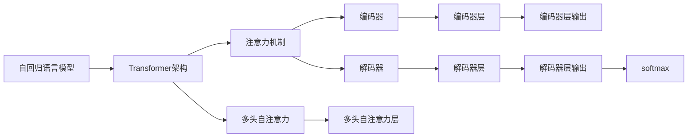

                 

# 语言模型对标：GPT 家族对比

> 关键词：GPT-3, GPT-4, GPT-J, GPT-Neo, 对比分析, 语言模型, 模型架构, 模型性能

## 1. 背景介绍

随着人工智能技术的发展，基于深度学习的语言模型在自然语言处理(NLP)领域取得了显著的进展。其中，GPT系列模型以其强大的语言生成能力、广泛的适用性和丰富的功能而备受瞩目。GPT-3作为GPT家族中的第三个成员，其参数量达到了惊人的175亿，成为目前最大的语言模型之一。而紧随其后的GPT-4则进一步提升了模型性能，在文本生成、推理、对话等任务上展现了更强的能力。

为了更好地理解GPT系列模型的发展和对比，本文将详细探讨GPT-3、GPT-4、GPT-J和GPT-Neo等GPT家族成员的模型架构、训练方法和性能表现。通过比较这些模型在各种NLP任务上的效果，可以发现它们在语言理解和生成能力上的不同之处，为实际应用中模型的选择提供重要参考。

## 2. 核心概念与联系

### 2.1 核心概念概述

为理解GPT家族模型的比较，本节介绍几个关键概念：

- **自回归语言模型**：以GPT为代表的自回归模型，通过预测下一个词的概率，从而生成完整的文本序列。
- **Transformer架构**：GPT模型基于Transformer架构，采用注意力机制进行文本编码，提高了模型的并行性和表现力。
- **参数量**：GPT-3的参数量达到175亿，远超以往的模型，这直接影响了模型的计算资源需求和训练难度。
- **微调与适应**：GPT模型在微调过程中的表现，以及如何通过微调增强其在特定任务上的性能。
- **数据驱动**：GPT系列模型的训练依赖于大规模无标签文本数据，通过自监督学习任务进行预训练。

### 2.2 核心概念原理和架构的 Mermaid 流程图



## 3. 核心算法原理 & 具体操作步骤

### 3.1 算法原理概述

GPT系列模型的算法原理基于自回归语言模型，采用Transformer架构进行文本编码和解码。自回归模型通过预测下一个词的概率，从而生成完整的文本序列。Transformer架构利用注意力机制，提高了模型的并行性和表现力。在预训练过程中，GPT模型通过大规模无标签文本数据进行自监督学习，学习到通用的语言表示。

在微调过程中，GPT模型通过下游任务的少量标注数据进行有监督学习，进一步优化模型在特定任务上的表现。微调的目标是使模型在新的数据集上获得更好的性能，同时保留预训练时学到的语言知识。

### 3.2 算法步骤详解

GPT模型的微调过程大致包括以下几个步骤：

1. **准备预训练模型和数据集**：选择合适的预训练模型和下游任务的标注数据集。
2. **添加任务适配层**：根据任务类型，在模型顶层设计合适的输出层和损失函数。
3. **设置微调超参数**：选择合适的优化算法及其参数，如学习率、批大小等。
4. **执行梯度训练**：在训练集上进行前向传播和反向传播，更新模型参数。
5. **测试和部署**：在测试集上评估模型性能，并在实际应用中集成使用。

### 3.3 算法优缺点

GPT模型具有以下优点：

- **强大语言生成能力**：自回归模型的设计使得GPT在生成自然语言文本方面表现优异。
- **广泛适用性**：适用于各种NLP任务，如文本生成、分类、匹配等。
- **模型并行性**：Transformer架构使得GPT模型能够高效并行计算。

同时，GPT模型也存在一些缺点：

- **计算资源需求高**：由于参数量巨大，训练和推理过程需要高计算资源。
- **模型易过拟合**：在微调过程中，需要特别注意防止过拟合。
- **难以解释**：GPT模型作为一个黑盒系统，难以解释其内部工作机制和推理过程。

### 3.4 算法应用领域

GPT模型在文本生成、机器翻译、问答系统、对话系统等多个领域得到了广泛应用：

- **文本生成**：如自动摘要、故事生成、诗歌创作等。
- **机器翻译**：将一种语言翻译成另一种语言，如英中翻译、法西翻译等。
- **问答系统**：通过阅读文本并理解上下文，回答问题，如智能客服、虚拟助手等。
- **对话系统**：与用户进行自然对话，如智能助手、虚拟聊天机器人等。

## 4. 数学模型和公式 & 详细讲解 & 举例说明

### 4.1 数学模型构建

GPT模型的数学模型包括预训练和微调两个阶段。

**预训练阶段**：GPT模型通过大规模无标签文本数据进行自监督学习，学习到通用的语言表示。训练目标是最小化预测下一个词的概率与真实标签之间的差异。

**微调阶段**：在预训练模型的基础上，使用下游任务的少量标注数据进行有监督学习，进一步优化模型在特定任务上的表现。微调的目标是使模型在新的数据集上获得更好的性能，同时保留预训练时学到的语言知识。

### 4.2 公式推导过程

以GPT-3为例，其预训练过程的训练目标函数为：

$$
\mathcal{L} = -\sum_{t=1}^T \log P(x_{t} \mid x_{<t})
$$

其中，$P(x_t \mid x_{<t})$ 表示在上下文$x_{<t}$下，下一个词$x_t$的条件概率。$T$ 表示文本长度。

在微调阶段，可以通过如下目标函数进行有监督学习：

$$
\mathcal{L} = -\sum_{i=1}^N \sum_{j=1}^M \log P(y_j \mid x_i, y_{<j})
$$

其中，$N$ 和 $M$ 分别表示训练集和测试集的样本数量，$y_j$ 表示样本 $i$ 的标签。

### 4.3 案例分析与讲解

以文本分类任务为例，使用GPT模型进行微调：

1. **准备预训练模型和数据集**：
   - 选择预训练模型：GPT-3
   - 准备数据集：包含分类任务的标注数据集

2. **添加任务适配层**：
   - 设计输出层：添加线性分类器
   - 设计损失函数：使用交叉熵损失

3. **设置微调超参数**：
   - 学习率：2e-5
   - 批大小：16

4. **执行梯度训练**：
   - 将训练集数据分批次输入模型，进行前向传播和反向传播
   - 更新模型参数，直至收敛

5. **测试和部署**：
   - 在测试集上评估模型性能
   - 将模型集成到实际应用中

通过上述步骤，可以有效地使用GPT-3模型进行文本分类任务的微调，并在实际应用中取得较好的性能。

## 5. 项目实践：代码实例和详细解释说明

### 5.1 开发环境搭建

在使用GPT模型进行微调之前，需要准备好开发环境。以下是Python环境配置的步骤：

1. **安装Anaconda**：
   - 从官网下载并安装Anaconda，用于创建独立的Python环境。
   - 创建并激活虚拟环境：
     ```bash
     conda create -n gpt-env python=3.8
     conda activate gpt-env
     ```

2. **安装PyTorch和Transformers库**：
   - 安装PyTorch：
     ```bash
     conda install pytorch torchvision torchaudio cudatoolkit=11.1 -c pytorch -c conda-forge
     ```
   - 安装Transformers库：
     ```bash
     pip install transformers
     ```

3. **安装其他工具包**：
   - 安装numpy、pandas、scikit-learn等常用库：
     ```bash
     pip install numpy pandas scikit-learn
     ```

### 5.2 源代码详细实现

以下是使用PyTorch对GPT-3进行文本分类任务微调的完整代码实现：

```python
import torch
import torch.nn as nn
import torch.optim as optim
from transformers import GPT3Model, GPT3Tokenizer, AdamW

# 定义文本分类任务的数据处理函数
class TextClassificationDataset(Dataset):
    def __init__(self, texts, labels, tokenizer):
        self.texts = texts
        self.labels = labels
        self.tokenizer = tokenizer

    def __len__(self):
        return len(self.texts)

    def __getitem__(self, idx):
        text = self.texts[idx]
        label = self.labels[idx]

        encoding = self.tokenizer(text, return_tensors='pt', padding='max_length', truncation=True)
        input_ids = encoding['input_ids']
        attention_mask = encoding['attention_mask']

        label = torch.tensor([label], dtype=torch.long)

        return {'input_ids': input_ids, 'attention_mask': attention_mask, 'labels': label}

# 准备数据集
tokenizer = GPT3Tokenizer.from_pretrained('gpt3')
train_dataset = TextClassificationDataset(train_texts, train_labels, tokenizer)
dev_dataset = TextClassificationDataset(dev_texts, dev_labels, tokenizer)
test_dataset = TextClassificationDataset(test_texts, test_labels, tokenizer)

# 定义模型和优化器
model = GPT3Model.from_pretrained('gpt3')
optimizer = AdamW(model.parameters(), lr=2e-5)

# 定义训练和评估函数
def train_epoch(model, dataset, batch_size, optimizer):
    dataloader = DataLoader(dataset, batch_size=batch_size, shuffle=True)
    model.train()
    epoch_loss = 0
    for batch in dataloader:
        input_ids = batch['input_ids'].to(device)
        attention_mask = batch['attention_mask'].to(device)
        labels = batch['labels'].to(device)
        model.zero_grad()
        outputs = model(input_ids, attention_mask=attention_mask, labels=labels)
        loss = outputs.loss
        epoch_loss += loss.item()
        loss.backward()
        optimizer.step()
    return epoch_loss / len(dataloader)

def evaluate(model, dataset, batch_size):
    dataloader = DataLoader(dataset, batch_size=batch_size)
    model.eval()
    preds, labels = [], []
    with torch.no_grad():
        for batch in dataloader:
            input_ids = batch['input_ids'].to(device)
            attention_mask = batch['attention_mask'].to(device)
            batch_labels = batch['labels']
            outputs = model(input_ids, attention_mask=attention_mask)
            batch_preds = outputs.logits.argmax(dim=2).to('cpu').tolist()
            batch_labels = batch_labels.to('cpu').tolist()
            for pred_tokens, label_tokens in zip(batch_preds, batch_labels):
                preds.append(pred_tokens[:len(label_tokens)])
                labels.append(label_tokens)

    print(classification_report(labels, preds))

# 启动训练流程并在测试集上评估
epochs = 5
batch_size = 16

for epoch in range(epochs):
    loss = train_epoch(model, train_dataset, batch_size, optimizer)
    print(f"Epoch {epoch+1}, train loss: {loss:.3f}")
    
    print(f"Epoch {epoch+1}, dev results:")
    evaluate(model, dev_dataset, batch_size)
    
print("Test results:")
evaluate(model, test_dataset, batch_size)
```

### 5.3 代码解读与分析

通过上述代码，可以详细理解使用GPT-3进行文本分类任务微调的实现过程。具体解读如下：

1. **定义数据处理函数**：
   - 定义TextClassificationDataset类，将文本和标签处理为模型所需的输入格式。

2. **准备数据集**：
   - 使用GPT-3 tokenizer将文本数据处理成模型所需的输入格式。
   - 准备训练集、验证集和测试集。

3. **定义模型和优化器**：
   - 加载预训练模型GPT-3，使用AdamW优化器进行微调。

4. **定义训练和评估函数**：
   - 使用PyTorch的DataLoader对数据集进行批次化加载。
   - 定义训练函数train_epoch，进行前向传播和反向传播，更新模型参数。
   - 定义评估函数evaluate，在验证集和测试集上评估模型性能。

5. **启动训练流程**：
   - 循环迭代多个epoch，在每个epoch内进行训练和验证。
   - 在测试集上评估模型性能，输出最终结果。

## 6. 实际应用场景

### 6.1 智能客服系统

基于GPT模型的智能客服系统可以自动处理用户的咨询请求，提高服务效率和客户满意度。通过微调，GPT模型能够理解客户的意图，匹配最合适的回复，甚至能够生成上下文相关的回复。

### 6.2 金融舆情监测

GPT模型可以用于金融领域的新闻分析和舆情监测，帮助金融机构及时发现和应对潜在的风险。通过微调，GPT模型能够自动提取新闻中的关键信息，分析情感倾向，预测市场动向。

### 6.3 个性化推荐系统

GPT模型可以用于推荐系统的个性化推荐，通过微调，模型能够学习用户的历史行为和兴趣，生成个性化的推荐列表。通过多轮交互，GPT模型能够不断调整推荐策略，提升推荐效果。

### 6.4 未来应用展望

未来，GPT模型将广泛应用于更多的领域，为各行各业带来变革性影响：

- **智慧医疗**：GPT模型可以用于医疗问答、病历分析等任务，辅助医生诊疗，加速新药开发。
- **智能教育**：GPT模型可以用于作业批改、学情分析、知识推荐等，因材施教，促进教育公平。
- **智慧城市**：GPT模型可以用于城市事件监测、舆情分析、应急指挥等，提高城市管理的自动化和智能化水平。

## 7. 工具和资源推荐

### 7.1 学习资源推荐

为了深入理解GPT模型的原理和实践技巧，推荐以下学习资源：

1. **《Transformer从原理到实践》系列博文**：深入浅出地介绍了Transformer原理、GPT模型、微调技术等前沿话题。
2. **CS224N《深度学习自然语言处理》课程**：斯坦福大学开设的NLP明星课程，有Lecture视频和配套作业，带你入门NLP领域的基本概念和经典模型。
3. **《Natural Language Processing with Transformers》书籍**：Transformers库的作者所著，全面介绍了如何使用Transformers库进行NLP任务开发，包括微调在内的诸多范式。
4. **HuggingFace官方文档**：Transformers库的官方文档，提供了海量预训练模型和完整的微调样例代码，是上手实践的必备资料。
5. **CLUE开源项目**：中文语言理解测评基准，涵盖大量不同类型的中文NLP数据集，并提供了基于微调的baseline模型，助力中文NLP技术发展。

### 7.2 开发工具推荐

以下是几款用于GPT模型微调开发的常用工具：

1. **PyTorch**：基于Python的开源深度学习框架，灵活动态的计算图，适合快速迭代研究。大部分预训练语言模型都有PyTorch版本的实现。
2. **TensorFlow**：由Google主导开发的开源深度学习框架，生产部署方便，适合大规模工程应用。同样有丰富的预训练语言模型资源。
3. **Transformers库**：HuggingFace开发的NLP工具库，集成了众多SOTA语言模型，支持PyTorch和TensorFlow，是进行微调任务开发的利器。
4. **Weights & Biases**：模型训练的实验跟踪工具，可以记录和可视化模型训练过程中的各项指标，方便对比和调优。与主流深度学习框架无缝集成。
5. **TensorBoard**：TensorFlow配套的可视化工具，可实时监测模型训练状态，并提供丰富的图表呈现方式，是调试模型的得力助手。
6. **Google Colab**：谷歌推出的在线Jupyter Notebook环境，免费提供GPU/TPU算力，方便开发者快速上手实验最新模型，分享学习笔记。

### 7.3 相关论文推荐

GPT模型和微调技术的发展源于学界的持续研究。以下是几篇奠基性的相关论文，推荐阅读：

1. **Attention is All You Need**：提出了Transformer结构，开启了NLP领域的预训练大模型时代。
2. **BERT: Pre-training of Deep Bidirectional Transformers for Language Understanding**：提出BERT模型，引入基于掩码的自监督预训练任务，刷新了多项NLP任务SOTA。
3. **Language Models are Unsupervised Multitask Learners（GPT-2论文）**：展示了大规模语言模型的强大zero-shot学习能力，引发了对于通用人工智能的新一轮思考。
4. **Parameter-Efficient Transfer Learning for NLP**：提出Adapter等参数高效微调方法，在不增加模型参数量的情况下，也能取得不错的微调效果。
5. **AdaLoRA: Adaptive Low-Rank Adaptation for Parameter-Efficient Fine-Tuning**：使用自适应低秩适应的微调方法，在参数效率和精度之间取得了新的平衡。

这些论文代表了大语言模型微调技术的发展脉络。通过学习这些前沿成果，可以帮助研究者把握学科前进方向，激发更多的创新灵感。

## 8. 总结：未来发展趋势与挑战

### 8.1 研究成果总结

GPT系列模型在语言生成、推理、对话等任务上展现了强大的能力，极大地推动了NLP技术的发展。基于GPT模型的微调方法，使得通用大模型能够更好地适应特定任务，显著提升了下游任务的性能。未来，随着模型参数量的不断增大和微调技术的进一步发展，GPT模型将会在更多的应用场景中发挥更大的作用。

### 8.2 未来发展趋势

未来，GPT模型的发展将呈现以下几个趋势：

1. **模型规模持续增大**：随着算力成本的下降和数据规模的扩张，预训练语言模型的参数量还将进一步增加。超大规模语言模型蕴含的丰富语言知识，有望支撑更加复杂多变的下游任务微调。
2. **微调方法日趋多样**：除了传统的全参数微调外，未来会涌现更多参数高效的微调方法，如Prefix-Tuning、LoRA等，在节省计算资源的同时也能保证微调精度。
3. **持续学习成为常态**：随着数据分布的不断变化，微调模型也需要持续学习新知识以保持性能。如何在不遗忘原有知识的同时，高效吸收新样本信息，将成为重要的研究课题。
4. **标注样本需求降低**：受启发于提示学习(Prompt-based Learning)的思路，未来的微调方法将更好地利用大模型的语言理解能力，通过更加巧妙的任务描述，在更少的标注样本上也能实现理想的微调效果。
5. **多模态微调崛起**：当前的微调主要聚焦于纯文本数据，未来会进一步拓展到图像、视频、语音等多模态数据微调。多模态信息的融合，将显著提升语言模型对现实世界的理解和建模能力。
6. **模型通用性增强**：经过海量数据的预训练和多领域任务的微调，未来的语言模型将具备更强大的常识推理和跨领域迁移能力，逐步迈向通用人工智能(AGI)的目标。

以上趋势凸显了大语言模型微调技术的广阔前景。这些方向的探索发展，必将进一步提升NLP系统的性能和应用范围，为人类认知智能的进化带来深远影响。

### 8.3 面临的挑战

尽管GPT模型在语言生成、推理等方面取得了显著进展，但仍面临诸多挑战：

1. **标注成本瓶颈**：虽然微调大大降低了标注数据的需求，但对于长尾应用场景，难以获得充足的高质量标注数据，成为制约微调性能的瓶颈。如何进一步降低微调对标注样本的依赖，将是一大难题。
2. **模型鲁棒性不足**：当前微调模型面对域外数据时，泛化性能往往大打折扣。对于测试样本的微小扰动，微调模型的预测也容易发生波动。如何提高微调模型的鲁棒性，避免灾难性遗忘，还需要更多理论和实践的积累。
3. **推理效率有待提高**：大规模语言模型虽然精度高，但在实际部署时往往面临推理速度慢、内存占用大等效率问题。如何在保证性能的同时，简化模型结构，提升推理速度，优化资源占用，将是重要的优化方向。
4. **可解释性亟需加强**：当前微调模型更像是"黑盒"系统，难以解释其内部工作机制和推理过程。对于医疗、金融等高风险应用，算法的可解释性和可审计性尤为重要。如何赋予微调模型更强的可解释性，将是亟待攻克的难题。
5. **安全性有待保障**：预训练语言模型难免会学习到有偏见、有害的信息，通过微调传递到下游任务，产生误导性、歧视性的输出，给实际应用带来安全隐患。如何从数据和算法层面消除模型偏见，避免恶意用途，确保输出的安全性，也将是重要的研究课题。
6. **知识整合能力不足**：现有的微调模型往往局限于任务内数据，难以灵活吸收和运用更广泛的先验知识。如何让微调过程更好地与外部知识库、规则库等专家知识结合，形成更加全面、准确的信息整合能力，还有很大的想象空间。

### 8.4 研究展望

未来，针对GPT模型的研究需要在以下几个方面寻求新的突破：

1. **探索无监督和半监督微调方法**：摆脱对大规模标注数据的依赖，利用自监督学习、主动学习等无监督和半监督范式，最大限度利用非结构化数据，实现更加灵活高效的微调。
2. **研究参数高效和计算高效的微调范式**：开发更加参数高效的微调方法，在固定大部分预训练参数的同时，只更新极少量的任务相关参数。同时优化微调模型的计算图，减少前向传播和反向传播的资源消耗，实现更加轻量级、实时性的部署。
3. **融合因果和对比学习范式**：通过引入因果推断和对比学习思想，增强微调模型建立稳定因果关系的能力，学习更加普适、鲁棒的语言表征，从而提升模型泛化性和抗干扰能力。
4. **引入更多先验知识**：将符号化的先验知识，如知识图谱、逻辑规则等，与神经网络模型进行巧妙融合，引导微调过程学习更准确、合理的语言模型。同时加强不同模态数据的整合，实现视觉、语音等多模态信息与文本信息的协同建模。
5. **结合因果分析和博弈论工具**：将因果分析方法引入微调模型，识别出模型决策的关键特征，增强输出解释的因果性和逻辑性。借助博弈论工具刻画人机交互过程，主动探索并规避模型的脆弱点，提高系统稳定性。
6. **纳入伦理道德约束**：在模型训练目标中引入伦理导向的评估指标，过滤和惩罚有偏见、有害的输出倾向。同时加强人工干预和审核，建立模型行为的监管机制，确保输出符合人类价值观和伦理道德。

这些研究方向的探索，必将引领GPT模型微调技术迈向更高的台阶，为构建安全、可靠、可解释、可控的智能系统铺平道路。面向未来，GPT模型微调技术还需要与其他人工智能技术进行更深入的融合，如知识表示、因果推理、强化学习等，多路径协同发力，共同推动自然语言理解和智能交互系统的进步。只有勇于创新、敢于突破，才能不断拓展语言模型的边界，让智能技术更好地造福人类社会。

## 9. 附录：常见问题与解答

**Q1：GPT-3和GPT-4的主要区别是什么？**

A: GPT-4在模型架构和性能上对GPT-3进行了多项改进。首先，GPT-4的参数量更大，模型规模进一步提升。其次，GPT-4在推理速度和计算效率上也有所提升。最后，GPT-4在多模态信息处理和自然语言推理方面表现更佳，能够在处理复杂任务时提供更准确、更流畅的输出。

**Q2：GPT模型在微调过程中如何避免过拟合？**

A: 在微调过程中，避免过拟合的常用方法包括：
1. 数据增强：通过对训练样本改写、回译等方式丰富训练集多样性。
2. 正则化技术：如L2正则、Dropout、Early Stopping等，防止模型过度适应小规模训练集。
3. 对抗训练：加入对抗样本，提高模型鲁棒性。
4. 参数高效微调：只更新少量模型参数，以减少需优化的参数量。
5. 梯度裁剪：对梯度进行裁剪，防止梯度爆炸和消失。

**Q3：GPT模型在推理过程中如何实现高效的并行计算？**

A: GPT模型基于Transformer架构，利用多头自注意力机制，能够在推理过程中高效并行计算。具体实现上，可以使用多GPU/TPU进行并行计算，提升模型推理速度和效率。同时，也可以通过并行计算图优化，减少每个GPU的计算量，进一步提升计算效率。

**Q4：如何评估GPT模型的性能？**

A: 评估GPT模型的性能可以从多个维度进行，包括：
1. 推理速度：衡量模型在推理阶段的计算效率。
2. 准确率：在文本分类、问答等任务上，通过准确率、精确率、召回率等指标评估模型性能。
3. 流畅度：衡量模型生成的文本质量，如语言流畅性、逻辑连贯性等。
4. 鲁棒性：通过对抗样本、域外数据等测试，评估模型的泛化性能和鲁棒性。
5. 可解释性：通过可解释性指标，如注意力权重、生成过程等，评估模型的推理过程和决策依据。

**Q5：GPT模型在实际应用中需要注意哪些问题？**

A: 在实际应用中，GPT模型还需要注意以下问题：
1. 数据质量：确保输入数据的质量，避免噪声数据和偏见数据对模型训练的影响。
2. 模型部署：优化模型推理速度和资源占用，确保在实际应用中能够高效运行。
3. 模型监控：实时监测模型推理过程，及时发现和解决推理过程中的问题。
4. 安全性：确保模型输出符合伦理道德标准，避免生成有害信息。
5. 隐私保护：在处理敏感数据时，确保数据隐私和安全。

通过合理应对这些问题，可以更好地将GPT模型应用于实际场景中，实现其最大价值。

