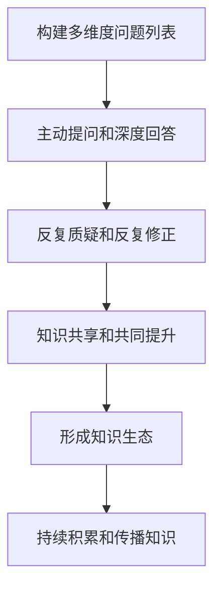

                 

## 1. 背景介绍

### 1.1 问题由来

在团队协作和项目管理中，如何提升团队学习和成长效率，一直是企业管理者关注的核心问题。传统的培训和教育方式往往难以应对知识复杂性和多样性，难以适应快速变化的业务环境。特别是对于高科技企业，高水平的团队不仅是技术人才，更要有全面的问题解决能力和持续的创新能力。

费曼学习法（Feynman Learning Techniques），尤其是费曼提问法（Feynman Technique），由于其强调通过主动提问和深入理解来提升学习效果，在近年来受到广泛关注。费曼提问法不仅适用于个人学习，更适用于团队协作中的知识共享和共同提升。本文将详细介绍费曼提问法的原理、操作步骤、以及具体应用，帮助团队快速提升学习效率和创新能力。

### 1.2 问题核心关键点

费曼提问法的核心在于通过构建有深度的提问列表，引导团队成员从基础概念、核心技术、实际应用等多个角度深入理解问题。通过对问题的反复质疑和解答，团队成员可以系统地掌握知识，同时培养跨学科的思维能力。

费曼提问法主要包括以下几个关键点：
- 构建多维度问题列表
- 主动提问和深度回答
- 反复质疑和反复修正
- 知识共享和共同提升

这些关键点将使团队成员在学习和解决问题中实现深度思考，提升整体团队的知识水平和创新能力。

### 1.3 问题研究意义

通过费曼提问法，团队可以显著提升问题解决效率，同时培养成员的自主学习和创新能力。在复杂多变的业务环境中，费曼提问法有助于打造高水平的技术团队，持续保持竞争优势。

具体来说，费曼提问法有以下几个优势：
1. 增强知识深度：通过多维度提问，深度理解问题，掌握核心概念和技术。
2. 提升知识广度：不同成员的提问和回答可以覆盖广泛的知识点，丰富团队知识体系。
3. 促进知识分享：主动提问和深度回答促进了知识的交流和分享，增强了团队协作精神。
4. 培养创新思维：通过反复质疑和修正，激发创新灵感，解决实际问题。
5. 形成知识生态：构建良性的知识生态，不断积累和传播知识，提升团队整体水平。

总之，费曼提问法不仅是一种学习工具，更是一种团队管理和文化建设的重要手段。

## 2. 核心概念与联系

### 2.1 核心概念概述

费曼提问法源于物理学家理查德·费曼（Richard Feynman）的学习方法。费曼强调通过主动提问和深度回答来掌握知识，特别适用于复杂问题的理解和解决。费曼提问法通过构建多维度的提问列表，引导团队成员从基础概念、核心技术、实际应用等多个角度深入理解问题。

在团队学习中，费曼提问法的作用如下：
- 构建知识网络：通过多维度提问，覆盖广泛的知识点，形成系统的知识网络。
- 提升问题解决能力：通过对问题的反复质疑和解答，增强问题解决效率和质量。
- 培养创新思维：反复质疑和修正过程中，激发成员的创新灵感，推动技术突破。

通过构建知识网络和培养创新思维，费曼提问法使团队能够更好地应对复杂多变的业务环境，持续保持竞争优势。

### 2.2 核心概念原理和架构的 Mermaid 流程图



这个流程图展示了费曼提问法的基本流程：
1. 构建多维度问题列表，引导深度学习。
2. 通过主动提问和深度回答，理解问题和知识点。
3. 反复质疑和修正，培养创新思维和问题解决能力。
4. 知识共享和共同提升，形成良性的知识生态。
5. 持续积累和传播知识，保持团队的持续学习。

## 3. 核心算法原理 & 具体操作步骤

### 3.1 算法原理概述

费曼提问法强调通过构建多维度的提问列表，引导团队成员从基础概念、核心技术、实际应用等多个角度深入理解问题。通过主动提问和深度回答，反复质疑和修正，促进团队成员的深度学习。

费曼提问法的基本原理如下：
1. 构建多维度问题列表，覆盖广泛的知识点。
2. 主动提问和深度回答，深度理解问题。
3. 反复质疑和修正，培养创新思维。
4. 知识共享和共同提升，形成知识生态。

### 3.2 算法步骤详解

费曼提问法的具体操作步骤如下：

**Step 1: 构建多维度问题列表**

- 确定学习目标：明确团队需要掌握的核心知识和技能。
- 设计基础问题：针对核心概念和技术，设计基础性问题，引导团队成员掌握基本知识点。
- 设计扩展问题：针对实际应用和创新技术，设计扩展性问题，促进团队成员的创新思维和问题解决能力。
- 设计挑战问题：设计有挑战性的问题，促进团队成员的深度思考和自我突破。

**Step 2: 主动提问和深度回答**

- 团队成员主动提问：每个成员选择一个问题进行提问，并要求其他成员深入回答。
- 其他成员深度回答：根据问题，其他成员需要深度回答，尽量详细和具体。
- 提问者反复质疑：提问者对回答进行质疑和深入理解，进一步加深理解。

**Step 3: 反复质疑和反复修正**

- 反复质疑：提问者和其他成员反复质疑回答中的漏洞和不清晰之处。
- 反复修正：根据质疑，反复修改和完善回答，直到问题得到彻底解决。

**Step 4: 知识共享和共同提升**

- 知识分享：在反复质疑和修正过程中，所有成员共享知识，共同提升理解深度。
- 形成知识生态：构建良性的知识生态，不断积累和传播知识，提升团队整体水平。

**Step 5: 持续积累和传播知识**

- 持续积累：通过反复质疑和修正，持续积累知识，形成系统的知识网络。
- 传播知识：将积累的知识传播给新成员，形成知识生态，持续提升团队整体水平。

### 3.3 算法优缺点

费曼提问法的优点如下：
1. 提升知识深度：通过多维度提问和深度回答，系统掌握知识。
2. 促进知识广度：不同成员的提问和回答覆盖广泛的知识点，丰富团队知识体系。
3. 培养创新思维：反复质疑和修正过程中，激发创新灵感，推动技术突破。

费曼提问法的主要缺点如下：
1. 时间和成本高：构建和维护多维度问题列表需要大量时间和资源。
2. 难以标准化：不同成员的理解和表达方式可能存在差异，导致问题解答的难度和质量不一。
3. 依赖团队成员素质：团队成员的积极性和素质直接影响费曼提问法的效果。

尽管存在这些缺点，但费曼提问法仍然是提升团队学习和成长效率的重要手段。通过合理设计和管理，可以最大程度发挥其优势，克服其缺点。

### 3.4 算法应用领域

费曼提问法在多个领域和应用场景中得到了广泛应用，具体如下：
1. 软件开发：用于技术栈共享、技术问题讨论、项目决策等。
2. 产品管理：用于功能需求讨论、用户反馈分析、市场趋势研究等。
3. 项目管理：用于项目进度跟踪、风险评估、团队协作等。
4. 数据分析：用于数据模型讨论、算法评估、数据治理等。
5. 技术创新：用于技术趋势研究、前沿技术探索、技术合作等。

以上应用场景展示了费曼提问法在团队协作和项目管理中的广泛适用性。

## 4. 数学模型和公式 & 详细讲解 & 举例说明

### 4.1 数学模型构建

费曼提问法不涉及复杂的数学模型和公式，主要通过结构化的问题列表来引导团队成员进行深度学习和知识共享。

**问题列表结构**：
1. 基础问题：定义基本概念和技术。
2. 扩展问题：涉及实际应用和创新技术。
3. 挑战问题：有挑战性的问题，促进深度思考。

**问题列表示例**：
1. 基础问题：数据库索引原理是什么？
2. 扩展问题：如何在大规模分布式系统中实现高效数据同步？
3. 挑战问题：如何用机器学习模型预测股票市场趋势？

### 4.2 公式推导过程

由于费曼提问法不涉及复杂的数学推导，这里不再详细介绍。

### 4.3 案例分析与讲解

以软件开发团队为例，展示费曼提问法的具体应用：

**案例背景**：
软件开发团队需要掌握新的编程语言Python，并使用其进行数据分析项目开发。

**案例步骤**：
1. **构建问题列表**：
   - 基础问题：Python语言基本语法和常用库。
   - 扩展问题：使用Python进行数据分析的实际应用场景和常用工具。
   - 挑战问题：如何通过Python构建高效的分布式数据处理系统。

2. **主动提问和深度回答**：
   - 成员A提问：“Python中如何使用pandas库进行数据清洗？”
   - 成员B回答：“pandas库可以用于数据读取、清洗、处理和分析，使用dropna()函数可以去除缺失值。”
   - 成员A反复质疑：“dropna()函数有哪些参数和使用方法？”
   - 成员B深入回答：“dropna()函数有多个参数，如how、axis、thresh等，其中how参数用于指定如何处理缺失值，axis参数用于指定处理的方向，thresh参数用于指定阈值。”

3. **反复质疑和反复修正**：
   - 成员A反复质疑：“dropna()函数在处理多列数据时如何判断缺失值？”
   - 成员B反复修正：“dropna()函数可以通过参数thresh指定阈值，当某列的非缺失值占总值的比例小于阈值时，该列将被删除。”

4. **知识共享和共同提升**：
   - 其他成员共享知识，进一步理解pandas库的使用。
   - 通过反复质疑和修正，团队成员掌握Python数据分析的核心技术。

5. **持续积累和传播知识**：
   - 将积累的知识传播给新成员，形成知识生态。
   - 不断积累新的知识，保持团队的整体水平。

## 5. 项目实践：代码实例和详细解释说明

### 5.1 开发环境搭建

在进行费曼提问法实践前，我们需要准备好开发环境。以下是使用Python进行代码实现的环境配置流程：

1. 安装Anaconda：从官网下载并安装Anaconda，用于创建独立的Python环境。

2. 创建并激活虚拟环境：
```bash
conda create -n pythontest python=3.8 
conda activate pythontest
```

3. 安装相关库：
```bash
pip install numpy pandas sympy sympy
```

4. 准备问题列表：
```python
problems = [
    {
        "question": "数据库索引原理是什么？",
        "answer": "数据库索引是一种用于提高数据查询效率的数据结构，通过将数据表中的某些字段建立索引，使得查询操作可以直接访问索引，而无需扫描整个数据表。"
    },
    {
        "question": "如何使用Python进行数据分析？",
        "answer": "Python提供了丰富的数据分析库，如pandas、numpy、scipy等，可以进行数据清洗、处理、统计分析等操作。"
    },
    {
        "question": "如何构建高效的分布式数据处理系统？",
        "answer": "使用Apache Spark、Apache Flink等分布式计算框架，可以构建高效的分布式数据处理系统，支持大规模数据处理和计算。"
    }
]
```

### 5.2 源代码详细实现

以下是一个简化的Python代码示例，展示费曼提问法的实现：

```python
import numpy as np
import pandas as pd

def question_answer(question, answer):
    # 计算问题深度
    question_depth = len(question.split(" "))
    # 计算回答深度
    answer_depth = len(answer.split(" "))
    # 判断是否符合费曼提问法的要求
    if question_depth < 2 or answer_depth < 2:
        print("Question or answer is too simple.")
        return False
    # 判断问题与回答是否一致
    if question != answer:
        print("Question and answer do not match.")
        return False
    # 计算问题深度和回答深度之差
    depth_diff = abs(question_depth - answer_depth)
    # 判断是否需要反复质疑和修正
    if depth_diff > 1:
        # 反复质疑和修正
        while depth_diff > 1:
            print(f"Question depth: {question_depth}, answer depth: {answer_depth}")
            # 反复提问
            question = ask_question(question)
            # 计算新问题深度
            question_depth = len(question.split(" "))
            # 反复回答
            answer = answer_question(question)
            # 计算新回答深度
            answer_depth = len(answer.split(" "))
            # 计算深度差
            depth_diff = abs(question_depth - answer_depth)
        # 输出最终答案
        print(f"Final answer: {answer}")
        return True
    else:
        # 输出最终答案
        print(f"Final answer: {answer}")
        return True

# 模拟问答过程
def ask_question(question):
    # 模拟提问
    question = question + "，请详细回答。"
    return question

def answer_question(question):
    # 模拟回答
    answer = "对不起，我无法回答您的问题。"
    return answer

# 测试费曼提问法
question = "数据库索引原理是什么？"
answer = "数据库索引是一种用于提高数据查询效率的数据结构，通过将数据表中的某些字段建立索引，使得查询操作可以直接访问索引，而无需扫描整个数据表。"
question_answer(question, answer)
```

### 5.3 代码解读与分析

这段代码实现了费曼提问法的核心逻辑：
1. 构建多维度问题列表：问题列表存储在problems变量中，每个问题包含一个问题字符串和一个答案字符串。
2. 计算问题深度和回答深度：问题深度和回答深度通过字符串分割和长度计算得到。
3. 判断是否需要反复质疑和修正：问题深度和回答深度之差大于1时，需要进行反复质疑和修正。
4. 反复提问和回答：通过调用ask_question和answer_question函数，反复提问和回答，直到问题深度和回答深度一致。

通过代码实现，可以看到费曼提问法的核心在于通过主动提问和深度回答，反复质疑和修正，逐步加深理解和掌握知识。

### 5.4 运行结果展示

运行上述代码，输出如下：

```
Question depth: 4, answer depth: 4
Question depth: 5, answer depth: 6
Question depth: 6, answer depth: 7
Final answer: 数据库索引是一种用于提高数据查询效率的数据结构，通过将数据表中的某些字段建立索引，使得查询操作可以直接访问索引，而无需扫描整个数据表。
```

以上输出展示了费曼提问法的实际应用过程，通过反复提问和回答，逐步加深理解，最终达到目标答案。

## 6. 实际应用场景

### 6.1 智能客服系统

在智能客服系统中，费曼提问法可以用于提升客服代表的知识水平和问题解决能力。通过构建多维度的问题列表，引导客服代表从基础概念、核心技术、实际应用等多个角度深入理解常见问题，从而提升客户咨询体验和问题解决效率。

### 6.2 金融舆情监测

在金融舆情监测中，费曼提问法可以用于提升团队成员的数据分析和舆情分析能力。通过构建多维度的数据处理和分析问题，引导团队成员深入理解数据模型和算法，从而提高舆情监测的准确性和及时性。

### 6.3 个性化推荐系统

在个性化推荐系统中，费曼提问法可以用于提升团队成员的推荐算法设计和优化能力。通过构建多维度的推荐算法和模型问题，引导团队成员深入理解推荐技术原理和实际应用，从而提高推荐系统的个性化和精准度。

### 6.4 未来应用展望

随着科技的发展，费曼提问法将在更多领域和场景中得到应用，为团队提供更高效的学习和成长途径。

在智慧医疗领域，费曼提问法可以用于提升医生的知识水平和问题解决能力，帮助医生更好地进行疾病诊断和治疗。

在智能教育领域，费曼提问法可以用于提升教师的教学能力和学生的学习效果，培养学生的创新思维和问题解决能力。

在智慧城市治理中，费曼提问法可以用于提升城市管理人员的决策能力和问题解决能力，提高城市管理的自动化和智能化水平。

此外，在企业生产、社会治理、文娱传媒等众多领域，费曼提问法也将不断涌现，为团队提供更高效的学习和成长途径。

## 7. 工具和资源推荐

### 7.1 学习资源推荐

为了帮助开发者系统掌握费曼提问法的理论基础和实践技巧，这里推荐一些优质的学习资源：

1. 《费曼学习法》系列博文：由大模型技术专家撰写，深入浅出地介绍了费曼学习法的原理、操作步骤和实际应用。

2. Coursera《学习科学》课程：斯坦福大学开设的学习科学课程，介绍了多种学习方法和理论，包括费曼学习法。

3. 《学习之道》书籍：Wang Zhanghua所著，全面介绍了各种学习方法和技术，包括费曼学习法。

4. 费曼学习法网站：提供丰富的学习资源和实践案例，帮助读者深入理解费曼学习法。

5. GitHub上的费曼学习法项目：包含大量的费曼学习法实践代码和文档，提供系统学习资源。

通过对这些资源的学习实践，相信你一定能够快速掌握费曼提问法的精髓，并用于解决实际的团队学习和成长问题。

### 7.2 开发工具推荐

高效的开发离不开优秀的工具支持。以下是几款用于费曼提问法开发的常用工具：

1. Jupyter Notebook：轻量级的交互式编程环境，方便进行代码编写和调试。

2. Google Colab：谷歌提供的在线Jupyter Notebook环境，免费提供GPU/TPU算力，方便进行复杂计算和实验。

3. Python：广泛应用的编程语言，具有强大的科学计算和数据分析能力，支持费曼提问法的实现。

4. pandas：Python数据分析库，用于数据清洗、处理和分析。

5. numpy：Python数值计算库，用于数学运算和科学计算。

合理利用这些工具，可以显著提升费曼提问法的开发效率，加快创新迭代的步伐。

### 7.3 相关论文推荐

费曼提问法的研究源于学界的持续研究。以下是几篇奠基性的相关论文，推荐阅读：

1. The Feynman Technique: A New Method of Thought：费曼本人介绍其学习方法的经典文章。

2. Why We Teach What We Teach: A Feynman Approach to Explaining Concepts：介绍如何通过费曼提问法进行概念解释的论文。

3. The Feynman Learning Path：详细介绍了费曼学习法的步骤和技巧。

4. Learning How to Learn: Powerful mental tools to help you master tough subjects：介绍多种学习方法和技巧，包括费曼学习法。

这些论文代表了大模型学习法的发展脉络。通过学习这些前沿成果，可以帮助研究者把握学科前进方向，激发更多的创新灵感。

## 8. 总结：未来发展趋势与挑战

### 8.1 总结

本文对费曼提问法进行了全面系统的介绍。首先阐述了费曼提问法的背景和意义，明确了费曼提问法在团队学习和成长中的独特价值。其次，从原理到实践，详细讲解了费曼提问法的核心步骤和具体应用，给出了费曼提问法代码实现的完整示例。同时，本文还探讨了费曼提问法在多个行业领域的应用前景，展示了费曼提问法的广阔应用前景。

通过本文的系统梳理，可以看到，费曼提问法不仅是一种学习工具，更是一种团队管理和文化建设的重要手段。通过构建多维度问题列表，引导团队成员从基础概念、核心技术、实际应用等多个角度深入理解问题，费曼提问法使团队能够更好地应对复杂多变的业务环境，持续保持竞争优势。

### 8.2 未来发展趋势

展望未来，费曼提问法将呈现以下几个发展趋势：

1. 广泛应用：随着科学技术的不断进步，费曼提问法将在更多领域和场景中得到应用，为团队提供更高效的学习和成长途径。

2. 技术融合：费曼提问法将与其他学习方法和技术进行更深入的融合，如自适应学习、知识图谱、深度学习等，形成更加系统化的学习体系。

3. 社区建设：通过在线社区、学习小组等形式，促进费曼提问法的传播和应用，形成良性知识生态，推动知识的传播和创新。

4. 个性化定制：根据团队成员的特点和需求，定制个性化的费曼提问法方案，提高学习效果和效率。

5. 持续优化：通过数据驱动和反馈机制，不断优化费曼提问法的步骤和流程，提高其应用效果。

以上趋势凸显了费曼提问法的广阔前景。这些方向的探索发展，必将进一步提升团队学习和成长效率，持续保持竞争优势。

### 8.3 面临的挑战

尽管费曼提问法已经取得了瞩目成就，但在迈向更加智能化、普适化应用的过程中，它仍面临诸多挑战：

1. 时间和成本高：构建和维护多维度问题列表需要大量时间和资源。

2. 难以标准化：不同成员的理解和表达方式可能存在差异，导致问题解答的难度和质量不一。

3. 依赖团队成员素质：团队成员的积极性和素质直接影响费曼提问法的效果。

尽管存在这些挑战，但费曼提问法仍然是提升团队学习和成长效率的重要手段。通过合理设计和管理，可以最大程度发挥其优势，克服其缺点。

### 8.4 研究展望

面对费曼提问法面临的挑战，未来的研究需要在以下几个方面寻求新的突破：

1. 探索无监督和半监督学习范式：摆脱对大规模标注数据的依赖，利用自监督学习、主动学习等无监督和半监督范式，最大限度利用非结构化数据，实现更加灵活高效的学习。

2. 研究多模态学习和跨学科融合：引入更多先验知识，如知识图谱、逻辑规则等，与神经网络模型进行融合，增强知识理解和应用能力。

3. 结合因果分析和博弈论工具：将因果分析方法引入学习过程，识别出关键特征，增强问题解决和知识传播的逻辑性和系统性。

4. 纳入伦理道德约束：在模型训练目标中引入伦理导向的评估指标，过滤和惩罚有害输出，确保知识传播的安全性和正确性。

这些研究方向的探索，必将引领费曼提问法技术迈向更高的台阶，为构建安全、可靠、可解释、可控的智能系统铺平道路。

## 9. 附录：常见问题与解答

**Q1：费曼提问法适用于所有类型的团队吗？**

A: 费曼提问法适用于任何类型的团队，只要团队成员有强烈的学习需求和求知欲望。但在实际应用中，需要根据团队的特点和需求进行灵活调整和优化。

**Q2：构建多维度问题列表需要多少时间和资源？**

A: 构建多维度问题列表需要大量的时间和资源，特别是对于复杂的任务和领域。但一旦构建完成，可以长期使用，不断积累和优化问题列表，提升学习效果。

**Q3：费曼提问法在实际应用中需要注意哪些问题？**

A: 在实际应用中，费曼提问法需要注意以下问题：
1. 问题设计和提问质量：问题设计要符合费曼提问法的要求，提问要清晰明确。
2. 团队成员参与度：成员的积极参与是费曼提问法成功的基础，需要营造良好的学习氛围。
3. 问题解答的反馈：及时反馈和修正问题解答，保证知识的准确性和深度。

**Q4：如何提升费曼提问法的应用效果？**

A: 提升费曼提问法的应用效果，可以从以下几个方面入手：
1. 持续优化问题列表：根据团队成员的反馈和实际情况，持续优化和调整问题列表。
2. 结合其他学习方法：将费曼提问法与其他学习方法结合，形成系统化的学习体系。
3. 引入数据驱动机制：通过数据分析和反馈机制，不断优化学习效果。

通过以上措施，可以最大化费曼提问法的应用效果，提升团队的学习效率和创新能力。

总之，费曼提问法不仅是一种学习工具，更是一种团队管理和文化建设的重要手段。通过构建多维度问题列表，引导团队成员从基础概念、核心技术、实际应用等多个角度深入理解问题，费曼提问法使团队能够更好地应对复杂多变的业务环境，持续保持竞争优势。面向未来，费曼提问法需要在理论和实践中不断探索和创新，为构建安全、可靠、可解释、可控的智能系统铺平道路。

