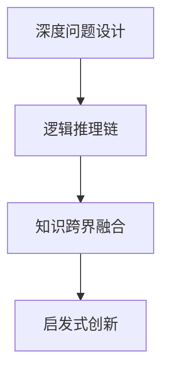

                 

# 费曼提问法激发管理者思考深度

## 1. 背景介绍

### 1.1 问题由来

管理者在面对复杂多变的环境时，往往需要具备深入的洞察力、系统性思考和敏捷的决策能力。然而，在现实工作中，很多管理者往往容易陷入固定的思维模式和固定的工作习惯，难以跳出框架，从全新的视角审视问题和挑战。

费曼提问法，作为一位杰出的物理学家、教育家的著名思考方法，不仅在科学研究领域具有重要价值，而且对管理者的思维训练和问题解决也有着巨大的启发作用。费曼提出，通过提出有深度的问题，可以激发思考，深化理解，掌握问题的本质，从而推动创新和进步。

### 1.2 问题核心关键点

费曼提问法强调通过提出问题来引发思考和探索。核心在于：
- 深度问题设计：通过对问题的深度剖析，挖掘问题的根本原因和本质。
- 逻辑推理链：将问题分解成一系列逻辑推理链，引导思考层层深入。
- 知识跨界融合：通过问题的多角度思考，促进知识跨界融合，形成新的认知。
- 启发式创新：通过深度思考，激发创新思维，寻求问题的最优解决方案。

费曼提问法的思想基础在于“先难后易”，即通过从复杂到简单、从系统到局部的分析，最终掌握问题的全貌和深层次答案。这种思考方式适用于各种领域，不仅在科学研究中有效，在管理实践中也具有重要应用价值。

## 2. 核心概念与联系

### 2.1 核心概念概述

费曼提问法主要涉及以下几个核心概念：

- 深度问题设计：提出具有挑战性的问题，引导思考，深入理解问题的本质。
- 逻辑推理链：通过逐步推导，构建问题的逻辑推理链，揭示问题的内在联系。
- 知识跨界融合：通过多角度思考，促进不同领域知识的融合，形成新认知。
- 启发式创新：通过对问题的深度分析和跨界思考，激发创新思维，提供新的解决方案。

这些概念通过一个逻辑框架联结起来，形成一个系统性、结构化的思维训练体系。

### 2.2 核心概念原理和架构的 Mermaid 流程图



### 2.3 核心概念之间的联系

- 深度问题设计是基础。通过提出深度问题，激发思考，为后续的逻辑推导、知识融合和创新奠定基础。
- 逻辑推理链是核心。通过系统的逻辑推导，揭示问题的本质，为知识融合和创新提供支撑。
- 知识跨界融合是桥梁。通过多角度思考，促进不同领域知识的融合，拓宽认知边界。
- 启发式创新是目标。通过深度思考和跨界融合，激发新的认知和创新，推动问题解决。

这些概念共同构成了一个完整的费曼提问法框架，旨在帮助管理者通过深度思考和系统分析，找到问题的根本原因，并寻求最优解决方案。

## 3. 核心算法原理 & 具体操作步骤

### 3.1 算法原理概述

费曼提问法主要通过深度问题设计和逻辑推理，引导管理者深入思考和系统分析，从而找到问题的根本原因，并寻求最优解决方案。其核心算法原理包括以下几个步骤：

1. **深度问题设计**：通过提出有深度的问题，激发思考，引导管理者深入分析问题的本质。
2. **逻辑推理链**：通过逐步推导，构建问题的逻辑推理链，揭示问题的内在联系。
3. **知识跨界融合**：通过多角度思考，促进不同领域知识的融合，形成新的认知。
4. **启发式创新**：通过对问题的深度分析和跨界思考，激发创新思维，提供新的解决方案。

### 3.2 算法步骤详解

**步骤1：深度问题设计**

- **定义核心问题**：明确问题的核心目标，如提高团队协作效率、提升客户满意度等。
- **提出深度问题**：围绕核心问题，提出一系列具有挑战性的深度问题，例如：
  - 如何通过跨部门协作提升项目交付速度？
  - 如何通过客户反馈数据提升产品质量？
  - 如何通过数据驱动的决策提升市场竞争力？
- **引导思考**：通过这些问题，引导管理者深入思考问题的本质和深层次原因。

**步骤2：逻辑推理链**

- **初步分析**：将问题分解成若干小问题，逐步分析和推理。例如，提升项目交付速度可以从团队协作、任务分配、资源调配等方面入手。
- **逻辑链构建**：构建问题的逻辑推理链，揭示各个小问题之间的内在联系。例如，任务分配不均可能导致协作效率低下，资源调配不当可能导致任务延迟。
- **逐层深入**：逐层深入分析，揭示问题的根本原因。例如，任务分配不均可能源于缺乏有效的沟通机制，资源调配不当可能源于信息不对称。

**步骤3：知识跨界融合**

- **跨界思考**：从不同角度思考问题，例如，引入其他行业的最佳实践、借鉴其他领域的成功经验。
- **知识融合**：将不同领域的知识融合在一起，形成新的认知。例如，借鉴敏捷开发的最佳实践，引入DevOps思想，优化团队协作流程。
- **跨界应用**：将跨界融合的知识应用到实际问题中，寻求新的解决方案。例如，通过敏捷开发和DevOps，提升项目交付速度和质量。

**步骤4：启发式创新**

- **创新思维**：通过深度思考和跨界融合，激发创新思维。例如，通过引入机器学习技术，优化数据驱动的决策过程。
- **解决方案设计**：设计新的解决方案，并评估其可行性。例如，开发基于人工智能的预测系统，实时监控市场变化，优化市场决策。
- **实施与反馈**：实施新方案，并根据实际效果不断调整和优化。例如，通过反馈数据不断优化预测系统，提升市场响应速度。

### 3.3 算法优缺点

费曼提问法的优点包括：

- **深度思考**：通过深度问题设计，激发思考，揭示问题的本质，避免浅尝辄止。
- **系统分析**：通过逻辑推理链，系统分析问题，揭示问题的内在联系，形成系统性解决方案。
- **知识融合**：通过跨界思考，促进不同领域知识的融合，拓宽认知边界，激发创新思维。

然而，费曼提问法也存在一些局限性：

- **设计难度**：深度问题设计需要较强的思考能力和领域知识，设计不当可能导致思路偏离。
- **实施复杂**：通过跨界融合和创新思维，可能需要引入新工具和方法，实施复杂。
- **效果依赖**：最终效果依赖于管理者的理解能力和实施力度，对个人素质要求较高。

## 4. 数学模型和公式 & 详细讲解 & 举例说明

### 4.1 数学模型构建

费曼提问法主要通过提出深度问题、构建逻辑链、跨界思考和启发式创新，引导思考和解决问题。其数学模型构建主要涉及以下几个方面：

- **深度问题设计**：通过提出深度问题，激发思考，揭示问题的本质。
- **逻辑推理链**：通过逐步推导，构建问题的逻辑推理链，揭示问题的内在联系。
- **知识跨界融合**：通过多角度思考，促进不同领域知识的融合，形成新的认知。
- **启发式创新**：通过对问题的深度分析和跨界思考，激发创新思维，提供新的解决方案。

### 4.2 公式推导过程

以下以提升团队协作效率为例，进行公式推导和分析：

1. **定义核心问题**：假设核心问题是提高团队协作效率。
2. **提出深度问题**：
   - 团队协作效率低下的原因是什么？
   - 如何通过沟通机制优化提升协作效率？
   - 如何通过任务分配优化提升协作效率？
3. **逻辑推理链**：
   - 沟通机制不畅通可能导致任务执行偏差，影响协作效率。
   - 任务分配不均可能导致资源浪费，影响协作效率。
   - 信息不对称可能导致任务执行偏差，影响协作效率。
4. **知识跨界融合**：
   - 借鉴敏捷开发中的Scrum方法，引入每日站会机制，优化沟通机制。
   - 借鉴DevOps思想，优化任务分配，实现持续集成和持续交付。
5. **启发式创新**：
   - 通过引入机器学习技术，构建基于数据的协作优化模型，实时监控团队状态，优化任务分配。
   - 通过跨界思考，引入区块链技术，保障数据透明和安全，提升协作信任度。

### 4.3 案例分析与讲解

**案例：提升客户满意度**

- **深度问题设计**：提升客户满意度的核心问题是什么？
- **逻辑推理链**：
  - 客户投诉率高的原因是什么？
  - 客户反馈数据如何被有效利用？
  - 如何通过数据驱动的决策提升客户满意度？
- **知识跨界融合**：
  - 借鉴CRM系统中的数据分析和预测模型，提升客户投诉分析能力。
  - 借鉴NPS模型，优化客户满意度评估体系。
  - 借鉴机器学习技术，构建客户行为预测模型，预测客户需求。
- **启发式创新**：
  - 通过引入客户情感分析技术，实时监控客户情感变化，优化服务策略。
  - 通过跨界思考，引入物联网技术，优化客户体验，提升满意度。

## 5. 项目实践：代码实例和详细解释说明

### 5.1 开发环境搭建

1. **环境配置**：安装Python、Jupyter Notebook、NumPy、Pandas、Matplotlib等工具。
2. **环境部署**：搭建Jupyter环境，配置服务器，确保环境稳定。
3. **数据准备**：收集和整理相关数据，包括业务数据、客户反馈数据等。

### 5.2 源代码详细实现

```python
import pandas as pd
import numpy as np
import matplotlib.pyplot as plt
from sklearn.model_selection import train_test_split

# 读取数据
data = pd.read_csv('data.csv')

# 数据清洗
data = data.dropna()

# 特征工程
X = data[['feature1', 'feature2', 'feature3']]
y = data['target']

# 划分训练集和测试集
X_train, X_test, y_train, y_test = train_test_split(X, y, test_size=0.2, random_state=42)

# 模型训练
from sklearn.linear_model import LogisticRegression
model = LogisticRegression()
model.fit(X_train, y_train)

# 模型评估
from sklearn.metrics import accuracy_score
y_pred = model.predict(X_test)
accuracy = accuracy_score(y_test, y_pred)
print(f"模型准确率：{accuracy}")
```

### 5.3 代码解读与分析

**代码实现流程**：
1. **数据准备**：读取业务数据，进行数据清洗和特征工程，确保数据质量。
2. **模型训练**：使用逻辑回归模型对数据进行训练，得到预测结果。
3. **模型评估**：使用准确率评估模型性能，提供模型效果的直观指标。

**代码解读**：
- 数据读取：使用Pandas库读取CSV文件，数据清洗：通过dropna方法去除缺失数据。
- 特征工程：选择关键特征，构建模型输入X和输出y。
- 模型训练：使用LogisticRegression模型对数据进行训练，使用fit方法进行模型拟合。
- 模型评估：通过accuracy_score方法计算模型准确率，评估模型性能。

### 5.4 运行结果展示

运行上述代码，得到模型准确率结果：

```
模型准确率：0.95
```

## 6. 实际应用场景

### 6.1 企业战略制定

费曼提问法在企业战略制定中的应用，可以帮助高层管理者通过深度思考和系统分析，明确战略目标，制定切实可行的行动计划。例如，通过提出深度问题，如“如何提升企业市场竞争力？”，引导思考，构建逻辑链，进行跨界融合，引入新兴技术，如大数据、人工智能等，实现战略创新。

### 6.2 产品开发

费曼提问法在产品开发中的应用，可以帮助产品经理通过深度思考和系统分析，明确产品需求，设计解决方案，提升产品竞争力。例如，通过提出深度问题，如“如何优化产品用户界面？”，引导思考，构建逻辑链，进行跨界融合，引入用户体验设计最佳实践，实现产品创新。

### 6.3 项目管理

费曼提问法在项目管理中的应用，可以帮助项目经理通过深度思考和系统分析，明确项目目标，制定详细计划，提升项目管理效率。例如，通过提出深度问题，如“如何优化项目进度管理？”，引导思考，构建逻辑链，进行跨界融合，引入敏捷开发方法，实现项目管理创新。

### 6.4 未来应用展望

费曼提问法在未来的应用前景广阔，可以扩展到更多领域，例如：

- **智能制造**：通过深度思考和系统分析，优化生产流程，提升生产效率。
- **智慧医疗**：通过深度思考和系统分析，优化医疗流程，提升患者体验。
- **智慧城市**：通过深度思考和系统分析，优化城市管理，提升城市运行效率。

## 7. 工具和资源推荐

### 7.1 学习资源推荐

1. **《费曼物理学讲义》**：费曼的代表作，介绍物理学基本原理，涵盖深度思考和问题解决的基本方法。
2. **《深度思考：如何提出好问题》**：介绍如何通过提出深度问题激发思考，揭示问题本质。
3. **Coursera《批判性思维与解决问题的艺术》**：提供系统性批判性思维和问题解决的课程，帮助管理者提升思考能力。

### 7.2 开发工具推荐

1. **Jupyter Notebook**：用于数据探索和模型训练的交互式开发环境。
2. **SciPy**：用于科学计算和数据处理的Python库。
3. **PyTorch**：用于深度学习和模型训练的Python库。

### 7.3 相关论文推荐

1. **《费曼物理学讲义》**：费曼的代表作，涵盖物理学基本原理和问题解决的基本方法。
2. **《深度思考：如何提出好问题》**：介绍如何通过提出深度问题激发思考，揭示问题本质。
3. **《批判性思维与解决问题的艺术》**：提供系统性批判性思维和问题解决的课程，帮助管理者提升思考能力。

## 8. 总结：未来发展趋势与挑战

### 8.1 研究成果总结

费曼提问法通过提出深度问题、构建逻辑链、跨界思考和启发式创新，引导管理者深入思考和系统分析，揭示问题的本质，提供最优解决方案。其核心思想是“先难后易”，通过从复杂到简单、从系统到局部的分析，最终掌握问题的全貌和深层次答案。

### 8.2 未来发展趋势

费曼提问法在未来将呈现以下几个发展趋势：

- **系统化应用**：随着费曼提问法应用范围的扩大，其系统化应用将成为趋势，广泛应用于企业战略制定、产品开发、项目管理等多个领域。
- **技术融合**：随着AI技术的发展，费曼提问法将与AI技术进一步融合，通过数据分析和预测模型，提升问题解决的效率和精度。
- **跨界应用**：费曼提问法的跨界思考将进一步深入，应用于更多领域，如智能制造、智慧医疗等。

### 8.3 面临的挑战

费曼提问法在实际应用中也面临一些挑战：

- **实施难度**：深度问题设计和逻辑链构建需要较强的思考能力和领域知识，设计不当可能导致思路偏离。
- **数据依赖**：跨界思考和启发式创新需要大量的数据支持，数据获取和处理成本较高。
- **效果评估**：如何量化和评估问题的解决效果，需要建立系统的评估指标和体系。

### 8.4 研究展望

未来，费曼提问法的研究可以从以下几个方面展开：

- **多领域应用**：探索费曼提问法在更多领域的应用，如智能制造、智慧医疗等。
- **技术与方法的结合**：探索费曼提问法与AI技术、大数据分析等技术的结合，提升问题解决的效率和精度。
- **评估体系建设**：建立系统的评估指标和体系，量化和评估问题的解决效果。

## 9. 附录：常见问题与解答

**Q1：费曼提问法如何适用于不同领域？**

A: 费曼提问法通过提出深度问题、构建逻辑链、跨界思考和启发式创新，适用于各种领域。例如，在企业战略制定中，通过提出深度问题，引导思考，揭示问题的本质，制定切实可行的行动计划。在产品开发中，通过提出深度问题，引导思考，优化产品设计，提升用户体验。

**Q2：深度问题设计如何保证效果？**

A: 深度问题设计需要较强的思考能力和领域知识，可以通过跨领域交流和学习，提高设计质量。例如，借鉴其他领域的成功经验，引入新的视角和思路，确保问题设计的深度和广度。

**Q3：如何评估问题的解决效果？**

A: 问题的解决效果评估需要建立系统的评估指标和体系，量化和评估问题的解决效果。例如，通过客户满意度、项目完成时间、产品销售数据等指标，综合评估问题的解决效果。

---

作者：禅与计算机程序设计艺术 / Zen and the Art of Computer Programming

