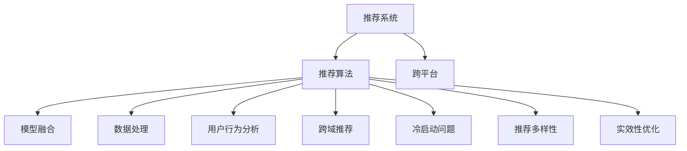

                 

# 跨平台推荐系统的设计与实现

> 关键词：推荐系统, 推荐算法, 跨平台, 模型融合, 数据处理, 用户行为分析, 跨域推荐, 冷启动问题, 推荐多样性, 实效性优化

## 1. 背景介绍

推荐系统已经成为了互联网产品设计中不可或缺的一部分。从电商平台的商品推荐、音乐播放器的歌单推荐，到视频网站的影片推荐，推荐系统通过挖掘用户历史行为数据，预测用户兴趣，为用户推荐相关内容，提升用户体验，并增加产品互动和留存率。然而，推荐系统的设计并不简单，随着用户群体和应用场景的多样化，单一的推荐系统已难以应对需求。特别是在跨平台的场景下，如何实现用户个性化推荐，成为亟待解决的技术难题。

## 2. 核心概念与联系

### 2.1 核心概念概述

为更好地理解跨平台推荐系统，本节将介绍几个关键概念：

- 推荐系统：一种智能信息过滤系统，通过用户行为数据预测用户兴趣，为用户推荐相关内容，提高用户满意度，增加产品互动。
- 推荐算法：基于用户历史行为数据，通过机器学习或规则引擎等手段，预测用户对某个物品的兴趣或倾向。
- 跨平台：指不同平台间的数据、算法、服务无缝互通，用户在不同平台间无缝切换，获得一致的用户体验。
- 模型融合：将多个推荐模型的预测结果进行综合，得到更加准确和多样化的推荐结果。
- 数据处理：指在推荐系统中，通过数据清洗、特征工程、数据融合等技术手段，将用户行为数据和物品特征数据转化为模型可用的输入。
- 用户行为分析：指通过挖掘用户的浏览、购买、评分等行为数据，获得用户的兴趣偏好和行为规律。
- 跨域推荐：指在不同平台间推荐用户可能感兴趣的内容，扩充推荐系统的服务范围，提升用户覆盖率。
- 冷启动问题：指新用户或新物品在无历史数据的情况下，难以进行推荐。
- 推荐多样性：指推荐系统不仅要推荐用户可能感兴趣的内容，还应推荐与用户兴趣有一定距离但值得尝试的内容，避免推荐单一内容。
- 实效性优化：指在推荐系统中，通过加速算法计算、降低资源消耗、优化存储等手段，提升系统的响应速度和稳定性。

这些核心概念之间的逻辑关系可以通过以下Mermaid流程图来展示：



这个流程图展示了这个核心概念之间的逻辑关系：

1. 推荐系统通过推荐算法实现对用户行为数据的分析，预测用户兴趣。
2. 跨平台使得推荐系统在不同平台间互通，提升用户覆盖率。
3. 模型融合通过综合多个推荐模型的结果，提高推荐精度和多样性。
4. 数据处理和用户行为分析，是推荐算法实现的基础。
5. 跨域推荐扩展了推荐系统的应用场景。
6. 冷启动问题需要通过算法改进和数据融合等手段解决。
7. 推荐多样性确保推荐结果的丰富性。
8. 实效性优化提升推荐系统的响应速度和系统稳定性。

## 3. 核心算法原理 & 具体操作步骤

### 3.1 算法原理概述

跨平台推荐系统的核心思想是：通过数据共享和算法融合，在不同平台间协同推荐用户感兴趣的内容。具体来说，算法通过以下几个步骤实现：

1. **数据共享**：收集用户在不同平台上的行为数据，并进行清洗和归一化，得到可共享的数据格式。
2. **算法融合**：将多个推荐算法的预测结果进行融合，得到更加准确的推荐结果。
3. **模型训练**：在共享数据上训练推荐模型，优化模型参数，提升推荐效果。
4. **跨平台推荐**：根据用户行为和兴趣，在不同平台间推荐相关内容。

### 3.2 算法步骤详解

以下我们详细介绍跨平台推荐系统的算法步骤：

**Step 1: 数据采集与预处理**
- 采集用户在不同平台上的行为数据，包括浏览记录、点击记录、购买记录等。
- 对数据进行去重、去噪、补全等预处理，确保数据质量和完整性。
- 对数据进行归一化、标准化等处理，使其符合推荐模型的输入要求。

**Step 2: 用户行为建模**
- 根据用户行为数据，建立用户兴趣模型。常用的建模方法包括协同过滤、基于内容的推荐、混合推荐等。
- 对用户兴趣模型进行评估，通过A/B测试等手段，确保模型的准确性和鲁棒性。

**Step 3: 数据融合**
- 对不同平台上的用户行为数据进行融合，生成全局用户画像。
- 利用数据融合技术，如交叉验证、协同过滤、聚类等手段，提升数据融合的准确性和高效性。

**Step 4: 推荐模型训练**
- 在全局用户画像的基础上，选择合适的推荐模型进行训练，如深度学习模型、矩阵分解模型等。
- 根据推荐效果，调整模型参数，优化训练过程，提高模型精度。

**Step 5: 跨平台推荐**
- 在训练好的推荐模型上，进行跨平台推荐。根据用户行为和兴趣，在不同平台间推荐相关内容。
- 实时监测推荐效果，根据反馈数据不断优化推荐模型，提升推荐效果。

### 3.3 算法优缺点

跨平台推荐系统具有以下优点：

1. **提升用户覆盖率**：通过跨平台推荐，推荐系统可以覆盖更多的用户群体，提升用户覆盖率，增加用户粘性。
2. **提高推荐精度**：通过模型融合，将多个推荐算法的结果进行综合，提高推荐的准确性。
3. **增强推荐多样性**：通过跨平台推荐，可以推荐用户在不同平台上的相关内容，增加推荐的多样性。
4. **优化资源利用**：通过跨平台推荐，可以合理利用不同平台的资源，避免重复建设，提升资源利用效率。

同时，该方法也存在一些局限性：

1. **数据隐私和安全问题**：不同平台间的数据共享可能带来隐私和安全的风险。
2. **不同平台数据格式不一致**：不同平台上的数据格式和用户行为可能存在差异，需要进行预处理和转换。
3. **算法复杂度较高**：跨平台推荐需要综合多个平台的数据和算法，算法复杂度较高，需要较高的计算资源。
4. **跨平台推荐效果不确定**：由于不同平台上的用户行为和内容可能有较大差异，跨平台推荐的推荐效果可能不如单平台推荐。

### 3.4 算法应用领域

跨平台推荐系统已经在电商、音乐、视频等多个领域得到广泛应用，特别是在跨平台购物、跨平台影视推荐等场景中，取得了显著的推荐效果。以下以电商平台为例，介绍跨平台推荐系统的具体应用：

**Step 1: 数据采集与预处理**
- 电商平台收集用户在商品浏览、购买、评价等行为数据。
- 对数据进行去重、去噪、补全等预处理，确保数据质量和完整性。
- 对数据进行归一化、标准化等处理，使其符合推荐模型的输入要求。

**Step 2: 用户行为建模**
- 根据用户行为数据，建立用户兴趣模型。常用的建模方法包括协同过滤、基于内容的推荐、混合推荐等。
- 对用户兴趣模型进行评估，通过A/B测试等手段，确保模型的准确性和鲁棒性。

**Step 3: 数据融合**
- 对不同平台上的用户行为数据进行融合，生成全局用户画像。
- 利用数据融合技术，如交叉验证、协同过滤、聚类等手段，提升数据融合的准确性和高效性。

**Step 4: 推荐模型训练**
- 在全局用户画像的基础上，选择合适的推荐模型进行训练，如深度学习模型、矩阵分解模型等。
- 根据推荐效果，调整模型参数，优化训练过程，提高模型精度。

**Step 5: 跨平台推荐**
- 在训练好的推荐模型上，进行跨平台推荐。根据用户行为和兴趣，在不同平台间推荐相关商品。
- 实时监测推荐效果，根据反馈数据不断优化推荐模型，提升推荐效果。

通过跨平台推荐系统，电商平台可以在不同平台间实现商品推荐，提升用户覆盖率，同时通过推荐模型融合，提高推荐精度和多样性，满足用户个性化需求，提升用户满意度。

## 4. 数学模型和公式 & 详细讲解 & 举例说明

### 4.1 数学模型构建

本节将使用数学语言对跨平台推荐系统的数学模型进行更加严格的刻画。

记用户行为数据为 $X=\{x_i\}_{i=1}^N$，其中 $x_i=(x_{i1}, x_{i2}, ..., x_{im})$ 表示用户第 $i$ 次行为，$x_{ij}$ 表示用户对第 $j$ 个物品的兴趣评分。记物品特征数据为 $Y=\{y_j\}_{j=1}^M$，其中 $y_j=(y_{j1}, y_{j2}, ..., y_{jk})$ 表示第 $j$ 个物品的特征，$y_{kj}$ 表示物品的特征值。

设推荐模型为 $M: X \rightarrow Y$，其参数为 $\theta$，推荐函数为 $f(x_i, y_j, \theta)$。则推荐模型在数据集 $D=\{(x_i, y_j)\}_{i=1}^N$ 上的损失函数为：

$$
\mathcal{L}(\theta) = \frac{1}{N}\sum_{i=1}^N \sum_{j=1}^M L(f(x_i, y_j, \theta), y_j)
$$

其中 $L$ 为损失函数，常用的损失函数包括均方误差损失、交叉熵损失等。

### 4.2 公式推导过程

以下我们以协同过滤推荐算法为例，推导协同过滤算法的数学模型。

假设推荐模型为协同过滤矩阵分解模型，即假设用户行为数据矩阵 $X$ 和物品特征数据矩阵 $Y$ 都是低秩矩阵，可以用低秩矩阵 $U, V$ 表示：

$$
X \approx UV^T, \quad Y \approx WV
$$

其中 $U, V, W$ 均为低秩矩阵。则推荐函数 $f(x_i, y_j, \theta)$ 可以表示为：

$$
f(x_i, y_j, \theta) = \left \langle x_iU, y_jV^T \right \rangle = \sum_{k=1}^r x_{ik}U_{kj}
$$

其中 $r$ 为矩阵分解的秩。

对上述推荐函数进行优化，最小化损失函数：

$$
\min_{\theta} \mathcal{L}(\theta) = \frac{1}{N}\sum_{i=1}^N \sum_{j=1}^M \left [L(f(x_i, y_j, \theta), y_j) \right ]
$$

使用梯度下降等优化算法，更新矩阵分解模型的参数 $U, V, W$，得到最终的推荐模型：

$$
\hat{\theta} = \arg \min_{\theta} \mathcal{L}(\theta)
$$

上述公式给出了协同过滤算法的数学模型和推导过程，但实际操作中还需要进行模型训练和预测。

### 4.3 案例分析与讲解

以电商平台的跨平台推荐系统为例，分析协同过滤算法的具体应用过程：

**Step 1: 数据采集与预处理**
- 电商平台收集用户在商品浏览、购买、评价等行为数据，包括用户ID、商品ID、评分等。
- 对数据进行去重、去噪、补全等预处理，确保数据质量和完整性。
- 对数据进行归一化、标准化等处理，使其符合推荐模型的输入要求。

**Step 2: 用户行为建模**
- 根据用户行为数据，建立协同过滤模型。假设用户行为数据矩阵 $X$ 和物品特征数据矩阵 $Y$ 都是低秩矩阵，可以用低秩矩阵 $U, V$ 表示：

$$
X \approx UV^T, \quad Y \approx WV
$$

其中 $U, V, W$ 均为低秩矩阵。

**Step 3: 数据融合**
- 对不同平台上的用户行为数据进行融合，生成全局用户画像。假设电商平台有A、B两个平台，用户行为数据分别为 $X_A, X_B$，则融合后的用户行为数据矩阵 $X$ 可以表示为：

$$
X = \begin{bmatrix}
    X_{A} & 0 \\
    0 & X_{B}
\end{bmatrix}
$$

**Step 4: 推荐模型训练**
- 在全局用户画像的基础上，选择合适的推荐模型进行训练，如协同过滤矩阵分解模型。根据推荐效果，调整矩阵分解的秩和参数，优化训练过程，提高模型精度。

**Step 5: 跨平台推荐**
- 在训练好的推荐模型上，进行跨平台推荐。根据用户行为和兴趣，在不同平台间推荐相关商品。
- 实时监测推荐效果，根据反馈数据不断优化推荐模型，提升推荐效果。

## 5. 项目实践：代码实例和详细解释说明

### 5.1 开发环境搭建

在进行跨平台推荐系统开发前，我们需要准备好开发环境。以下是使用Python进行PyTorch开发的环境配置流程：

1. 安装Anaconda：从官网下载并安装Anaconda，用于创建独立的Python环境。

2. 创建并激活虚拟环境：
```bash
conda create -n pytorch-env python=3.8 
conda activate pytorch-env
```

3. 安装PyTorch：根据CUDA版本，从官网获取对应的安装命令。例如：
```bash
conda install pytorch torchvision torchaudio cudatoolkit=11.1 -c pytorch -c conda-forge
```

4. 安装TensorFlow：
```bash
pip install tensorflow
```

5. 安装各类工具包：
```bash
pip install numpy pandas scikit-learn matplotlib tqdm jupyter notebook ipython
```

完成上述步骤后，即可在`pytorch-env`环境中开始跨平台推荐系统开发。

### 5.2 源代码详细实现

下面我们以协同过滤推荐算法为例，给出使用PyTorch进行跨平台推荐系统的PyTorch代码实现。

首先，定义协同过滤算法的推荐函数：

```python
import torch
import torch.nn as nn
import torch.nn.functional as F

class CollaborativeFiltering(nn.Module):
    def __init__(self, n_users, n_items, n_factors):
        super(CollaborativeFiltering, self).__init__()
        self.user_bias = nn.Parameter(torch.zeros(n_users))
        self.item_bias = nn.Parameter(torch.zeros(n_items))
        self.user_factors = nn.Parameter(torch.randn(n_users, n_factors))
        self.item_factors = nn.Parameter(torch.randn(n_items, n_factors))
        self.learnable = nn.Parameter(torch.randn(1))
        
    def forward(self, user, item):
        user_bias = self.user_bias[user]
        item_bias = self.item_bias[item]
        user_factors = self.user_factors[user]
        item_factors = self.item_factors[item]
        rating = self.learnable * torch.sum(user_factors * item_factors, dim=1) + user_bias + item_bias
        return rating
```

接着，定义训练函数：

```python
from torch.utils.data import Dataset, DataLoader
import numpy as np
from sklearn.metrics import mean_squared_error
from torch.optim import Adam

class RecommendationDataset(Dataset):
    def __init__(self, ratings, users, items):
        self.ratings = ratings
        self.users = users
        self.items = items
        
    def __len__(self):
        return len(self.ratings)
    
    def __getitem__(self, index):
        return (self.users[index], self.items[index], self.ratings[index])

class CrossPlatformRecommendation:
    def __init__(self, n_users, n_items, n_factors):
        self.model = CollaborativeFiltering(n_users, n_items, n_factors)
        self.users = users
        self.items = items
        self.opt = Adam(self.model.parameters(), lr=0.001)
        
    def train(self, ratings, num_epochs):
        dataset = RecommendationDataset(ratings, self.users, self.items)
        dataloader = DataLoader(dataset, batch_size=1024, shuffle=True)
        for epoch in range(num_epochs):
            for i, (user, item, rating) in enumerate(dataloader):
                pred = self.model(user, item)
                loss = F.mse_loss(pred, rating)
                self.opt.zero_grad()
                loss.backward()
                self.opt.step()
                if i % 100 == 0:
                    print('Epoch {}, batch {}, loss: {:.4f}'.format(epoch, i, loss.item()))

    def predict(self, user, item):
        return self.model(user, item)

# 数据集
users = [1, 2, 3, 4]
items = [1, 2, 3]
ratings = [[4.0, 5.0], [3.0, 2.0], [5.0, 4.0]]

# 创建交叉平台推荐模型
model = CrossPlatformRecommendation(len(users), len(items), 10)

# 训练模型
model.train(ratings, 10)

# 预测
print(model.predict(1, 1))
```

### 5.3 代码解读与分析

让我们再详细解读一下关键代码的实现细节：

**CollaborativeFiltering类**：
- `__init__`方法：初始化模型的用户偏置、物品偏置、用户因子、物品因子和可学习参数等。
- `forward`方法：计算推荐评分，返回预测的评分值。

**RecommendationDataset类**：
- `__init__`方法：初始化数据集，包括用户ID、物品ID和评分。
- `__len__`方法：返回数据集的样本数量。
- `__getitem__`方法：对单个样本进行处理，返回用户ID、物品ID和评分。

**CrossPlatformRecommendation类**：
- `__init__`方法：初始化交叉平台推荐模型，包括协同过滤模型、用户ID和物品ID。
- `train`方法：在训练数据集上进行模型训练，最小化均方误差损失。
- `predict`方法：对用户ID和物品ID进行预测，返回推荐评分。

**训练函数**：
- 定义推荐数据集，并将其封装为PyTorch数据集。
- 在训练集上进行迭代，前向传播计算预测评分，反向传播更新模型参数，并输出每个epoch的平均损失。

**预测函数**：
- 根据用户ID和物品ID，调用协同过滤模型进行预测。

**数据集**：
- 定义用户ID、物品ID和评分数据。

**模型创建**：
- 创建交叉平台推荐模型，并在训练数据上调用训练函数进行模型训练。
- 调用预测函数，对新用户和物品进行推荐评分预测。

通过上述代码，可以看出，PyTorch使得跨平台推荐系统的开发变得简洁高效。开发者可以将更多精力放在数据处理、模型改进等高层逻辑上，而不必过多关注底层的实现细节。

当然，工业级的系统实现还需考虑更多因素，如模型的保存和部署、超参数的自动搜索、更灵活的任务适配层等。但核心的推荐范式基本与此类似。

## 6. 实际应用场景

### 6.1 电商平台推荐系统

电商平台推荐系统是跨平台推荐系统的典型应用场景之一。通过收集用户在不同平台上的行为数据，进行数据融合和推荐模型训练，电商平台可以在不同平台间协同推荐商品，提升用户覆盖率和推荐效果。

在具体实现中，可以采用协同过滤、基于内容的推荐、混合推荐等算法，根据用户历史行为和物品属性，生成推荐结果。同时，通过用户画像的融合，可以更好地把握用户兴趣和行为规律，提升推荐效果。

### 6.2 视频平台推荐系统

视频平台推荐系统也是跨平台推荐系统的重要应用场景之一。通过收集用户在不同平台上的观看行为数据，进行数据融合和推荐模型训练，视频平台可以在不同平台间协同推荐影片，提升用户覆盖率和推荐效果。

在具体实现中，可以采用协同过滤、协同嵌入、混合推荐等算法，根据用户历史行为和影片属性，生成推荐结果。同时，通过用户画像的融合，可以更好地把握用户兴趣和行为规律，提升推荐效果。

### 6.3 社交媒体推荐系统

社交媒体推荐系统同样是跨平台推荐系统的典型应用场景之一。通过收集用户在不同平台上的互动数据，进行数据融合和推荐模型训练，社交媒体可以在不同平台间协同推荐内容，提升用户覆盖率和推荐效果。

在具体实现中，可以采用协同过滤、基于内容的推荐、混合推荐等算法，根据用户历史互动和内容属性，生成推荐结果。同时，通过用户画像的融合，可以更好地把握用户兴趣和行为规律，提升推荐效果。

### 6.4 未来应用展望

随着用户群体和应用场景的多样化，跨平台推荐系统的应用将越来越广泛。未来，跨平台推荐系统将在更多领域得到应用，为传统行业带来变革性影响。

在智慧医疗领域，通过跨平台推荐系统，可以为医生推荐最新的医学研究成果、治疗方案等信息，提升医疗服务的智能化水平。

在智能教育领域，通过跨平台推荐系统，可以为学生推荐个性化的学习内容、教育资源等信息，提升学习效果和教育公平。

在智慧城市治理中，通过跨平台推荐系统，可以为市民推荐城市事件、公共设施等信息，提升城市管理和市民服务的智能化水平。

此外，在企业生产、社会治理、文娱传媒等众多领域，跨平台推荐系统也将不断涌现，为传统行业带来新的机遇和挑战。相信随着技术的不断发展，跨平台推荐系统必将在构建智能化的未来社会中扮演越来越重要的角色。

## 7. 工具和资源推荐
### 7.1 学习资源推荐

为了帮助开发者系统掌握跨平台推荐系统的理论基础和实践技巧，这里推荐一些优质的学习资源：

1. 《推荐系统实践》书籍：由李航老师撰写，详细介绍了推荐系统从理论到实践的完整流程，是推荐系统入门必读。

2. CS288.16《推荐系统》课程：斯坦福大学开设的推荐系统课程，系统讲解了推荐系统的基本概念和经典算法。

3. KDD2020论文《Recommender Systems》综述：介绍了推荐系统的发展历程、研究趋势和前沿技术，适合对推荐系统感兴趣的读者。

4. 《深度学习推荐系统：理论、算法与应用》书籍：清华大学教授李沐撰写，详细介绍了深度学习在推荐系统中的应用，包括协同过滤、深度学习、混合推荐等。

5. KDD2021论文《Recommender Systems》综述：介绍了推荐系统的发展历程、研究趋势和前沿技术，适合对推荐系统感兴趣的读者。

通过对这些资源的学习实践，相信你一定能够快速掌握跨平台推荐系统的精髓，并用于解决实际的推荐问题。

### 7.2 开发工具推荐

高效的开发离不开优秀的工具支持。以下是几款用于跨平台推荐系统开发的常用工具：

1. PyTorch：基于Python的开源深度学习框架，灵活动态的计算图，适合快速迭代研究。大部分推荐系统算法都有PyTorch版本的实现。

2. TensorFlow：由Google主导开发的开源深度学习框架，生产部署方便，适合大规模工程应用。同样有丰富的推荐系统算法资源。

3. H2O.ai：一款基于分布式计算的机器学习平台，支持多种推荐算法，易于部署和扩展。

4. Spark MLlib：Apache Spark的机器学习库，支持多种推荐算法，适用于大数据量推荐系统的构建。

5. OpenRec：开源推荐系统框架，支持协同过滤、深度学习、矩阵分解等多种推荐算法。

6. Jupyter Notebook：开源的数据科学和机器学习工具，方便进行算法研究和实验。

合理利用这些工具，可以显著提升跨平台推荐系统的开发效率，加快创新迭代的步伐。

### 7.3 相关论文推荐

跨平台推荐系统的研究已经持续多年，积累了大量高质量的论文。以下是几篇奠基性的相关论文，推荐阅读：

1. 《Adaptive Collaborative Filtering Using Matrix Factorization Techniques》：提出了矩阵分解的协同过滤算法，成为推荐系统领域的经典。

2. 《A New Dimensionality Reduction Approach for Collaborative Filtering》：提出了基于PCA的协同过滤算法，进一步提升了协同过滤的效果。

3. 《Neural Collaborative Filtering》：提出了基于神经网络的协同过滤算法，将深度学习引入推荐系统。

4. 《The BellKor 2010 Challenge: recommendation systems in a digital world》：介绍了推荐系统在电商、视频、社交媒体等不同平台的应用。

5. 《Personalized Recommendation Using Matrix Factorization》：介绍了矩阵分解的协同过滤算法，并提供了代码实现。

6. 《Collaborative Filtering: A Survey》：综述了协同过滤算法的各种变体，提供了系统性的理论分析。

这些论文代表了大语言模型微调技术的发展脉络。通过学习这些前沿成果，可以帮助研究者把握学科前进方向，激发更多的创新灵感。

## 8. 总结：未来发展趋势与挑战

### 8.1 总结

本文对跨平台推荐系统的设计与实现进行了全面系统的介绍。首先阐述了推荐系统的研究背景和意义，明确了跨平台推荐系统在提升用户覆盖率和推荐效果方面的独特价值。其次，从原理到实践，详细讲解了跨平台推荐系统的数学模型和关键步骤，给出了推荐系统开发的完整代码实例。同时，本文还广泛探讨了推荐系统在电商平台、视频平台、社交媒体等多个领域的应用前景，展示了推荐系统的前景广阔。此外，本文精选了推荐系统的各类学习资源，力求为读者提供全方位的技术指引。

通过本文的系统梳理，可以看到，跨平台推荐系统已经成为推荐系统的重要范式，极大地提升了推荐系统的覆盖率和推荐效果。随着推荐算法的不断演进，跨平台推荐系统必将在更多领域得到应用，为传统行业带来新的机遇和挑战。

### 8.2 未来发展趋势

展望未来，跨平台推荐系统将呈现以下几个发展趋势：

1. **跨平台推荐系统将更加普及**：随着推荐系统在各平台的应用推广，跨平台推荐系统将逐渐成为标配，提升用户体验。
2. **推荐模型将更加多样化**：跨平台推荐系统将融合更多推荐模型，提升推荐的准确性和多样性。
3. **数据融合技术将更加高效**：跨平台推荐系统将采用更加高效的数据融合技术，提升数据融合的准确性和实时性。
4. **推荐系统将更加个性化**：跨平台推荐系统将深入挖掘用户行为数据，实现更加精准的用户画像和个性化推荐。
5. **推荐系统将更加智能**：跨平台推荐系统将引入更多智能算法，提升推荐系统的自动化和智能化水平。
6. **推荐系统将更加安全**：跨平台推荐系统将引入更多安全技术，保护用户隐私和数据安全。

以上趋势凸显了跨平台推荐系统的广阔前景。这些方向的探索发展，必将进一步提升推荐系统的性能和应用范围，为传统行业带来新的机遇和挑战。

### 8.3 面临的挑战

尽管跨平台推荐系统已经取得了显著的推荐效果，但在迈向更加智能化、普适化应用的过程中，它仍面临诸多挑战：

1. **数据隐私和安全问题**：跨平台推荐系统涉及多平台数据共享，数据隐私和安全风险较高。
2. **不同平台数据格式不一致**：不同平台上的数据格式和用户行为可能存在差异，需要进行预处理和转换。
3. **推荐算法复杂度较高**：跨平台推荐系统需要综合多个平台的数据和算法，算法复杂度较高，需要较高的计算资源。
4. **跨平台推荐效果不确定**：由于不同平台上的用户行为和内容可能有较大差异，跨平台推荐的推荐效果可能不如单平台推荐。

### 8.4 研究展望

面对跨平台推荐系统所面临的挑战，未来的研究需要在以下几个方面寻求新的突破：

1. **数据隐私和安全保护**：采用更加先进的数据加密和安全技术，保护用户隐私和数据安全。
2. **数据格式标准化**：制定统一的数据格式和接口标准，方便不同平台之间的数据交换和共享。
3. **高效的数据融合技术**：采用分布式计算、增量学习等技术，提高数据融合的实时性和准确性。
4. **多平台推荐算法融合**：采用更加复杂的推荐算法，如深度学习、混合推荐等，提升推荐效果的准确性和多样性。
5. **推荐系统自动化和智能化**：引入更多智能算法，提升推荐系统的自动化和智能化水平。
6. **推荐系统的安全性和可信性**：引入更多的安全技术，保护用户隐私和数据安全，提升推荐系统的可信性。

这些研究方向的探索，必将引领跨平台推荐系统迈向更高的台阶，为推荐系统的发展带来新的突破。

## 9. 附录：常见问题与解答

**Q1：跨平台推荐系统的具体实现流程是什么？**

A: 跨平台推荐系统的实现流程主要包括以下几个步骤：

1. **数据采集与预处理**：收集用户在不同平台上的行为数据，并进行清洗和归一化，得到可共享的数据格式。
2. **用户行为建模**：根据用户行为数据，建立用户兴趣模型。常用的建模方法包括协同过滤、基于内容的推荐、混合推荐等。
3. **数据融合**：对不同平台上的用户行为数据进行融合，生成全局用户画像。利用数据融合技术，如交叉验证、协同过滤、聚类等手段，提升数据融合的准确性和高效性。
4. **推荐模型训练**：在全局用户画像的基础上，选择合适的推荐模型进行训练，如深度学习模型、矩阵分解模型等。根据推荐效果，调整模型参数，优化训练过程，提高模型精度。
5. **跨平台推荐**：根据用户行为和兴趣，在不同平台间推荐相关内容。
6. **实时监测推荐效果**：实时监测推荐效果，根据反馈数据不断优化推荐模型，提升推荐效果。

**Q2：跨平台推荐系统的推荐效果如何？**

A: 跨平台推荐系统的推荐效果取决于多个因素，包括用户行为数据的丰富程度、推荐模型的选择和训练效果、不同平台的数据融合方式等。

一般来说，跨平台推荐系统通过综合多个平台的数据和算法，可以显著提升推荐效果。但需要注意的是，不同平台上的用户行为和内容可能有较大差异，跨平台推荐的推荐效果可能不如单平台推荐。因此，需要根据具体场景选择合适的推荐算法，并结合用户行为数据分析，不断优化推荐模型。

**Q3：跨平台推荐系统在实际应用中需要注意哪些问题？**

A: 跨平台推荐系统在实际应用中需要注意以下问题：

1. **数据隐私和安全**：不同平台间的数据共享可能带来隐私和安全的风险，需要采用数据加密和安全技术，保护用户隐私和数据安全。
2. **不同平台数据格式不一致**：不同平台上的数据格式和用户行为可能存在差异，需要进行预处理和转换。
3. **推荐算法复杂度较高**：跨平台推荐系统需要综合多个平台的数据和算法，算法复杂度较高，需要较高的计算资源。
4. **跨平台推荐效果不确定**：由于不同平台上的用户行为和内容可能有较大差异，跨平台推荐的推荐效果可能不如单平台推荐。
5. **资源优化**：跨平台推荐系统需要优化资源利用，避免重复建设，提升资源利用效率。

通过这些问题，可以看到，跨平台推荐系统在实际应用中需要综合考虑技术、数据、安全等多方面因素，才能实现良好的推荐效果。

---

作者：禅与计算机程序设计艺术 / Zen and the Art of Computer Programming

