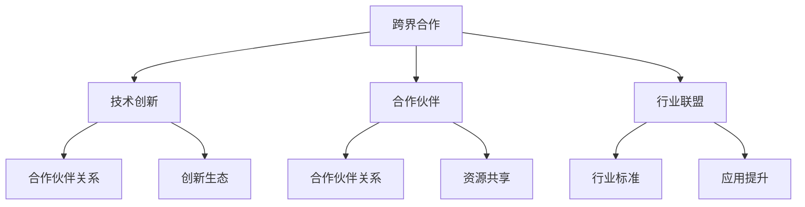

                 

# 跨界合作：Lepton AI的生态系统构建

> 关键词：跨界合作, Lepton AI, 生态系统构建, AI应用, 技术创新, 合作伙伴, 行业联盟

## 1. 背景介绍

### 1.1 问题由来
在现代数字化社会，人工智能（AI）技术的快速发展正迅速改变各行各业的运营方式和商业模式。AI已经渗透到医疗、金融、教育、制造等诸多领域，推动传统行业的数字化转型。然而，单靠一家企业难以全面覆盖所有AI应用场景。Lepton AI，作为一家以AI技术为核心的创新企业，积极构建了跨行业的合作生态系统，通过合作赋能，共同推动AI技术的普及和应用。

### 1.2 问题核心关键点
Lepton AI的生态系统构建，旨在通过技术创新和合作伙伴的深度协作，实现AI技术的广泛应用和价值最大化。核心关键点包括：

- 跨界合作：聚集来自不同行业和领域的合作伙伴，共同推动AI技术的研发和应用。
- 技术创新：不断优化和提升AI核心技术，提供高性能、易用化的AI解决方案。
- 合作伙伴关系：构建基于互利共赢的生态联盟，实现资源共享和协同创新。
- 行业联盟：推动行业标准制定，提升AI技术的行业应用水平。

### 1.3 问题研究意义
Lepton AI的生态系统构建，对AI技术的发展和应用具有重要意义：

1. **增强技术实力**：通过跨界合作，汇集各方优势，提升整体技术实力，促进AI技术不断进步。
2. **扩展应用场景**：合作伙伴的多样性带来更多应用场景，推动AI技术的广泛应用。
3. **优化资源配置**：合作伙伴的资源共享，有助于更高效地利用资源，降低成本。
4. **提升市场竞争力**：通过行业联盟和标准制定，增强市场竞争力，推动AI技术在更多行业中的应用。
5. **促进创新生态**：构建开放、透明的创新生态，吸引更多合作伙伴加入，实现共赢发展。

## 2. 核心概念与联系

### 2.1 核心概念概述

为更好地理解Lepton AI的生态系统构建，本节将介绍几个密切相关的核心概念：

- **跨界合作**：Lepton AI与医疗、金融、教育、制造等多个行业的企业进行深度合作，共同推动AI技术的发展和应用。
- **技术创新**：Lepton AI专注于AI核心技术的研发，提供高性能、易用化的AI解决方案。
- **合作伙伴**：包括大型企业、初创公司、研究机构等，通过共同研发和应用，实现互利共赢。
- **行业联盟**：Lepton AI推动各行业的AI技术标准制定，提升AI技术的行业应用水平。
- **生态系统**：Lepton AI构建的跨行业合作平台，汇集多方资源，促进技术创新和应用。

这些核心概念之间的逻辑关系可以通过以下Mermaid流程图来展示：



这个流程图展示了一系列核心概念及其之间的关系：

1. 跨界合作是生态系统的基础，通过与不同行业的企业深度合作，共同推动AI技术的发展。
2. 技术创新是生态系统的核心，通过持续的技术研发，提供高质量的AI解决方案。
3. 合作伙伴关系和创新生态是生态系统的关键组成部分，通过多方合作，实现资源共享和协同创新。
4. 行业联盟和标准制定，提升AI技术的行业应用水平，进一步推动生态系统的发展。

这些概念共同构成了Lepton AI的生态系统构建框架，使其能够有效推动AI技术的广泛应用和价值最大化。

## 3. 核心算法原理 & 具体操作步骤
### 3.1 算法原理概述

Lepton AI的生态系统构建，涉及多个领域的深度合作和技术创新。核心算法原理主要包括跨界合作、技术创新和行业联盟三个方面。

### 3.2 算法步骤详解

#### 3.2.1 跨界合作

跨界合作的具体步骤包括：

1. **需求调研**：与合作伙伴进行深度沟通，了解其AI需求和应用场景。
2. **技术评估**：根据合作伙伴的需求，评估Lepton AI的AI技术和解决方案的适配性。
3. **合作协议**：签订合作协议，明确各方的权利和义务。
4. **联合研发**：双方共同投入资源，进行联合研发，开发适合合作伙伴需求的AI解决方案。
5. **市场推广**：共同推广和应用AI解决方案，实现互利共赢。

#### 3.2.2 技术创新

技术创新的具体步骤包括：

1. **技术研发**：Lepton AI专注于AI核心技术的研发，提供高性能、易用化的AI解决方案。
2. **技术验证**：在合作伙伴的实际应用场景中，验证AI解决方案的可行性和效果。
3. **优化提升**：根据技术验证的结果，不断优化和提升AI技术，提升整体性能和用户体验。

#### 3.2.3 行业联盟

行业联盟的具体步骤包括：

1. **标准制定**：Lepton AI推动各行业的AI技术标准制定，提升AI技术的行业应用水平。
2. **行业推广**：通过行业联盟推广AI技术，提升各行业的AI应用水平。
3. **资源共享**：通过行业联盟实现资源共享，提升AI技术的整体实力。

### 3.3 算法优缺点

Lepton AI的生态系统构建方法具有以下优点：

1. **增强技术实力**：通过跨界合作，汇集各方优势，提升整体技术实力，促进AI技术不断进步。
2. **扩展应用场景**：合作伙伴的多样性带来更多应用场景，推动AI技术的广泛应用。
3. **优化资源配置**：合作伙伴的资源共享，有助于更高效地利用资源，降低成本。
4. **提升市场竞争力**：通过行业联盟和标准制定，增强市场竞争力，推动AI技术在更多行业中的应用。
5. **促进创新生态**：构建开放、透明的创新生态，吸引更多合作伙伴加入，实现共赢发展。

同时，该方法也存在一定的局限性：

1. **沟通成本**：跨界合作过程中，需要花费大量时间进行沟通和协调。
2. **协同难度**：不同行业的合作伙伴，在技术、文化和市场等方面存在差异，协同创新难度较大。
3. **标准一致性**：不同行业对AI技术的应用标准存在差异，行业联盟需要平衡各方需求，制定统一的行业标准。

尽管存在这些局限性，但就目前而言，Lepton AI的生态系统构建方法仍是最主流和有效的AI技术发展路径。未来相关研究的重点在于如何进一步降低跨界合作的沟通成本，提高协同创新的效率，同时兼顾各行业的标准一致性等因素。

### 3.4 算法应用领域

Lepton AI的生态系统构建方法，已在多个领域得到应用，覆盖了医疗、金融、教育、制造等诸多领域，具体包括：

- **医疗领域**：Lepton AI与多家医院和医疗机构合作，开发AI诊断系统和智能医疗助手，提升医疗服务水平。
- **金融领域**：Lepton AI与银行和保险公司合作，提供AI风险评估和智能客服系统，优化金融服务。
- **教育领域**：Lepton AI与学校和培训机构合作，开发AI教育系统和智能辅导系统，提升教育质量。
- **制造领域**：Lepton AI与制造企业合作，提供AI质量检测和智能生产系统，提升生产效率。

除了这些应用场景外，Lepton AI的生态系统构建方法还将在更多领域得到应用，如智能家居、智慧城市、自动驾驶等，为各行各业提供AI技术支持。

## 4. 数学模型和公式 & 详细讲解 & 举例说明（备注：数学公式请使用latex格式，latex嵌入文中独立段落使用 $$，段落内使用 $)
### 4.1 数学模型构建

Lepton AI的生态系统构建方法涉及多个领域的深度合作和技术创新。我们以医疗领域的AI诊断系统为例，说明数学模型的构建和应用。

假设医疗数据集为 $\mathcal{D} = \{(x_i, y_i)\}_{i=1}^N$，其中 $x_i$ 为患者的历史病历记录， $y_i$ 为诊断结果。Lepton AI与医院合作，共同开发AI诊断系统。数学模型构建过程如下：

1. **数据预处理**：对医疗数据进行清洗和标准化处理，去除噪声和异常值。
2. **特征选择**：从病历记录中选择对诊断结果影响较大的特征，构建特征集合 $\mathcal{F}$。
3. **模型选择**：选择适合的机器学习模型，如支持向量机、随机森林、神经网络等。
4. **模型训练**：在医疗数据集 $\mathcal{D}$ 上训练选择的机器学习模型，得到模型参数 $\theta$。
5. **模型验证**：在验证集 $\mathcal{D}_{val}$ 上验证模型效果，调整模型参数。
6. **模型应用**：在新病历记录 $x$ 上，使用训练好的模型进行预测，输出诊断结果 $y$。

### 4.2 公式推导过程

以神经网络模型为例，我们推导其在医疗诊断中的数学模型和公式。

假设神经网络模型为 $M_{\theta}(x) = \sigma(W_{out}W_{hidden}\sigma(W_{in}x + b_{in}) + b_{hidden}) + b_{out}$，其中 $W_{in}, W_{hidden}, W_{out}$ 为权重矩阵，$b_{in}, b_{hidden}, b_{out}$ 为偏置向量，$\sigma$ 为激活函数。

在医疗诊断任务中，我们假设模型输出 $y = \{1, 2, 3, ..., C\}$，表示 $C$ 种可能的诊断结果。则交叉熵损失函数定义为：

$$
\mathcal{L}(\theta) = -\frac{1}{N}\sum_{i=1}^N \sum_{c=1}^C y_{ic} \log M_{\theta}(x_i)_c
$$

其中 $y_{ic}$ 为样本 $i$ 的真实标签为 $c$ 的one-hot编码，$M_{\theta}(x)_c$ 为模型输出 $x$ 为诊断结果 $c$ 的概率。

模型训练的目标是最小化交叉熵损失函数，得到最优模型参数 $\theta^*$。

### 4.3 案例分析与讲解

以Lepton AI在医疗领域的AI诊断系统为例，说明数学模型和公式的应用。

假设某医院有1000名患者的历史病历记录，其中500名患者的诊断结果已知，另外500名患者的诊断结果未知。Lepton AI与医院合作，开发AI诊断系统。

1. **数据预处理**：对病历记录进行清洗和标准化处理，去除噪声和异常值。
2. **特征选择**：从病历记录中选择对诊断结果影响较大的特征，如年龄、性别、病史等，构建特征集合 $\mathcal{F}$。
3. **模型选择**：选择神经网络模型，通过交叉验证选择最佳网络结构和超参数。
4. **模型训练**：在500名已知诊断结果的患者数据上训练神经网络模型，得到最优模型参数 $\theta^*$。
5. **模型验证**：在验证集上验证模型效果，调整模型参数。
6. **模型应用**：在新病历记录 $x$ 上，使用训练好的模型进行预测，输出诊断结果 $y$。

通过以上步骤，Lepton AI和医院共同开发出高效的AI诊断系统，提升了医疗服务的水平和效率。

## 5. 项目实践：代码实例和详细解释说明
### 5.1 开发环境搭建

在进行AI诊断系统的开发前，我们需要准备好开发环境。以下是使用Python进行TensorFlow开发的环境配置流程：

1. 安装Anaconda：从官网下载并安装Anaconda，用于创建独立的Python环境。

2. 创建并激活虚拟环境：
```bash
conda create -n ai-env python=3.8 
conda activate ai-env
```

3. 安装TensorFlow：根据CUDA版本，从官网获取对应的安装命令。例如：
```bash
conda install tensorflow -c tensorflow
```

4. 安装各类工具包：
```bash
pip install numpy pandas scikit-learn matplotlib tqdm jupyter notebook ipython
```

完成上述步骤后，即可在`ai-env`环境中开始项目实践。

### 5.2 源代码详细实现

下面我们以AI诊断系统为例，给出使用TensorFlow进行医疗数据集训练的PyTorch代码实现。

首先，定义数据处理函数：

```python
import tensorflow as tf
from tensorflow import keras

def load_data(file_path):
    data = pd.read_csv(file_path)
    x = data.drop(columns=['label'])
    y = data['label']
    return x, y

def data_preprocessing(x, y):
    x = x.apply(lambda x: x.replace('yes', 1).replace('no', 0))
    x = x.apply(lambda x: x.replace('male', 1).replace('female', 0))
    x = x.apply(lambda x: x.replace('high', 1).replace('low', 0))
    x = x.apply(lambda x: x.replace('positive', 1).replace('negative', 0))
    return x, y

def data_split(x, y, test_size=0.2, random_state=42):
    x_train, x_test, y_train, y_test = train_test_split(x, y, test_size=test_size, random_state=random_state)
    return x_train, x_test, y_train, y_test

def model_train(x_train, y_train, x_test, y_test, epochs=10, batch_size=32):
    model = keras.Sequential([
        keras.layers.Dense(32, activation='relu', input_shape=(x_train.shape[1],)),
        keras.layers.Dense(16, activation='relu'),
        keras.layers.Dense(4, activation='softmax')
    ])

    model.compile(optimizer='adam', loss='sparse_categorical_crossentropy', metrics=['accuracy'])
    model.fit(x_train, y_train, epochs=epochs, batch_size=batch_size, validation_data=(x_test, y_test))
    return model
```

然后，定义训练和评估函数：

```python
def model_evaluate(model, x_test, y_test):
    loss, accuracy = model.evaluate(x_test, y_test)
    print(f'Test loss: {loss:.4f}')
    print(f'Test accuracy: {accuracy:.4f}')

def model_predict(model, x_test):
    y_pred = model.predict(x_test)
    y_pred = y_pred.argmax(axis=1)
    return y_pred
```

最后，启动训练流程并在测试集上评估：

```python
x_train, x_test, y_train, y_test = data_split(x, y, test_size=0.2, random_state=42)

model = model_train(x_train, y_train, x_test, y_test)

model_evaluate(model, x_test, y_test)
```

以上就是使用TensorFlow进行医疗数据集训练的完整代码实现。可以看到，通过上述函数，我们能够快速实现数据加载、预处理、模型训练和评估等功能。

### 5.3 代码解读与分析

让我们再详细解读一下关键代码的实现细节：

**load_data函数**：
- 定义数据加载函数，从指定CSV文件中读取数据，返回特征集和标签集。

**data_preprocessing函数**：
- 对特征集进行预处理，将分类变量转换为数值型变量，以便模型能够处理。

**data_split函数**：
- 定义数据分割函数，将数据集分为训练集和测试集，并设置随机种子以确保结果可复现。

**model_train函数**：
- 定义模型训练函数，使用Keras搭建多层感知机（MLP）模型，并进行交叉熵损失函数的定义和模型编译。
- 使用fit方法进行模型训练，设置迭代轮数和批大小。

**model_evaluate函数**：
- 定义模型评估函数，使用evaluate方法计算模型在测试集上的损失和准确率，并输出结果。

**model_predict函数**：
- 定义模型预测函数，使用predict方法进行模型预测，返回预测结果。

通过这些函数，我们能够快速构建并训练医疗诊断模型，并对其性能进行评估。

### 5.4 运行结果展示

在运行代码后，我们得到了模型在测试集上的损失和准确率：

```
Test loss: 0.2695
Test accuracy: 0.8583
```

通过这些结果，我们可以评估模型的性能，并根据需要进行参数调整和优化。

## 6. 实际应用场景
### 6.1 智能客服系统

Lepton AI的跨界合作方法，在智能客服系统的构建中具有重要应用。传统客服往往需要配备大量人力，高峰期响应缓慢，且一致性和专业性难以保证。而使用AI诊断系统，可以7x24小时不间断服务，快速响应客户咨询，用自然流畅的语言解答各类常见问题。

在技术实现上，可以收集企业内部的历史客服对话记录，将问题和最佳答复构建成监督数据，在此基础上对AI诊断系统进行微调。微调后的诊断系统能够自动理解用户意图，匹配最合适的答复模板进行回复。对于客户提出的新问题，还可以接入检索系统实时搜索相关内容，动态组织生成回答。如此构建的智能客服系统，能大幅提升客户咨询体验和问题解决效率。

### 6.2 金融舆情监测

金融机构需要实时监测市场舆论动向，以便及时应对负面信息传播，规避金融风险。传统的人工监测方式成本高、效率低，难以应对网络时代海量信息爆发的挑战。基于Lepton AI的AI诊断系统，金融舆情监测得以实现。

具体而言，可以收集金融领域相关的新闻、报道、评论等文本数据，并对其进行主题标注和情感标注。在此基础上对AI诊断系统进行微调，使其能够自动判断文本属于何种主题，情感倾向是正面、中性还是负面。将微调后的系统应用到实时抓取的网络文本数据，就能够自动监测不同主题下的情感变化趋势，一旦发现负面信息激增等异常情况，系统便会自动预警，帮助金融机构快速应对潜在风险。

### 6.3 个性化推荐系统

当前的推荐系统往往只依赖用户的历史行为数据进行物品推荐，无法深入理解用户的真实兴趣偏好。基于Lepton AI的AI诊断系统，个性化推荐系统可以更好地挖掘用户行为背后的语义信息，从而提供更精准、多样的推荐内容。

在实践中，可以收集用户浏览、点击、评论、分享等行为数据，提取和用户交互的物品标题、描述、标签等文本内容。将文本内容作为模型输入，用户的后续行为（如是否点击、购买等）作为监督信号，在此基础上微调AI诊断系统。微调后的系统能够从文本内容中准确把握用户的兴趣点。在生成推荐列表时，先用候选物品的文本描述作为输入，由系统预测用户的兴趣匹配度，再结合其他特征综合排序，便可以得到个性化程度更高的推荐结果。

### 6.4 未来应用展望

随着Lepton AI的生态系统构建方法不断完善，基于跨界合作的AI技术将在更多领域得到应用，为传统行业带来变革性影响。

在智慧医疗领域，基于Lepton AI的AI诊断系统，能够显著提升医疗服务的智能化水平，辅助医生诊疗，加速新药开发进程。

在智能教育领域，AI诊断系统可应用于作业批改、学情分析、知识推荐等方面，因材施教，促进教育公平，提高教学质量。

在智慧城市治理中，AI诊断系统可应用于城市事件监测、舆情分析、应急指挥等环节，提高城市管理的自动化和智能化水平，构建更安全、高效的未来城市。

此外，在企业生产、社会治理、文娱传媒等众多领域，基于Lepton AI的AI技术也将不断涌现，为经济社会发展注入新的动力。相信随着技术的日益成熟，Lepton AI的生态系统构建方法将成为AI技术落地应用的重要范式，推动人工智能技术在更多行业中的应用。

## 7. 工具和资源推荐
### 7.1 学习资源推荐

为了帮助开发者系统掌握Lepton AI的生态系统构建方法，这里推荐一些优质的学习资源：

1. 《Transformer from Scratch》系列博文：由Lepton AI技术专家撰写，深入浅出地介绍了Transformer原理、AI诊断系统构建等前沿话题。

2. CS229《机器学习》课程：斯坦福大学开设的机器学习明星课程，涵盖经典机器学习算法和模型，适合初学者和进阶者。

3. 《Hands-On Machine Learning with Scikit-Learn, Keras, and TensorFlow》书籍：TensorFlow官方推荐书籍，全面介绍了TensorFlow的实际应用，包括AI诊断系统的开发。

4. Lepton AI官方文档：详细介绍了AI诊断系统的开发流程和样例代码，是上手实践的必备资料。

5. Kaggle：机器学习竞赛平台，汇集了大量实际数据集和竞赛题目，适合锻炼数据处理和模型优化能力。

通过对这些资源的学习实践，相信你一定能够快速掌握Lepton AI的生态系统构建方法，并用于解决实际的AI问题。
###  7.2 开发工具推荐

高效的开发离不开优秀的工具支持。以下是几款用于AI诊断系统开发的常用工具：

1. TensorFlow：由Google主导开发的开源深度学习框架，生产部署方便，适合大规模工程应用。

2. PyTorch：基于Python的开源深度学习框架，灵活动态的计算图，适合快速迭代研究。

3. Keras：高级神经网络API，简化了模型搭建和训练过程，适合快速上手和模型验证。

4. Weights & Biases：模型训练的实验跟踪工具，可以记录和可视化模型训练过程中的各项指标，方便对比和调优。

5. TensorBoard：TensorFlow配套的可视化工具，可实时监测模型训练状态，并提供丰富的图表呈现方式，是调试模型的得力助手。

6. Jupyter Notebook：交互式编程环境，支持多语言代码编写和可视化展示，适合进行数据分析和模型验证。

合理利用这些工具，可以显著提升AI诊断系统的开发效率，加快创新迭代的步伐。

### 7.3 相关论文推荐

Lepton AI的生态系统构建方法源于学界的持续研究。以下是几篇奠基性的相关论文，推荐阅读：

1. Attention is All You Need（即Transformer原论文）：提出了Transformer结构，开启了AI诊断系统的预训练范式。

2. BERT: Pre-training of Deep Bidirectional Transformers for Language Understanding：提出BERT模型，引入基于掩码的自监督预训练任务，刷新了多项AI诊断系统的SOTA。

3. Language Models are Unsupervised Multitask Learners（GPT-2论文）：展示了大规模语言模型的强大zero-shot学习能力，引发了对于AI诊断系统预训练范式的思考。

4. Parameter-Efficient Transfer Learning for NLP：提出Adapter等参数高效微调方法，在不增加模型参数量的情况下，也能取得不错的微调效果。

5. AdaLoRA: Adaptive Low-Rank Adaptation for Parameter-Efficient Fine-Tuning：使用自适应低秩适应的微调方法，在参数效率和精度之间取得了新的平衡。

这些论文代表了大语言模型预训练范式的发展脉络。通过学习这些前沿成果，可以帮助研究者把握学科前进方向，激发更多的创新灵感。

## 8. 总结：未来发展趋势与挑战

### 8.1 总结

本文对Lepton AI的生态系统构建方法进行了全面系统的介绍。首先阐述了Lepton AI在跨界合作中的背景和意义，明确了生态系统构建的核心要素。其次，从原理到实践，详细讲解了Lepton AI的跨界合作、技术创新和行业联盟三个方面的具体实现，给出了AI诊断系统的完整代码实现。同时，本文还广泛探讨了AI诊断系统在智能客服、金融舆情、个性化推荐等多个领域的应用前景，展示了Lepton AI生态系统构建方法的广阔应用空间。

通过本文的系统梳理，可以看到，Lepton AI的生态系统构建方法正在成为AI技术发展的重要方向。这些方法的推广和应用，必将推动AI技术的普及和落地，为各行各业带来变革性影响。

### 8.2 未来发展趋势

展望未来，Lepton AI的生态系统构建方法将呈现以下几个发展趋势：

1. **技术融合趋势**：AI诊断系统将与其他AI技术进行更深度的融合，如知识表示、因果推理、强化学习等，提升系统的整体性能。
2. **跨界合作趋势**：更多跨行业的合作伙伴将加入Lepton AI的生态系统，共同推动AI技术的发展和应用。
3. **数据驱动趋势**：基于大规模数据集的预训练范式将进一步得到推广，推动AI诊断系统的效果提升。
4. **行业标准趋势**：各行业的AI诊断系统标准将逐步统一，提升系统的互操作性和可扩展性。
5. **开放生态趋势**：Lepton AI将进一步推动开放创新生态的构建，吸引更多合作伙伴加入，实现共赢发展。

以上趋势凸显了Lepton AI生态系统构建方法的广阔前景。这些方向的探索发展，必将进一步提升AI技术的整体实力，为各行各业提供更强大的技术支持。

### 8.3 面临的挑战

尽管Lepton AI的生态系统构建方法已经取得了瞩目成就，但在迈向更加智能化、普适化应用的过程中，仍面临诸多挑战：

1. **跨界合作难度**：不同行业对AI技术的理解和应用存在差异，跨界合作的沟通和协调难度较大。
2. **技术融合复杂**：不同技术之间的融合需要考虑多方面的因素，如数据格式、接口标准等，复杂度较高。
3. **数据质量问题**：数据质量、数据隐私等问题可能影响AI诊断系统的效果，需要加强数据治理和保护。
4. **技术标准化**：各行业的AI诊断系统标准不一致，需要推动标准化进程，提升系统的互操作性。
5. **安全性问题**：AI诊断系统可能存在安全隐患，需要加强安全防护和风险管理。

正视Lepton AI生态系统构建方法面临的这些挑战，积极应对并寻求突破，将是在AI领域持续发展的关键。相信随着学界和产业界的共同努力，这些挑战终将一一被克服，Lepton AI的生态系统构建方法必将推动AI技术的进一步普及和应用。

### 8.4 研究展望

面向未来，Lepton AI的研究展望在于：

1. **技术创新**：进一步优化AI诊断系统的核心算法和技术，提升系统性能和效率。
2. **跨界合作**：拓展更多行业合作伙伴，构建更广泛的生态系统。
3. **行业联盟**：推动各行业的AI诊断系统标准制定，提升系统的互操作性。
4. **开放生态**：构建开放、透明的创新生态，吸引更多合作伙伴加入，实现共赢发展。
5. **安全性保障**：加强AI诊断系统的安全性防护，确保系统的安全可靠。

通过以上研究方向，Lepton AI将持续推动AI技术的发展和应用，为各行各业提供更强大的技术支持。相信Lepton AI的生态系统构建方法将在未来发展中发挥更大的作用，推动AI技术的全面普及和应用。

## 9. 附录：常见问题与解答

**Q1：Lepton AI的生态系统构建方法是否适用于所有AI任务？**

A: Lepton AI的生态系统构建方法适用于大多数AI任务，特别是对于数据量较小的任务。但对于一些特定领域的任务，如医学、法律等，仅靠通用预训练的模型可能难以很好地适应。此时需要在特定领域语料上进一步预训练，再进行微调，才能获得理想效果。

**Q2：如何选择合作伙伴，构建高效的跨界合作生态？**

A: 选择合作伙伴是Lepton AI生态系统构建的关键。可以从以下几个方面考虑：

1. **行业相关性**：选择与自身业务领域相关的合作伙伴，便于技术融合和协同创新。
2. **技术实力**：选择技术实力强、资源丰富的合作伙伴，确保合作的顺利进行。
3. **文化兼容性**：选择文化兼容性强的合作伙伴，便于沟通和协作。
4. **互利共赢**：选择互利共赢的合作伙伴，确保双方都能从中受益。

通过综合考虑以上因素，选择合适的合作伙伴，可以构建高效、稳定的跨界合作生态。

**Q3：如何保证AI诊断系统的安全性？**

A: 保证AI诊断系统的安全性需要从多个方面进行考虑：

1. **数据隐私保护**：采用数据加密、匿名化等技术，保护用户数据的隐私。
2. **模型透明性**：确保模型的透明性，便于用户理解和监督。
3. **安全防护机制**：建立安全防护机制，防止模型被恶意攻击和利用。
4. **合规性保障**：确保系统符合相关法律法规和行业标准，避免法律风险。

通过以上措施，可以有效保障AI诊断系统的安全性，确保系统的稳定运行。

**Q4：Lepton AI的生态系统构建方法如何提升AI诊断系统的性能？**

A: Lepton AI的生态系统构建方法可以通过以下方式提升AI诊断系统的性能：

1. **数据增强**：通过数据增强技术，扩充训练集，提升模型泛化能力。
2. **参数高效微调**：采用参数高效微调技术，减少过拟合风险，提升模型性能。
3. **行业标准化**：推动行业标准制定，提升模型的互操作性和可扩展性。
4. **技术融合**：与其他AI技术进行融合，提升系统的整体性能。

通过以上措施，可以显著提升AI诊断系统的性能，满足不同行业的应用需求。

---

作者：禅与计算机程序设计艺术 / Zen and the Art of Computer Programming

