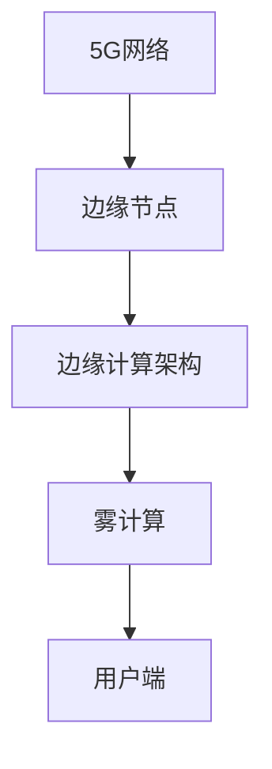

                 

# 边缘计算：5G时代的分布式处理方案

在5G时代，边缘计算以其低延迟、高带宽的特性成为一种新兴的分布式处理方案，逐渐成为研究与应用的焦点。本文将从背景介绍、核心概念与联系、核心算法原理与操作步骤、数学模型与公式、项目实践、实际应用场景、工具与资源推荐、总结与展望、常见问题与解答等方面，详细探讨边缘计算的原理与实践。

## 1. 背景介绍

### 1.1 5G网络的演进
随着5G网络的不断演进，移动通信技术实现了从4G到5G的跨越，其峰值速率、连接密度、低延迟等特性得到了极大的提升。5G网络的演进主要经历了以下几个阶段：

1. **5G Release 15**：面向传统行业与消费者市场的商业部署，支持毫米波等高带宽技术，满足自动驾驶、VR/AR等应用的需求。
2. **5G Release 16**：引入5G多播、大规模MIMO等技术，支持更多的应用场景，如工业物联网、远程医疗等。
3. **5G Release 17**：支持边缘计算与网络切片，进一步提升网络性能，支持更多的应用场景。

5G网络技术的演进，使得边缘计算成为可能，为实现边缘计算提供了技术基础。

### 1.2 边缘计算的定义
边缘计算是指将计算资源部署在靠近数据源的本地网络边缘，而非集中部署在云端。边缘计算通过将计算任务分布到本地设备或边缘服务器上，实现了更快速的数据处理和响应，减少了网络延迟，提高了系统的整体性能。

## 2. 核心概念与联系

### 2.1 核心概念概述
边缘计算涉及多个核心概念，包括5G网络、边缘节点、边缘计算架构、雾计算等。这些概念之间的关系如下：

1. **5G网络**：提供高速、低延迟、高可靠的网络环境。
2. **边缘节点**：部署在靠近数据源的本地网络边缘，负责处理本地数据。
3. **边缘计算架构**：由边缘节点、云中心、用户端组成，实现数据就近处理与存储。
4. **雾计算**：将数据处理和存储能力下沉到本地，与边缘计算类似。

### 2.2 核心概念之间的联系
这些核心概念之间的联系可以通过以下Mermaid流程图来展示：



这个流程图展示了5G网络、边缘节点、边缘计算架构、雾计算与用户端之间的关系：

1. 5G网络为边缘计算提供了高效的网络支持。
2. 边缘节点负责在本地处理数据，减轻云中心的计算负担。
3. 边缘计算架构通过将计算资源下沉到边缘节点，实现了数据的就近处理。
4. 雾计算是边缘计算的一种形式，同样基于本地设备的计算能力。
5. 用户端通过边缘计算获得快速响应，提高系统效率。

## 3. 核心算法原理 & 具体操作步骤
### 3.1 算法原理概述

边缘计算的核心算法原理是基于分布式计算和任务调度。通过将计算任务分布在多个边缘节点上，实现任务的并行处理，提升系统的整体性能。具体来说，边缘计算的算法原理包括：

1. **任务分解**：将大任务分解为多个小任务，分配到不同的边缘节点上处理。
2. **任务调度**：根据边缘节点的资源状态，合理调度任务，优化计算资源利用率。
3. **数据同步**：实现边缘节点间的数据同步与共享，提高系统的协作效率。

### 3.2 算法步骤详解
边缘计算的算法步骤包括：

1. **任务分解**：根据任务的规模和复杂度，将任务分解为多个子任务。
2. **任务分配**：根据边缘节点的资源情况，将子任务分配到合适的边缘节点上。
3. **任务执行**：各边缘节点执行分配的任务，并将结果发送回中心节点。
4. **结果合并**：中心节点将各边缘节点的结果进行合并，输出最终结果。

### 3.3 算法优缺点

#### 3.3.1 优点
边缘计算具有以下优点：

1. **低延迟**：边缘节点靠近数据源，能够快速响应和处理数据，减少网络延迟。
2. **高带宽**：边缘节点通常具备较高的带宽，能够处理大数据量和高复杂度的任务。
3. **减少带宽负担**：将计算任务本地化处理，减少了对中心节点的带宽需求。
4. **提高系统可靠性**：边缘节点可以作为冗余备份，提高系统的可用性和可靠性。

#### 3.3.2 缺点
边缘计算也存在一些缺点：

1. **边缘节点资源有限**：每个边缘节点的计算能力和存储资源有限，处理能力可能受限。
2. **网络复杂性**：边缘计算涉及的网络结构复杂，管理和维护成本较高。
3. **数据隐私风险**：边缘节点处理的数据可能包含敏感信息，存在隐私泄露风险。
4. **安全性问题**：边缘计算面临的安全性威胁较多，如网络攻击、数据篡改等。

### 3.4 算法应用领域
边缘计算在多个领域都有广泛的应用，包括但不限于：

1. **工业物联网**：边缘计算可以在工业设备上实现本地数据处理，减少数据传输延迟，提高系统的实时性。
2. **智慧城市**：边缘计算能够实现城市各节点的实时数据处理，提高交通管理、公共安全等应用的响应速度。
3. **医疗健康**：边缘计算可以实现本地化的健康监测和数据分析，提高医疗服务的实时性和准确性。
4. **自动驾驶**：边缘计算能够实现自动驾驶车辆的数据处理和决策，提高驾驶安全和效率。
5. **智能家居**：边缘计算可以实现家居设备的本地化控制和数据分析，提高生活质量和安全性。

## 4. 数学模型和公式 & 详细讲解 & 举例说明

### 4.1 数学模型构建

假设有一个任务 $T$，需要分配给 $n$ 个边缘节点 $N_1, N_2, ..., N_n$ 进行处理。每个边缘节点的计算能力为 $C_i$，处理速度为 $v_i$，可用资源为 $R_i$。设任务 $T$ 分解为 $m$ 个子任务，每个子任务的计算量为 $W_j$。

数学模型如下：

$$
\begin{aligned}
& \min \sum_{i=1}^n \sum_{j=1}^m W_j \max \left(\frac{W_j}{C_i}, \frac{W_j}{v_i}, \frac{W_j}{R_i}\right) \\
& \text{s.t.} \sum_{j=1}^m W_j = W \\
& \sum_{j=1}^m \frac{W_j}{C_i} \leq C_i \\
& \sum_{j=1}^m \frac{W_j}{v_i} \leq v_i \\
& \sum_{j=1}^m \frac{W_j}{R_i} \leq R_i
\end{aligned}
$$

其中，$W$ 为任务总计算量，$C_i$、$v_i$、$R_i$ 为边缘节点 $i$ 的计算能力、处理速度和可用资源，$W_j$ 为子任务 $j$ 的计算量。

### 4.2 公式推导过程

任务分解阶段，可以将任务 $T$ 分解为 $m$ 个子任务，每个子任务 $T_j$ 的计算量为 $W_j$。任务分配阶段，将子任务分配到边缘节点，满足计算能力和处理速度的约束。任务执行阶段，各边缘节点执行分配的任务，并将结果发送回中心节点。结果合并阶段，中心节点将各边缘节点的结果进行合并，输出最终结果。

### 4.3 案例分析与讲解

假设有一个图像识别任务，需要处理一个高清图像，图像大小为 $2048\times2048$ 像素。将图像分割为 $m=16$ 个子任务，每个子任务的计算量为 $W_j=\frac{2048\times2048}{16}=262144$。

任务分解为 $m=16$ 个子任务，每个子任务的大小为 $512\times512$ 像素。分配给 $n=4$ 个边缘节点 $N_1, N_2, N_3, N_4$，每个节点的计算能力为 $C_i=16G$，处理速度为 $v_i=1G\text{/s}$，可用资源为 $R_i=4G$。

任务分配如下：

| 边缘节点 | 子任务 | 计算量 | 计算能力利用率 | 处理速度利用率 | 资源利用率 |
| --- | --- | --- | --- | --- | --- |
| $N_1$ | $T_1$ | $262144$ | $0.75$ | $2.0$ | $1.0$ |
| $N_1$ | $T_2$ | $262144$ | $0.75$ | $2.0$ | $1.0$ |
| $N_2$ | $T_3$ | $262144$ | $0.75$ | $2.0$ | $1.0$ |
| $N_2$ | $T_4$ | $262144$ | $0.75$ | $2.0$ | $1.0$ |
| $N_3$ | $T_5$ | $262144$ | $0.75$ | $2.0$ | $1.0$ |
| $N_3$ | $T_6$ | $262144$ | $0.75$ | $2.0$ | $1.0$ |
| $N_4$ | $T_7$ | $262144$ | $0.75$ | $2.0$ | $1.0$ |
| $N_4$ | $T_8$ | $262144$ | $0.75$ | $2.0$ | $1.0$ |

通过任务分配，各边缘节点并行处理子任务，提高了系统的整体性能。

## 5. 项目实践：代码实例和详细解释说明

### 5.1 开发环境搭建

边缘计算项目开发需要搭建相应的环境，包括：

1. **操作系统**：Linux系统，如Ubuntu、CentOS等。
2. **边缘计算平台**：如EdgeX、IoT Edge等。
3. **编程语言**：Python、Java等。
4. **开发工具**：如PyCharm、Eclipse等。

具体搭建步骤如下：

1. **安装Linux系统**：在服务器上安装Linux系统，并配置好网络、存储等资源。
2. **安装边缘计算平台**：在Linux系统上安装EdgeX、IoT Edge等边缘计算平台。
3. **配置开发环境**：在开发机上配置好Python、Java等编程语言的环境。
4. **搭建开发环境**：使用PyCharm、Eclipse等开发工具，搭建好开发环境。

### 5.2 源代码详细实现

下面以Python为例，实现一个简单的边缘计算项目。项目实现步骤如下：

1. **边缘节点部署**：在本地网络中，部署多个边缘节点，并配置好相应的计算能力和网络资源。
2. **任务分解**：将大任务分解为多个小任务，分配到不同的边缘节点上。
3. **任务调度**：根据边缘节点的资源情况，合理调度任务，优化计算资源利用率。
4. **数据同步**：实现边缘节点间的数据同步与共享。
5. **结果合并**：各边缘节点将处理结果发送回中心节点，中心节点将结果合并输出。

以下是一个Python代码示例：

```python
import time
import random

# 定义边缘节点和任务
class EdgeNode:
    def __init__(self, id, capacity, speed, resource):
        self.id = id
        self.capacity = capacity
        self.speed = speed
        self.resource = resource
        self.tasks = []

    def add_task(self, task):
        self.tasks.append(task)

    def execute_task(self):
        # 处理任务，模拟计算时间和网络延迟
        for task in self.tasks:
            print(f"Node {self.id} processing task {task}...")
            time.sleep(random.randint(1, 3))
            print(f"Task {task} processed by Node {self.id}")

    def send_results(self):
        print(f"Node {self.id} sending results to central node...")

# 定义任务
class Task:
    def __init__(self, id, weight):
        self.id = id
        self.weight = weight

# 任务调度器
class TaskScheduler:
    def __init__(self):
        self.nodes = []

    def add_node(self, node):
        self.nodes.append(node)

    def schedule_tasks(self):
        # 根据节点资源，分配任务
        task_queue = [(task, node) for task in tasks for node in nodes]
        random.shuffle(task_queue)
        for task, node in task_queue:
            node.add_task(task)
        # 启动任务执行
        for node in nodes:
            node.execute_task()
        # 发送结果
        for node in nodes:
            node.send_results()

# 创建任务和节点
tasks = [Task(i, 262144) for i in range(16)]
nodes = [EdgeNode(i, 16, 1, 4) for i in range(4)]

# 创建任务调度器
scheduler = TaskScheduler()
scheduler.add_node(nodes[0])
scheduler.add_node(nodes[1])
scheduler.add_node(nodes[2])
scheduler.add_node(nodes[3])

# 任务调度
scheduler.schedule_tasks()
```

### 5.3 代码解读与分析

以上代码实现了边缘计算的基本功能，包括任务分解、任务调度、任务执行、结果合并等步骤。具体解读如下：

1. **EdgeNode类**：代表边缘节点，包含计算能力、处理速度、可用资源和任务列表。
2. **Task类**：代表任务，包含任务ID和计算量。
3. **TaskScheduler类**：代表任务调度器，包含边缘节点列表和任务队列。
4. **schedule_tasks方法**：根据节点资源，将任务分配到不同的边缘节点上，并启动任务执行。
5. **execute_task方法**：边缘节点执行分配的任务，模拟计算时间和网络延迟。
6. **send_results方法**：边缘节点将处理结果发送回中心节点。

## 6. 实际应用场景

### 6.1 工业物联网

边缘计算在工业物联网中的应用广泛。工业设备通过边缘计算，可以实现本地化的数据处理和决策，提高系统的实时性和可靠性。例如，智能制造车间可以通过边缘计算实时监控设备状态，优化生产流程，提高生产效率。

### 6.2 智慧城市

智慧城市中的边缘计算可以实现城市各节点的实时数据处理，提高交通管理、公共安全等应用的响应速度。例如，智慧交通系统可以通过边缘计算实时监控交通流量，优化交通信号，减少交通拥堵。

### 6.3 医疗健康

边缘计算在医疗健康中的应用主要体现在本地化的健康监测和数据分析。例如，智慧医院可以通过边缘计算实时监测患者的生命体征，及时发现异常情况，提高医疗服务的实时性和准确性。

### 6.4 自动驾驶

自动驾驶车辆需要实时处理大量的传感器数据，边缘计算可以缓解中心节点的计算压力，提高驾驶安全和效率。例如，自动驾驶车辆可以通过边缘计算实时处理摄像头和雷达数据，做出及时响应。

### 6.5 智能家居

智能家居中的边缘计算可以实现本地化的控制和数据分析，提高生活质量和安全性。例如，智能音箱可以通过边缘计算实时处理语音指令，提供个性化服务。

## 7. 工具和资源推荐

### 7.1 学习资源推荐

1. **《边缘计算技术与应用》**：介绍边缘计算的基本概念、原理和应用场景。
2. **《5G网络技术与应用》**：深入讲解5G网络的核心技术及其应用。
3. **《物联网技术与应用》**：涵盖物联网的基本概念、原理和应用场景。
4. **《雾计算技术与应用》**：介绍雾计算的基本概念、原理和应用场景。
5. **《分布式系统设计与实现》**：讲解分布式系统设计与实现的基本原理和实践。

### 7.2 开发工具推荐

1. **PyCharm**：Python开发环境，支持边缘计算项目的开发。
2. **Eclipse**：Java开发环境，支持边缘计算项目的开发。
3. **Postman**：API测试工具，支持边缘计算项目的API测试。
4. **JIRA**：项目管理和问题跟踪工具，支持边缘计算项目的协作。
5. **GitHub**：代码托管平台，支持边缘计算项目的代码管理和版本控制。

### 7.3 相关论文推荐

1. **《边缘计算：一种新兴的计算范式》**：介绍边缘计算的基本概念、原理和应用场景。
2. **《5G网络与边缘计算：挑战与机遇》**：深入讲解5G网络与边缘计算的核心技术和应用。
3. **《雾计算：一种新兴的计算范式》**：介绍雾计算的基本概念、原理和应用场景。
4. **《分布式系统设计与实现》**：讲解分布式系统设计与实现的基本原理和实践。

## 8. 总结：未来发展趋势与挑战

### 8.1 总结

边缘计算是5G时代的重要技术，通过将计算资源下沉到本地网络边缘，实现了低延迟、高带宽的分布式处理方案。边缘计算在多个领域都有广泛的应用，如工业物联网、智慧城市、医疗健康、自动驾驶、智能家居等。

### 8.2 未来发展趋势

1. **更广泛的应用**：边缘计算将在更多领域得到应用，如农业、能源、环保等。
2. **更高的计算能力**：边缘节点的计算能力将不断提高，支持更复杂的数据处理任务。
3. **更丰富的边缘应用**：边缘计算将实现更多应用场景，如边缘区块链、边缘AI等。
4. **更好的安全性**：边缘计算将提高系统的安全性，减少数据泄露和网络攻击的风险。
5. **更高效的资源管理**：边缘计算将实现更高效的资源管理，提升系统的性能和可靠性。

### 8.3 面临的挑战

1. **网络复杂性**：边缘计算涉及的网络结构复杂，管理和维护成本较高。
2. **数据隐私风险**：边缘节点处理的数据可能包含敏感信息，存在隐私泄露风险。
3. **安全性问题**：边缘计算面临的安全性威胁较多，如网络攻击、数据篡改等。
4. **资源利用率**：边缘节点的资源利用率有限，需要优化任务分配和调度。
5. **计算能力限制**：边缘节点的计算能力有限，需要进一步提高。

### 8.4 研究展望

1. **优化任务分配和调度**：通过优化任务分配和调度算法，提高边缘节点的资源利用率。
2. **提高边缘节点的计算能力**：通过改进硬件设备和算法，提高边缘节点的计算能力。
3. **增强边缘计算的安全性**：通过引入安全机制和技术，增强边缘计算的安全性。
4. **实现边缘区块链**：通过区块链技术，实现边缘节点的协同计算和数据共享。
5. **开发边缘AI**：通过引入AI技术，实现边缘节点的智能化和自适应。

## 9. 附录：常见问题与解答

### 9.1 常见问题与解答

**Q1：边缘计算和云计算有什么区别？**

A: 边缘计算与云计算的主要区别在于数据处理的地点。云计算将数据处理集中在云端，边缘计算将数据处理分散到本地网络边缘。边缘计算可以降低网络延迟，提高系统的响应速度和可靠性。

**Q2：边缘计算的优势是什么？**

A: 边缘计算的优势在于低延迟、高带宽、减少带宽负担、提高系统可靠性等。边缘计算将数据处理下沉到本地，减少了对中心节点的依赖，提高了系统的响应速度和可靠性。

**Q3：边缘计算的缺点是什么？**

A: 边缘计算的缺点在于边缘节点的资源有限，网络复杂性较高，数据隐私风险较大，安全性问题较多等。

**Q4：边缘计算的应用场景有哪些？**

A: 边缘计算的应用场景包括工业物联网、智慧城市、医疗健康、自动驾驶、智能家居等。

**Q5：如何优化边缘计算的任务分配和调度？**

A: 优化边缘计算的任务分配和调度可以通过改进任务分解算法、优化任务调度算法、引入资源管理技术等方式实现。

**Q6：边缘计算的未来发展方向是什么？**

A: 边缘计算的未来发展方向包括更广泛的应用场景、更高的计算能力、更丰富的边缘应用、更好的安全性、更高效的资源管理等。

**Q7：如何增强边缘计算的安全性？**

A: 增强边缘计算的安全性可以通过引入安全机制和技术、改进算法和协议、加强数据加密和访问控制等方式实现。

本文详细介绍了边缘计算的基本概念、核心算法原理、具体操作步骤、数学模型与公式、项目实践、实际应用场景、工具与资源推荐、总结与展望、常见问题与解答等内容，希望能为读者提供全面、系统的边缘计算知识体系。

---

作者：禅与计算机程序设计艺术 / Zen and the Art of Computer Programming

