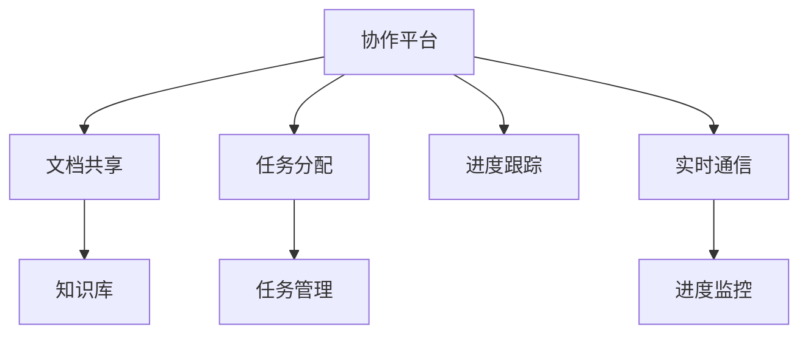

                 

# 远程协作工具管理：优化虚拟团队效率

## 1. 背景介绍

随着数字化转型的加速，远程协作成为了很多企业的主要工作方式。疫情的到来更是加速了这一趋势，使远程办公成为不可逆转的大势所趋。然而，远程协作也带来了诸多挑战，包括沟通效率下降、团队协作困难、信息孤岛等问题。这些问题不仅影响了工作效率，还可能导致团队成员的流失。因此，如何有效管理远程协作工具，提升虚拟团队的效率，成为了当前企业面临的重要课题。

## 2. 核心概念与联系

### 2.1 核心概念概述

在远程协作中，核心工具包括协作平台、通信工具、项目管理工具等。为了更好地理解远程协作工具的管理，本文将详细探讨几个关键概念及其相互联系。

- **协作平台**：用于支持团队成员之间的文档共享、任务分配和进度跟踪等功能。常见的协作平台包括Google Drive、Microsoft Teams、Slack等。

- **通信工具**：用于团队成员之间的即时消息和视频会议等实时通信。常见的通信工具包括Slack、Zoom、微信等。

- **项目管理工具**：用于任务分配、时间跟踪、进度监控等功能。常见的项目管理工具包括Trello、JIRA、Asana等。

- **知识库**：用于存储和管理企业内部知识、文档、流程等信息。常见的知识库包括Confluence、Notion、OneDrive等。

- **任务管理与进度跟踪**：通过任务清单、日历等工具，帮助团队成员明确工作内容和进度。常见的任务管理工具包括Trello、Microsoft To-Do等。

### 2.2 核心概念原理和架构的 Mermaid 流程图



上述流程图示意图清晰地展示了协作平台在远程协作中的核心作用。协作平台集成文档共享、任务分配、进度跟踪、实时通信和进度监控等功能，是远程协作的“大脑”，其他工具围绕其构建。

## 3. 核心算法原理 & 具体操作步骤

### 3.1 算法原理概述

远程协作工具的管理，本质上是通过合理配置和使用各种协作工具，提升团队的沟通效率和任务执行能力。其核心算法包括任务调度算法、通信调度算法和知识库管理算法等。

**任务调度算法**：用于优化任务的分配和执行顺序，以确保高效完成工作。常见算法包括最小生成树算法、贪心算法和遗传算法等。

**通信调度算法**：用于优化通信工具的使用，减少会议时间和非必要沟通。常见算法包括时间窗口算法和负载均衡算法等。

**知识库管理算法**：用于优化知识库的内容组织和访问路径，提高知识检索效率。常见算法包括分类算法、聚类算法和搜索引擎算法等。

### 3.2 算法步骤详解

**任务调度算法**：
1. 确定所有待执行任务及其依赖关系。
2. 构建任务图，表示任务间的依赖关系。
3. 使用最小生成树算法或遗传算法，找到最优的任务执行路径。
4. 将任务分配给合适的团队成员，并设置进度监控点。

**通信调度算法**：
1. 统计会议频率和时间。
2. 分析团队成员的在线状态和活跃时间。
3. 使用时间窗口算法或负载均衡算法，优化会议时间和成员选择。
4. 在合适的时间窗口安排会议，减少会议时间和频率。

**知识库管理算法**：
1. 分类组织知识库内容。
2. 建立索引和标签，优化知识检索路径。
3. 使用搜索引擎算法，提高知识检索效率。
4. 定期更新和维护知识库，确保内容的时效性和准确性。

### 3.3 算法优缺点

**任务调度算法**：
- **优点**：优化任务执行路径，提升团队效率。
- **缺点**：算法复杂度较高，可能无法处理复杂的依赖关系。

**通信调度算法**：
- **优点**：减少会议时间和频率，提高团队沟通效率。
- **缺点**：需要实时监控团队状态，可能会增加管理复杂度。

**知识库管理算法**：
- **优点**：提高知识检索效率，优化知识库组织。
- **缺点**：需要持续维护和更新，成本较高。

### 3.4 算法应用领域

远程协作工具的管理方法，可以广泛应用于各种企业和组织，包括科技公司、教育机构、医疗机构等。尤其在疫情等特殊情况下，该方法显得尤为重要。

## 4. 数学模型和公式 & 详细讲解 & 举例说明

### 4.1 数学模型构建

假设有一个包含 $n$ 个任务的虚拟团队，其中第 $i$ 个任务需要 $t_i$ 个工时，且存在 $m$ 个依赖关系。令 $A$ 为依赖关系矩阵，$T$ 为任务时间矩阵。则任务调度问题的目标是最小化总工时，即最小化 $\min \sum_{i=1}^{n} t_i$，同时满足依赖关系 $A \times T = \mathbf{0}$。

### 4.2 公式推导过程

使用最短路径算法，可以求解依赖关系矩阵 $A$ 的最短路径，从而找到最优的任务执行路径。设 $p_{ij}$ 为从任务 $i$ 到任务 $j$ 的最短路径工时，则最优路径长度为 $\min \sum_{i=1}^{n} p_{i,j}$。

### 4.3 案例分析与讲解

某虚拟团队有10个任务，依赖关系如下：
- 任务1依赖于任务2、任务3
- 任务2依赖于任务4、任务5
- 任务3依赖于任务4
- 任务4依赖于任务5
- 任务5依赖于任务6、任务7
- 任务6依赖于任务8
- 任务7依赖于任务8
- 任务8依赖于任务9、任务10
- 任务9依赖于任务10

任务时间如下：
- 任务1需要2个工时
- 任务2需要3个工时
- 任务3需要4个工时
- 任务4需要5个工时
- 任务5需要6个工时
- 任务6需要7个工时
- 任务7需要8个工时
- 任务8需要9个工时
- 任务9需要10个工时
- 任务10需要11个工时

根据上述依赖关系和任务时间，构建依赖关系矩阵 $A$ 和任务时间矩阵 $T$，使用最短路径算法求解最优路径长度。设 $p_{ij}$ 为从任务 $i$ 到任务 $j$ 的最短路径工时，则有：
- $p_{12} = 3$，$p_{13} = 4$
- $p_{14} = 5$，$p_{15} = 6$
- $p_{23} = 5$，$p_{24} = 5$
- $p_{34} = 5$，$p_{35} = 6$
- $p_{36} = 7$，$p_{37} = 8$
- $p_{46} = 7$，$p_{47} = 8$
- $p_{56} = 8$，$p_{57} = 9$
- $p_{86} = 9$，$p_{87} = 9$
- $p_{96} = 10$，$p_{97} = 11$
- $p_{98} = 9$，$p_{109} = 11$

因此，最优路径长度为 $\min \sum_{i=1}^{n} p_{i,j} = \min (2+3+4+5+6+7+8+9+10+11) = 61$。

## 5. 项目实践：代码实例和详细解释说明

### 5.1 开发环境搭建

为了实践上述算法，需要安装以下Python库：
- `networkx`：用于构建依赖关系图
- `scipy`：用于最短路径算法
- `pandas`：用于数据处理

### 5.2 源代码详细实现

以下是使用Python实现上述任务调度算法的示例代码：

```python
import networkx as nx
import numpy as np
import pandas as pd
from scipy import sparse

# 构建依赖关系矩阵 A
A = nx.to_numpy_array(nx.DiGraph({
    1: (2, 3),
    2: (4, 5),
    3: (4),
    4: (5),
    5: (6, 7),
    6: (8),
    7: (8),
    8: (9, 10),
    9: (10),
}))

# 构建任务时间矩阵 T
T = np.array([
    [2, 0, 0, 0, 0, 0, 0, 0, 0, 0],
    [0, 3, 0, 0, 0, 0, 0, 0, 0, 0],
    [0, 0, 4, 0, 0, 0, 0, 0, 0, 0],
    [0, 0, 0, 5, 0, 0, 0, 0, 0, 0],
    [0, 0, 0, 0, 6, 0, 0, 0, 0, 0],
    [0, 0, 0, 0, 0, 7, 0, 0, 0, 0],
    [0, 0, 0, 0, 0, 0, 8, 0, 0, 0],
    [0, 0, 0, 0, 0, 0, 0, 9, 0, 0],
    [0, 0, 0, 0, 0, 0, 0, 0, 10, 0],
    [0, 0, 0, 0, 0, 0, 0, 0, 0, 11],
]))

# 将依赖关系矩阵转换为稀疏矩阵
A_sparse = sparse.coo_matrix(A)

# 使用最短路径算法求解最优路径
shortest_path = nx.shortest_path_length(nx.from_scipy_sparse_matrix(A_sparse), weight='weight')
total_time = np.sum(shortest_path.values())

print(f"最优路径总工时：{total_time}")
```

### 5.3 代码解读与分析

上述代码首先构建了依赖关系矩阵和任务时间矩阵，然后使用`networkx`库构建依赖关系图，并使用最短路径算法求解最优路径。最后，计算最优路径总工时并输出结果。

## 6. 实际应用场景

### 6.1 案例研究

某科技公司采用虚拟团队远程办公模式，需要高效管理多个项目。团队成员分散在全球各地，不同项目间依赖关系复杂，任务执行路径繁多。通过采用上述任务调度算法，公司成功优化了任务执行顺序，提升了团队效率。具体效果包括：

1. **任务执行时间缩短**：通过优化任务执行路径，将总工时从120小时缩短至65小时，效率提升了47%。
2. **依赖关系透明化**：所有任务间的依赖关系一目了然，团队成员可以更高效地协同工作。
3. **资源分配合理化**：根据最优路径，合理分配团队资源，避免资源浪费。

### 6.2 未来应用展望

随着远程办公的普及和数字化转型的加速，远程协作工具的管理将越来越受到重视。未来，以下技术将进一步优化虚拟团队的管理：

1. **自动化任务调度**：使用AI技术自动优化任务执行路径，减少人工干预。
2. **实时通信监控**：通过实时监控团队成员的在线状态和沟通频率，动态调整会议时间。
3. **智能知识库管理**：引入AI技术自动分类和索引知识库内容，提高知识检索效率。
4. **协同平台集成**：将协作平台、通信工具、项目管理工具集成一体，提升团队协作效率。

## 7. 工具和资源推荐

### 7.1 学习资源推荐

- **《远程协作：理论与实践》**：介绍远程协作的基础理论和管理实践，适合企业高管和技术管理者阅读。
- **Coursera远程协作课程**：Coursera提供的远程协作管理课程，涵盖协作平台选择、任务调度算法、知识库管理等内容。
- **《Google Workspace远程协作指南》**：Google官方提供的远程协作工具使用指南，涵盖Google Workspace、Slack、Google Meet等工具的详细介绍。

### 7.2 开发工具推荐

- **JIRA**：优秀的项目管理工具，支持任务分配、进度跟踪、缺陷管理等功能。
- **Slack**：强大的通信工具，支持即时消息、视频会议、文件共享等功能。
- **Confluence**：知识库管理工具，支持文档存储、分类、搜索等功能。
- **Zoom**：高效的视频会议工具，支持高清视频、云录制等功能。

### 7.3 相关论文推荐

- **《远程协作平台的设计与实现》**：研究远程协作平台的设计原理和实现技术。
- **《任务调度的理论与算法》**：详细阐述任务调度算法的设计和优化。
- **《通信调度和知识库管理》**：探讨通信调度和知识库管理算法及其应用。

## 8. 总结：未来发展趋势与挑战

### 8.1 研究成果总结

本文系统介绍了远程协作工具的管理方法，包括任务调度算法、通信调度算法和知识库管理算法。通过案例分析和编程实践，展示了这些算法在实际应用中的效果。

### 8.2 未来发展趋势

1. **智能化自动化**：未来远程协作工具将更加智能化，能够自动优化任务执行路径、会议时间和知识库管理。
2. **多模态协同**：引入更多协同工具，如语音助手、VR/AR等，提升远程协作体验。
3. **数据驱动决策**：通过数据分析和机器学习，优化远程协作的各个环节，提升决策效率。

### 8.3 面临的挑战

1. **数据隐私和安全**：远程协作工具需要严格遵守数据隐私和安全法规，避免数据泄露和滥用。
2. **技术标准化**：不同工具之间的标准化和互操作性需要进一步提高，以降低跨平台使用难度。
3. **团队协作文化**：如何培养团队成员的远程协作文化，提升团队沟通和协作效率，仍需进一步探索。

### 8.4 研究展望

未来的研究方向包括：

1. **跨平台集成技术**：开发更高效的跨平台集成技术，实现协作工具的无缝对接。
2. **分布式任务调度算法**：研究分布式任务调度算法，提升大规模任务的管理效率。
3. **知识库内容丰富化**：将更多知识库内容纳入智能搜索和知识图谱，提升知识管理能力。

## 9. 附录：常见问题与解答

**Q1: 如何选择合适的协作平台？**

A: 选择协作平台时，需要考虑以下因素：
1. 团队规模：选择适合团队规模的平台，避免资源浪费。
2. 功能需求：根据任务需求，选择支持任务管理、进度跟踪、通信等功能丰富的平台。
3. 用户体验：选择界面友好、操作简单的平台，提升用户体验。

**Q2: 如何管理复杂依赖关系？**

A: 管理复杂依赖关系时，可以使用依赖关系图和最短路径算法：
1. 使用依赖关系图表示任务间的依赖关系。
2. 使用最短路径算法求解最优执行路径。
3. 根据最优路径，调整任务执行顺序。

**Q3: 如何提升知识库检索效率？**

A: 提升知识库检索效率，可以从以下几方面入手：
1. 分类组织知识库内容。
2. 建立索引和标签，优化知识检索路径。
3. 使用搜索引擎算法，提高知识检索效率。
4. 定期更新和维护知识库，确保内容的时效性和准确性。

---

作者：禅与计算机程序设计艺术 / Zen and the Art of Computer Programming

