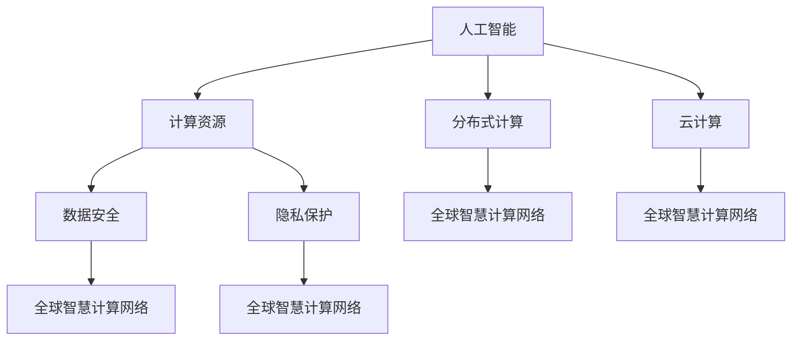

                 

# 连接全球智慧：人类计算的全球影响力

> 关键词：人工智能，计算资源，分布式计算，云计算，数据安全，人类智慧

## 1. 背景介绍

### 1.1 问题由来

在信息技术迅猛发展的今天，全球范围内的智慧连接已经成为了一种不可逆转的趋势。随着数字化、智能化的不断演进，人类社会对于计算资源的依赖性越来越高，同时也面临着资源配置、数据安全和隐私保护等挑战。如何在全球范围内实现计算资源的优化配置，充分挖掘和利用人类的智慧，是一个亟待解决的重要问题。

### 1.2 问题核心关键点

当前，人类计算正处于飞速发展阶段，其核心关键点在于如何通过分布式计算、云计算等技术手段，将全球范围内的计算资源进行高效整合，提升整体计算能力。同时，还要在数据共享与保护、安全保障、隐私保护等方面进行平衡，确保计算过程的公平、透明和安全。

### 1.3 问题研究意义

研究人类计算的全球影响力，对于推动全球数字化转型、提升计算资源配置效率、保障数据安全和隐私保护具有重要意义。通过构建全球智慧计算网络，可以实现资源的跨区域、跨组织共享，提升全球范围内的科技水平和创新能力，促进社会经济的可持续发展。

## 2. 核心概念与联系

### 2.1 核心概念概述

为更好地理解人类计算的全球影响力，本节将介绍几个密切相关的核心概念：

- **人工智能(AI)**：通过数据和算法实现模拟人类智能过程的技术，涵盖机器学习、深度学习、自然语言处理、计算机视觉等多个领域。
- **计算资源**：指用于进行计算操作的硬件设备和软件工具，如CPU、GPU、云服务器、数据中心等。
- **分布式计算**：通过将计算任务分解并分配给多个节点并行执行，提高计算效率的技术。
- **云计算**：通过网络提供计算资源和服务，实现资源共享和弹性伸缩的计算模式。
- **数据安全**：通过技术手段保护数据不被未授权访问、篡改和泄露的过程。
- **隐私保护**：保护个人隐私信息不被滥用或泄露，确保计算过程的透明度和可信度。
- **全球智慧计算网络**：构建跨越地理、组织、行业界限的智慧计算平台，实现资源高效整合和共享。

这些核心概念之间的逻辑关系可以通过以下Mermaid流程图来展示：



这个流程图展示了一系列关键概念及其之间的关系：

1. 人工智能通过计算资源和分布式计算能力进行实现和应用。
2. 云计算为人工智能提供了高效、弹性的资源支持。
3. 数据安全和隐私保护是计算过程的关键要素，保障计算过程的可靠性和可信度。
4. 全球智慧计算网络是实现资源共享和整合的桥梁。

这些概念共同构成了人类计算的全球影响力的核心框架，为其发展和应用提供了理论基础。

## 3. 核心算法原理 & 具体操作步骤

### 3.1 算法原理概述

人类计算的全球影响力体现在通过分布式计算和云计算技术，将全球范围内的计算资源进行高效整合和利用。其核心算法原理包括以下几个方面：

1. **分布式计算算法**：通过将计算任务分解为多个子任务，并分配给多个节点并行执行，优化资源利用率和计算速度。常见的分布式计算算法包括MapReduce、Spark等。

2. **云计算平台架构**：通过构建云服务基础设施，实现计算资源的弹性伸缩和共享。云计算平台架构包括IaaS（基础设施即服务）、PaaS（平台即服务）和SaaS（软件即服务）等。

3. **数据安全与隐私保护算法**：通过数据加密、访问控制、审计跟踪等技术手段，确保数据在传输和存储过程中的安全性和隐私性。

4. **全球智慧计算网络**：构建跨区域、跨组织的计算平台，实现数据的无缝流动和共享。全球智慧计算网络包括公共云计算、私有云计算和混合云计算等模式。

### 3.2 算法步骤详解

人类计算的全球影响力实现过程大致包括以下几个关键步骤：

**Step 1: 资源评估与规划**

- 收集全球范围内的计算资源信息，包括CPU、GPU、存储、带宽等。
- 评估不同地区的计算资源利用率和成本，制定合理的资源分配和规划方案。

**Step 2: 分布式计算框架搭建**

- 选择合适的分布式计算框架，如Apache Hadoop、Apache Spark等。
- 搭建分布式计算集群，配置网络、存储和计算资源。
- 部署分布式计算任务，优化任务调度算法。

**Step 3: 云平台架构设计**

- 选择合适的云平台服务，如AWS、Azure、Google Cloud等。
- 设计云平台架构，包括网络、存储、安全等。
- 实现云平台资源的弹性伸缩和按需计费。

**Step 4: 数据安全与隐私保护**

- 实施数据加密和传输安全，确保数据在网络中的安全传输。
- 建立访问控制机制，限制数据访问权限。
- 实现数据审计和监控，确保数据访问的透明度和可追溯性。

**Step 5: 全球智慧计算网络构建**

- 构建跨区域、跨组织的智慧计算平台，实现数据和计算资源的共享。
- 制定平台协议和标准，确保不同系统之间的互操作性。
- 实现数据和计算资源的动态调度和管理。

**Step 6: 应用开发与部署**

- 开发和部署智慧计算应用，如数据分析、机器学习、人工智能等。
- 实现应用的高可用性和高可靠性。
- 提供用户接口和API，方便用户访问和使用计算资源。

### 3.3 算法优缺点

人类计算的全球影响力在实现过程中，具有以下优点：

1. **资源高效利用**：通过分布式计算和云计算技术，将全球范围内的计算资源进行优化配置，提升整体计算能力。
2. **弹性伸缩**：根据计算任务的需求，灵活调整计算资源，实现资源的按需分配和回收。
3. **数据共享与合作**：通过全球智慧计算网络，实现数据的跨区域、跨组织共享，促进科研合作和技术创新。
4. **降低成本**：通过资源共享和集中化管理，降低单个组织的计算成本。

同时，也存在以下缺点：

1. **数据安全与隐私风险**：跨组织、跨地域的数据共享存在数据安全和隐私保护的风险。
2. **网络延迟与带宽限制**：分布式计算和云平台的数据传输和访问存在网络延迟和带宽限制的问题。
3. **技术复杂性**：实现全球智慧计算网络需要高度复杂的技术架构和管理机制。

### 3.4 算法应用领域

人类计算的全球影响力已经广泛应用于以下几个领域：

- **科学研究**：通过分布式计算和云平台，实现大规模数据处理和科学计算，推动科研进步。
- **医疗健康**：通过云计算平台，实现医疗数据共享和医疗服务的智能化，提升医疗水平。
- **金融行业**：通过全球智慧计算网络，实现金融数据的共享和分析，提升金融服务效率。
- **教育领域**：通过云平台，实现教育资源的共享和远程教育，促进教育公平。
- **环境保护**：通过分布式计算和云计算，实现环境数据的实时监测和分析，推动环境保护。
- **智慧城市**：通过智慧计算网络，实现城市数据的共享和智能化管理，提升城市治理水平。

## 4. 数学模型和公式 & 详细讲解

### 4.1 数学模型构建

人类计算的全球影响力涉及多个领域的数学模型，以下以科学研究领域为例，构建一个简单的数学模型。

设研究任务需要计算的数据量为 $N$，单节点计算时间为 $T$，节点数为 $M$，节点间的通信时间为 $C$。则整个计算任务的完成时间为：

$$
T_{\text{total}} = M \times T + M \times (M-1) \times C / M
$$

其中，第二项表示节点间的通信时间。

### 4.2 公式推导过程

假设节点数为 $M=4$，单节点计算时间为 $T=1$，通信时间为 $C=0.2$，则总计算时间为：

$$
T_{\text{total}} = 4 \times 1 + 4 \times (4-1) \times 0.2 / 4 = 4.6
$$

### 4.3 案例分析与讲解

在实际应用中，科学研究任务往往需要处理大规模数据集，计算复杂度高、数据量庞大。通过分布式计算和云平台，可以将任务分解为多个子任务，并行计算，显著提升计算效率。例如，哈勃太空望远镜的数据处理和分析任务，通过分布式计算和云平台，实现了实时数据处理和科学计算，推动了天文学研究的发展。

## 5. 项目实践：代码实例和详细解释说明

### 5.1 开发环境搭建

在进行人类计算的全球影响力实践前，我们需要准备好开发环境。以下是使用Python进行PyTorch开发的环境配置流程：

1. 安装Anaconda：从官网下载并安装Anaconda，用于创建独立的Python环境。

2. 创建并激活虚拟环境：
```bash
conda create -n pytorch-env python=3.8 
conda activate pytorch-env
```

3. 安装PyTorch：根据CUDA版本，从官网获取对应的安装命令。例如：
```bash
conda install pytorch torchvision torchaudio cudatoolkit=11.1 -c pytorch -c conda-forge
```

4. 安装TensorFlow：
```bash
conda install tensorflow -c conda-forge
```

5. 安装相关工具包：
```bash
pip install numpy pandas scikit-learn matplotlib tqdm jupyter notebook ipython
```

完成上述步骤后，即可在`pytorch-env`环境中开始实践。

### 5.2 源代码详细实现

下面我们以科学研究数据处理为例，给出使用PyTorch进行分布式计算的代码实现。

首先，定义数据处理函数：

```python
import torch
import torch.distributed as dist

def data_processing(dataset):
    data = []
    for sample in dataset:
        # 数据预处理
        data.append(sample)
    return data
```

然后，定义模型和优化器：

```python
from torch.nn import Module
import torch.distributed as dist

class Model(Module):
    def __init__(self):
        super(Model, self).__init__()
        # 模型定义

    def forward(self, input):
        # 前向传播
        return output

optimizer = torch.optim.SGD(model.parameters(), lr=0.001)
```

接着，定义分布式计算函数：

```python
def distributed_train(model, data_loader, world_size, world_rank):
    dist.init_process_group("nccl", rank=world_rank, world_size=world_size)

    for epoch in range(num_epochs):
        for i, data in enumerate(data_loader):
            # 前向传播和反向传播
            output = model(data)
            loss = criterion(output, target)
            optimizer.zero_grad()
            loss.backward()
            optimizer.step()

            # 记录训练日志
            if i % log_interval == 0:
                print(f"Epoch {epoch+1}, batch {i}, loss: {loss.item():.4f}")
```

最后，启动分布式计算流程并在云平台上进行训练：

```python
import torch.distributed as dist
from torch.distributed importlaunch
import os

if __name__ == '__main__':
    dist.init_process_group("nccl", rank=world_rank, world_size=world_size)

    # 设置分布式环境变量
    os.environ["MASTER_ADDR"] = "127.0.0.1"
    os.environ["MASTER_PORT"] = "12355"

    launch(
        main,
        numproc=world_size,
        nproc_per_node=1,
        node_rank=world_rank,
        master_addr="127.0.0.1",
        master_port="12355",
    )
```

以上就是使用PyTorch进行科学研究数据处理和分布式计算的完整代码实现。可以看到，利用PyTorch的分布式计算功能，可以方便地进行大规模数据的并行处理。

### 5.3 代码解读与分析

让我们再详细解读一下关键代码的实现细节：

**data_processing函数**：
- 对输入数据进行预处理，提取有用信息。

**Model类**：
- 定义神经网络模型，包括前向传播和损失函数等。

**distributed_train函数**：
- 初始化分布式环境，并进行模型训练。

**主程序**：
- 设置分布式环境变量，启动分布式计算任务。

可以看到，通过简单的代码实现，就能够实现大规模数据的分布式计算。在实际应用中，开发者需要根据具体的任务需求，进一步优化和完善模型和算法。

## 6. 实际应用场景

### 6.1 科学研究

基于分布式计算和云平台，科学研究任务能够实现大规模数据处理和科学计算。例如，在天文学、物理学等领域，研究人员需要处理和分析大量观测数据，单个计算机难以满足需求。通过分布式计算和云平台，可以实现数据的并行处理和科学计算，推动科研进步。

### 6.2 医疗健康

通过云计算平台，医疗健康数据可以实现跨地域、跨组织的共享，提升医疗服务的智能化和水平。例如，电子病历数据的共享和分析，可以实现病情预测、个性化治疗等，提升医疗质量和效率。

### 6.3 金融行业

金融行业涉及大量的数据处理和分析任务，通过全球智慧计算网络，可以实现数据的共享和分析。例如，金融数据的多维度分析，可以实现风险预测和资产管理，提升金融服务的效率和水平。

### 6.4 教育领域

通过云平台，教育资源可以实现跨地域、跨组织的共享，提升教育资源的利用率和教育水平。例如，在线教育平台的建设，可以实现名师资源的共享和远程教学，推动教育公平。

### 6.5 环境保护

通过分布式计算和云计算，可以实现环境数据的实时监测和分析，推动环境保护。例如，气候变化数据的实时监测和分析，可以实现环境预警和污染控制，推动环境保护事业的发展。

### 6.6 智慧城市

通过智慧计算网络，可以实现城市数据的共享和智能化管理，提升城市治理水平。例如，智慧交通系统的建设，可以实现实时交通数据分析和智能调度，提升城市交通效率。

## 7. 工具和资源推荐

### 7.1 学习资源推荐

为了帮助开发者系统掌握人类计算的全球影响力的理论基础和实践技巧，这里推荐一些优质的学习资源：

1. 《分布式系统原理与设计》系列博文：由计算机专家撰写，深入浅出地介绍了分布式计算和云计算的基本原理和设计方法。

2. 《云计算：分布式系统设计》课程：斯坦福大学开设的云计算课程，涵盖云计算的基本概念和设计原理，适合入门学习。

3. 《人工智能：原理与实践》书籍：深度学习领域的经典教材，涵盖人工智能的基本原理和应用方法。

4. 《机器学习实战》书籍：涵盖机器学习的基本算法和实现方法，适合实战练习。

5. 《数据安全与隐私保护》系列课程：详细介绍了数据安全与隐私保护的基本技术和方法，适合学习数据安全与隐私保护。

通过对这些资源的学习实践，相信你一定能够快速掌握人类计算的全球影响力的精髓，并用于解决实际问题。

### 7.2 开发工具推荐

高效的开发离不开优秀的工具支持。以下是几款用于人类计算全球影响力开发的常用工具：

1. PyTorch：基于Python的开源深度学习框架，灵活动态的计算图，适合快速迭代研究。大部分预训练语言模型都有PyTorch版本的实现。

2. TensorFlow：由Google主导开发的开源深度学习框架，生产部署方便，适合大规模工程应用。同样有丰富的预训练语言模型资源。

3. Spark：适用于大规模数据处理的分布式计算框架，提供丰富的API和组件，适合大数据处理。

4. Kubernetes：开源的容器编排系统，支持分布式计算任务的自动部署和调度。

5. AWS、Azure、Google Cloud：提供云服务基础设施，实现计算资源的弹性伸缩和共享。

合理利用这些工具，可以显著提升人类计算全球影响力的开发效率，加快创新迭代的步伐。

### 7.3 相关论文推荐

人类计算的全球影响力发展源于学界的持续研究。以下是几篇奠基性的相关论文，推荐阅读：

1. MapReduce：Google的分布式计算框架，解决了大规模数据处理问题。

2. TensorFlow：由Google开发的大规模机器学习框架，支持分布式计算和深度学习。

3. Hadoop：Apache的分布式计算框架，支持大规模数据处理和分布式计算。

4. Federated Learning：谷歌提出的一种联邦学习算法，支持跨组织数据共享和模型训练。

5. Multi-view Learning：微软提出的多视图学习算法，支持跨领域数据融合和共享。

这些论文代表了大规模计算和数据共享的最新进展，值得深入研究。

## 8. 总结：未来发展趋势与挑战

### 8.1 总结

本文对人类计算的全球影响力进行了全面系统的介绍。首先阐述了分布式计算和云计算的原理和应用，明确了其在优化资源利用率、提升计算效率方面的重要性。其次，从原理到实践，详细讲解了人类计算全球影响力的数学模型和关键步骤，给出了全球智慧计算网络的代码实例。同时，本文还广泛探讨了其在科学研究、医疗健康、金融行业、教育领域、环境保护和智慧城市等多个领域的应用前景，展示了人类计算全球影响力的广泛应用价值。此外，本文精选了计算资源、数据安全与隐私保护、全球智慧计算网络等学习资源，力求为读者提供全方位的技术指引。

通过本文的系统梳理，可以看到，人类计算的全球影响力正成为推动全球数字化转型的重要引擎，其发展前景广阔，潜力巨大。未来，伴随分布式计算和云计算技术的不断演进，人类计算全球影响力必将在更多领域大放异彩，为全球社会带来深刻变革。

### 8.2 未来发展趋势

展望未来，人类计算的全球影响力将呈现以下几个发展趋势：

1. **资源优化和效率提升**：随着分布式计算和云计算技术的不断发展，人类计算的资源优化和效率提升将成为新的焦点。通过优化资源配置和算法设计，实现更高效的计算任务执行。

2. **全球智慧计算网络构建**：未来将构建更加完善的全球智慧计算网络，实现数据的无缝流动和共享，推动全球范围内的科研合作和技术创新。

3. **数据安全与隐私保护**：随着数据共享和合作的增多，数据安全与隐私保护将成为新的挑战。如何构建安全可信的数据共享机制，确保数据在传输和存储过程中的安全性和隐私性，将是未来的重要研究方向。

4. **多领域融合**：人类计算将与物联网、区块链、边缘计算等新兴技术融合，推动更广泛的跨领域应用。例如，智慧城市与物联网的结合，实现实时监测和智能管理。

5. **持续学习和自我优化**：未来计算系统将具备更加智能化的学习能力和自我优化能力，通过机器学习和自我优化，提升计算效率和资源利用率。

6. **边缘计算与分布式计算结合**：边缘计算与分布式计算相结合，实现计算资源的本地化处理和分布式计算的协同优化，提升整体计算效率。

以上趋势凸显了人类计算的全球影响力的广阔前景。这些方向的探索发展，必将进一步提升计算能力，促进全球科技和社会的进步。

### 8.3 面临的挑战

尽管人类计算的全球影响力已经取得了瞩目成就，但在迈向更加智能化、普适化应用的过程中，它仍面临着诸多挑战：

1. **数据安全与隐私风险**：跨组织、跨地域的数据共享存在数据安全和隐私保护的风险。如何构建安全可信的数据共享机制，确保数据在传输和存储过程中的安全性和隐私性，将是未来的重要研究方向。

2. **网络延迟与带宽限制**：分布式计算和云平台的数据传输和访问存在网络延迟和带宽限制的问题。如何优化网络传输和数据访问，提升数据共享效率，将是重要的优化方向。

3. **技术复杂性**：实现全球智慧计算网络需要高度复杂的技术架构和管理机制。如何简化技术架构，降低部署和维护的复杂性，将是重要的研究方向。

4. **算力成本**：大规模分布式计算和云计算需要大量的硬件资源，算力成本较高。如何优化资源配置和算法设计，降低计算成本，将是重要的研究方向。

5. **算法可解释性**：人类计算的全球影响力涉及到复杂的算法和模型，其决策过程难以解释。如何增强算法可解释性，提高系统的可信度和透明度，将是重要的研究方向。

6. **公平与透明**：在全球智慧计算网络中，如何确保计算资源的公平分配和使用，保障系统的透明和可信，将是重要的研究方向。

这些挑战需要学术界和产业界共同努力，通过技术创新和制度设计，才能克服人类计算全球影响力的发展障碍，实现其更大的应用价值。

### 8.4 研究展望

面对人类计算全球影响力所面临的种种挑战，未来的研究需要在以下几个方面寻求新的突破：

1. **分布式计算和云计算技术的优化**：通过优化算法设计和资源配置，实现更高效的计算任务执行。

2. **全球智慧计算网络的设计和实现**：构建更加完善的全球智慧计算网络，实现数据的无缝流动和共享。

3. **数据安全与隐私保护机制的构建**：构建安全可信的数据共享机制，确保数据在传输和存储过程中的安全性和隐私性。

4. **多领域融合与协同优化**：推动人类计算与物联网、区块链、边缘计算等新兴技术的融合，提升整体计算效率和应用范围。

5. **智能学习与自我优化**：增强计算系统的智能学习和自我优化能力，提升计算效率和资源利用率。

6. **算法可解释性的提升**：增强算法可解释性，提高系统的可信度和透明度。

7. **公平与透明机制的设计**：确保计算资源的公平分配和使用，保障系统的透明和可信。

这些研究方向将引领人类计算的全球影响力向更高的台阶迈进，为构建安全、可靠、高效、智能的计算系统奠定基础。面向未来，人类计算的全球影响力必将为全球社会带来深刻变革，推动人类文明的进步。

## 9. 附录：常见问题与解答

**Q1：人类计算的全球影响力是否适用于所有领域？**

A: 人类计算的全球影响力在大多数领域都有广泛的应用，特别是在需要大规模数据处理和分布式计算的科研、金融、教育等行业。但对于一些特定领域，如医疗、法律等，由于涉及敏感数据和隐私保护，需要进一步探讨数据共享和隐私保护的解决方案。

**Q2：如何选择合适的分布式计算框架？**

A: 选择合适的分布式计算框架需要考虑任务的特性、数据规模、资源需求等因素。对于大数据处理任务，Hadoop和Spark是比较常用的框架；对于深度学习和机器学习任务，TensorFlow和PyTorch是比较适合的框架。

**Q3：云平台如何实现资源的弹性伸缩？**

A: 云平台通过按需计费和弹性伸缩机制，实现资源的动态调整和管理。用户可以根据计算需求，动态调整资源配置，优化计算效率和成本。

**Q4：如何保障数据安全和隐私保护？**

A: 数据安全和隐私保护需要采用多种技术手段，如数据加密、访问控制、审计跟踪等。此外，还可以采用联邦学习等技术，实现跨组织数据共享和模型训练，确保数据安全和隐私保护。

**Q5：如何优化分布式计算的网络延迟？**

A: 网络延迟可以通过优化数据传输协议、使用高速网络、减少数据传输量等方式进行优化。此外，还可以通过本地计算和分布式计算结合的方式，降低数据传输量，提升计算效率。

这些问题的解答，可以帮助开发者更好地理解和应用人类计算的全球影响力，提升计算效率和数据共享的效率。总之，人类计算的全球影响力在推动全球数字化转型和科技进步方面具有广阔的前景和深远的意义，其应用和优化还需要学术界和产业界共同努力。

