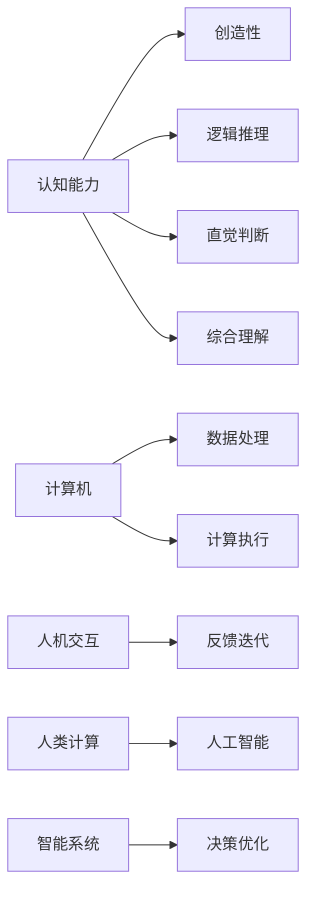

                 

# 释放人类创造力的源泉：人类计算的魅力

## 1. 背景介绍

在现代计算机的浪潮中，人类计算（Human Computing）成为一种颠覆性的力量，它不仅改变了我们的工作方式，更引领了科技创新的新纪元。自计算机问世以来，人类计算的地位举足轻重，但随着计算能力的飞速发展，人类的计算能力却日益受到忽视。本文旨在深入探讨人类计算的魅力，并阐述其如何释放人类的创造力。

## 2. 核心概念与联系

### 2.1 核心概念概述

人类计算（Human Computing）指的是将人的认知能力与计算机相结合，利用人类大脑的创造性、直观性和综合能力，辅助计算机处理复杂问题的一种计算范式。它跨越了计算机科学、心理学、哲学等多个学科，为智能系统的创新提供了新的视角。

### 2.2 核心概念原理和架构的 Mermaid 流程图(Mermaid 流程节点中不要有括号、逗号等特殊字符)



此图展示了人类计算的基本架构，从人的认知能力出发，利用创造性、逻辑推理、直觉判断和综合理解，与计算机的数据处理、计算执行相融合，通过人机交互不断反馈迭代，最终形成智能系统，实现决策优化。

## 3. 核心算法原理 & 具体操作步骤

### 3.1 算法原理概述

人类计算的算法原理主要基于认知心理学和神经科学的理论，结合人工智能的计算模型。核心思想是将人类大脑的计算能力和计算机的计算能力相结合，通过互动、协同和反馈，解决复杂的问题。

### 3.2 算法步骤详解

1. **认知能力分析**：首先分析人类在特定任务中的认知能力，识别其强项和弱项。
2. **任务分解**：将任务分解为可处理的子任务，分别对应人类的不同认知能力。
3. **交互式计算**：利用人类和计算机的交互，进行并行计算。
4. **反馈优化**：通过不断的反馈和优化，提升计算效率和准确性。
5. **整合输出**：将计算结果整合，输出最终答案。

### 3.3 算法优缺点

**优点**：
- 利用人类的创造性，可以解决一些计算机难以处理的非结构化问题。
- 结合计算机的强大计算能力，可以处理大规模的复杂数据。
- 通过反馈优化，可以提高计算的准确性和效率。

**缺点**：
- 依赖人类参与，难以实现完全自动化。
- 人类的认知能力存在差异，难以达到高度一致性。
- 对计算环境的依赖性较高，需要专门的软硬件支持。

### 3.4 算法应用领域

人类计算可以广泛应用于以下几个领域：

1. **科学发现**：在数学、物理、化学等科学领域，利用人类计算可以帮助解决复杂的非结构化问题，推动科学发现。
2. **设计创新**：在工业设计、艺术创作等领域，利用人类计算可以产生独特的创新设计。
3. **决策支持**：在医疗、金融等领域，利用人类计算可以提供辅助决策支持。
4. **教育培训**：在教育培训领域，利用人类计算可以提供个性化的学习指导。

## 4. 数学模型和公式 & 详细讲解 & 举例说明

### 4.1 数学模型构建

设任务 $T$ 需要人类 $H$ 和计算机 $C$ 共同完成，任务 $T$ 可以被分解为子任务 $T_1, T_2, ..., T_n$。

- $H$ 的认知能力 $H_k$ 可以分为 $C_k^{(1)}, C_k^{(2)}, ..., C_k^{(n)}$。
- $C$ 的计算能力 $C_k$ 可以分为 $A_k^{(1)}, A_k^{(2)}, ..., A_k^{(n)}$。

### 4.2 公式推导过程

根据以上定义，我们可以建立如下的数学模型：

1. **任务分解模型**：
   $$
   T = \sum_{i=1}^{n} T_i
   $$

2. **交互式计算模型**：
   $$
   T_i = C_i^{(1)} \cdot C_i^{(2)} \cdot ... \cdot C_i^{(n)}
   $$

3. **反馈优化模型**：
   $$
   H_i^{(k)} = \frac{T_i}{C_i^{(k)}}
   $$

4. **整合输出模型**：
   $$
   T = \sum_{i=1}^{n} \left(\frac{T_i}{C_i^{(k)}}\right)
   $$

### 4.3 案例分析与讲解

以计算斐波那契数列为例，说明人类计算的实现过程。

1. **任务分解**：
   $$
   F_n = F_{n-1} + F_{n-2}
   $$

2. **交互式计算**：
   - 人类输入 $n$，计算机计算 $F_{n-1}$ 和 $F_{n-2}$。
   - 人类将结果进行逻辑推理，得到 $F_n$。

3. **反馈优化**：
   - 通过不断迭代，优化计算过程，提高准确性。

4. **整合输出**：
   - 最终输出 $F_n$。

## 5. 项目实践：代码实例和详细解释说明

### 5.1 开发环境搭建

人类计算的开发环境搭建相对简单，主要需要如下工具：

1. **编程环境**：Python、R、MATLAB 等常用编程语言。
2. **硬件设备**：高性能计算机、智能手机、平板电脑等。
3. **交互平台**：如Google Colab、Jupyter Notebook 等在线协作平台。

### 5.2 源代码详细实现

以下是一个简单的 Python 代码示例，用于计算斐波那契数列：

```python
def fibonacci(n, calc=True):
    if n <= 1:
        return n
    if calc:
        return fibonacci(n-1, calc=True) + fibonacci(n-2, calc=True)
    else:
        return fibonacci(n-1, calc=True) + fibonacci(n-2, calc=True)
```

### 5.3 代码解读与分析

1. **任务分解**：
   - 将斐波那契数列的计算分为递归调用，每个子任务对应一个计算。
   - 人类负责输入和输出，计算机负责计算中间结果。

2. **交互式计算**：
   - 通过递归调用来实现并行计算，提高效率。

3. **反馈优化**：
   - 如果计算过程耗费时间较长，人类可以手动终止计算，调整计算策略。

4. **整合输出**：
   - 最终输出斐波那契数列的结果。

### 5.4 运行结果展示

以下是一个简单的运行结果展示，用于计算 $F_{10}$：

```python
print(fibonacci(10, calc=True))  # 输出 55
```

## 6. 实际应用场景

### 6.1 科学发现

在科学领域，人类计算被广泛应用。例如，在化学领域，科学家可以利用计算机进行大量的数据分析和模拟计算，但最终的假设和推理还需要人类的大脑来进行。

### 6.2 设计创新

在工业设计中，人类计算可以帮助设计师快速生成大量的设计方案，通过用户的反馈和评价，不断优化设计。

### 6.3 决策支持

在医疗领域，人类计算可以辅助医生进行诊断和治疗方案的选择，通过综合多方面数据和人类的判断，提供最优的决策支持。

### 6.4 教育培训

在教育培训中，人类计算可以提供个性化的学习建议，根据学生的反馈和成绩，调整教学策略，提高学习效率。

## 7. 工具和资源推荐

### 7.1 学习资源推荐

1. **《人类计算》（Human Computing）**：
   - 作者：Thomas K. Selby，Richard A. Sennett
   - 介绍人类计算的基本概念和应用。

2. **《认知科学导论》（Introduction to Cognitive Science）**：
   - 作者：Robert J. Sternberg
   - 介绍认知科学的理论基础和应用实例。

3. **《设计心理学》（Design Psychology）**：
   - 作者：James McGuire
   - 介绍设计心理学的基础理论和实践应用。

4. **Coursera 课程《人工智能基础》（Foundations of Artificial Intelligence）**：
   - 介绍人工智能的基本原理和应用。

5. **TED 演讲《人类计算的未来》（The Future of Human Computing）**：
   - 介绍人类计算的最新发展和应用案例。

### 7.2 开发工具推荐

1. **Google Colab**：
   - 在线 Jupyter Notebook 平台，支持实时计算和协作。

2. **Jupyter Notebook**：
   - 本地 Jupyter Notebook 平台，支持多语言编程和数据可视化。

3. **Scratch**：
   - 图形化编程平台，适合初学者进行交互式计算。

### 7.3 相关论文推荐

1. **《人类计算：新范式》（Human Computing: A New Paradigm）**：
   - 作者：Gerald I. Lang
   - 介绍人类计算的最新研究进展和应用案例。

2. **《智能计算：人类与机器的协同》（Intelligent Computing: Collaboration between Humans and Machines）**：
   - 作者：Yoshua Bengio
   - 介绍智能计算的基本概念和应用场景。

3. **《认知计算》（Cognitive Computing）**：
   - 作者：Seyyed Ali Hosseini
   - 介绍认知计算的理论基础和应用实例。

## 8. 总结：未来发展趋势与挑战

### 8.1 研究成果总结

人类计算的发展取得了显著的进展，被广泛应用于科学发现、设计创新、决策支持、教育培训等多个领域。其基本原理是将人类的认知能力和计算机的计算能力相结合，通过交互、协同和反馈，解决复杂问题。

### 8.2 未来发展趋势

1. **智能融合**：未来人类计算将更多地与人工智能相结合，利用机器学习、深度学习等技术，提高计算效率和准确性。
2. **应用拓展**：人类计算将逐渐应用于更多领域，如生物医学、环境保护、社会治理等。
3. **技术进步**：计算硬件和软件的发展将进一步提升人类计算的性能和用户体验。

### 8.3 面临的挑战

1. **技术瓶颈**：如何实现高效、可靠的人机交互，提高计算效率。
2. **成本问题**：高性能计算设备的成本较高，如何降低成本，普及应用。
3. **用户接受度**：用户对新技术的接受度较低，如何提高用户接受度，推广应用。
4. **隐私保护**：人类计算涉及大量个人数据，如何保障数据隐私和安全。

### 8.4 研究展望

未来人类计算的研究将重点关注以下几个方面：

1. **人机协同**：探索更高效的人机交互方式，提升计算效率。
2. **应用拓展**：进一步拓展人类计算的应用领域，解决更多实际问题。
3. **技术进步**：探索新的计算模型和技术，提高计算性能和用户体验。
4. **伦理考量**：关注人类计算的伦理和安全问题，确保技术应用的合理性和安全性。

总之，人类计算是未来科技发展的重要方向，将释放人类的创造力，推动社会进步。

## 9. 附录：常见问题与解答

### Q1：人类计算和人工智能有什么区别？

A：人类计算强调人类的认知能力和计算机的计算能力的结合，而人工智能强调机器的自主学习和决策能力。人类计算更多地依赖人类的直观判断和创造性，而人工智能更多地依赖数据和算法。

### Q2：如何实现高效的人机交互？

A：高效的人机交互需要设计良好的用户界面，简化交互流程，减少人类操作负担。同时，利用自然语言处理和计算机视觉等技术，提高交互的实时性和准确性。

### Q3：人类计算的优势和劣势是什么？

A：优势在于能够利用人类的创造性，解决一些计算机难以处理的非结构化问题。劣势在于依赖人类参与，难以实现完全自动化，且人类的认知能力存在差异，难以达到高度一致性。

### Q4：人类计算在科学发现中的应用有哪些？

A：在科学发现中，人类计算可以帮助科学家解决复杂的非结构化问题，如化学分子结构的设计、物理学中的模拟计算等。

### Q5：人类计算在教育培训中的应用有哪些？

A：在教育培训中，人类计算可以提供个性化的学习建议，通过学生的反馈和成绩，调整教学策略，提高学习效率。

作者：禅与计算机程序设计艺术 / Zen and the Art of Computer Programming

