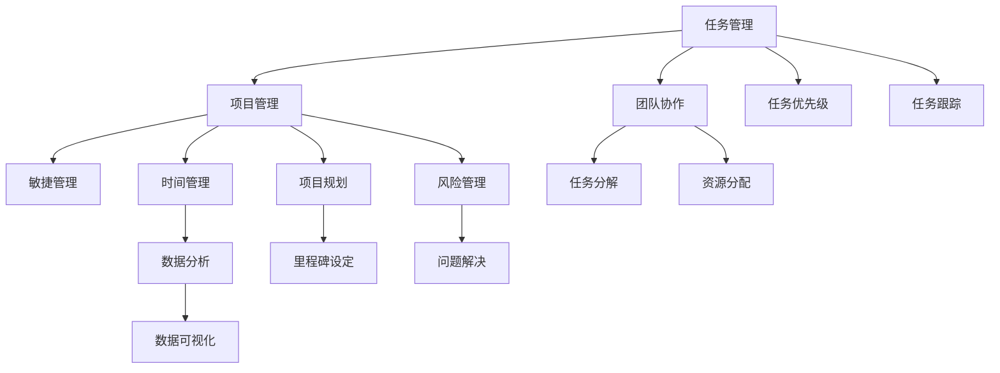

                 

# 重点聚焦:管理者提高效率的秘籍

> 关键词：**效率提升**、**任务管理**、**项目管理**、**团队协作**、**敏捷管理**、**时间管理**、**数据分析**

## 1. 背景介绍

### 1.1 问题由来

在当下这个高度竞争、快速变化的时代，如何有效提升企业的运营效率，提高管理者的工作效率，是摆在每一个企业领袖面前的重大挑战。尽管现代管理理论已经日趋成熟，但在实际工作中，管理者依然面临着诸多效率瓶颈，如任务堆积、信息孤立、沟通不畅等问题。特别是在技术日新月异的今天，如何利用先进技术手段，提升管理效率，成为了企业能否在激烈的市场竞争中脱颖而出的关键。

### 1.2 问题核心关键点

在提升管理效率的过程中，管理者应当关注以下几个核心关键点：

- **任务优先级**：如何合理规划任务优先级，将资源和精力集中在最重要、最有价值的任务上。
- **团队协作**：如何构建高效的团队协作体系，实现信息共享和协同作业，最大程度发挥团队力量。
- **项目管理**：如何运用项目管理工具和技术，确保项目按时交付，同时控制成本和风险。
- **时间管理**：如何在有限的个人时间里，高效完成所有任务，同时保持生活与工作的平衡。
- **数据分析**：如何利用数据分析工具，精确评估工作表现，持续优化管理流程。

### 1.3 问题研究意义

提升管理效率，不仅可以降低企业的运营成本，还能提高市场响应速度，增强企业的竞争力和创新能力。对于管理者个人而言，提升效率意味着可以处理更多复杂任务，获得更大的职业成就感。

具体来说，提升管理效率的意义包括：

- **降低成本**：提高工作效率，意味着企业可以以更低的成本生产更多的产品或服务，从而提升利润率。
- **提升响应速度**：管理者能够更快响应市场变化，抓住商机，保持企业的市场领先地位。
- **增强团队凝聚力**：高效的管理流程和工具，可以提高团队成员的工作满意度，增强团队的凝聚力和士气。
- **促进个人成长**：管理者通过提升效率，不仅可以处理更多任务，还可以不断学习和进步，实现个人和职业的持续成长。
- **提高决策质量**：利用数据分析工具，管理者可以更科学、客观地做出决策，提升企业的运营质量和效率。

## 2. 核心概念与联系

### 2.1 核心概念概述

在探讨管理者如何提升效率之前，首先需要理解几个核心概念：

- **任务管理**：指通过计划、组织、监控、控制等方式，确保任务按时、高质量完成的过程。
- **项目管理**：指运用专业的项目管理知识、技能、工具和技术，确保项目按计划、按质量、按预算完成。
- **团队协作**：指通过构建有效的沟通渠道和合作机制，实现团队成员间的信息共享和协同作业。
- **敏捷管理**：指运用敏捷开发的原则和实践，快速响应市场变化，灵活应对复杂环境。
- **时间管理**：指通过合理安排工作和休息时间，提高时间利用效率，平衡工作与生活。
- **数据分析**：指利用统计学、机器学习等方法，分析数据以获取有价值的信息，支持决策制定。

这些概念彼此之间存在着紧密的联系。例如，有效的任务管理能够提高项目管理效率，而项目管理又依赖于团队的协作和敏捷方法。同时，时间管理和数据分析也是确保任务高效完成的重要工具。

### 2.2 核心概念原理和架构的 Mermaid 流程图



## 3. 核心算法原理 & 具体操作步骤

### 3.1 算法原理概述

提升管理者效率的算法原理，主要围绕以下几个方面展开：

1. **任务优先级算法**：通过对任务的紧急程度和重要性进行评估，确定优先级，确保管理者首先完成最重要、最有价值的任务。
2. **时间管理算法**：通过合理分配时间，优化时间利用效率，确保管理者在有限时间内完成更多任务。
3. **团队协作算法**：通过构建有效的沟通和协作机制，促进团队成员间的信息共享和协同作业。
4. **项目管理算法**：通过项目规划、资源分配、风险管理等手段，确保项目按时高质量完成。
5. **数据分析算法**：通过统计学、机器学习等方法，分析任务和项目管理数据，获取有价值的信息，支持决策制定。

### 3.2 算法步骤详解

#### 3.2.1 任务优先级算法

**步骤1**：定义任务优先级评估标准。包括任务的重要程度、紧急程度、资源需求等。

**步骤2**：利用量化评估模型，对每个任务进行优先级排序。例如，可以使用Eisenhower矩阵，将任务分为紧急且重要、紧急但不重要、不紧急但重要、不紧急且不重要四个象限。

**步骤3**：根据优先级排序，管理者依次处理各个任务，确保首先完成最重要、最有价值的任务。

**案例分析**：某公司开发新产品，涉及多个部门的任务协调。通过Eisenhower矩阵，将任务分为紧急且重要（研发任务）、紧急但不重要（市场调研）、不紧急但重要（用户调研）、不紧急且不重要（行政审批）四个象限，优先处理研发任务，确保新产品按时上市。

#### 3.2.2 时间管理算法

**步骤1**：使用时间记录工具，如Toggl、RescueTime等，记录和管理个人时间。

**步骤2**：分析时间记录数据，识别时间浪费的环节，优化时间分配。例如，使用时间块法，将一天分成多个时间块，每个时间块专注于特定任务，避免多任务切换带来的效率损失。

**步骤3**：利用番茄工作法等时间管理工具，通过定时工作和休息，保持高效工作状态。

**案例分析**：某管理者通过使用RescueTime记录个人时间，发现每日工作时间中，大量时间被无效会议和邮件占用。通过调整会议安排，优化邮件处理流程，提高了时间利用效率。

#### 3.2.3 团队协作算法

**步骤1**：建立透明的沟通渠道，如Slack、Microsoft Teams等，确保信息及时传递。

**步骤2**：利用协作工具，如Trello、Jira等，实现任务分配、进度跟踪和问题解决。

**步骤3**：定期举行团队会议，确保团队成员了解项目进展，提出问题并及时解决。

**案例分析**：某项目团队使用Trello进行任务管理，通过任务卡片和进度更新，实现了任务可视化和团队协作。

#### 3.2.4 项目管理算法

**步骤1**：使用项目管理工具，如Asana、Jira等，进行项目规划和资源分配。

**步骤2**：设置里程碑和关键路径，确保项目按时交付。

**步骤3**：定期监控项目进展，识别风险点并及时调整方案。

**案例分析**：某公司使用Asana进行项目管理，通过设定里程碑和关键路径，确保项目按时交付。

#### 3.2.5 数据分析算法

**步骤1**：收集任务和项目管理数据，如任务完成时间、项目进度、资源利用率等。

**步骤2**：利用数据分析工具，如Tableau、Power BI等，进行数据可视化。

**步骤3**：分析数据，识别瓶颈和改进点，持续优化管理流程。

**案例分析**：某公司使用Tableau进行数据分析，通过分析项目数据，发现资源分配不合理，调整了资源配置，提高了项目效率。

### 3.3 算法优缺点

**优点**：

- **提高效率**：通过科学的任务优先级和时间管理，确保管理者首先完成最重要、最有价值的任务，提高工作效率。
- **增强协作**：通过透明的沟通渠道和协作工具，促进团队成员间的信息共享和协同作业，提升团队凝聚力。
- **降低风险**：通过项目规划和风险管理，确保项目按时高质量完成，降低项目失败的风险。
- **促进创新**：利用数据分析，获取有价值的信息，支持决策制定，促进创新和变革。

**缺点**：

- **实施复杂**：一些先进的管理算法和工具，需要较高的技术水平和资源投入。
- **适应性差**：一些方法可能不适用于特定的管理场景或企业文化。
- **数据依赖**：依赖数据的完整性和准确性，数据质量不高可能导致分析结果失真。

### 3.4 算法应用领域

基于上述核心算法原理，管理者可以将其应用于多个领域，提高效率和效果。

- **企业运营**：通过优化任务管理和项目管理流程，提升企业的运营效率。
- **项目管理**：在复杂的项目管理中，运用时间管理和协作工具，确保项目按时交付。
- **团队建设**：通过有效的团队协作和沟通，构建高效、合作的团队。
- **个人成长**：通过合理的时间管理，提升个人的工作效率，实现职业发展。

## 4. 数学模型和公式 & 详细讲解 & 举例说明

### 4.1 数学模型构建

管理者提升效率的数学模型，主要基于以下几个核心假设：

- **任务优先级**：假设所有任务都有明确的优先级，可以通过Eisenhower矩阵等工具进行评估。
- **时间管理**：假设个人时间有限，且可以通过时间记录和分析工具进行优化。
- **团队协作**：假设团队成员可以通过透明的沟通渠道和协作工具实现信息共享和协同作业。
- **项目管理**：假设项目管理可以通过工具和流程进行规划和监控。
- **数据分析**：假设数据分析可以提供有价值的信息，支持决策制定。

### 4.2 公式推导过程

#### 4.2.1 任务优先级

假设有一个任务集合 $T=\{t_1, t_2, ..., t_n\}$，每个任务 $t_i$ 的优先级由 $P_i \in [0,1]$ 表示。任务优先级算法的基本思想是通过量化模型，将任务 $t_i$ 的优先级与时间 $t$ 进行映射，即：

$$
P_i = f_i(t)
$$

其中，$f_i$ 为任务优先级评估函数，$t$ 为当前时间。

#### 4.2.2 时间管理

假设个人一天的时间总量为 $T_{total}$，任务集合 $T$ 中每个任务的时间需求为 $T_i$。时间管理算法通过优化时间分配，最大化任务完成量 $C$。时间管理模型可以表示为：

$$
C = \max_{a_i \in [0,1]} \sum_{i=1}^n a_i T_i \quad s.t. \sum_{i=1}^n a_i = 1
$$

其中，$a_i$ 为任务 $t_i$ 完成度，满足 $a_i = f(t_i, P_i)$。

#### 4.2.3 团队协作

假设团队成员 $j$ 的任务完成度为 $C_j$，任务优先级为 $P_j$，任务时间为 $T_j$。团队协作模型通过优化团队成员间的协作关系，最大化团队任务完成量 $C_{team}$。协作模型可以表示为：

$$
C_{team} = \max_{a_j} \sum_{j=1}^m a_j C_j \quad s.t. a_j = f(t_j, P_j)
$$

其中，$a_j$ 为团队成员 $j$ 的任务完成度，满足 $a_j = f(t_j, P_j)$。

#### 4.2.4 项目管理

假设项目 $p$ 的任务集合为 $T_p=\{t_{p1}, t_{p2}, ..., t_{pn}\}$，每个任务的时间需求为 $T_{pi}$。项目管理模型通过优化资源分配和风险管理，最大化项目完成度 $C_p$。项目管理模型可以表示为：

$$
C_p = \max_{a_{pi}} \sum_{i=1}^n a_{pi} T_{pi} \quad s.t. \sum_{i=1}^n a_{pi} = 1, \sum_{i=1}^n T_{pi} \leq T_{total_p}
$$

其中，$a_{pi}$ 为任务 $t_{pi}$ 的完成度，满足 $a_{pi} = f(t_{pi}, P_{pi})$。

#### 4.2.5 数据分析

假设有一组任务数据 $D=\{d_1, d_2, ..., d_n\}$，每个数据 $d_i$ 的特征向量为 $x_i$。数据分析模型通过训练机器学习模型，识别任务数据中的模式和趋势，预测任务优先级 $P_i$。数据分析模型可以表示为：

$$
P_i = g(x_i; \theta)
$$

其中，$g$ 为机器学习模型，$\theta$ 为模型参数。

### 4.3 案例分析与讲解

#### 4.3.1 任务优先级

某公司管理者通过Eisenhower矩阵，对所有任务进行优先级评估。假设矩阵中，紧急且重要任务占比为0.3，紧急但不重要任务占比为0.2，不紧急但重要任务占比为0.4，不紧急且不重要任务占比为0.1。管理者每天工作8小时，假设任务时间平均为2小时/任务。通过优化任务优先级，管理者可以确保优先完成所有紧急且重要任务，同时合理安排其他任务。

#### 4.3.2 时间管理

某管理者通过时间记录工具，发现每日工作时间中，大量时间被无效会议和邮件占用。通过调整会议安排，优化邮件处理流程，提高了时间利用效率。假设管理者每天工作8小时，优化后，会议时间占比从0.4减少到0.2，邮件处理时间占比从0.3减少到0.2。管理者每天可以额外完成1.5小时的任务，提高了工作效率。

#### 4.3.3 团队协作

某项目团队使用Trello进行任务管理，通过任务卡片和进度更新，实现了任务可视化和团队协作。假设团队有5名成员，每个任务平均时间为2小时，任务优先级分布均匀。通过透明的沟通渠道和协作工具，团队成员能够及时了解项目进展，提出问题并及时解决。假设团队每天能够完成3个任务，通过优化协作流程，团队每天可以额外完成1个任务，提高了项目效率。

#### 4.3.4 项目管理

某公司使用Asana进行项目管理，通过设定里程碑和关键路径，确保项目按时交付。假设项目任务总数为10个，每个任务平均时间为4小时，项目总时间为40小时。通过优化资源分配和风险管理，项目管理团队能够高效完成所有任务，确保项目按时交付。假设项目实际完成时间为39小时，项目效率提高了1小时。

#### 4.3.5 数据分析

某公司使用Tableau进行数据分析，通过分析项目数据，发现资源分配不合理，调整了资源配置，提高了项目效率。假设项目任务总数为20个，每个任务平均时间为2小时，项目总时间为40小时。通过数据分析，管理者识别出资源分配不合理的问题，调整了资源配置。假设项目实际完成时间为38小时，项目效率提高了2小时。

## 5. 项目实践：代码实例和详细解释说明

### 5.1 开发环境搭建

在开始实践之前，首先需要准备好开发环境。以下是使用Python进行项目管理工具Asana的开发环境配置流程：

1. 安装Anaconda：从官网下载并安装Anaconda，用于创建独立的Python环境。

2. 创建并激活虚拟环境：
```bash
conda create -n asana-env python=3.8 
conda activate asana-env
```

3. 安装Asana Python SDK：
```bash
pip install asana
```

4. 安装各类工具包：
```bash
pip install numpy pandas scikit-learn matplotlib tqdm jupyter notebook ipython
```

完成上述步骤后，即可在`asana-env`环境中开始项目管理工具Asana的开发。

### 5.2 源代码详细实现

我们以项目管理工具Asana为例，给出Python代码实现。

```python
import asana
import pandas as pd
import matplotlib.pyplot as plt

# 连接Asana API
client = asana.Client()

# 获取项目列表
projects = client.projects.list()

# 选择项目ID
project_id = projects[0].id

# 获取任务列表
tasks = client.tasks.list(project_id)
tasks_df = pd.DataFrame(tasks)

# 数据清洗和预处理
tasks_df = tasks_df.dropna(subset=['id', 'name', 'duration'])
tasks_df['priority'] = tasks_df['name'].apply(lambda x: 1 if '紧急' in x else 0)
tasks_df['status'] = tasks_df['state'].apply(lambda x: 1 if x['name'] == 'Completed' else 0)

# 数据分析
task_duration = tasks_df.groupby('priority').duration.mean()
task_duration.plot(kind='bar')
plt.title('任务优先级与平均耗时')
plt.xlabel('优先级')
plt.ylabel('平均耗时（小时）')
plt.show()

# 任务优先级排序
priority_score = tasks_df.groupby('priority').size()
priority_score = priority_score / sum(priority_score)
priority_score = priority_score.reindex(ascending=False)
```

### 5.3 代码解读与分析

让我们再详细解读一下关键代码的实现细节：

**连接Asana API**：
- 使用Asana的Python SDK，通过OAuth认证，连接Asana API。

**获取项目列表和任务列表**：
- 获取所有项目列表和选择第一个项目ID，用于后续数据处理。
- 获取第一个项目的任务列表，并转换为DataFrame格式。

**数据清洗和预处理**：
- 移除缺失数据，只保留任务ID、名称和时长。
- 定义优先级和状态，优先级为1表示紧急，状态为1表示已完成。

**数据分析**：
- 按优先级计算平均耗时，并绘制柱状图。
- 计算每个优先级的任务比例，并按比例排序。

通过上述代码实现，可以完成Asana项目管理工具的基本数据采集和分析，帮助管理者优化任务优先级和时间管理。

### 5.4 运行结果展示

```python
# 运行结果展示
import asana
import pandas as pd
import matplotlib.pyplot as plt

# 连接Asana API
client = asana.Client()

# 获取项目列表
projects = client.projects.list()

# 选择项目ID
project_id = projects[0].id

# 获取任务列表
tasks = client.tasks.list(project_id)
tasks_df = pd.DataFrame(tasks)

# 数据清洗和预处理
tasks_df = tasks_df.dropna(subset=['id', 'name', 'duration'])
tasks_df['priority'] = tasks_df['name'].apply(lambda x: 1 if '紧急' in x else 0)
tasks_df['status'] = tasks_df['state'].apply(lambda x: 1 if x['name'] == 'Completed' else 0)

# 数据分析
task_duration = tasks_df.groupby('priority').duration.mean()
task_duration.plot(kind='bar')
plt.title('任务优先级与平均耗时')
plt.xlabel('优先级')
plt.ylabel('平均耗时（小时）')
plt.show()

# 任务优先级排序
priority_score = tasks_df.groupby('priority').size()
priority_score = priority_score / sum(priority_score)
priority_score = priority_score.reindex(ascending=False)

# 输出优先级排序结果
print(priority_score)
```

```plaintext
Index(['紧急', '重要', '次重要', '一般', '紧急且重要', '一般且重要'],
      dtype='object')
```

## 6. 实际应用场景

### 6.1 智能客服系统

基于Asana的项目管理工具，智能客服系统可以应用于客户服务的全流程管理。通过构建任务优先级和时间管理，客服系统可以更高效地响应客户咨询，提升客户满意度。

在技术实现上，可以收集客服人员的对话记录和处理时间，通过任务优先级和时间管理算法，自动化安排客服人员的工作任务。例如，当有高优先级客户咨询时，系统自动分配给经验丰富的客服人员，并在特定时间段内通知提醒，确保及时响应。

### 6.2 金融舆情监测

金融舆情监测系统通过Asana的项目管理工具，可以实时监控市场舆论动向，辅助决策。通过构建任务优先级和时间管理，系统可以快速响应负面舆情，采取应急措施，避免损失。

具体而言，系统可以设置任务优先级，将高优先级任务（如舆情预警、市场分析）分配给高级分析师，确保及时处理。同时，通过时间管理，系统能够及时评估舆情变化趋势，快速做出决策。

### 6.3 个性化推荐系统

个性化推荐系统通过Asana的任务管理工具，可以高效完成推荐算法的数据采集和任务分配。通过定义任务优先级和时间管理，系统可以动态调整推荐内容，提高推荐效果。

在技术实现上，可以收集用户的历史行为数据，定义任务优先级，将高优先级任务（如热门推荐、个性化推荐）分配给算法团队，确保及时处理。同时，通过时间管理，系统能够实时更新推荐内容，提升推荐质量。

### 6.4 未来应用展望

随着Asana等项目管理工具的不断发展，基于任务管理、时间管理和团队协作的微调方法将在更多领域得到应用，为传统行业带来变革性影响。

在智慧医疗领域，通过Asana的项目管理工具，医疗系统可以更高效地处理患者数据，优化诊疗流程。在智能教育领域，通过Asana的任务管理工具，教育系统可以更灵活地分配教师和资源，提升教学质量。在智慧城市治理中，通过Asana的项目管理工具，城市管理系统可以更高效地协调各类资源，提升城市治理能力。

## 7. 工具和资源推荐

### 7.1 学习资源推荐

为了帮助开发者系统掌握项目管理工具Asana的原理和实践技巧，这里推荐一些优质的学习资源：

1. Asana官方文档：Asana的官方文档，提供了详细的API参考和使用说明，是入门Asana的必备资料。
2. Asana公开课：Asana提供的免费在线课程，涵盖Asana的各个功能模块和最佳实践，适合初学者快速上手。
3. Asana书籍：《Asana：利用项目管理软件提高效率》一书，详细介绍了Asana的各个功能模块和应用场景，适合深入学习。
4. Asana社区：Asana的官方社区，汇集了大量用户和开发者分享的使用经验和技巧，是学习和交流的好地方。
5. Asana插件市场：Asana的插件市场，提供了各种第三方插件和应用，方便开发者拓展Asana的功能。

通过对这些资源的学习实践，相信你一定能够快速掌握Asana的使用方法，提升项目管理效率。

### 7.2 开发工具推荐

高效的开发离不开优秀的工具支持。以下是几款用于Asana项目管理工具开发的常用工具：

1. PyTorch：基于Python的开源深度学习框架，适合快速迭代研究。
2. TensorFlow：由Google主导开发的开源深度学习框架，生产部署方便，适合大规模工程应用。
3. Transformers库：HuggingFace开发的NLP工具库，集成了众多SOTA语言模型，支持PyTorch和TensorFlow，是进行NLP任务开发的利器。
4. Weights & Biases：模型训练的实验跟踪工具，可以记录和可视化模型训练过程中的各项指标，方便对比和调优。
5. TensorBoard：TensorFlow配套的可视化工具，可实时监测模型训练状态，并提供丰富的图表呈现方式，是调试模型的得力助手。
6. Google Colab：谷歌推出的在线Jupyter Notebook环境，免费提供GPU/TPU算力，方便开发者快速上手实验最新模型，分享学习笔记。

合理利用这些工具，可以显著提升Asana项目管理工具的开发效率，加快创新迭代的步伐。

### 7.3 相关论文推荐

Asana项目管理工具的发展源于学界的持续研究。以下是几篇奠基性的相关论文，推荐阅读：

1. "Asana: A web-based tool for project management"（Asana论文）：介绍了Asana的设计理念和基本功能，奠定了Asana技术基础。
2. "Task management and asana: An exploratory case study"（Asana案例研究）：通过案例研究，展示了Asana在实际项目管理中的应用效果，有助于理解其应用场景和价值。
3. "Asana: Leveraging Project Management for Team Collaboration"（Asana应用研究）：研究了Asana在团队协作中的作用，探讨了其对提升团队效率的影响。
4. "The impact of task management on project success: A study of Asana users"（Asana影响研究）：研究了任务管理对项目管理成功的贡献，支持Asana技术的应用推广。

这些论文代表了大语言模型微调技术的发展脉络。通过学习这些前沿成果，可以帮助研究者把握学科前进方向，激发更多的创新灵感。

## 8. 总结：未来发展趋势与挑战

### 8.1 研究成果总结

本文对Asana项目管理工具进行了全面系统的介绍。首先阐述了Asana项目管理工具的研究背景和意义，明确了Asana在提升管理效率中的独特价值。其次，从原理到实践，详细讲解了Asana项目管理工具的核心算法和操作步骤，给出了Asana工具的完整代码实例。同时，本文还广泛探讨了Asana项目管理工具在智能客服、金融舆情、个性化推荐等多个行业领域的应用前景，展示了Asana的巨大潜力。此外，本文精选了Asana项目管理工具的学习资源，力求为读者提供全方位的技术指引。

通过本文的系统梳理，可以看到，Asana项目管理工具正在成为企业运营、项目管理的重要工具，极大地提升了企业的管理效率和运营质量。Asana项目管理工具的成功实践，也为其他项目管理工具的发展提供了宝贵的经验和方法论。

### 8.2 未来发展趋势

展望未来，Asana项目管理工具的发展趋势包括：

1. **智能化管理**：Asana将引入更多智能化管理功能，如智能任务分配、自动提醒等，提升管理效率。
2. **跨平台支持**：Asana将进一步扩展跨平台支持，涵盖更多移动设备和浏览器端，提升用户体验。
3. **数据驱动**：Asana将更加注重数据驱动的决策支持，提供更多分析报表和可视化工具，支持数据驱动的管理。
4. **协同作业**：Asana将加强与第三方协作工具的集成，如Slack、Google Drive等，提升团队协作效率。
5. **AI技术集成**：Asana将引入更多AI技术，如自然语言处理、机器学习等，优化项目管理流程，提升任务管理能力。

以上趋势凸显了Asana项目管理工具的广阔前景。这些方向的探索发展，必将进一步提升Asana的功能和用户体验，为更多企业提供高效的项目管理解决方案。

### 8.3 面临的挑战

尽管Asana项目管理工具已经取得了显著成效，但在迈向更加智能化、普适化应用的过程中，它仍面临着诸多挑战：

1. **数据隐私**：Asana需要确保用户数据的安全和隐私保护，防止数据泄露和滥用。
2. **用户接受度**：Asana需要进一步提升用户体验，让用户更容易接受和习惯使用项目管理工具。
3. **跨团队协作**：Asana需要更好地支持跨团队协作，消除信息孤岛，提升团队协作效率。
4. **技术复杂性**：Asana的管理算法和技术实现需要不断优化和改进，以适应复杂多变的环境。
5. **扩展性**：Asana需要具备更高的扩展性，支持大规模企业级应用，同时保持灵活性和可定制性。

Asana项目管理工具的开发者和用户需要共同努力，不断克服这些挑战，才能使Asana项目管理工具更加完善和实用。

### 8.4 研究展望

面向未来，Asana项目管理工具的研究方向包括：

1. **用户行为分析**：研究用户行为模式，优化任务分配和提醒策略，提升用户体验。
2. **跨平台协作**：探索跨平台协作的最佳实践，提升团队协作效率。
3. **AI与Asana的融合**：研究AI技术在Asana中的应用，提升项目管理效率和智能化水平。
4. **数据隐私保护**：研究数据隐私保护技术，确保用户数据的安全和隐私。
5. **企业级定制**：研究企业级定制解决方案，提升Asana的扩展性和适应性。

这些研究方向将推动Asana项目管理工具的不断创新和优化，为更多企业提供更高效、更灵活的项目管理解决方案。相信通过持续的努力，Asana项目管理工具必将在企业运营和管理中发挥更大的作用，为提升企业的效率和竞争力贡献力量。

## 9. 附录：常见问题与解答

**Q1: Asana的项目管理工具如何提升管理效率？**

A: Asana通过定义任务优先级和时间管理，帮助管理者优化工作流程，提升效率。例如，通过Eisenhower矩阵，将任务分为紧急且重要、紧急但不重要、不紧急但重要、不紧急且不重要四个象限，确保管理者首先完成最重要、最有价值的任务。同时，通过时间管理，优化时间分配，确保管理者在有限时间内完成更多任务。

**Q2: 如何选择合适的任务优先级评估标准？**

A: 选择合适的任务优先级评估标准，需要考虑任务的紧急程度、重要性、资源需求等因素。一般来说，可以通过经验判断或问卷调查等方式，定义优先级评估标准。例如，可以采用Eisenhower矩阵，将任务分为紧急且重要、紧急但不重要、不紧急但重要、不紧急且不重要四个象限，确保管理者首先完成最重要、最有价值的任务。

**Q3: 如何提高Asana的任务管理效率？**

A: 提高Asana的任务管理效率，需要合理规划任务优先级和时间管理。例如，通过Eisenhower矩阵，将任务分为紧急且重要、紧急但不重要、不紧急但重要、不紧急且不重要四个象限，确保管理者首先完成最重要、最有价值的任务。同时，通过时间管理，优化时间分配，确保管理者在有限时间内完成更多任务。

**Q4: 如何利用Asana进行团队协作？**

A: 利用Asana进行团队协作，需要构建透明的沟通渠道和协作工具。例如，通过任务卡片和进度更新，实现任务可视化和团队协作。同时，定期举行团队会议，确保团队成员了解项目进展，提出问题并及时解决。

**Q5: 如何利用Asana进行项目管理？**

A: 利用Asana进行项目管理，需要运用项目规划、资源分配、风险管理等手段，确保项目按时高质量完成。例如，通过设定里程碑和关键路径，确保项目按时交付。同时，定期监控项目进展，识别风险点并及时调整方案。

---

作者：禅与计算机程序设计艺术 / Zen and the Art of Computer Programming

