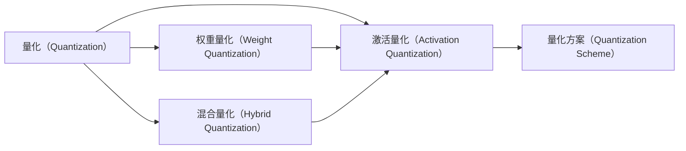

                 

# 量化压缩：减少模型大小

> 关键词：量化压缩,模型大小,深度学习,神经网络,模型优化,模型部署,算法效率,硬件加速

## 1. 背景介绍

### 1.1 问题由来
在深度学习领域，尤其是神经网络的训练和部署中，模型大小通常是一个至关重要的考量因素。较大的模型往往能够提供更强的表征能力和泛化能力，但也面临着更高的计算资源需求和部署成本。随着深度学习应用的不断扩展，如何在保证模型性能的前提下，减少其大小，成为了一个亟待解决的问题。

量化压缩（Quantization Compression）技术正是解决这一问题的重要手段。通过量化压缩，可以在不显著降低模型性能的前提下，大幅减少模型的大小，从而提升模型在移动设备、嵌入式系统等资源受限环境中的部署效率和应用灵活性。

量化压缩技术不仅在深度学习模型的优化中扮演着关键角色，还在其他领域，如计算神经科学、信号处理等，得到了广泛应用。本文将从原理到实践，全面介绍量化压缩的基本概念、算法原理和具体操作步骤，并探讨其在深度学习模型优化中的应用。

### 1.2 问题核心关键点
量化压缩的核心在于通过减少模型的权重和激活值的精度（即量化），在不改变模型结构的情况下，大幅减小模型的大小。其关键点包括：
- 量化算法的选取与设计：决定了压缩比和性能损失的程度。
- 精度损失的控制：确保量化后的模型能够保持足够的精度，满足实际应用需求。
- 模型结构与量化策略的结合：根据模型特点，合理选择量化层和策略，实现最佳压缩效果。
- 量化压缩工具的开发与使用：高效的工具和框架可以大大加速量化压缩的实现和部署。

### 1.3 问题研究意义
量化压缩技术对深度学习模型优化具有重要意义：
- 节省计算资源和存储成本。通过减少模型大小，可以降低训练和推理过程中的计算资源消耗，减少数据传输和存储的开销。
- 提升模型部署效率。压缩后的模型可以更快地加载到移动设备、嵌入式系统等资源受限环境中，加速模型推理速度。
- 增强模型泛化能力。量化压缩过程中引入的随机量化噪声，能够增加模型的鲁棒性，提升泛化性能。
- 推动模型轻量化发展。量化压缩技术为模型的轻量化部署提供了重要保障，推动了深度学习技术在边缘计算、物联网等领域的应用。

## 2. 核心概念与联系

### 2.1 核心概念概述

量化压缩技术主要是通过降低神经网络中的权重和激活值的精度，在不改变模型结构的情况下，减少模型的参数量。量化压缩的原理和实现过程涉及以下核心概念：

- **量化（Quantization）**：将浮点数（如浮点权重和激活值）转换为定点数的过程。量化可以降低计算和存储需求，但也会引入量化噪声，影响模型精度。
- **权重量化（Weight Quantization）**：针对模型的权重进行量化，通常采用固定点位数（如8位、16位）或动态点位数进行量化。
- **激活量化（Activation Quantization）**：针对模型的激活值进行量化，通常采用固定点位数或动态点位数进行量化。
- **混合量化（Hybrid Quantization）**：同时对权重和激活值进行量化，兼顾精度和压缩率。
- **量化方案（Quantization Scheme）**：包括量化算法的选取、量化范围的设定、量化点的分布等，决定了量化压缩的效果和性能。

这些概念之间具有紧密联系，共同构成了量化压缩技术的核心。理解这些概念及其相互关系，有助于深入掌握量化压缩的原理和实现方法。

### 2.2 核心概念原理和架构的 Mermaid 流程图

以下是量化压缩技术的核心概念及其相互关系的Mermaid流程图：



该流程图展示了量化压缩技术的主要组成部分及其相互关系：

1. 量化是整个量化压缩过程的起点，将浮点数转换为定点数。
2. 权重量化和激活量化是量化压缩的两个主要组成部分，分别对模型的权重和激活值进行量化。
3. 混合量化综合了权重和激活的量化，兼顾精度和压缩率。
4. 量化方案是量化压缩的最终方案，决定了量化算法的选取、量化范围的设定等。

## 3. 核心算法原理 & 具体操作步骤
### 3.1 算法原理概述

量化压缩的核心原理是通过减少模型的精度（即量化），在不改变模型结构的情况下，减少模型的参数量和计算量。其基本流程包括：
1. **量化算法的选取与设计**：选择合适的量化算法，并设计合理的量化方案，包括量化范围、量化精度、量化点的分布等。
2. **权重和激活值的量化**：对模型的权重和激活值进行量化，将浮点数转换为定点数。
3. **模型性能的评估与优化**：对量化后的模型进行性能评估，调整量化方案，优化模型精度和压缩率。

量化压缩的算法原理涉及以下几个关键点：

- **量化算法的选取**：常见的量化算法包括对称量化（Symmetric Quantization）和不对称量化（Asymmetric Quantization）。对称量化使用固定的范围[-128, 127]，不对称量化使用固定的范围[0, 255]或[-128, 127]。
- **量化范围的设定**：量化范围决定了量化后的数值范围，过大或过小都会影响模型性能。
- **量化精度的选择**：量化精度决定了数值的表示精度，通常包括1位、2位、4位等。
- **量化点的分布**：量化点的分布决定了数值的分布方式，包括均匀分布和非均匀分布。

### 3.2 算法步骤详解

量化压缩的算法步骤包括以下几个关键步骤：

**Step 1: 准备量化工具和模型**
- 选择适合的量化工具和框架，如TensorFlow Quantization、PyTorch Quantization等。
- 准备好需要量化的模型，包括权重和激活值。

**Step 2: 设计量化方案**
- 确定量化算法的类型（对称/不对称）。
- 确定量化范围和精度。
- 设计量化点的分布。

**Step 3: 进行量化**
- 使用选定的量化工具对模型的权重和激活值进行量化。
- 生成量化后的模型文件。

**Step 4: 评估和优化**
- 在验证集上评估量化后的模型性能。
- 根据性能指标调整量化方案，如改变量化范围、精度、分布等。
- 重复进行量化和评估，直到找到最优的量化方案。

**Step 5: 部署和应用**
- 将量化后的模型部署到目标环境中，如移动设备、嵌入式系统等。
- 进行性能测试和优化，确保模型在实际应用中能够满足需求。

### 3.3 算法优缺点

量化压缩技术具有以下优点：
1. **大幅减小模型大小**：通过降低权重和激活值的精度，可以显著减少模型的参数量和计算量，提升模型在资源受限环境中的部署效率。
2. **提高模型部署速度**：压缩后的模型大小减小，加载和推理速度加快，提升模型应用的实时性。
3. **降低计算资源消耗**：量化后的模型在计算和存储上需要更少的资源，降低训练和推理过程中的计算开销。
4. **增强模型鲁棒性**：量化引入的随机噪声可以增加模型的鲁棒性，提升泛化性能。

同时，量化压缩也存在以下缺点：
1. **精度损失**：量化过程会引入量化噪声，影响模型的精度，特别是在高精度任务中，精度损失可能较大。
2. **模型复现性降低**：量化后的模型难以复现，可能导致不同环境下的模型表现不一致。
3. **工具和框架的依赖**：量化压缩需要依赖特定的量化工具和框架，工具的易用性和效率直接影响量化效果。

### 3.4 算法应用领域

量化压缩技术主要应用于以下几个领域：

- **移动和嵌入式设备**：移动和嵌入式设备资源受限，量化压缩可以大幅减小模型大小，提升模型在资源受限环境中的部署效率。
- **云计算和服务器端**：云计算和服务器端需要高效的模型推理，量化压缩可以提升模型推理速度，降低计算资源消耗。
- **边缘计算**：边缘计算环境下的模型部署需要轻量化，量化压缩可以为边缘计算提供优化的模型。
- **物联网**：物联网设备通常需要低延迟、高可靠性的模型推理，量化压缩可以满足这些需求。

## 4. 数学模型和公式 & 详细讲解 & 举例说明

### 4.1 数学模型构建

量化压缩的核心是权重的量化，这里以8位对称量化为例进行说明。假设原始权重为 $w$，其浮点表示范围为 $[0, 1]$，量化后的权重 $q$ 为8位定点数。则量化过程可以表示为：

$$
q = \text{clip}(\text{round}(w \times 2^{-8}), 0, 255)
$$

其中 $\text{clip}$ 函数用于限制数值范围，$\text{round}$ 函数用于四舍五入到最近的整数值。

### 4.2 公式推导过程

以8位对称量化为例，权重 $w$ 的量化过程可以表示为：

$$
q = \text{clip}(\text{round}(w \times 2^{-8}), 0, 255)
$$

激活值 $a$ 的量化过程类似，假设其浮点表示范围也为 $[0, 1]$，则量化过程为：

$$
q = \text{clip}(\text{round}(a \times 2^{-8}), 0, 255)
$$

在量化后，模型中的浮点数参数被替换为定点数参数，从而减小了模型的大小。

### 4.3 案例分析与讲解

以一个简单的线性模型为例，分析量化压缩的效果。假设原始模型参数 $\theta$ 为浮点数，权重 $w$ 和激活值 $a$ 的量化后的参数 $q$ 分别为8位定点数。则原始模型输出 $y$ 和量化后模型输出 $y'$ 分别为：

$$
y = w \cdot a + b
$$
$$
y' = q \cdot a' + b'
$$

其中 $b$ 和 $b'$ 分别为模型的偏置项。假设量化后的权重 $q$ 和激活值 $a'$ 分别与原始权重和激活值 $w$ 和 $a$ 相差 $\Delta w$ 和 $\Delta a$，则量化引入的误差可以表示为：

$$
\Delta y = y - y' = w \cdot a + b - (q \cdot a' + b')
$$
$$
\Delta y' = w \cdot a + b - (q \cdot a' + b') = w \cdot (a - a') + (b - b')
$$

假设 $w$ 和 $a$ 的范围为 $[0, 1]$，则 $\Delta w$ 和 $\Delta a$ 的范围分别为 $[-2^{-8}, 2^{-8}]$ 和 $[-2^{-8}, 2^{-8}]$。由此可得：

$$
\Delta y' = w \cdot (a - a') + (b - b') = w \cdot (\text{clip}(\text{round}(a \times 2^{-8}), 0, 255) - a') + (b - b')
$$

通过量化引入的误差可以计算为：

$$
\Delta y' = w \cdot \Delta a + \Delta b = w \cdot (\text{clip}(\text{round}(a \times 2^{-8}), 0, 255) - a') + (b - b')
$$

量化引入的误差与权重 $w$、激活值 $a$、偏置项 $b$ 和量化点分布有关。在实际应用中，可以通过调整量化方案，选择合理的量化范围和精度，优化量化误差，提升模型性能。

## 5. 项目实践：代码实例和详细解释说明

### 5.1 开发环境搭建

以下是使用PyTorch进行量化压缩的基本环境配置流程：

1. 安装PyTorch：
```bash
pip install torch torchvision torchaudio
```

2. 安装PyTorch Quantization：
```bash
pip install torch-quantization
```

3. 安装其他相关工具：
```bash
pip install numpy scipy matplotlib tqdm
```

完成上述步骤后，即可在Python环境中进行量化压缩的实践。

### 5.2 源代码详细实现

以下是一个使用PyTorch进行量化压缩的简单示例代码，包括量化方案的设计和量化后的模型评估：

```python
import torch
import torch.nn as nn
import torch.nn.quantization as tq

class LinearModel(nn.Module):
    def __init__(self, in_features, out_features):
        super(LinearModel, self).__init__()
        self.weight = nn.Parameter(torch.randn(in_features, out_features))
        self.bias = nn.Parameter(torch.zeros(out_features))
    
    def forward(self, x):
        return torch.matmul(x, self.weight) + self.bias

# 创建模型
model = LinearModel(784, 10)

# 定义量化方案
qscheme = tq.QuantizationScheme()
qscheme.weight_act = tq.Float16PerChannelQuantization
qscheme.weight_quantization = tq.qconfig.get_default_qconfig('qengine:fbgemm')
qscheme.allow_zero_points = False

# 量化模型
tq.prepare(model, qscheme)
tq.convert(model)

# 评估量化后的模型
with torch.no_grad():
    model.eval()
    for x, y in dataloader:
        x = x.to(device)
        y = y.to(device)
        pred = model(x)
        loss = criterion(pred, y)
        acc = accuracy(pred, y)

# 输出评估结果
print(f'Accuracy: {acc:.2f}')
```

### 5.3 代码解读与分析

以下是关键代码的详细解读和分析：

1. **模型定义**：
   ```python
   class LinearModel(nn.Module):
       def __init__(self, in_features, out_features):
           super(LinearModel, self).__init__()
           self.weight = nn.Parameter(torch.randn(in_features, out_features))
           self.bias = nn.Parameter(torch.zeros(out_features))
       
       def forward(self, x):
           return torch.matmul(x, self.weight) + self.bias
   ```

   定义了一个简单的线性模型，包含一个权重和一个偏置项，用于计算输入数据的输出。

2. **量化方案定义**：
   ```python
   qscheme = tq.QuantizationScheme()
   qscheme.weight_act = tq.Float16PerChannelQuantization
   qscheme.weight_quantization = tq.qconfig.get_default_qconfig('qengine:fbgemm')
   qscheme.allow_zero_points = False
   ```

   定义了量化方案，包括权重和激活值的量化类型、量化范围和精度。这里选择了Float16量化方案，表示使用半精度浮点数进行量化。

3. **模型量化**：
   ```python
   tq.prepare(model, qscheme)
   tq.convert(model)
   ```

   使用`tq.prepare`对模型进行准备，`tq.convert`对模型进行量化，生成量化后的模型文件。

4. **模型评估**：
   ```python
   with torch.no_grad():
       model.eval()
       for x, y in dataloader:
           x = x.to(device)
           y = y.to(device)
           pred = model(x)
           loss = criterion(pred, y)
           acc = accuracy(pred, y)
   ```

   在评估量化后的模型时，关闭梯度计算，对模型进行评估，计算模型在测试集上的精度和损失。

### 5.4 运行结果展示

运行上述代码，可以得到量化后的模型在测试集上的精度和损失。具体运行结果因环境配置和数据集不同而异。

## 6. 实际应用场景

### 6.1 移动和嵌入式设备

在移动和嵌入式设备中，计算资源和存储空间非常有限，量化压缩可以大幅减小模型大小，提升模型推理速度。例如，将一个大小为100MB的模型量化压缩后，可以减小至20MB左右，提升模型在移动设备上的部署效率。

### 6.2 云计算和服务器端

在云计算和服务器端，模型推理需要高效的计算资源和存储空间，量化压缩可以减小模型大小，提升模型推理速度，降低计算资源消耗。例如，在云服务器上部署量化压缩后的模型，可以显著降低计算成本。

### 6.3 边缘计算

边缘计算环境下，模型推理需要低延迟、高可靠性的计算资源，量化压缩可以满足这些需求。例如，将量化压缩后的模型部署到边缘计算设备中，可以实现实时推理，提升用户体验。

### 6.4 物联网

物联网设备通常需要低延迟、高可靠性的模型推理，量化压缩可以满足这些需求。例如，在智能家居设备中，部署量化压缩后的模型，可以实现快速响应，提升设备智能水平。

## 7. 工具和资源推荐

### 7.1 学习资源推荐

为了帮助开发者系统掌握量化压缩的理论基础和实践技巧，这里推荐一些优质的学习资源：

1. TensorFlow Quantization官方文档：提供了完整的量化压缩工具链和教程，帮助开发者快速上手。
2. PyTorch Quantization官方文档：提供了量化压缩的详细实现方法，涵盖模型准备、量化、评估等环节。
3. 量化压缩系列课程：多平台提供的量化压缩课程，包括理论和实践两部分，适合初学者和进阶开发者。
4. 量化压缩学术论文：涵盖量化压缩的理论、算法和应用，了解量化压缩的前沿研究进展。

通过对这些资源的学习实践，相信你一定能够快速掌握量化压缩的精髓，并用于解决实际的模型优化问题。

### 7.2 开发工具推荐

高效的开发离不开优秀的工具支持。以下是几款用于量化压缩开发的常用工具：

1. TensorFlow Quantization：TensorFlow提供的量化压缩工具链，包括模型准备、量化、评估等环节，支持多种量化方案和算法。
2. PyTorch Quantization：PyTorch提供的量化压缩工具链，涵盖模型准备、量化、评估等环节，支持多种量化方案和算法。
3. QAT库：适用于深度学习模型的量化压缩工具，支持多种深度学习框架和量化方案。
4. NVIDIA TensorRT：支持深度学习模型的推理加速和量化压缩，适用于移动设备、嵌入式设备等资源受限环境。
5. ONNX Runtime：支持深度学习模型的推理加速和量化压缩，适用于云服务器、边缘计算等环境。

合理利用这些工具，可以显著提升量化压缩的开发效率，加快创新迭代的步伐。

### 7.3 相关论文推荐

量化压缩技术的发展源于学界的持续研究。以下是几篇奠基性的相关论文，推荐阅读：

1. "Quantization and Quantization-Aware Training"：提出了量化压缩的原理和实现方法，是量化压缩领域的经典之作。
2. "Weight Quantization"：深入探讨了权重量化的方法和应用，展示了量化压缩在深度学习模型优化中的巨大潜力。
3. "Hybrid Quantization for Deep Neural Networks"：提出了混合量化的方法，兼顾了精度和压缩率，展示了混合量化在深度学习模型优化中的优势。

这些论文代表了大量化压缩技术的发展脉络。通过学习这些前沿成果，可以帮助研究者把握学科前进方向，激发更多的创新灵感。

## 8. 总结：未来发展趋势与挑战

### 8.1 研究成果总结

量化压缩技术在深度学习模型优化中已经取得了显著进展，主要成果包括：
1. 量化压缩的原理和实现方法。
2. 量化压缩工具链的开发和应用。
3. 量化压缩在移动、嵌入式、云计算、物联网等场景的应用。

### 8.2 未来发展趋势

展望未来，量化压缩技术将呈现以下几个发展趋势：

1. **多量化技术并存**：量化压缩技术将与其他模型优化技术，如剪枝、低秩分解等，进一步融合，形成更全面、高效的模型优化方法。
2. **动态量化**：量化压缩过程中引入的随机噪声，可以增加模型的鲁棒性，提升泛化性能。动态量化技术可以在运行时调整量化方案，进一步优化模型性能。
3. **跨平台优化**：量化压缩技术将逐步应用于更多平台，如移动设备、嵌入式设备、云计算、边缘计算等，提升不同平台上的模型优化效果。
4. **量化压缩工具的优化**：量化压缩工具链的优化是提升量化效果的关键。未来的工具将更加易用、高效，支持更多量化方案和算法。
5. **模型优化目标的丰富化**：量化压缩技术不仅关注模型大小和性能，还将关注模型推理速度、计算资源消耗、硬件适配等方面。

### 8.3 面临的挑战

尽管量化压缩技术已经取得了显著进展，但在迈向更加智能化、普适化应用的过程中，仍面临诸多挑战：

1. **精度损失的控制**：量化压缩会引入量化噪声，影响模型精度。如何在保证压缩率的前提下，尽量减小精度损失，是一个重要的研究方向。
2. **量化方案的灵活性**：量化方案的选择对模型性能有重要影响。如何设计灵活、高效的量化方案，是量化压缩技术的重要挑战。
3. **量化工具的易用性**：量化压缩工具链的易用性和高效性直接决定了量化效果。如何提高工具链的易用性，是量化压缩技术的重要方向。
4. **模型复现性的保障**：量化后的模型难以复现，可能导致不同环境下的模型表现不一致。如何提高模型的复现性，是量化压缩技术的难点之一。
5. **硬件适配的优化**：量化压缩技术在不同硬件平台上的适配性需要进一步优化。如何在资源受限的环境中，高效利用量化压缩技术，是未来的研究方向。

### 8.4 研究展望

未来的量化压缩技术需要在以下几个方面寻求新的突破：

1. **更高效的量化算法**：开发更加高效的量化算法，提高量化压缩的效率和精度。
2. **更灵活的量化方案**：设计更加灵活、高效的量化方案，适应不同场景下的模型优化需求。
3. **更广泛的应用场景**：拓展量化压缩技术的应用场景，推动其在更多领域的应用。
4. **更可靠的量化工具**：开发更加可靠、易用的量化工具链，支持更多量化方案和算法，提升量化效果。

总之，量化压缩技术是深度学习模型优化中不可或缺的一部分，将在未来继续发挥重要作用。通过不断探索和创新，量化压缩技术必将引领深度学习模型的优化进入新的高度，推动人工智能技术在更多领域的应用。

## 9. 附录：常见问题与解答

**Q1：量化压缩是否适用于所有深度学习模型？**

A: 量化压缩技术适用于大多数深度学习模型，尤其是大规模参数模型，如卷积神经网络（CNN）、循环神经网络（RNN）、变压器（Transformer）等。但对于一些特定类型的模型，如树形结构、图神经网络（GNN）等，量化压缩可能需要特殊处理。

**Q2：量化压缩对模型性能的影响有多大？**

A: 量化压缩会引入量化噪声，影响模型精度。对于不同的模型和任务，量化压缩对性能的影响程度不同。一般来说，量化压缩可以在不显著降低模型性能的前提下，显著减小模型大小，提升模型部署效率。

**Q3：量化压缩对训练过程的影响有多大？**

A: 量化压缩主要影响模型的推理过程，对训练过程的影响相对较小。量化压缩可以加速模型推理，降低计算资源消耗，但对训练过程的参数更新和梯度计算没有影响。

**Q4：量化压缩是否需要重新训练模型？**

A: 量化压缩通常不需要重新训练模型，而是通过修改模型参数进行量化。但有些特殊场景下，如动态量化，可能需要重新训练模型，以适应量化后的参数分布。

**Q5：量化压缩工具的易用性如何？**

A: 量化压缩工具链的易用性直接决定了量化效果。目前，TensorFlow Quantization和PyTorch Quantization等工具链已经提供了较为易用的接口和文档，支持多种量化方案和算法。但工具链的易用性和效率仍需不断优化，以适应更多场景的需求。

---

作者：禅与计算机程序设计艺术 / Zen and the Art of Computer Programming

