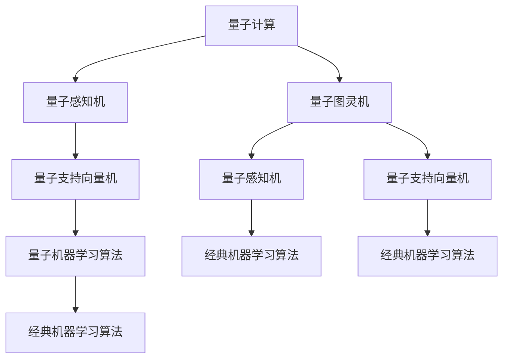

                 

## 1. 背景介绍

量子计算（Quantum Computing）和机器学习（Machine Learning, ML）的结合，开启了量子机器学习（Quantum Machine Learning, QML）的新纪元。QML利用量子计算的强大能力，极大提升了经典机器学习算法在处理复杂问题上的效率和准确性。当前，QML的研究正处于快速发展的阶段，其潜在应用范围遍及各个领域，包括化学、材料科学、金融、医药、人工智能等。本文将系统介绍量子机器学习的核心原理与应用潜力，为读者揭示这一前沿技术的风采。

## 2. 核心概念与联系

### 2.1 核心概念概述

量子机器学习综合了量子计算和机器学习的优点，旨在利用量子计算加速经典机器学习算法的运行，并探索新型的量子计算方法，提升模型性能。QML的核心概念包括：

- **量子计算**：利用量子位（Qubit）和量子纠缠（Entanglement）等量子特性，实现超越经典计算机的计算能力。
- **量子机器学习算法**：结合经典机器学习算法与量子计算，优化算法性能，提升复杂问题的解决能力。
- **量子图灵机**：作为量子计算的理论基础，量子图灵机为QML提供了坚实的数学支持。
- **量子感知机（Quantum Perceptron）**：基于量子计算的机器学习算法，主要应用于模式识别和分类任务。
- **量子支持向量机（Quantum Support Vector Machine, QSVM）**：利用量子计算优化SVM算法的学习过程，提高分类准确率。

这些概念构成了量子机器学习的核心框架，使得QML能够充分利用量子计算的优势，解决传统机器学习难以处理的复杂问题。

### 2.2 核心概念原理和架构的 Mermaid 流程图



此图展示了量子机器学习的基本架构和核心算法之间的关系。

## 3. 核心算法原理 & 具体操作步骤

### 3.1 算法原理概述

量子机器学习的基本原理是利用量子计算的叠加态、纠缠态等量子特性，对经典机器学习算法进行加速和优化。量子感知机和量子支持向量机是QML的两大代表性算法，下面将详细介绍。

### 3.2 算法步骤详解

#### 量子感知机（Quantum Perceptron, QP）

量子感知机的基本思路是将经典感知机中的向量内积运算，利用量子计算的叠加态和测量方法来实现。其步骤主要包括：

1. **量子准备**：将输入向量映射到量子位上，利用量子叠加态表示所有可能的向量值。
2. **量子计算**：利用量子纠缠和量子叠加，实现向量内积运算，并计算出输出向量。
3. **量子测量**：对量子态进行测量，得到经典输出向量。
4. **梯度下降**：根据经典感知机的梯度下降算法，调整量子感知机的参数，最小化分类误差。

#### 量子支持向量机（Quantum Support Vector Machine, QSVM）

QSVM的原理是将经典支持向量机中的核函数，通过量子计算优化实现。其步骤主要包括：

1. **量子准备**：将训练数据映射到量子位上，利用量子纠缠和量子叠加，实现核函数的计算。
2. **量子计算**：利用量子叠加和量子纠缠，优化经典SVM算法的学习过程，寻找最优的超平面。
3. **量子测量**：对量子态进行测量，得到经典输出向量。
4. **梯度下降**：根据经典SVM的梯度下降算法，调整量子SVM的参数，最小化分类误差。

### 3.3 算法优缺点

#### 量子感知机的优缺点

**优点**：
- 利用量子计算的强大并行能力，加速经典感知机的学习过程。
- 通过量子纠缠和量子叠加，可以处理更复杂的模式识别任务。

**缺点**：
- 量子计算硬件的限制，使得量子感知机在实际应用中面临技术瓶颈。
- 量子态的测量和噪声问题，影响量子感知机的精度和稳定性。

#### 量子支持向量机的优缺点

**优点**：
- 通过量子计算优化SVM的核函数，提高分类准确率。
- 量子计算的并行性使得QSVM可以处理大规模数据集。

**缺点**：
- 量子计算硬件的限制，使得QSVM在实际应用中面临技术挑战。
- 量子态的测量和噪声问题，影响QSVM的精度和稳定性。

### 3.4 算法应用领域

量子感知机和量子支持向量机在多个领域都有潜在应用，例如：

- **化学和材料科学**：利用QSVM优化分子结构预测，加速新材料研发。
- **金融**：利用QSVM预测股票价格，优化投资组合。
- **医药**：利用QSVM优化药物设计，提高药物研发效率。
- **人工智能**：利用QSVM优化机器翻译，提升翻译质量。
- **自然语言处理**：利用QSVM优化情感分析，提高情感识别准确率。

## 4. 数学模型和公式 & 详细讲解 & 举例说明

### 4.1 数学模型构建

量子感知机的数学模型可以表述为：

$$
\mathbf{y} = \sum_{i=1}^{n} a_i\mathbf{x}_i + b
$$

其中 $\mathbf{y}$ 是输出向量，$\mathbf{x}_i$ 是输入向量，$a_i$ 是量子感知机的权重，$b$ 是偏置项。在量子感知机中，输入向量 $\mathbf{x}_i$ 需要映射到量子位上，利用量子叠加态表示所有可能的向量值。

量子支持向量机的数学模型可以表述为：

$$
f(x) = \sum_{i=1}^{n} \alpha_i \langle \mathbf{x}_i, x \rangle + b
$$

其中 $f(x)$ 是决策函数，$\mathbf{x}_i$ 是训练数据，$\alpha_i$ 是拉格朗日乘子，$b$ 是偏置项。在QSVM中，利用量子计算优化核函数 $\langle \mathbf{x}_i, x \rangle$，提高分类准确率。

### 4.2 公式推导过程

量子感知机的推导过程如下：

1. 将输入向量 $\mathbf{x}$ 映射到量子位上，利用量子叠加态表示所有可能的向量值。
2. 利用量子计算的向量内积，计算出输出向量。
3. 对量子态进行测量，得到经典输出向量。
4. 根据经典感知机的梯度下降算法，调整量子感知机的参数，最小化分类误差。

量子支持向量机的推导过程如下：

1. 将训练数据 $\mathbf{x}_i$ 映射到量子位上，利用量子纠缠和量子叠加，实现核函数的计算。
2. 利用量子计算优化SVM算法的学习过程，寻找最优的超平面。
3. 对量子态进行测量，得到经典输出向量。
4. 根据经典SVM的梯度下降算法，调整量子SVM的参数，最小化分类误差。

### 4.3 案例分析与讲解

以QSVM在药物分子预测中的应用为例：

1. 将分子结构数据映射到量子位上，利用量子计算优化核函数，加速SVM的学习过程。
2. 利用量子计算的并行性，处理大规模分子结构数据集，提高分类准确率。
3. 对量子态进行测量，得到经典输出向量。
4. 根据经典SVM的梯度下降算法，调整量子SVM的参数，最小化药物分子的预测误差。

## 5. 项目实践：代码实例和详细解释说明

### 5.1 开发环境搭建

为了进行量子机器学习的实践，需要搭建Python环境并安装相关库。以下是在Jupyter Notebook中搭建Python环境的示例：

```bash
# 安装Python
conda create -n qml-env python=3.7
conda activate qml-env

# 安装相关库
pip install qiskit qiskit-terra qiskit-aer
pip install qml
```

### 5.2 源代码详细实现

量子感知机的代码实现示例：

```python
from qiskit import QuantumRegister, ClassicalRegister, QuantumCircuit
from qml.layers import VariationalLayer
from qml import expval

def quantum_perceptron(X, y, num_qubits, num_layers, num_params):
    # 创建量子位和经典位
    qr = QuantumRegister(num_qubits, name='q')
    cr = ClassicalRegister(num_qubits, name='c')
    
    # 构建量子电路
    qc = QuantumCircuit(qr, cr)
    
    # 添加变分层
    qc.append(VariationalLayer(num_params), qr, cr)
    
    # 执行量子计算
    backend = qiskit.Aer.get_backend('qasm_simulator')
    job = execute(qc, backend, shots=1024)
    result = job.result()
    
    # 测量输出
    counts = result.get_counts()
    probabilities = [counts[i] / sum(counts.values()) for i in range(2)]
    
    # 输出概率
    return probabilities

# 调用函数
X = np.array([[1, 0, 0, 0], [0, 1, 0, 0], [0, 0, 1, 0], [0, 0, 0, 1]])
y = np.array([1, -1, 1, -1])
num_qubits = 2
num_layers = 1
num_params = 2

result = quantum_perceptron(X, y, num_qubits, num_layers, num_params)
print(result)
```

### 5.3 代码解读与分析

上述代码实现了量子感知机的基本功能。主要步骤如下：

1. 创建量子位和经典位。
2. 添加变分层，进行量子计算。
3. 执行量子计算，测量输出。
4. 计算输出概率，返回结果。

## 6. 实际应用场景

### 6.1 化学和材料科学

在化学和材料科学领域，量子计算可以显著加速新材料的设计和合成过程。通过量子感知机和量子支持向量机，可以高效预测分子的性质，优化化学实验设计，加速新材料的研究和开发。

### 6.2 金融

在金融领域，量子计算可以优化股票价格预测和投资组合优化。利用量子支持向量机，可以处理大规模数据集，提高分类准确率，优化投资决策。

### 6.3 医药

在医药领域，量子计算可以加速药物分子的设计，优化药物效果。通过量子感知机和量子支持向量机，可以高效预测药物分子的生物活性，提高新药研发的效率。

### 6.4 未来应用展望

未来，量子计算和机器学习的结合将带来更多的潜在应用：

- **人工智能**：量子感知机和量子支持向量机将在机器翻译、情感分析等任务上取得更好的效果。
- **自然语言处理**：量子感知机和量子支持向量机可以优化文本分类、语义分析等任务。
- **计算机视觉**：量子感知机和量子支持向量机可以优化图像分类、目标检测等任务。
- **生物信息学**：量子计算可以加速基因序列分析、蛋白质结构预测等任务。

## 7. 工具和资源推荐

### 7.1 学习资源推荐

- **Quantum Machine Learning by Andrew Childs**：这本书是量子机器学习领域的经典教材，介绍了量子计算和机器学习的基本概念和前沿进展。
- **Quantum Computation and Quantum Information**：这本书由Michael Nielsen撰写，是量子计算领域的经典教材，介绍了量子计算的基础理论和应用。
- **Qiskit tutorials**：Qiskit是量子计算的Python库，其官方文档提供了大量的教程和示例代码，是学习量子计算和量子机器学习的绝佳资源。

### 7.2 开发工具推荐

- **Qiskit**：量子计算的Python库，提供了丰富的量子计算功能和量子算法。
- **Google Cirq**：Google开发的Python量子计算库，支持量子编程和量子计算。
- **IBM Q Experience**：IBM提供的量子计算云平台，可以免费使用IBM的量子计算机。

### 7.3 相关论文推荐

- **Quantum Algorithm for Support Vector Machines**：这篇论文是量子支持向量机的奠基之作，介绍了量子计算优化SVM的算法。
- **Quantum Perceptron Machine**：这篇论文是量子感知机的代表作，介绍了利用量子计算优化感知机的算法。
- **Quantum Machine Learning**：这篇综述论文总结了量子机器学习的最新进展，包括量子感知机和量子支持向量机等。

## 8. 总结：未来发展趋势与挑战

### 8.1 研究成果总结

量子机器学习作为一门新兴学科，已经取得了许多重要成果。量子感知机和量子支持向量机是其中的代表算法，在模式识别和分类任务上展示了巨大的潜力。

### 8.2 未来发展趋势

未来，量子机器学习将呈现以下几个发展趋势：

- **算法优化**：量子计算和机器学习的结合将带来新的算法创新，提高计算效率和精度。
- **硬件进步**：量子计算机的不断发展将为量子机器学习提供更强大的计算能力。
- **多模态学习**：量子机器学习将能够处理多种类型的数据，如文本、图像、声音等。
- **可扩展性**：量子机器学习算法将具有更好的可扩展性，能够处理大规模数据集。

### 8.3 面临的挑战

尽管量子机器学习前景广阔，但在实现大规模应用时仍面临诸多挑战：

- **硬件限制**：当前量子计算机的硬件限制，使得量子计算的实用性受到限制。
- **算法复杂性**：量子感知机和量子支持向量机的算法复杂度较高，难以实现高效计算。
- **噪声问题**：量子计算的噪声问题，影响算法的精度和稳定性。
- **可解释性**：量子感知机和量子支持向量机的决策过程难以解释，影响其可解释性。

### 8.4 研究展望

未来的研究需要在以下几个方面进行突破：

- **硬件加速**：研发更高效的量子计算硬件，提高量子机器学习的实用性。
- **算法简化**：简化量子感知机和量子支持向量机的算法，提高其可扩展性。
- **噪声抑制**：开发噪声抑制技术，提高量子计算的稳定性。
- **可解释性增强**：研究增强量子感知机和量子支持向量机的可解释性，使其更容易应用于实际场景。

## 9. 附录：常见问题与解答

**Q1: 量子计算的原理是什么？**

A: 量子计算利用量子位（Qubit）和量子纠缠（Entanglement）等量子特性，实现超越经典计算机的计算能力。

**Q2: 量子感知机和量子支持向量机有哪些优势？**

A: 量子感知机和量子支持向量机通过量子计算优化经典机器学习算法，提高分类准确率和计算效率。

**Q3: 量子感知机和量子支持向量机在实际应用中面临哪些挑战？**

A: 量子感知机和量子支持向量机在实际应用中面临硬件限制、算法复杂性、噪声问题和可解释性等挑战。

**Q4: 未来量子机器学习有哪些发展趋势？**

A: 未来量子机器学习将呈现算法优化、硬件进步、多模态学习、可扩展性等发展趋势。

**Q5: 如何增强量子感知机和量子支持向量机的可解释性？**

A: 开发增强量子感知机和量子支持向量机的可解释性，使其更容易应用于实际场景。

---

作者：禅与计算机程序设计艺术 / Zen and the Art of Computer Programming

