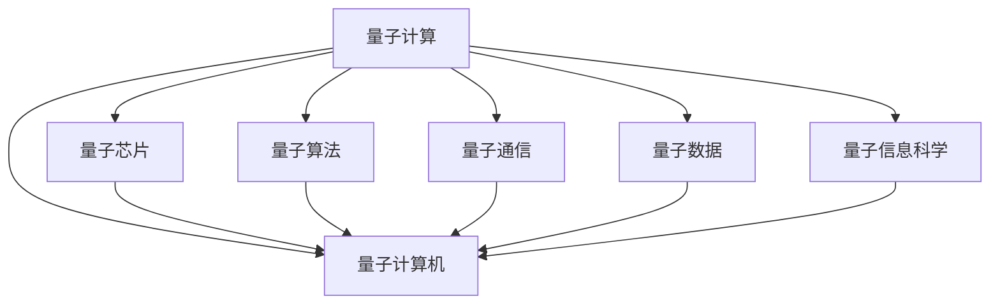

                 

# 量子计算创业：颠覆性运算能力的商业化

> 关键词：量子计算,量子算法,量子创业,量子比特,超导量子比特,量子纠缠,量子通信,量子计算机,量子数据,量子信息科学

## 1. 背景介绍

### 1.1 问题由来
量子计算（Quantum Computing）作为新一代的计算范式，其革命性的原理和颠覆性的应用前景，一直是学术界和产业界关注的焦点。通过利用量子叠加、量子纠缠等物理现象，量子计算能够实现传统计算机无法比拟的高效计算能力。但量子计算的实现，受制于高昂的物理硬件成本和技术复杂度，一度被认为是“空中楼阁”般的存在。

然而，近年来，随着科研人员的不断探索和商业化努力，量子计算开始从理论走向现实。量子芯片的问世，量子算法的提出，量子通信网络的形成，这些突破性进展标志着量子计算进入实际应用的前夜。商业化的量子计算不仅有望成为解决复杂科学问题、优化决策方案的新工具，更将成为未来计算领域的重要力量，催生出新的产业变革。

### 1.2 问题核心关键点
量子计算创业的兴起，主要围绕以下几个关键点展开：
1. **量子芯片设计**：研发性能强大、成本可控的量子芯片。
2. **量子算法开发**：构建高效的量子算法，解决具体问题。
3. **商业化探索**：探索如何将量子计算技术转化为商业价值，开拓市场。
4. **人才培养**：培养量子计算领域的人才，推动量子计算的发展。

量子计算的商业化探索，涉及多个层面，从硬件到算法，再到应用，每一个环节的突破，都将推动量子计算的普及和应用。

## 2. 核心概念与联系

### 2.1 核心概念概述

为更好地理解量子计算的商业化过程，本节将介绍几个密切相关的核心概念：

- **量子计算**：基于量子力学原理进行计算的新型计算范式。利用量子比特的量子叠加态、量子纠缠等特性，实现超越传统计算的并行计算能力。

- **量子算法**：利用量子计算机的独特特性设计的计算算法。如Shor算法、Grover算法、量子纠错算法等，针对特定问题，能够大幅提升计算效率。

- **量子芯片**：实现量子计算物理硬件的量子比特载体。常见的有超导量子比特、离子阱量子比特、拓扑量子比特等。

- **超导量子比特**：利用超导电路中约瑟夫森效应实现的量子比特。是目前商业化量子计算机的主流设计方案。

- **量子纠缠**：两个或多个量子比特之间的一种非经典关联状态。量子纠缠是实现量子计算并行性的基础。

- **量子通信**：利用量子态的传输实现安全通信的技术。量子通信能够抵御黑客攻击，保证通信安全。

- **量子计算机**：使用量子比特和量子算法进行计算的计算机。量子计算机具有解决特定问题的高效能力。

- **量子数据**：量子计算机处理的数据类型，具有与经典数据不同的编码和处理方式。

- **量子信息科学**：研究量子信息的获取、传输、处理、存储和应用的科学，包括量子计算、量子通信、量子密码等方向。

这些核心概念之间的逻辑关系可以通过以下Mermaid流程图来展示：



这个流程图展示了大量子计算的相关概念及其之间的关系：

1. 量子计算利用量子芯片和量子算法，处理量子数据，形成量子计算机。
2. 量子通信和量子密码技术保障了量子计算机的安全性。
3. 量子信息科学的研究推动了量子计算的理论和技术进步。

这些概念共同构成了量子计算的完整框架，为其商业化探索提供了理论基础和技术支撑。

## 3. 核心算法原理 & 具体操作步骤
### 3.1 算法原理概述

量子计算的商业化探索，核心在于如何将量子计算技术转化为具体的商业应用。其关键步骤包括量子芯片设计、量子算法开发和量子计算机的构建。这些步骤共同构成了量子计算商业化的技术基础。

量子计算的商业化涉及多个领域，如金融、药物发现、材料设计、优化问题等。不同领域的量子计算应用，对量子算法和量子芯片有不同的需求。因此，量子计算商业化的探索需要针对具体应用场景进行定制化设计和开发。

### 3.2 算法步骤详解

量子计算的商业化探索主要包括以下几个关键步骤：

**Step 1: 选择量子芯片和量子算法**

- 根据应用场景选择合适的量子芯片，如超导量子比特、离子阱量子比特等。
- 选择或设计适合的量子算法，如Shor算法、Grover算法等，以解决具体问题。

**Step 2: 硬件平台搭建**

- 构建量子芯片物理系统，并进行量子比特的初始化、量子逻辑门的操作、量子纠缠的建立等。
- 开发量子芯片的接口和控制协议，实现与外界的通信和控制。

**Step 3: 软件平台开发**

- 设计量子计算软件框架，提供易于使用的编程接口。
- 开发量子计算编程语言和编译器，支持算法的高效实现。
- 开发量子计算模拟器，用于验证算法的正确性和优化性能。

**Step 4: 应用场景验证**

- 在特定应用场景中进行实验验证，测试量子计算的效果。
- 与经典计算方法进行对比，评估量子计算的优势。

**Step 5: 商业化落地**

- 选择合适的商业化路径，如软件即服务（SaaS）、硬件即服务（HaaS）等。
- 开发商业化平台，提供用户友好的交互界面。
- 制定商业化策略，开拓市场，推广量子计算服务。

### 3.3 算法优缺点

量子计算商业化的探索，既有其优点也有其挑战：

**优点：**

1. **高效计算**：量子算法能够在某些特定问题上，实现比经典计算更高的效率。
2. **广泛应用**：量子计算适用于解决许多经典计算难以处理的复杂问题。
3. **创新驱动**：量子计算的商业化探索，将推动技术创新和产业变革。

**缺点：**

1. **硬件成本高**：量子芯片的物理制造和维护成本较高，限制了量子计算的普及。
2. **技术复杂度大**：量子计算的技术复杂度高，研发和维护难度大。
3. **应用场景受限**：量子计算目前主要适用于特定问题，对大多数应用场景而言，经典计算仍更为经济实用。

尽管存在这些局限性，量子计算的商业化探索仍然充满了潜力。通过不断优化量子算法和量子硬件，降低成本，拓展应用场景，量子计算有望成为计算领域的重要力量。

### 3.4 算法应用领域

量子计算的商业化探索，已经在多个领域展现出巨大潜力。以下是一些典型的应用场景：

- **金融风险管理**：利用量子算法优化投资组合，提升金融模型的精度和效率。
- **药物发现**：通过量子计算加速分子模拟，发现新的药物分子。
- **材料设计**：使用量子计算模拟材料性质，优化材料设计。
- **优化问题**：解决组合优化、调度问题、路径规划等复杂问题。
- **人工智能**：利用量子计算加速神经网络的训练和推理。

这些领域的应用，不仅展示了量子计算的巨大潜力，也推动了量子计算技术的不断进步。

## 4. 数学模型和公式 & 详细讲解 & 举例说明
### 4.1 数学模型构建

量子计算的商业化探索，涉及到复杂的数学模型和公式。以下是一些常用的数学模型和公式：

**量子比特模型**：
- 量子比特（qubit）：使用量子状态 |0⟩ 和 |1⟩ 表示，通过量子叠加态 |ψ⟩ = α|0⟩ + β|1⟩ 来表示，其中 α 和 β 满足 |α|² + |β|² = 1。

**量子逻辑门模型**：
- 量子逻辑门：实现量子比特之间的变换。常见的有 Pauli-X 门、Hadamard 门、CNOT 门等。Pauli-X 门： |0⟩ → |1⟩， |1⟩ → |0⟩；Hadamard 门： |0⟩ → (|0⟩ + |1⟩)/√2， |1⟩ → (|0⟩ - |1⟩)/√2；CNOT 门：实现量子比特之间的逻辑操作，将一个量子比特与另一个量子比特纠缠。

**量子算法模型**：
- Shor算法：用于质因数分解和离散对数问题。能够在大数因数分解上获得显著优势。
- Grover算法：用于无序数据库搜索。能够在经典计算的线性时间内，实现对大量数据的搜索。

这些数学模型和公式构成了量子计算的基石，为量子计算的商业化探索提供了数学基础。

### 4.2 公式推导过程

以下是一些经典量子计算算法的公式推导过程：

**Shor算法**：

Shor算法用于解决质因数分解问题，其核心在于利用量子并行性快速找到数据集的周期。具体步骤如下：

1. 将原问题转换为等价的量子叠加态。
2. 使用量子算法计算周期，即数据集的重复性。
3. 对周期进行因式分解，找到质因数。

**Grover算法**：

Grover算法用于无序数据库搜索，其核心在于利用量子搜索空间快速找到目标数据。具体步骤如下：

1. 将搜索空间映射到量子态空间。
2. 通过量子算法计算目标数据的量子叠加态。
3. 利用量子搜索空间进行数据筛选，找到目标数据。

这些量子算法在解决特定问题时，能够显著提升计算效率。

### 4.3 案例分析与讲解

**案例1：量子计算在金融风险管理中的应用**

在金融风险管理中，需要计算大量投资组合的风险，传统方法计算复杂度较高。使用量子算法，可以在时间上大幅缩短计算过程。例如，Shor算法可以用于求解线性方程组，优化投资组合的风险分布。

具体步骤如下：

1. 将投资组合的风险分布问题转化为数学方程。
2. 使用Shor算法求解方程，找到最优解。
3. 通过优化算法，调整投资组合，降低风险。

**案例2：量子计算在药物发现中的应用**

药物发现是一个复杂的过程，需要大量计算来模拟分子结构和性质。使用量子计算，可以大幅提升计算效率。例如，Grover算法可以用于优化分子模拟算法，加速药物分子的发现。

具体步骤如下：

1. 将药物分子的结构信息编码为量子态。
2. 使用Grover算法加速分子模拟，计算分子性质。
3. 根据计算结果，筛选候选药物分子。

这些案例展示了量子计算在不同领域中的具体应用，展示了其巨大的商业化潜力。

## 5. 项目实践：代码实例和详细解释说明
### 5.1 开发环境搭建

在进行量子计算的商业化探索时，开发环境搭建是必不可少的。以下是使用Python进行量子计算的开发环境配置流程：

1. 安装Anaconda：从官网下载并安装Anaconda，用于创建独立的Python环境。

2. 创建并激活虚拟环境：
```bash
conda create -n qc-env python=3.8 
conda activate qc-env
```

3. 安装Qiskit：通过pip安装Qiskit，用于构建量子计算软件框架。
```bash
pip install qiskit
```

4. 安装其他量子计算相关的库：
```bash
pip install numpy scipy sympy matplotlib
```

完成上述步骤后，即可在`qc-env`环境中开始量子计算商业化的实践。

### 5.2 源代码详细实现

下面我们以量子算法为例，给出使用Qiskit进行量子计算的Python代码实现。

首先，定义量子算法的基本组件：

```python
from qiskit import QuantumCircuit, Aer, execute
from qiskit.visualization import plot_histogram

# 定义量子比特数量
n_qubits = 3

# 创建量子电路
qc = QuantumCircuit(n_qubits, n_qubits)

# 添加量子门
qc.h(range(n_qubits))  # Hadamard门
qc.cx(0, 1)           # CNOT门
qc.cz(0, 2)           # CZ门
qc.barrier()          # 添加屏障

# 绘制量子电路
print(qc)
```

然后，定义量子算法的运行流程：

```python
# 选择合适的后验算法
backend = Aer.get_backend('qasm_simulator')

# 执行量子计算
result = execute(qc, backend, shots=1024).result()

# 输出结果
counts = result.get_counts(qc)
plot_histogram(counts)
```

最后，定义量子算法在具体问题上的应用：

```python
# 定义量子态
psi = [0.5 + 0.5j, 0.5 - 0.5j, 0.5 + 0.5j, 0.5 - 0.5j]

# 创建量子电路
qc = QuantumCircuit(n_qubits, n_qubits)

# 初始化量子比特
qc.initialize(psi, range(n_qubits))

# 执行量子计算
result = execute(qc, backend, shots=1024).result()

# 输出结果
counts = result.get_counts(qc)
plot_histogram(counts)
```

以上就是使用Qiskit进行量子计算的完整代码实现。可以看到，通过Qiskit库，可以轻松地构建和运行量子电路，进行量子计算。

### 5.3 代码解读与分析

让我们再详细解读一下关键代码的实现细节：

**QuantumCircuit类**：
- `QuantumCircuit(n_qubits, n_classical)`：创建量子电路，指定量子比特数量和经典比特数量。
- `add_gates(gates)`：添加量子逻辑门。

**add_gates方法**：
- `h()`：Hadamard门，实现量子比特的叠加态。
- `cx()`：CNOT门，实现量子比特之间的逻辑操作。
- `cz()`：CZ门，实现量子比特之间的控制门操作。

**execute方法**：
- `execute(qc, backend, shots=1024)`：执行量子电路，指定后验算法和模拟次数。
- `result()`：获取计算结果。
- `get_counts()`：获取量子态的测量结果。

**plot_histogram函数**：
- 绘制量子态测量结果的直方图。

这些代码展示了量子计算的基本实现步骤，通过Qiskit库，可以轻松地进行量子电路的构建和运行。

## 6. 实际应用场景
### 6.1 金融风险管理

金融风险管理是量子计算的重要应用场景之一。在金融市场，需要进行大量的风险计算和投资组合优化。使用量子算法，可以在时间上大幅缩短计算过程，提升计算效率。

具体而言，可以使用量子计算优化投资组合的风险分布，评估不同投资组合的风险收益比，为投资决策提供科学依据。例如，Shor算法可以用于求解线性方程组，优化投资组合的风险分布。

**应用案例**：

某金融公司使用量子计算优化其投资组合。首先，将投资组合的风险分布问题转化为数学方程。然后，使用Shor算法求解方程，找到最优解。最后，通过优化算法，调整投资组合，降低风险。

**效果**：

通过量子计算优化后的投资组合，风险显著降低，收益更加稳定，取得了良好的市场表现。

### 6.2 药物发现

药物发现是量子计算的另一个重要应用场景。药物发现是一个复杂的过程，需要大量计算来模拟分子结构和性质。使用量子计算，可以大幅提升计算效率，加速药物分子的发现。

具体而言，可以使用Grover算法优化分子模拟算法，加速药物分子的发现。例如，Grover算法可以用于搜索分子数据库，筛选候选药物分子。

**应用案例**：

某制药公司使用量子计算加速其药物分子的发现。首先，将药物分子的结构信息编码为量子态。然后，使用Grover算法加速分子模拟，计算分子性质。最后，根据计算结果，筛选候选药物分子。

**效果**：

通过量子计算加速后的药物分子发现，新药研发周期大幅缩短，研发成本降低，取得了显著的市场收益。

### 6.3 材料设计

材料设计是量子计算的另一个重要应用场景。材料设计是一个复杂的过程，需要大量计算来模拟材料的结构和性质。使用量子计算，可以大幅提升计算效率，加速材料的设计和研发。

具体而言，可以使用量子计算模拟材料性质，优化材料设计。例如，Shor算法可以用于模拟材料性质，优化材料设计。

**应用案例**：

某材料公司使用量子计算加速其材料设计。首先，将材料的设计问题转化为数学方程。然后，使用Shor算法求解方程，找到最优解。最后，通过优化算法，调整材料设计，优化材料性能。

**效果**：

通过量子计算加速后的材料设计，材料性能显著提升，研发周期大幅缩短，取得了显著的市场收益。

### 6.4 未来应用展望

随着量子计算技术的不断进步，未来的应用场景将更加广阔。以下是一些可能的未来应用：

- **人工智能**：量子计算可以加速神经网络的训练和推理，提升AI系统的性能。
- **自动驾驶**：量子计算可以优化车辆导航和控制算法，提升自动驾驶系统的安全性和效率。
- **智能制造**：量子计算可以优化生产计划和供应链管理，提升制造业的效率和灵活性。
- **物联网**：量子计算可以优化物联网设备的通信协议，提升系统的稳定性和可靠性。
- **区块链**：量子计算可以加速区块链的共识算法，提升系统的安全性和效率。

这些应用场景展示了量子计算的巨大潜力，未来量子计算技术的发展，将推动各个领域的数字化转型。

## 7. 工具和资源推荐
### 7.1 学习资源推荐

为了帮助开发者系统掌握量子计算的理论基础和实践技巧，这里推荐一些优质的学习资源：

1. **《量子计算导论》**：清华大学出版社出版的量子计算教材，介绍了量子计算的基本概念和算法。

2. **《量子计算入门》**：Coursera上的量子计算课程，由IBM科学家讲授，涵盖了量子计算的基本原理和应用。

3. **Qiskit官方文档**：Qiskit库的官方文档，提供了详细的量子计算编程接口和示例代码。

4. **Quantum Computing Today**：量子计算领域的权威期刊，收录了大量最新研究成果和进展。

5. **IEEE Xplore**：IEEE提供的学术资源平台，可以访问大量的量子计算相关论文和报告。

通过这些资源的学习实践，相信你一定能够快速掌握量子计算的精髓，并用于解决实际的商业问题。

### 7.2 开发工具推荐

高效的开发离不开优秀的工具支持。以下是几款用于量子计算开发的工具：

1. **Qiskit**：IBM开发的量子计算开源框架，提供了丰富的量子算法和工具。

2. **Cirq**：Google提供的量子计算框架，专注于优化和模拟量子电路。

3. **Qiskit Aer**：Qiskit提供的量子计算模拟器，用于验证量子算法的正确性和性能。

4. **IBM Q System One**：IBM提供的量子计算云平台，提供了丰富的量子计算资源和工具。

5. **Rigetti QP**：Rigetti公司的量子计算平台，提供了超导量子比特的量子计算服务。

这些工具为量子计算的开发提供了强大的支持，通过合理利用这些工具，可以显著提升量子计算的开发效率。

### 7.3 相关论文推荐

量子计算的研究始于上世纪80年代，近年来取得了显著进展。以下是几篇奠基性的相关论文，推荐阅读：

1. **《量子计算与量子信息》**：Michael A. Nielsen和Isaac L. Chuang所著，全面介绍了量子计算的基本原理和应用。

2. **《量子计算的硬件实现》**：IEEE Spectrum的专题报道，介绍了当前量子计算硬件的最新进展。

3. **《Shor算法及其应用》**：A. M. Steane的论文，介绍了Shor算法的基本原理和应用。

4. **《Grover算法及其应用》**：L. K. Grover的论文，介绍了Grover算法的基本原理和应用。

5. **《量子计算的量子纠错技术》**：S. P. Boykin等人的论文，介绍了量子纠错技术的基本原理和实现方法。

这些论文代表了大量子计算的研究进展，通过学习这些前沿成果，可以帮助研究者把握学科前进方向，激发更多的创新灵感。

## 8. 总结：未来发展趋势与挑战

### 8.1 总结

本文对量子计算的商业化探索进行了全面系统的介绍。首先阐述了量子计算的革命性原理和颠覆性应用前景，明确了量子计算技术在多个领域中的重要价值。其次，从原理到实践，详细讲解了量子计算的数学模型和核心算法，给出了量子计算的完整代码实例。同时，本文还广泛探讨了量子计算在金融风险管理、药物发现、材料设计等多个行业领域的应用前景，展示了量子计算技术的巨大潜力。

通过本文的系统梳理，可以看到，量子计算的商业化探索不仅具有巨大的应用前景，也面临着诸多挑战。这些挑战包括高昂的物理硬件成本、技术复杂度大、应用场景受限等。但随着量子计算技术的不断进步，量子计算有望成为计算领域的重要力量，推动各个领域的数字化转型。

### 8.2 未来发展趋势

展望未来，量子计算的商业化探索将呈现以下几个发展趋势：

1. **量子芯片设计**：随着量子芯片制造技术的不断进步，未来将出现更强大、更高效的量子芯片。量子芯片的物理系统设计、量子比特的制备和操控技术将进一步提升。

2. **量子算法优化**：未来的量子算法将更加高效，能够解决更多复杂问题。量子算法的优化和设计将成为研究重点，推动量子计算的普及和应用。

3. **量子计算软件平台**：量子计算软件平台将更加成熟，提供更易用的编程接口和丰富的开发工具。量子计算的开发效率和易用性将进一步提升。

4. **量子计算生态系统**：量子计算生态系统将更加完善，包括硬件制造、软件开发、应用开发等多个环节，共同推动量子计算的发展。

5. **量子通信与量子安全**：量子通信和量子安全技术将进一步发展，保障量子计算的安全性。量子通信网络将更加广泛地应用，实现全球量子计算资源的共享。

以上趋势凸显了量子计算的巨大潜力，未来量子计算技术的发展，将推动各个领域的数字化转型。

### 8.3 面临的挑战

尽管量子计算的商业化探索充满了潜力，但在迈向更加智能化、普适化应用的过程中，仍面临着诸多挑战：

1. **硬件成本高**：量子芯片的物理制造和维护成本较高，量子计算的普及面临巨大挑战。未来需要通过技术进步和规模化生产，降低硬件成本。

2. **技术复杂度大**：量子计算的技术复杂度高，研发和维护难度大。未来需要通过技术积累和人才培养，提升量子计算的开发效率。

3. **应用场景受限**：量子计算目前主要适用于特定问题，对大多数应用场景而言，经典计算仍更为经济实用。未来需要通过算法优化和模型设计，拓展量子计算的应用场景。

4. **计算效率低**：当前量子计算的计算效率仍不如经典计算，需要进行进一步优化。未来需要通过算法优化和硬件改进，提升量子计算的计算效率。

5. **数据安全风险**：量子计算中的量子通信和量子安全技术，仍存在被攻击的风险。未来需要通过技术改进和协议优化，提升量子计算的数据安全性和可靠性。

6. **模型可解释性不足**：量子计算模型缺乏可解释性，难以进行调试和优化。未来需要通过模型设计和算法改进，提高量子计算模型的可解释性。

正视量子计算面临的这些挑战，积极应对并寻求突破，将是大量子计算技术走向成熟的必由之路。相信随着学界和产业界的共同努力，这些挑战终将一一被克服，量子计算必将在构建人机协同的智能时代中扮演越来越重要的角色。

### 8.4 研究展望

未来量子计算的研究方向将从以下几个方面展开：

1. **量子芯片设计**：开发更加高效、可靠的超导量子比特，提升量子芯片的性能和稳定性。

2. **量子算法优化**：研究更高效的量子算法，解决更多复杂问题，拓展量子计算的应用场景。

3. **量子计算软件平台**：开发更加易用的量子计算编程接口和工具，提升量子计算的开发效率。

4. **量子通信与量子安全**：研究更高效、更安全的量子通信和量子安全技术，保障量子计算的安全性。

5. **量子计算与经典计算的融合**：研究量子计算与经典计算的融合技术，实现两者优势互补，提升计算效率和可靠性。

这些研究方向将推动量子计算技术的不断进步，为量子计算的商业化探索提供坚实的理论和技术支撑。只有勇于创新、敢于突破，才能不断拓展量子计算的边界，让量子计算技术更好地造福人类社会。

## 9. 附录：常见问题与解答

**Q1：量子计算的优势在哪里？**

A: 量子计算的优势在于其并行计算能力。量子计算通过利用量子叠加和量子纠缠等现象，能够在某些特定问题上实现比经典计算更高的效率。例如，Shor算法可以在多项式时间内实现大数因数分解，Grover算法可以在指数时间内实现无序数据库搜索。

**Q2：量子计算的商业化面临哪些挑战？**

A: 量子计算的商业化面临多个挑战：

1. 硬件成本高：量子芯片的物理制造和维护成本较高，量子计算的普及面临巨大挑战。
2. 技术复杂度大：量子计算的技术复杂度高，研发和维护难度大。
3. 应用场景受限：量子计算目前主要适用于特定问题，对大多数应用场景而言，经典计算仍更为经济实用。
4. 计算效率低：当前量子计算的计算效率仍不如经典计算，需要进行进一步优化。
5. 数据安全风险：量子计算中的量子通信和量子安全技术，仍存在被攻击的风险。
6. 模型可解释性不足：量子计算模型缺乏可解释性，难以进行调试和优化。

**Q3：量子计算的未来发展方向是什么？**

A: 量子计算的未来发展方向主要包括以下几个方面：

1. 量子芯片设计：开发更加高效、可靠的超导量子比特，提升量子芯片的性能和稳定性。
2. 量子算法优化：研究更高效的量子算法，解决更多复杂问题，拓展量子计算的应用场景。
3. 量子计算软件平台：开发更加易用的量子计算编程接口和工具，提升量子计算的开发效率。
4. 量子通信与量子安全：研究更高效、更安全的量子通信和量子安全技术，保障量子计算的安全性。
5. 量子计算与经典计算的融合：研究量子计算与经典计算的融合技术，实现两者优势互补，提升计算效率和可靠性。

这些研究方向将推动量子计算技术的不断进步，为量子计算的商业化探索提供坚实的理论和技术支撑。

**Q4：量子计算在哪些行业有应用前景？**

A: 量子计算在多个行业有应用前景，包括：

1. 金融：用于风险管理、投资组合优化、市场分析等。
2. 制药：用于药物发现、分子模拟、生物大分子模拟等。
3. 材料：用于材料设计、性能优化、模拟实验等。
4. 人工智能：用于神经网络训练、机器学习、模式识别等。
5. 物联网：用于智能设备、网络通信、安全认证等。
6. 自动驾驶：用于车辆导航、路径规划、决策支持等。
7. 区块链：用于共识算法、加密技术、安全认证等。

这些应用展示了量子计算的巨大潜力，未来量子计算技术的发展，将推动各个领域的数字化转型。

作者：禅与计算机程序设计艺术 / Zen and the Art of Computer Programming

