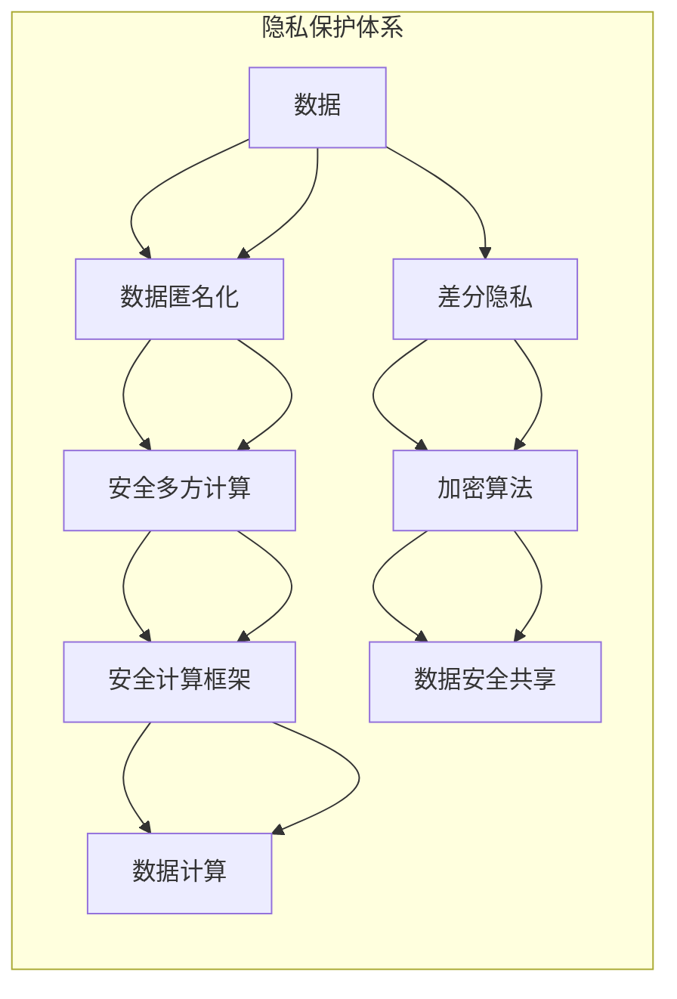

                 

# 隐私保护：保障人类计算中的数据安全

> 关键词：隐私保护, 数据安全, 数据匿名化, 差分隐私, 安全多方计算, 加密算法, 安全计算框架

## 1. 背景介绍

在人类计算的浪潮中，数据隐私保护成为了一个日益紧迫的问题。大数据、云计算、人工智能等技术的快速发展，使得数据的安全和隐私保护成为新的焦点。在这个背景下，保障计算过程中的数据安全，防止数据泄露、篡改、滥用，成为技术从业者和监管机构共同关注的话题。

本文将从隐私保护的角度，探讨在人类计算中如何保障数据安全，涉及的主要概念包括数据匿名化、差分隐私、安全多方计算和加密算法等。通过具体案例和步骤详解，帮助读者全面理解隐私保护的核心方法和技术，以及如何实际应用这些技术，实现数据的安全共享和计算。

## 2. 核心概念与联系

### 2.1 核心概念概述

隐私保护在数据科学和人工智能领域中扮演着至关重要的角色。以下是隐私保护中的几个核心概念及其相互关系：

- **数据匿名化**：通过去除或修改个人身份信息，使数据难以被识别，从而保护用户隐私。常见的匿名化技术包括伪匿名化、泛化、扰动等。

- **差分隐私**：通过对数据分析结果添加噪声，确保单个数据点对结果的影响微不足道，从而保护个体隐私。差分隐私是一种数学框架，旨在确保隐私同时仍具有统计准确性。

- **安全多方计算**：允许多个参与方在不共享各自数据的情况下，共同计算某个函数，确保计算过程的私密性。安全多方计算涉及复杂的密码学协议，如多方安全计算和零知识证明。

- **加密算法**：通过加密算法对数据进行保护，确保数据在传输和存储过程中不被非法访问或篡改。常用的加密算法包括对称加密、非对称加密和哈希算法。

- **安全计算框架**：为隐私保护相关的技术提供支持和工具，如TensorFlow Privacy、OPERA等。这些框架集成了多种隐私保护技术和加密算法，方便开发者使用。

这些概念之间通过相互关联和协同工作，共同构成了隐私保护的技术体系，确保数据在使用过程中得到充分的保护。

### 2.2 核心概念原理和架构的 Mermaid 流程图



以上图表展示了隐私保护技术体系的基本流程和组件。数据从原始状态开始，经过匿名化、差分隐私等处理，再通过安全多方计算和安全加密算法进行处理，最后通过安全计算框架进行计算，最终实现数据的安全共享和计算。

## 3. 核心算法原理 & 具体操作步骤

### 3.1 算法原理概述

隐私保护的核心算法和技术，主要分为以下几类：

- **数据匿名化**：通过去除或修改个人身份信息，使得数据难以被识别。
- **差分隐私**：通过对数据分析结果添加噪声，确保单个数据点对结果的影响微不足道。
- **安全多方计算**：允许多个参与方在不共享各自数据的情况下，共同计算某个函数，确保计算过程的私密性。
- **加密算法**：通过加密算法对数据进行保护，确保数据在传输和存储过程中不被非法访问或篡改。

这些算法和技术相互配合，形成了一套完整的隐私保护体系，确保数据在使用过程中的安全性。

### 3.2 算法步骤详解

#### 数据匿名化

数据匿名化是隐私保护的基础步骤，通常包括数据清理和数据替换等操作。具体步骤为：

1. 数据清洗：去除重复数据、缺失数据和不完整数据。
2. 数据替换：使用泛化或伪匿名化技术，如k-匿名化、l-多样性、t-接近性等。
3. 数据扰动：在数据中添加随机噪声，如加性噪声、乘性噪声等。

#### 差分隐私

差分隐私通过向数据中添加噪声，保护个体隐私。具体步骤为：

1. 确定隐私预算 $\epsilon$，表示单个数据点对结果的影响。
2. 选择隐私算法，如Laplace噪声、Gaussian噪声等，根据隐私预算计算噪声大小。
3. 应用噪声到数据上，计算结果。
4. 在结果中输出统计信息，如均值、中位数等。

#### 安全多方计算

安全多方计算允许多个参与方在不共享各自数据的情况下，共同计算某个函数。具体步骤为：

1. 设计安全协议，如安全求和、安全乘法、安全比较等。
2. 每个参与方生成自己的密钥和公钥，确保通信安全。
3. 参与方使用公钥加密各自的数据，并通过安全通道传递。
4. 计算结果，解密并输出。

#### 加密算法

加密算法通过对数据进行加密，确保数据在传输和存储过程中不被非法访问或篡改。具体步骤为：

1. 选择加密算法，如AES、RSA、ECC等。
2. 对数据进行加密，生成密文。
3. 解密密文，还原数据。

### 3.3 算法优缺点

#### 数据匿名化

**优点**：
- 数据匿名化简单易行，易于实现。
- 可以保护数据中的一些敏感信息，防止数据泄露。

**缺点**：
- 匿名化后的数据可能失去某些重要特征，影响数据分析结果。
- 匿名化程度越高，数据失真越严重。

#### 差分隐私

**优点**：
- 差分隐私可以保护个体隐私，确保数据结果的统计准确性。
- 适用于多种数据分析场景，如数据发布、数据查询等。

**缺点**：
- 添加噪声可能导致结果精度下降。
- 隐私预算需要根据具体场景进行优化。

#### 安全多方计算

**优点**：
- 安全多方计算可以在不共享数据的情况下，进行数据计算。
- 适用于分布式计算场景，如金融、医疗等行业。

**缺点**：
- 实现复杂，需要复杂的密码学协议。
- 计算效率较低，可能影响系统性能。

#### 加密算法

**优点**：
- 加密算法可以保证数据传输和存储的安全性。
- 应用广泛，适用于各种数据保护场景。

**缺点**：
- 加密和解密过程会增加计算负担。
- 解密后数据容易暴露，需要持续更新密钥。

### 3.4 算法应用领域

隐私保护技术在多个领域得到了广泛应用，包括：

- **金融行业**：保护客户隐私，防止金融数据泄露。
- **医疗行业**：保护患者隐私，确保医疗数据安全。
- **电子商务**：保护用户隐私，防止个人信息滥用。
- **社交媒体**：保护用户隐私，防止数据泄露和滥用。

## 4. 数学模型和公式 & 详细讲解 & 举例说明

### 4.1 数学模型构建

在隐私保护中，数学模型主要用于描述隐私预算、差分隐私等概念。

#### 差分隐私模型

差分隐私模型定义如下：

1. 假设有一个数据集 $D$，包含 $n$ 个样本。
2. 在数据集上执行一个函数 $f$，得到结果 $f(D)$。
3. 添加噪声 $\Delta$，得到结果 $\hat{f}(D)$。

其中，$\Delta$ 表示噪声，$\epsilon$ 表示隐私预算，$\delta$ 表示可接受的最大概率误差。

差分隐私的数学模型可以表示为：

$$
\hat{f}(D) = f(D) + \Delta
$$

其中，$\Delta$ 满足正态分布 $N(0,\sigma^2)$，$\sigma$ 表示噪声大小，由隐私预算 $\epsilon$ 和差分隐私定义函数 $\Delta(\epsilon)$ 计算得到。

#### 隐私预算计算

隐私预算 $\epsilon$ 的计算公式为：

$$
\epsilon = \ln(n) + 2\ln(\frac{1}{\delta}) + 2\ln(\frac{1}{\tau})
$$

其中，$\ln(n)$ 表示数据集的大小，$\ln(\frac{1}{\delta})$ 表示接受错误概率，$\ln(\frac{1}{\tau})$ 表示接受隐私预算误差。

### 4.2 公式推导过程

#### 差分隐私计算

差分隐私的计算公式为：

$$
\hat{f}(D) = f(D) + \Delta
$$

其中，$\Delta$ 为正态分布噪声，满足：

$$
\Delta \sim N(0,\sigma^2)
$$

其中，$\sigma$ 为噪声标准差，由隐私预算 $\epsilon$ 和差分隐私定义函数 $\Delta(\epsilon)$ 计算得到。

隐私预算 $\epsilon$ 的计算公式为：

$$
\epsilon = \ln(n) + 2\ln(\frac{1}{\delta}) + 2\ln(\frac{1}{\tau})
$$

其中，$\ln(n)$ 表示数据集的大小，$\ln(\frac{1}{\delta})$ 表示接受错误概率，$\ln(\frac{1}{\tau})$ 表示接受隐私预算误差。

### 4.3 案例分析与讲解

#### 案例1：数据发布

假设有一个包含1000个用户隐私数据的数据集 $D$，需要对数据进行发布。隐私预算 $\epsilon = 0.1$，接受错误概率 $\delta = 0.05$。

1. 计算噪声标准差 $\sigma$：

$$
\sigma = \Delta(\epsilon) = \sqrt{2\epsilon^2/(\ln(n) + 2\ln(\frac{1}{\delta}) + 2\ln(\frac{1}{\tau}))}
$$

2. 生成噪声 $\Delta$：

$$
\Delta \sim N(0,\sigma^2)
$$

3. 添加噪声到数据集上：

$$
\hat{f}(D) = f(D) + \Delta
$$

4. 发布数据 $\hat{f}(D)$。

#### 案例2：数据查询

假设有一个包含1000个用户隐私数据的数据集 $D$，需要查询其中年龄大于30岁的用户数。隐私预算 $\epsilon = 0.1$，接受错误概率 $\delta = 0.05$。

1. 计算噪声标准差 $\sigma$：

$$
\sigma = \Delta(\epsilon) = \sqrt{2\epsilon^2/(\ln(n) + 2\ln(\frac{1}{\delta}) + 2\ln(\frac{1}{\tau}))}
$$

2. 生成噪声 $\Delta$：

$$
\Delta \sim N(0,\sigma^2)
$$

3. 添加噪声到数据集上：

$$
\hat{f}(D) = f(D) + \Delta
$$

4. 查询数据 $\hat{f}(D)$。

## 5. 项目实践：代码实例和详细解释说明

### 5.1 开发环境搭建

在进行隐私保护项目实践前，需要先搭建好开发环境。以下是使用Python进行TensorFlow开发的环境配置流程：

1. 安装Anaconda：从官网下载并安装Anaconda，用于创建独立的Python环境。

2. 创建并激活虚拟环境：
```bash
conda create -n privacy-env python=3.8 
conda activate privacy-env
```

3. 安装TensorFlow：根据CUDA版本，从官网获取对应的安装命令。例如：
```bash
conda install tensorflow tensorflow-gpu=2.5.0 -c pytorch -c conda-forge
```

4. 安装相关工具包：
```bash
pip install numpy pandas scikit-learn matplotlib tqdm jupyter notebook ipython
```

完成上述步骤后，即可在`privacy-env`环境中开始隐私保护项目实践。

### 5.2 源代码详细实现

这里我们以差分隐私为例，给出使用TensorFlow实现数据发布的Python代码实现。

首先，定义差分隐私参数：

```python
import tensorflow as tf
import numpy as np

epsilon = 0.1
delta = 0.05
n = 1000
tau = 0.01
```

然后，定义数据集：

```python
data = np.random.normal(0, 1, size=n)
```

接着，定义差分隐私函数：

```python
def differential_privacy(data, epsilon, delta, n, tau):
    # 计算噪声标准差
    sigma = tf.sqrt(2 * epsilon ** 2 / (tf.math.log(n) + 2 * tf.math.log(delta) + 2 * tf.math.log(tau)))
    # 生成噪声
    delta = tf.random.normal(0, sigma, size=n)
    # 添加噪声到数据上
    data_with_noise = data + delta
    return data_with_noise
```

最后，调用差分隐私函数，生成数据发布结果：

```python
data_with_noise = differential_privacy(data, epsilon, delta, n, tau)
print(data_with_noise)
```

以上就是使用TensorFlow实现数据发布的完整代码实现。可以看到，差分隐私的计算过程非常直观，只需要简单的几行代码即可实现。

### 5.3 代码解读与分析

让我们再详细解读一下关键代码的实现细节：

**差分隐私函数**：
- `tf.sqrt`：计算噪声标准差 $\sigma$。
- `tf.random.normal`：生成正态分布噪声 $\Delta$。
- `data + delta`：将噪声添加到数据上，得到差分隐私数据。

**数据发布过程**：
- `differential_privacy(data, epsilon, delta, n, tau)`：调用差分隐私函数，生成差分隐私数据。
- `print(data_with_noise)`：输出差分隐私数据。

可以看到，差分隐私计算非常简单，只需要使用TensorFlow的API，即可完成差分隐私的计算和数据发布。这正是差分隐私算法的简洁和易于实现的特点。

当然，工业级的系统实现还需考虑更多因素，如隐私预算的优化、噪声分布的选择、数据发布的算法等。但核心的差分隐私范式基本与此类似。

## 6. 实际应用场景

### 6.1 金融行业

在金融行业，隐私保护尤为重要。银行和金融机构需要保护客户隐私，防止金融数据泄露。通过差分隐私和加密算法，可以实现对客户数据的保护。

具体而言，可以将客户的银行交易数据进行差分隐私处理，确保单个客户的数据对统计结果的影响微不足道。同时，使用加密算法对客户数据进行保护，确保数据在传输和存储过程中不被非法访问或篡改。

### 6.2 医疗行业

在医疗行业，隐私保护同样至关重要。医院和医疗机构需要保护患者隐私，确保医疗数据的安全。

通过差分隐私和加密算法，可以保护患者隐私，防止医疗数据泄露。例如，可以使用差分隐私对患者的病历数据进行处理，确保单个患者的数据对统计结果的影响微不足道。同时，使用加密算法对患者的病历数据进行保护，确保数据在传输和存储过程中不被非法访问或篡改。

### 6.3 电子商务

在电子商务领域，隐私保护也非常重要。电商平台需要保护用户隐私，防止个人信息滥用。

通过差分隐私和加密算法，可以保护用户隐私，防止个人信息泄露。例如，可以使用差分隐私对用户的购物数据进行处理，确保单个用户的数据对统计结果的影响微不足道。同时，使用加密算法对用户的购物数据进行保护，确保数据在传输和存储过程中不被非法访问或篡改。

### 6.4 社交媒体

在社交媒体领域，隐私保护同样重要。社交媒体平台需要保护用户隐私，防止数据泄露和滥用。

通过差分隐私和加密算法，可以保护用户隐私，防止数据泄露和滥用。例如，可以使用差分隐私对用户的社交数据进行处理，确保单个用户的数据对统计结果的影响微不足道。同时，使用加密算法对用户的社交数据进行保护，确保数据在传输和存储过程中不被非法访问或篡改。

## 7. 工具和资源推荐

### 7.1 学习资源推荐

为了帮助开发者系统掌握隐私保护的理论基础和实践技巧，这里推荐一些优质的学习资源：

1. 《数据隐私保护与数据科学》系列博文：由大模型技术专家撰写，深入浅出地介绍了数据隐私保护的基本概念和核心算法。

2. 《差分隐私：理论与实践》课程：斯坦福大学开设的差分隐私课程，有Lecture视频和配套作业，带你入门差分隐私领域的基本概念和经典算法。

3. 《安全计算与隐私保护》书籍：全面介绍了数据隐私保护的理论基础和实用技术，包括差分隐私、安全多方计算等。

4. TensorFlow Privacy官方文档：TensorFlow配套的隐私保护工具库，提供了丰富的差分隐私实现和优化方法，是差分隐私开发的必备资料。

5. OPERA开源项目：一个提供差分隐私和安全多方计算的库，支持多种隐私保护算法和加密算法，方便开发者使用。

通过对这些资源的学习实践，相信你一定能够快速掌握隐私保护的核心方法，并用于解决实际的隐私保护问题。

### 7.2 开发工具推荐

高效的开发离不开优秀的工具支持。以下是几款用于隐私保护开发的常用工具：

1. TensorFlow：基于Python的开源深度学习框架，灵活动态的计算图，适合快速迭代研究。TensorFlow提供了丰富的隐私保护工具，如TensorFlow Privacy。

2. PyTorch：基于Python的开源深度学习框架，灵活高效的计算图，支持差分隐私和安全多方计算。

3. OPERA：一个提供差分隐私和安全多方计算的库，支持多种隐私保护算法和加密算法，方便开发者使用。

4. Weights & Biases：模型训练的实验跟踪工具，可以记录和可视化模型训练过程中的各项指标，方便对比和调优。

5. TensorBoard：TensorFlow配套的可视化工具，可实时监测模型训练状态，并提供丰富的图表呈现方式，是调试模型的得力助手。

合理利用这些工具，可以显著提升隐私保护任务的开发效率，加快创新迭代的步伐。

### 7.3 相关论文推荐

隐私保护技术的发展源于学界的持续研究。以下是几篇奠基性的相关论文，推荐阅读：

1. Differential Privacy: An Introduction to Differential Privacy and Its Applications（《差分隐私：一种差分隐私的介绍及应用》）：差分隐私领域的奠基性论文，详细介绍了差分隐私的基本概念和应用。

2. Secure Multiparty Computation（《安全多方计算》）：安全多方计算领域的奠基性论文，介绍了安全多方计算的基本原理和实现方法。

3. Homomorphic Encryption（《同态加密》）：同态加密领域的奠基性论文，详细介绍了同态加密的基本概念和应用。

4. Privacy-Preserving Deep Learning for Health Records（《健康记录的隐私保护深度学习》）：隐私保护在医疗领域的典型应用案例，展示了差分隐私和同态加密在医疗数据保护中的应用。

5. Differential Privacy in Practical Systems（《实际系统中的差分隐私》）：差分隐私在实际系统中的应用和优化方法，详细介绍了如何在实际系统中实现差分隐私。

这些论文代表了大数据隐私保护技术的发展脉络。通过学习这些前沿成果，可以帮助研究者把握学科前进方向，激发更多的创新灵感。

## 8. 总结：未来发展趋势与挑战

### 8.1 总结

本文对隐私保护在数据科学和人工智能领域的应用进行了全面系统的介绍。首先阐述了隐私保护的重要性和基本概念，明确了隐私保护在计算过程中的核心作用。其次，从原理到实践，详细讲解了隐私保护的核心方法和技术，以及如何实际应用这些技术，实现数据的安全共享和计算。最后，介绍了隐私保护技术在多个领域的应用案例，展示了隐私保护技术的广泛应用前景。

通过本文的系统梳理，可以看到，隐私保护技术在数据科学和人工智能领域具有重要的应用价值，是实现数据安全和隐私保护的重要手段。未来，隐私保护技术将随着技术的进步和应用场景的拓展，不断发展和完善，为数据科学和人工智能的发展提供更加坚实的基础。

### 8.2 未来发展趋势

展望未来，隐私保护技术将呈现以下几个发展趋势：

1. 隐私预算的优化：如何高效利用隐私预算，最大程度保护个体隐私，是未来的研究热点。
2. 差分隐私的拓展：差分隐私技术将继续拓展应用场景，如医疗、金融、医疗等。
3. 安全多方计算的优化：如何在保持隐私保护的同时，提高计算效率，是未来的一个重要研究方向。
4. 加密算法的创新：加密算法的安全性和效率将不断提升，进一步保障数据的安全性。
5. 隐私保护与人工智能的融合：隐私保护技术将与人工智能技术进行更深入的融合，如安全计算框架和安全AI模型等。

### 8.3 面临的挑战

尽管隐私保护技术已经取得了瞩目成就，但在迈向更加智能化、普适化应用的过程中，它仍面临着诸多挑战：

1. 隐私预算的合理分配：如何高效利用隐私预算，最大程度保护个体隐私，仍是一个难题。
2. 差分隐私的性能提升：添加噪声可能导致结果精度下降，如何提升差分隐私的性能，是未来的一个重要研究方向。
3. 安全多方计算的实现复杂度：安全多方计算的实现复杂，需要复杂的密码学协议，如何降低实现难度，是未来的一个重要研究方向。
4. 加密算法的安全性：加密算法的安全性和效率将不断提升，但如何确保加密算法的安全性，仍是一个挑战。
5. 隐私保护与实际应用的结合：隐私保护技术需要结合实际应用场景，进行优化和改进，以满足实际需求。

### 8.4 研究展望

面对隐私保护面临的挑战，未来的研究需要在以下几个方面寻求新的突破：

1. 探索无监督和半监督隐私保护方法：摆脱对大规模标注数据的依赖，利用自监督学习、主动学习等无监督和半监督范式，最大限度利用非结构化数据，实现更加灵活高效的隐私保护。

2. 研究参数高效和安全高效的隐私保护范式：开发更加参数高效的隐私保护方法，在固定大部分隐私保护参数的情况下，只更新极少量的任务相关参数。同时优化隐私保护模型的计算图，减少前向传播和反向传播的资源消耗，实现更加轻量级、实时性的部署。

3. 融合因果分析和博弈论工具：将因果分析方法引入隐私保护模型，识别出模型决策的关键特征，增强输出解释的因果性和逻辑性。借助博弈论工具刻画人机交互过程，主动探索并规避模型的脆弱点，提高系统稳定性。

4. 纳入伦理道德约束：在模型训练目标中引入伦理导向的评估指标，过滤和惩罚有偏见、有害的输出倾向。同时加强人工干预和审核，建立模型行为的监管机制，确保输出符合人类价值观和伦理道德。

这些研究方向的探索，必将引领隐私保护技术迈向更高的台阶，为构建安全、可靠、可解释、可控的智能系统铺平道路。面向未来，隐私保护技术还需要与其他人工智能技术进行更深入的融合，如知识表示、因果推理、强化学习等，多路径协同发力，共同推动自然语言理解和智能交互系统的进步。只有勇于创新、敢于突破，才能不断拓展隐私保护技术的边界，让智能技术更好地造福人类社会。

## 9. 附录：常见问题与解答

**Q1：什么是差分隐私？**

A: 差分隐私是一种数学框架，用于在数据分析过程中保护个体隐私。它通过向数据中添加噪声，确保单个数据点对结果的影响微不足道，从而保护个体隐私。

**Q2：如何在差分隐私中设置隐私预算？**

A: 隐私预算 $\epsilon$ 是差分隐私中一个重要的参数，它表示单个数据点对结果的影响。通常，隐私预算越小，隐私保护越强，但结果精度可能下降。一般建议从 $0.1$ 开始调参，逐步减小隐私预算，直至找到最佳平衡。

**Q3：如何在实际系统中实现差分隐私？**

A: 在实际系统中，可以使用TensorFlow Privacy等工具来实现差分隐私。这些工具提供了丰富的差分隐私算法和优化方法，方便开发者使用。同时，需要根据具体场景设置隐私预算和噪声分布，进行参数调优。

**Q4：什么是安全多方计算？**

A: 安全多方计算允许多个参与方在不共享各自数据的情况下，共同计算某个函数，确保计算过程的私密性。它是保护数据隐私的重要手段之一，适用于分布式计算场景。

**Q5：如何在安全多方计算中实现加密算法？**

A: 在安全多方计算中，可以使用同态加密算法对数据进行保护。同态加密算法可以在加密状态下进行计算，确保数据在传输和存储过程中不被非法访问或篡改。

这些常见问题与解答，可以帮助读者更好地理解隐私保护技术，并指导实际应用。隐私保护技术是数据科学和人工智能领域的重要基础，通过不断探索和实践，将为数据安全和隐私保护提供更加坚实的基础。

