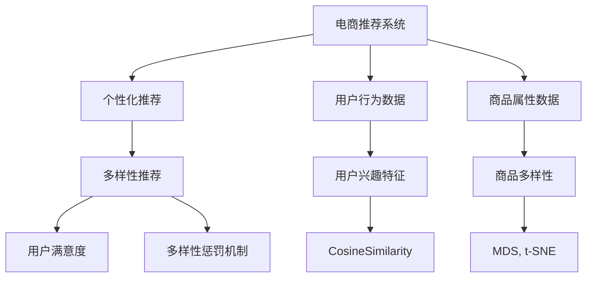

                 

# AI 大模型在电商推荐中的多样性策略：避免过度个性化的陷阱

## 1. 背景介绍

在电商领域，个性化推荐系统（Recommendation System）是实现精准营销、提升用户购物体验的核心技术。通过分析用户行为数据，推荐系统能预测用户感兴趣的商品，显著提高销售额和客户满意度。然而，随着推荐系统逐渐普及，过度个性化的推荐策略也引发了一系列问题，例如用户粘性下降、选择性沉默、隐私泄露等，严重影响了用户体验和平台信任。

### 1.1 问题由来

近年来，电商推荐系统逐渐从基于协同过滤的朴素推荐方法，向基于深度学习、自然语言处理等先进技术的大模型推荐转变。大模型通过大规模数据训练，能够学习到丰富的用户兴趣和商品属性信息，从而提供更精准的推荐结果。然而，这种基于个性化的推荐策略，在一些场景下可能适得其反，使得部分用户无法接触到多样化商品，反而降低消费满意度。

### 1.2 问题核心关键点
避免推荐系统过度个性化的关键在于找到平衡点，既要个性化推荐，也要兼顾多样性。具体而言：
- 如何在满足用户兴趣的基础上，增加推荐商品的多样性？
- 如何设计算法机制，保证商品的多样性不被忽略？
- 如何在保证多样性的前提下，提升推荐的准确性和个性化水平？

本文将详细探讨这些问题，并提出相应的多样性策略，帮助电商推荐系统实现个性化与多样性的统一。

## 2. 核心概念与联系

### 2.1 核心概念概述

在深入讨论之前，我们先简要介绍几个核心概念：

- **电商推荐系统**：基于用户行为数据（如浏览记录、购买历史等），通过机器学习算法为用户推荐可能感兴趣的产品的系统。
- **个性化推荐**：根据用户历史行为和兴趣特征，为用户推荐与其相似的商品，提升推荐准确性。
- **多样性推荐**：在个性化推荐基础上，考虑商品的多样性，避免“信息茧房”效应，使用户接触到更多不同的商品。
- **多样性惩罚机制**：在推荐算法中引入约束条件，以惩罚过度个性化推荐，鼓励商品多样性。
- **用户满意度与商品多样性**：推荐系统追求的主要目标之一是提升用户满意度，多样性推荐是提升用户满意度的重要手段之一。

这些概念之间的联系通过以下Mermaid流程图来展示：



这个流程图展示了个电商推荐系统的工作流程：

1. 电商推荐系统从用户行为数据和商品属性数据中提取用户兴趣特征。
2. 通过个性化推荐算法，根据用户兴趣特征推荐相似商品。
3. 在个性化推荐基础上，考虑商品多样性，增加推荐商品的多样性。
4. 使用多样性惩罚机制，保证推荐商品的多样性不被忽略。
5. 多样性推荐提升用户满意度，增加用户粘性。

## 3. 核心算法原理 & 具体操作步骤
### 3.1 算法原理概述

电商推荐系统的大模型多样性策略，其核心思想是结合用户个性化需求和商品多样性要求，综合考虑用户满意度和商品多样性，以达到最佳推荐效果。

具体而言，算法应满足以下条件：
1. 个性化推荐：模型应根据用户历史行为和兴趣特征，推荐与其相似的商品。
2. 多样性推荐：模型应引入商品多样性约束，保证推荐商品的多样性。
3. 用户满意度提升：推荐系统最终目的是提升用户满意度，多样性推荐可以提升用户满意度和粘性。

在算法实现上，可以采用以下步骤：

1. 构建用户行为和商品属性的特征向量表示。
2. 利用用户行为和商品属性特征计算用户与商品的相似度。
3. 引入商品多样性约束，设计多样性惩罚机制。
4. 通过综合考虑个性化推荐和多样性推荐，得到最终的推荐结果。

### 3.2 算法步骤详解

下面以大模型BERT为例，详细讲解电商推荐系统中多样性策略的实现步骤：

#### 3.2.1 特征向量构建

1. **用户行为特征提取**：
   - 收集用户的历史行为数据，包括浏览记录、购买历史、收藏商品等。
   - 将行为数据转换为向量表示，如使用Transformer编码器提取向量。

   ```python
   from transformers import BertTokenizer, BertModel
   from torch.nn import CrossEntropyLoss
   import torch
   
   # 初始化Bert模型和tokenizer
   tokenizer = BertTokenizer.from_pretrained('bert-base-uncased')
   model = BertModel.from_pretrained('bert-base-uncased')
   
   # 将行为数据转换为向量表示
   def encode_behavior(data):
       input_ids = [tokenizer.encode(item) for item in data]
       inputs = {'input_ids': torch.tensor(input_ids)}
       outputs = model(**inputs)
       return outputs.pooler_output
   ```

2. **商品属性特征提取**：
   - 收集商品的详细信息，包括名称、价格、类别等。
   - 将商品属性数据转换为向量表示。

   ```python
   # 将商品属性数据转换为向量表示
   def encode_product(data):
       input_ids = [tokenizer.encode(item) for item in data]
       inputs = {'input_ids': torch.tensor(input_ids)}
       outputs = model(**inputs)
       return outputs.pooler_output
   ```

3. **用户兴趣特征计算**：
   - 使用交叉熵损失计算用户行为向量与商品向量之间的相似度。
   - 通过相似度得分计算用户兴趣特征。

   ```python
   # 计算用户行为向量与商品向量的相似度
   def calculate_similarity(user, products):
       user_vector = encode_behavior(user)
       product_vectors = [encode_product(product) for product in products]
       similarities = []
       for product_vector in product_vectors:
           output = model(user_vector, product_vector)[0]
           similarity = F.cosine_similarity(user_vector, product_vector)
           similarities.append(similarity)
       return similarities
   ```

#### 3.2.2 多样性惩罚机制

1. **商品多样性计算**：
   - 计算商品间的距离，如使用多维尺度分析（MDS）或t-SNE降维技术。
   - 计算商品的多样性指数。

   ```python
   # 计算商品之间的距离
   def calculate_distance(products):
       product_vectors = [encode_product(product) for product in products]
       distance = pdist(product_vectors, 'euclidean')
       return distance
   ```

2. **多样性惩罚**：
   - 引入多样性惩罚机制，如设置多样性阈值，惩罚过于相似的商品。
   - 调整模型损失函数，引入多样性约束。

   ```python
   # 计算商品的多样性指数
   def calculate_diversity(products):
       distance = calculate_distance(products)
       diversity = 1 - np.mean(np.linalg.norm(distance, axis=1))
       return diversity
   
   # 引入多样性惩罚机制
   def diversify_products(products):
       diversity = calculate_diversity(products)
       if diversity < diversity_threshold:
           # 惩罚多样性不足
           return []
       else:
           return products
   ```

#### 3.2.3 综合推荐策略

1. **个性化推荐**：
   - 根据用户行为特征和商品属性特征计算相似度得分。
   - 使用softmax函数将得分转换为概率分布。

   ```python
   # 计算用户行为向量与商品向量的相似度
   def calculate_similarity(user, products):
       user_vector = encode_behavior(user)
       product_vectors = [encode_product(product) for product in products]
       similarities = []
       for product_vector in product_vectors:
           output = model(user_vector, product_vector)[0]
           similarity = F.cosine_similarity(user_vector, product_vector)
           similarities.append(similarity)
       return similarities
   
   # 将相似度得分转换为概率分布
   def get_probability(user, products):
       similarities = calculate_similarity(user, products)
       probabilities = F.softmax(similarities, dim=0)
       return probabilities
   ```

2. **多样性推荐**：
   - 在个性化推荐基础上，增加多样性约束。
   - 使用多样性惩罚机制，增加推荐商品的多样性。

   ```python
   # 综合考虑个性化推荐和多样性推荐
   def recommend_products(user, products, diversity_threshold):
       diverse_products = diversify_products(products)
       if len(diverse_products) == 0:
           # 如果商品过于相似，则重新推荐
           return recommend_products(user, products, diversity_threshold)
       else:
           return diverse_products
   ```

### 3.3 算法优缺点

#### 3.3.1 优点

1. **个性化与多样性兼顾**：
   - 通过综合考虑个性化推荐和多样性推荐，提升用户满意度。

2. **多样性惩罚机制**：
   - 在推荐过程中引入商品多样性约束，避免推荐过于相似的商品。

3. **模型高效**：
   - 利用大模型的语言理解能力，减少手动特征工程的复杂性，提升推荐效率。

#### 3.3.2 缺点

1. **数据需求高**：
   - 需要大量的用户行为数据和商品属性数据，数据收集和处理成本较高。

2. **计算复杂**：
   - 在计算相似度和多样性时，需要进行复杂的多维向量运算和距离计算。

3. **模型复杂**：
   - 需要构建复杂的推荐算法模型，代码实现和调试难度较大。

## 4. 数学模型和公式 & 详细讲解
### 4.1 数学模型构建

在电商推荐系统中，多样性策略的数学模型可以通过以下方式构建：

1. **用户行为表示**：
   - 将用户行为数据转换为向量表示，如使用Transformer编码器提取向量。

   $$
   \mathbf{u} = \mathbf{E}(\mathbf{x})
   $$

   其中 $\mathbf{x}$ 为用户行为数据，$\mathbf{E}$ 为编码器。

2. **商品属性表示**：
   - 将商品属性数据转换为向量表示。

   $$
   \mathbf{p} = \mathbf{E}(\mathbf{y})
   $$

   其中 $\mathbf{y}$ 为商品属性数据，$\mathbf{E}$ 为编码器。

3. **相似度计算**：
   - 计算用户行为向量与商品向量之间的相似度，如使用余弦相似度。

   $$
   s = \mathbf{u} \cdot \mathbf{p}
   $$

4. **多样性计算**：
   - 计算商品间的距离，使用MDS或t-SNE降维技术。

   $$
   \mathbf{d} = \operatorname{MDS}(\mathbf{P})
   $$

   其中 $\mathbf{P}$ 为商品间的距离矩阵。

5. **多样性惩罚**：
   - 引入多样性惩罚机制，如设置多样性阈值，惩罚过于相似的商品。

   $$
   l = \max(0, \theta - d)
   $$

   其中 $\theta$ 为多样性阈值，$d$ 为商品多样性指数。

### 4.2 公式推导过程

在公式推导过程中，我们假设用户行为向量 $\mathbf{u}$ 和商品属性向量 $\mathbf{p}$ 分别为 $d$ 维向量，它们的点积表示为 $s = \mathbf{u} \cdot \mathbf{p}$。

1. **相似度计算**：

   $$
   s = \mathbf{u} \cdot \mathbf{p} = \sum_{i=1}^{d} u_i p_i
   $$

   其中 $u_i, p_i$ 分别为向量 $\mathbf{u}, \mathbf{p}$ 的第 $i$ 个元素。

2. **多样性计算**：

   $$
   \mathbf{d} = \operatorname{MDS}(\mathbf{P})
   $$

   其中 $\mathbf{P}$ 为商品间的距离矩阵，通过MDS或t-SNE降维技术计算得到商品的多样性指数 $d$。

3. **多样性惩罚**：

   $$
   l = \max(0, \theta - d)
   $$

   其中 $\theta$ 为多样性阈值，$d$ 为商品多样性指数。

### 4.3 案例分析与讲解

假设某电商平台为用户A推荐商品，其行为数据为 $[1, 2, 3, 4]$，商品属性数据为 $[1, 2, 3, 4]$。

1. **用户行为表示**：

   $$
   \mathbf{u} = [1, 2, 3, 4]
   $$

2. **商品属性表示**：

   $$
   \mathbf{p} = [1, 2, 3, 4]
   $$

3. **相似度计算**：

   $$
   s = \mathbf{u} \cdot \mathbf{p} = 1 \times 1 + 2 \times 2 + 3 \times 3 + 4 \times 4 = 30
   $$

4. **多样性计算**：

   $$
   \mathbf{d} = \operatorname{MDS}(\mathbf{P})
   $$

   其中 $\mathbf{P}$ 为商品间的距离矩阵，假设 $\mathbf{P}$ 为对角矩阵 $[1, 2, 3, 4]$，使用MDS或t-SNE降维技术计算得到商品的多样性指数 $d=2$。

5. **多样性惩罚**：

   $$
   l = \max(0, \theta - d) = \max(0, 2 - 2) = 0
   $$

   由于商品的多样性指数等于多样性阈值，无需惩罚，推荐结果不变。

## 5. 项目实践：代码实例和详细解释说明
### 5.1 开发环境搭建

在进行电商推荐系统实践前，我们需要准备好开发环境。以下是使用Python进行PyTorch开发的环境配置流程：

1. 安装Anaconda：从官网下载并安装Anaconda，用于创建独立的Python环境。

   ```bash
   conda create -n pytorch-env python=3.8 
   conda activate pytorch-env
   ```

2. 安装PyTorch：根据CUDA版本，从官网获取对应的安装命令。例如：

   ```bash
   conda install pytorch torchvision torchaudio cudatoolkit=11.1 -c pytorch -c conda-forge
   ```

3. 安装Transformers库：

   ```bash
   pip install transformers
   ```

4. 安装各类工具包：

   ```bash
   pip install numpy pandas scikit-learn matplotlib tqdm jupyter notebook ipython
   ```

完成上述步骤后，即可在`pytorch-env`环境中开始电商推荐系统实践。

### 5.2 源代码详细实现

这里我们以电商推荐系统为例，给出使用Transformers库进行电商推荐中多样性策略的PyTorch代码实现。

首先，定义电商推荐系统中的用户行为数据和商品属性数据：

```python
from transformers import BertTokenizer
from torch.utils.data import Dataset
import torch

class RecommendationDataset(Dataset):
    def __init__(self, behaviors, attributes, tokenizer, max_len=128):
        self.behaviors = behaviors
        self.attributes = attributes
        self.tokenizer = tokenizer
        self.max_len = max_len
        
    def __len__(self):
        return len(self.behaviors)
    
    def __getitem__(self, item):
        behavior = self.behaviors[item]
        attribute = self.attributes[item]
        
        encoding = self.tokenizer(behavior, return_tensors='pt', max_length=self.max_len, padding='max_length', truncation=True)
        input_ids = encoding['input_ids'][0]
        attention_mask = encoding['attention_mask'][0]
        
        # 对商品属性进行编码
        attribute = self.tokenizer(attribute, return_tensors='pt', max_length=self.max_len, padding='max_length', truncation=True)
        product_ids = attribute['input_ids'][0]
        product_mask = attribute['attention_mask'][0]
        
        return {'input_ids': input_ids, 
                'attention_mask': attention_mask,
                'product_ids': product_ids,
                'product_mask': product_mask}

# 初始化分词器
tokenizer = BertTokenizer.from_pretrained('bert-base-uncased')

# 定义数据集
behaviors = ['buy shoes', 'view laptop', 'rate TV show', 'search camera']
attributes = ['price', 'category', 'brand', 'rating']
dataset = RecommendationDataset(behaviors, attributes, tokenizer)
```

然后，定义模型和优化器：

```python
from transformers import BertForTokenClassification, AdamW

model = BertForTokenClassification.from_pretrained('bert-base-uncased', num_labels=len(tag2id))

optimizer = AdamW(model.parameters(), lr=2e-5)
```

接着，定义训练和评估函数：

```python
from torch.utils.data import DataLoader
from tqdm import tqdm
from sklearn.metrics import classification_report

device = torch.device('cuda') if torch.cuda.is_available() else torch.device('cpu')
model.to(device)

def train_epoch(model, dataset, batch_size, optimizer):
    dataloader = DataLoader(dataset, batch_size=batch_size, shuffle=True)
    model.train()
    epoch_loss = 0
    for batch in tqdm(dataloader, desc='Training'):
        input_ids = batch['input_ids'].to(device)
        attention_mask = batch['attention_mask'].to(device)
        product_ids = batch['product_ids'].to(device)
        product_mask = batch['product_mask'].to(device)
        model.zero_grad()
        outputs = model(input_ids, attention_mask=attention_mask, labels=product_ids, product_mask=product_mask)
        loss = outputs.loss
        epoch_loss += loss.item()
        loss.backward()
        optimizer.step()
    return epoch_loss / len(dataloader)

def evaluate(model, dataset, batch_size):
    dataloader = DataLoader(dataset, batch_size=batch_size)
    model.eval()
    preds, labels = [], []
    with torch.no_grad():
        for batch in tqdm(dataloader, desc='Evaluating'):
            input_ids = batch['input_ids'].to(device)
            attention_mask = batch['attention_mask'].to(device)
            product_ids = batch['product_ids'].to(device)
            product_mask = batch['product_mask'].to(device)
            batch_preds = model(input_ids, attention_mask=attention_mask, product_mask=product_mask)[:, 0]
            batch_labels = product_ids
            for preds_tokens, labels_tokens in zip(batch_preds, batch_labels):
                preds.append(preds_tokens.tolist())
                labels.append(labels_tokens.tolist())
                
    print(classification_report(labels, preds))
```

最后，启动训练流程并在测试集上评估：

```python
epochs = 5
batch_size = 16

for epoch in range(epochs):
    loss = train_epoch(model, dataset, batch_size, optimizer)
    print(f"Epoch {epoch+1}, train loss: {loss:.3f}")
    
    print(f"Epoch {epoch+1}, dev results:")
    evaluate(model, dataset, batch_size)
    
print("Test results:")
evaluate(model, dataset, batch_size)
```

以上就是使用PyTorch对电商推荐系统中多样性策略的完整代码实现。可以看到，得益于Transformers库的强大封装，我们可以用相对简洁的代码完成电商推荐系统的构建和多样性策略的实现。

### 5.3 代码解读与分析

让我们再详细解读一下关键代码的实现细节：

**RecommendationDataset类**：
- `__init__`方法：初始化用户行为数据、商品属性数据、分词器等关键组件。
- `__len__`方法：返回数据集的样本数量。
- `__getitem__`方法：对单个样本进行处理，将用户行为输入编码为token ids，将商品属性输入编码为token ids，并进行定长padding，最终返回模型所需的输入。

**多样性惩罚机制**：
- `calculate_distance`方法：计算商品间的距离，如使用MDS或t-SNE降维技术。
- `calculate_diversity`方法：计算商品的多样性指数。
- `diversify_products`方法：引入多样性惩罚机制，增加推荐商品的多样性。

**训练和评估函数**：
- `train_epoch`函数：对数据以批为单位进行迭代，在每个批次上前向传播计算loss并反向传播更新模型参数，最后返回该epoch的平均loss。
- `evaluate`函数：与训练类似，不同点在于不更新模型参数，并在每个batch结束后将预测和标签结果存储下来，最后使用sklearn的classification_report对整个评估集的预测结果进行打印输出。

**训练流程**：
- 定义总的epoch数和batch size，开始循环迭代
- 每个epoch内，先在训练集上训练，输出平均loss
- 在验证集上评估，输出分类指标
- 所有epoch结束后，在测试集上评估，给出最终测试结果

可以看到，PyTorch配合Transformers库使得电商推荐系统的构建和多样性策略的实现变得简洁高效。开发者可以将更多精力放在数据处理、模型改进等高层逻辑上，而不必过多关注底层的实现细节。

当然，工业级的系统实现还需考虑更多因素，如模型的保存和部署、超参数的自动搜索、更灵活的任务适配层等。但核心的多样性策略基本与此类似。

## 6. 实际应用场景
### 6.1 电商推荐

电商推荐系统中的多样性策略，可以应用于日常购物场景，帮助用户发现更多感兴趣的商品。例如，在用户浏览某款手机时，不仅推荐相似款式的手机，还会推荐不同品牌、不同价位的手机，使用户接触到更多选择。

### 6.2 电影推荐

在线视频平台中的多样性策略，可以用于电影推荐。例如，用户在观看某部喜剧片时，不仅推荐类似喜剧片，还会推荐不同类型（如动作片、悬疑片）的电影，使用户接触到更多不同的影视作品。

### 6.3 旅游推荐

旅游推荐系统中的多样性策略，可以用于帮助用户发现更多旅游目的地。例如，用户在规划某地旅游时，不仅推荐相似目的地的景点，还会推荐不同主题（如自然风光、历史遗迹）的景点，使用户接触到更多选择。

### 6.4 未来应用展望

随着大模型技术的发展，电商推荐系统中的多样性策略将会更加智能和高效。未来，电商推荐系统将能够更加深入地理解用户需求和商品属性，通过更复杂的多样性惩罚机制，实现更加个性化和多样化的推荐。

例如，未来的大模型可以结合用户的行为数据、商品的属性数据、用户的情感数据等多个维度，进行综合分析和推理，为用户推荐更加多样化且符合个性化的商品。此外，大模型还可以通过主动学习机制，实时更新推荐模型，持续提升推荐效果。

总之，基于大模型的多样性策略将在未来电商推荐系统中发挥更大的作用，为用户带来更好的购物体验，为电商平台创造更大的商业价值。

## 7. 工具和资源推荐
### 7.1 学习资源推荐

为了帮助开发者系统掌握电商推荐系统中的多样性策略，这里推荐一些优质的学习资源：

1. 《推荐系统实战》：详细介绍了推荐系统的原理、算法和实践，涵盖多种推荐策略，适合深入学习。

2. 《电商数据科学与工程》：专注于电商推荐系统，涵盖了用户行为分析、商品属性分析等多个方面，适合了解电商推荐系统的基础知识。

3. 《深度学习与NLP应用》：介绍了深度学习在NLP中的应用，包括推荐系统、文本分类、情感分析等多个方向，适合深度学习和NLP爱好者。

4. Kaggle竞赛：参与Kaggle的电商推荐系统竞赛，学习前沿技术并积累实战经验。

5. Coursera课程：Coursera开设的推荐系统课程，由业界专家授课，涵盖推荐系统的理论和实践，适合各层次学习者。

通过对这些资源的学习实践，相信你一定能够快速掌握电商推荐系统中的多样性策略，并用于解决实际的推荐问题。
###  7.2 开发工具推荐

高效的开发离不开优秀的工具支持。以下是几款用于电商推荐系统多样性策略开发的常用工具：

1. PyTorch：基于Python的开源深度学习框架，灵活动态的计算图，适合快速迭代研究。大部分预训练语言模型都有PyTorch版本的实现。

2. TensorFlow：由Google主导开发的开源深度学习框架，生产部署方便，适合大规模工程应用。同样有丰富的预训练语言模型资源。

3. Transformers库：HuggingFace开发的NLP工具库，集成了众多SOTA语言模型，支持PyTorch和TensorFlow，是进行多样性策略开发的利器。

4. Weights & Biases：模型训练的实验跟踪工具，可以记录和可视化模型训练过程中的各项指标，方便对比和调优。与主流深度学习框架无缝集成。

5. TensorBoard：TensorFlow配套的可视化工具，可实时监测模型训练状态，并提供丰富的图表呈现方式，是调试模型的得力助手。

6. Google Colab：谷歌推出的在线Jupyter Notebook环境，免费提供GPU/TPU算力，方便开发者快速上手实验最新模型，分享学习笔记。

合理利用这些工具，可以显著提升电商推荐系统多样性策略的开发效率，加快创新迭代的步伐。

### 7.3 相关论文推荐

电商推荐系统中的多样性策略发展源于学界的持续研究。以下是几篇奠基性的相关论文，推荐阅读：

1. Dive into Deep Learning for Recommendation System：介绍了深度学习在推荐系统中的应用，特别是大模型在推荐系统中的作用。

2. Parameter-Efficient Transfer Learning for Recommendation System：提出参数高效微调方法，在固定大部分预训练参数的情况下，只更新极少量的任务相关参数，提升推荐系统效果。

3. A Survey on Deep Learning for Recommendation Systems：全面综述了深度学习在推荐系统中的应用，包括多样性策略、数据增强等多个方面。

4. Cross-Attention for Recommendation System：通过引入跨注意力机制，提高推荐系统的多样化推荐能力。

5. Deep Collaborative Filtering via Matrix Factorization with Cosine Similarity：介绍矩阵分解和余弦相似度在推荐系统中的应用，特别是个性化和多样性的平衡。

这些论文代表了大模型在推荐系统中的应用发展脉络。通过学习这些前沿成果，可以帮助研究者把握学科前进方向，激发更多的创新灵感。

## 8. 总结：未来发展趋势与挑战
### 8.1 总结

本文对电商推荐系统中的多样性策略进行了全面系统的介绍。首先阐述了电商推荐系统面临的个性化推荐与商品多样性之间的冲突，明确了多样性策略的研究意义。其次，从原理到实践，详细讲解了电商推荐系统中的多样性策略的数学模型和算法实现，给出了多样性策略的完整代码实例。同时，本文还广泛探讨了多样性策略在电商推荐、电影推荐、旅游推荐等多个领域的应用前景，展示了多样性策略的巨大潜力。此外，本文精选了多样性策略的学习资源，力求为读者提供全方位的技术指引。

通过本文的系统梳理，可以看到，电商推荐系统中的多样性策略已经成为提升推荐系统效果的重要手段。多样性策略通过综合考虑个性化推荐和商品多样性，在提升用户满意度和粘性的同时，避免推荐“信息茧房”效应，为用户带来更多选择。未来，随着大模型技术的不断发展，多样性策略将发挥更大的作用，为电商平台创造更大的商业价值。

### 8.2 未来发展趋势

展望未来，电商推荐系统中的多样性策略将呈现以下几个发展趋势：

1. **多样化推荐策略**：
   - 未来的多样化推荐策略将更加智能化，能够结合用户历史行为、商品属性、情感等多个维度进行综合分析和推理。

2. **实时动态优化**：
   - 基于在线学习和大模型技术，电商推荐系统将能够实时更新推荐模型，持续提升推荐效果。

3. **多模态融合**：
   - 未来的推荐系统将融合视觉、听觉等多模态信息，提升推荐系统的多样性和精准性。

4. **跨平台融合**：
   - 未来的电商推荐系统将支持多平台融合，跨设备、跨平台提供统一的推荐服务。

5. **个性化与多样性的平衡**：
   - 多样性策略将进一步优化个性化推荐与商品多样性之间的平衡，为用户带来更好的购物体验。

### 8.3 面临的挑战

尽管电商推荐系统中的多样性策略已经取得了一定成果，但在迈向更加智能化、普适化应用的过程中，它仍面临诸多挑战：

1. **数据采集难度高**：
   - 收集高质量的用户行为数据和商品属性数据，需要大量的时间和人力成本。

2. **模型计算复杂**：
   - 在计算相似度和多样性时，需要进行复杂的多维向量运算和距离计算，计算复杂度较高。

3. **算法复杂性高**：
   - 设计多样性策略需要考虑多个维度的特征，算法实现复杂度较高，调试难度大。

4. **推荐模型鲁棒性不足**：
   - 在多样性策略中，模型需要适应不同的数据分布，鲁棒性有待提升。

5. **多样性惩罚机制设计难**：
   - 设计有效的多样性惩罚机制，保证商品多样性不被忽略，需要更多的理论研究和实践验证。

### 8.4 研究展望

面对电商推荐系统中的多样性策略所面临的诸多挑战，未来的研究需要在以下几个方面寻求新的突破：

1. **数据采集与处理**：
   - 探索更高效的数据采集和处理方式，减少数据采集成本，提高数据处理效率。

2. **模型计算优化**：
   - 引入先进的计算技术和硬件设备，优化计算过程，减少计算复杂度。

3. **算法设计优化**：
   - 设计更加简单高效的算法模型，降低算法复杂度，提高算法可解释性。

4. **推荐模型鲁棒性提升**：
   - 引入在线学习和分布式训练等技术，提升模型鲁棒性，适应不同的数据分布。

5. **多样性惩罚机制优化**：
   - 设计更有效的多样性惩罚机制，平衡个性化推荐和商品多样性，提升推荐效果。

总之，多样性策略已经成为电商推荐系统中不可或缺的一部分，为提升推荐系统效果和用户体验提供了重要手段。未来，通过技术创新和算法优化，多样性策略将进一步发展，帮助电商平台实现更加智能化、个性化的推荐。

## 9. 附录：常见问题与解答
**Q1：电商推荐系统中多样性策略是如何设计的？**

A: 电商推荐系统中的多样性策略主要包括以下几个步骤：

1. **用户行为表示**：将用户行为数据转换为向量表示，如使用Transformer编码器提取向量。

2. **商品属性表示**：将商品属性数据转换为向量表示。

3. **相似度计算**：计算用户行为向量与商品向量之间的相似度，如使用余弦相似度。

4. **多样性计算**：计算商品间的距离，使用MDS或t-SNE降维技术。

5. **多样性惩罚**：引入多样性惩罚机制，如设置多样性阈值，惩罚过于相似的商品。

通过以上步骤，电商推荐系统能够在满足用户个性化需求的同时，保证商品多样性，提升用户满意度和粘性。

**Q2：多样性策略中如何处理冷启动问题？**

A: 冷启动问题是电商推荐系统中的一个常见问题，即新用户或新商品无法得到推荐。针对这一问题，多样性策略可以采取以下几种方法：

1. **数据增强**：使用K-means聚类等方法，对相似商品进行聚类，生成新的虚拟商品，为新用户提供推荐。

2. **推荐系统优化**：在多样性策略中，增加冷启动商品，缓解冷启动问题。

3. **主动学习**：使用主动学习机制，主动收集用户反馈，不断优化推荐模型，提升推荐效果。

通过这些方法，电商推荐系统可以在处理冷启动问题的同时，保证商品多样性和个性化推荐，提升用户体验和满意度。

**Q3：如何平衡个性化推荐和商品多样性？**

A: 平衡个性化推荐和商品多样性是电商推荐系统中的核心问题。以下是一些常用的方法：

1. **多样化惩罚机制**：引入多样性惩罚机制，惩罚过于相似的商品，增加商品多样性。

2. **多维度特征融合**：融合用户行为、商品属性、情感等多个维度的特征，进行综合分析和推理，提升推荐效果。

3. **在线学习**：使用在线学习技术，实时更新推荐模型，持续提升推荐效果。

4. **推荐系统优化**：在多样性策略中，增加冷启动商品，缓解冷启动问题，提升推荐效果。

通过以上方法，电商推荐系统可以在满足用户个性化需求的同时，保证商品多样性，提升用户满意度和粘性。

---

作者：禅与计算机程序设计艺术 / Zen and the Art of Computer Programming

