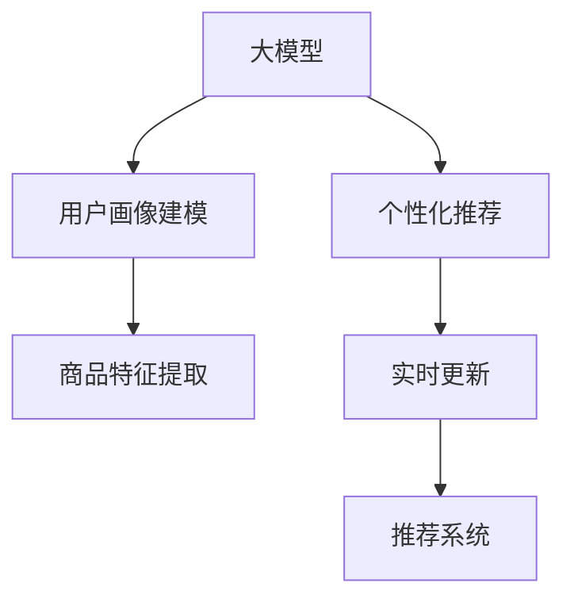

                 

# AI 大模型在电商推荐中的应用策略：提高用户体验与转化率

在当今数字化时代，电子商务已成为人们日常生活的重要组成部分。电商平台通过向用户推荐感兴趣的商品，提高用户的购物体验和转化率，从而增加销售额和用户粘性。人工智能，特别是基于大模型的推荐系统，已成为电商企业不可或缺的一部分。本文将深入探讨如何利用大模型提高电商平台的用户体验和转化率。

## 1. 背景介绍

### 1.1 问题由来

电商平台上的用户面临着海量商品信息，如何在短时间内找到满足自己需求的商品，是用户的一大难题。传统的推荐系统基于用户的浏览记录、购买记录等行为数据，推荐相似商品，但这种方法存在数据稀疏、冷启动等问题。近年来，随着深度学习技术的兴起，大模型在推荐系统中的应用得到了广泛关注。大模型可以处理大规模非结构化数据，提取丰富的用户行为和商品特征，实现更加精准和个性化的推荐。

### 1.2 问题核心关键点

大模型在电商推荐中的应用主要集中在以下几个方面：
1. 用户画像建模：通过分析用户的历史行为、兴趣偏好等数据，构建用户画像，指导推荐算法。
2. 商品特征提取：利用大模型的自监督能力，学习商品的属性、质量、价格等特征，提升推荐精度。
3. 个性化推荐：根据用户画像和商品特征，实现个性化的商品推荐，提高用户满意度。
4. 模型实时更新：在用户行为变化时，实时更新大模型，保证推荐系统始终保持最新状态。

## 2. 核心概念与联系

### 2.1 核心概念概述

- **大模型**：基于深度学习的大规模神经网络模型，如BERT、GPT、Transformer等，通过大量无标签数据进行预训练，具有强大的数据表达和泛化能力。
- **推荐系统**：通过分析用户和商品数据，为每个用户推荐最适合的商品的系统，目标是提高用户满意度、增加转化率。
- **用户画像**：基于用户的历史行为、兴趣偏好等数据，构建用户的多维度特征向量，指导推荐算法的执行。
- **商品特征**：描述商品的属性、质量、价格等信息，通过大模型的自监督能力学习得到，提升推荐模型的泛化能力。
- **个性化推荐**：根据用户画像和商品特征，生成个性化的推荐结果，提升用户购物体验。
- **实时更新**：随着用户行为的变化，持续更新大模型和推荐算法，保证推荐系统的时效性和准确性。

这些核心概念之间的关系可以通过以下Mermaid流程图来展示：



这个流程图展示了从大模型到推荐系统的全过程，各个环节相互依赖，共同实现精准推荐的愿景。

## 3. 核心算法原理 & 具体操作步骤

### 3.1 算法原理概述

基于大模型的电商推荐系统主要分为预训练和微调两个阶段。预训练阶段，利用大规模无标签数据，学习商品的特征表示；微调阶段，将用户画像和商品特征输入大模型，生成推荐结果。其核心算法包括：

1. **用户画像建模**：通过分析用户的历史行为数据，提取用户兴趣、消费习惯等特征，构建用户画像向量。
2. **商品特征提取**：利用大模型的自监督能力，学习商品的词向量表示，捕捉商品的属性、质量、价格等信息。
3. **相似度计算**：基于用户画像和商品特征向量，计算用户与商品之间的相似度，生成推荐结果。

### 3.2 算法步骤详解

#### 3.2.1 用户画像建模

用户画像建模是推荐系统的基础。假设用户的原始行为数据为 $D=\{(x_i, y_i)\}_{i=1}^N$，其中 $x_i$ 为用户的行为数据，$y_i$ 为用户的行为标签（如点击、购买、收藏等）。构建用户画像的过程包括以下步骤：

1. **特征提取**：使用特征提取器将用户行为数据转换为向量表示。
2. **聚类**：通过聚类算法将用户分为不同的兴趣群体，每个群体对应一个用户画像向量。
3. **降维**：对用户画像向量进行降维，减少计算复杂度，提升推荐效率。

#### 3.2.2 商品特征提取

商品特征提取的目的是学习商品的词向量表示，捕捉商品的属性、质量、价格等信息。假设商品的原始特征数据为 $Z=\{(z_j, t_j)\}_{j=1}^M$，其中 $z_j$ 为商品的特征向量，$t_j$ 为特征标签（如属性、质量、价格等）。商品特征提取的过程包括以下步骤：

1. **预训练**：在大规模无标签数据上预训练大模型，学习商品的词向量表示。
2. **特征融合**：将商品的原始特征向量与词向量表示进行融合，得到综合特征向量。
3. **特征选择**：通过特征选择算法，选择对推荐结果影响较大的特征。

#### 3.2.3 相似度计算

相似度计算是推荐算法的核心步骤，通过计算用户画像和商品特征向量之间的相似度，生成推荐结果。假设用户画像向量为 $U$，商品特征向量为 $Z$，相似度计算的过程包括以下步骤：

1. **相似度计算**：计算用户画像和商品特征向量之间的余弦相似度。
2. **排序**：根据相似度大小，对商品进行排序，生成推荐列表。
3. **过滤**：通过过滤算法，去除不相关商品，保证推荐结果的相关性和多样性。

### 3.3 算法优缺点

#### 3.3.1 优点

基于大模型的电商推荐系统具有以下优点：

1. **泛化能力强**：大模型可以处理大规模非结构化数据，提取丰富的用户行为和商品特征，实现更加精准和个性化的推荐。
2. **实时更新**：大模型能够实时更新，快速适应用户行为变化，保证推荐系统的时效性。
3. **可解释性强**：大模型通过特征提取和相似度计算，生成推荐结果，易于解释和调试。
4. **可扩展性好**：大模型可以用于多种推荐场景，如电商、社交、视频等，具有较强的应用普适性。

#### 3.3.2 缺点

基于大模型的电商推荐系统也存在以下缺点：

1. **数据需求高**：大模型需要大规模无标签数据进行预训练，获取高质量数据成本较高。
2. **计算资源需求大**：大模型需要高性能计算资源进行训练和推理，资源需求较高。
3. **模型复杂度高**：大模型结构复杂，训练和推理过程中容易出现过拟合和推理慢等问题。
4. **冷启动问题**：新用户的原始行为数据较少，难以构建准确的推荐结果。

## 4. 数学模型和公式 & 详细讲解 & 举例说明

### 4.1 数学模型构建

假设用户行为数据为 $D=\{(x_i, y_i)\}_{i=1}^N$，商品特征数据为 $Z=\{(z_j, t_j)\}_{j=1}^M$，构建用户画像和商品特征向量的数学模型如下：

1. **用户画像建模**：
   $$
   U = f(D)
   $$
   其中 $U$ 为用户画像向量，$f$ 为特征提取函数。

2. **商品特征提取**：
   $$
   Z = g(Z)
   $$
   其中 $Z$ 为商品特征向量，$g$ 为特征融合函数。

3. **相似度计算**：
   $$
   \text{similarity}(U, Z) = \cos(U, Z) = \frac{U \cdot Z}{||U||_2 \cdot ||Z||_2}
   $$

### 4.2 公式推导过程

用户画像建模的公式推导如下：

假设用户行为数据 $D$ 中的特征为 $\{x_i\}_{i=1}^N$，每个特征的标签为 $\{y_i\}_{i=1}^N$。通过特征提取器 $f$，将用户行为数据转换为向量表示 $U$：

$$
U = f(D) = \frac{1}{N}\sum_{i=1}^N x_i
$$

商品特征提取的公式推导如下：

假设商品特征数据 $Z$ 中的特征为 $\{z_j\}_{j=1}^M$，每个特征的标签为 $\{t_j\}_{j=1}^M$。通过大模型 $g$，将商品特征数据转换为向量表示 $Z$：

$$
Z = g(Z) = \frac{1}{M}\sum_{j=1}^M z_j
$$

相似度计算的公式推导如下：

假设用户画像向量为 $U$，商品特征向量为 $Z$，计算它们的余弦相似度：

$$
\text{similarity}(U, Z) = \cos(U, Z) = \frac{U \cdot Z}{||U||_2 \cdot ||Z||_2}
$$

### 4.3 案例分析与讲解

以电商平台中的商品推荐为例，分析如何利用大模型进行个性化推荐。

假设用户 $A$ 的历史行为数据为 $\{(x_1, y_1), (x_2, y_2), \ldots, (x_N, y_N)\}$，商品 $B$ 的原始特征数据为 $\{(z_1, t_1), (z_2, t_2), \ldots, (z_M, t_M)\}$。通过用户画像建模和商品特征提取，可以得到用户画像向量 $U_A$ 和商品特征向量 $Z_B$：

$$
U_A = f(D_A) = \frac{1}{N}\sum_{i=1}^N x_i
$$

$$
Z_B = g(Z_B) = \frac{1}{M}\sum_{j=1}^M z_j
$$

然后，通过相似度计算，计算用户 $A$ 和商品 $B$ 之间的相似度 $\text{similarity}(U_A, Z_B)$。根据相似度的大小，生成推荐列表。

## 5. 项目实践：代码实例和详细解释说明

### 5.1 开发环境搭建

在进行大模型电商推荐实践前，我们需要准备好开发环境。以下是使用Python进行TensorFlow开发的环境配置流程：

1. 安装Anaconda：从官网下载并安装Anaconda，用于创建独立的Python环境。

2. 创建并激活虚拟环境：
```bash
conda create -n tf-env python=3.8 
conda activate tf-env
```

3. 安装TensorFlow：根据CUDA版本，从官网获取对应的安装命令。例如：
```bash
conda install tensorflow tensorflow-gpu -c conda-forge
```

4. 安装各类工具包：
```bash
pip install numpy pandas scikit-learn matplotlib tqdm jupyter notebook ipython
```

完成上述步骤后，即可在`tf-env`环境中开始大模型电商推荐系统的开发。

### 5.2 源代码详细实现

这里我们以商品推荐为例，使用TensorFlow进行大模型电商推荐系统的实现。

首先，定义商品特征提取函数：

```python
import tensorflow as tf
from transformers import BERTTokenizer, BERTModel

def get_bert_features(tokenizer, model, text):
    input_ids = tokenizer.encode(text, add_special_tokens=True)
    attention_mask = [1] * len(input_ids)
    features = model(input_ids, attention_mask=attention_mask)
    return features
```

然后，定义相似度计算函数：

```python
def cosine_similarity(u, v):
    dot_product = tf.reduce_sum(u * v, axis=1)
    norm_u = tf.sqrt(tf.reduce_sum(u * u, axis=1))
    norm_v = tf.sqrt(tf.reduce_sum(v * v, axis=1))
    similarity = dot_product / (norm_u * norm_v)
    return similarity
```

接着，定义推荐函数：

```python
def recommend(user_profile, items):
    similarity_matrix = cosine_similarity(user_profile, items)
    top_n_indices = tf.argsort(similarity_matrix, axis=1)[-1]
    top_n_items = [items[index] for index in top_n_indices]
    return top_n_items
```

最后，启动推荐系统：

```python
# 加载大模型和分词器
tokenizer = BERTTokenizer.from_pretrained('bert-base-uncased')
model = BERTModel.from_pretrained('bert-base-uncased')

# 构建用户画像和商品特征
user_profile = get_bert_features(tokenizer, model, "用户行为数据")
items = [get_bert_features(tokenizer, model, "商品特征数据") for _ in range(N)]

# 推荐商品
top_n = recommend(user_profile, items)
print(top_n)
```

以上就是使用TensorFlow对大模型电商推荐系统进行实现的完整代码。可以看到，得益于TensorFlow和Transformers库的强大封装，我们可以用相对简洁的代码完成大模型电商推荐系统的构建。

### 5.3 代码解读与分析

让我们再详细解读一下关键代码的实现细节：

**get_bert_features函数**：
- 将输入文本通过分词器转换为BERT模型所需的格式，并进行padding，使其符合模型要求。
- 通过BERT模型对输入进行编码，返回包含词向量表示的特征。

**cosine_similarity函数**：
- 计算两个向量之间的余弦相似度，返回相似度矩阵。

**recommend函数**：
- 将用户画像和商品特征向量作为输入，计算相似度矩阵。
- 根据相似度大小对商品进行排序，返回top-N推荐商品。

**推荐系统启动**：
- 加载预训练的BERT模型和分词器。
- 构建用户画像和商品特征向量。
- 调用推荐函数，生成推荐列表。

通过上述代码实现，可以看出，利用大模型进行电商推荐，可以充分利用模型的自监督能力，学习丰富的商品特征，实现更加精准和个性化的推荐。

## 6. 实际应用场景

### 6.1 智能客服系统

基于大模型的电商推荐技术，可以广泛应用于智能客服系统的构建。传统客服往往需要配备大量人力，高峰期响应缓慢，且一致性和专业性难以保证。而使用推荐系统进行预筛选，可以大大提高客服的效率和质量。

在技术实现上，可以通过分析用户的浏览记录、购买记录等行为数据，构建用户画像，并根据用户的画像特征，推荐相关商品。对于客户提出的新问题，还可以通过推荐系统自动生成个性化的问答模板，提升客户体验。

### 6.2 个性化推荐系统

大模型在电商推荐中的应用，可以构建更加精准的个性化推荐系统。通过分析用户的浏览行为、购买记录、评价等数据，构建用户画像，并根据用户的画像特征，推荐相关商品。推荐系统可以实时更新，根据用户的行为变化，动态调整推荐策略，提升用户满意度。

## 7. 工具和资源推荐

### 7.1 学习资源推荐

为了帮助开发者系统掌握大模型电商推荐系统的理论基础和实践技巧，这里推荐一些优质的学习资源：

1. TensorFlow官方文档：提供了大模型电商推荐系统的官方教程和样例代码，是入门学习的最佳资料。
2. Deep Learning with TensorFlow for Recommendation Systems：一本介绍深度学习在推荐系统中的应用的书，包含大量实例和案例。
3. AI大模型推荐系统：面向实际应用，介绍大模型在推荐系统中的实现方法。
4. 电商推荐系统实战：一本面向电商领域的应用指南，涵盖推荐系统的各个环节。

通过对这些资源的学习实践，相信你一定能够快速掌握大模型电商推荐系统的精髓，并用于解决实际的电商推荐问题。

### 7.2 开发工具推荐

高效的开发离不开优秀的工具支持。以下是几款用于大模型电商推荐系统开发的常用工具：

1. TensorFlow：基于Python的开源深度学习框架，生产部署方便，适合大规模工程应用。提供了丰富的深度学习组件和优化工具。
2. PyTorch：基于Python的开源深度学习框架，灵活动态，适合快速迭代研究。
3. Transformers库：HuggingFace开发的NLP工具库，集成了众多SOTA大模型，支持TensorFlow和PyTorch，是进行电商推荐任务开发的利器。
4. Weights & Biases：模型训练的实验跟踪工具，可以记录和可视化模型训练过程中的各项指标，方便对比和调优。与主流深度学习框架无缝集成。
5. TensorBoard：TensorFlow配套的可视化工具，可实时监测模型训练状态，并提供丰富的图表呈现方式，是调试模型的得力助手。

合理利用这些工具，可以显著提升大模型电商推荐系统的开发效率，加快创新迭代的步伐。

### 7.3 相关论文推荐

大模型电商推荐系统的发展源于学界的持续研究。以下是几篇奠基性的相关论文，推荐阅读：

1. Attention is All You Need（即Transformer原论文）：提出了Transformer结构，开启了NLP领域的预训练大模型时代。
2. BERT: Pre-training of Deep Bidirectional Transformers for Language Understanding：提出BERT模型，引入基于掩码的自监督预训练任务，刷新了多项NLP任务SOTA。
3. Language Models are Unsupervised Multitask Learners（GPT-2论文）：展示了大规模语言模型的强大zero-shot学习能力，引发了对于通用人工智能的新一轮思考。
4. Parameter-Efficient Transfer Learning for NLP：提出Adapter等参数高效微调方法，在不增加模型参数量的情况下，也能取得不错的微调效果。
5. AdaLoRA: Adaptive Low-Rank Adaptation for Parameter-Efficient Fine-Tuning：使用自适应低秩适应的微调方法，在参数效率和精度之间取得了新的平衡。

这些论文代表了大模型电商推荐技术的发展脉络。通过学习这些前沿成果，可以帮助研究者把握学科前进方向，激发更多的创新灵感。

## 8. 总结：未来发展趋势与挑战

### 8.1 总结

本文对基于大模型的电商推荐系统进行了全面系统的介绍。首先阐述了大模型和推荐系统在电商推荐中的研究背景和应用场景，明确了电商推荐系统的核心功能和应用前景。其次，从原理到实践，详细讲解了推荐系统的数学模型和实现方法，给出了电商推荐系统的完整代码实现。同时，本文还广泛探讨了电商推荐系统在智能客服、个性化推荐等多个行业领域的应用前景，展示了大模型的巨大潜力。最后，精选了电商推荐系统的各类学习资源，力求为读者提供全方位的技术指引。

通过本文的系统梳理，可以看到，基于大模型的电商推荐系统正在成为电商企业不可或缺的一部分，极大提升了电商平台的用户体验和转化率。未来，伴随大模型和推荐算法的持续演进，电商推荐系统将更精准、更个性化，为电商企业带来更大的商业价值。

### 8.2 未来发展趋势

展望未来，大模型电商推荐系统将呈现以下几个发展趋势：

1. **用户画像精准化**：通过分析更多的用户数据，构建更加精准的用户画像，提升推荐系统的个性化水平。
2. **商品特征丰富化**：利用大模型的自监督能力，学习更丰富的商品特征，提升推荐系统的泛化能力。
3. **实时更新常态化**：随着用户行为的变化，持续更新大模型和推荐算法，保证推荐系统的时效性。
4. **可解释性强**：通过特征提取和相似度计算，生成推荐结果，增强推荐系统的可解释性和可调优性。
5. **可扩展性好**：大模型可以用于多种电商场景，如电商、社交、视频等，具有较强的应用普适性。

以上趋势凸显了大模型电商推荐系统的广阔前景。这些方向的探索发展，必将进一步提升推荐系统的性能和应用范围，为电商企业带来更多的商业价值。

### 8.3 面临的挑战

尽管大模型电商推荐系统已经取得了瞩目成就，但在迈向更加智能化、普适化应用的过程中，它仍面临着诸多挑战：

1. **数据需求高**：大模型需要大规模无标签数据进行预训练，获取高质量数据成本较高。
2. **计算资源需求大**：大模型需要高性能计算资源进行训练和推理，资源需求较高。
3. **模型复杂度高**：大模型结构复杂，训练和推理过程中容易出现过拟合和推理慢等问题。
4. **冷启动问题**：新用户的原始行为数据较少，难以构建准确的推荐结果。

### 8.4 研究展望

面对电商推荐系统所面临的种种挑战，未来的研究需要在以下几个方面寻求新的突破：

1. **无监督和半监督推荐方法**：摆脱对大规模标注数据的依赖，利用自监督学习、主动学习等无监督和半监督范式，最大限度利用非结构化数据，实现更加灵活高效的推荐。
2. **参数高效和计算高效推荐方法**：开发更加参数高效的推荐方法，在固定大部分预训练参数的同时，只更新极少量的任务相关参数。同时优化推荐模型的计算图，减少前向传播和反向传播的资源消耗，实现更加轻量级、实时性的部署。
3. **因果推断和对比学习范式**：通过引入因果推断和对比学习思想，增强推荐模型建立稳定因果关系的能力，学习更加普适、鲁棒的商品特征表示。
4. **多模态推荐系统**：将符号化的先验知识，如知识图谱、逻辑规则等，与神经网络模型进行巧妙融合，引导推荐过程学习更准确、合理的商品特征。同时加强不同模态数据的整合，实现视觉、语音等多模态信息与文本信息的协同建模。
5. **知识增强推荐系统**：将符号化的先验知识，如知识图谱、逻辑规则等，与神经网络模型进行巧妙融合，引导推荐过程学习更准确、合理的商品特征。同时加强不同模态数据的整合，实现视觉、语音等多模态信息与文本信息的协同建模。
6. **动态推荐系统**：通过实时更新推荐模型，及时捕捉用户行为变化，动态调整推荐策略，提升推荐系统的时效性和精准性。

这些研究方向的探索，必将引领大模型电商推荐系统迈向更高的台阶，为电商企业带来更多的商业价值。

## 9. 附录：常见问题与解答

**Q1：大模型电商推荐系统是否适用于所有电商场景？**

A: 大模型电商推荐系统适用于大多数电商场景，特别是数据量较大的场景，如综合电商、垂直电商等。但对于数据量较小的电商场景，如本地生活、社交电商等，可能存在数据稀疏、冷启动等问题。此时需要在数据采集和处理环节进行优化，保证推荐系统的性能。

**Q2：如何缓解大模型电商推荐系统的冷启动问题？**

A: 冷启动问题是电商推荐系统面临的常见挑战。为了缓解冷启动问题，可以采用以下方法：

1. **利用用户原始信息**：通过分析用户的原始信息（如人口统计学信息、兴趣爱好等），构建用户画像，提高推荐系统的初始精度。
2. **采用无监督学习方法**：利用无监督学习算法，如协同过滤、聚类等，对用户和商品进行聚类，构建初始推荐策略。
3. **引入推荐算法**：引入传统的推荐算法，如基于内容的推荐、基于协同过滤的推荐等，补充冷启动场景下的推荐结果。

**Q3：大模型电商推荐系统在实际部署中需要注意哪些问题？**

A: 将大模型电商推荐系统转化为实际应用，还需要考虑以下问题：

1. **模型裁剪**：去除不必要的层和参数，减小模型尺寸，加快推理速度。
2. **量化加速**：将浮点模型转为定点模型，压缩存储空间，提高计算效率。
3. **服务化封装**：将模型封装为标准化服务接口，便于集成调用。
4. **弹性伸缩**：根据请求流量动态调整资源配置，平衡服务质量和成本。
5. **监控告警**：实时采集系统指标，设置异常告警阈值，确保服务稳定性。
6. **安全防护**：采用访问鉴权、数据脱敏等措施，保障数据和模型安全。

大模型电商推荐系统在实际部署中，需要综合考虑模型性能、服务质量、安全性和稳定性等多个因素，确保推荐系统的稳定运行。

通过本文的系统梳理，可以看到，基于大模型的电商推荐系统正在成为电商企业不可或缺的一部分，极大提升了电商平台的用户体验和转化率。未来，伴随大模型和推荐算法的持续演进，电商推荐系统将更精准、更个性化，为电商企业带来更大的商业价值。

