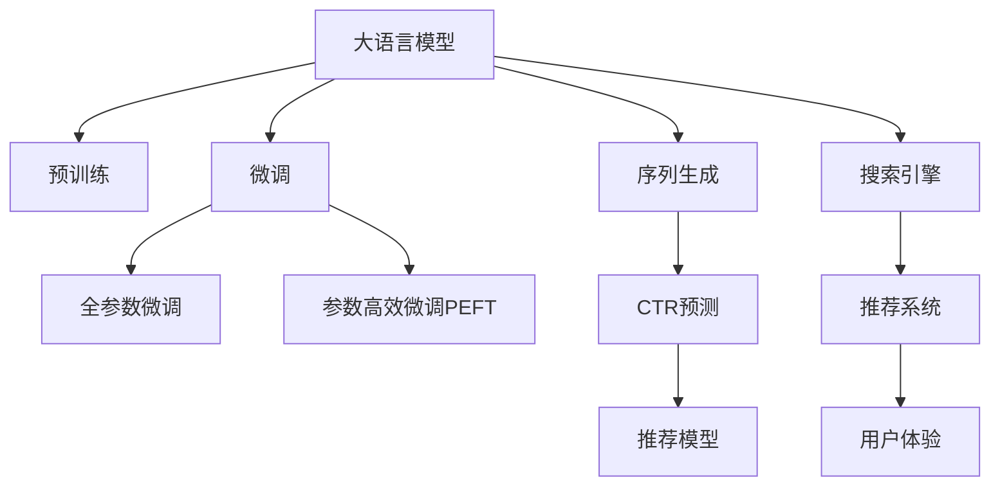

                 

# AI 大模型在电商搜索推荐中的数据处理能力要求：应对大规模复杂数据

## 1. 背景介绍

### 1.1 问题由来

随着电子商务的迅猛发展，电商平台成为了消费者购物的重要渠道。搜索引擎推荐系统作为电商平台的核心功能，通过理解和推荐用户需求，极大地提升了用户购物体验，并带来了显著的商业价值。然而，搜索引擎推荐系统不仅要面对海量用户查询，还要处理海量的商品信息，如何在数据量如此巨大的情况下，高效且准确地推荐商品给用户，成为了各大电商平台的共同难题。

### 1.2 问题核心关键点

本节将聚焦于大语言模型在电商平台搜索推荐中的应用，探讨其在数据处理方面的能力要求和实现方法。大语言模型作为新一代人工智能的核心技术，通过在海量数据上进行预训练，具备强大的语义理解和生成能力，能够有效应对复杂查询和商品描述，实现智能推荐。

## 2. 核心概念与联系

### 2.1 核心概念概述

为更好地理解大语言模型在电商平台搜索推荐中的应用，本节将介绍几个密切相关的核心概念：

- **大语言模型(Large Language Model, LLM)**：以Transformer为基础的预训练语言模型，如BERT、GPT等。通过在大规模无标签文本语料上进行预训练，学习通用的语言表示，具备强大的语言理解和生成能力。

- **预训练(Pre-training)**：指在大规模无标签文本语料上，通过自监督学习任务训练通用语言模型的过程。常见的预训练任务包括掩码语言模型、序列预测等。预训练使得模型学习到语言的通用表示。

- **微调(Fine-tuning)**：指在预训练模型的基础上，使用下游任务的少量标注数据，通过有监督学习优化模型在该任务上的性能。通常只需要调整顶层分类器或解码器，并以较小的学习率更新全部或部分的模型参数。

- **搜索引擎推荐系统(Recommendation System)**：通过分析用户行为、历史查询和商品属性，自动推荐符合用户兴趣的商品，提升用户购物体验。搜索引擎推荐系统通常基于用户的查询历史和商品特征进行推荐。

- **点击率预测(CTR Prediction)**：通过预测用户对商品点击的概率，评估推荐效果。CTR预测在搜索引擎推荐系统中扮演重要角色。

- **序列生成(Sequence Generation)**：通过生成连续的预测序列，解决搜索场景中的问答、对话等任务。大语言模型在序列生成任务中表现优异。

这些核心概念之间的逻辑关系可以通过以下Mermaid流程图来展示：



这个流程图展示了大语言模型的核心概念及其之间的关系：

1. 大语言模型通过预训练获得基础能力。
2. 微调是对预训练模型进行任务特定的优化，可以分为全参数微调和参数高效微调（PEFT）。
3. 序列生成和大语言模型密不可分，能够通过大模型的预训练获得强大的语言处理能力。
4. 点击率预测是评估推荐效果的关键指标，涉及到模型的推理能力。
5. 搜索引擎推荐系统将大语言模型和CTR预测模型相结合，实现精准推荐。
6. 用户体验是大语言模型在电商搜索推荐中的最终目标，系统需要不断优化提升用户体验。

## 3. 核心算法原理 & 具体操作步骤

### 3.1 算法原理概述

在电商平台搜索推荐系统中，大语言模型通过以下步骤处理复杂查询和商品描述，实现智能推荐：

1. **预训练**：在大型语料库上预训练模型，学习语言的基本规则和语义表达能力。
2. **微调**：在针对特定任务的标注数据集上进行微调，使得模型能够理解商品描述和用户查询，并生成推荐列表。
3. **点击率预测**：使用微调后的模型对推荐列表进行点击率预测，优化推荐顺序。
4. **序列生成**：生成自然流畅的推荐理由，提升推荐的说服力和用户满意度。

### 3.2 算法步骤详解

以下是大语言模型在电商平台搜索推荐系统中的操作步骤：

**Step 1: 数据预处理**

- **数据收集**：收集电商平台的查询记录和商品信息，包括用户历史查询、商品描述、属性等。
- **数据清洗**：去除重复、无效数据，处理缺失值和异常值，保证数据质量。
- **数据标注**：为查询记录和商品描述添加标签，如查询意图、商品类别、相关商品等。
- **数据划分**：将数据集划分为训练集、验证集和测试集。

**Step 2: 预训练模型加载**

- **模型选择**：选择适合的预训练语言模型，如BERT、GPT等。
- **模型加载**：使用库如Hugging Face的Transformers，加载预训练模型。
- **参数冻结**：冻结预训练模型的部分或全部参数，仅微调顶层。

**Step 3: 微调模型训练**

- **任务适配**：根据任务需求，设计任务适配层，如分类器、生成器等。
- **损失函数**：选择适合的损失函数，如交叉熵损失、均方误差损失等。
- **优化器**：选择适合的优化器，如Adam、SGD等，并设置学习率、批大小等超参数。
- **训练循环**：在训练集上迭代训练，并定期在验证集上评估模型性能。
- **微调保存**：保存训练过程中的模型参数，以便后续使用。

**Step 4: 点击率预测和推荐排序**

- **点击率预测**：使用微调后的模型对推荐列表进行点击率预测，评估推荐效果。
- **推荐排序**：根据预测的点击率对推荐商品进行排序，提高推荐的精准度。

**Step 5: 序列生成和推荐理由**

- **序列生成**：生成自然流畅的推荐理由，提升推荐的说服力和用户满意度。
- **推荐展示**：将推荐结果和生成理由展示给用户，完成推荐流程。

### 3.3 算法优缺点

大语言模型在电商平台搜索推荐系统中的优点包括：

1. **高效性**：通过预训练和微调，大语言模型可以快速适应新任务，提高推荐效率。
2. **泛化能力**：大语言模型具备强大的语义理解和生成能力，能够处理复杂的查询和商品描述，提升推荐效果。
3. **鲁棒性**：通过微调，大语言模型可以适应不同的数据分布，具有较好的鲁棒性。

同时，该方法也存在一些局限性：

1. **数据依赖性**：微调的效果很大程度上依赖于标注数据的质量和数量，标注数据的获取和处理成本较高。
2. **训练成本高**：预训练和微调需要大规模的计算资源和时间，训练成本较高。
3. **模型复杂度**：大语言模型参数量大，需要处理大规模数据，模型复杂度较高。

尽管存在这些局限性，但大语言模型在电商平台搜索推荐系统中的应用前景广阔，通过合理设计微调过程，可以克服这些不足，实现高效精准的推荐。

### 3.4 算法应用领域

大语言模型在电商平台搜索推荐系统中的应用领域广泛，包括但不限于以下几种：

- **商品搜索**：通过自然语言处理，理解用户查询，匹配符合条件的商品。
- **个性化推荐**：根据用户历史行为和偏好，生成个性化推荐列表。
- **热门商品推荐**：通过分析用户查询和浏览历史，推荐热门商品。
- **新商品推荐**：结合用户行为和商品属性，推荐新上架商品。
- **促销活动推荐**：通过分析促销活动和用户行为，推荐相关商品。

## 4. 数学模型和公式 & 详细讲解 & 举例说明

### 4.1 数学模型构建

在电商平台搜索推荐系统中，大语言模型主要用于理解和生成自然语言文本。因此，数学模型构建的核心在于文本表示和语义理解。

假设查询文本为 $x$，商品描述为 $y$，点击率为 $z$。在微调过程中，大语言模型需要学习如何根据查询文本和商品描述，预测点击率 $z$。

**模型结构**：
- 输入层：将查询文本 $x$ 和商品描述 $y$ 转化为模型可接受的向量形式。
- 编码器：使用预训练语言模型的编码器，提取文本的语义表示。
- 分类器：根据提取的语义表示，预测点击率 $z$。

### 4.2 公式推导过程

以下是对上述数学模型进行推导的过程：

1. **输入表示**：
   - 查询文本 $x$ 经过嵌入层 $E(x)$，得到向量 $e_x \in \mathbb{R}^d$。
   - 商品描述 $y$ 经过嵌入层 $E(y)$，得到向量 $e_y \in \mathbb{R}^d$。

2. **编码器表示**：
   - 将查询文本嵌入 $e_x$ 和商品描述嵌入 $e_y$ 作为模型输入。
   - 通过预训练语言模型的编码器 $C$，将输入转化为语义表示 $c_x, c_y \in \mathbb{R}^{d'}$。

3. **分类器预测**：
   - 将查询和商品的语义表示 $c_x, c_y$ 输入分类器 $M$，得到点击率 $z$ 的预测值 $z' = M(c_x, c_y)$。
   - 使用损失函数 $L(z', z)$ 衡量预测值和实际值之间的差异。

4. **优化目标**：
   - 最小化损失函数 $L(z', z)$，得到最优的分类器参数 $M^*$。

### 4.3 案例分析与讲解

以查询文本为“iPhone X手机怎么样”为例，进行详细分析：

1. **输入表示**：将查询文本“iPhone X手机怎么样”输入嵌入层 $E$，得到向量 $e_x \in \mathbb{R}^d$。
2. **编码器表示**：将 $e_x$ 和商品描述嵌入 $e_y$ 输入编码器 $C$，得到语义表示 $c_x, c_y \in \mathbb{R}^{d'}$。
3. **分类器预测**：将 $c_x, c_y$ 输入分类器 $M$，得到点击率 $z'$。
4. **损失函数**：将 $z'$ 与实际点击率 $z$ 进行对比，计算损失 $L(z', z)$。
5. **优化目标**：不断调整 $M$ 的参数，最小化 $L(z', z)$，直到收敛。

## 5. 项目实践：代码实例和详细解释说明

### 5.1 开发环境搭建

在进行大语言模型在电商平台搜索推荐系统的微调实践前，我们需要准备好开发环境。以下是使用Python进行PyTorch开发的环境配置流程：

1. 安装Anaconda：从官网下载并安装Anaconda，用于创建独立的Python环境。

2. 创建并激活虚拟环境：
```bash
conda create -n pytorch-env python=3.8 
conda activate pytorch-env
```

3. 安装PyTorch：根据CUDA版本，从官网获取对应的安装命令。例如：
```bash
conda install pytorch torchvision torchaudio cudatoolkit=11.1 -c pytorch -c conda-forge
```

4. 安装Transformers库：
```bash
pip install transformers
```

5. 安装各类工具包：
```bash
pip install numpy pandas scikit-learn matplotlib tqdm jupyter notebook ipython
```

完成上述步骤后，即可在`pytorch-env`环境中开始微调实践。

### 5.2 源代码详细实现

这里我们以BERT模型为例，给出在电商平台搜索推荐系统中进行微调的PyTorch代码实现。

```python
from transformers import BertForSequenceClassification, BertTokenizer, AdamW
import torch
import torch.nn as nn
import torch.optim as optim

# 加载预训练模型和分词器
tokenizer = BertTokenizer.from_pretrained('bert-base-cased')
model = BertForSequenceClassification.from_pretrained('bert-base-cased', num_labels=2)

# 定义训练函数
def train_epoch(model, dataset, batch_size, optimizer):
    model.train()
    loss = 0
    for batch in dataset:
        inputs, labels = batch
        inputs = tokenizer(inputs, padding='max_length', max_length=128, truncation=True)
        inputs = nn.utils.rnn.pad_sequence(inputs)
        labels = torch.tensor(labels)
        optimizer.zero_grad()
        outputs = model(inputs)
        loss += nn.CrossEntropyLoss()(outputs, labels)
        loss.backward()
        optimizer.step()
    return loss / len(dataset)

# 定义测试函数
def evaluate(model, dataset, batch_size):
    model.eval()
    loss = 0
    total_correct = 0
    for batch in dataset:
        inputs, labels = batch
        inputs = tokenizer(inputs, padding='max_length', max_length=128, truncation=True)
        inputs = nn.utils.rnn.pad_sequence(inputs)
        labels = torch.tensor(labels)
        with torch.no_grad():
            outputs = model(inputs)
        loss += nn.CrossEntropyLoss()(outputs, labels)
        predictions = outputs.argmax(dim=1)
        total_correct += (predictions == labels).sum().item()
    return loss / len(dataset), total_correct / len(dataset)

# 加载数据集
train_dataset = ...
dev_dataset = ...
test_dataset = ...

# 训练模型
optimizer = AdamW(model.parameters(), lr=2e-5)
epochs = 5
batch_size = 16
for epoch in range(epochs):
    train_loss = train_epoch(model, train_dataset, batch_size, optimizer)
    dev_loss, dev_acc = evaluate(model, dev_dataset, batch_size)
    print(f'Epoch {epoch+1}, train loss: {train_loss:.3f}, dev loss: {dev_loss:.3f}, dev acc: {dev_acc:.3f}')

# 测试模型
test_loss, test_acc = evaluate(model, test_dataset, batch_size)
print(f'Test loss: {test_loss:.3f}, test acc: {test_acc:.3f}')
```

### 5.3 代码解读与分析

让我们再详细解读一下关键代码的实现细节：

**训练函数**：
- `train_epoch`函数：对每个epoch进行训练，使用AdamW优化器进行模型参数的更新。
- 在训练过程中，对输入文本进行分词和padding，使用`nn.utils.rnn.pad_sequence`函数将分词后的序列进行padding。
- 计算损失函数，使用`nn.CrossEntropyLoss`计算预测结果与真实标签之间的交叉熵损失。

**测试函数**：
- `evaluate`函数：对测试集进行评估，输出模型在测试集上的损失和准确率。
- 在测试过程中，对输入文本进行分词和padding，使用`nn.utils.rnn.pad_sequence`函数将分词后的序列进行padding。
- 使用`nn.CrossEntropyLoss`计算预测结果与真实标签之间的交叉熵损失。

**数据加载**：
- 使用`transformers`库提供的`Dataset`类，将数据集划分为训练集、验证集和测试集。
- 对每个样本，进行分词和padding操作，使用`tokenizer`分词器进行分词。

**训练流程**：
- 定义超参数，如学习率、批大小、epoch数等。
- 在训练集上进行模型训练，输出每个epoch的训练损失和验证损失。
- 在测试集上进行模型测试，输出模型在测试集上的损失和准确率。

## 6. 实际应用场景

### 6.1 智能客服系统

在电商平台搜索推荐系统中，智能客服系统可以通过微调大语言模型实现。智能客服系统通过处理用户查询，自动回答问题，提供个性化的购物建议，提升用户购物体验。

具体而言，可以收集用户的历史查询记录，将问题作为输入文本，将答案作为标注数据，在此基础上对预训练大语言模型进行微调。微调后的模型能够理解用户的查询意图，生成符合用户期望的回复。同时，模型还能通过自然语言处理技术，进行情感分析，判断用户情绪状态，提供更贴心的服务。

### 6.2 个性化推荐系统

个性化推荐系统是电商平台的核心功能之一。通过微调大语言模型，推荐系统可以更加精准地推荐商品给用户。

具体而言，可以收集用户的历史浏览记录和点击行为，将商品描述作为输入文本，将用户是否点击作为标注数据，在此基础上对预训练大语言模型进行微调。微调后的模型能够理解商品描述，预测用户对商品的兴趣，生成个性化的推荐列表。

## 7. 工具和资源推荐

### 7.1 学习资源推荐

为了帮助开发者系统掌握大语言模型在电商平台搜索推荐中的应用，这里推荐一些优质的学习资源：

1. 《Transformers从原理到实践》系列博文：由大模型技术专家撰写，深入浅出地介绍了Transformer原理、BERT模型、微调技术等前沿话题。

2. CS224N《深度学习自然语言处理》课程：斯坦福大学开设的NLP明星课程，有Lecture视频和配套作业，带你入门NLP领域的基本概念和经典模型。

3. 《Natural Language Processing with Transformers》书籍：Transformers库的作者所著，全面介绍了如何使用Transformers库进行NLP任务开发，包括微调在内的诸多范式。

4. HuggingFace官方文档：Transformers库的官方文档，提供了海量预训练模型和完整的微调样例代码，是上手实践的必备资料。

5. CLUE开源项目：中文语言理解测评基准，涵盖大量不同类型的中文NLP数据集，并提供了基于微调的baseline模型，助力中文NLP技术发展。

通过对这些资源的学习实践，相信你一定能够快速掌握大语言模型在电商平台搜索推荐系统中的应用，并用于解决实际的NLP问题。

### 7.2 开发工具推荐

高效的开发离不开优秀的工具支持。以下是几款用于大语言模型在电商平台搜索推荐系统中的开发工具：

1. PyTorch：基于Python的开源深度学习框架，灵活动态的计算图，适合快速迭代研究。大部分预训练语言模型都有PyTorch版本的实现。

2. TensorFlow：由Google主导开发的开源深度学习框架，生产部署方便，适合大规模工程应用。同样有丰富的预训练语言模型资源。

3. Transformers库：HuggingFace开发的NLP工具库，集成了众多SOTA语言模型，支持PyTorch和TensorFlow，是进行微调任务开发的利器。

4. Weights & Biases：模型训练的实验跟踪工具，可以记录和可视化模型训练过程中的各项指标，方便对比和调优。与主流深度学习框架无缝集成。

5. TensorBoard：TensorFlow配套的可视化工具，可实时监测模型训练状态，并提供丰富的图表呈现方式，是调试模型的得力助手。

6. Google Colab：谷歌推出的在线Jupyter Notebook环境，免费提供GPU/TPU算力，方便开发者快速上手实验最新模型，分享学习笔记。

合理利用这些工具，可以显著提升大语言模型在电商平台搜索推荐系统中的开发效率，加快创新迭代的步伐。

### 7.3 相关论文推荐

大语言模型在电商平台搜索推荐系统中的应用源于学界的持续研究。以下是几篇奠基性的相关论文，推荐阅读：

1. Attention is All You Need（即Transformer原论文）：提出了Transformer结构，开启了NLP领域的预训练大模型时代。

2. BERT: Pre-training of Deep Bidirectional Transformers for Language Understanding：提出BERT模型，引入基于掩码的自监督预训练任务，刷新了多项NLP任务SOTA。

3. Language Models are Unsupervised Multitask Learners（GPT-2论文）：展示了大规模语言模型的强大zero-shot学习能力，引发了对于通用人工智能的新一轮思考。

4. Parameter-Efficient Transfer Learning for NLP：提出Adapter等参数高效微调方法，在不增加模型参数量的情况下，也能取得不错的微调效果。

5. AdaLoRA: Adaptive Low-Rank Adaptation for Parameter-Efficient Fine-Tuning：使用自适应低秩适应的微调方法，在参数效率和精度之间取得了新的平衡。

这些论文代表了大语言模型在电商平台搜索推荐系统中的应用趋势和发展方向。通过学习这些前沿成果，可以帮助研究者把握学科前进方向，激发更多的创新灵感。

## 8. 总结：未来发展趋势与挑战

### 8.1 总结

本文对大语言模型在电商平台搜索推荐系统中的应用进行了全面系统的介绍。首先阐述了大语言模型和微调技术的研究背景和意义，明确了微调在拓展预训练模型应用、提升下游任务性能方面的独特价值。其次，从原理到实践，详细讲解了微调过程中模型的加载、训练、预测等步骤，给出了完整的代码实例。同时，本文还探讨了微调方法在智能客服、个性化推荐等多个领域的应用前景，展示了微调范式的巨大潜力。

通过本文的系统梳理，可以看到，大语言模型在电商平台搜索推荐系统中具有广泛的应用前景，通过合理设计微调过程，可以克服训练成本高、数据依赖性强等不足，实现高效精准的推荐。未来，随着大语言模型的进一步发展，其在电商平台搜索推荐系统中的应用将更加深入和广泛。

### 8.2 未来发展趋势

展望未来，大语言模型在电商平台搜索推荐系统中的发展趋势包括：

1. **多模态融合**：未来的推荐系统将不仅仅基于文本信息，还将融合图像、视频、语音等多模态数据，提升推荐的全面性和准确性。

2. **实时推荐**：通过流式学习技术，实时更新推荐模型，提升推荐的时效性和个性化水平。

3. **跨领域迁移**：大语言模型将具备更强的跨领域迁移能力，能够将一个领域的知识迁移到另一个领域，实现更广泛的推荐应用。

4. **模型压缩与优化**：随着计算资源的日益丰富，大语言模型将在规模上进一步扩展，如何高效压缩和优化模型，提升推理速度和资源利用率，将是大规模模型应用的关键。

5. **隐私保护与安全**：随着对隐私保护和数据安全的重视，推荐系统将引入差分隐私、联邦学习等技术，保护用户隐私。

6. **伦理与公平性**：推荐系统需要关注模型的公平性，避免推荐偏差，保护用户权益。

以上趋势凸显了大语言模型在电商平台搜索推荐系统中的广阔前景。这些方向的探索发展，必将进一步提升推荐系统的性能和应用范围，为电商平台的智能化转型提供新的动力。

### 8.3 面临的挑战

尽管大语言模型在电商平台搜索推荐系统中的应用前景广阔，但在迈向更加智能化、普适化应用的过程中，它仍面临着诸多挑战：

1. **数据隐私与安全**：在处理用户数据时，需要严格遵守数据隐私和安全法规，保护用户隐私。
2. **模型鲁棒性**：在面对噪声、异常数据时，模型需要具备较强的鲁棒性，避免产生误导性推荐。
3. **计算资源消耗**：大规模语言模型在训练和推理过程中需要消耗大量的计算资源，如何优化资源利用，提高系统效率，将是一个重要课题。
4. **推荐多样性**：在推荐过程中，需要避免同质化现象，增加推荐结果的多样性，提升用户体验。
5. **算法透明性与可解释性**：推荐系统需要具备透明性和可解释性，让用户能够理解推荐结果的生成过程，增强用户信任。

### 8.4 研究展望

面对大语言模型在电商平台搜索推荐系统中面临的挑战，未来的研究需要在以下几个方面寻求新的突破：

1. **隐私保护技术**：引入差分隐私、联邦学习等技术，保护用户数据隐私，提升模型安全性和公平性。
2. **模型鲁棒性提升**：开发更鲁棒的模型架构，引入鲁棒性训练、对抗样本生成等技术，提高模型的抗干扰能力。
3. **高效计算与模型压缩**：通过模型压缩、知识蒸馏等技术，提升模型的推理速度和资源利用率。
4. **推荐多样性增强**：通过多样性引导策略、模型集成等技术，增加推荐结果的多样性，提升用户满意度。
5. **算法透明性与可解释性**：引入可解释性算法，如LIME、SHAP等，提升算法的透明性和可解释性，增强用户信任。

这些研究方向将是大语言模型在电商平台搜索推荐系统中的重要发展方向，需要学术界和工业界的共同努力，不断推动技术的进步和应用的落地。

## 9. 附录：常见问题与解答

**Q1：大语言模型在电商平台搜索推荐系统中的应用是否存在伦理问题？**

A: 是的，大语言模型在电商平台搜索推荐系统中存在一定的伦理问题。首先，由于模型在训练过程中会学习到用户的历史行为和偏好，可能存在隐私泄露的风险。其次，模型可能会对某些群体产生偏见，导致不公平的推荐结果。因此，在应用大语言模型时，需要严格遵守数据隐私和安全法规，保护用户隐私，同时引入公平性评估和测试，确保模型的公平性。

**Q2：大语言模型在电商平台搜索推荐系统中的训练成本是否很高？**

A: 是的，大语言模型在电商平台搜索推荐系统中的训练成本较高。大规模语言模型的参数量通常在亿级，需要消耗大量的计算资源和时间。此外，微调过程也需要大量的标注数据，增加了数据获取和标注的成本。为了降低训练成本，可以采用迁移学习、知识蒸馏等技术，减少模型的参数量，提升训练效率。同时，可以引入GPU/TPU等高性能设备，加速模型训练和推理。

**Q3：大语言模型在电商平台搜索推荐系统中的推荐效果是否可靠？**

A: 大语言模型在电商平台搜索推荐系统中的推荐效果是可靠的，但需要在多个环节进行优化。首先，需要选择合适的预训练模型，并根据任务特点设计合适的任务适配层和损失函数。其次，需要合理选择超参数，如学习率、批大小、优化器等，并使用数据增强、正则化等技术，提高模型的鲁棒性和泛化能力。最后，需要不断测试和调优模型，确保推荐结果的准确性和可靠性。

**Q4：大语言模型在电商平台搜索推荐系统中的推荐结果是否多样？**

A: 大语言模型在电商平台搜索推荐系统中的推荐结果可以多样，但需要引入多样性引导策略，如模型集成、多模态融合等技术。通过增加推荐结果的多样性，可以提高用户满意度，减少同质化现象。同时，需要通过用户反馈和行为数据，不断优化推荐算法，提高推荐的个性化水平。

**Q5：大语言模型在电商平台搜索推荐系统中的推荐过程是否透明？**

A: 大语言模型在电商平台搜索推荐系统中的推荐过程可以透明，但需要引入可解释性算法，如LIME、SHAP等，提高算法的透明性和可解释性。通过可解释性分析，用户可以理解推荐结果的生成过程，增强用户信任。同时，需要在推荐系统中引入用户反馈机制，及时调整推荐策略，提高用户体验。

---

作者：禅与计算机程序设计艺术 / Zen and the Art of Computer Programming

