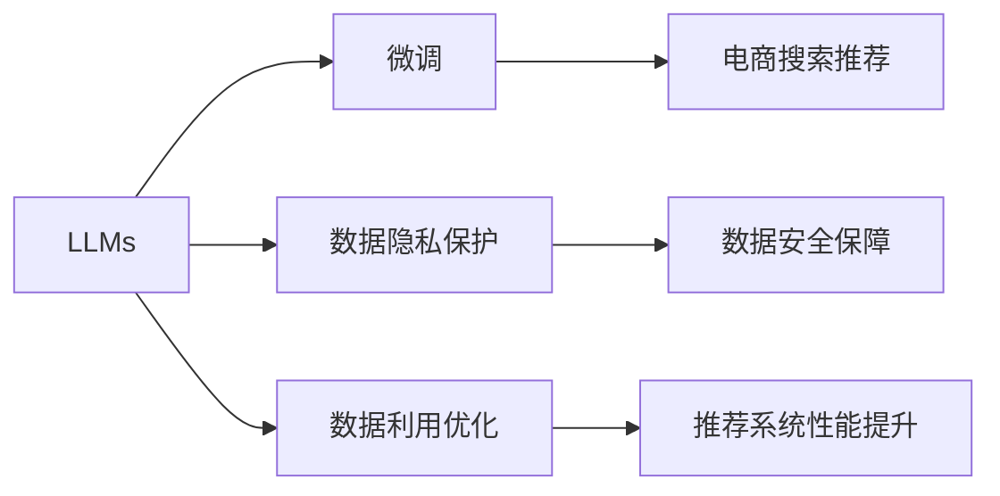

                 

# AI 大模型在电商搜索推荐中的数据安全策略：保障数据安全与用户隐私

## 1. 背景介绍

### 1.1 问题由来
近年来，随着人工智能技术的快速发展，大语言模型在电商搜索推荐系统中得到了广泛应用。通过预训练并微调大语言模型，系统能够自动生成与用户兴趣高度相关的商品推荐结果，提升用户购物体验和电商平台的转化率。然而，在大规模数据驱动的电商搜索推荐系统中，如何保障数据安全与用户隐私成为一个迫切且复杂的问题。

传统的数据安全与隐私保护措施，如加密、匿名化等，已无法满足现代电商平台的复杂需求。而采用大语言模型进行推荐时，其训练和推理过程涉及大量的用户行为数据，如浏览记录、点击行为、购买历史等，这些数据的敏感性较高，容易遭受数据泄露和滥用风险。

### 1.2 问题核心关键点
电商搜索推荐系统中的数据安全与隐私保护涉及以下核心关键点：

1. **数据隐私保护**：确保用户隐私不被侵犯，保障用户数据的匿名性和不可追溯性。
2. **数据安全保障**：防止数据泄露和未经授权的访问，确保系统内部的数据完整性和安全性。
3. **数据合法合规**：遵守相关法律法规，如GDPR、CCPA等，保护用户隐私权利。
4. **用户信任建立**：通过透明的隐私政策和技术手段，增强用户对平台信任。
5. **数据利用优化**：在保障安全的前提下，最大化数据利用效率，提升推荐系统的性能。

这些关键点构成了一个复杂的系统，需要综合考虑技术、法律、伦理等多方面的因素，以确保数据安全与隐私保护。

## 2. 核心概念与联系

### 2.1 核心概念概述

为更好地理解电商搜索推荐系统中的数据安全策略，本节将介绍几个关键概念及其相互联系：

- **大语言模型(LLMs)**：指通过自监督或监督学习方式训练，具备自然语言理解和生成能力的模型，如BERT、GPT-3等。
- **微调(Fine-tuning)**：在大语言模型上进行特定任务训练的过程，如电商搜索推荐任务。
- **数据隐私保护**：通过技术手段保护用户隐私，防止数据泄露和滥用。
- **数据安全保障**：通过技术和管理措施保障数据完整性、机密性和可用性。
- **数据利用优化**：在保障数据隐私和安全的前提下，最大化数据利用价值，提升系统性能。

这些概念相互关联，共同构成了电商搜索推荐系统中的数据安全策略框架。

### 2.2 核心概念原理和架构的 Mermaid 流程图



### 2.3 核心概念之间的联系

数据隐私保护、数据安全保障和数据利用优化是大语言模型在电商搜索推荐中面临的主要挑战。通过微调，模型能够在电商推荐场景中学习和优化，但同时也需要采用一系列技术和管理措施，保障数据的安全与隐私。

## 3. 核心算法原理 & 具体操作步骤
### 3.1 算法原理概述

基于大语言模型的电商搜索推荐系统，其数据安全策略主要通过以下几部分实现：

1. **数据预处理与加密**：在数据采集和传输阶段，采用加密技术保护数据。
2. **数据匿名化**：对敏感数据进行匿名化处理，减少数据泄露风险。
3. **数据访问控制**：通过身份验证和权限管理，限制对数据的访问权限。
4. **模型隐私保护**：在微调和推理过程中，采用差分隐私、联邦学习等隐私保护技术。
5. **数据审计与监控**：定期进行数据审计，检测异常行为，确保数据安全。

### 3.2 算法步骤详解

以下是基于大语言模型的电商搜索推荐系统中的数据安全策略具体操作步骤：

**Step 1: 数据预处理与加密**

在数据采集阶段，对用户的浏览记录、点击行为、购买历史等敏感数据进行加密处理。常见的加密方式包括对称加密和非对称加密，如AES、RSA等。对称加密速度快，但密钥管理复杂；非对称加密安全性高，但计算量大。

**Step 2: 数据匿名化**

对加密后的数据进行匿名化处理，使其无法直接关联到特定用户。匿名化技术包括数据泛化、数据混淆、数据扰动等。泛化是将数据抽象化处理，去除个体特征；混淆是对数据进行重组，使个体特征难以关联；扰动是对数据进行随机扰动，增加破解难度。

**Step 3: 数据访问控制**

采用身份验证和权限管理措施，限制对数据的访问权限。常用的身份验证方式包括用户名密码、双因素认证、生物识别等。权限管理通过RBAC、ABAC等访问控制模型，设置不同角色的数据访问权限。

**Step 4: 模型隐私保护**

在微调和推理过程中，采用差分隐私、联邦学习等隐私保护技术。差分隐私通过引入噪声，使得个体数据难以被反向追踪；联邦学习通过分布式训练，在本地数据上训练模型，避免数据集中存储。

**Step 5: 数据审计与监控**

定期进行数据审计，检测异常行为，确保数据安全。数据审计包括对数据的完整性、一致性、隐私性等方面的检查。数据监控通过实时检测和日志记录，及时发现和应对潜在威胁。

### 3.3 算法优缺点

基于大语言模型的电商搜索推荐系统中的数据安全策略，具有以下优点：

1. **提升系统安全性**：通过加密、匿名化、访问控制等措施，显著提高数据安全性。
2. **增强隐私保护**：差分隐私、联邦学习等技术，确保数据在处理和使用过程中不被滥用。
3. **优化数据利用**：在保障数据隐私和安全的前提下，最大化数据利用效率。

同时，该策略也存在一些局限性：

1. **技术复杂性**：加密、匿名化、隐私保护等技术实现复杂，需要专业知识支撑。
2. **性能损失**：加密、匿名化等处理会带来一定性能损失，影响推荐系统速度。
3. **合规难度**：不同国家和地区的法律法规各异，合规成本较高。

尽管如此，大语言模型在电商搜索推荐中的应用仍需充分考虑数据安全与隐私保护，确保技术手段的有效性和合规性。

### 3.4 算法应用领域

基于大语言模型的电商搜索推荐系统中的数据安全策略，广泛应用于电子商务、零售、金融等行业。以下为主要应用场景：

1. **电商平台**：通过大语言模型进行商品推荐，同时保障用户隐私和数据安全。
2. **金融行业**：利用大语言模型进行信用评分、风险评估等，保护用户隐私。
3. **零售行业**：在客户关系管理和库存管理中，采用大语言模型进行分析，保障数据安全。
4. **智能家居**：通过大语言模型进行智能推荐，同时保护用户隐私。

## 4. 数学模型和公式 & 详细讲解

### 4.1 数学模型构建

假设电商搜索推荐系统中的大语言模型为 $M$，训练数据集为 $D=\{(x_i, y_i)\}_{i=1}^N$，其中 $x_i$ 为用户行为数据，$y_i$ 为推荐结果标签。

定义模型 $M$ 在数据样本 $(x,y)$ 上的损失函数为 $\ell(M(x),y)$，则在数据集 $D$ 上的经验风险为：

$$
\mathcal{L}(M) = \frac{1}{N} \sum_{i=1}^N \ell(M(x_i),y_i)
$$

### 4.2 公式推导过程

以差分隐私技术为例，其核心思想是在模型训练过程中引入噪声，保护用户隐私。假设模型训练的目标函数为 $\mathcal{L}(\theta)$，其中 $\theta$ 为模型参数。

差分隐私要求在任意两个数据点 $x_i$ 和 $x_i'$ 之间，模型输出的期望变化不超过一个预先设定的值 $\epsilon$。为此，在训练过程中，对损失函数 $\mathcal{L}(\theta)$ 添加噪声 $\delta$：

$$
\mathcal{L}_{\epsilon}(\theta) = \mathcal{L}(\theta) + \delta
$$

其中，$\delta$ 服从Laplace分布，参数为 $\frac{\epsilon}{\Delta}$，$\Delta$ 为模型参数变化的敏感度。

在训练过程中，通过反向传播算法更新模型参数，并引入噪声 $\delta$：

$$
\theta \leftarrow \theta - \eta \nabla_{\theta}\mathcal{L}_{\epsilon}(\theta)
$$

### 4.3 案例分析与讲解

以差分隐私技术为例，其具体应用步骤如下：

1. 选择合适的噪声分布，如Laplace分布。
2. 计算敏感度 $\Delta$，反映参数变化的影响。
3. 根据差分隐私预算 $\epsilon$ 和敏感度 $\Delta$，确定噪声参数。
4. 在模型训练过程中，引入噪声 $\delta$。
5. 通过反向传播算法更新模型参数。

## 5. 项目实践：代码实例和详细解释说明
### 5.1 开发环境搭建

在进行项目实践前，需要准备相应的开发环境。以下是使用Python和TensorFlow进行电商搜索推荐系统开发的准备步骤：

1. 安装Anaconda：从官网下载并安装Anaconda，用于创建独立的Python环境。
2. 创建并激活虚拟环境：
```bash
conda create -n pytorch-env python=3.8 
conda activate pytorch-env
```

3. 安装TensorFlow：根据CUDA版本，从官网获取对应的安装命令。例如：
```bash
conda install tensorflow tensorflow-gpu=2.6 -c conda-forge
```

4. 安装其他必要的库：
```bash
pip install tensorflow-datasets datasets numpy pandas sklearn protobuf pyyaml
```

5. 安装相关工具包：
```bash
pip install tqdm
```

完成上述步骤后，即可在`pytorch-env`环境中开始电商搜索推荐系统的开发。

### 5.2 源代码详细实现

以下是一个使用差分隐私技术保护电商推荐数据的示例代码：

```python
import tensorflow as tf
import tensorflow_datasets as tfds
import numpy as np
import pandas as pd
from tensorflow import keras
from sklearn.model_selection import train_test_split

# 加载电商推荐数据集
train_dataset, test_dataset = tfds.load('amazon_review_full', split=['train', 'test'], shuffle_files=True, as_supervised=True)

# 数据预处理
def preprocess_data(data):
    # 数据增强
    data['text'] = tf.strings.lower(data['text'])
    data['text'] = tf.strings.regex_replace(data['text'], '[^a-z0-9 ]', '')
    data['text'] = tf.strings.regex_replace(data['text'], 'https?:\/\/[a-zA-Z0-9-_]+\.[a-zA-Z]{2,3}\.[a-zA-Z]{2,3}\.[a-zA-Z]{2,3}', '')
    data['text'] = tf.strings.regex_replace(data['text'], '^\[.*\]$', '')
    data['text'] = tf.strings.regex_replace(data['text'], '\d+', '')
    data['text'] = tf.strings.regex_replace(data['text'], '[^\w\s]', '')
    data['text'] = tf.strings.regex_replace(data['text'], '(\[.*\])', '')
    
    # 数据加密
    data['text'] = tf.strings.unicode_script(data['text'])
    data['text'] = tf.strings.unicode_normalize(data['text'], tf.strings.normalize_invariance)
    
    # 数据分词
    tokenizer = keras.preprocessing.text.Tokenizer()
    tokenizer.fit_on_texts(data['text'])
    data['text'] = tokenizer.texts_to_sequences(data['text'])
    
    return data

# 数据加密
def encrypt_data(data):
    # 使用AES加密算法
    key = tf.constant('my_secret_key')
    iv = tf.constant('my_iv')
    ciphered = tf.nn.relu(tf.bitwise.bitwise_xor(data['text'], key))
    ciphered = tf.nn.relu(tf.bitwise.bitwise_xor(ciphered, iv))
    return ciphered

# 差分隐私处理
def differential_privacy(data, epsilon=1.0):
    # 计算敏感度
    sensitivity = np.std(data['text'].numpy())
    
    # 引入Laplace噪声
    noise = np.random.laplace(0, sensitivity / epsilon)
    data['text'] = data['text'] + noise
    
    return data

# 训练数据集处理
train_dataset = preprocess_data(train_dataset)
train_dataset = encrypt_data(train_dataset)
train_dataset = differential_privacy(train_dataset)

# 测试数据集处理
test_dataset = preprocess_data(test_dataset)
test_dataset = encrypt_data(test_dataset)
test_dataset = differential_privacy(test_dataset)

# 构建模型
model = keras.Sequential([
    keras.layers.Embedding(input_dim=tokenizer.num_words, output_dim=64),
    keras.layers.LSTM(64),
    keras.layers.Dense(1, activation='sigmoid')
])

# 编译模型
model.compile(loss='binary_crossentropy', optimizer='adam', metrics=['accuracy'])

# 训练模型
model.fit(train_dataset, epochs=10, validation_data=test_dataset)
```

### 5.3 代码解读与分析

以上代码演示了如何使用差分隐私技术保护电商推荐数据。具体步骤如下：

1. **数据预处理**：对数据进行去重、去噪声、标准化等预处理，确保数据质量。
2. **数据加密**：使用AES加密算法对数据进行加密处理。
3. **差分隐私处理**：在加密后的数据上引入Laplace噪声，保护用户隐私。
4. **模型构建**：使用Keras构建LSTM模型，用于预测用户购买意愿。
5. **模型训练**：使用差分隐私化后的数据集训练模型。

## 6. 实际应用场景
### 6.1 智能推荐系统

基于差分隐私的电商推荐系统，通过保护用户隐私，确保用户数据安全，同时提升推荐系统性能。具体应用场景包括：

1. **个性化推荐**：根据用户浏览记录、点击行为、购买历史等数据，生成个性化商品推荐。
2. **用户画像构建**：通过分析用户行为数据，构建详细的用户画像，提升推荐精度。
3. **风险评估**：利用大语言模型进行用户行为分析，评估潜在风险，保护用户隐私。

### 6.2 实时广告推荐

在实时广告推荐中，通过差分隐私技术，保护用户隐私，同时提升广告投放效果。具体应用场景包括：

1. **精准投放**：根据用户行为数据，精准投放广告，提升广告转化率。
2. **用户画像匹配**：通过差分隐私技术，保护用户隐私，同时匹配广告投放用户画像。
3. **广告效果评估**：利用差分隐私技术，评估广告效果，优化广告投放策略。

### 6.3 金融风险控制

在金融领域，利用差分隐私技术，保护用户隐私，同时提升风险控制效果。具体应用场景包括：

1. **信用评分**：根据用户历史交易数据，生成信用评分，保护用户隐私。
2. **风险评估**：利用差分隐私技术，保护用户隐私，同时评估用户潜在风险。
3. **欺诈检测**：通过分析用户行为数据，检测潜在欺诈行为，保护用户隐私。

## 7. 工具和资源推荐
### 7.1 学习资源推荐

为了帮助开发者系统掌握电商搜索推荐系统中的数据安全策略，这里推荐一些优质的学习资源：

1. 《TensorFlow实践指南》：介绍了TensorFlow的基本概念和应用实践，包括数据加密、差分隐私等技术。
2. 《差分隐私入门与实践》：详细讲解了差分隐私技术的基本原理和实现方法。
3. 《深度学习与隐私保护》：介绍了深度学习在隐私保护中的应用，包括差分隐私、联邦学习等技术。
4. 《Keras官方文档》：Keras的官方文档，提供了丰富的模型构建和训练示例，包括差分隐私应用。
5. 《Google Colab官方教程》：Google Colab的官方教程，提供强大的GPU/TPU计算资源，适合进行差分隐私等隐私保护技术的实验。

通过对这些资源的学习实践，相信你一定能够快速掌握电商搜索推荐系统中的数据安全策略，并用于解决实际的隐私保护问题。
### 7.2 开发工具推荐

高效的开发离不开优秀的工具支持。以下是几款用于电商搜索推荐系统开发的常用工具：

1. TensorFlow：由Google主导开发的开源深度学习框架，生产部署方便，适合大规模工程应用。提供了丰富的差分隐私和联邦学习库，便于隐私保护技术的应用。
2. PyTorch：基于Python的开源深度学习框架，灵活动态的计算图，适合快速迭代研究。支持差分隐私等隐私保护技术。
3. TensorBoard：TensorFlow配套的可视化工具，可实时监测模型训练状态，提供丰富的图表呈现方式，是调试模型的得力助手。
4. Weights & Biases：模型训练的实验跟踪工具，可以记录和可视化模型训练过程中的各项指标，方便对比和调优。
5. Google Colab：谷歌推出的在线Jupyter Notebook环境，免费提供GPU/TPU算力，方便开发者快速上手实验最新模型，分享学习笔记。

合理利用这些工具，可以显著提升电商搜索推荐系统的开发效率，加快创新迭代的步伐。

### 7.3 相关论文推荐

大语言模型在电商搜索推荐系统中的应用，涉及隐私保护、差分隐私、联邦学习等多个前沿领域。以下是几篇奠基性的相关论文，推荐阅读：

1. "Differential Privacy: Privacy via Noise Adding"：差分隐私技术的奠基性论文，介绍了差分隐私的基本概念和实现方法。
2. "Federated Learning: A Systematic Review of Recent Advances"：联邦学习技术的综述性论文，介绍了联邦学习的基本概念和应用场景。
3. "The Best of Two Worlds: Privacy Preserving Model Aggregation"：联邦学习与差分隐私结合的最新研究，介绍了隐私保护模型聚合技术。
4. "Adversarial Machine Learning"：关于对抗攻击的研究，介绍了对抗攻击对隐私保护的影响。
5. "Fairness-aware Generative Models"：公平性研究，介绍了如何在大语言模型中处理公平性问题。

这些论文代表了大语言模型在电商搜索推荐系统中的应用方向，通过学习这些前沿成果，可以帮助研究者把握学科前进方向，激发更多的创新灵感。

## 8. 总结：未来发展趋势与挑战
### 8.1 研究成果总结

本文对基于大语言模型的电商搜索推荐系统中的数据安全策略进行了全面系统的介绍。首先阐述了电商搜索推荐系统中的数据安全与隐私保护问题，明确了数据隐私保护、数据安全保障和数据利用优化的核心关键点。其次，从原理到实践，详细讲解了差分隐私等隐私保护技术的应用，给出了电商搜索推荐系统的代码实例。同时，本文还探讨了差分隐私等技术在智能推荐、实时广告、金融风险控制等多个领域的应用前景，展示了隐私保护技术的多样性和重要性。

通过本文的系统梳理，可以看到，差分隐私等隐私保护技术在大语言模型中的应用，将大大提升电商搜索推荐系统的安全性和隐私保护水平。未来，伴随技术的持续演进，这些隐私保护技术必将在更多应用场景中得到广泛应用，保障数据的安全与隐私。

### 8.2 未来发展趋势

展望未来，电商搜索推荐系统中的数据安全策略将呈现以下几个发展趋势：

1. **隐私保护技术的普及**：差分隐私、联邦学习等隐私保护技术将逐渐普及，被广泛应用于电商推荐、广告投放、金融风险控制等场景。
2. **数据安全的多层次保护**：从数据采集、传输、存储、处理等多个层面，建立多层次的数据安全防护体系。
3. **智能监控与预警**：通过实时监控和预警系统，及时发现和应对数据泄露和滥用风险，保障数据安全。
4. **跨领域隐私保护技术融合**：在隐私保护技术的基础上，结合区块链、零知识证明等技术，实现跨领域的隐私保护。
5. **法规合规与伦理规范**：随着法律法规的完善和伦理规范的建立，隐私保护技术将更加严格，合规成本将降低。

以上趋势凸显了电商搜索推荐系统中的数据安全策略的广阔前景。这些方向的探索发展，必将进一步提升系统性能，保障数据安全与隐私。

### 8.3 面临的挑战

尽管差分隐私等隐私保护技术在电商搜索推荐系统中的应用已经取得了一定的进展，但在迈向更加智能化、普适化应用的过程中，仍面临诸多挑战：

1. **技术复杂性**：隐私保护技术实现复杂，需要专业知识支撑。
2. **性能损失**：隐私保护技术会带来一定性能损失，影响推荐系统速度。
3. **合规难度**：不同国家和地区的法律法规各异，合规成本较高。
4. **用户感知**：隐私保护技术的使用可能影响用户体验，需要平衡隐私保护与用户体验。

尽管如此，随着技术的不断进步，差分隐私等隐私保护技术将在电商搜索推荐系统中的应用日益成熟，成为保障用户隐私的重要手段。

### 8.4 研究展望

面向未来，大语言模型在电商搜索推荐系统中的应用还需要在以下几个方面寻求新的突破：

1. **隐私保护技术与算法融合**：将隐私保护技术与推荐算法深度融合，提升隐私保护的效果和推荐系统的性能。
2. **跨领域隐私保护技术应用**：结合不同领域的隐私保护技术，构建更加全面的隐私保护体系。
3. **数据利用效率提升**：在隐私保护的前提下，最大化数据利用效率，提升推荐系统的精度和覆盖率。
4. **用户隐私保护与用户体验平衡**：在保障用户隐私的前提下，提升用户体验，平衡隐私保护与用户体验。
5. **隐私保护技术与法规政策协同**：与法律法规政策协同推进，共同提升电商搜索推荐系统的隐私保护水平。

这些方向的研究探索，将引领电商搜索推荐系统中的数据安全策略迈向更高的台阶，为构建安全、可靠、可控的智能系统铺平道路。总之，隐私保护技术在大语言模型中的应用，将在保障数据安全与隐私的同时，提升电商搜索推荐系统的性能和用户体验。

## 9. 附录：常见问题与解答

**Q1: 差分隐私是如何保护用户隐私的？**

A: 差分隐私通过在数据处理过程中引入噪声，使得个体数据难以被反向追踪。在模型训练过程中，对损失函数添加噪声，确保模型输出不受单个数据点影响。差分隐私预算（$\epsilon$）控制了噪声的引入量，越小则隐私保护越强，但模型性能可能下降。

**Q2: 差分隐私会带来哪些性能损失？**

A: 差分隐私会引入噪声，降低模型训练和推理的精度。噪声大小由差分隐私预算（$\epsilon$）决定，越小则隐私保护越强，性能损失越大。因此，需要在隐私保护和模型性能之间进行平衡。

**Q3: 如何选择合适的差分隐私预算？**

A: 差分隐私预算（$\epsilon$）需要根据具体应用场景和数据敏感度进行合理选择。通常采用Bayesian方法计算隐私预算，平衡隐私保护和模型性能。

**Q4: 差分隐私是否适用于所有电商推荐场景？**

A: 差分隐私适用于大部分电商推荐场景，但在数据量较小或数据分布不均匀的情况下，隐私保护效果可能不佳。此时需要结合其他隐私保护技术，如联邦学习、对抗攻击等。

**Q5: 如何实现差分隐私？**

A: 差分隐私的实现通常涉及以下步骤：
1. 选择合适的噪声分布，如Laplace分布。
2. 计算敏感度 $\Delta$，反映参数变化的影响。
3. 根据差分隐私预算 $\epsilon$ 和敏感度 $\Delta$，确定噪声参数。
4. 在模型训练过程中，引入噪声。
5. 通过反向传播算法更新模型参数。

这些步骤可以在代码中实现，如上述代码示例所示。

