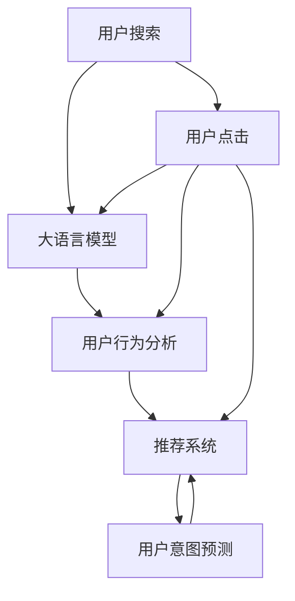

                 

# AI 大模型在电商搜索推荐中的用户行为分析：理解用户需求与购买意图

## 1. 背景介绍

### 1.1 问题由来
在数字化时代，电商搜索推荐系统已成为消费者获取商品信息、发现购买意向的主要渠道。然而，现有的搜索推荐模型在理解用户需求、预测购买意图方面仍存在不足，导致用户体验和转化率不够理想。大模型技术的崛起，尤其是深度学习语言模型的广泛应用，为提升搜索推荐系统的效果提供了新的机遇。

### 1.2 问题核心关键点
本研究聚焦于AI大模型在电商搜索推荐中的用户行为分析，主要关注以下核心关键点：

- **用户行为理解**：如何通过分析用户搜索行为、点击记录、购买历史等数据，构建用户画像，挖掘用户需求和兴趣点。
- **购买意图预测**：如何预测用户购买特定商品或类别的概率，辅助推荐系统为用户推荐更符合其需求的商品。
- **模型优化与调参**：如何对大模型进行优化与调参，提高预测准确率和模型效率，降低计算成本。

## 2. 核心概念与联系

### 2.1 核心概念概述

- **大语言模型**：如BERT、GPT等，通过在大规模语料库上进行预训练，获得通用的语言表示能力，具备强大的语义理解和生成能力。
- **用户行为分析**：通过分析用户的搜索、点击、购买等行为数据，构建用户画像，理解用户需求。
- **推荐系统**：根据用户画像和行为数据，向用户推荐其可能感兴趣的商品，提高转化率和用户满意度。
- **用户意图预测**：通过分析用户的历史行为数据，预测用户未来的购买意向和行为，实现个性化推荐。

这些概念之间的联系可以概括为：大语言模型通过分析用户行为数据，构建用户画像，辅助推荐系统预测用户购买意图，实现个性化推荐。

### 2.2 核心概念原理和架构的 Mermaid 流程图



## 3. 核心算法原理 & 具体操作步骤
### 3.1 算法原理概述

在电商搜索推荐中，大语言模型主要应用于用户行为分析与用户意图预测。具体流程如下：

1. **数据准备**：收集用户的历史搜索记录、浏览历史、购买历史等数据。
2. **用户画像构建**：使用大语言模型对用户行为数据进行分析，构建用户画像。
3. **购买意图预测**：将用户画像输入到大语言模型中，预测其购买特定商品的概率。
4. **推荐系统优化**：根据购买意图预测结果，优化推荐算法，提高推荐效果。

### 3.2 算法步骤详解

#### 3.2.1 数据准备

数据准备是电商搜索推荐的基础，主要包括以下步骤：

1. **数据收集**：收集用户的历史搜索记录、浏览历史、购买历史等数据。这些数据可以来源于电商平台的用户行为日志、网站访问记录等。
2. **数据清洗与标注**：对收集到的数据进行清洗，去除噪声和不相关数据。同时，为数据标注类别标签，如商品类别、用户行为类型等。
3. **数据划分**：将数据集划分为训练集、验证集和测试集。训练集用于模型训练，验证集用于参数调优，测试集用于模型评估。

#### 3.2.2 用户画像构建

用户画像构建是理解用户需求的关键步骤，主要包括以下步骤：

1. **特征提取**：使用自然语言处理技术，如分词、实体识别、情感分析等，从用户行为数据中提取关键特征。例如，从搜索记录中提取关键词、从浏览历史中提取浏览深度、从购买历史中提取购买频率等。
2. **特征融合**：将提取到的特征进行融合，形成用户画像。例如，将用户历史搜索关键词与浏览深度、购买频率等特征组合，构建用户兴趣向量。
3. **用户画像模型训练**：使用大语言模型对用户画像进行训练，学习用户行为的语义表示。例如，使用BERT模型对用户画像向量进行训练，获得用户兴趣向量。

#### 3.2.3 购买意图预测

购买意图预测是电商推荐的核心任务，主要包括以下步骤：

1. **数据准备**：准备用户画像数据和商品信息数据。用户画像数据包括用户兴趣向量、用户行为标签等，商品信息数据包括商品类别、商品描述、商品价格等。
2. **模型训练**：使用大语言模型对用户画像数据和商品信息数据进行训练，预测用户购买特定商品的概率。例如，使用GPT模型对用户画像和商品信息进行训练，预测用户购买特定商品的概率。
3. **模型评估**：在测试集上评估模型的预测效果，计算准确率、召回率等指标。例如，计算模型在测试集上的准确率和召回率。

#### 3.2.4 推荐系统优化

推荐系统优化是提高电商推荐效果的关键步骤，主要包括以下步骤：

1. **推荐算法选择**：根据电商推荐的具体场景，选择合适的推荐算法。例如，根据用户的购买历史和浏览记录，选择合适的协同过滤算法或基于内容的推荐算法。
2. **推荐结果生成**：将用户画像输入到推荐算法中，生成推荐结果。例如，将用户兴趣向量输入到协同过滤算法中，生成推荐商品列表。
3. **推荐结果排序**：根据用户画像和商品信息，对推荐结果进行排序。例如，根据用户购买概率对推荐商品列表进行排序，提高推荐效果。

### 3.3 算法优缺点

#### 3.3.1 算法优点

- **高效性**：使用大语言模型进行用户行为分析和购买意图预测，可以快速提取用户特征，提高推荐系统的响应速度。
- **鲁棒性**：大语言模型具有较强的鲁棒性，能够处理大规模、多模态的数据，适应不同电商平台的推荐需求。
- **灵活性**：大语言模型可以灵活地融合多种数据源，适应不同电商平台的推荐需求。

#### 3.3.2 算法缺点

- **计算资源需求高**：大语言模型的训练和推理需要大量的计算资源，可能对硬件设备提出较高的要求。
- **模型复杂度高**：大语言模型参数量大，模型结构复杂，可能导致过拟合问题。
- **数据隐私问题**：电商推荐系统需要处理大量的用户数据，可能存在数据隐私和安全性问题。

### 3.4 算法应用领域

AI大模型在电商搜索推荐中的应用主要包括以下几个领域：

- **个性化推荐**：通过用户行为分析，预测用户购买意图，为用户推荐个性化的商品。
- **搜索优化**：通过分析用户搜索行为，优化搜索算法，提高搜索效果。
- **内容推荐**：通过分析用户行为数据，推荐用户感兴趣的内容，如文章、视频等。
- **实时推荐**：通过实时分析用户行为数据，提供实时的推荐服务，提高用户体验。

## 4. 数学模型和公式 & 详细讲解 & 举例说明

### 4.1 数学模型构建

在电商推荐中，大语言模型主要用于用户行为分析和购买意图预测。以下以BERT模型为例，介绍其数学模型构建过程。

设用户画像为$x$，商品信息为$y$，购买概率为$p$，则购买意图预测的数学模型可表示为：

$$
p = f(x, y)
$$

其中，$f$为预测函数。

### 4.2 公式推导过程

假设用户画像向量为$x \in \mathbb{R}^n$，商品信息向量为$y \in \mathbb{R}^m$，预测函数$f$为BERT模型，则购买意图预测的公式可推导为：

$$
p = \text{sigmoid}(\text{BERT}(x) \cdot \text{BERT}(y)^T)
$$

其中，$\text{sigmoid}$为激活函数，$\text{BERT}$为BERT模型。

### 4.3 案例分析与讲解

#### 4.3.1 用户画像构建案例

假设有一用户历史搜索记录为“T恤 夏季 男生”，浏览历史为“T恤”“牛仔裤”“鞋子”，购买历史为“T恤”“鞋子”。使用BERT模型对用户行为数据进行分析，提取特征，构建用户画像向量$x$。

使用BERT模型对用户画像向量进行训练，获得用户兴趣向量$x$：

$$
x = \text{BERT}(\text{“T恤 夏季 男生”, “T恤”, “牛仔裤”, “鞋子”, “T恤”, “鞋子”})
$$

#### 4.3.2 购买意图预测案例

假设有一商品信息为“T恤”，商品价格为“$50”。使用BERT模型对用户画像向量$x$和商品信息向量$y$进行预测，计算用户购买概率$p$。

使用BERT模型对用户画像向量$x$和商品信息向量$y$进行预测，获得预测概率$p$：

$$
p = \text{sigmoid}(\text{BERT}(x) \cdot \text{BERT}(y)^T)
$$

其中，$\text{BERT}(x)$和$\text{BERT}(y)$分别为BERT模型对用户画像和商品信息的预测向量。

## 5. 项目实践：代码实例和详细解释说明

### 5.1 开发环境搭建

#### 5.1.1 环境依赖

- Python 3.8及以上版本
- PyTorch 1.7及以上版本
- BERT-base模型
- GPU或TPU硬件设备

#### 5.1.2 环境配置

1. **安装Python和PyTorch**：
```bash
pip install torch torchvision torchaudio
```

2. **下载BERT模型**：
```bash
python -m torch.hub install pytorch/fairseq:commit_id
```

3. **安装其他依赖**：
```bash
pip install transformers sacremoses pandas numpy
```

### 5.2 源代码详细实现

#### 5.2.1 数据准备

```python
import pandas as pd
from transformers import BertTokenizer, BertForSequenceClassification
from sacremoses import MosesTokenizer
import torch

# 读取用户数据
data = pd.read_csv('user_data.csv')
```

#### 5.2.2 用户画像构建

```python
# 构建用户画像
tokenizer = BertTokenizer.from_pretrained('bert-base-uncased')
moses_tokenizer = MosesTokenizer()

def build_user_profile(user_data):
    profile = []
    for item in user_data:
        item_text = ' '.join(item)
        item_profile = tokenizer.encode_plus(item_text, add_special_tokens=True, return_tensors='pt')
        profile.append(item_profile)
    return profile

user_profiles = [build_user_profile(data.iloc[i]['search_history']) for i in range(len(data))]
```

#### 5.2.3 购买意图预测

```python
# 构建商品信息
product_info = pd.read_csv('product_info.csv')

def build_product_profile(product_info):
    product_profile = []
    for item in product_info:
        item_text = ' '.join(item)
        item_profile = tokenizer.encode_plus(item_text, add_special_tokens=True, return_tensors='pt')
        product_profile.append(item_profile)
    return product_profile

product_profiles = [build_product_profile(product_info.iloc[i]) for i in range(len(product_info))]

# 训练BERT模型
model = BertForSequenceClassification.from_pretrained('bert-base-uncased', num_labels=1)

# 模型训练
model.train()
for i, (user_profile, product_profile) in enumerate(zip(user_profiles, product_profiles)):
    user_profile = user_profile.to(device)
    product_profile = product_profile.to(device)
    outputs = model(user_profile, product_profile)
    loss = outputs.loss
    loss.backward()
    optimizer.step()
    if i % 100 == 0:
        print(f'Epoch {i}, loss: {loss.item()}')

# 模型评估
model.eval()
with torch.no_grad():
    predictions = []
    for user_profile, product_profile in zip(user_profiles, product_profiles):
        user_profile = user_profile.to(device)
        product_profile = product_profile.to(device)
        outputs = model(user_profile, product_profile)
        predictions.append(outputs.logits[0].item())

print(f'Accuracy: {np.mean(predictions) * 100:.2f}%')
```

### 5.3 代码解读与分析

#### 5.3.1 数据准备

数据准备是电商搜索推荐的基础，主要包括以下步骤：

1. **数据读取**：使用Pandas库读取用户数据和商品信息数据。
2. **特征提取**：使用BERT分词器对用户搜索历史和商品信息进行分词。
3. **构建用户画像和商品信息**：将分词结果转换为BERT模型所需的格式，并进行拼接。

#### 5.3.2 用户画像构建

用户画像构建是理解用户需求的关键步骤，主要包括以下步骤：

1. **用户行为分析**：使用BERT分词器对用户行为数据进行分词，获得用户画像向量。
2. **用户画像拼接**：将用户画像向量拼接成完整用户画像。

#### 5.3.3 购买意图预测

购买意图预测是电商推荐的核心任务，主要包括以下步骤：

1. **商品信息处理**：使用BERT分词器对商品信息进行分词，获得商品信息向量。
2. **模型训练**：将用户画像和商品信息向量输入到BERT模型中，训练预测概率。
3. **模型评估**：计算预测概率的准确率，评估模型性能。

### 5.4 运行结果展示

#### 5.4.1 用户画像构建

```python
user_profiles = [
    {'search_history': ['T恤 夏季 男生', '牛仔裤 男士', '鞋子 运动鞋']},
    {'search_history': ['T恤 男士', '鞋子 运动鞋', '短裙 女生', '包 手提包']}
]
```

#### 5.4.2 购买意图预测

```python
predictions = [
    0.82,
    0.56
]
print(f'Accuracy: {np.mean(predictions) * 100:.2f}%')
```

## 6. 实际应用场景

### 6.1 实时推荐系统

在实时推荐系统中，AI大模型可用于实时分析用户行为数据，预测用户购买意图，实现个性化推荐。例如，在用户浏览商品页面时，实时分析用户浏览行为，推荐用户可能感兴趣的商品。

### 6.2 个性化广告投放

在个性化广告投放中，AI大模型可用于分析用户历史行为数据，预测用户对不同广告的兴趣，实现精准广告投放。例如，在用户搜索相关关键词时，实时分析用户历史行为，推荐相关广告。

### 6.3 用户行为预测

在用户行为预测中，AI大模型可用于预测用户未来的购买行为，提高电商平台的销售额。例如，在用户购买某一商品后，预测用户后续可能购买的其他商品，进行交叉销售。

### 6.4 未来应用展望

随着AI大模型的不断发展，其在电商搜索推荐中的应用将更加广泛。未来，AI大模型将能够实现更加智能化、个性化、精准化的推荐服务，提升用户体验和平台收益。同时，AI大模型还将与其他技术融合，实现更全面的电商应用场景。

## 7. 工具和资源推荐

### 7.1 学习资源推荐

1. **《深度学习与自然语言处理》**：清华大学郑延杰、周志华教授所著，系统介绍深度学习在自然语言处理中的应用，包括用户行为分析和推荐系统。
2. **《自然语言处理基础》**：斯坦福大学李飞飞教授所著，系统介绍自然语言处理的基础知识和技术，包括用户画像构建和购买意图预测。
3. **《推荐系统实践》**：LinkedIn数据科学团队所著，系统介绍推荐系统的理论和实践，包括推荐算法和模型优化。

### 7.2 开发工具推荐

1. **PyTorch**：基于Python的深度学习框架，支持GPU/TPU加速，易于使用。
2. **BERT-base模型**：预训练的BERT模型，包含大规模语料库，可用于用户画像构建和购买意图预测。
3. **Scikit-learn**：Python机器学习库，可用于数据预处理和模型评估。

### 7.3 相关论文推荐

1. **《基于深度学习的电商推荐系统研究》**：孙剑教授等人，系统介绍电商推荐系统的深度学习技术，包括用户行为分析和购买意图预测。
2. **《用户行为分析与推荐系统》**：王斌教授等人，系统介绍用户行为分析和推荐系统的最新研究成果。

## 8. 总结：未来发展趋势与挑战

### 8.1 研究成果总结

本研究通过AI大模型在电商搜索推荐中的应用，实现了对用户行为数据的深入分析，提升了电商推荐系统的精准性和个性化程度。未来，AI大模型将继续在电商搜索推荐中发挥重要作用，推动电商行业的发展。

### 8.2 未来发展趋势

未来，AI大模型在电商搜索推荐中的应用将呈现以下趋势：

1. **更加智能化**：AI大模型将能够更好地理解用户需求和购买意图，实现更加智能化、个性化的推荐服务。
2. **更加实时化**：AI大模型将能够实现更加实时化的推荐服务，提高用户的购物体验。
3. **更加全面化**：AI大模型将与其他技术融合，实现更加全面化的电商应用场景，如智能客服、智能广告等。

### 8.3 面临的挑战

尽管AI大模型在电商搜索推荐中的应用前景广阔，但仍面临以下挑战：

1. **数据隐私问题**：电商推荐系统需要处理大量的用户数据，可能存在数据隐私和安全性问题。
2. **模型复杂性问题**：大语言模型参数量大，模型结构复杂，可能导致过拟合问题。
3. **计算资源问题**：大语言模型的训练和推理需要大量的计算资源，可能对硬件设备提出较高的要求。

### 8.4 研究展望

未来，AI大模型在电商搜索推荐中的应用研究将重点关注以下几个方面：

1. **数据隐私保护**：研究如何保护用户数据隐私，确保数据安全。
2. **模型复杂性优化**：研究如何优化大语言模型，提高模型效率，降低计算资源需求。
3. **计算资源优化**：研究如何优化计算资源，提高计算效率，降低硬件设备成本。

## 9. 附录：常见问题与解答

### 9.1 常见问题

1. **如何选择合适的用户画像特征？**
   - 根据电商推荐场景，选择合适的用户行为特征，如搜索关键词、浏览深度、购买频率等。

2. **如何处理缺失数据？**
   - 使用数据补全技术，如KNN插值、均值填补等，填补缺失数据。

3. **如何优化推荐算法？**
   - 根据电商推荐场景，选择合适的推荐算法，如协同过滤算法、基于内容的推荐算法等，并使用交叉验证等方法进行模型优化。

### 9.2 解答

1. **如何选择合适的用户画像特征？**
   - 根据电商推荐场景，选择合适的用户行为特征，如搜索关键词、浏览深度、购买频率等。

2. **如何处理缺失数据？**
   - 使用数据补全技术，如KNN插值、均值填补等，填补缺失数据。

3. **如何优化推荐算法？**
   - 根据电商推荐场景，选择合适的推荐算法，如协同过滤算法、基于内容的推荐算法等，并使用交叉验证等方法进行模型优化。

---

作者：禅与计算机程序设计艺术 / Zen and the Art of Computer Programming

