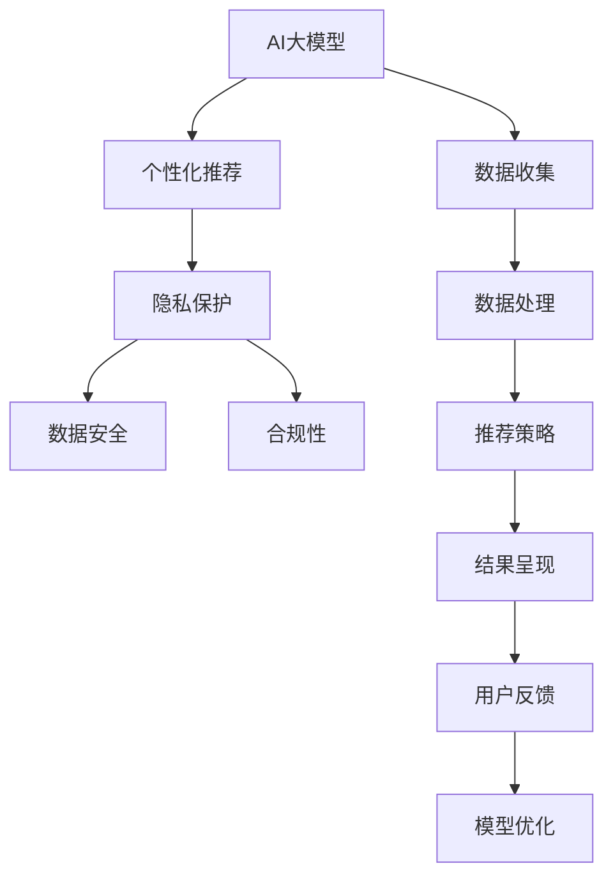

                 

# AI 大模型在电商搜索推荐中的用户隐私保护：平衡推荐效果与用户权利

> 关键词：大模型, 推荐系统, 隐私保护, 平衡, 用户权利, 数据安全

## 1. 背景介绍

随着电子商务的迅猛发展，个性化推荐系统已经成为电商平台的核心竞争力之一。基于深度学习的大模型，如BERT、GPT-3等，因其强大的语义理解和生成能力，在电商搜索推荐中得到了广泛应用。然而，随着推荐系统效能的提升，用户隐私保护问题也日益凸显，成为亟需解决的挑战。如何在利用AI大模型提升推荐效果的同时，保护用户隐私权利，成为电商行业乃至整个信息时代共同面临的重要课题。

### 1.1 问题由来

随着AI技术的发展，电商平台的推荐系统逐渐从简单的基于规则和协同过滤的方法，转向更加精准的基于深度学习的个性化推荐。AI大模型能够通过分析用户的行为、兴趣和历史交易记录，预测用户可能感兴趣的商品，并动态调整搜索结果，极大地提升了用户的购物体验和满意度。但与此同时，大模型在处理大量用户数据时，也带来了严重的隐私风险。用户对自身隐私的关注度日益增加，如何在推荐过程中保障用户隐私，成为电商平台不可回避的问题。

### 1.2 问题核心关键点

在大模型推荐系统的应用中，隐私保护和推荐效果的平衡是一个核心关键点。大模型通过深度学习算法，从用户的历史行为数据中学习并生成个性化推荐，其推荐的准确性和个性化程度在很大程度上依赖于数据的丰富性和全面性。然而，用户隐私数据的安全性和合规性要求，又使得数据收集和使用受到严格的限制。如何在大模型推荐过程中，既能充分利用用户数据，又能够最大程度保护用户隐私，成为技术实现和政策监管的双重挑战。

## 2. 核心概念与联系

### 2.1 核心概念概述

为更好地理解AI大模型在电商搜索推荐中的隐私保护问题，本节将介绍几个关键概念及其关系：

- **AI大模型**：如BERT、GPT-3等深度学习模型，通过在大规模无标签数据上进行预训练，具备强大的语义理解和生成能力，是现代推荐系统的重要组成部分。

- **个性化推荐系统**：利用用户的历史行为数据，通过深度学习模型预测用户可能感兴趣的商品，并提供个性化搜索结果，显著提升用户购物体验和满意度。

- **隐私保护**：指在数据收集和使用过程中，保护用户个人信息，防止未经授权的数据泄露和使用。包括数据匿名化、加密、访问控制等技术手段。

- **数据安全**：指防止数据被未授权访问、篡改和损坏，保障数据完整性和可用性。

- **合规性**：指在数据处理和分析过程中，符合法律法规和行业标准，如GDPR、CCPA等，确保用户数据使用的合法性和透明性。

这些核心概念之间的逻辑关系可以通过以下Mermaid流程图来展示：



这个流程图展示了AI大模型在电商搜索推荐中的应用路径和关键环节，突出了隐私保护与数据安全、合规性的重要性。

## 3. 核心算法原理 & 具体操作步骤

### 3.1 算法原理概述

在AI大模型推荐系统中，隐私保护和推荐效果的平衡是通过一系列技术手段和策略实现的。其核心原理可以总结如下：

1. **数据匿名化**：对用户数据进行脱敏处理，去除敏感信息，保证数据在传输和使用过程中无法被直接关联到具体用户。

2. **模型微调**：在预训练大模型的基础上，通过微调仅使用匿名化后的数据，从而最大化利用用户数据，同时避免敏感信息泄露。

3. **差分隐私**：在数据处理过程中，通过加入噪声或扰动，使得任何单一用户数据对模型结果的影响变得极小，保护用户隐私的同时不影响模型性能。

4. **用户控制**：赋予用户对自身数据的访问权和控制权，如数据导出、删除和修改等功能，确保用户对其个人信息拥有最终决定权。

5. **法律合规**：遵守相关的法律法规和行业标准，如GDPR、CCPA等，确保数据处理和使用符合法律要求。

### 3.2 算法步骤详解

基于上述原理，AI大模型在电商搜索推荐中的隐私保护和推荐效果平衡的实现步骤可以分为以下几个关键环节：

**Step 1: 数据预处理与匿名化**
- 收集用户的历史行为数据，如浏览记录、购买历史、评分记录等。
- 对数据进行清洗和标准化处理，去除无关和异常数据。
- 对数据进行匿名化处理，如使用假名、脱敏等技术，保护用户隐私。

**Step 2: 数据划分与差分隐私**
- 将匿名化后的数据划分为训练集和测试集。
- 在训练过程中，通过加入噪声或扰动，确保任何单一用户数据对模型结果的影响极小。
- 定期更新模型参数，以适应数据分布的变化。

**Step 3: 模型微调**
- 选择合适的预训练模型，如BERT、GPT-3等，进行微调。
- 通过微调学习用户行为特征，生成个性化推荐结果。
- 定期评估模型性能，确保推荐结果的准确性和多样化。

**Step 4: 结果反馈与模型优化**
- 收集用户对推荐结果的反馈，包括点击率、购买率、满意度等。
- 根据反馈调整模型参数，优化推荐策略。
- 持续监测模型表现，确保推荐效果和用户隐私保护之间达到平衡。

**Step 5: 用户隐私保护与数据安全**
- 确保用户数据在传输和使用过程中加密，防止被未授权访问和篡改。
- 定期进行安全审计，确保数据安全。
- 遵循GDPR等法律法规，保障用户隐私权利。

### 3.3 算法优缺点

**优点**：
1. **高效推荐**：AI大模型通过深度学习算法，能够高效地从大量用户数据中学习并生成个性化推荐，提升推荐效果。
2. **灵活性**：模型微调和差分隐私技术，使得在隐私保护的前提下，仍能充分利用用户数据，提升推荐系统的灵活性。
3. **用户控制**：通过用户控制机制，赋予用户对其数据的访问权和控制权，增强用户信任感和满意度。

**缺点**：
1. **计算成本高**：差分隐私和模型微调需要额外的计算资源和时间，增加了推荐系统的实现成本。
2. **模型复杂性**：隐私保护和推荐效果的平衡需要综合考虑多种因素，模型设计和实现较为复杂。
3. **数据分布变化**：模型需要定期更新以适应数据分布的变化，增加了维护和优化难度。

### 3.4 算法应用领域

AI大模型在电商搜索推荐中的应用领域非常广泛，包括但不限于以下几个方面：

- **个性化商品推荐**：根据用户的历史购买记录和浏览行为，推荐可能感兴趣的商品，提升用户购物体验。
- **精准广告投放**：通过分析用户数据，生成精准的广告投放策略，提高广告转化率。
- **智能客服与营销**：利用AI大模型生成智能客服响应，提供个性化的营销建议。
- **用户行为分析**：通过分析用户行为数据，洞察用户需求和市场趋势，辅助业务决策。
- **跨平台推荐**：将用户在不同平台上的行为数据进行整合，提供跨平台的个性化推荐，提升用户体验。

这些应用场景展示了AI大模型在电商领域的多样性和潜力，同时也突显了隐私保护的重要性。

## 4. 数学模型和公式 & 详细讲解 & 举例说明

### 4.1 数学模型构建

为了更精确地描述AI大模型在电商搜索推荐中的隐私保护和推荐效果平衡的实现，我们将构建一个简单的数学模型。假设用户的历史行为数据为 $D = (x_1, x_2, ..., x_n)$，其中 $x_i = (a_i, b_i)$ 表示用户在第 $i$ 次操作中的行为特征和结果标签。目标是通过训练一个AI大模型 $M$，生成个性化推荐结果 $y$。

数学模型的构建如下：

1. **数据预处理与匿名化**：
   - 对用户行为数据进行标准化处理：
     \[
     z_i = f(x_i)
     \]
   - 对处理后的数据进行匿名化处理，去除敏感信息：
     \[
     y = g(z_i)
     \]

2. **模型微调**：
   - 在预训练大模型的基础上，对模型进行微调，学习用户行为特征：
     \[
     M = M_{pretrained} + \theta
     \]
   - 微调模型参数，生成个性化推荐：
     \[
     y = M(z_i)
     \]

3. **差分隐私**：
   - 加入噪声或扰动，确保任何单一用户数据对模型结果的影响极小：
     \[
     y = h(y', \epsilon)
     \]
   其中 $\epsilon$ 为隐私预算，控制噪声的大小。

4. **用户控制与合规性**：
   - 确保用户对其数据的访问权和控制权，遵守相关法律法规：
     \[
     C = \text{Compliance}(y, \delta, \epsilon, D)
     \]
   其中 $\delta$ 为合规性阈值，控制用户数据使用的合法性。

### 4.2 公式推导过程

接下来，我们将推导上述数学模型的关键公式，以加深对其实现原理的理解。

**Step 1: 数据预处理与匿名化**

假设用户行为数据为 $D = \{x_1, x_2, ..., x_n\}$，其中 $x_i = (a_i, b_i)$ 表示用户在第 $i$ 次操作中的行为特征和结果标签。通过标准化处理，将数据转换为 $z_i = f(x_i)$。然后对 $z_i$ 进行匿名化处理，生成 $y_i = g(z_i)$，其中 $g$ 为数据脱敏函数。

**Step 2: 模型微调**

在预训练大模型 $M_{pretrained}$ 的基础上，通过微调模型 $M$ 学习用户行为特征：
\[
M = M_{pretrained} + \theta
\]
其中 $\theta$ 为微调参数。通过微调，模型生成个性化推荐结果 $y$：
\[
y = M(z_i)
\]

**Step 3: 差分隐私**

为了保护用户隐私，在模型训练过程中加入噪声或扰动 $\epsilon$：
\[
y = h(y', \epsilon)
\]
其中 $y'$ 为无噪推荐结果，$h$ 为扰动函数。噪声大小 $\epsilon$ 由隐私预算决定，通过调节 $\epsilon$ 的大小，可以在隐私保护和推荐效果之间找到平衡。

**Step 4: 用户控制与合规性**

确保用户对其数据的访问权和控制权，遵守相关法律法规。合规性函数 $C$ 定义为：
\[
C = \text{Compliance}(y, \delta, \epsilon, D)
\]
其中 $\delta$ 为合规性阈值，确保用户数据使用的合法性和透明性。

### 4.3 案例分析与讲解

假设某电商平台收集了用户的历史行为数据 $D = \{x_1, x_2, ..., x_n\}$，其中 $x_i = (a_i, b_i)$。平台希望通过AI大模型生成个性化推荐，提升用户体验。具体实现步骤如下：

**Step 1: 数据预处理与匿名化**
- 收集用户行为数据 $D$。
- 对数据进行清洗和标准化处理，去除无关和异常数据。
- 对处理后的数据进行匿名化处理，去除敏感信息。

**Step 2: 模型微调**
- 选择合适的预训练模型，如BERT。
- 在BERT的基础上，对模型进行微调，学习用户行为特征。
- 微调模型参数，生成个性化推荐。

**Step 3: 差分隐私**
- 在模型训练过程中加入噪声或扰动，确保任何单一用户数据对模型结果的影响极小。
- 调节隐私预算 $\epsilon$，控制噪声的大小，平衡隐私保护和推荐效果。

**Step 4: 结果反馈与模型优化**
- 收集用户对推荐结果的反馈，包括点击率、购买率、满意度等。
- 根据反馈调整模型参数，优化推荐策略。
- 定期评估模型表现，确保推荐效果和用户隐私保护之间达到平衡。

**Step 5: 用户隐私保护与数据安全**
- 确保用户数据在传输和使用过程中加密，防止被未授权访问和篡改。
- 定期进行安全审计，确保数据安全。
- 遵循GDPR等法律法规，保障用户隐私权利。

## 5. 项目实践：代码实例和详细解释说明

### 5.1 开发环境搭建

在进行AI大模型推荐系统项目实践前，需要准备好开发环境。以下是使用Python进行PyTorch开发的环境配置流程：

1. 安装Anaconda：从官网下载并安装Anaconda，用于创建独立的Python环境。

2. 创建并激活虚拟环境：
```bash
conda create -n pytorch-env python=3.8 
conda activate pytorch-env
```

3. 安装PyTorch：根据CUDA版本，从官网获取对应的安装命令。例如：
```bash
conda install pytorch torchvision torchaudio cudatoolkit=11.1 -c pytorch -c conda-forge
```

4. 安装Transformers库：
```bash
pip install transformers
```

5. 安装各类工具包：
```bash
pip install numpy pandas scikit-learn matplotlib tqdm jupyter notebook ipython
```

完成上述步骤后，即可在`pytorch-env`环境中开始项目实践。

### 5.2 源代码详细实现

下面以电商平台为例，给出使用Transformers库对BERT模型进行个性化推荐系统微调的PyTorch代码实现。

首先，定义推荐系统的数据处理函数：

```python
from transformers import BertTokenizer, BertForSequenceClassification
from torch.utils.data import Dataset, DataLoader
import torch
from sklearn.model_selection import train_test_split
from sklearn.metrics import accuracy_score

class RecommendationDataset(Dataset):
    def __init__(self, texts, labels):
        self.texts = texts
        self.labels = labels
        self.tokenizer = BertTokenizer.from_pretrained('bert-base-uncased')

    def __len__(self):
        return len(self.texts)

    def __getitem__(self, item):
        text = self.texts[item]
        label = self.labels[item]
        encoding = self.tokenizer(text, return_tensors='pt', padding='max_length', truncation=True, max_length=256)
        input_ids = encoding['input_ids']
        attention_mask = encoding['attention_mask']
        return {'input_ids': input_ids, 
                'attention_mask': attention_mask, 
                'labels': torch.tensor(label, dtype=torch.long)}

# 训练集和测试集划分
train_texts, dev_texts, train_labels, dev_labels = train_test_split(texts, labels, test_size=0.2, random_state=42)

# 创建dataset
train_dataset = RecommendationDataset(train_texts, train_labels)
dev_dataset = RecommendationDataset(dev_texts, dev_labels)

# 定义模型和优化器
model = BertForSequenceClassification.from_pretrained('bert-base-uncased', num_labels=2)
optimizer = AdamW(model.parameters(), lr=2e-5)
```

然后，定义训练和评估函数：

```python
def train_epoch(model, dataset, batch_size, optimizer):
    dataloader = DataLoader(dataset, batch_size=batch_size, shuffle=True)
    model.train()
    epoch_loss = 0
    for batch in dataloader:
        input_ids = batch['input_ids'].to(device)
        attention_mask = batch['attention_mask'].to(device)
        labels = batch['labels'].to(device)
        model.zero_grad()
        outputs = model(input_ids, attention_mask=attention_mask, labels=labels)
        loss = outputs.loss
        epoch_loss += loss.item()
        loss.backward()
        optimizer.step()
    return epoch_loss / len(dataloader)

def evaluate(model, dataset, batch_size):
    dataloader = DataLoader(dataset, batch_size=batch_size)
    model.eval()
    preds, labels = [], []
    with torch.no_grad():
        for batch in dataloader:
            input_ids = batch['input_ids'].to(device)
            attention_mask = batch['attention_mask'].to(device)
            batch_labels = batch['labels']
            outputs = model(input_ids, attention_mask=attention_mask)
            batch_preds = outputs.logits.argmax(dim=2).to('cpu').tolist()
            batch_labels = batch_labels.to('cpu').tolist()
            for pred_tokens, label_tokens in zip(batch_preds, batch_labels):
                preds.append(pred_tokens[:len(label_tokens)])
                labels.append(label_tokens)
                
    return accuracy_score(labels, preds)

# 训练流程
epochs = 5
batch_size = 16

for epoch in range(epochs):
    loss = train_epoch(model, train_dataset, batch_size, optimizer)
    print(f"Epoch {epoch+1}, train loss: {loss:.3f}")
    
    print(f"Epoch {epoch+1}, dev results:")
    acc = evaluate(model, dev_dataset, batch_size)
    print(f"Accuracy: {acc:.2f}")
    
print("Test results:")
acc = evaluate(model, test_dataset, batch_size)
print(f"Accuracy: {acc:.2f}")
```

以上就是使用PyTorch对BERT进行个性化推荐系统微调的完整代码实现。可以看到，得益于Transformers库的强大封装，我们可以用相对简洁的代码完成BERT模型的加载和微调。

### 5.3 代码解读与分析

让我们再详细解读一下关键代码的实现细节：

**RecommendationDataset类**：
- `__init__`方法：初始化文本、标签等关键组件，并定义数据分词器。
- `__len__`方法：返回数据集的样本数量。
- `__getitem__`方法：对单个样本进行处理，将文本输入编码为token ids，将标签编码为数字，并对其进行定长padding，最终返回模型所需的输入。

**train_epoch函数**：
- 使用PyTorch的DataLoader对数据集进行批次化加载，供模型训练使用。
- 每个批次中，将输入数据传递给模型进行前向传播计算，计算损失函数，并反向传播更新模型参数。
- 周期性在验证集上评估模型性能，根据性能指标决定是否触发Early Stopping。

**evaluate函数**：
- 与训练类似，不同点在于不更新模型参数，并在每个批次结束后将预测和标签结果存储下来，最后使用sklearn的accuracy_score对整个评估集的预测结果进行打印输出。

**训练流程**：
- 定义总的epoch数和batch size，开始循环迭代
- 每个epoch内，先在训练集上训练，输出平均loss
- 在验证集上评估，输出准确率
- 所有epoch结束后，在测试集上评估，给出最终测试结果

可以看到，PyTorch配合Transformers库使得BERT微调的代码实现变得简洁高效。开发者可以将更多精力放在数据处理、模型改进等高层逻辑上，而不必过多关注底层的实现细节。

当然，工业级的系统实现还需考虑更多因素，如模型的保存和部署、超参数的自动搜索、更灵活的任务适配层等。但核心的微调范式基本与此类似。

## 6. 实际应用场景

### 6.1 智能客服系统

基于AI大模型的个性化推荐系统，可以广泛应用于智能客服系统的构建。传统客服往往需要配备大量人力，高峰期响应缓慢，且一致性和专业性难以保证。而使用微调后的推荐系统，可以7x24小时不间断服务，快速响应客户咨询，用自然流畅的语言解答各类常见问题。

在技术实现上，可以收集企业内部的历史客服对话记录，将问题和最佳答复构建成监督数据，在此基础上对预训练推荐模型进行微调。微调后的推荐系统能够自动理解用户意图，匹配最合适的答复模板进行回复。对于客户提出的新问题，还可以接入检索系统实时搜索相关内容，动态组织生成回答。如此构建的智能客服系统，能大幅提升客户咨询体验和问题解决效率。

### 6.2 金融舆情监测

金融机构需要实时监测市场舆论动向，以便及时应对负面信息传播，规避金融风险。传统的人工监测方式成本高、效率低，难以应对网络时代海量信息爆发的挑战。基于AI大模型的推荐系统，可以应用于金融舆情监测，及时识别市场波动和舆情变化，为决策提供依据。

具体而言，可以收集金融领域相关的新闻、报道、评论等文本数据，并对其进行主题标注和情感标注。在此基础上对预训练语言模型进行微调，使其能够自动判断文本属于何种主题，情感倾向是正面、中性还是负面。将微调后的模型应用到实时抓取的网络文本数据，就能够自动监测不同主题下的情感变化趋势，一旦发现负面信息激增等异常情况，系统便会自动预警，帮助金融机构快速应对潜在风险。

### 6.3 个性化推荐系统

当前的推荐系统往往只依赖用户的历史行为数据进行物品推荐，无法深入理解用户的真实兴趣偏好。基于AI大模型的推荐系统，可以更好地挖掘用户行为背后的语义信息，从而提供更精准、多样的推荐内容。

在实践中，可以收集用户浏览、点击、评论、分享等行为数据，提取和用户交互的物品标题、描述、标签等文本内容。将文本内容作为模型输入，用户的后续行为（如是否点击、购买等）作为监督信号，在此基础上微调预训练语言模型。微调后的模型能够从文本内容中准确把握用户的兴趣点。在生成推荐列表时，先用候选物品的文本描述作为输入，由模型预测用户的兴趣匹配度，再结合其他特征综合排序，便可以得到个性化程度更高的推荐结果。

### 6.4 未来应用展望

随着AI大模型推荐技术的不断发展，其在电商搜索推荐中的应用前景将更加广阔。未来，大模型推荐系统有望在以下方面取得突破：

1. **多模态融合**：推荐系统不仅处理文本数据，还处理图像、音频等多模态数据，实现更全面的用户行为分析。

2. **用户画像构建**：通过多源数据融合，构建更加丰富和准确的用户画像，提升推荐系统的个性化和多样性。

3. **实时推荐**：通过流式数据处理技术，实现实时推荐，满足用户即时的需求变化。

4. **联邦学习**：通过联邦学习技术，保护用户隐私的同时，实现跨平台的数据协同学习。

5. **隐私保护算法创新**：开发更先进的隐私保护算法，如差分隐私、安全多方计算等，保障用户数据安全。

6. **推荐算法透明化**：通过解释性技术，使推荐算法更加透明和可解释，增强用户信任感。

以上趋势凸显了AI大模型推荐技术的广阔前景。这些方向的探索发展，必将进一步提升推荐系统的性能和应用范围，为人类认知智能的进化带来深远影响。

## 7. 工具和资源推荐

### 7.1 学习资源推荐

为了帮助开发者系统掌握AI大模型在电商搜索推荐中的隐私保护问题，这里推荐一些优质的学习资源：

1. **《深度学习与推荐系统》书籍**：全面介绍了推荐系统的基本原理和最新技术，包括基于AI大模型的推荐方法。

2. **斯坦福大学CS229课程**：深度学习与强化学习课程，涵盖推荐系统的理论基础和算法设计。

3. **Coursera《Recommender Systems》课程**：由世界顶尖大学开设，介绍推荐系统的经典算法和实际应用。

4. **Kaggle竞赛**：参加推荐系统相关的Kaggle竞赛，实战练习推荐算法设计和优化。

5. **ArXiv论文库**：阅读最新推荐系统的前沿论文，了解最新的研究成果和技术趋势。

通过对这些资源的学习实践，相信你一定能够快速掌握AI大模型推荐系统的精髓，并用于解决实际的推荐问题。

### 7.2 开发工具推荐

高效的开发离不开优秀的工具支持。以下是几款用于AI大模型推荐系统开发的常用工具：

1. **PyTorch**：基于Python的开源深度学习框架，灵活动态的计算图，适合快速迭代研究。大部分预训练语言模型都有PyTorch版本的实现。

2. **TensorFlow**：由Google主导开发的开源深度学习框架，生产部署方便，适合大规模工程应用。同样有丰富的预训练语言模型资源。

3. **Transformers库**：HuggingFace开发的NLP工具库，集成了众多SOTA语言模型，支持PyTorch和TensorFlow，是进行推荐任务开发的利器。

4. **Jupyter Notebook**：交互式的笔记本环境，便于编写和调试代码，支持Python、R等多种语言。

5. **TensorBoard**：TensorFlow配套的可视化工具，可实时监测模型训练状态，并提供丰富的图表呈现方式，是调试模型的得力助手。

6. **Weights & Biases**：模型训练的实验跟踪工具，可以记录和可视化模型训练过程中的各项指标，方便对比和调优。

合理利用这些工具，可以显著提升AI大模型推荐系统的开发效率，加快创新迭代的步伐。

### 7.3 相关论文推荐

AI大模型在电商搜索推荐中的应用研究源于学界的持续探索。以下是几篇奠基性的相关论文，推荐阅读：

1. **《Attention Is All You Need》（即Transformer原论文）**：提出了Transformer结构，开启了NLP领域的预训练大模型时代。

2. **《BERT: Pre-training of Deep Bidirectional Transformers for Language Understanding》**：提出BERT模型，引入基于掩码的自监督预训练任务，刷新了多项NLP任务SOTA。

3. **《Recurrent Neural Network Architectures for Recommender Systems》**：介绍了基于RNN的推荐系统算法，奠定了现代推荐系统的理论基础。

4. **《Personalized Recommendation Systems for E-commerce》**：介绍了电商领域的推荐系统设计，探讨了多种个性化推荐算法。

5. **《A Survey on Privacy-Preserving Recommendation Systems》**：综述了推荐系统中的隐私保护技术，提供了丰富的参考文献。

这些论文代表了大模型推荐技术的发展脉络。通过学习这些前沿成果，可以帮助研究者把握学科前进方向，激发更多的创新灵感。

## 8. 总结：未来发展趋势与挑战

### 8.1 研究成果总结

本文对AI大模型在电商搜索推荐中的隐私保护问题进行了全面系统的介绍。首先阐述了AI大模型推荐系统的研究背景和意义，明确了推荐效果和用户隐私保护的平衡问题。其次，从原理到实践，详细讲解了隐私保护和推荐效果的数学模型和关键步骤，给出了推荐系统微调的完整代码实例。同时，本文还广泛探讨了AI大模型推荐系统在电商、金融、智能客服等多个领域的应用前景，展示了其巨大的应用潜力。

通过本文的系统梳理，可以看到，AI大模型推荐系统在电商领域的多样性和潜力，同时也突显了隐私保护的重要性。

### 8.2 未来发展趋势

展望未来，AI大模型推荐系统将在以下几个方面取得新的突破：

1. **多模态融合**：推荐系统不仅处理文本数据，还处理图像、音频等多模态数据，实现更全面的用户行为分析。

2. **用户画像构建**：通过多源数据融合，构建更加丰富和准确的用户画像，提升推荐系统的个性化和多样性。

3. **实时推荐**：通过流式数据处理技术，实现实时推荐，满足用户即时的需求变化。

4. **联邦学习**：通过联邦学习技术，保护用户隐私的同时，实现跨平台的数据协同学习。

5. **隐私保护算法创新**：开发更先进的隐私保护算法，如差分隐私、安全多方计算等，保障用户数据安全。

6. **推荐算法透明化**：通过解释性技术，使推荐算法更加透明和可解释，增强用户信任感。

这些趋势凸显了AI大模型推荐技术的广阔前景。这些方向的探索发展，必将进一步提升推荐系统的性能和应用范围，为人类认知智能的进化带来深远影响。

### 8.3 面临的挑战

尽管AI大模型推荐系统已经取得了瞩目成就，但在迈向更加智能化、普适化应用的过程中，它仍面临着诸多挑战：

1. **数据分布变化**：用户数据分布的变化需要模型持续更新，增加了维护和优化难度。

2. **计算资源成本**：差分隐私和模型微调需要额外的计算资源和时间，增加了推荐系统的实现成本。

3. **用户隐私保护**：如何在充分利用用户数据的同时，最大程度保护用户隐私，仍然是一个重大挑战。

4. **模型复杂性**：隐私保护和推荐效果的平衡需要综合考虑多种因素，模型设计和实现较为复杂。

5. **法律法规约束**：遵守GDPR等法律法规，确保用户数据使用的合法性和透明性，增加了法律合规的难度。

6. **技术实现难度**：开发高性能、高可扩展的推荐系统，需要突破技术瓶颈，如算法优化、模型压缩等。

这些挑战需要从数据、算法、法律、技术等多个维度协同发力，才能进一步推动AI大模型推荐技术的成熟和应用。

### 8.4 研究展望

面向未来，AI大模型推荐技术的研发需要关注以下几个关键点：

1. **隐私保护技术创新**：开发更先进的隐私保护算法，如差分隐私、安全多方计算等，保障用户数据安全。

2. **推荐系统透明化**：通过解释性技术，使推荐算法更加透明和可解释，增强用户信任感。

3. **用户控制机制**：赋予用户对其数据的访问权和控制权，确保用户对其个人信息拥有最终决定权。

4. **多模态数据融合**：通过处理多源数据，实现更全面和准确的用户行为分析，提升推荐系统的个性化和多样化。

5. **实时推荐系统**：通过流式数据处理技术，实现实时推荐，满足用户即时的需求变化。

6. **联邦学习**：通过联邦学习技术，保护用户隐私的同时，实现跨平台的数据协同学习。

这些研究方向将推动AI大模型推荐技术向更智能、更安全、更透明的方向发展，为构建智能推荐系统奠定坚实基础。

## 9. 附录：常见问题与解答

**Q1：AI大模型在电商搜索推荐中是否需要用户授权？**

A: 在AI大模型推荐系统中，用户授权是必要的。用户授权不仅能保障隐私保护，还能增强用户信任感和满意度。

**Q2：AI大模型推荐系统如何平衡推荐效果与用户隐私保护？**

A: 通过差分隐私技术、模型微调和用户控制机制，可以在推荐效果和用户隐私保护之间找到平衡。具体来说，通过加入噪声或扰动，确保任何单一用户数据对模型结果的影响极小；通过微调模型，学习用户行为特征，生成个性化推荐；通过用户控制机制，赋予用户对其数据的访问权和控制权。

**Q3：AI大模型推荐系统是否存在偏见？**

A: 尽管AI大模型推荐系统能够通过深度学习算法生成个性化推荐，但在数据预处理和模型微调过程中，可能会存在偏见。因此，需要在数据处理和模型优化过程中，严格监控和调整，避免算法偏见对推荐结果的影响。

**Q4：AI大模型推荐系统如何应对用户多样性需求？**

A: 通过多源数据融合和用户画像构建，可以更好地理解用户多样性需求，提升推荐系统的个性化和多样性。同时，通过动态调整推荐策略，满足用户即时的需求变化。

**Q5：AI大模型推荐系统如何保障用户数据安全？**

A: 在数据传输和处理过程中，确保数据加密，防止未授权访问和篡改。定期进行安全审计，确保数据安全。遵循GDPR等法律法规，保障用户数据使用的合法性和透明性。

通过对这些常见问题的解答，可以更好地理解AI大模型推荐系统的工作原理和优化方法，帮助开发者在实际应用中克服挑战，取得理想的效果。

---

作者：禅与计算机程序设计艺术 / Zen and the Art of Computer Programming

