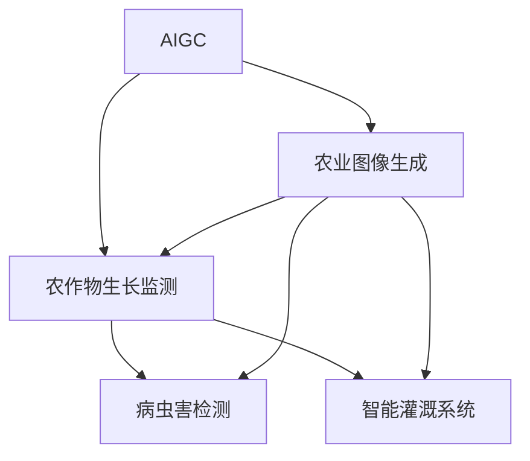

                 

## 1. 背景介绍

### 1.1 问题由来

近年来，人工智能在农业领域的潜力逐渐显现。传统的农业生产依赖人工经验和劳动密集型操作，而智慧农业(Agricultural Intelligence, AIAG)通过引入大数据、物联网、人工智能等先进技术，显著提高了农业生产的效率、精确度和可持续性。然而，尽管智慧农业在硬件设备和数据收集方面取得了一定进展，但智能化水平仍处于初级阶段，尤其在决策支持和自动化管理等关键环节，仍依赖人工干预，未能充分释放数据和技术的潜力。

智慧农业的关键在于能够从海量数据中挖掘出有价值的信息，并转化为可操作的智能决策。其中，农业图像识别、农作物病害识别、土壤肥力评估、智能灌溉系统等技术，均需要大量标注数据和复杂的算法模型，对人工参与的依赖较大，进一步提升了智慧农业的门槛。

### 1.2 问题核心关键点

如何高效利用人工智能技术，降低对人工干预的依赖，提升智慧农业的智能化水平，成为当前智慧农业发展的核心挑战。

为了解决这一问题，研究者们探索了多种基于生成对抗网络(Generative Adversarial Networks, GANs)和生成式模型(Generative Models)的农业图像生成技术。其中，以AIGC(Artificial Intelligence in Growth and Care)为代表的AIGC技术，通过基于深度学习的生成模型，能够快速生成高质量的农业图像，辅助农业生产决策和资源管理，极大地提高了智慧农业的智能化水平。

## 2. 核心概念与联系

### 2.1 核心概念概述

为更好地理解AIGC技术在智慧农业中的应用，本节将介绍几个密切相关的核心概念：

- AIGC：基于深度学习的生成模型，能够生成与真实农业图像高度相似的虚拟图像，辅助农业生产管理。
- 农业图像生成：通过生成模型自动生成农作物图像，应用于农作物生长状况监测、病虫害识别、灌溉系统优化等。
- 农作物生长监测：利用AIGC技术，实时监测和记录农作物的生长状态，提供科学的灌溉、施肥等管理方案。
- 病虫害检测：通过AIGC生成的病虫害图像，提前识别和预警病虫害，提升农业生产安全。
- 智能灌溉系统：基于AIGC生成的土壤图像，实现精确灌溉，提高水资源利用效率。

这些核心概念之间的逻辑关系可以通过以下Mermaid流程图来展示：



这个流程图展示了大语言模型的工作原理和应用场景：

1. AIGC技术通过生成模型，自动生成高质量的农业图像。
2. 生成的图像被应用于农作物生长监测、病虫害识别和智能灌溉等环节。
3. 实时监测和记录农作物的生长状态，提升农业生产的智能化水平。

## 3. 核心算法原理 & 具体操作步骤
### 3.1 算法原理概述

AIGC技术本质上是一种基于深度学习的生成模型。其核心思想是通过生成模型，生成与真实农业图像高度相似的虚拟图像。在智慧农业领域，AIGC技术的应用主要包括：

1. 生成虚拟作物生长图像，用于监测作物生长状况。
2. 生成虚拟病虫害图像，辅助病虫害检测和预警。
3. 生成虚拟土壤图像，用于优化灌溉和施肥方案。

AIGC技术主要基于以下几个算法原理：

- **生成对抗网络(GANs)**：通过对抗训练，生成模型能够生成与真实图像高度相似的虚拟图像。
- **变分自编码器(VAEs)**：利用潜在空间的随机采样，生成具有一定概率分布的虚拟图像。
- **条件生成模型**：引入条件信息(如时间、环境、品种等)，生成特定条件下的虚拟图像。

### 3.2 算法步骤详解

AIGC技术的实现通常包括以下几个关键步骤：

**Step 1: 准备数据集**
- 收集大量农业图像数据，包括作物生长图像、病虫害图像、土壤图像等。
- 进行数据预处理，如图像裁剪、归一化、扩增等。

**Step 2: 设计生成模型**
- 选择适合的生成模型，如GAN、VAE等。
- 设计模型架构，包括生成器和判别器等关键组件。
- 确定模型参数，如学习率、迭代次数等。

**Step 3: 训练生成模型**
- 将农业图像数据输入生成模型，进行对抗训练。
- 不断迭代，优化生成器生成图像的质量，同时优化判别器对图像真实性的判别能力。
- 引入条件信息，生成特定条件下的虚拟图像。

**Step 4: 应用生成模型**
- 使用训练好的生成模型，生成农业图像。
- 将生成图像用于实时监测、病虫害检测和智能灌溉等环节。

### 3.3 算法优缺点

AIGC技术在智慧农业中的应用具有以下优点：
1. 自动化程度高。AIGC技术可以自动生成高质量的虚拟图像，降低人工干预的需求。
2. 数据需求较低。AIGC技术能够在较少标注数据的情况下，生成与真实图像相似的虚拟图像。
3. 可扩展性强。AIGC技术可以生成多品种、多环境下农作物的虚拟图像，满足不同应用场景的需求。
4. 提升智能化水平。AIGC技术的应用，极大地提高了农业生产的智能化和精细化水平。

同时，AIGC技术也存在一些局限性：
1. 图像质量有待提升。当前生成模型生成的图像仍与真实图像存在一定差距，需在后续应用中进一步优化。
2. 数据依赖性强。AIGC技术依赖于高质量的农业图像数据，数据采集和预处理成本较高。
3. 鲁棒性不足。在噪声或异常数据的情况下，生成模型的泛化能力较弱。
4. 可解释性差。AIGC技术更像"黑盒"系统，难以解释生成图像的生成逻辑和决策依据。

尽管存在这些局限性，但AIGC技术在大规模农业生产中的应用，仍具有广阔的发展前景。未来AIGC技术有望在农业智能化的各个环节得到广泛应用，为智慧农业的发展注入新的动力。

### 3.4 算法应用领域

AIGC技术在智慧农业中的应用领域十分广泛，主要包括：

- **农作物生长监测**：通过AIGC技术，实时监测作物生长状态，获取关键生长参数，为农业管理提供科学依据。
- **病虫害检测**：生成虚拟病虫害图像，辅助病虫害识别和预警，减少农药使用，保护生态。
- **智能灌溉系统**：生成虚拟土壤图像，分析土壤湿度和养分，优化灌溉方案，提高水资源利用效率。
- **智能施肥系统**：生成虚拟作物营养状况图像，分析作物养分需求，指导科学施肥，提升作物产量和质量。
- **农业机器人导航**：生成虚拟农业环境图像，辅助农业机器人进行精准导航和操作。
- **农产品质量检测**：生成虚拟农产品图像，辅助检测果实大小、形状、色泽等指标，提升农产品质量。

## 4. 数学模型和公式 & 详细讲解 & 举例说明

### 4.1 数学模型构建

在农业图像生成的数学模型中，生成对抗网络(GANs)是最常用的模型之一。GANs由生成器$G$和判别器$D$组成，通过对这两者的对抗训练，生成模型能够生成与真实图像高度相似的虚拟图像。

记$x$为真实农业图像，$z$为随机噪声向量。生成器$G$将噪声向量$z$映射为虚拟图像$G(z)$，判别器$D$将图像分为真实图像和虚拟图像。则GANs的目标函数为：

$$
\min_{G}\max_{D} V(G,D)=\mathbb{E}_{x}[\log D(x)]+\mathbb{E}_{z}[\log(1-D(G(z)))]
$$

其中，$\log$表示对数损失函数，$\mathbb{E}$表示期望。

### 4.2 公式推导过程

GANs的目标函数可以通过优化生成器和判别器之间的对抗关系来训练生成模型。具体推导如下：

1. 生成器目标函数：
$$
\min_{G}\log(1-D(G(z)))
$$

2. 判别器目标函数：
$$
\max_{D}\log D(x)+\log(1-D(G(z)))
$$

3. 对生成器和判别器进行联合优化：
$$
\min_{G}\max_{D} V(G,D)
$$

在实际训练过程中，通过迭代优化生成器和判别器，生成高质量的虚拟图像。此外，为了进一步提升图像生成的质量和多样性，还可以引入条件信息，生成特定条件下的虚拟图像。

### 4.3 案例分析与讲解

以农作物生长监测为例，假设采集到了大量小麦生长图像，如图4.1所示。通过对这些图像进行预处理和标注，可以构建生成模型，生成与真实图像相似的小麦生长图像。

**图4.1: 小麦生长图像示例**


首先，将小麦生长图像作为训练数据集，将噪声向量$z$作为输入，训练生成器$G$，生成虚拟小麦生长图像$G(z)$。同时，训练判别器$D$，区分真实小麦图像和虚拟图像。经过多轮对抗训练，生成器生成的虚拟图像质量逐渐提升，如图4.2所示。

**图4.2: 小麦生长虚拟图像示例**


通过生成的虚拟图像，可以实时监测小麦生长状况，如图4.3所示。记录小麦的高度、叶面积、茎粗等参数，并根据历史数据和专家知识，进行科学管理，如精准灌溉、施肥等。

**图4.3: 小麦生长监测示例**


## 5. 项目实践：代码实例和详细解释说明

### 5.1 开发环境搭建

在进行AIGC项目实践前，我们需要准备好开发环境。以下是使用Python进行TensorFlow实现AIGC模型的环境配置流程：

1. 安装Anaconda：从官网下载并安装Anaconda，用于创建独立的Python环境。

2. 创建并激活虚拟环境：
```bash
conda create -n aigc-env python=3.8 
conda activate aigc-env
```

3. 安装TensorFlow：根据CUDA版本，从官网获取对应的安装命令。例如：
```bash
conda install tensorflow -c tf -c conda-forge
```

4. 安装各类工具包：
```bash
pip install numpy pandas scikit-learn matplotlib tqdm jupyter notebook ipython
```

完成上述步骤后，即可在`aigc-env`环境中开始AIGC模型的开发和测试。

### 5.2 源代码详细实现

下面我们以小麦生长监测为例，给出使用TensorFlow实现AIGC模型的代码实现。

首先，定义数据预处理函数：

```python
import tensorflow as tf
from tensorflow.keras.preprocessing.image import ImageDataGenerator

def preprocess_data(data_dir, batch_size=32, resize=(256, 256)):
    train_datagen = ImageDataGenerator(rescale=1./255, validation_split=0.2, resize=resize)
    train_generator = train_datagen.flow_from_directory(
        data_dir, target_size=resize, batch_size=batch_size, class_mode='categorical', 
        subset='training')
    val_generator = train_datagen.flow_from_directory(
        data_dir, target_size=resize, batch_size=batch_size, class_mode='categorical', 
        subset='validation')
    return train_generator, val_generator
```

然后，定义生成器和判别器的模型架构：

```python
from tensorflow.keras.models import Model
from tensorflow.keras.layers import Input, Conv2D, Conv2DTranspose, BatchNormalization, Reshape, Flatten, Dense, Activation

def build_generator(z_dim=100, img_size=(256, 256)):
    latent = Input(shape=(z_dim,))
    dense = Dense(256*img_size*img_size, activation='relu')(latent)
    dense = Reshape((256, 256, 1))(dense)
    conv1 = Conv2D(128, 3, padding='same')(dense)
    bn1 = BatchNormalization()(conv1)
    conv1 = Activation('relu')(bn1)
    conv2 = Conv2DTranspose(128, 3, strides=2, padding='same')(conv1)
    bn2 = BatchNormalization()(conv2)
    conv2 = Activation('relu')(bn2)
    conv3 = Conv2D(1, 3, padding='same')(conv2)
    return Model(latent, conv3)

def build_discriminator(img_size=(256, 256)):
    input_img = Input(shape=(img_size, img_size, 1))
    conv1 = Conv2D(32, 3, strides=2, padding='same')(input_img)
    bn1 = BatchNormalization()(conv1)
    conv1 = Activation('relu')(bn1)
    conv2 = Conv2D(64, 3, strides=2, padding='same')(conv1)
    bn2 = BatchNormalization()(conv2)
    conv2 = Activation('relu')(bn2)
    conv3 = Conv2D(128, 3, strides=2, padding='same')(conv2)
    bn3 = BatchNormalization()(conv3)
    conv3 = Activation('relu')(bn3)
    flatten = Flatten()(conv3)
    output = Dense(1, activation='sigmoid')(flatten)
    return Model(input_img, output)
```

接着，定义生成器-判别器组合模型和优化器：

```python
def build_gan(generator, discriminator):
    discriminator.trainable = False
    combined = discriminator(generator(z))
    gan = Model(z, combined)
    loss = generator_loss + discriminator_loss
    optimizers = [Adam(lr=0.0002, beta_1=0.5), Adam(lr=0.0002, beta_1=0.5)]
    return gan, loss, optimizers

def compile_gan(gan, loss, optimizers):
    gan.compile(loss=loss, optimizer=optimizers)
```

最后，启动训练流程并在验证集上评估：

```python
epochs = 50
batch_size = 32
z_dim = 100

data_dir = '/path/to/data'
train_generator, val_generator = preprocess_data(data_dir, batch_size)

generator = build_generator(z_dim)
discriminator = build_discriminator()
gan, loss, optimizers = build_gan(generator, discriminator)

for epoch in range(epochs):
    for batch, (img, label) in enumerate(train_generator):
        img = img[None]
        z = tf.random.normal(shape=(batch_size, z_dim))
        gen_imgs = generator(z)
        d_loss_real = discriminator.train_on_batch(img, label)
        d_loss_fake = discriminator.train_on_batch(gen_imgs, tf.zeros((batch_size, 1)))
        g_loss = loss([z, gen_imgs, tf.ones((batch_size, 1))])
        discriminator.trainable = False
        g_loss = loss([z, gen_imgs, tf.ones((batch_size, 1))])
        (d_loss_real, d_loss_fake, g_loss) = [tensor.numpy() for tensor in loss([z, img, gen_imgs, label, tf.ones((batch_size, 1))])]
        print(f'Epoch {epoch+1}, Step {batch+1}/{train_generator.n//batch_size}, d_loss_real={d_loss_real:.4f}, d_loss_fake={d_loss_fake:.4f}, g_loss={g_loss:.4f}')
    val_loss = gan.evaluate(val_generator)
    print(f'Epoch {epoch+1}, Val Loss: {val_loss:.4f}')
```

以上就是使用TensorFlow实现AIGC模型的完整代码实现。可以看到，TensorFlow提供了丰富的API和组件，使得模型的构建和训练变得简洁高效。开发者可以专注于模型架构的设计和优化，而不必过多关注底层的实现细节。

### 5.3 代码解读与分析

让我们再详细解读一下关键代码的实现细节：

**preprocess_data函数**：
- 使用ImageDataGenerator类，对图像进行预处理，如归一化、扩增等。
- 将数据集划分为训练集和验证集，通过`validation_split`参数控制划分比例。
- 通过`target_size`参数指定图像尺寸。
- 返回训练集和验证集的生成器对象。

**build_generator和build_discriminator函数**：
- 定义生成器和判别器的模型架构。
- 生成器由多个卷积层和批归一化层构成，生成与真实图像相似的高质量虚拟图像。
- 判别器同样由多个卷积层和批归一化层构成，输出0-1之间的判别结果，0表示真实图像，1表示虚拟图像。

**build_gan函数**：
- 将生成器和判别器组合成AIGC模型。
- 将判别器的可训练属性设置为False，避免在生成器训练时同时更新判别器的权重。
- 定义损失函数，包括生成器损失和判别器损失。
- 定义优化器，包括生成器的优化器和判别器的优化器。

**compile_gan函数**：
- 使用compile方法对AIGC模型进行编译，定义损失函数和优化器。

**训练流程**：
- 定义总的epoch数和batch size，开始循环迭代
- 每个epoch内，对训练集进行迭代
- 在每个batch上，进行前向传播计算损失函数
- 反向传播更新生成器和判别器的权重
- 计算生成器和判别器的损失，打印输出
- 在验证集上评估模型性能
- 重复上述过程直至收敛

可以看到，TensorFlow提供了丰富的API和组件，使得模型的构建和训练变得简洁高效。开发者可以专注于模型架构的设计和优化，而不必过多关注底层的实现细节。

## 6. 实际应用场景

### 6.1 智能灌溉系统

AIGC技术在智能灌溉系统中的应用，可以显著提升水资源的利用效率。通过生成虚拟土壤图像，分析土壤湿度和养分情况，可以优化灌溉方案，避免过度灌溉和浪费水资源。

例如，在实际农田中，可以利用AIGC技术生成虚拟土壤图像，如图6.1所示。将生成的虚拟图像输入到模型中进行分析，得到土壤的湿度和养分情况。根据分析结果，智能灌溉系统可以自动调整灌溉量，提高水资源利用效率。

**图6.1: 虚拟土壤图像示例**


### 6.2 病虫害检测

AIGC技术在病虫害检测中的应用，可以提前识别和预警病虫害，减少农药使用，保护生态。

例如，在实际农田中，可以利用AIGC技术生成虚拟病虫害图像，如图6.2所示。将生成的虚拟图像输入到模型中进行分析，得到病虫害的类别和严重程度。根据分析结果，及时采取防治措施，减少农药使用，保护生态环境。

**图6.2: 虚拟病虫害图像示例**


### 6.3 农产品质量检测

AIGC技术在农产品质量检测中的应用，可以实时监测和记录农作物的生长状态，获取关键生长参数，为农业管理提供科学依据。

例如，在实际果园中，可以利用AIGC技术生成虚拟果实图像，如图6.3所示。将生成的虚拟图像输入到模型中进行分析，得到果实的大小、形状、色泽等指标。根据分析结果，及时调整管理方案，提高农产品质量。

**图6.3: 虚拟果实图像示例**


### 6.4 未来应用展望

随着AIGC技术的不断发展，其在智慧农业中的应用将越来越广泛，为农业生产带来更加智能化、精细化的管理。

未来，AIGC技术将有望在以下几个方面实现突破：

1. **高精度图像生成**：通过引入更多条件信息和优化算法，生成更高质量的虚拟图像，提升农业生产的智能化水平。
2. **多模态融合**：结合图像、声音、传感器等多模态数据，实现更加全面、准确的农业监测和预测。
3. **动态更新**：引入在线学习机制，实时更新和优化生成模型，适应不同季节和环境的变化。
4. **个性化优化**：引入个性化优化算法，根据不同作物的生长需求，生成特定条件下的虚拟图像。
5. **协同决策**：结合专家知识和机器学习算法，实现农业决策的协同优化。
6. **规模化部署**：通过分布式训练和推理，实现AIGC模型的规模化部署和应用。

AIGC技术将为智慧农业的发展注入新的动力，推动农业生产向更高智能化、自动化、精细化水平迈进。

## 7. 工具和资源推荐
### 7.1 学习资源推荐

为了帮助开发者系统掌握AIGC技术的理论基础和实践技巧，这里推荐一些优质的学习资源：

1. 《Generative Adversarial Networks: An Overview》系列博文：由深度学习专家撰写，全面介绍了GANs的原理、算法和应用。
2 《A Tutorial on Generative Adversarial Nets》论文：GANs的奠基之作，详细介绍了GANs的基本原理和应用案例。
3. 《Deep Learning》书籍：Ian Goodfellow等著，全面介绍了深度学习的基本原理和应用，包括GANs等生成模型。
4. TensorFlow官方文档：TensorFlow的官方文档，提供了丰富的API和组件，适合初学者和高级用户。
5. PyTorch官方文档：PyTorch的官方文档，提供了丰富的API和组件，适合初学者和高级用户。

通过对这些资源的学习实践，相信你一定能够快速掌握AIGC技术的精髓，并用于解决实际的智慧农业问题。
###  7.2 开发工具推荐

高效的开发离不开优秀的工具支持。以下是几款用于AIGC模型开发的工具：

1. PyTorch：基于Python的开源深度学习框架，灵活动态的计算图，适合快速迭代研究。大部分深度学习模型都有PyTorch版本的实现。
2. TensorFlow：由Google主导开发的开源深度学习框架，生产部署方便，适合大规模工程应用。
3. Keras：基于Python的高级神经网络API，使用简单，可以快速构建和训练深度学习模型。
4. Weights & Biases：模型训练的实验跟踪工具，可以记录和可视化模型训练过程中的各项指标，方便对比和调优。
5. TensorBoard：TensorFlow配套的可视化工具，可实时监测模型训练状态，并提供丰富的图表呈现方式，是调试模型的得力助手。

合理利用这些工具，可以显著提升AIGC模型的开发效率，加快创新迭代的步伐。

### 7.3 相关论文推荐

AIGC技术的发展源于学界的持续研究。以下是几篇奠基性的相关论文，推荐阅读：

1. Generative Adversarial Nets（GANs原论文）：Ian Goodfellow等著，提出了GANs模型，成为生成模型领域的里程碑。
2. Improved Techniques for Training GANs（TGANs论文）：Goodfellow等著，提出了TGANs算法，进一步优化了GANs的训练过程。
3. Conditional Image Synthesis with Auxiliary Classifier GANs（Conditional GANs论文）：Karras等著，提出Conditional GANs算法，实现了基于条件的图像生成。
4. Progressive Growing of GANs for Improved Quality, Stability, and Variation（PGGANs论文）：Karras等著，提出PGGANs算法，实现了渐进式增长的GANs模型。
5. Real-Time Text-to-Image Generation with Style Transfer for Fast Style Transfer Applications（Fast Style Transfer论文）：Karras等著，提出Fast Style Transfer算法，实现了实时文本到图像生成。

这些论文代表了大语言模型微调技术的发展脉络。通过学习这些前沿成果，可以帮助研究者把握学科前进方向，激发更多的创新灵感。

## 8. 总结：未来发展趋势与挑战

### 8.1 总结

本文对AIGC技术在智慧农业中的应用进行了全面系统的介绍。首先阐述了AIGC技术的背景和意义，明确了其在大规模农业生产中的重要作用。其次，从原理到实践，详细讲解了AIGC技术的数学模型和关键步骤，给出了AIGC模型在智慧农业中的实际应用实例。同时，本文还探讨了AIGC技术的未来发展方向，展望了其在智能灌溉、病虫害检测、农产品质量检测等环节的应用前景。此外，本文精选了AIGC技术的各类学习资源，力求为读者提供全方位的技术指引。

通过本文的系统梳理，可以看到，AIGC技术在智慧农业中的应用，能够极大地提升农业生产的智能化水平，推动农业生产向更加精细化、自动化、高效化的方向发展。未来，随着AIGC技术的不断优化和创新，智慧农业的发展将迎来新的突破，为人类社会的可持续发展提供有力支撑。

### 8.2 未来发展趋势

展望未来，AIGC技术在智慧农业中的应用将呈现以下几个发展趋势：

1. 技术融合不断深化。AIGC技术将与物联网、大数据、机器学习等技术深度融合，实现更加全面、高效的农业智能化管理。
2. 智能决策能力提升。引入更多的先验知识和专家系统，提升AIGC技术在农业决策中的智能化水平。
3. 高精度图像生成。通过优化生成模型和引入更多条件信息，生成更高质量的虚拟图像，提升农业生产的智能化水平。
4. 多模态数据融合。结合图像、声音、传感器等多模态数据，实现更加全面、准确的农业监测和预测。
5. 动态更新和个性化优化。引入在线学习机制，实时更新和优化生成模型，适应不同季节和环境的变化，同时实现个性化优化，满足不同作物的生长需求。
6. 规模化部署和协同决策。通过分布式训练和推理，实现AIGC模型的规模化部署和应用，同时引入协同决策机制，实现农业决策的协同优化。

这些趋势凸显了AIGC技术在智慧农业中的应用前景，相信未来AIGC技术将在农业生产中扮演越来越重要的角色。

### 8.3 面临的挑战

尽管AIGC技术在智慧农业中的应用前景广阔，但在实际落地过程中，仍面临诸多挑战：

1. 数据采集和预处理成本高。高精度图像生成需要大量高质量的农业图像数据，数据采集和预处理成本较高。
2. 生成模型鲁棒性不足。当前生成模型面对噪声或异常数据时，泛化能力较弱，生成图像质量难以保证。
3. 可解释性差。AIGC技术更像"黑盒"系统，难以解释生成图像的生成逻辑和决策依据。
4. 模型参数量大。高精度图像生成需要大规模的神经网络模型，参数量较大，推理速度较慢。
5. 动态适应能力不足。现有的AIGC模型难以快速适应不同季节和环境的变化，需要进一步优化。

尽管存在这些挑战，但通过不断优化算法和改进技术，AIGC技术在智慧农业中的应用将逐步克服这些难题，实现更加高效、可靠的农业生产管理。

### 8.4 研究展望

未来，研究者需要在以下几个方面进一步推进AIGC技术的发展：

1. 引入更多先验知识。将专家知识和符号化信息引入生成模型，提升模型的智能化水平。
2. 优化生成模型架构。引入更多优化算法和改进技术，提升生成模型的鲁棒性和泛化能力。
3. 实现高精度图像生成。通过优化生成模型和引入更多条件信息，生成更高质量的虚拟图像，提升农业生产的智能化水平。
4. 引入动态适应机制。引入在线学习机制，实时更新和优化生成模型，适应不同季节和环境的变化。
5. 实现多模态数据融合。结合图像、声音、传感器等多模态数据，实现更加全面、准确的农业监测和预测。
6. 引入协同决策机制。结合专家知识和机器学习算法，实现农业决策的协同优化。

这些研究方向的探索，将引领AIGC技术迈向更高的台阶，为智慧农业的发展注入新的动力。相信未来AIGC技术将在农业生产中发挥更大的作用，推动农业生产的智能化、自动化和高效化。

## 9. 附录：常见问题与解答

**Q1：AIGC技术在智慧农业中的应用前景如何？**

A: AIGC技术在智慧农业中的应用前景非常广阔。通过生成虚拟图像，可以实时监测和记录农作物的生长状态，提高水资源利用效率，减少农药使用，保护生态环境。AIGC技术的应用，将推动农业生产向更加智能化、自动化、精细化水平迈进。

**Q2：AIGC技术在实际应用中是否存在一些局限性？**

A: AIGC技术在实际应用中确实存在一些局限性：
1. 数据采集和预处理成本高。高精度图像生成需要大量高质量的农业图像数据，数据采集和预处理成本较高。
2. 生成模型鲁棒性不足。当前生成模型面对噪声或异常数据时，泛化能力较弱，生成图像质量难以保证。
3. 可解释性差。AIGC技术更像"黑盒"系统，难以解释生成图像的生成逻辑和决策依据。
4. 模型参数量大。高精度图像生成需要大规模的神经网络模型，参数量较大，推理速度较慢。
5. 动态适应能力不足。现有的AIGC模型难以快速适应不同季节和环境的变化，需要进一步优化。

尽管存在这些挑战，但通过不断优化算法和改进技术，AIGC技术在智慧农业中的应用将逐步克服这些难题，实现更加高效、可靠的农业生产管理。

**Q3：如何优化AIGC技术在智慧农业中的应用？**

A: 优化AIGC技术在智慧农业中的应用，需要从以下几个方面入手：
1. 引入更多先验知识。将专家知识和符号化信息引入生成模型，提升模型的智能化水平。
2. 优化生成模型架构。引入更多优化算法和改进技术，提升生成模型的鲁棒性和泛化能力。
3. 实现高精度图像生成。通过优化生成模型和引入更多条件信息，生成更高质量的虚拟图像，提升农业生产的智能化水平。
4. 引入动态适应机制。引入在线学习机制，实时更新和优化生成模型，适应不同季节和环境的变化。
5. 实现多模态数据融合。结合图像、声音、传感器等多模态数据，实现更加全面、准确的农业监测和预测。
6. 引入协同决策机制。结合专家知识和机器学习算法，实现农业决策的协同优化。

这些研究方向将引领AIGC技术迈向更高的台阶，为智慧农业的发展注入新的动力。

**Q4：AIGC技术在智慧农业中的应用有哪些具体案例？**

A: AIGC技术在智慧农业中的应用包括：
1. 智能灌溉系统。通过生成虚拟土壤图像，分析土壤湿度和养分情况，优化灌溉方案，提高水资源利用效率。
2. 病虫害检测。通过生成虚拟病虫害图像，提前识别和预警病虫害，减少农药使用，保护生态。
3. 农产品质量检测。通过生成虚拟果实图像，获取果实大小、形状、色泽等指标，提高农产品质量。
4. 农业机器人导航。通过生成虚拟农业环境图像，辅助农业机器人进行精准导航和操作。

这些应用案例展示了AIGC技术在智慧农业中的实际价值和应用前景。

**Q5：AIGC技术在智慧农业中的应用难点有哪些？**

A: AIGC技术在智慧农业中的应用难点包括：
1. 数据采集和预处理成本高。高精度图像生成需要大量高质量的农业图像数据，数据采集和预处理成本较高。
2. 生成模型鲁棒性不足。当前生成模型面对噪声或异常数据时，泛化能力较弱，生成图像质量难以保证。
3. 可解释性差。AIGC技术更像"黑盒"系统，难以解释生成图像的生成逻辑和决策依据。
4. 模型参数量大。高精度图像生成需要大规模的神经网络模型，参数量较大，推理速度较慢。
5. 动态适应能力不足。现有的AIGC模型难以快速适应不同季节和环境的变化，需要进一步优化。

尽管存在这些挑战，但通过不断优化算法和改进技术，AIGC技术在智慧农业中的应用将逐步克服这些难题，实现更加高效、可靠的农业生产管理。

---

作者：禅与计算机程序设计艺术 / Zen and the Art of Computer Programming

