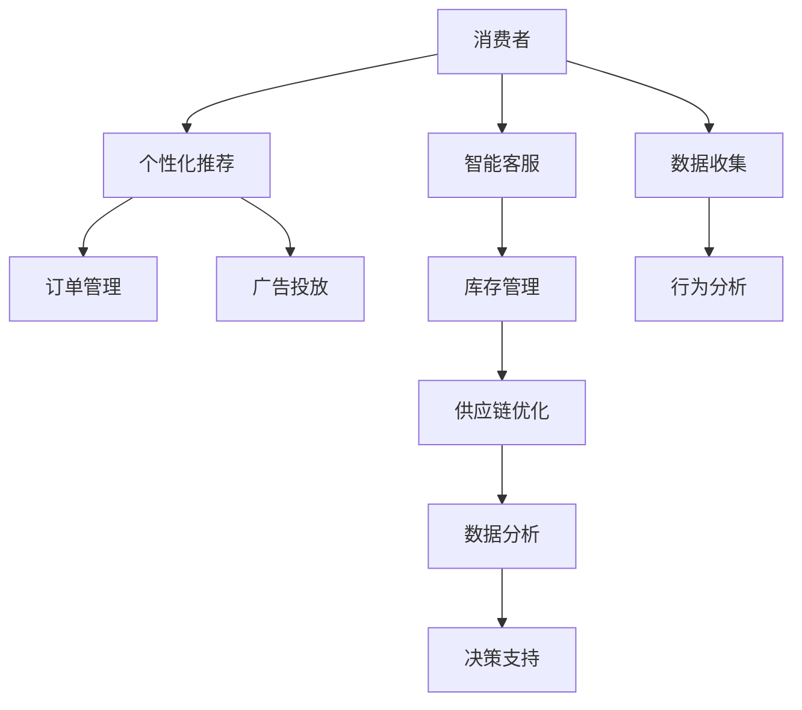

                 

# AIGC推动零售行业变革

> 关键词：AI生成内容(AIGC), 零售行业, 消费者体验, 精准营销, 个性化推荐, 智能客服, 供应链优化, 数据分析

## 1. 背景介绍

随着人工智能(AI)和生成式对抗网络(GAN)技术的不断发展，人工智能生成内容(AIGC)已成为一个热门话题。如今，AIGC技术不仅仅局限于影视娱乐行业，在零售行业的应用同样引人瞩目。在数字化、线上化、个性化成为行业发展趋势的背景下，AIGC技术正在通过多维度重塑零售业态。本文将详细介绍AIGC技术如何在零售行业中发挥其变革性作用，探索其核心概念和应用潜力。

## 2. 核心概念与联系

### 2.1 核心概念概述

AIGC技术，即AI生成内容，是指利用人工智能生成具有高度逼真性和创意性的多媒体内容，包括文本、图像、音频、视频等。AIGC技术通过深度学习等算法，实现了从生成文本到生成多媒体内容的一体化解决方案。AIGC技术在零售行业的应用主要体现在以下几个方面：

- **消费者体验**：通过个性化推荐、虚拟试穿、智能客服等形式，提升用户购物体验。
- **精准营销**：通过分析消费者行为和偏好，进行精准的广告投放和个性化推荐。
- **库存管理**：通过智能分析预测销售趋势，优化库存管理，减少库存积压和缺货。
- **供应链优化**：通过实时数据监控和智能调度，提升供应链效率，降低物流成本。
- **数据分析**：通过生成式数据分析，从海量数据中挖掘出有价值的信息，支持决策。

这些应用领域之间存在紧密的联系，通过AIGC技术的融合和集成，零售企业可以在提升用户体验的同时，降低运营成本，提高整体竞争力。

### 2.2 核心概念原理和架构的 Mermaid 流程图



这个流程图展示了AIGC技术在零售行业中的主要应用路径和数据流转方式。

## 3. 核心算法原理 & 具体操作步骤

### 3.1 算法原理概述

AIGC技术在零售行业的应用涉及多个领域，包括个性化推荐、智能客服、库存管理、供应链优化和数据分析。其中，个性化推荐和智能客服是典型的NLP应用，库存管理和供应链优化涉及时间序列预测和优化，数据分析则需要复杂的深度学习模型。下面我们将分别介绍这些领域的算法原理。

### 3.2 算法步骤详解

#### 个性化推荐

个性化推荐的核心在于通过用户行为数据，预测用户的兴趣点，并推荐相关商品。传统的推荐系统采用协同过滤、基于内容的推荐等方法，但这些方法在处理海量数据时存在效率和效果问题。AIGC技术通过深度学习模型，可以处理大规模数据，同时也能通过生成对抗网络(GAN)等技术，生成逼真的商品描述和图片，提高推荐效果。

**步骤1**：数据收集。收集用户的历史浏览、点击、购买记录，以及商品的基本信息。

**步骤2**：特征工程。对用户行为和商品信息进行特征提取，生成向量表示。

**步骤3**：模型训练。使用深度学习模型对用户-商品关系进行建模，生成推荐结果。

**步骤4**：结果优化。通过A/B测试等方法，优化推荐算法，提升点击率和转化率。

#### 智能客服

智能客服的核心在于通过自然语言处理(NLP)技术，理解用户意图，提供即时响应。传统的客服系统依赖人工客服，成本高、效率低。AIGC技术可以通过预训练语言模型和微调技术，快速构建智能客服系统，支持自然语言理解、多轮对话等复杂任务。

**步骤1**：数据收集。收集用户与客服的历史对话记录，标注意图和实体信息。

**步骤2**：模型预训练。在预训练语言模型上，对意图识别、实体抽取、对话生成等任务进行预训练。

**步骤3**：任务微调。在标注数据上，对意图识别、实体抽取、对话生成等任务进行微调。

**步骤4**：上线部署。将微调后的模型部署到生产环境，提供实时客服服务。

#### 库存管理

库存管理的核心在于通过时间序列预测，优化库存水平，减少库存积压和缺货。传统的库存管理依赖于经验法则，容易产生偏差。AIGC技术可以通过深度学习模型，结合时序分析和生成对抗网络，实现高精度的预测和优化。

**步骤1**：数据收集。收集历史销售数据、促销活动、季节性因素等。

**步骤2**：模型训练。使用LSTM、GRU等时间序列模型对销售趋势进行建模，生成预测结果。

**步骤3**：优化库存。根据预测结果，调整库存水平，平衡库存量与需求。

**步骤4**：实时监控。通过在线监控，及时调整库存策略，应对突发情况。

#### 供应链优化

供应链优化涉及物流调度和货物配送等多个环节，传统的供应链优化依赖于手工调度和经验法则。AIGC技术可以通过深度学习和优化算法，实现供应链的自动化和智能化。

**步骤1**：数据收集。收集物流、订单、库存等数据。

**步骤2**：模型训练。使用优化算法对物流调度和货物配送进行建模，生成最优方案。

**步骤3**：实时调度。通过在线调度系统，实时调整物流和配送策略。

**步骤4**：性能评估。通过评估指标，如物流成本、配送时间等，优化供应链策略。

#### 数据分析

数据分析的核心在于从海量数据中提取有价值的信息，支持决策。传统的分析方法依赖于人工数据分析，效率低、成本高。AIGC技术可以通过生成式数据分析模型，快速处理和分析数据。

**步骤1**：数据收集。收集历史销售数据、用户行为数据等。

**步骤2**：模型训练。使用生成对抗网络(GAN)等模型，对数据进行生成和分析。

**步骤3**：生成报告。生成可视化的分析报告，支持决策。

**步骤4**：持续优化。根据分析结果，不断优化模型和策略。

### 3.3 算法优缺点

#### 个性化推荐

**优点**：
- 高效处理大规模数据。
- 通过生成式内容提升推荐效果。
- 实时响应用户需求。

**缺点**：
- 需要大规模标注数据。
- 模型复杂度高，计算资源需求大。
- 模型效果依赖于数据质量。

#### 智能客服

**优点**：
- 降低人工成本。
- 提高响应速度和效率。
- 提高用户体验。

**缺点**：
- 对标注数据质量要求高。
- 模型效果依赖于语言模型质量。
- 处理复杂对话效果有限。

#### 库存管理

**优点**：
- 实时预测销售趋势。
- 优化库存管理，降低成本。
- 提高供应链效率。

**缺点**：
- 数据质量要求高。
- 模型复杂度高，计算资源需求大。
- 模型效果依赖于数据质量。

#### 供应链优化

**优点**：
- 实时优化物流和配送策略。
- 提高供应链效率，降低成本。
- 提高服务质量。

**缺点**：
- 数据质量要求高。
- 模型复杂度高，计算资源需求大。
- 模型效果依赖于数据质量。

#### 数据分析

**优点**：
- 快速处理和分析海量数据。
- 生成可视化报告，支持决策。
- 不断优化模型和策略。

**缺点**：
- 模型复杂度高，计算资源需求大。
- 模型效果依赖于数据质量。
- 数据隐私和安全问题。

### 3.4 算法应用领域

AIGC技术在零售行业的应用领域非常广泛，包括但不限于以下几个方面：

- **个性化推荐**：通过分析用户行为数据，生成个性化推荐商品，提升用户体验和销售转化率。
- **智能客服**：通过自然语言处理技术，提供24小时在线客服，提升用户满意度。
- **库存管理**：通过预测销售趋势，优化库存水平，降低库存积压和缺货，提高资金利用率。
- **供应链优化**：通过实时监控和智能调度，优化物流和配送策略，提高供应链效率，降低成本。
- **数据分析**：通过生成式数据分析模型，从海量数据中提取有价值的信息，支持决策。

## 4. 数学模型和公式 & 详细讲解 & 举例说明

### 4.1 数学模型构建

AIGC技术在零售行业的应用涉及多个数学模型，下面以生成对抗网络(GAN)为例，介绍其数学模型构建过程。

GAN模型由生成器和判别器两个部分组成，生成器负责生成逼真的数据，判别器负责判断数据是否真实。

**生成器模型**：
$$
G(z) = \mu + \sigma z
$$

**判别器模型**：
$$
D(x) = W_{1}(W_{2}x)
$$

其中，$G$ 为生成器，$D$ 为判别器，$z$ 为噪声向量，$W_1$ 和 $W_2$ 为判别器的权重参数。

### 4.2 公式推导过程

#### 生成对抗网络

**生成器模型**：
$$
G(z) = \mu + \sigma z
$$

**判别器模型**：
$$
D(x) = W_{1}(W_{2}x)
$$

其中，$G$ 为生成器，$D$ 为判别器，$z$ 为噪声向量，$W_1$ 和 $W_2$ 为判别器的权重参数。

**损失函数**：
$$
L(G, D) = E_{z}[\log D(G(z))] + E_{x}[\log(1 - D(x))]
$$

### 4.3 案例分析与讲解

假设零售企业希望通过AIGC技术生成高质量的商品图片，以提升用户的购物体验。

**步骤1**：收集大量真实商品图片作为训练数据。

**步骤2**：定义生成器和判别器的架构。

**步骤3**：初始化生成器和判别器的参数。

**步骤4**：使用随机噪声向量 $z$，生成假图片 $G(z)$。

**步骤5**：将真实图片和假图片输入判别器，计算损失函数 $L(G, D)$。

**步骤6**：使用梯度下降算法，更新生成器和判别器的参数。

**步骤7**：重复步骤4-6，直到生成器和判别器的性能收敛。

## 5. 项目实践：代码实例和详细解释说明

### 5.1 开发环境搭建

在进行AIGC项目实践前，我们需要准备好开发环境。以下是使用Python进行TensorFlow开发的环境配置流程：

1. 安装Anaconda：从官网下载并安装Anaconda，用于创建独立的Python环境。

2. 创建并激活虚拟环境：
```bash
conda create -n tensorflow-env python=3.8 
conda activate tensorflow-env
```

3. 安装TensorFlow：根据CUDA版本，从官网获取对应的安装命令。例如：
```bash
conda install tensorflow==2.7 -c pytorch -c conda-forge
```

4. 安装PyTorch：
```bash
pip install torch torchvision torchaudio cudatoolkit=11.1 -c pytorch -c conda-forge
```

5. 安装TensorBoard：
```bash
pip install tensorboard
```

完成上述步骤后，即可在`tensorflow-env`环境中开始AIGC项目的开发。

### 5.2 源代码详细实现

这里我们以生成式商品图片为例，给出使用TensorFlow和Keras进行GAN模型训练的Python代码实现。

```python
import tensorflow as tf
from tensorflow.keras import layers

# 生成器模型
def make_generator_model():
    model = tf.keras.Sequential()
    model.add(layers.Dense(256, use_bias=False, input_shape=(100,)))
    model.add(layers.BatchNormalization())
    model.add(layers.LeakyReLU(alpha=0.2))
    model.add(layers.Reshape((8, 8, 256)))
    model.add(layers.Conv2DTranspose(128, (5, 5), strides=(1, 1), padding='same', use_bias=False))
    model.add(layers.BatchNormalization())
    model.add(layers.LeakyReLU(alpha=0.2))
    model.add(layers.Conv2DTranspose(64, (5, 5), strides=(2, 2), padding='same', use_bias=False))
    model.add(layers.BatchNormalization())
    model.add(layers.LeakyReLU(alpha=0.2))
    model.add(layers.Conv2DTranspose(3, (5, 5), strides=(2, 2), padding='same', use_bias=False, activation='tanh'))
    return model

# 判别器模型
def make_discriminator_model():
    model = tf.keras.Sequential()
    model.add(layers.Conv2D(64, (5, 5), strides=(2, 2), padding='same',
                           input_shape=[28, 28, 3]))
    model.add(layers.LeakyReLU(alpha=0.2))
    model.add(layers.Dropout(0.3))
    model.add(layers.Conv2D(128, (5, 5), strides=(2, 2), padding='same'))
    model.add(layers.LeakyReLU(alpha=0.2))
    model.add(layers.Dropout(0.3))
    model.add(layers.Flatten())
    model.add(layers.Dense(1))
    return model

# 定义损失函数和优化器
cross_entropy = tf.keras.losses.BinaryCrossentropy(from_logits=True)

def loss_fn(real_output, fake_output):
    real_loss = cross_entropy(tf.ones_like(real_output), real_output)
    fake_loss = cross_entropy(tf.zeros_like(fake_output), fake_output)
    total_loss = real_loss + fake_loss
    return total_loss

optimizer = tf.keras.optimizers.Adam(learning_rate=0.0002, beta_1=0.5)

# 训练函数
def train_step(images, epoch):
    noise = tf.random.normal([BATCH_SIZE, 100])
    with tf.GradientTape() as gen_tape, tf.GradientTape() as disc_tape:
        generated_images = generator(noise, training=True)
        real_output = discriminator(images, training=True)
        fake_output = discriminator(generated_images, training=True)
        gen_loss = loss_fn(real_output, fake_output)
        disc_loss = loss_fn(real_output, fake_output)
    gradients_of_generator = gen_tape.gradient(gen_loss, generator.trainable_variables)
    gradients_of_discriminator = disc_tape.gradient(disc_loss, discriminator.trainable_variables)
    optimizer_generator.apply_gradients(zip(gradients_of_generator, generator.trainable_variables))
    optimizer_discriminator.apply_gradients(zip(gradients_of_discriminator, discriminator.trainable_variables))
```

### 5.3 代码解读与分析

让我们再详细解读一下关键代码的实现细节：

**make_generator_model函数**：
- 定义生成器模型，包含多个卷积和批归一化层，最后使用tanh激活函数。

**make_discriminator_model函数**：
- 定义判别器模型，包含多个卷积和批归一化层，最后使用sigmoid激活函数。

**loss_fn函数**：
- 定义损失函数，使用二元交叉熵计算真实图片和假图片的判别器输出，并将真实图片和假图片的损失相加。

**optimizer函数**：
- 定义优化器，使用Adam优化器。

**train_step函数**：
- 定义训练步骤，在每个epoch中，生成随机噪声向量，计算生成器输出和判别器输出，计算损失函数，使用梯度下降更新生成器和判别器参数。

## 6. 实际应用场景

### 6.1 智能客服

智能客服系统可以显著提升客户服务效率和体验。通过AIGC技术，智能客服系统可以自然流畅地理解和回应客户的问题，同时还可以进行对话记录分析，不断优化响应策略。例如，零售企业可以使用智能客服系统，解答常见问题，提供个性化推荐，甚至帮助客户进行复杂订单的跟踪和处理。

### 6.2 个性化推荐

个性化推荐系统通过分析用户的历史行为和偏好，生成个性化的商品推荐，提升用户满意度和转化率。通过AIGC技术，推荐系统可以生成高质量的商品图片和描述，增强推荐效果。例如，某零售企业可以利用AIGC技术生成逼真的商品图片和描述，增加用户对商品的兴趣和购买意愿。

### 6.3 库存管理

库存管理是零售企业的重要环节，通过AIGC技术，可以优化库存水平，减少库存积压和缺货。例如，某零售企业可以使用AIGC技术生成预测销售趋势的模型，根据销售数据和季节性因素，预测商品需求，优化库存管理策略。

### 6.4 供应链优化

供应链优化涉及物流调度和货物配送等多个环节，通过AIGC技术，可以实现供应链的自动化和智能化。例如，某零售企业可以使用AIGC技术生成物流调度和货物配送的优化模型，实时监控物流状态，动态调整配送策略，降低物流成本，提高配送效率。

## 7. 工具和资源推荐

### 7.1 学习资源推荐

为了帮助开发者系统掌握AIGC技术在零售行业的应用，这里推荐一些优质的学习资源：

1. TensorFlow官方文档：TensorFlow官方提供的文档和教程，详细介绍了TensorFlow的使用和应用。

2. Keras官方文档：Keras官方提供的文档和教程，详细介绍了Keras的使用和应用。

3. Coursera《深度学习专项课程》：由斯坦福大学教授Andrew Ng主讲的深度学习课程，涵盖深度学习的基本概念和实践技术。

4. Udacity《深度学习纳米学位》：Udacity提供的深度学习课程，涵盖深度学习模型的构建和应用。

5. GitHub上的AIGC项目：GitHub上的大量AIGC项目，可以学习到实际应用的代码实现和技术细节。

通过对这些资源的学习实践，相信你一定能够快速掌握AIGC技术在零售行业的应用，并用于解决实际的零售问题。

### 7.2 开发工具推荐

高效的开发离不开优秀的工具支持。以下是几款用于AIGC开发的工具：

1. PyTorch：基于Python的开源深度学习框架，灵活动态的计算图，适合快速迭代研究。

2. TensorFlow：由Google主导开发的开源深度学习框架，生产部署方便，适合大规模工程应用。

3. Keras：高层次的深度学习框架，易于上手，适合快速原型开发。

4. Weights & Biases：模型训练的实验跟踪工具，可以记录和可视化模型训练过程中的各项指标，方便对比和调优。

5. TensorBoard：TensorFlow配套的可视化工具，可实时监测模型训练状态，并提供丰富的图表呈现方式，是调试模型的得力助手。

合理利用这些工具，可以显著提升AIGC项目的开发效率，加快创新迭代的步伐。

### 7.3 相关论文推荐

AIGC技术的发展源于学界的持续研究。以下是几篇奠基性的相关论文，推荐阅读：

1. Generative Adversarial Networks（即GAN论文）：Ian Goodfellow等人提出的生成对抗网络，奠定了生成式对抗网络的研究基础。

2. Conditional GANs for Image Synthesis：Alec Radford等人提出的条件生成对抗网络，用于生成高质量的图像。

3. Semi-Supervised Text Generation with Pre-Trained Language Models：Alexander M. Rush等人提出的半监督文本生成模型，利用预训练语言模型进行文本生成。

4. DALL·E：OpenAI提出的基于深度学习的文本到图像生成模型，可以生成逼真的图像。

5. PidiNet：谷歌提出的生成式对抗网络，用于生成高质量的图像和音频。

这些论文代表了大规模生成对抗网络的发展脉络。通过学习这些前沿成果，可以帮助研究者把握学科前进方向，激发更多的创新灵感。

## 8. 总结：未来发展趋势与挑战

### 8.1 总结

本文对AIGC技术在零售行业的应用进行了全面系统的介绍。首先阐述了AIGC技术在零售行业中的重要性和应用价值，明确了AIGC在消费者体验、精准营销、个性化推荐、智能客服、供应链优化和数据分析等多个领域的作用。其次，从原理到实践，详细讲解了AIGC技术在零售行业的核心算法和操作步骤，给出了AIGC项目开发的完整代码实例。同时，本文还探讨了AIGC技术在零售行业中的实际应用场景，展示了AIGC技术的巨大潜力。最后，本文精选了AIGC技术的各类学习资源，力求为读者提供全方位的技术指引。

通过本文的系统梳理，可以看到，AIGC技术正在通过多维度重塑零售业态，提升用户体验和运营效率，带来革命性的变革。未来，伴随AIGC技术的不断发展，零售行业必将迎来更多的创新应用，为消费者提供更加智能化、个性化的服务。

### 8.2 未来发展趋势

展望未来，AIGC技术在零售行业的应用将呈现以下几个发展趋势：

1. **自动化程度提升**：随着AIGC技术的进步，自动化程度将不断提升，智能客服、个性化推荐、库存管理和供应链优化等任务将更加智能化和自动化。

2. **个性化推荐精准化**：AIGC技术将进一步提升个性化推荐的精准度，通过深度学习和大数据分析，生成更加逼真和个性化的内容。

3. **消费者体验优化**：AIGC技术将不断优化消费者的购物体验，通过智能客服、虚拟试穿、个性化推荐等形式，提升用户的满意度。

4. **数据驱动决策**：AIGC技术将更深入地融合数据驱动决策，通过生成式数据分析模型，从海量数据中提取有价值的信息，支持企业决策。

5. **多模态融合**：AIGC技术将融合视觉、语音、文本等多模态数据，提升用户体验和决策支持。

以上趋势凸显了AIGC技术的广阔前景。这些方向的探索发展，必将进一步提升零售行业的智能化和个性化水平，为消费者带来更优质的购物体验。

### 8.3 面临的挑战

尽管AIGC技术在零售行业的应用取得了显著成效，但在迈向更加智能化、普适化应用的过程中，它仍面临着诸多挑战：

1. **数据质量问题**：AIGC技术对数据质量的要求非常高，低质量的数据将直接影响模型的效果。如何获取和清洗高质量的数据，是一个重大挑战。

2. **模型复杂度高**：AIGC模型的训练和推理复杂度较高，需要高性能的计算资源。如何优化模型结构和算法，降低计算成本，是一个重要问题。

3. **伦理和隐私问题**：AIGC技术可能涉及用户隐私和伦理问题，如何在保障用户隐私的同时，实现模型的智能化和个性化，是一个需要解决的问题。

4. **模型可解释性不足**：AIGC模型通常具有“黑盒”特性，难以解释其内部工作机制和决策逻辑。如何在保障用户隐私的同时，实现模型的智能化和个性化，是一个需要解决的问题。

5. **跨平台兼容性**：AIGC技术需要跨平台部署，如何实现不同平台之间的兼容性和一致性，是一个需要解决的问题。

6. **技术成熟度不足**：AIGC技术仍处于发展阶段，相关技术还不成熟，存在一定的技术风险。

正视AIGC技术面临的这些挑战，积极应对并寻求突破，将使AIGC技术在零售行业走向成熟，推动零售行业的数字化转型。

### 8.4 研究展望

面对AIGC技术在零售行业的应用，未来的研究需要在以下几个方面寻求新的突破：

1. **数据质量提升**：如何获取和清洗高质量的数据，是AIGC技术应用的前提。需要开发更加高效的数据清洗和标注技术，提升数据质量。

2. **模型结构优化**：如何优化AIGC模型的结构和算法，降低计算成本，提高模型效率，是AIGC技术应用的关键。需要开发更加高效的模型结构，如卷积神经网络、注意力机制等。

3. **多模态数据融合**：如何融合视觉、语音、文本等多模态数据，提升用户体验和决策支持，是AIGC技术应用的重要方向。需要开发更加高效的多模态融合技术。

4. **模型可解释性提升**：如何提升AIGC模型的可解释性，增强用户对模型的信任和接受度，是AIGC技术应用的重要保障。需要开发更加可解释的模型结构，如透明网络、可解释生成对抗网络等。

5. **跨平台兼容性增强**：如何实现不同平台之间的兼容性和一致性，是AIGC技术应用的重要问题。需要开发更加兼容性的模型和工具。

6. **技术成熟度提升**：如何提升AIGC技术的成熟度，降低技术风险，是AIGC技术应用的重要目标。需要开发更加成熟的技术框架和工具。

这些研究方向将引领AIGC技术在零售行业走向更高的台阶，为零售行业的数字化转型提供新的技术路径。

## 9. 附录：常见问题与解答

**Q1：AIGC技术在零售行业有哪些具体应用？**

A: AIGC技术在零售行业的应用非常广泛，具体包括：

1. **个性化推荐**：通过分析用户行为数据，生成个性化的商品推荐，提升用户满意度和转化率。

2. **智能客服**：通过自然语言处理技术，提供24小时在线客服，提升客户服务效率和体验。

3. **库存管理**：通过预测销售趋势，优化库存水平，减少库存积压和缺货，提高资金利用率。

4. **供应链优化**：通过实时监控和智能调度，优化物流和配送策略，降低物流成本，提高配送效率。

5. **数据分析**：通过生成式数据分析模型，从海量数据中提取有价值的信息，支持企业决策。

6. **虚拟试穿**：通过生成逼真的商品图片和描述，增强用户的购物体验。

7. **广告生成**：通过生成高质量的广告内容，提升广告效果和用户体验。

8. **客户行为分析**：通过生成式数据分析模型，分析客户行为数据，提升客户分析能力。

**Q2：AIGC技术在零售行业的应用有哪些优势？**

A: AIGC技术在零售行业的应用具有以下优势：

1. **提升用户体验**：通过生成高质量的商品图片和描述，增强用户的购物体验。

2. **提高运营效率**：通过智能客服、库存管理和供应链优化等应用，提高运营效率和客户满意度。

3. **优化资源配置**：通过数据分析和决策支持，优化资源配置和运营策略。

4. **降低成本**：通过自动化和智能化应用，降低人工成本和运营成本。

5. **提高竞争力**：通过个性化推荐和精准营销，提升企业竞争力，扩大市场份额。

6. **数据驱动决策**：通过生成式数据分析模型，从海量数据中提取有价值的信息，支持企业决策。

7. **实时响应**：通过智能客服和数据分析，实现实时响应和决策。

**Q3：AIGC技术在零售行业的应用需要哪些技术和工具支持？**

A: AIGC技术在零售行业的应用需要以下技术和工具支持：

1. **深度学习框架**：如TensorFlow、PyTorch、Keras等深度学习框架。

2. **数据处理工具**：如Pandas、NumPy等数据处理工具。

3. **可视化工具**：如TensorBoard、Weights & Biases等可视化工具。

4. **自然语言处理工具**：如BERT、GPT等自然语言处理工具。

5. **生成对抗网络**：如GAN、Conditional GAN等生成对抗网络工具。

6. **高性能计算资源**：如GPU、TPU等高性能计算资源。

**Q4：如何保障AIGC技术的伦理和隐私？**

A: 保障AIGC技术的伦理和隐私，可以从以下几个方面进行：

1. **数据匿名化**：对用户数据进行匿名化处理，保障用户隐私。

2. **公平性设计**：设计公平的生成模型，避免模型偏见和歧视。

3. **透明度提升**：提升AIGC模型的可解释性，增强用户对模型的信任和接受度。

4. **用户控制权**：赋予用户数据控制权，允许用户对其数据进行管理和删除。

5. **伦理审查机制**：建立伦理审查机制，对AIGC技术应用进行伦理审查和评估。

**Q5：AIGC技术在零售行业的应用前景如何？**

A: AIGC技术在零售行业的应用前景非常广阔，未来将呈现以下几个趋势：

1. **自动化程度提升**：随着AIGC技术的进步，自动化程度将不断提升，智能客服、个性化推荐、库存管理和供应链优化等任务将更加智能化和自动化。

2. **个性化推荐精准化**：AIGC技术将进一步提升个性化推荐的精准度，通过深度学习和大数据分析，生成更加逼真和个性化的内容。

3. **消费者体验优化**：AIGC技术将不断优化消费者的购物体验，通过智能客服、虚拟试穿、个性化推荐等形式，提升用户的满意度。

4. **数据驱动决策**：AIGC技术将更深入地融合数据驱动决策，通过生成式数据分析模型，从海量数据中提取有价值的信息，支持企业决策。

5. **多模态融合**：AIGC技术将融合视觉、语音、文本等多模态数据，提升用户体验和决策支持。

6. **实时响应**：通过智能客服和数据分析，实现实时响应和决策。

综上所述，AIGC技术在零售行业的应用前景非常广阔，未来必将引领零售行业的数字化转型，为消费者带来更加智能化、个性化的服务。

---

作者：禅与计算机程序设计艺术 / Zen and the Art of Computer Programming

