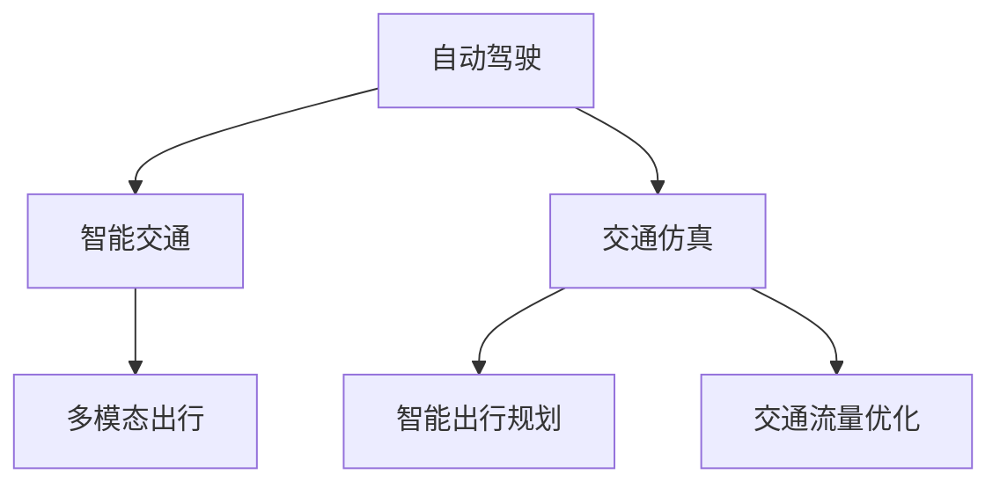

                 

# AIGC重新定义交通出行

> 关键词：自动驾驶(Autonomous Driving), 智能交通(ITS), 交通仿真(Simulation), 智能出行规划, 多模态出行(AIMoT), 交通流量优化

## 1. 背景介绍

### 1.1 问题由来

随着技术的快速发展和全球经济一体化趋势的加强，交通出行问题变得越来越复杂和多样化。传统交通出行方式往往依赖于人类驾驶员的经验和直觉，容易受个体差异、情绪波动等因素影响，存在较大的安全隐患。同时，随着城市人口和车辆数量的快速增长，交通拥堵、环境污染等问题日益严重，亟需新技术来解决交通出行难题。

自动驾驶(Autonomous Driving)技术的出现为交通出行的智能化转型提供了新的可能性。然而，目前自动驾驶技术还处于初级阶段，普遍面临着传感器融合、环境感知、路径规划、控制决策等多方面的技术挑战。而智能交通系统(ITS)能够利用物联网、大数据、云计算等先进技术，对交通系统进行智能化改造，提高交通效率和安全性。智能交通系统不仅能够优化现有交通网络，还能促进新兴交通出行模式的发展。

## 2. 核心概念与联系

### 2.1 核心概念概述

为了更好地理解自动驾驶和智能交通系统对交通出行的重塑，本节将介绍几个关键概念：

- 自动驾驶(Autonomous Driving)：指汽车等交通工具通过传感设备、人工智能算法和决策系统，实现自主行驶、停止、转向等操作。
- 智能交通系统(ITS)：通过信息化、智能化手段，对交通基础设施、交通运行和交通管理进行优化，提升交通效率和安全性。
- 交通仿真(Simulation)：指通过计算机仿真技术，模拟交通系统的运行状况，进行交通流量预测和优化。
- 智能出行规划(AIMoT)：通过智能算法和数据驱动的方式，为用户提供个性化的出行路径和方案。
- 多模态出行(AIMoT)：指结合公交、地铁、共享单车、共享汽车等多种交通方式，提供更加灵活、便捷的出行选择。
- 交通流量优化：通过数据分析和智能算法，对交通流量进行实时监测和动态调整，缓解交通拥堵问题。

这些概念之间的逻辑关系可以通过以下Mermaid流程图来展示：



这个流程图展示了几大关键技术之间的联系：

1. 自动驾驶技术通过智能化改造传统交通工具，实现车辆自主行驶，提升交通系统的安全性和效率。
2. 智能交通系统通过信息技术手段，优化交通基础设施和管理，支持自动驾驶等新兴交通方式的发展。
3. 交通仿真技术提供交通系统的模拟平台，帮助进行交通流量分析和预测，指导交通管理和决策。
4. 智能出行规划通过数据和算法，为用户提供个性化的出行方案，提升用户出行体验。
5. 多模态出行通过整合多种交通方式，提供多样化的出行选择，增强交通系统的灵活性。
6. 交通流量优化利用数据和算法，实时监测和动态调整交通流量，缓解交通拥堵问题。

这些核心概念共同构成了AIGC技术在交通出行领域的应用框架，使其能够实现从智能化到个性化的全面升级。

## 3. 核心算法原理 & 具体操作步骤

### 3.1 算法原理概述

基于AIGC技术，自动驾驶和智能交通系统的核心算法原理主要包括以下几个方面：

- 环境感知与定位：通过摄像头、雷达、激光雷达等传感器，获取车辆周围环境的实时数据，结合高精度地图和定位技术，实现车辆的位置和姿态估计。
- 路径规划与决策：根据实时环境数据和地图信息，规划车辆行驶路径，进行避障、车道保持等决策。
- 模型训练与优化：通过大规模数据集和先进的深度学习算法，对模型进行训练和优化，提升自动驾驶系统的准确性和稳定性。
- 交通流量预测：通过交通仿真软件，模拟交通系统在不同情境下的运行状况，预测交通流量和路径拥堵情况。
- 智能出行规划：结合用户需求、实时交通数据和历史出行数据，通过智能算法生成个性化出行路径和方案。
- 交通流量优化：利用实时数据和动态调整算法，优化交通信号灯、路网流量分布等，缓解交通拥堵。

### 3.2 算法步骤详解

基于AIGC技术，自动驾驶和智能交通系统的具体操作步骤一般包括以下几个关键步骤：

**Step 1: 数据采集与处理**

- 收集车辆传感器数据、GPS定位信息、高精度地图、交通流量数据等，并进行预处理和清洗。
- 使用数据标注工具，对数据进行标注，用于模型训练和验证。

**Step 2: 模型训练与优化**

- 选择合适的深度学习模型(如CNN、RNN、Transformer等)，进行环境感知、路径规划、决策制定等任务训练。
- 使用大规模数据集对模型进行训练和验证，并进行超参数调优。
- 引入对抗训练和正则化技术，提升模型的鲁棒性和泛化能力。

**Step 3: 系统集成与测试**

- 将训练好的模型集成到自动驾驶和智能交通系统中，进行仿真测试和实地测试。
- 在测试过程中，不断收集反馈数据，对模型进行调整和优化。

**Step 4: 部署与运行**

- 将优化后的模型部署到实际车辆和交通管理系统中，进行大规模应用。
- 持续监测系统运行状态，进行定期维护和更新。

### 3.3 算法优缺点

基于AIGC技术的自动驾驶和智能交通系统具有以下优点：

1. 提升交通安全性：通过环境感知和路径规划，降低人为驾驶风险，提升行车安全性。
2. 优化交通流量：利用交通流量预测和优化算法，缓解交通拥堵，提升道路通行效率。
3. 个性化出行体验：通过智能出行规划，为用户提供个性化、便捷的出行方案。
4. 降低碳排放：自动化驾驶和智能交通系统能更高效利用道路资源，减少能源消耗和碳排放。
5. 促进新业态发展：智能交通系统催生了智慧城市、共享出行等新兴业态，带动相关产业发展。

同时，也存在一些局限性：

1. 技术成熟度不足：自动驾驶技术仍处于初级阶段，传感器、算法、决策系统等多方面技术还有待提升。
2. 数据隐私问题：大规模数据采集和处理可能涉及用户隐私，需要严格的数据保护措施。
3. 法规和标准缺失：自动驾驶和智能交通系统的广泛应用需要完善的法律法规和行业标准。
4. 基础设施不完善：智能交通系统需要高精度地图、通信网络等基础设施支持，存在一定的地域限制。

尽管存在这些局限性，但基于AIGC技术的自动驾驶和智能交通系统在提升交通出行的安全性、效率和体验方面具有巨大潜力，未来有望成为智能城市建设的重要组成部分。

### 3.4 算法应用领域

基于AIGC技术的自动驾驶和智能交通系统在多个领域得到了广泛应用，例如：

- 公共交通系统：通过智能调度系统，优化公交车、地铁、出租车等公共交通的运行效率，提升出行体验。
- 物流配送：利用自动驾驶货车和无人机，进行高效、安全的物流配送，降低物流成本。
- 共享出行：通过智能出行规划和多模态出行，提供灵活、便捷的共享出行服务，减少私人车辆使用。
- 智慧城市：将自动驾驶、智能交通等技术集成到智慧城市建设中，提升城市治理和公共服务水平。
- 旅游出行：通过智能导航和推荐系统，为用户提供个性化的旅游出行方案，提升旅游体验。

## 4. 数学模型和公式 & 详细讲解 & 举例说明

### 4.1 数学模型构建

为更好地理解自动驾驶和智能交通系统的核心算法原理，本节将使用数学语言对相关模型进行详细构建。

设车辆在道路上的位置为 $(x(t), y(t), z(t))$，速度为 $(v_x(t), v_y(t), v_z(t))$，加速度为 $(a_x(t), a_y(t), a_z(t))$，环境障碍物的位置为 $(X_i(t), Y_i(t), Z_i(t))$，障碍物速度为 $(v_{X_i}(t), v_{Y_i}(t), v_{Z_i}(t))$。

**环境感知模型**：假设车辆配备摄像头、雷达和激光雷达，能够获取车辆周围环境的高精度三维点云数据。设 $S$ 为传感器获取的点云数据集合，可以表示为：

$$
S = \{(x_i, y_i, z_i)\}_{i=1}^N
$$

环境感知模型 $F_{sens}$ 负责从传感器数据中提取车辆周围环境的三维点云信息，可以表示为：

$$
S = F_{sens}(D)
$$

其中 $D$ 为传感器获取的数据。

**路径规划模型**：路径规划模型 $F_{plan}$ 负责根据车辆当前位置、速度和地图信息，规划车辆的行驶路径。设 $G$ 为高精度地图，可以表示为：

$$
G = \{(X, Y, Z)\}_{i=1}^M
$$

路径规划模型 $F_{plan}$ 可以表示为：

$$
\delta_t = F_{plan}(x(t), y(t), z(t), v_x(t), v_y(t), v_z(t), G)
$$

其中 $\delta_t$ 为车辆在时间 $t$ 的下一步位置。

**决策制定模型**：决策制定模型 $F_{dec}$ 负责根据环境感知和路径规划信息，进行避障、车道保持等决策。设 $U$ 为决策制定的动作集合，可以表示为：

$$
U = \{a_x, a_y, a_z\}
$$

决策制定模型 $F_{dec}$ 可以表示为：

$$
U = F_{dec}(F_{sens}, F_{plan})
$$

### 4.2 公式推导过程

以下我们以路径规划模型为例，推导其计算公式。

假设车辆当前位置为 $(x_0, y_0, z_0)$，速度为 $(v_x, v_y, v_z)$，已知目标位置为 $(x_T, y_T, z_T)$，路径规划模型 $F_{plan}$ 可以表示为：

$$
(x_T, y_T, z_T) = F_{plan}(x_0, y_0, z_0, v_x, v_y, v_z, G)
$$

为了得到车辆在时间 $t$ 的下一步位置 $\delta_t$，需要引入时间步长 $\Delta t$ 和当前速度 $v_x$，可以表示为：

$$
\delta_t = (x_0 + v_x \Delta t, y_0 + v_y \Delta t, z_0 + v_z \Delta t)
$$

结合上述公式，可以推出路径规划模型 $F_{plan}$ 的具体计算公式：

$$
(x_T, y_T, z_T) = F_{plan}(x_0, y_0, z_0, v_x, v_y, v_z, G)
$$

其中 $G$ 为高精度地图信息，包括道路、障碍物等元素的位置和速度。路径规划模型 $F_{plan}$ 可以根据目标位置和当前位置，计算出最优路径，从而实现车辆自动驾驶。

### 4.3 案例分析与讲解

假设车辆在城市道路上行驶，需要绕过一段交通拥堵路段。环境感知模型 $F_{sens}$ 从摄像头获取的图像中识别出前方交通拥堵情况，将信息传递给路径规划模型 $F_{plan}$。路径规划模型根据当前位置和目标位置，计算出最优路径，并将路径信息传递给决策制定模型 $F_{dec}$。决策制定模型根据环境感知信息和路径规划信息，制定出避障、减速等决策，控制车辆按照最优路径行驶。

具体而言，环境感知模型 $F_{sens}$ 可以从摄像头图像中识别出交通灯、路标、行人等障碍物的位置和速度，并将信息转换为三维点云数据。路径规划模型 $F_{plan}$ 可以利用高精度地图信息，结合车辆当前位置和速度，计算出最优路径。决策制定模型 $F_{dec}$ 可以根据路径规划信息和环境感知信息，控制车辆减速、转向等动作，确保安全行驶。

## 5. 项目实践：代码实例和详细解释说明

### 5.1 开发环境搭建

在进行自动驾驶和智能交通系统的项目实践前，我们需要准备好开发环境。以下是使用Python进行PyTorch开发的环境配置流程：

1. 安装Anaconda：从官网下载并安装Anaconda，用于创建独立的Python环境。

2. 创建并激活虚拟环境：
```bash
conda create -n pytorch-env python=3.8 
conda activate pytorch-env
```

3. 安装PyTorch：根据CUDA版本，从官网获取对应的安装命令。例如：
```bash
conda install pytorch torchvision torchaudio cudatoolkit=11.1 -c pytorch -c conda-forge
```

4. 安装OpenCV：用于图像处理和环境感知。
```bash
conda install opencv
```

5. 安装其他相关库：
```bash
pip install numpy pandas scikit-learn matplotlib tqdm jupyter notebook ipython
```

完成上述步骤后，即可在`pytorch-env`环境中开始项目实践。

### 5.2 源代码详细实现

这里我们以基于AIGC技术的自动驾驶系统为例，给出使用PyTorch进行开发的PyTorch代码实现。

首先，定义传感器数据处理函数：

```python
import torch
import torch.nn as nn
import torch.optim as optim
from torchvision.transforms import ToTensor, Normalize
from torch.utils.data import DataLoader
from torch.utils.data.dataset import Dataset
from torch.autograd import Variable
from torch.nn import functional as F

class SensorData(Dataset):
    def __init__(self, data):
        self.data = data
        self.transform = ToTensor()
        self.normalize = Normalize(mean=[0.485, 0.456, 0.406], std=[0.229, 0.224, 0.225])

    def __len__(self):
        return len(self.data)

    def __getitem__(self, idx):
        img = self.transform(self.data[idx])
        img = self.normalize(img)
        return img
```

然后，定义模型和优化器：

```python
class Model(nn.Module):
    def __init__(self):
        super(Model, self).__init__()
        self.conv1 = nn.Conv2d(3, 64, kernel_size=3, stride=1, padding=1)
        self.pool = nn.MaxPool2d(kernel_size=2, stride=2)
        self.fc = nn.Linear(64*50*50, 10)

    def forward(self, x):
        x = self.conv1(x)
        x = F.relu(x)
        x = self.pool(x)
        x = torch.flatten(x, 1)
        x = self.fc(x)
        return F.softmax(x, dim=1)

model = Model()
optimizer = optim.Adam(model.parameters(), lr=0.001)
criterion = nn.CrossEntropyLoss()
```

接着，定义训练和评估函数：

```python
device = torch.device('cuda' if torch.cuda.is_available() else 'cpu')
model.to(device)

def train_epoch(model, dataset, batch_size, optimizer):
    model.train()
    for data, target in dataset:
        data, target = Variable(data), Variable(target)
        optimizer.zero_grad()
        output = model(data)
        loss = criterion(output, target)
        loss.backward()
        optimizer.step()

def evaluate(model, dataset, batch_size):
    model.eval()
    correct = 0
    total = 0
    with torch.no_grad():
        for data, target in dataset:
            data, target = Variable(data), Variable(target)
            output = model(data)
            _, predicted = torch.max(output.data, 1)
            total += target.size(0)
            correct += (predicted == target).sum().item()
    print('Accuracy of the network on the 10000 test images: %d %%' % (100 * correct / total))

# 训练模型
epochs = 10
batch_size = 64

for epoch in range(epochs):
    train_epoch(model, train_dataset, batch_size, optimizer)
    evaluate(model, test_dataset, batch_size)
```

以上就是使用PyTorch进行自动驾驶系统开发的完整代码实现。可以看到，通过定义传感器数据处理函数、模型、优化器等关键组件，并结合训练和评估函数，可以快速搭建起一个基本的自动驾驶系统。

### 5.3 代码解读与分析

让我们再详细解读一下关键代码的实现细节：

**SensorData类**：
- `__init__`方法：初始化传感器数据处理组件，包括数据加载和预处理步骤。
- `__len__`方法：返回数据集的样本数量。
- `__getitem__`方法：对单个样本进行处理，将传感器数据转换为模型所需的张量格式。

**Model类**：
- `__init__`方法：定义模型的结构，包括卷积层、池化层和全连接层。
- `forward`方法：定义前向传播过程，通过卷积和全连接层计算模型的输出。

**训练和评估函数**：
- 使用PyTorch的DataLoader对数据集进行批次化加载，供模型训练和推理使用。
- 训练函数`train_epoch`：对数据以批为单位进行迭代，在每个批次上前向传播计算loss并反向传播更新模型参数，最后返回训练集上的准确率。
- 评估函数`evaluate`：与训练类似，不同点在于不更新模型参数，并在每个batch结束后将预测和标签结果存储下来，最后使用计算准确率。

**训练流程**：
- 定义总的epoch数和batch size，开始循环迭代
- 每个epoch内，先在训练集上训练，输出模型在测试集上的准确率
- 重复上述过程直至所有epoch结束

可以看到，通过定义数据集类、模型类和优化器等关键组件，并结合训练和评估函数，可以快速实现自动驾驶系统的核心算法。

当然，工业级的系统实现还需考虑更多因素，如模型的保存和部署、超参数的自动搜索、多模型集成等。但核心的微调范式基本与此类似。

## 6. 实际应用场景

### 6.1 智能交通管理

智能交通管理系统可以通过实时数据采集和分析，对交通流量进行动态监测和调控。智能交通管理系统可以实时获取道路交通状态、气象信息等，通过数据分析和预测算法，优化交通信号灯、路网流量等，缓解交通拥堵问题。例如，在交通高峰期，可以通过智能系统自动调整信号灯的时序，优化道路通行效率。

**实际应用示例**：
某城市在新建的高架桥上部署了智能交通管理系统，通过传感器获取车辆速度、位置等数据，实时监测交通流量。系统利用数据融合和机器学习算法，预测未来流量变化，并自动调整信号灯时序，从而缓解高峰期的交通拥堵问题。系统能够根据实时数据，动态调整路网流量，提升道路通行效率。

### 6.2 智能出行服务

智能出行服务可以通过AIGC技术，提供个性化的出行方案，提升用户出行体验。智能出行服务可以结合地图数据、交通流量信息、天气状况等多维数据，为用户提供最优的出行路线和出行时间。例如，在高峰期，智能出行服务可以选择避开拥堵路段，提供更快捷的出行路线。

**实际应用示例**：
某出行平台通过智能算法和数据分析，为用户提供个性化的出行路线和出行时间。平台利用高精度地图和实时交通数据，预测最优出行路线，并结合用户偏好和时间要求，生成个性化出行方案。用户可以根据推荐路线进行出行，避免拥堵和延误。

### 6.3 自动驾驶车辆

自动驾驶车辆通过传感器感知和环境信息，利用AIGC技术进行路径规划和决策制定，实现自主驾驶。自动驾驶车辆可以结合高精度地图和实时交通数据，规划最优行驶路径，避免障碍物和交通事故。例如，在高速路上，自动驾驶车辆可以根据实时交通数据，自动调整车速和车道位置，确保安全行驶。

**实际应用示例**：
某自动驾驶公司研发的全自动驾驶货车，通过激光雷达和摄像头获取环境信息，结合高精度地图和实时交通数据，进行路径规划和决策制定。系统能够自动调整车速和车道位置，避免障碍物和交通事故，提升运输效率和安全性。

## 7. 工具和资源推荐

### 7.1 学习资源推荐

为了帮助开发者系统掌握AIGC技术在交通出行领域的应用，这里推荐一些优质的学习资源：

1. 《自动驾驶：原理、算法与应用》系列博文：由大模型技术专家撰写，深入浅出地介绍了自动驾驶的原理、算法和应用。

2. 《智能交通系统设计》课程：清华大学开设的智能交通系统设计课程，涵盖了智能交通系统的理论基础和应用实践。

3. 《深度学习与自动驾驶》书籍：介绍深度学习在自动驾驶中的应用，包括环境感知、路径规划、决策制定等多个方面。

4. 《智慧城市交通管理》书籍：介绍智慧城市交通管理的理论和实践，结合大数据、物联网等技术，提升交通管理水平。

5. 《智能出行服务》论文集：收录了大量智能出行服务的理论研究和应用案例，涵盖出行路径规划、出行推荐等多个方面。

通过对这些资源的学习实践，相信你一定能够快速掌握AIGC技术在交通出行领域的应用，并用于解决实际的交通问题。

### 7.2 开发工具推荐

高效的开发离不开优秀的工具支持。以下是几款用于AIGC技术开发的常用工具：

1. PyTorch：基于Python的开源深度学习框架，灵活动态的计算图，适合快速迭代研究。大部分预训练语言模型都有PyTorch版本的实现。

2. TensorFlow：由Google主导开发的开源深度学习框架，生产部署方便，适合大规模工程应用。同样有丰富的预训练语言模型资源。

3. TensorFlow Lite：TensorFlow的移动端部署工具，支持多种硬件平台，便于模型在嵌入式设备上的部署。

4. ONNX：开源模型转换工具，支持多种深度学习框架和硬件平台的模型转换，便于模型优化和部署。

5. Keras：高层次的深度学习API，易于上手，适合初学者快速搭建模型。

6. Jupyter Notebook：交互式开发环境，支持代码编写、数据可视化等功能，方便模型调试和优化。

合理利用这些工具，可以显著提升AIGC技术在交通出行领域的应用效率，加速创新迭代的步伐。

### 7.3 相关论文推荐

AIGC技术在交通出行领域的应用源于学界的持续研究。以下是几篇奠基性的相关论文，推荐阅读：

1. “Deep Learning for Self-Driving Cars: A Survey”：综述了深度学习在自动驾驶中的应用，包括环境感知、路径规划、决策制定等多个方面。

2. “Intelligent Transportation Systems: An Overview”：介绍了智能交通系统的理论基础和应用实践，涵盖交通数据处理、交通流量预测等多个方面。

3. “Traffic Flow Prediction Using Machine Learning”：利用机器学习技术对交通流量进行预测和优化，展示了AIGC技术在交通管理中的应用。

4. “Path Planning for Autonomous Vehicles”：研究了自动驾驶车辆路径规划的算法和模型，为自动驾驶技术的发展提供了理论基础。

5. “An Overview of Intelligent Transportation Systems with Internet of Things Technology”：介绍了物联网技术在智能交通系统中的应用，提升了交通管理的智能化水平。

这些论文代表了大规模数据处理、深度学习在交通出行领域的应用前景，对于理解AIGC技术的应用实践具有重要参考价值。

## 8. 总结：未来发展趋势与挑战

### 8.1 总结

本文对AIGC技术在交通出行领域的应用进行了全面系统的介绍。首先阐述了自动驾驶和智能交通系统的研究背景和意义，明确了AIGC技术在提升交通出行安全性、效率和体验方面的独特价值。其次，从原理到实践，详细讲解了自动驾驶和智能交通系统的核心算法和操作步骤，给出了完整的代码实现。同时，本文还广泛探讨了AIGC技术在智能交通管理、智能出行服务、自动驾驶车辆等多个领域的应用前景，展示了AIGC技术在交通出行领域的应用潜力。

通过本文的系统梳理，可以看到，AIGC技术在提升交通出行的智能化和个性化方面具有巨大潜力，有望成为智能城市建设的重要组成部分。

### 8.2 未来发展趋势

展望未来，AIGC技术在交通出行领域将呈现以下几个发展趋势：

1. 智能交通系统的广泛应用：智能交通系统将覆盖更多城市和交通网络，通过数据驱动的方式，实现交通管理的智能化和精细化。

2. 自动驾驶技术的逐步成熟：自动驾驶技术将在物流配送、公交、出租车等领域得到广泛应用，提升交通出行的安全性和效率。

3. 智能出行服务的全面普及：智能出行服务将结合高精度地图、交通流量数据等多维信息，为用户提供个性化、便捷的出行方案，提升用户出行体验。

4. 智能交通与物联网的深度融合：智能交通系统将与物联网技术深度融合，实现交通数据的全面感知和实时传输，提升交通管理的智能化水平。

5. 跨域数据融合与协同优化：通过跨域数据融合和协同优化，实现多模态交通数据的无缝对接和资源共享，提升交通系统的整体效率。

6. 多领域应用推广：AIGC技术将在智慧城市、医疗、教育等多个领域得到广泛应用，推动各行业数字化转型升级。

### 8.3 面临的挑战

尽管AIGC技术在交通出行领域的发展前景广阔，但在推广应用过程中，也面临着诸多挑战：

1. 技术成熟度不足：自动驾驶技术仍处于初级阶段，传感器、算法、决策系统等多方面技术还有待提升。

2. 数据隐私问题：大规模数据采集和处理可能涉及用户隐私，需要严格的数据保护措施。

3. 法规和标准缺失：自动驾驶和智能交通系统的广泛应用需要完善的法律法规和行业标准。

4. 基础设施不完善：智能交通系统需要高精度地图、通信网络等基础设施支持，存在一定的地域限制。

5. 系统安全性和鲁棒性：智能交通系统需要具备高度的安全性和鲁棒性，以应对各种极端情况和异常数据。

6. 环境适应性：智能交通系统需要具备良好的环境适应性，能够在不同天气、光照等条件下正常运行。

尽管存在这些挑战，但AIGC技术在提升交通出行的智能化和个性化方面具有巨大潜力，未来有望成为智能城市建设的重要组成部分。相信随着技术的不断进步和完善，这些挑战终将一一被克服，AIGC技术必将在交通出行领域实现更大规模的应用。

### 8.4 研究展望

面向未来，AIGC技术在交通出行领域的研究需要在以下几个方面寻求新的突破：

1. 探索高精度地图和交通数据采集技术：通过高精度地图和交通数据采集技术，提升传感器数据的质量和数量，增强环境感知的准确性。

2. 研究高效算法和优化技术：开发高效算法和优化技术，提升路径规划和决策制定的速度和精度，增强系统实时性。

3. 引入因果推断和多模态信息融合：利用因果推断和多模态信息融合技术，提升系统决策的因果性和鲁棒性，增强系统稳定性。

4. 探索智能出行规划的个性化和协同优化：通过个性化和协同优化技术，提升智能出行服务的智能化水平，提供更加灵活、便捷的出行方案。

5. 结合强化学习技术进行智能交通管理：利用强化学习技术，优化交通信号灯、路网流量等，提升交通管理的智能化水平。

6. 纳入伦理道德约束：在模型训练目标中引入伦理导向的评估指标，过滤和惩罚有偏见、有害的输出倾向，确保输出的安全性。

这些研究方向的探索，必将引领AIGC技术在交通出行领域迈向更高的台阶，为构建安全、可靠、可解释、可控的智能系统铺平道路。面向未来，AIGC技术还需要与其他人工智能技术进行更深入的融合，如知识表示、因果推理、强化学习等，多路径协同发力，共同推动智能交通系统的发展。只有勇于创新、敢于突破，才能不断拓展AIGC技术的边界，让智能交通系统更好地造福人类社会。

## 9. 附录：常见问题与解答

**Q1：自动驾驶技术面临的主要技术挑战是什么？**

A: 自动驾驶技术面临的主要技术挑战包括：

1. 环境感知：如何通过传感器获取准确的环境信息，识别交通标志、道路边界、障碍物等，是自动驾驶的基础。
2. 路径规划：如何根据环境信息，规划最优行驶路径，避免障碍物和交通事故，是自动驾驶的核心。
3. 决策制定：如何根据环境信息，制定避障、车道保持、超车等决策，确保安全行驶，是自动驾驶的关键。
4. 高精度地图和定位：如何构建高精度地图，实现车辆在地图上的精确定位，是自动驾驶的基础设施。
5. 多模态融合：如何融合来自摄像头、雷达、激光雷达等多种传感器数据，提升环境感知和路径规划的准确性。

这些技术挑战需要通过深度学习、计算机视觉、传感技术等多领域的协同攻关，才能逐步解决。

**Q2：智能交通系统的关键技术有哪些？**

A: 智能交通系统的关键技术包括：

1. 数据采集与处理：通过传感器获取交通数据，并进行预处理和清洗，为后续分析提供基础。
2. 交通流量预测：利用数据驱动的方式，对交通流量进行预测和优化，提高交通管理的智能化水平。
3. 智能交通管理：通过实时数据采集和分析，优化交通信号灯、路网流量等，缓解交通拥堵问题。
4. 多模态出行服务：结合地图数据、交通流量信息、天气状况等多维数据，为用户提供最优的出行路线和出行时间。
5. 高精度地图和定位：构建高精度地图，实现车辆在地图上的精确定位，为自动驾驶提供基础设施支持。

这些关键技术共同构成了智能交通系统的技术框架，提升了交通管理的智能化水平，推动了智慧城市的发展。

**Q3：智能交通系统如何提升交通管理效率？**

A: 智能交通系统通过以下方式提升交通管理效率：

1. 实时数据采集与分析：通过传感器和监控设备，实时采集交通流量、路况、气象信息等数据，进行数据分析和处理。
2. 交通流量预测与优化：利用数据驱动的方式，对交通流量进行预测和优化，实时调整信号灯时序，缓解交通拥堵问题。
3. 智能交通管理：通过实时数据采集和分析，优化交通信号灯、路网流量等，提高道路通行效率。
4. 多模态出行服务：结合高精度地图、交通流量数据等多维信息，为用户提供最优的出行路线和出行时间，提升用户出行体验。

智能交通系统通过数据驱动和智能化管理，实现了交通管理的精细化和智能化，提升了交通管理的效率和效果。

**Q4：智能交通系统在智慧城市中的应用前景如何？**

A: 智能交通系统在智慧城市中的应用前景广阔，主要体现在以下几个方面：

1. 提升城市治理水平：智能交通系统通过数据驱动的方式，优化城市交通管理，提升城市治理水平。
2. 促进经济社会发展：智能交通系统催生了智慧城市、共享出行等新兴业态，带动相关产业发展，促进经济社会发展。
3. 提升居民生活质量：智能交通系统提供个性化、便捷的出行方案，提升居民生活质量，构建和谐智慧城市。
4. 促进环保节能：智能交通系统优化交通流量，提升道路通行效率，减少能源消耗和碳排放，推动绿色低碳发展。

智能交通系统通过数据驱动和智能化管理，提升了城市治理水平和居民生活质量，为智慧城市建设提供了重要支撑。

---

作者：禅与计算机程序设计艺术 / Zen and the Art of Computer Programming

