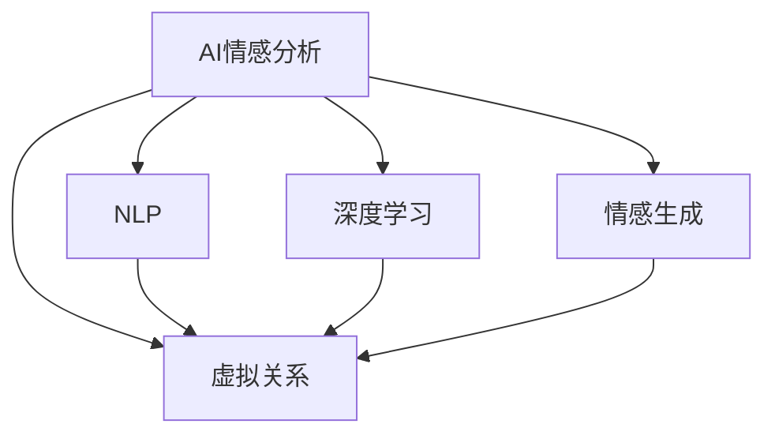

                 

# AI与人类情感：虚拟关系的兴起

> 关键词：AI情感分析, 虚拟关系, 自然语言处理, 深度学习, 人类情感, 人际交往

## 1. 背景介绍

### 1.1 问题由来
随着人工智能技术的发展，尤其是深度学习和大数据技术的成熟，AI与人类情感的结合成为了一个重要的研究方向。人类情感作为社会交往的重要组成部分，其理解和表达对于构建更加智能和人性化的虚拟关系具有重要意义。近年来，虚拟聊天机器人、情感智能助手等应用逐渐普及，极大地改善了人与人之间的交流和互动体验，同时也带来了新的挑战和机遇。

### 1.2 问题核心关键点
AI与人类情感结合的核心在于如何利用AI技术，特别是自然语言处理（NLP）和深度学习技术，更好地理解和生成人类的情感表达。主要问题包括：

- 如何设计有效的情感识别模型，准确理解和提取文本中的情感信息？
- 如何构建合理的情感生成模型，生成符合人类情感逻辑的文本或语音？
- 如何设计适用的情感交互系统，实现与用户的情感互动？

### 1.3 问题研究意义
AI与人类情感结合的研究对于构建更加智能和人性化的虚拟关系具有重要意义，主要体现在以下几个方面：

- 改善人机交互体验：通过理解人类情感，AI能够更好地与用户进行情感交流，提升用户满意度。
- 提升社会交往质量：AI情感助手可以为人们提供情感支持，缓解孤独感，改善心理健康。
- 促进人机融合：人类情感的理解和生成是未来人机融合的关键，将为智能机器人的普及和应用提供技术支撑。

## 2. 核心概念与联系

### 2.1 核心概念概述

为更好地理解AI与人类情感结合，本节将介绍几个密切相关的核心概念：

- **AI情感分析(AI Sentiment Analysis)**：指利用AI技术，如深度学习、自然语言处理等，自动分析和理解文本或语音中的情感信息。常见的情感分类任务包括正面、负面和中性情感的判断。

- **虚拟关系(Virtual Relationships)**：指通过AI技术，尤其是聊天机器人等虚拟助手，构建与人类之间的情感互动关系。这种关系可以是实时的，也可以是异步的，可以是长期的，也可以是短期的。

- **自然语言处理(Natural Language Processing, NLP)**：指利用计算机技术，对人类语言进行自动化处理，包括文本理解、生成、翻译等任务。在情感分析中，NLP主要用于文本情感的提取和分类。

- **深度学习(Deep Learning)**：指利用多层神经网络进行复杂模式学习，在情感分析中，深度学习模型能够从大规模数据中自动提取和抽象出情感特征。

- **情感生成(Sentiment Generation)**：指利用AI技术，生成符合人类情感逻辑的文本或语音。情感生成常用于虚拟关系构建中的情感对话。

这些核心概念之间的逻辑关系可以通过以下Mermaid流程图来展示：



这个流程图展示了几大核心概念之间的关系：

1. AI情感分析通过NLP和深度学习技术，自动理解和提取文本或语音中的情感信息。
2. 虚拟关系构建需要AI情感分析的支持，同时也可以通过情感生成技术，生成符合人类情感逻辑的对话。
3. 情感生成依赖于深度学习技术，能够生成符合人类情感逻辑的文本或语音。
4. NLP技术是情感分析和情感生成的基础，用于处理和分析人类语言的自然语言。

## 3. 核心算法原理 & 具体操作步骤
### 3.1 算法原理概述

AI与人类情感结合的核心算法主要包括以下几个步骤：

1. **情感识别**：利用NLP技术，如词袋模型、TF-IDF等，提取文本中的情感特征，然后通过深度学习模型，如卷积神经网络（CNN）、循环神经网络（RNN）、长短时记忆网络（LSTM）、Transformer等，进行情感分类。

2. **情感生成**：利用深度学习模型，如生成对抗网络（GAN）、变分自编码器（VAE）、序列到序列模型（Seq2Seq）等，生成符合人类情感逻辑的文本或语音。

3. **情感交互**：在虚拟关系构建中，将情感识别和情感生成模型集成，实现与用户的情感互动。

### 3.2 算法步骤详解

#### 3.2.1 情感识别步骤详解

1. **数据准备**：收集文本或语音数据，并进行预处理，如分词、去除停用词、标准化等。

2. **特征提取**：使用NLP技术，如词袋模型、TF-IDF等，提取文本或语音中的情感特征。

3. **模型训练**：利用深度学习模型，如CNN、RNN、LSTM、Transformer等，对提取的情感特征进行训练，得到情感分类模型。

4. **模型评估**：在测试集上评估情感分类模型的准确率、召回率、F1值等指标，确保模型效果。

#### 3.2.2 情感生成步骤详解

1. **数据准备**：收集带有情感标签的文本或语音数据，并进行预处理，如分词、标准化等。

2. **模型训练**：利用深度学习模型，如GAN、VAE、Seq2Seq等，对文本或语音数据进行训练，得到情感生成模型。

3. **模型评估**：在测试集上评估情感生成模型的自然度、情感匹配度等指标，确保模型效果。

#### 3.2.3 情感交互步骤详解

1. **系统设计**：设计虚拟聊天机器人或情感智能助手，集成情感识别和情感生成模型。

2. **用户交互**：与用户进行情感对话，根据用户的情感反馈调整情感生成模型的输出。

3. **系统优化**：根据用户反馈和系统效果，不断优化情感识别和情感生成模型。

### 3.3 算法优缺点

AI情感分析具有以下优点：

1. 自动化程度高：能够自动从大规模文本或语音数据中提取情感信息，减少了人工标注的工作量。
2. 适应性强：能够适应多种情感表达形式，包括文本、语音、图像等。
3. 应用广泛：在电商、社交媒体、客服等领域都有广泛应用。

同时，AI情感分析也存在一些局限性：

1. 数据依赖：情感识别模型的效果很大程度上依赖于数据的质量和量，需要大量的标注数据。
2. 情感复杂性：人类情感具有复杂性和多样性，难以完全准确地识别和分类。
3. 鲁棒性不足：在噪声、干扰等情况下，情感识别模型的准确率可能下降。

情感生成具有以下优点：

1. 可控性高：通过调整生成模型的参数，可以控制生成的文本或语音的情感强度和方向。
2. 生成速度快：利用深度学习模型，可以快速生成符合情感逻辑的文本或语音。
3. 应用广泛：在虚拟聊天机器人、情感智能助手等领域有广泛应用。

同时，情感生成也存在一些局限性：

1. 依赖模型：情感生成模型的效果很大程度上依赖于模型的质量和训练数据。
2. 情感多样性：情感生成模型难以生成多样化的情感表达，可能产生单调或固定的输出。
3. 情感真实性：生成的情感文本或语音可能缺乏真实性和自然度，难以与人类情感匹配。

### 3.4 算法应用领域

AI情感分析在以下几个领域得到了广泛应用：

- **电商推荐**：通过分析用户评论中的情感信息，提升推荐系统的个性化和精准度。
- **社交媒体分析**：分析用户社交媒体内容中的情感信息，了解用户情绪变化，进行舆情监测。
- **客服系统**：在客服对话中，利用情感识别技术，提升客服服务的质量。

情感生成在以下几个领域也有广泛应用：

- **虚拟聊天机器人**：通过生成符合情感逻辑的文本或语音，构建与用户的情感互动关系。
- **情感智能助手**：在智能助手中，生成符合人类情感逻辑的回复，提高用户体验。
- **影视作品生成**：生成符合情感逻辑的对话或场景，提升影视作品的情感表达和观众体验。

## 4. 数学模型和公式 & 详细讲解  
### 4.1 数学模型构建

情感分析模型的数学模型构建通常包括以下几个步骤：

1. **数据准备**：将文本或语音数据转换为向量形式，如词袋模型、TF-IDF等。

2. **特征提取**：使用NLP技术，提取文本或语音中的情感特征。

3. **模型训练**：利用深度学习模型，对提取的情感特征进行训练，得到情感分类模型。

### 4.2 公式推导过程

情感分析模型通常使用CNN、RNN、LSTM、Transformer等深度学习模型进行训练。以下以使用LSTM模型为例，推导情感分类的数学公式：

假设文本数据为 $X$，情感标签为 $Y$，LSTM模型的输出为 $\hat{Y}$。LSTM模型通过多层LSTM神经网络，对输入的文本数据进行处理，得到情感预测结果。

$$
\hat{Y} = \sigma(W_H \cdot [h_t] + b_H)
$$

其中，$W_H$ 和 $b_H$ 为LSTM模型的参数，$h_t$ 为LSTM模型在时刻 $t$ 的状态向量。

### 4.3 案例分析与讲解

#### 4.3.1 案例分析

假设我们有一个情感分类任务，需要判断一段文本是否具有正面情感。我们选择了LSTM模型进行训练，数据集包含1000条带有情感标签的文本，其中正面情感的文本有500条，负面情感的文本也有500条。我们使用交叉验证方法，将数据集分为训练集和测试集，训练集用于模型训练，测试集用于模型评估。

我们选择了词袋模型作为特征提取方法，对文本进行向量化处理。LSTM模型的参数初始化使用Kaiming初始化，优化器使用AdamW，学习率为0.001。模型训练的迭代次数为1000次。

在模型训练完成后，我们利用测试集对模型进行评估。评估指标包括准确率、召回率、F1值等。最终，我们得到了一个情感分类模型，可以准确地判断一段文本是否具有正面情感。

#### 4.3.2 案例讲解

在实际应用中，情感分析模型的构建需要经过以下几个步骤：

1. **数据准备**：收集文本数据，并进行预处理，如分词、标准化等。

2. **特征提取**：使用词袋模型或TF-IDF等方法，对文本进行向量化处理。

3. **模型训练**：利用LSTM模型对提取的情感特征进行训练，得到情感分类模型。

4. **模型评估**：在测试集上评估情感分类模型的准确率、召回率、F1值等指标，确保模型效果。

## 5. 项目实践：代码实例和详细解释说明
### 5.1 开发环境搭建

在进行情感分析项目实践前，我们需要准备好开发环境。以下是使用Python进行PyTorch开发的环境配置流程：

1. 安装Anaconda：从官网下载并安装Anaconda，用于创建独立的Python环境。

2. 创建并激活虚拟环境：
```bash
conda create -n pytorch-env python=3.8 
conda activate pytorch-env
```

3. 安装PyTorch：根据CUDA版本，从官网获取对应的安装命令。例如：
```bash
conda install pytorch torchvision torchaudio cudatoolkit=11.1 -c pytorch -c conda-forge
```

4. 安装各类工具包：
```bash
pip install numpy pandas scikit-learn matplotlib tqdm jupyter notebook ipython
```

完成上述步骤后，即可在`pytorch-env`环境中开始情感分析实践。

### 5.2 源代码详细实现

下面我们以情感分类任务为例，给出使用Transformers库进行情感分析的PyTorch代码实现。

首先，定义情感分类任务的数据处理函数：

```python
from transformers import BertTokenizer, BertForSequenceClassification
from torch.utils.data import Dataset
import torch

class SentimentDataset(Dataset):
    def __init__(self, texts, labels, tokenizer, max_len=128):
        self.texts = texts
        self.labels = labels
        self.tokenizer = tokenizer
        self.max_len = max_len
        
    def __len__(self):
        return len(self.texts)
    
    def __getitem__(self, item):
        text = self.texts[item]
        label = self.labels[item]
        
        encoding = self.tokenizer(text, return_tensors='pt', max_length=self.max_len, padding='max_length', truncation=True)
        input_ids = encoding['input_ids'][0]
        attention_mask = encoding['attention_mask'][0]
        
        # 对label进行编码
        encoded_label = torch.tensor(label, dtype=torch.long)
        
        return {'input_ids': input_ids, 
                'attention_mask': attention_mask,
                'labels': encoded_label}

# 标签与id的映射
label2id = {'positive': 1, 'negative': 0}
id2label = {v: k for k, v in label2id.items()}

# 创建dataset
tokenizer = BertTokenizer.from_pretrained('bert-base-cased')

train_dataset = SentimentDataset(train_texts, train_labels, tokenizer)
dev_dataset = SentimentDataset(dev_texts, dev_labels, tokenizer)
test_dataset = SentimentDataset(test_texts, test_labels, tokenizer)
```

然后，定义模型和优化器：

```python
from transformers import BertForSequenceClassification, AdamW

model = BertForSequenceClassification.from_pretrained('bert-base-cased', num_labels=2)

optimizer = AdamW(model.parameters(), lr=2e-5)
```

接着，定义训练和评估函数：

```python
from torch.utils.data import DataLoader
from tqdm import tqdm
from sklearn.metrics import classification_report

device = torch.device('cuda') if torch.cuda.is_available() else torch.device('cpu')
model.to(device)

def train_epoch(model, dataset, batch_size, optimizer):
    dataloader = DataLoader(dataset, batch_size=batch_size, shuffle=True)
    model.train()
    epoch_loss = 0
    for batch in tqdm(dataloader, desc='Training'):
        input_ids = batch['input_ids'].to(device)
        attention_mask = batch['attention_mask'].to(device)
        labels = batch['labels'].to(device)
        model.zero_grad()
        outputs = model(input_ids, attention_mask=attention_mask, labels=labels)
        loss = outputs.loss
        epoch_loss += loss.item()
        loss.backward()
        optimizer.step()
    return epoch_loss / len(dataloader)

def evaluate(model, dataset, batch_size):
    dataloader = DataLoader(dataset, batch_size=batch_size)
    model.eval()
    preds, labels = [], []
    with torch.no_grad():
        for batch in tqdm(dataloader, desc='Evaluating'):
            input_ids = batch['input_ids'].to(device)
            attention_mask = batch['attention_mask'].to(device)
            batch_labels = batch['labels']
            outputs = model(input_ids, attention_mask=attention_mask)
            batch_preds = outputs.logits.argmax(dim=2).to('cpu').tolist()
            batch_labels = batch_labels.to('cpu').tolist()
            for pred, label in zip(batch_preds, batch_labels):
                preds.append(pred)
                labels.append(label)
                
    print(classification_report(labels, preds))
```

最后，启动训练流程并在测试集上评估：

```python
epochs = 5
batch_size = 16

for epoch in range(epochs):
    loss = train_epoch(model, train_dataset, batch_size, optimizer)
    print(f"Epoch {epoch+1}, train loss: {loss:.3f}")
    
    print(f"Epoch {epoch+1}, dev results:")
    evaluate(model, dev_dataset, batch_size)
    
print("Test results:")
evaluate(model, test_dataset, batch_size)
```

以上就是使用PyTorch对BERT进行情感分类任务的完整代码实现。可以看到，得益于Transformers库的强大封装，我们可以用相对简洁的代码完成BERT模型的加载和情感分类任务的开发。

### 5.3 代码解读与分析

让我们再详细解读一下关键代码的实现细节：

**SentimentDataset类**：
- `__init__`方法：初始化文本、标签、分词器等关键组件。
- `__len__`方法：返回数据集的样本数量。
- `__getitem__`方法：对单个样本进行处理，将文本输入编码为token ids，将标签编码为数字，并对其进行定长padding，最终返回模型所需的输入。

**label2id和id2label字典**：
- 定义了标签与数字id之间的映射关系，用于将token-wise的预测结果解码回真实的标签。

**训练和评估函数**：
- 使用PyTorch的DataLoader对数据集进行批次化加载，供模型训练和推理使用。
- 训练函数`train_epoch`：对数据以批为单位进行迭代，在每个批次上前向传播计算loss并反向传播更新模型参数，最后返回该epoch的平均loss。
- 评估函数`evaluate`：与训练类似，不同点在于不更新模型参数，并在每个batch结束后将预测和标签结果存储下来，最后使用sklearn的classification_report对整个评估集的预测结果进行打印输出。

**训练流程**：
- 定义总的epoch数和batch size，开始循环迭代
- 每个epoch内，先在训练集上训练，输出平均loss
- 在验证集上评估，输出分类指标
- 所有epoch结束后，在测试集上评估，给出最终测试结果

可以看到，PyTorch配合Transformers库使得BERT情感分类的代码实现变得简洁高效。开发者可以将更多精力放在数据处理、模型改进等高层逻辑上，而不必过多关注底层的实现细节。

当然，工业级的系统实现还需考虑更多因素，如模型的保存和部署、超参数的自动搜索、更灵活的任务适配层等。但核心的情感分析范式基本与此类似。

## 6. 实际应用场景
### 6.1 智能客服系统

基于AI情感分析的智能客服系统，可以实时监测用户情绪变化，提升客户服务质量。在智能客服系统中，情感分析模型可以实时分析用户对话中的情感信息，判断用户情绪状态，从而智能调整客服策略，如转移人工服务、提供情感支持等，提升用户体验。

### 6.2 社交媒体分析

社交媒体情感分析可以用于舆情监测、情感趋势分析等任务。情感分析模型可以自动从大规模社交媒体数据中提取情感信息，分析情感变化趋势，提供情感报告和预警，帮助企业及时掌握公众情绪，制定应对策略。

### 6.3 情感智能助手

情感智能助手可以提供情感支持、情感分析等服务，帮助用户缓解情感压力，提升心理健康。在情感智能助手中，情感分析模型可以实时分析用户输入的文本或语音，提供情感反馈和建议，帮助用户管理情感。

### 6.4 未来应用展望

随着AI情感分析技术的不断发展，基于情感分析的虚拟关系将有更广阔的应用前景：

1. **虚拟情感顾问**：利用情感分析技术，构建情感顾问机器人，提供情感支持、情感建议等。
2. **情感数据挖掘**：利用情感分析技术，从海量数据中挖掘情感信息，了解用户情绪变化，进行情感分析。
3. **虚拟心理咨询**：在虚拟心理咨询中，情感分析技术可以用于识别用户的情绪状态，提供个性化的心理支持。
4. **情感推荐系统**：在推荐系统中，情感分析技术可以用于识别用户的情感需求，推荐符合用户情感偏好的内容。

这些应用场景展示了AI情感分析技术的广泛应用前景，未来将有更多创新应用出现。

## 7. 工具和资源推荐
### 7.1 学习资源推荐

为了帮助开发者系统掌握AI情感分析的理论基础和实践技巧，这里推荐一些优质的学习资源：

1. **《自然语言处理综论》**：这是一本综合性的自然语言处理教材，涵盖了情感分析、语义分析、机器翻译等多个主题，适合深入学习。

2. **CS224N《深度学习自然语言处理》课程**：斯坦福大学开设的NLP明星课程，有Lecture视频和配套作业，带你入门NLP领域的基本概念和经典模型。

3. **《情感分析：理论与方法》**：这本书详细介绍了情感分析的理论基础和实践方法，包括情感识别、情感生成、情感分类等。

4. **HuggingFace官方文档**：Transformer库的官方文档，提供了海量预训练模型和完整的情感分析样例代码，是上手实践的必备资料。

5. **CLUE开源项目**：中文语言理解测评基准，涵盖大量不同类型的中文NLP数据集，并提供了基于情感分析的baseline模型，助力中文NLP技术发展。

通过对这些资源的学习实践，相信你一定能够快速掌握AI情感分析的精髓，并用于解决实际的情感分析问题。

### 7.2 开发工具推荐

高效的开发离不开优秀的工具支持。以下是几款用于AI情感分析开发的常用工具：

1. PyTorch：基于Python的开源深度学习框架，灵活动态的计算图，适合快速迭代研究。大部分预训练语言模型都有PyTorch版本的实现。

2. TensorFlow：由Google主导开发的开源深度学习框架，生产部署方便，适合大规模工程应用。同样有丰富的预训练语言模型资源。

3. Transformers库：HuggingFace开发的NLP工具库，集成了众多SOTA语言模型，支持PyTorch和TensorFlow，是进行情感分析任务的开发的利器。

4. Weights & Biases：模型训练的实验跟踪工具，可以记录和可视化模型训练过程中的各项指标，方便对比和调优。与主流深度学习框架无缝集成。

5. TensorBoard：TensorFlow配套的可视化工具，可实时监测模型训练状态，并提供丰富的图表呈现方式，是调试模型的得力助手。

6. Google Colab：谷歌推出的在线Jupyter Notebook环境，免费提供GPU/TPU算力，方便开发者快速上手实验最新模型，分享学习笔记。

合理利用这些工具，可以显著提升AI情感分析任务的开发效率，加快创新迭代的步伐。

### 7.3 相关论文推荐

AI情感分析技术的发展源于学界的持续研究。以下是几篇奠基性的相关论文，推荐阅读：

1. **Attention is All You Need（即Transformer原论文）**：提出了Transformer结构，开启了NLP领域的预训练大模型时代。

2. **Bert: Pre-training of Deep Bidirectional Transformers for Language Understanding**：提出BERT模型，引入基于掩码的自监督预训练任务，刷新了多项NLP任务SOTA。

3. **Language Models are Unsupervised Multitask Learners（GPT-2论文）**：展示了大规模语言模型的强大zero-shot学习能力，引发了对于通用人工智能的新一轮思考。

4. **Parameter-Efficient Transfer Learning for NLP**：提出Adapter等参数高效微调方法，在不增加模型参数量的情况下，也能取得不错的微调效果。

5. **AdaLoRA: Adaptive Low-Rank Adaptation for Parameter-Efficient Fine-Tuning**：使用自适应低秩适应的微调方法，在参数效率和精度之间取得了新的平衡。

这些论文代表了大语言模型情感分析的发展脉络。通过学习这些前沿成果，可以帮助研究者把握学科前进方向，激发更多的创新灵感。

## 8. 总结：未来发展趋势与挑战

### 8.1 总结

本文对AI情感分析的理论与实践进行了全面系统的介绍。首先阐述了AI情感分析的背景和意义，明确了情感分析在虚拟关系构建中的重要作用。其次，从原理到实践，详细讲解了情感分析的数学模型和关键步骤，给出了情感分析任务开发的完整代码实例。同时，本文还广泛探讨了情感分析在多个领域的应用前景，展示了其广阔的应用潜力。

通过本文的系统梳理，可以看到，AI情感分析技术正处于快速发展期，其应用领域和应用效果将随着技术的进步不断拓展。AI情感分析不仅能够提升人机交互的体验，还能够深入理解和处理人类情感，构建更加智能和人性化的虚拟关系。

### 8.2 未来发展趋势

展望未来，AI情感分析技术将呈现以下几个发展趋势：

1. **模型规模持续增大**：随着算力成本的下降和数据规模的扩张，预训练语言模型的参数量还将持续增长。超大规模语言模型蕴含的丰富语言知识，有望支撑更加智能和全面的情感分析任务。

2. **多模态融合**：未来的情感分析将更多地融合视觉、语音等多模态信息，提升对复杂情感场景的理解和分析能力。

3. **深度学习与符号逻辑结合**：结合深度学习和符号逻辑，构建更加全面和可靠的情感分析模型，提高模型的泛化性和鲁棒性。

4. **生成式情感分析**：通过生成对抗网络等生成模型，生成符合人类情感逻辑的对话，提升情感交互的质量和自然度。

5. **情感分析与情感生成一体化**：将情感识别和情感生成技术集成，构建更加智能和灵活的情感分析系统，实现端到端的情感分析与生成。

这些趋势将引领AI情感分析技术迈向更高的台阶，为虚拟关系构建提供更加全面和智能的支持。

### 8.3 面临的挑战

尽管AI情感分析技术已经取得了显著进展，但在迈向更加智能化和人性化的应用过程中，仍面临诸多挑战：

1. **数据质量与多样性**：情感分析模型的效果很大程度上依赖于数据的质量和多样性，需要大量标注数据，且不同领域的数据差异较大。

2. **情感复杂性**：人类情感具有复杂性和多样性，难以完全准确地识别和分类。

3. **模型鲁棒性**：在噪声、干扰等情况下，情感分析模型的准确率可能下降。

4. **隐私与伦理**：情感分析涉及用户隐私，如何保护用户隐私，同时确保模型的公平性和伦理性，是一个重要问题。

5. **计算效率**：情感分析任务通常需要大量计算资源，如何在保证性能的同时，提高计算效率，优化资源使用，是一个重要问题。

这些挑战需要研究者不断探索和解决，才能真正实现AI情感分析技术的全面应用。

### 8.4 研究展望

面对AI情感分析所面临的挑战，未来的研究需要在以下几个方面寻求新的突破：

1. **多源数据融合**：结合不同来源的数据，如社交媒体、语音、图像等，提升情感分析的全面性和准确性。

2. **情感模型集成**：集成多个情感分析模型，利用模型融合技术提升情感识别的鲁棒性和准确性。

3. **可解释性增强**：增强情感分析模型的可解释性，让用户理解和信任模型的输出。

4. **多领域情感分析**：在特定领域数据上进行情感分析模型的预训练，提升情感分析模型的泛化能力。

5. **情感生成与识别一体化**：将情感生成与情感识别技术结合，构建更加智能和灵活的情感分析系统。

这些研究方向将引领AI情感分析技术迈向更高的台阶，为虚拟关系构建提供更加全面和智能的支持。面向未来，AI情感分析技术还需要与其他人工智能技术进行更深入的融合，如知识表示、因果推理、强化学习等，多路径协同发力，共同推动自然语言理解和智能交互系统的进步。只有勇于创新、敢于突破，才能不断拓展语言模型的边界，让智能技术更好地造福人类社会。

## 9. 附录：常见问题与解答

**Q1：AI情感分析是否可以应用于所有NLP任务？**

A: AI情感分析在绝大多数NLP任务中都有广泛应用，特别是在情感相关的任务中，如情感分类、情感生成等。但对于一些不涉及情感的任务，如语法分析、信息抽取等，情感分析可能不是必要的。

**Q2：情感分析模型的效果是否依赖于数据质量？**

A: 是的，情感分析模型的效果很大程度上依赖于数据的质量和多样性。高质量、多样化的数据可以提高情感分析模型的准确率和泛化能力。

**Q3：情感分析模型是否需要大量标注数据？**

A: 是的，情感分析模型通常需要大量标注数据进行训练，才能取得较好的效果。然而，可以通过数据增强、迁移学习等方法，在少量标注数据上进行情感分析。

**Q4：情感分析模型是否需要考虑情感背景？**

A: 是的，情感分析模型通常需要考虑情感背景，即情感表达的背景知识和文化差异。不同文化背景下的情感表达方式可能存在差异，需要根据具体情况进行调整。

**Q5：情感分析模型是否需要持续更新？**

A: 是的，情感分析模型需要持续更新，以应对数据分布的变化和情感表达的多样性。通过持续学习和微调，可以提高情感分析模型的适应性和鲁棒性。

这些问题的答案展示了AI情感分析技术的现状和挑战，为研究者提供了方向和参考。相信随着技术的不断进步和应用场景的拓展，AI情感分析技术将在虚拟关系构建中发挥更加重要的作用。

---

作者：禅与计算机程序设计艺术 / Zen and the Art of Computer Programming

