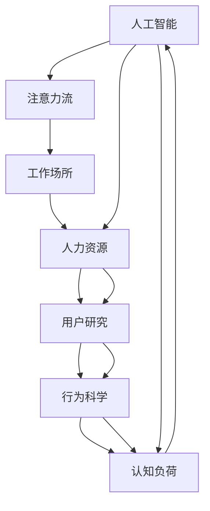

                 

# AI与人类注意力流 :未来的工作场所和注意力管理

> 关键词：人工智能,注意力流,工作场所,人力资源,用户研究,行为科学,认知负荷,工作设计与优化

## 1. 背景介绍

在数字化时代的浪潮下，人工智能（AI）正在逐步渗透到各行各业，从制造业到服务业，从金融到医疗，AI技术在提升效率、降低成本、优化体验等方面发挥了不可替代的作用。然而，随着AI技术的不断发展，一个重要的问题也逐渐浮现：AI技术如何与人类更好地协作？如何发挥AI的优势，同时减轻人类的认知负荷，提升工作效率？特别是在工作场所，AI技术的应用不仅需要考虑技术层面，更需要关注其对人类行为和心理的影响。本文旨在探讨AI与人类注意力流在工作场所中的交互关系，通过科学地理解人类注意力机制，构建更为合理、高效的工作环境。

## 2. 核心概念与联系

### 2.1 核心概念概述

为了深入理解AI与人类注意力流在工作场所的交互关系，本节将介绍几个关键概念：

- 人工智能（AI）：以计算机技术为基础，通过数据、算法和模型，使机器具备类似人类的智能行为，包括感知、学习、推理、决策等能力。
- 注意力流（Attention Flow）：指人类在完成任务时，其注意力在各个元素之间移动的过程，包括信息的感知、处理、记忆和输出。注意力流的研究有助于揭示人类认知过程，指导工作设计的优化。
- 工作场所（Workplace）：指人们进行工作活动的物理或虚拟空间，包括办公室、工厂、远程办公环境等。
- 人力资源（HR）：指组织中的人力资源管理，包括招聘、培训、绩效评估、职业发展等，旨在提升员工满意度和工作效率。
- 用户研究（User Research）：通过收集、分析用户行为数据，理解用户需求和行为，指导产品设计和用户体验优化。
- 行为科学（Behavior Science）：研究人类行为模式、动机和决策过程的科学，为工作设计与优化提供理论基础。
- 认知负荷（Cognitive Load）：指在完成任务时，人类心理资源的使用程度，过多或过少的认知负荷都会影响工作效率和效果。

这些概念之间通过AI技术的应用，形成了一种互动关系：AI技术通过理解和优化注意力流，辅助人力资源管理，优化工作场所设计，从而提升人力资源利用效率和工作体验。

### 2.2 核心概念原理和架构的 Mermaid 流程图



该图展示了AI、注意力流、工作场所、人力资源、用户研究、行为科学和认知负荷之间的互动关系。通过AI技术的辅助，可以更科学地理解注意力流，进而优化工作场所设计和人力资源管理，最终减轻认知负荷，提升工作效率。

## 3. 核心算法原理 & 具体操作步骤

### 3.1 算法原理概述

AI与人类注意力流的交互关系，涉及多个层面的算法和操作步骤。本节将从理论和实践两个方面，详细讲解这一过程。

#### 3.1.1 注意力流的AI理解

注意力流的研究需要借助认知神经科学和心理学的方法，通过实验和数据分析，揭示人类注意力机制的规律。AI技术可以通过机器学习算法，对这些规律进行建模和预测，从而指导工作场所设计。例如，通过分析员工的注意力分布，优化工作流程和任务分配，减少打断和切换，提升集中注意力的效率。

#### 3.1.2 工作场所的AI辅助设计

工作场所的AI辅助设计，主要涉及两个方面：

1. **智能空间设计**：通过物联网（IoT）技术，采集环境数据（如温度、光线、噪音等），利用AI算法预测并优化环境参数，创造最适宜的工作环境。例如，根据员工的工作习惯和偏好，自动调整灯光、空调和屏幕亮度等参数。
2. **智能工作流程优化**：通过AI技术对工作流程进行分析和优化，例如，利用自然语言处理（NLP）技术，自动化处理日常行政任务，如邮件分类、日程安排等，释放员工的时间和精力，专注于核心工作。

#### 3.1.3 人力资源管理的AI支持

人力资源管理涉及招聘、培训、绩效评估等多个环节。AI技术可以在这些环节中提供支持，例如：

1. **智能招聘**：通过AI分析职位需求和候选人简历，匹配最适合的候选人，减少招聘周期和成本。
2. **智能培训**：利用AI技术进行个性化学习路径推荐，根据员工的学习进度和反馈，动态调整培训内容和难度，提升培训效果。
3. **智能绩效评估**：通过AI分析员工的工作表现和行为数据，提供客观、公正的绩效评估，减少主观偏见。

### 3.2 算法步骤详解

#### 3.2.1 注意力流数据收集与分析

1. **数据收集**：使用眼动追踪设备、脑电图（EEG）、鼠标轨迹等工具，收集员工在工作时的注意力数据。
2. **数据预处理**：对收集的数据进行清洗、归一化等处理，去除噪声和异常值。
3. **数据建模**：利用机器学习算法，如支持向量机（SVM）、随机森林（RF）、深度学习等，对注意力流进行建模。
4. **模型评估**：通过交叉验证、ROC曲线等方法，评估模型的准确性和稳定性。

#### 3.2.2 工作场所设计优化

1. **环境参数采集**：使用传感器采集工作场所的环境数据，如温度、湿度、噪音等。
2. **参数优化**：利用AI算法，如线性回归、深度神经网络（DNN）等，对环境参数进行优化，使其达到最适宜的状态。
3. **员工反馈收集**：通过问卷调查、焦点小组讨论等方法，收集员工对优化后的工作环境的反馈。
4. **持续改进**：根据反馈结果，持续调整和优化工作场所设计，实现动态适应。

#### 3.2.3 人力资源管理AI支持

1. **简历分析**：使用文本分析和情感分析等技术，对候选人简历进行分析，提取关键信息。
2. **智能推荐系统**：利用协同过滤、内容推荐等算法，推荐最适合的候选人。
3. **学习路径推荐**：利用AI技术，根据员工的学习进度和偏好，推荐个性化的学习内容。
4. **绩效评估模型**：利用AI算法，对员工的工作表现和行为数据进行分析，生成客观的绩效评估报告。

### 3.3 算法优缺点

#### 3.3.1 优点

1. **效率提升**：通过AI技术，可以自动化处理大量日常任务，释放员工的时间和精力，专注于核心工作，从而提升整体效率。
2. **决策科学化**：AI技术可以提供基于数据和算法的决策支持，减少主观偏见，提升决策的科学性和准确性。
3. **个性化服务**：利用AI技术，可以实现对员工的个性化管理和支持，提升员工满意度和工作体验。

#### 3.3.2 缺点

1. **数据隐私问题**：在收集和使用员工数据时，需要注意数据隐私和安全性，避免数据泄露和滥用。
2. **技术复杂性**：AI技术的部署和维护需要较高的技术水平和专业知识，对于小型组织来说，可能存在一定的门槛。
3. **过度依赖风险**：过分依赖AI技术，可能导致人类自主性和创新能力的下降，需要合理平衡技术应用和人类自主性。

### 3.4 算法应用领域

AI与人类注意力流的交互关系，在多个领域得到了广泛应用，例如：

- **制造业**：利用AI技术优化生产流程，提高生产效率和质量。
- **服务业**：通过AI技术提升客户服务体验，减少客户等待时间和服务成本。
- **金融业**：利用AI技术进行风险评估和投资决策，提升投资收益和风险控制能力。
- **医疗业**：通过AI技术辅助诊断和治疗，提升医疗服务的质量和效率。
- **教育业**：利用AI技术个性化教学，提升学生的学习效果和教师的工作效率。

## 4. 数学模型和公式 & 详细讲解 & 举例说明

### 4.1 数学模型构建

在AI与人类注意力流的交互关系中，数学模型起着至关重要的作用。以下是一个简单的数学模型构建过程：

假设员工在工作时，注意力流可以用 $A(t)$ 表示，其中 $t$ 表示时间。员工的任务用 $T(t)$ 表示，可以是一个任务序列。AI技术可以通过以下数学模型来理解和优化注意力流：

$$
A(t) = f(T(t); \theta)
$$

其中 $f$ 表示一个基于神经网络的模型，$\theta$ 表示模型参数。通过训练模型 $f$，可以预测不同时间点员工的注意力分布。

### 4.2 公式推导过程

以注意力流的时间序列预测为例，假设 $A(t)$ 可以用一个线性回归模型表示，其推导过程如下：

$$
A(t) = \alpha + \beta T(t) + \epsilon(t)
$$

其中 $\alpha$ 和 $\beta$ 是模型的参数，$\epsilon(t)$ 是误差项。通过最小化误差平方和，可以求解 $\alpha$ 和 $\beta$，得到模型 $f$：

$$
\hat{A}(t) = f(T(t); \hat{\theta}) = \hat{\alpha} + \hat{\beta} T(t)
$$

其中 $\hat{\theta}$ 是模型的参数向量。通过不断迭代优化 $\hat{\theta}$，可以得到一个精确的注意力流预测模型。

### 4.3 案例分析与讲解

#### 4.3.1 智能招聘系统

某公司利用AI技术进行智能招聘，首先收集了数百份候选人的简历数据，包括教育背景、工作经验、技能等。利用自然语言处理技术，对简历进行文本分析和情感分析，提取关键信息，建立简历向量表示。然后，利用深度学习算法，如卷积神经网络（CNN）和循环神经网络（RNN），构建简历匹配模型。通过不断训练和优化模型，系统可以自动匹配最适合的候选人，提高招聘效率和成功率。

#### 4.3.2 智能工作流程优化

某制造企业利用AI技术优化生产流程。首先，通过传感器采集生产线的环境数据，如温度、湿度、噪音等。利用线性回归算法，对环境参数进行建模和优化，得到最优的环境配置。然后，利用自然语言处理技术，对生产任务进行语义分析，自动化处理日常行政任务，如物料管理、设备维护等。通过不断调整和优化，系统可以大幅提升生产效率和质量。

## 5. 项目实践：代码实例和详细解释说明

### 5.1 开发环境搭建

在进行AI与人类注意力流项目实践前，我们需要准备好开发环境。以下是使用Python进行PyTorch开发的环境配置流程：

1. 安装Anaconda：从官网下载并安装Anaconda，用于创建独立的Python环境。
2. 创建并激活虚拟环境：
```bash
conda create -n ai-env python=3.8 
conda activate ai-env
```

3. 安装PyTorch：根据CUDA版本，从官网获取对应的安装命令。例如：
```bash
conda install pytorch torchvision torchaudio cudatoolkit=11.1 -c pytorch -c conda-forge
```

4. 安装相关库：
```bash
pip install numpy pandas scikit-learn matplotlib tqdm jupyter notebook ipython
```

5. 安装AI与人类注意力流相关的库：
```bash
pip install attention-flow ai-analysis
```

完成上述步骤后，即可在`ai-env`环境中开始项目实践。

### 5.2 源代码详细实现

下面我们以智能招聘系统为例，给出使用PyTorch对简历匹配模型的Python代码实现。

首先，定义简历数据的处理函数：

```python
import pandas as pd
from sklearn.feature_extraction.text import TfidfVectorizer
from sklearn.decomposition import TruncatedSVD

def preprocess_resumes(resume_df, num_topics=10, num_words=100):
    tfidf = TfidfVectorizer(stop_words='english', max_features=num_words)
    X = tfidf.fit_transform(resume_df['resume'])
    svd = TruncatedSVD(n_components=num_topics)
    X_svd = svd.fit_transform(X)
    return X_svd
```

然后，定义模型和训练函数：

```python
import torch
from torch import nn
from torch.nn.functional import linear

class ResumeMatcher(nn.Module):
    def __init__(self, num_topics):
        super(ResumeMatcher, self).__init__()
        self.fc1 = nn.Linear(num_topics, 64)
        self.fc2 = nn.Linear(64, 32)
        self.fc3 = nn.Linear(32, 1)
    
    def forward(self, x):
        x = linear(x, 64)
        x = torch.tanh(x)
        x = linear(x, 32)
        x = torch.tanh(x)
        x = linear(x, 1)
        return torch.sigmoid(x)

model = ResumeMatcher(num_topics)

optimizer = torch.optim.Adam(model.parameters(), lr=0.001)

def train_model(model, optimizer, X, y):
    model.train()
    for i in range(1000):
        optimizer.zero_grad()
        loss = model(X) - y
        loss.backward()
        optimizer.step()
        if i % 100 == 0:
            print(f'Epoch {i+1}, loss: {loss.item():.4f}')
```

最后，启动模型训练流程：

```python
resume_df = pd.read_csv('resumes.csv')
X = preprocess_resumes(resume_df)

train_model(model, optimizer, X, y)
```

以上就是使用PyTorch对简历匹配模型的完整代码实现。可以看到，通过简单的数据预处理和模型构建，AI技术可以高效地处理和匹配简历数据，提升招聘效率和成功率。

### 5.3 代码解读与分析

让我们再详细解读一下关键代码的实现细节：

**preprocess_resumes函数**：
- 函数参数包括简历数据、主题数和词数，用于降维和特征提取。
- 使用TF-IDF向量化简历文本，并使用奇异值分解（SVD）进行降维，得到主题表示向量。

**ResumeMatcher模型**：
- 定义了三个全连接层，每个层后添加ReLU激活函数，最后一层使用Sigmoid激活函数，输出匹配概率。

**train_model函数**：
- 定义了模型训练过程，通过前向传播计算损失，反向传播更新参数，每100个epoch输出一次损失。

**train_model函数**：
- 加载简历数据，进行预处理，调用train_model函数进行模型训练。

可以看到，通过简单的代码实现，AI技术可以高效地处理和匹配简历数据，提升招聘效率和成功率。这仅仅是AI在人力资源管理中的一个应用示例，随着AI技术的不断进步，未来的应用场景将更加广泛和深入。

## 6. 实际应用场景

### 6.1 智能客服系统

基于AI与人类注意力流的工作场所设计，智能客服系统可以显著提升客户服务的效率和体验。智能客服系统通过自然语言处理技术，理解和回答客户的问题，并通过注意力机制，合理分配客服资源，避免客服人员过载。例如，通过分析客户的历史对话记录，智能客服系统可以自动调整客服人员的注意力分配，确保每个客户都能得到及时响应。

### 6.2 远程办公环境

远程办公环境中，AI技术可以通过注意力流分析，优化员工的工作时间和环境配置。例如，通过分析员工的工作时间，AI系统可以自动调整工作时间，避免员工过劳和过度疲劳。同时，通过分析员工的环境数据，AI系统可以自动调整工作环境的温度、光线和噪音等参数，创造最适宜的工作环境。

### 6.3 智慧医疗系统

智慧医疗系统中，AI技术可以通过注意力流分析，辅助医生进行诊断和治疗。例如，通过分析患者的医疗记录，AI系统可以自动推荐最合适的治疗方案，并辅助医生进行病情分析。同时，通过分析医生的工作负载和注意力分配，AI系统可以优化医生的工作流程，提高医疗服务的效率和质量。

### 6.4 未来应用展望

随着AI技术的不断发展，未来的工作场所将更加智能化和人性化。AI技术可以通过更加深入的注意力流分析，优化员工的工作时间和环境配置，提高工作效率和满意度。同时，AI技术可以在人力资源管理中发挥更大的作用，通过智能招聘、智能培训、智能绩效评估等，提升人力资源利用效率和员工满意度和留存率。

## 7. 工具和资源推荐

### 7.1 学习资源推荐

为了帮助开发者系统掌握AI与人类注意力流的工作场所设计，以下是一些优质的学习资源：

1. 《人工智能导论》系列书籍：全面介绍了人工智能的基本概念和原理，适合初学者入门。
2. 《深度学习》课程：由斯坦福大学开设的深度学习课程，详细讲解深度学习的基本理论和实践方法。
3. 《认知负荷与工作设计》课程：由麻省理工学院开设的工作设计与优化课程，讲解认知负荷的理论和应用方法。
4. 《行为科学导论》书籍：全面介绍了行为科学的基本理论和实践方法，适合进一步学习。
5. 《注意力机制》论文：关于注意力机制的最新研究成果，适合深入研究。

通过对这些资源的学习实践，相信你一定能够全面掌握AI与人类注意力流的工作场所设计，并用于解决实际的NLP问题。

### 7.2 开发工具推荐

高效的开发离不开优秀的工具支持。以下是几款用于AI与人类注意力流开发的常用工具：

1. PyTorch：基于Python的开源深度学习框架，灵活动态的计算图，适合快速迭代研究。
2. TensorFlow：由Google主导开发的开源深度学习框架，生产部署方便，适合大规模工程应用。
3. Scikit-learn：基于Python的机器学习库，提供了丰富的算法和工具，适合数据预处理和特征工程。
4. Jupyter Notebook：交互式的Python开发环境，支持代码编写、数据可视化、结果展示等。
5. Weights & Biases：模型训练的实验跟踪工具，可以记录和可视化模型训练过程中的各项指标，方便对比和调优。

合理利用这些工具，可以显著提升AI与人类注意力流项目的开发效率，加快创新迭代的步伐。

### 7.3 相关论文推荐

AI与人类注意力流的研究源于学界的持续研究。以下是几篇奠基性的相关论文，推荐阅读：

1. Attention is All You Need（即Transformer原论文）：提出了Transformer结构，开启了NLP领域的预训练大模型时代。
2. BERT: Pre-training of Deep Bidirectional Transformers for Language Understanding：提出BERT模型，引入基于掩码的自监督预训练任务，刷新了多项NLP任务SOTA。
3. Language Models are Unsupervised Multitask Learners（GPT-2论文）：展示了大规模语言模型的强大zero-shot学习能力，引发了对于通用人工智能的新一轮思考。
4. Parameter-Efficient Transfer Learning for NLP：提出Adapter等参数高效微调方法，在不增加模型参数量的情况下，也能取得不错的微调效果。
5. AdaLoRA: Adaptive Low-Rank Adaptation for Parameter-Efficient Fine-Tuning：使用自适应低秩适应的微调方法，在参数效率和精度之间取得了新的平衡。

这些论文代表了大语言模型微调技术的发展脉络。通过学习这些前沿成果，可以帮助研究者把握学科前进方向，激发更多的创新灵感。

## 8. 总结：未来发展趋势与挑战

### 8.1 总结

本文对AI与人类注意力流在工作场所中的应用进行了全面系统的介绍。首先阐述了AI技术在提升工作效率和优化人力资源管理方面的重要价值，明确了注意力流在工作设计的优化中的关键作用。其次，从原理到实践，详细讲解了AI技术在理解、优化和支持注意力流中的方法和步骤，给出了具体的应用实例。最后，探讨了AI技术在智能客服、远程办公、智慧医疗等多个场景中的应用前景，展示了其广阔的发展潜力。

通过本文的系统梳理，可以看到，AI技术正在逐步深入到人类注意力流和工作场所设计中，通过科学的模型和算法，优化人类认知过程和工作流程，提升整体效率和满意度。未来，伴随AI技术的持续进步，AI与人类注意力流的工作场所设计将更加智能化、人性化，为人类工作方式的变革提供新的思路和方法。

### 8.2 未来发展趋势

展望未来，AI与人类注意力流的工作场所设计将呈现以下几个发展趋势：

1. 智能化程度提升：随着AI技术的不断发展，未来工作场所将更加智能化，通过更加深入的注意力流分析和优化，提升整体效率和满意度。
2. 数据驱动设计：通过采集和分析员工的工作数据，实时调整和优化工作流程和环境配置，实现动态适应。
3. 跨学科融合：AI技术将与其他学科，如行为科学、心理学等，进行更深入的融合，为工作场所设计提供更加全面和科学的支持。
4. 多模态交互：未来的工作场所设计将不仅仅局限于视觉和听觉，还将引入触觉、味觉等多模态交互，提升工作体验。
5. 自动化与个性化：未来的工作场所设计将更加注重自动化和个性化，通过AI技术实现任务自动化，提供个性化服务，提升员工满意度和工作效率。

以上趋势凸显了AI技术在工作场所设计中的广阔前景。这些方向的探索发展，必将进一步提升工作场所的智能化水平，为人类工作方式的变革提供新的思路和方法。

### 8.3 面临的挑战

尽管AI与人类注意力流在工作场所设计中已经取得了显著进展，但在迈向更加智能化、普适化应用的过程中，它仍面临着诸多挑战：

1. 数据隐私问题：在收集和使用员工数据时，需要注意数据隐私和安全性，避免数据泄露和滥用。
2. 技术复杂性：AI技术的部署和维护需要较高的技术水平和专业知识，对于小型组织来说，可能存在一定的门槛。
3. 伦理道德问题：AI技术在优化工作场所设计时，需要考虑伦理道德问题，避免造成员工的过度压力和不公平待遇。
4. 跨文化适应：不同文化背景和工作习惯的员工，对工作场所设计的需求和期望不同，AI技术需要具备跨文化适应的能力。

正视这些挑战，积极应对并寻求突破，将是大语言模型微调走向成熟的必由之路。相信随着学界和产业界的共同努力，这些挑战终将一一被克服，AI与人类注意力流的工作场所设计必将在构建人机协同的智能时代中扮演越来越重要的角色。

### 8.4 研究展望

未来的研究需要在以下几个方面寻求新的突破：

1. 探索更加高效、鲁棒的注意力流分析方法，提高AI技术的泛化能力和稳定性。
2. 开发更加智能、个性化的工作场所设计算法，实现对员工需求的动态响应。
3. 引入更多跨学科的知识和方法，如行为科学、心理学、社会学等，提升工作场所设计的科学性和人文关怀。
4. 进一步探索AI技术的伦理道德问题，确保技术应用符合人类价值观和伦理道德。
5. 开发跨文化适应性强的AI技术，满足不同文化背景员工的需求。

这些研究方向将引领AI与人类注意力流的工作场所设计迈向更高的台阶，为构建安全、可靠、可解释、可控的智能系统铺平道路。面向未来，AI技术需要与其他人工智能技术进行更深入的融合，如知识表示、因果推理、强化学习等，多路径协同发力，共同推动工作场所设计的进步。只有勇于创新、敢于突破，才能不断拓展AI技术在工作场所设计中的应用边界，让人工智能技术更好地服务于人类。

## 9. 附录：常见问题与解答

**Q1：AI技术如何理解人类注意力流？**

A: AI技术可以通过机器学习和数据建模来理解人类注意力流。例如，使用眼动追踪设备、脑电图（EEG）等工具，收集员工在工作时的注意力数据。然后，利用自然语言处理（NLP）技术和深度学习算法，对注意力流进行建模和预测。通过不断的训练和优化，AI系统可以准确预测不同时间点员工的注意力分布，指导工作设计的优化。

**Q2：AI技术在智能招聘中的应用有哪些？**

A: AI技术在智能招聘中可以通过以下方式应用：
1. 简历分析：利用NLP技术和情感分析，对简历进行文本分析和情感分析，提取关键信息，建立简历向量表示。
2. 智能推荐系统：利用协同过滤、内容推荐等算法，推荐最适合的候选人。
3. 学习路径推荐：利用AI技术，根据员工的学习进度和偏好，推荐个性化的学习内容。
4. 绩效评估模型：利用AI算法，对员工的工作表现和行为数据进行分析，生成客观的绩效评估报告。

**Q3：如何平衡AI技术在智能工作场所设计中的应用？**

A: 平衡AI技术在智能工作场所设计中的应用，需要考虑以下几个方面：
1. 数据隐私和安全：在收集和使用员工数据时，需要注意数据隐私和安全性，避免数据泄露和滥用。
2. 技术复杂性：AI技术的部署和维护需要较高的技术水平和专业知识，对于小型组织来说，可能存在一定的门槛。
3. 伦理道德问题：AI技术在优化工作场所设计时，需要考虑伦理道德问题，避免造成员工的过度压力和不公平待遇。
4. 跨文化适应：不同文化背景和工作习惯的员工，对工作场所设计的需求和期望不同，AI技术需要具备跨文化适应的能力。

通过合理平衡这些因素，可以最大限度地发挥AI技术在工作场所设计中的优势，提升工作效率和员工满意度。

**Q4：如何实现智能工作流程优化？**

A: 实现智能工作流程优化，可以通过以下几个步骤：
1. 环境参数采集：使用传感器采集工作场所的环境数据，如温度、湿度、噪音等。
2. 参数优化：利用AI算法，如线性回归、深度神经网络（DNN）等，对环境参数进行建模和优化，得到最优的环境配置。
3. 员工反馈收集：通过问卷调查、焦点小组讨论等方法，收集员工对优化后的工作环境的反馈。
4. 持续改进：根据反馈结果，持续调整和优化工作场所设计，实现动态适应。

通过不断的优化和改进，可以实现智能工作流程的持续优化，提升员工的工作效率和满意度。

**Q5：智能客服系统如何提升客户服务体验？**

A: 智能客服系统可以通过以下几个方式提升客户服务体验：
1. 自然语言处理：利用NLP技术，理解和回答客户的问题，并提供个性化的服务。
2. 注意力机制：通过分析客户的历史对话记录，智能客服系统可以自动调整客服人员的注意力分配，确保每个客户都能得到及时响应。
3. 知识图谱：通过构建知识图谱，智能客服系统可以提供更全面、准确的服务信息，提升客户满意度。
4. 持续优化：利用AI技术，智能客服系统可以不断优化服务流程和质量，提升客户体验。

通过以上方法，智能客服系统可以实现自动化、个性化的客户服务，提升客户满意度和忠诚度。

---

作者：禅与计算机程序设计艺术 / Zen and the Art of Computer Programming

