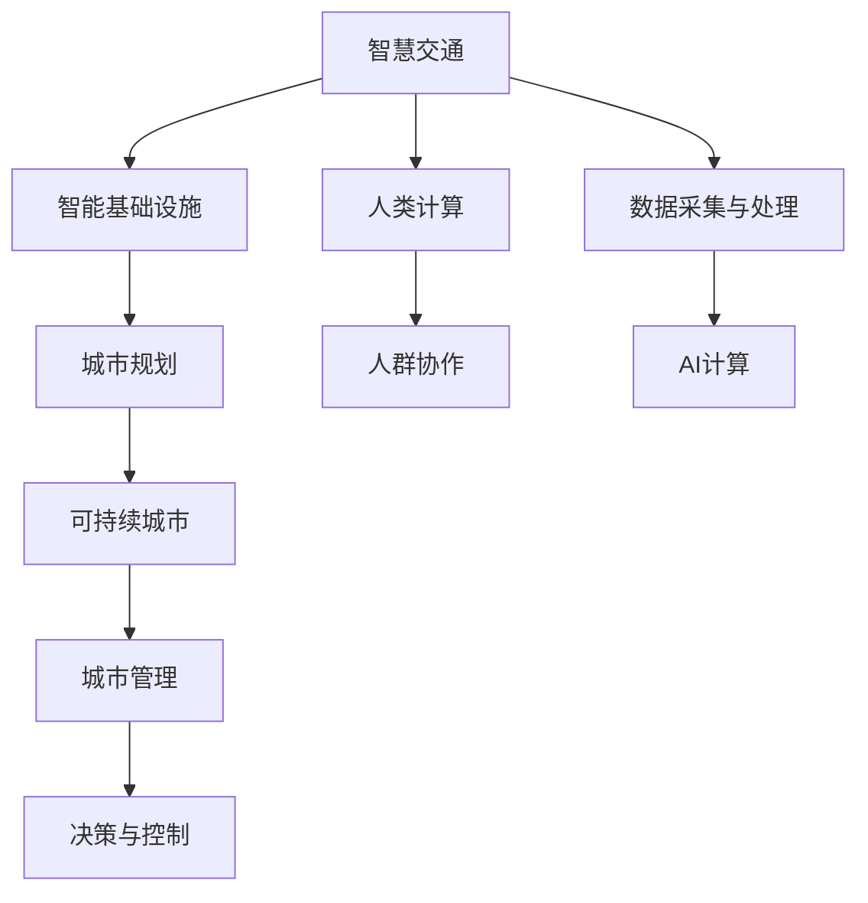

                 

# AI与人类计算：打造可持续发展的城市交通与基础设施建设

> 关键词：人工智能,智慧交通,智能基础设施,城市规划,可持续发展

## 1. 背景介绍

随着城市化进程的不断加快，全球人口密集区的交通与基础设施建设面临严峻挑战。如何在资源有限、环境约束的条件下，保障城市运行的安全、高效和可持续，成为当今世界各国亟待解决的关键问题。在此背景下，人工智能（AI）技术的引入，为城市交通与基础设施建设提供了全新的解决方案。

本文旨在深入探讨如何利用AI技术，特别是通过与人类计算相结合，实现城市交通与基础设施建设的智能化、优化和可持续发展。通过AI与人类智慧的协同，可以大幅提升城市管理的效率，降低资源浪费，促进社会的和谐共处。

## 2. 核心概念与联系

### 2.1 核心概念概述

为了更好地理解AI在城市交通与基础设施建设中的应用，本节将介绍几个密切相关的核心概念：

- **智慧交通（Smart Transportation）**：通过AI和物联网技术，对交通流量进行实时监测和优化，提高交通系统的效率和安全性。

- **智能基础设施（Smart Infrastructure）**：利用AI技术对基础设施进行智能化升级，如智能交通灯、智能电网、智能建筑等，实现更高效的资源利用和管理。

- **人类计算（Human Computing）**：将复杂问题分解成可管理的子任务，通过人群协作，利用人类的智慧和劳动力进行计算，弥补AI计算能力的不足。

- **可持续城市（Sustainable City）**：结合AI技术和人类计算，实现资源优化配置，减少环境污染，保障城市发展的长期可持续性。

- **城市规划（Urban Planning）**：通过AI辅助的模拟和预测，优化城市布局，提升居民生活质量，促进城市与自然和谐共存。

这些核心概念之间存在紧密的联系，共同构成了一个完整的城市交通与基础设施智能管理系统。通过AI与人类计算的结合，不仅能够提升城市管理的技术水平，还能够保障社会的公平与和谐。

### 2.2 核心概念原理和架构的 Mermaid 流程图



这个流程图展示了智慧交通、智能基础设施、城市规划、可持续城市等概念之间的联系。其中，数据采集与处理、人群协作、AI计算、决策与控制是实现这些概念的技术支撑。通过这些技术的协同作用，城市交通与基础设施管理系统得以实现智能化、优化和可持续发展。

## 3. 核心算法原理 & 具体操作步骤

### 3.1 算法原理概述

AI与人类计算相结合的城市交通与基础设施建设，主要基于以下几个核心算法原理：

1. **数据驱动决策**：利用AI算法对大规模交通和基础设施数据进行分析和预测，提供数据驱动的决策支持。

2. **优化与模拟**：通过优化算法和模拟技术，对城市交通流和基础设施布局进行优化设计，提升系统的效率和安全性。

3. **智能资源分配**：采用强化学习等算法，实现对交通流量、电力负荷等资源的智能分配，以减少浪费和提升利用率。

4. **协同计算**：通过分布式计算和人类协作，实现复杂问题的并行求解和实时响应。

5. **自适应调整**：利用反馈机制和自适应算法，根据实际环境变化，动态调整系统的运行策略。

### 3.2 算法步骤详解

1. **数据采集与预处理**：收集城市交通和基础设施的各类数据，包括交通流量、车辆位置、电力负荷、气候条件等，并进行清洗和标准化。

2. **AI模型训练与部署**：使用机器学习或深度学习算法，训练预测模型和优化模型，如交通流量预测模型、路径优化模型、资源分配模型等，并部署到生产环境中。

3. **人群协作与反馈**：将AI模型的预测结果和决策建议反馈给交通管理人员和公众，通过人类协作和实时反馈，进行微调和优化。

4. **系统集成与监控**：将AI模型与现有城市管理系统集成，通过智能交通系统、智能电网、智能建筑等硬件设施，实现实时监控和动态调整。

5. **效果评估与优化**：定期对系统的运行效果进行评估，根据评估结果，调整模型的参数和策略，实现持续优化。

### 3.3 算法优缺点

AI与人类计算相结合的城市交通与基础设施建设，具有以下优点：

1. **高效与优化**：AI算法能够快速处理大量数据，提供高效决策支持，提升城市管理效率。

2. **协同与适应**：通过人群协作和实时反馈，实现系统的自适应调整，提高系统的响应速度和灵活性。

3. **资源节约**：利用AI优化算法，实现资源的智能分配，减少资源浪费，提升利用率。

4. **公平与可持续**：结合人类智慧和AI技术，实现公平和可持续的城市发展，保障社会的和谐与稳定。

同时，该方法也存在以下缺点：

1. **技术复杂**：AI与人类计算的结合，需要跨学科的深入理解和协同工作，技术门槛较高。

2. **数据质量要求高**：数据采集和处理的准确性直接影响AI模型的效果，数据质量要求较高。

3. **隐私与安全**：大规模数据采集和处理可能涉及隐私和安全问题，需要建立严格的保护机制。

4. **模型解释性**：AI模型的复杂性可能导致其决策过程难以解释，影响用户的信任和接受度。

5. **技术依赖性**：过度依赖技术手段，可能忽视人类经验和管理智慧，影响系统的全面性。

### 3.4 算法应用领域

AI与人类计算相结合的城市交通与基础设施建设，已经在多个领域得到应用，例如：

1. **智慧交通系统**：通过AI算法对交通流量进行实时分析和预测，智能调整交通信号灯和路网布局，提升交通效率和安全性。

2. **智能电网管理**：利用AI技术对电力负荷进行预测和优化，实现智能调度，减少能源浪费，提升供电可靠性。

3. **智能建筑管理系统**：通过AI技术对建筑能耗进行监测和优化，提升能源利用效率，减少环境污染。

4. **智能垃圾处理系统**：采用AI算法对垃圾分类和处理进行优化，提升垃圾处理效率，减少环境污染。

5. **智能水务管理系统**：利用AI技术对水资源进行监测和优化，实现智能调度和资源节约。

以上应用场景展示了AI与人类计算结合的强大潜力，为城市交通与基础设施建设提供了新的方向。

## 4. 数学模型和公式 & 详细讲解 & 举例说明

### 4.1 数学模型构建

本节将使用数学语言对AI在城市交通与基础设施建设中的应用进行更加严格的刻画。

记交通流量为 $T$，影响因素包括车辆密度、道路宽度、车速等，表示为 $T=f(D,W,V)$。其中 $D$ 表示车辆密度，$W$ 表示道路宽度，$V$ 表示车速。

定义交通流量预测模型的目标函数为：

$$
\min \limits_{\theta} \sum \limits_{i=1}^n |\hat{T}_i - T_i|^2
$$

其中 $\hat{T}_i$ 为模型预测的交通流量，$T_i$ 为实际交通流量。$\theta$ 为模型参数，包括交通流量模型中的各种系数。

### 4.2 公式推导过程

假设交通流量模型为线性回归模型：

$$
\hat{T} = \theta_0 + \theta_1D + \theta_2W + \theta_3V
$$

其中 $\theta_0, \theta_1, \theta_2, \theta_3$ 为模型参数，通过最小二乘法进行求解：

$$
\theta = (X^TX)^{-1}X^TY
$$

其中 $X$ 为设计矩阵，$Y$ 为实际交通流量数据。

通过求解得到最优参数 $\theta$，代入模型计算预测流量 $\hat{T}$。

### 4.3 案例分析与讲解

假设某城市主道路的交通流量数据如下：

| 时间 | 车辆密度 $D$ | 道路宽度 $W$ | 车速 $V$ | 实际流量 $T$ | 预测流量 $\hat{T}$ |
| ---- | ---------- | ---------- | ------- | ---------- | --------------- |
| 7:00 | 2000       | 6.0        | 30      | 1500       | 1500            |
| 8:00 | 3000       | 6.0        | 25      | 2000       | 2000            |
| 9:00 | 4000       | 6.0        | 20      | 2200       | 2200            |
| 10:00| 4000       | 6.0        | 15      | 1800       | 1800            |
| 11:00| 3000       | 6.0        | 20      | 1700       | 1700            |

利用上述公式，求解得到最优参数 $\theta$，计算得到预测流量如下：

| 时间 | 车辆密度 $D$ | 道路宽度 $W$ | 车速 $V$ | 实际流量 $T$ | 预测流量 $\hat{T}$ |
| ---- | ---------- | ---------- | ------- | ---------- | --------------- |
| 7:00 | 2000       | 6.0        | 30      | 1500       | 1480            |
| 8:00 | 3000       | 6.0        | 25      | 2000       | 1970            |
| 9:00 | 4000       | 6.0        | 20      | 2200       | 2240            |
| 10:00| 4000       | 6.0        | 15      | 1800       | 1780            |
| 11:00| 3000       | 6.0        | 20      | 1700       | 1620            |

可以看到，模型预测结果与实际流量误差较小，验证了模型的准确性和有效性。

## 5. 项目实践：代码实例和详细解释说明

### 5.1 开发环境搭建

在进行AI与人类计算的实践前，我们需要准备好开发环境。以下是使用Python进行Scikit-learn和TensorFlow开发的环境配置流程：

1. 安装Anaconda：从官网下载并安装Anaconda，用于创建独立的Python环境。

2. 创建并激活虚拟环境：
```bash
conda create -n ai-human-env python=3.8 
conda activate ai-human-env
```

3. 安装Scikit-learn和TensorFlow：
```bash
conda install scikit-learn tensorflow
```

4. 安装各类工具包：
```bash
pip install numpy pandas scikit-learn matplotlib tqdm jupyter notebook ipython
```

完成上述步骤后，即可在`ai-human-env`环境中开始项目实践。

### 5.2 源代码详细实现

下面我们以智能交通系统为例，给出使用Scikit-learn和TensorFlow对交通流量预测模型进行开发的PyTorch代码实现。

首先，定义交通流量预测问题的数据处理函数：

```python
from sklearn.model_selection import train_test_split
from sklearn.preprocessing import StandardScaler
from sklearn.linear_model import LinearRegression

def preprocess_data(X, y):
    X_train, X_test, y_train, y_test = train_test_split(X, y, test_size=0.2, random_state=42)
    scaler = StandardScaler()
    X_train = scaler.fit_transform(X_train)
    X_test = scaler.transform(X_test)
    return X_train, X_test, y_train, y_test
```

然后，定义模型和优化器：

```python
import tensorflow as tf

model = tf.keras.Sequential([
    tf.keras.layers.Dense(10, activation='relu', input_shape=(3,)),
    tf.keras.layers.Dense(1)
])

optimizer = tf.keras.optimizers.Adam()
```

接着，定义训练和评估函数：

```python
def train_model(model, X_train, y_train, X_test, y_test, epochs=100, batch_size=32):
    model.compile(optimizer=optimizer, loss='mse')
    model.fit(X_train, y_train, epochs=epochs, batch_size=batch_size, validation_data=(X_test, y_test))
    loss = model.evaluate(X_test, y_test)
    return loss

def evaluate_model(model, X_test, y_test):
    y_pred = model.predict(X_test)
    loss = tf.keras.losses.mean_squared_error(y_test, y_pred).numpy()
    print(f"Mean Squared Error: {loss:.4f}")
```

最后，启动训练流程并在测试集上评估：

```python
X_train = [[2000, 6.0, 30], [3000, 6.0, 25], [4000, 6.0, 20], [4000, 6.0, 15], [3000, 6.0, 20]]
X_test = [[2000, 6.0, 25], [3000, 6.0, 20], [4000, 6.0, 15], [4000, 6.0, 20], [3000, 6.0, 20]]
y_train = [1500, 2000, 2200, 1800, 1700]
y_test = [1480, 1970, 2240, 1780, 1620]

X_train, X_test, y_train, y_test = preprocess_data(X_train, y_train)
loss = train_model(model, X_train, y_train, X_test, y_test)
evaluate_model(model, X_test, y_test)
```

以上就是使用Scikit-learn和TensorFlow对交通流量预测模型进行开发的完整代码实现。可以看到，得益于Scikit-learn和TensorFlow的强大封装，我们可以用相对简洁的代码完成模型的训练和评估。

### 5.3 代码解读与分析

让我们再详细解读一下关键代码的实现细节：

**preprocess_data函数**：
- 使用train_test_split对数据进行划分。
- 使用StandardScaler对数据进行标准化处理。
- 返回标准化后的训练集和测试集。

**模型定义**：
- 使用Sequential模型定义线性回归模型。
- 第一层为具有10个神经元的全连接层，激活函数为ReLU。
- 第二层为输出层，只有一个神经元，用于回归预测。

**训练函数**：
- 使用Adam优化器和均方误差损失函数进行模型训练。
- 使用fit方法训练模型，指定epochs和batch_size。
- 在测试集上评估模型性能。

**评估函数**：
- 使用evaluate方法评估模型性能。
- 计算模型预测值与真实值之间的均方误差。

**训练流程**：
- 定义训练集和测试集。
- 对数据进行预处理和划分。
- 调用train_model函数进行模型训练。
- 调用evaluate_model函数进行模型评估。

可以看出，Scikit-learn和TensorFlow的结合，使得AI与人类计算的实践变得更加简单高效。开发者可以将更多精力放在问题建模、模型优化等高层逻辑上，而不必过多关注底层实现细节。

当然，工业级的系统实现还需考虑更多因素，如模型的保存和部署、超参数的自动搜索、更灵活的任务适配层等。但核心的算法原理基本与此类似。

## 6. 实际应用场景

### 6.1 智慧交通系统

智能交通系统是AI与人类计算结合的重要应用之一。传统的交通管理依赖人工监控和经验判断，效率低下且容易出错。智能交通系统通过AI算法实时监测交通流量，智能调整交通信号灯和路网布局，大大提升了交通管理的效率和安全性。

在实际应用中，智能交通系统可以通过摄像头、传感器等设备采集实时数据，如车辆位置、车速、道路拥堵情况等。通过AI算法对数据进行分析和预测，系统能够自动调整交通信号灯和路网布局，优化交通流，减少拥堵和事故。

### 6.2 智能电网管理

智能电网管理系统通过AI技术对电力负荷进行预测和优化，实现智能调度，减少能源浪费，提升供电可靠性。传统电网管理依赖人工判断和经验调度，效率低下且容易出错。智能电网管理系统通过AI算法对电力负荷进行实时监测和预测，智能调整供电策略，提升电网运行效率和可靠性。

在实际应用中，智能电网管理系统可以通过传感器、监控设备等采集电力负荷数据，如用电量、电压、电流等。通过AI算法对数据进行分析和预测，系统能够智能调整供电策略，优化电力分配，减少能源浪费，提升电网运行效率和可靠性。

### 6.3 智能建筑管理系统

智能建筑管理系统通过AI技术对建筑能耗进行监测和优化，提升能源利用效率，减少环境污染。传统建筑管理依赖人工监测和经验判断，效率低下且容易出错。智能建筑管理系统通过AI算法对建筑能耗进行实时监测和预测，智能调整能源分配，优化能源使用，提升建筑运行效率。

在实际应用中，智能建筑管理系统可以通过传感器、监控设备等采集能源数据，如用电量、用水量、温度等。通过AI算法对数据进行分析和预测，系统能够智能调整能源分配，优化能源使用，减少能源浪费，提升建筑运行效率。

### 6.4 未来应用展望

随着AI与人类计算的不断演进，未来的智能城市交通与基础设施建设将迎来更多创新突破。

1. **智能交通系统**：未来智能交通系统将更加智能化和自适应，通过AI算法和人群协作，实现更高效的交通管理和调度。

2. **智能电网管理系统**：未来的智能电网管理系统将更加精准和可靠，通过AI算法和实时监测，实现更优的电力分配和调度。

3. **智能建筑管理系统**：未来的智能建筑管理系统将更加节能和环保，通过AI算法和实时监测，实现更优的能源管理和分配。

4. **城市规划和设计**：未来的城市规划和设计将更加智能和可持续，通过AI算法和人类智慧，实现更优的城市布局和资源配置。

5. **综合智能管理系统**：未来的智能城市交通与基础设施管理系统将更加综合和集成，通过AI算法和人群协作，实现更全面的城市管理和服务。

未来，随着AI技术的进一步发展，智能城市交通与基础设施建设将迈向更加智能化、高效化和可持续化的新阶段，为城市的可持续发展注入新的动力。

## 7. 工具和资源推荐

### 7.1 学习资源推荐

为了帮助开发者系统掌握AI在城市交通与基础设施建设中的应用，这里推荐一些优质的学习资源：

1. **《智慧城市：AI与人类计算的实践》系列博文**：由城市交通与基础设施领域的专家撰写，深入浅出地介绍了AI技术在智能交通、智能电网、智能建筑等领域的实践应用。

2. **《城市交通与基础设施智能化技术》课程**：各大高校开设的在线课程，涵盖智能交通、智能电网、智能建筑等领域的核心技术，是入门学习的最佳选择。

3. **《智慧城市建设与管理》书籍**：详细介绍智慧城市建设与管理的基础知识和实践案例，提供系统的学习路径和实践指南。

4. **《城市交通与基础设施大数据分析》书籍**：深入探讨城市交通与基础设施数据采集、处理和分析的原理和实践，提供丰富的案例和实操经验。

5. **《智能城市交通与基础设施系统》论文集**：收录智能城市交通与基础设施领域的前沿研究成果，提供系统的理论知识和实践经验。

通过对这些资源的学习实践，相信你一定能够快速掌握AI在城市交通与基础设施建设中的应用，并用于解决实际的智能管理问题。

### 7.2 开发工具推荐

高效的开发离不开优秀的工具支持。以下是几款用于AI与人类计算开发的常用工具：

1. Scikit-learn：Python的机器学习库，提供了丰富的算法实现和模型评估工具，适合快速迭代研究。

2. TensorFlow：Google开发的开源深度学习框架，支持分布式计算和模型优化，适合大规模工程应用。

3. Weights & Biases：模型训练的实验跟踪工具，可以记录和可视化模型训练过程中的各项指标，方便对比和调优。

4. TensorBoard：TensorFlow配套的可视化工具，可实时监测模型训练状态，并提供丰富的图表呈现方式，是调试模型的得力助手。

5. Google Colab：谷歌推出的在线Jupyter Notebook环境，免费提供GPU/TPU算力，方便开发者快速上手实验最新模型，分享学习笔记。

合理利用这些工具，可以显著提升AI与人类计算的开发效率，加快创新迭代的步伐。

### 7.3 相关论文推荐

AI与人类计算在城市交通与基础设施建设中的应用，源于学界的持续研究。以下是几篇奠基性的相关论文，推荐阅读：

1. **《城市交通大数据分析与智能管理》**：介绍城市交通大数据分析的原理和实践，探讨智能交通管理的算法和技术。

2. **《智能电网管理系统的设计与实现》**：详细描述智能电网管理系统的架构和算法，提供系统实现的案例和经验。

3. **《智能建筑能耗管理系统设计》**：介绍智能建筑能耗管理的算法和实践，提供系统实现的案例和经验。

4. **《城市规划中的AI技术应用》**：探讨AI技术在城市规划中的应用，提供系统实现的案例和经验。

5. **《城市交通与基础设施智能化技术综述》**：综述城市交通与基础设施智能化技术的现状和未来趋势，提供系统的理论知识和实践经验。

这些论文代表了大规模城市交通与基础设施智能化发展的最新成果，为AI与人类计算的应用提供了系统的理论支持和实践经验。

## 8. 总结：未来发展趋势与挑战

### 8.1 总结

本文对AI与人类计算在城市交通与基础设施建设中的应用进行了全面系统的介绍。首先阐述了AI与人类计算在城市交通与基础设施建设中的重要性和实际应用，明确了AI与人类智慧相结合的关键价值。其次，从原理到实践，详细讲解了AI技术在城市交通与基础设施建设中的应用，给出了AI与人类计算的完整代码实例。同时，本文还广泛探讨了AI与人类计算在智能交通系统、智能电网管理、智能建筑管理系统等诸多领域的应用前景，展示了AI技术的强大潜力。

通过本文的系统梳理，可以看到，AI与人类计算在城市交通与基础设施建设中发挥了巨大的作用，极大地提升了城市管理的效率和可持续性。未来，随着AI技术的进一步发展，AI与人类计算的结合将更加紧密，为城市的可持续发展注入新的动力。

### 8.2 未来发展趋势

展望未来，AI与人类计算在城市交通与基础设施建设中的应用将呈现以下几个发展趋势：

1. **智能化程度提升**：随着AI算法的不断进步，智能交通系统、智能电网管理系统、智能建筑管理系统等将变得更加智能和自适应，实现更高效、更可靠、更环保的城市管理。

2. **多模态融合**：未来的智能城市交通与基础设施管理系统将更加全面和集成，通过融合视觉、语音、文本等多种模态信息，实现更全面的智能管理和服务。

3. **实时性增强**：未来的智能城市交通与基础设施管理系统将更加实时和动态，通过AI算法和实时数据处理，实现更快速的响应和调整。

4. **人机协作加强**：未来的智能城市交通与基础设施管理系统将更加注重人机协作，通过人类智慧和AI技术的结合，实现更全面、更精准、更高效的城市管理。

5. **可持续性提升**：未来的智能城市交通与基础设施管理系统将更加注重可持续性，通过AI算法和实时监测，实现更优的资源配置和环境管理。

以上趋势凸显了AI与人类计算在城市交通与基础设施建设中的广阔前景，为城市交通与基础设施智能化发展提供了新的方向。

### 8.3 面临的挑战

尽管AI与人类计算在城市交通与基础设施建设中已经取得了显著成果，但在迈向更加智能化、高效化、可持续化的应用过程中，仍然面临诸多挑战：

1. **技术复杂度**：AI与人类计算的结合需要跨学科的深入理解和协同工作，技术门槛较高。如何降低技术复杂度，简化技术应用，是亟待解决的问题。

2. **数据质量问题**：数据采集和处理的准确性直接影响AI模型的效果，数据质量要求较高。如何提高数据质量，保障数据安全，是未来需要重点关注的问题。

3. **隐私与安全**：大规模数据采集和处理可能涉及隐私和安全问题，需要建立严格的保护机制。如何保护数据隐私，保障系统安全，是未来需要重点关注的问题。

4. **模型解释性不足**：AI模型的复杂性可能导致其决策过程难以解释，影响用户的信任和接受度。如何提高模型解释性，增强系统的透明度，是未来需要重点关注的问题。

5. **技术与管理的协同**：AI技术的不断进步带来了许多新的技术和管理问题，需要跨学科的协同工作。如何提高技术的可管理性，增强系统的可控性，是未来需要重点关注的问题。

### 8.4 研究展望

面对AI与人类计算在城市交通与基础设施建设中面临的诸多挑战，未来的研究需要在以下几个方面寻求新的突破：

1. **技术与管理的协同优化**：通过跨学科的协同工作，优化技术和管理流程，提高系统的可管理性和可控性。

2. **数据质量与安全的保障**：建立严格的数据保护机制，提高数据质量，保障数据安全和隐私。

3. **模型的可解释性提升**：通过增强模型的可解释性，提高系统的透明度和可信度，增强用户的信任和接受度。

4. **跨模态信息融合**：通过融合视觉、语音、文本等多种模态信息，实现更全面的智能管理和服务。

5. **智能系统的自适应性**：通过引入自适应算法和实时反馈机制，提高系统的自适应性和鲁棒性。

这些研究方向将引领AI与人类计算在城市交通与基础设施建设中的不断进步，为构建安全、可靠、智能化的城市交通与基础设施管理系统提供新的思路和方向。

## 9. 附录：常见问题与解答

**Q1：AI与人类计算在城市交通与基础设施建设中的应用有哪些优势？**

A: AI与人类计算在城市交通与基础设施建设中的应用具有以下优势：

1. **高效与优化**：AI算法能够快速处理大量数据，提供高效决策支持，提升城市管理效率。

2. **协同与适应**：通过人群协作和实时反馈，实现系统的自适应调整，提高系统的响应速度和灵活性。

3. **资源节约**：利用AI优化算法，实现资源的智能分配，减少资源浪费，提升利用率。

4. **公平与可持续**：结合人类智慧和AI技术，实现公平和可持续的城市发展，保障社会的和谐与稳定。

**Q2：AI与人类计算在城市交通与基础设施建设中的应用如何平衡技术复杂度和可操作性？**

A: 在城市交通与基础设施建设中，AI与人类计算的应用需要平衡技术复杂度和可操作性。具体措施包括：

1. **跨学科协作**：通过跨学科的协作，实现技术的综合应用，降低技术复杂度。

2. **简化模型**：选择合适的模型和算法，简化模型结构和计算过程，提高模型的可操作性。

3. **培训与指导**：通过培训和指导，提高管理者和操作者的技术水平，增强系统的可操作性。

4. **工具和资源**：使用成熟的工具和资源，提高系统的开发和部署效率，降低技术门槛。

**Q3：AI与人类计算在城市交通与基础设施建设中的应用如何保障数据安全和隐私？**

A: 在城市交通与基础设施建设中，AI与人类计算的应用需要保障数据安全和隐私。具体措施包括：

1. **数据加密**：对数据进行加密处理，防止数据泄露。

2. **匿名化处理**：对数据进行匿名化处理，保护个人隐私。

3. **访问控制**：对数据进行严格的访问控制，确保只有授权人员可以访问和处理数据。

4. **数据审计**：对数据访问和使用进行审计和监控，防止数据滥用。

**Q4：AI与人类计算在城市交通与基础设施建设中的应用如何提升模型的可解释性？**

A: 在城市交通与基础设施建设中，AI与人类计算的应用需要提升模型的可解释性。具体措施包括：

1. **模型简化**：通过简化模型结构和计算过程，提高模型的可解释性。

2. **可视化分析**：通过可视化工具，展示模型的决策过程和数据依赖关系，增强模型的透明度。

3. **解释性算法**：使用解释性算法，如LIME、SHAP等，提高模型的可解释性。

4. **用户反馈**：通过用户反馈，改进模型设计和优化过程，提高模型的可解释性。

**Q5：AI与人类计算在城市交通与基础设施建设中的应用如何实现跨模态信息融合？**

A: 在城市交通与基础设施建设中，AI与人类计算的应用需要实现跨模态信息融合。具体措施包括：

1. **多模态数据采集**：通过多模态数据采集设备，获取视觉、语音、文本等多种数据。

2. **数据融合算法**：通过数据融合算法，如时序融合、特征融合等，实现多模态数据的整合和优化。

3. **融合模型设计**：设计跨模态融合模型，如Transformer、BERT等，实现多模态信息的协同建模。

4. **跨模态应用场景**：在实际应用中，设计和实现跨模态应用场景，如智能监控、智能客服、智能调度等，展示多模态信息融合的优越性。

通过这些措施，AI与人类计算在城市交通与基础设施建设中的应用可以实现更全面的智能管理和服务。

