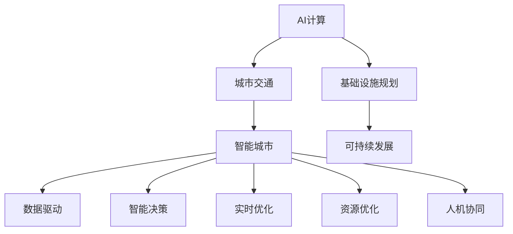

                 

# AI与人类计算：打造可持续发展的城市交通与基础设施规划管理

> 关键词：AI计算,城市交通,基础设施规划,智能城市,可持续发展,绿色建筑

## 1. 背景介绍

### 1.1 问题由来
随着人口的快速增长和城市化进程的不断推进，城市交通和基础设施规划管理已成为全球面临的重大挑战。在有限的资源和空间条件下，如何高效地规划和维护城市交通与基础设施，以实现可持续发展，是每一个城市面临的共同问题。传统的城市规划和管理方法依赖于大量的人力与时间投入，难以满足城市化进程中不断增长的需求。随着人工智能（AI）和计算技术的快速发展，利用AI与人类计算相结合的方式，可以大幅提升城市交通与基础设施规划管理的效率和准确性。

### 1.2 问题核心关键点
AI与人类计算在城市交通与基础设施规划管理中的应用，其核心在于结合AI的强大计算能力和人类的专业知识，进行高效、智能的决策支持。具体关键点包括：

1. **数据驱动**：城市交通与基础设施的规划和维护需要大量的数据支持，AI可以处理和分析海量数据，从中提取有价值的信息。
2. **智能决策**：AI能够利用学习到的知识进行智能决策，辅助人类规划者做出更科学、更合理的决策。
3. **实时优化**：AI可以实时分析交通与基础设施的运行状态，动态调整规划方案，以应对突发情况。
4. **资源优化**：AI能够优化资源配置，如交通流量控制、能源消耗等，以提高资源利用效率。
5. **人机协同**：结合AI的计算能力和人类的专业经验，实现人机协同，提升规划管理的整体水平。

## 2. 核心概念与联系

### 2.1 核心概念概述

为更好地理解AI与人类计算在城市交通与基础设施规划管理中的应用，本节将介绍几个密切相关的核心概念：

- **AI计算**：指利用人工智能技术进行大规模、高效的数据计算和分析，包括机器学习、深度学习等。
- **城市交通**：指城市中的车辆、行人、自行车等的移动和流动，包括道路、桥梁、车站等基础设施。
- **基础设施规划**：指对城市道路、桥梁、地铁、地下管线等基础设施的布局、设计和建设进行规划和管理。
- **智能城市**：指利用先进的信息技术，实现城市基础设施的智能化管理，提升城市运行效率和生活质量。
- **可持续发展**：指在满足当前社会发展需求的同时，不损害未来的发展潜力，保护生态环境。

这些核心概念之间的逻辑关系可以通过以下Mermaid流程图来展示：



这个流程图展示了几者之间的相互关系：

1. AI计算为城市交通和基础设施规划提供数据驱动和智能决策支持。
2. 智能城市通过AI计算实现基础设施的智能化管理，提升城市运行效率。
3. 可持续发展是城市交通与基础设施规划的目标，AI计算和智能城市建设是实现这一目标的重要手段。
4. 数据驱动、智能决策、实时优化、资源优化和人机协同是AI与人类计算在城市交通与基础设施规划管理中的关键技术。

## 3. 核心算法原理 & 具体操作步骤
### 3.1 算法原理概述

AI与人类计算在城市交通与基础设施规划管理中的应用，主要基于以下算法原理：

1. **数据收集与预处理**：从各种传感器、监控设备、公众反馈等渠道收集城市交通和基础设施的实时数据，并对数据进行清洗和预处理。
2. **数据建模与分析**：利用机器学习和深度学习技术，对收集到的数据进行建模和分析，提取有价值的信息和规律。
3. **智能决策与优化**：结合AI的计算能力和人类的专业知识，进行智能决策和优化，提出最佳方案。
4. **人机协同与反馈**：将AI的计算结果和决策建议反馈给规划者和用户，辅助其进行决策和调整。

### 3.2 算法步骤详解

以下是基于AI与人类计算的城市交通与基础设施规划管理的具体操作步骤：

**Step 1: 数据收集与预处理**
- 利用各种传感器和监控设备，收集城市交通和基础设施的实时数据。
- 通过数据清洗和预处理，去除噪音和异常值，确保数据质量。

**Step 2: 数据建模与分析**
- 使用机器学习模型对数据进行建模和分析，提取交通流量、车速、能源消耗等关键指标。
- 通过深度学习技术，对城市交通和基础设施进行预测和优化，如交通拥堵预测、能源消耗优化等。

**Step 3: 智能决策与优化**
- 结合AI的计算能力和人类的专业知识，进行智能决策和优化，如交通信号灯的优化、道路设计的改进等。
- 利用强化学习技术，动态调整规划方案，以应对突发情况，如交通事故、天气变化等。

**Step 4: 人机协同与反馈**
- 将AI的计算结果和决策建议反馈给规划者和用户，辅助其进行决策和调整。
- 通过人机协同，提升规划管理的整体水平，确保方案的科学性和合理性。

### 3.3 算法优缺点

AI与人类计算在城市交通与基础设施规划管理中的应用，具有以下优点：

1. **效率提升**：AI可以处理和分析海量数据，大幅提升规划管理的效率。
2. **决策科学**：AI能够利用学习到的知识进行智能决策，提升决策的科学性和合理性。
3. **实时优化**：AI可以实时分析交通与基础设施的运行状态，动态调整规划方案。
4. **资源优化**：AI能够优化资源配置，如交通流量控制、能源消耗等，提高资源利用效率。
5. **人机协同**：结合AI的计算能力和人类的专业经验，实现人机协同，提升规划管理的整体水平。

同时，该方法也存在一定的局限性：

1. **数据质量依赖**：AI的计算结果依赖于数据的质量，需要确保数据的准确性和全面性。
2. **模型复杂性**：AI模型的构建和维护需要较高的技术门槛，可能需要专业的知识和技能。
3. **计算资源需求**：AI计算需要大量的计算资源，对硬件设施要求较高。
4. **伦理与安全问题**：AI的决策可能存在伦理和安全问题，需要谨慎处理。
5. **透明度与可解释性**：AI的决策过程可能缺乏透明度和可解释性，难以理解和调试。

尽管存在这些局限性，但就目前而言，AI与人类计算的应用已成为城市交通与基础设施规划管理的重要手段。未来相关研究的重点在于如何进一步提高数据质量，简化模型，降低计算资源需求，同时兼顾伦理与安全、透明度与可解释性等因素。

### 3.4 算法应用领域

AI与人类计算在城市交通与基础设施规划管理中的应用，已经在多个领域得到了广泛应用，例如：

1. **智能交通管理**：利用AI进行交通流量预测、信号灯优化、路径规划等，提升交通运行效率。
2. **基础设施规划**：利用AI进行道路规划、桥梁设计、地下管线布局等，提高规划的科学性和合理性。
3. **绿色建筑**：利用AI进行能源消耗优化、建筑结构设计等，推动绿色建筑的发展。
4. **智能城市治理**：利用AI进行城市事件监测、应急响应、公共服务优化等，提升城市治理的智能化水平。
5. **灾害预警**：利用AI进行自然灾害预测、预警，保障城市安全。

除了上述这些经典应用外，AI与人类计算还被创新性地应用到更多场景中，如智慧医疗、智慧教育、智慧环保等，为城市管理带来了新的突破。

## 4. 数学模型和公式 & 详细讲解  
### 4.1 数学模型构建

为了更好地理解AI与人类计算在城市交通与基础设施规划管理中的应用，本节将介绍几个关键的数学模型。

假设城市交通和基础设施的运行状态可以用向量 $\mathbf{x}$ 表示，包括交通流量、车速、能源消耗等指标。AI模型的目标是从数据 $\mathbf{X}$ 中学习出最优的模型参数 $\theta$，使得模型输出 $\hat{\mathbf{x}}$ 与真实状态 $\mathbf{x}$ 尽可能接近。形式化地，假设模型 $M_{\theta}$ 在输入 $\mathbf{X}$ 上的损失函数为 $\ell(M_{\theta}(\mathbf{X}),\mathbf{x})$，则在数据集 $\mathcal{D}$ 上的经验风险为：

$$
\mathcal{L}(\theta) = \frac{1}{N} \sum_{i=1}^N \ell(M_{\theta}(\mathbf{x}_i),\mathbf{x}_i)
$$

其中 $\mathbf{x}_i$ 为样本 $i$ 的状态向量，$N$ 为样本数量。微调的目标是最小化经验风险，即找到最优参数：

$$
\theta^* = \mathop{\arg\min}_{\theta} \mathcal{L}(\theta)
$$

在实践中，我们通常使用基于梯度的优化算法（如SGD、Adam等）来近似求解上述最优化问题。设 $\eta$ 为学习率，$\lambda$ 为正则化系数，则参数的更新公式为：

$$
\theta \leftarrow \theta - \eta \nabla_{\theta}\mathcal{L}(\theta) - \eta\lambda\theta
$$

其中 $\nabla_{\theta}\mathcal{L}(\theta)$ 为损失函数对参数 $\theta$ 的梯度，可通过反向传播算法高效计算。

### 4.2 公式推导过程

以下我们以交通流量预测为例，推导基于神经网络的预测模型及其梯度计算公式。

假设城市交通流量可以用向量 $\mathbf{x}_t = (x_{t1},x_{t2},...,x_{tn})^T$ 表示，其中 $x_{ti}$ 为第 $i$ 个交叉口的交通流量。模型 $M_{\theta}$ 在输入 $\mathbf{x}_t$ 上的输出为 $\hat{\mathbf{x}}_t = (x_{t1}^*,x_{t2}^*,...,x_{tn}^*)^T$，表示预测的交通流量。则模型的损失函数定义为：

$$
\ell(\hat{\mathbf{x}}_t,\mathbf{x}_t) = \frac{1}{N} \sum_{i=1}^N (x_{ti}^* - x_{ti})^2
$$

将其代入经验风险公式，得：

$$
\mathcal{L}(\theta) = \frac{1}{N} \sum_{t=1}^T \ell(\hat{\mathbf{x}}_t,\mathbf{x}_t)
$$

其中 $T$ 为预测的时间步数。根据链式法则，损失函数对参数 $\theta_k$ 的梯度为：

$$
\frac{\partial \mathcal{L}(\theta)}{\partial \theta_k} = \frac{1}{N} \sum_{t=1}^T \sum_{i=1}^N 2(x_{ti}^* - x_{ti}) \frac{\partial x_{ti}^*}{\partial \theta_k}
$$

其中 $\frac{\partial x_{ti}^*}{\partial \theta_k}$ 可进一步递归展开，利用自动微分技术完成计算。

在得到损失函数的梯度后，即可带入参数更新公式，完成模型的迭代优化。重复上述过程直至收敛，最终得到适应城市交通流量预测的最优模型参数 $\theta^*$。

## 5. 项目实践：代码实例和详细解释说明
### 5.1 开发环境搭建

在进行AI与人类计算的城市交通与基础设施规划管理实践前，我们需要准备好开发环境。以下是使用Python进行TensorFlow开发的环境配置流程：

1. 安装Anaconda：从官网下载并安装Anaconda，用于创建独立的Python环境。

2. 创建并激活虚拟环境：
```bash
conda create -n ai-city python=3.8 
conda activate ai-city
```

3. 安装TensorFlow：根据CUDA版本，从官网获取对应的安装命令。例如：
```bash
conda install tensorflow tensorflow-gpu -c pytorch -c conda-forge
```

4. 安装Keras：
```bash
pip install keras
```

5. 安装各类工具包：
```bash
pip install numpy pandas scikit-learn matplotlib tqdm jupyter notebook ipython
```

完成上述步骤后，即可在`ai-city`环境中开始AI与人类计算的城市交通与基础设施规划管理实践。

### 5.2 源代码详细实现

下面我们以城市交通流量预测为例，给出使用TensorFlow和Keras进行神经网络模型训练的代码实现。

首先，定义训练数据集和模型：

```python
import tensorflow as tf
from keras.models import Sequential
from keras.layers import Dense, Dropout
from keras.optimizers import Adam
from sklearn.model_selection import train_test_split

# 假设已有一个包含历史交通流量的数据集，X为输入特征，y为交通流量
X = # 输入特征
y = # 交通流量

# 定义模型
model = Sequential()
model.add(Dense(64, input_dim=X.shape[1], activation='relu'))
model.add(Dropout(0.5))
model.add(Dense(1, activation='linear'))

# 编译模型
model.compile(loss='mse', optimizer=Adam(lr=0.001), metrics=['mse'])

# 划分训练集和验证集
X_train, X_test, y_train, y_test = train_test_split(X, y, test_size=0.2, random_state=42)
```

然后，定义训练函数：

```python
def train_model(model, X_train, y_train, epochs=100):
    model.fit(X_train, y_train, batch_size=32, epochs=epochs, verbose=1, validation_data=(X_test, y_test))
```

最后，启动训练流程并评估模型性能：

```python
train_model(model, X_train, y_train)

# 评估模型性能
mse = model.evaluate(X_test, y_test, verbose=0)
print(f'Mean Squared Error: {mse:.3f}')
```

以上就是使用TensorFlow和Keras对城市交通流量预测进行神经网络模型训练的完整代码实现。可以看到，得益于Keras的强大封装，我们可以用相对简洁的代码完成模型的构建和训练。

### 5.3 代码解读与分析

让我们再详细解读一下关键代码的实现细节：

**模型定义**：
- 使用Keras的Sequential模型定义多层神经网络，包含一个全连接层和一个线性输出层。
- 使用Dropout技术减少过拟合。

**训练函数**：
- 使用Keras的fit方法进行模型训练，指定训练集、验证集、学习率、迭代轮数等参数。
- 使用evaluate方法评估模型性能，计算均方误差。

**训练流程**：
- 在训练函数中调用fit方法，指定训练集、验证集、批次大小、迭代轮数等参数。
- 通过fit方法进行模型训练，在每个epoch结束时输出训练进度。
- 在训练结束后，使用evaluate方法计算模型在测试集上的均方误差，并输出结果。

可以看到，TensorFlow和Keras使得神经网络模型的构建和训练变得非常简洁和高效。开发者可以将更多精力放在模型改进、数据处理等高层逻辑上，而不必过多关注底层的实现细节。

当然，工业级的系统实现还需考虑更多因素，如模型的保存和部署、超参数的自动搜索、更灵活的模型架构等。但核心的神经网络模型训练流程基本与此类似。

## 6. 实际应用场景
### 6.1 智能交通管理

利用AI与人类计算的城市交通与基础设施规划管理方法，可以广泛应用于智能交通系统的构建。传统交通管理系统依赖大量的人力和时间投入，高峰期响应缓慢，且管理效率难以保证。而使用AI与人类计算的交通管理系统，可以24小时不间断服务，快速响应交通事件，提升交通运行效率。

在技术实现上，可以收集城市的交通流量、速度、交通事故等数据，训练AI模型进行实时预测和优化。AI模型可以识别交通瓶颈，动态调整信号灯、道路通行规则，甚至进行智能导航，引导车辆避开拥堵路段。通过AI与人类计算的协同工作，可以实现更加高效、智能的交通管理。

### 6.2 绿色建筑

利用AI与人类计算的城市交通与基础设施规划管理方法，可以推动绿色建筑的发展。传统建筑的设计和运行依赖大量的人工经验，效率低下，且难以保证环保和节能效果。而使用AI与人类计算的建筑管理系统，可以优化能源消耗、水资源利用、材料选择等，提升建筑的环保和节能水平。

在技术实现上，可以收集建筑物的能源消耗、环境监测等数据，训练AI模型进行实时预测和优化。AI模型可以识别能源消耗异常点，提出改进方案，甚至进行智能调度，优化能源配置。通过AI与人类计算的协同工作，可以实现更加高效、智能的建筑管理，推动绿色建筑的发展。

### 6.3 智能城市治理

利用AI与人类计算的城市交通与基础设施规划管理方法，可以实现智能城市治理。传统城市治理依赖人工收集、分析和处理数据，效率低下，且难以全面覆盖。而使用AI与人类计算的城市管理系统，可以实时监测、分析和处理城市数据，提升城市治理的智能化水平。

在技术实现上，可以收集城市的各类数据，如交通流量、能源消耗、环境监测等，训练AI模型进行实时预测和优化。AI模型可以识别异常情况，提出改进方案，甚至进行智能调度，优化城市资源配置。通过AI与人类计算的协同工作，可以实现更加高效、智能的城市治理，提升城市运行效率和生活质量。

### 6.4 未来应用展望

随着AI与人类计算方法的不断发展，未来的城市交通与基础设施规划管理将呈现以下几个趋势：

1. **智能化程度提升**：未来的交通与基础设施管理系统将更加智能化，能够实时预测和优化各类运行状态，提升城市运行效率。
2. **数据融合能力增强**：未来的系统将具备更强的数据融合能力，能够整合各类数据源，提供更加全面和准确的信息支持。
3. **人机协同优化**：未来的系统将更加注重人机协同，结合AI的计算能力和人类的专业经验，实现最优的决策和优化。
4. **跨领域融合**：未来的系统将实现跨领域的融合，如交通、能源、环境等，提供综合性的城市管理解决方案。
5. **可持续发展推动**：未来的系统将更加注重可持续发展，通过优化资源配置，推动绿色建筑和低碳城市的建设。

## 7. 工具和资源推荐
### 7.1 学习资源推荐

为了帮助开发者系统掌握AI与人类计算的城市交通与基础设施规划管理技术，这里推荐一些优质的学习资源：

1. 《深度学习》系列博文：由大模型技术专家撰写，深入浅出地介绍了深度学习原理和应用，包括神经网络模型、优化算法等基础内容。

2. CS231n《深度学习计算机视觉》课程：斯坦福大学开设的计算机视觉明星课程，涵盖图像分类、目标检测、语义分割等经典任务，是学习视觉计算的必备课程。

3. 《自然语言处理与深度学习》书籍：深度学习专家Yoshua Bengio所著，全面介绍了自然语言处理的基本概念和深度学习方法，包括神经网络模型、序列建模等。

4. TensorFlow官方文档：TensorFlow的官方文档，提供了海量API和样例代码，是学习TensorFlow的必备资料。

5. PyTorch官方文档：PyTorch的官方文档，提供了丰富的深度学习库和工具，是学习深度学习的重要资源。

通过对这些资源的学习实践，相信你一定能够快速掌握AI与人类计算的精髓，并用于解决实际的城市交通与基础设施规划管理问题。

### 7.2 开发工具推荐

高效的开发离不开优秀的工具支持。以下是几款用于AI与人类计算的城市交通与基础设施规划管理开发的常用工具：

1. TensorFlow：由Google主导开发的开源深度学习框架，生产部署方便，适合大规模工程应用。同样有丰富的预训练语言模型资源。

2. PyTorch：基于Python的开源深度学习框架，灵活动态的计算图，适合快速迭代研究。大部分预训练语言模型都有PyTorch版本的实现。

3. Keras：由François Chollet开发的深度学习框架，封装简单易用，适合初学者快速上手。

4. Weights & Biases：模型训练的实验跟踪工具，可以记录和可视化模型训练过程中的各项指标，方便对比和调优。与主流深度学习框架无缝集成。

5. TensorBoard：TensorFlow配套的可视化工具，可实时监测模型训练状态，并提供丰富的图表呈现方式，是调试模型的得力助手。

6. Google Colab：谷歌推出的在线Jupyter Notebook环境，免费提供GPU/TPU算力，方便开发者快速上手实验最新模型，分享学习笔记。

合理利用这些工具，可以显著提升AI与人类计算的城市交通与基础设施规划管理任务的开发效率，加快创新迭代的步伐。

### 7.3 相关论文推荐

AI与人类计算在城市交通与基础设施规划管理中的应用，得益于学界的持续研究。以下是几篇奠基性的相关论文，推荐阅读：

1. AI for Smart Cities: Challenges and Opportunities（人工智能与智慧城市）：探讨了AI在智慧城市中的应用挑战和机遇，为智慧城市的构建提供了理论支持。

2. Smart Cities: The Future of Urban Planning（智慧城市：未来城市规划）：介绍了智慧城市的概念、技术和应用，为城市规划提供了新的思路。

3. Machine Learning in Urban Planning: Opportunities and Challenges（机器学习在城市规划中的应用）：探讨了机器学习在城市规划中的应用，为城市规划提供了新的工具和方法。

4. Sustainable Urban Planning with AI（AI在可持续城市规划中的应用）：探讨了AI在可持续城市规划中的应用，为绿色建筑和低碳城市的建设提供了新的思路。

这些论文代表了大规模计算在城市交通与基础设施规划管理领域的进展和方向。通过学习这些前沿成果，可以帮助研究者把握学科前进方向，激发更多的创新灵感。

## 8. 总结：未来发展趋势与挑战

### 8.1 总结

本文对AI与人类计算在城市交通与基础设施规划管理中的应用进行了全面系统的介绍。首先阐述了AI与人类计算的研究背景和意义，明确了其在大规模计算在城市管理中的应用价值。其次，从原理到实践，详细讲解了AI与人类计算的城市交通与基础设施规划管理方法，给出了具体的代码实例。同时，本文还广泛探讨了AI与人类计算在多个领域的应用前景，展示了其广阔的应用空间。

通过本文的系统梳理，可以看到，AI与人类计算在城市交通与基础设施规划管理中的应用，已经在多个领域得到了广泛应用，为城市管理带来了新的思路和手段。随着AI与人类计算方法的不断发展，未来城市交通与基础设施规划管理将更加智能化、高效化、可持续化。

### 8.2 未来发展趋势

展望未来，AI与人类计算在城市交通与基础设施规划管理中的应用将呈现以下几个发展趋势：

1. **智能化水平提升**：未来的城市交通与基础设施管理系统将更加智能化，能够实时预测和优化各类运行状态，提升城市运行效率。
2. **数据融合能力增强**：未来的系统将具备更强的数据融合能力，能够整合各类数据源，提供更加全面和准确的信息支持。
3. **人机协同优化**：未来的系统将更加注重人机协同，结合AI的计算能力和人类的专业经验，实现最优的决策和优化。
4. **跨领域融合**：未来的系统将实现跨领域的融合，如交通、能源、环境等，提供综合性的城市管理解决方案。
5. **可持续发展推动**：未来的系统将更加注重可持续发展，通过优化资源配置，推动绿色建筑和低碳城市的建设。

### 8.3 面临的挑战

尽管AI与人类计算在城市交通与基础设施规划管理中的应用已经取得了显著进展，但在迈向更加智能化、普适化应用的过程中，仍面临诸多挑战：

1. **数据质量问题**：城市交通与基础设施的数据采集和处理需要高精度和高可靠性，数据质量问题依然存在。需要进一步提升数据采集和处理技术，确保数据质量。
2. **算法复杂性**：AI与人类计算的方法复杂度较高，需要专业的知识和技能。需要进一步降低算法的复杂性，提升算法的可操作性。
3. **资源需求高**：AI与人类计算的方法需要大量的计算资源，对硬件设施要求较高。需要进一步降低计算资源需求，优化算法效率。
4. **伦理与安全问题**：AI与人类计算的方法可能存在伦理和安全问题，如隐私保护、数据滥用等。需要进一步加强数据安全保护，确保算法的伦理性和安全性。
5. **透明度与可解释性**：AI与人类计算的方法可能缺乏透明度和可解释性，难以理解和调试。需要进一步提升算法的透明度和可解释性。

尽管存在这些挑战，但就目前而言，AI与人类计算的应用已成为城市交通与基础设施规划管理的重要手段。未来相关研究的重点在于如何进一步提高数据质量，简化算法，降低资源需求，同时兼顾伦理与安全、透明度与可解释性等因素。

### 8.4 研究展望

面对AI与人类计算在城市交通与基础设施规划管理中所面临的挑战，未来的研究需要在以下几个方面寻求新的突破：

1. **数据采集与处理技术**：进一步提升数据采集和处理技术，确保数据质量。
2. **算法优化与简化**：进一步降低算法的复杂性，提升算法的可操作性。
3. **资源优化与效率提升**：进一步降低计算资源需求，优化算法效率。
4. **伦理与安全性保障**：进一步加强数据安全保护，确保算法的伦理性和安全性。
5. **透明度与可解释性提升**：进一步提升算法的透明度和可解释性。

这些研究方向的探索，必将引领AI与人类计算在城市交通与基础设施规划管理技术迈向更高的台阶，为构建安全、可靠、可持续的智能城市提供新的技术支持。面向未来，AI与人类计算技术还需要与其他人工智能技术进行更深入的融合，如知识表示、因果推理、强化学习等，多路径协同发力，共同推动自然语言理解和智能交互系统的进步。只有勇于创新、敢于突破，才能不断拓展城市交通与基础设施规划管理的边界，让智能技术更好地造福人类社会。

## 9. 附录：常见问题与解答

**Q1：AI与人类计算是否适用于所有城市交通与基础设施规划管理任务？**

A: AI与人类计算在大多数城市交通与基础设施规划管理任务上都能取得不错的效果，特别是对于数据量较小的任务。但对于一些特定领域的任务，如特定的交通流量预测、特定的基础设施规划等，AI与人类计算可能需要进行针对性的改进和优化。

**Q2：AI与人类计算在城市交通与基础设施规划管理中面临哪些挑战？**

A: AI与人类计算在城市交通与基础设施规划管理中面临以下挑战：
1. 数据质量问题：城市交通与基础设施的数据采集和处理需要高精度和高可靠性，数据质量问题依然存在。
2. 算法复杂性：AI与人类计算的方法复杂度较高，需要专业的知识和技能。
3. 资源需求高：AI与人类计算的方法需要大量的计算资源，对硬件设施要求较高。
4. 伦理与安全问题：AI与人类计算的方法可能存在伦理和安全问题，如隐私保护、数据滥用等。
5. 透明度与可解释性：AI与人类计算的方法可能缺乏透明度和可解释性，难以理解和调试。

尽管存在这些挑战，但通过不断优化数据采集和处理技术，简化算法，降低资源需求，加强数据安全保护，提升算法的透明度和可解释性，AI与人类计算在城市交通与基础设施规划管理中的应用前景依然广阔。

**Q3：如何提高AI与人类计算在城市交通与基础设施规划管理中的应用效果？**

A: 提高AI与人类计算在城市交通与基础设施规划管理中的应用效果，可以采取以下措施：
1. 提升数据质量：通过高精度和高可靠性的数据采集和处理技术，确保数据质量。
2. 简化算法：进一步降低算法的复杂性，提升算法的可操作性。
3. 优化资源：进一步降低计算资源需求，优化算法效率。
4. 加强保护：进一步加强数据安全保护，确保算法的伦理性和安全性。
5. 提升透明性：进一步提升算法的透明度和可解释性，方便理解和调试。

通过这些措施，可以进一步提升AI与人类计算在城市交通与基础设施规划管理中的应用效果，推动城市管理的智能化和可持续发展。

---

作者：禅与计算机程序设计艺术 / Zen and the Art of Computer Programming

