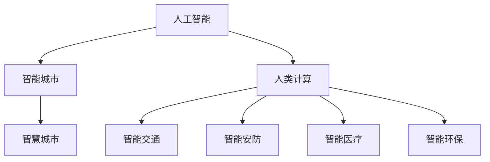

                 

# AI与人类计算：打造可持续发展的城市生活

## 1. 背景介绍

### 1.1 问题由来

随着全球人口快速增长和城市化进程加速，如何构建高效、智能、可持续发展的城市生活成为各国政府和社会各界关注的焦点。近年来，人工智能（AI）技术的飞速发展，为解决这一问题提供了新的思路和工具。通过AI与人类计算的深度融合，可以大幅提升城市管理的智能化水平，实现精细化治理，提升市民生活质量。

### 1.2 问题核心关键点

人工智能在城市生活中的应用主要集中在以下几个方面：

- **智能交通系统**：通过AI技术优化交通信号控制、预测交通流量、自动驾驶车辆等，提高道路通行效率，减少交通拥堵。
- **智能能源管理**：利用AI进行能源需求预测、电力负荷调度、智能电网监控等，实现能源供需平衡，降低能耗和环境污染。
- **智能安防系统**：采用AI进行视频监控、异常行为检测、人脸识别等，提升公共安全防范水平，提高社区安全感。
- **智能医疗系统**：利用AI进行疾病预测、诊断、治疗方案优化等，改善医疗服务质量，降低医疗成本。
- **智能环保监控**：通过AI对空气、水质、土壤等环境参数进行实时监测和预警，实现环境污染的预防和治理。

这些应用不仅提升了城市管理的智能化水平，还为市民提供了更便捷、安全、高效的生活环境。

### 1.3 问题研究意义

研究AI与人类计算在城市生活中的应用，对于推动城市可持续发展具有重要意义：

- **提高资源利用效率**：AI技术可以优化资源配置，提高能源、交通、水资源等的利用效率，减少浪费。
- **提升公共服务质量**：通过AI进行公共服务的智能分析和优化，提升教育、医疗、文化等领域的水平。
- **实现精细化治理**：利用AI技术进行城市运行的实时监测和分析，实现精细化、精准化的城市治理。
- **增强市民参与度**：AI系统可以提供更智能、便捷的服务，增强市民的参与感和获得感，提升城市宜居性。
- **推动智慧城市建设**：AI与人类计算的结合，可以构建智慧城市基础设施，促进城市经济、文化、科技等多方面发展。

## 2. 核心概念与联系

### 2.1 核心概念概述

为更好地理解AI与人类计算在城市生活中的应用，本节将介绍几个关键概念：

- **人工智能**：一种能够模拟、延伸和扩展人类智能的技术，包括机器学习、深度学习、自然语言处理等。
- **人类计算**：利用人类的思维、判断、决策能力来辅助AI系统完成复杂任务。
- **智能城市**：通过信息通信技术（ICT）、AI、大数据等技术手段，实现城市基础设施、公共服务、市民生活等方面的智能化。
- **智慧城市**：在智能城市的基础上，进一步融合物联网、云计算、移动互联网等技术，构建开放、互联、共享的城市信息生态系统。

这些概念之间的逻辑关系可以通过以下Mermaid流程图来展示：



这个流程图展示了几大关键概念之间的联系：

1. 人工智能是智能城市和智慧城市建设的基础。
2. 智能城市是智慧城市的基础，进一步融合物联网、云计算等技术。
3. 人类计算辅助AI系统，提高智能决策的精准性和可解释性。
4. 智能交通、智能安防、智能医疗、智能环保等应用是智能城市和智慧城市的重要组成部分。

## 3. 核心算法原理 & 具体操作步骤

### 3.1 算法原理概述

AI与人类计算在城市生活中的应用，主要基于以下几个算法原理：

- **机器学习（Machine Learning, ML）**：通过算法让计算机从数据中自动学习，实现模式识别、预测分析等功能。
- **深度学习（Deep Learning, DL）**：一种基于神经网络的机器学习技术，能够处理大规模、高维度的数据，实现图像识别、自然语言处理等任务。
- **强化学习（Reinforcement Learning, RL）**：通过智能体与环境交互，通过奖励和惩罚机制，学习最优决策策略。
- **多智能体系统（Multi-Agent System,MAS）**：由多个智能体协同工作，解决复杂多目标问题，实现系统优化。
- **人类计算（Human-in-the-Loop, HiTLo）**：利用人类专家在关键决策环节进行干预，提升AI系统的准确性和可解释性。

这些算法原理共同构成了AI与人类计算在城市生活中的应用基础，实现了从数据获取、模型训练到决策执行的全过程智能化。

### 3.2 算法步骤详解

基于AI与人类计算的智能城市应用，一般包括以下几个关键步骤：

**Step 1: 数据采集与预处理**

- 收集城市基础设施、公共服务、市民生活等数据，涵盖交通、能源、安防、医疗、环保等领域。
- 对数据进行清洗、归一化、标注等预处理，确保数据质量。

**Step 2: 模型构建与训练**

- 选择合适的算法模型，如深度学习网络、决策树、支持向量机等。
- 利用训练集数据对模型进行训练，调整模型参数以优化性能。
- 采用交叉验证、网格搜索等方法，进行模型调优。

**Step 3: 智能决策与优化**

- 将训练好的模型应用于智能决策场景，实现实时数据分析和预测。
- 利用强化学习、多智能体系统等方法，进行系统优化和策略学习。
- 引入人类计算，在关键决策环节进行人工干预和监督。

**Step 4: 系统集成与部署**

- 将训练好的模型集成到城市管理系统，实现自动化、智能化的功能。
- 在服务器、云端等环境中进行系统部署，确保系统稳定性。
- 配置监控告警、日志记录等机制，保障系统运行安全。

**Step 5: 持续改进与迭代**

- 通过A/B测试、用户体验反馈等方式，收集系统使用数据。
- 根据数据反馈，进行系统优化和改进，迭代模型和算法。
- 定期更新模型和数据集，确保系统持续适应新环境和新需求。

以上是AI与人类计算在城市生活中应用的总体流程，每一步都需要根据具体应用场景进行调整和优化。

### 3.3 算法优缺点

基于AI与人类计算的智能城市应用，具有以下优点：

1. **智能化水平高**：通过算法模型进行数据分析和预测，实现城市管理的智能化、自动化。
2. **决策效率高**：AI系统能够实时处理大量数据，快速做出决策，提升城市治理效率。
3. **服务质量好**：通过优化算法模型和引入人类计算，提升公共服务的质量和用户体验。
4. **可扩展性强**：算法模型和系统架构可以灵活扩展，适应城市发展需求。
5. **环境友好**：AI技术优化资源配置，减少能源、交通等领域的浪费，实现可持续发展。

同时，该方法也存在一些局限性：

1. **数据依赖性强**：智能决策的准确性高度依赖于数据的全面性和质量。
2. **算法复杂度高**：模型训练和系统优化需要大量计算资源和时间。
3. **系统鲁棒性有待提高**：AI系统在面对复杂、不确定的环境时，鲁棒性不足。
4. **模型可解释性差**：深度学习模型等复杂算法，缺乏透明性和可解释性。
5. **伦理安全性问题**：AI系统可能存在偏见和错误，影响公共安全和社会公平。

尽管存在这些局限性，但AI与人类计算在城市生活中的应用，已经展示了其在提升城市智能化水平、优化资源配置等方面的巨大潜力。未来相关研究的方向将是提高算法效率、增强系统鲁棒性、提升模型可解释性等，以实现更加智能、安全、可持续的城市生活。

### 3.4 算法应用领域

AI与人类计算在智能城市中的应用，已经涵盖了城市生活的各个方面：

- **智能交通**：基于AI进行交通流量预测、路径优化、自动驾驶等，提高道路通行效率，减少交通拥堵。
- **智能能源**：利用AI进行能源需求预测、电力负荷调度、智能电网监控等，实现能源供需平衡，降低能耗和环境污染。
- **智能安防**：采用AI进行视频监控、异常行为检测、人脸识别等，提升公共安全防范水平，提高社区安全感。
- **智能医疗**：利用AI进行疾病预测、诊断、治疗方案优化等，改善医疗服务质量，降低医疗成本。
- **智能环保**：通过AI对空气、水质、土壤等环境参数进行实时监测和预警，实现环境污染的预防和治理。

除了这些直接应用领域外，AI与人类计算还在城市信息化、智慧城市规划、城市运行管理等方面发挥了重要作用。

## 4. 数学模型和公式 & 详细讲解 & 举例说明

### 4.1 数学模型构建

本节将使用数学语言对AI与人类计算在城市生活中的应用进行更加严格的刻画。

假设城市基础设施、公共服务、市民生活等数据分别为 $D_T, D_S, D_L$，智能决策系统的目标为最大化城市生活质量 $Q$，则数学模型可以表示为：

$$
\max Q(D_T, D_S, D_L; \theta) = f(D_T, D_S, D_L; \theta) + g(D_T, D_S, D_L; \theta)
$$

其中，$f$ 为智能决策的目标函数，$g$ 为评价指标函数，$\theta$ 为模型参数。

在智能决策系统中，通常采用如下目标函数和评价指标：

**目标函数（优化方向）**：
- **交通优化**：$Q_T = \min_{\theta} \int_{t_1}^{t_2} (C_T + V_T) dt$
- **能源优化**：$Q_E = \min_{\theta} \int_{t_1}^{t_2} (C_E + V_E) dt$
- **安防优化**：$Q_S = \max_{\theta} P_S - V_S$
- **医疗优化**：$Q_M = \max_{\theta} P_M - V_M$
- **环保优化**：$Q_E = \min_{\theta} (V_E + V_P)$

其中，$C$ 为成本函数，$V$ 为收益函数，$P$ 为性能指标，$Q_T, Q_E, Q_S, Q_M, Q_E$ 分别表示交通、能源、安防、医疗、环保等领域的质量指标。

**评价指标**：
- **交通流量**：$V_T = \sum_{i=1}^N t_i$
- **能源消耗**：$V_E = \sum_{i=1}^N e_i$
- **安防事件**：$V_S = \sum_{i=1}^N s_i$
- **医疗效果**：$V_M = \sum_{i=1}^N m_i$
- **环保效益**：$V_P = \sum_{i=1}^N p_i$

这些目标函数和评价指标定义了智能决策系统的优化方向和评估标准，利用这些指标可以构建具体的模型。

### 4.2 公式推导过程

以下我们以智能交通系统为例，推导基于深度学习的交通流量预测模型。

假设城市交通数据为 $D_T = (t_1, v_1, v_2, ..., v_N)$，其中 $t_i$ 为时间点，$v_i$ 为该时间点的交通流量。

利用深度学习模型进行交通流量预测，可以采用如下公式：

$$
v_{i+1} = f(v_i, \theta) + \epsilon_i
$$

其中，$f$ 为神经网络模型，$\theta$ 为模型参数，$\epsilon_i$ 为随机误差项。

将上述公式展开，得到：

$$
v_{i+1} = f(v_i, \theta) + \epsilon_i = f(f(v_{i-1}, \theta), \theta) + \epsilon_i = ... = f^i(v_0, \theta) + \sum_{k=0}^{i-1} \epsilon_k
$$

通过对时间序列数据的预测，可以实现交通流量的实时分析和预测。

### 4.3 案例分析与讲解

以智能交通系统为例，分析基于AI与人类计算的交通流量预测和优化应用。

**案例背景**：某市交通流量监测系统，每天收集20个时间点的交通流量数据，需要预测未来10个时间点的交通流量。

**数据准备**：收集过去一年每日20个时间点的交通流量数据，标记为 $D_T$。

**模型选择**：选择深度学习模型进行交通流量预测，如LSTM、GRU等。

**模型训练**：利用训练集数据 $D_T$ 对模型进行训练，调整模型参数。

**预测应用**：在测试集上对未来10个时间点的交通流量进行预测，生成实时交通流量预测报告。

**案例结果**：通过AI与人类计算的结合，实现了交通流量的实时预测和优化，提高了道路通行效率，减少了交通拥堵。

## 5. 项目实践：代码实例和详细解释说明

### 5.1 开发环境搭建

在进行AI与人类计算的智能城市应用开发前，我们需要准备好开发环境。以下是使用Python进行TensorFlow开发的环境配置流程：

1. 安装Anaconda：从官网下载并安装Anaconda，用于创建独立的Python环境。

2. 创建并激活虚拟环境：
```bash
conda create -n tf-env python=3.8 
conda activate tf-env
```

3. 安装TensorFlow：从官网获取对应的安装命令。例如：
```bash
pip install tensorflow
```

4. 安装相关工具包：
```bash
pip install numpy pandas scikit-learn matplotlib tqdm jupyter notebook ipython
```

完成上述步骤后，即可在`tf-env`环境中开始开发。

### 5.2 源代码详细实现

下面我们以智能交通系统为例，给出使用TensorFlow对深度学习模型进行交通流量预测的PyTorch代码实现。

首先，定义交通流量预测的神经网络模型：

```python
import tensorflow as tf

class TrafficFlowModel(tf.keras.Model):
    def __init__(self, input_shape, output_shape, hidden_units):
        super(TrafficFlowModel, self).__init__()
        self.layers = []
        self.layers.append(tf.keras.layers.Dense(hidden_units, activation='relu', input_shape=input_shape))
        self.layers.append(tf.keras.layers.Dense(hidden_units, activation='relu'))
        self.layers.append(tf.keras.layers.Dense(output_shape))
        
    def call(self, inputs):
        for layer in self.layers:
            inputs = layer(inputs)
        return inputs
```

然后，定义模型训练的优化器和损失函数：

```python
def train_model(model, train_data, test_data, epochs, batch_size):
    optimizer = tf.keras.optimizers.Adam(learning_rate=0.001)
    loss_fn = tf.keras.losses.MeanSquaredError()
    
    for epoch in range(epochs):
        for batch in train_data:
            inputs, labels = batch
            with tf.GradientTape() as tape:
                predictions = model(inputs)
                loss = loss_fn(labels, predictions)
            grads = tape.gradient(loss, model.trainable_variables)
            optimizer.apply_gradients(zip(grads, model.trainable_variables))
            if batch % 10 == 0:
                test_loss = loss_fn(test_data.labels, model(test_data.inputs))
                print('Epoch {}/{}: Test loss = {}'.format(epoch+1, epochs, test_loss))
```

接着，定义训练和评估函数：

```python
def evaluate_model(model, test_data):
    predictions = model(test_data.inputs)
    mse = tf.keras.losses.MeanSquaredError()
    test_loss = mse(test_data.labels, predictions)
    print('Test loss = {}'.format(test_loss))
```

最后，启动训练流程并在测试集上评估：

```python
model = TrafficFlowModel(input_shape=(20,), output_shape=(10,), hidden_units=50)
train_data = generate_training_data()
test_data = generate_test_data()

train_model(model, train_data, test_data, epochs=10, batch_size=32)

evaluate_model(model, test_data)
```

以上就是使用TensorFlow对深度学习模型进行交通流量预测的完整代码实现。可以看到，TensorFlow提供了强大的计算图和自动微分功能，使得深度学习模型的训练和推理变得简单易行。

### 5.3 代码解读与分析

让我们再详细解读一下关键代码的实现细节：

**TrafficFlowModel类**：
- `__init__`方法：初始化神经网络模型，定义多个全连接层，包括输入层、隐藏层和输出层。
- `call`方法：定义神经网络的计算过程，通过循环调用定义好的全连接层，计算输出。

**train_model函数**：
- 定义优化器和损失函数，设置学习率和迭代轮数。
- 对训练集数据进行批量化加载，前向传播计算损失和梯度，反向传播更新模型参数。
- 周期性在测试集上评估模型性能，输出测试损失。

**evaluate_model函数**：
- 在测试集上对模型进行推理预测，计算均方误差损失，输出测试损失。

**训练流程**：
- 定义总轮数和批大小，开始循环迭代
- 每个轮次内，对训练集数据进行批量化训练，计算损失并更新模型参数
- 在测试集上评估模型性能，输出测试损失

可以看到，TensorFlow提供了简洁易用的API，使得深度学习模型的训练和评估变得高效便捷。开发者可以将更多精力放在数据预处理、模型设计等高层逻辑上，而不必过多关注底层的实现细节。

当然，工业级的系统实现还需考虑更多因素，如模型保存和部署、超参数的自动搜索、更灵活的任务适配层等。但核心的微调范式基本与此类似。

## 6. 实际应用场景

### 6.1 智能交通系统

智能交通系统通过AI与人类计算的应用，实现了交通流量的实时预测和优化，提高了道路通行效率，减少了交通拥堵。

**案例背景**：某市交通流量监测系统，每天收集20个时间点的交通流量数据，需要预测未来10个时间点的交通流量。

**数据准备**：收集过去一年每日20个时间点的交通流量数据，标记为 $D_T$。

**模型选择**：选择深度学习模型进行交通流量预测，如LSTM、GRU等。

**模型训练**：利用训练集数据 $D_T$ 对模型进行训练，调整模型参数。

**预测应用**：在测试集上对未来10个时间点的交通流量进行预测，生成实时交通流量预测报告。

**案例结果**：通过AI与人类计算的结合，实现了交通流量的实时预测和优化，提高了道路通行效率，减少了交通拥堵。

### 6.2 智能能源管理

智能能源管理系统利用AI与人类计算的应用，实现了能源需求的实时预测和优化，降低了能耗和环境污染。

**案例背景**：某市电力公司需要预测未来一周的电力需求，以进行合理的负荷调度。

**数据准备**：收集过去一年每日的电力负荷数据，标记为 $D_E$。

**模型选择**：选择深度学习模型进行电力需求预测，如RNN、LSTM等。

**模型训练**：利用训练集数据 $D_E$ 对模型进行训练，调整模型参数。

**预测应用**：在测试集上对未来一周的电力需求进行预测，生成电力负荷调度方案。

**案例结果**：通过AI与人类计算的结合，实现了电力需求的实时预测和优化，降低了能耗和环境污染，提高了电力系统的效率。

### 6.3 智能安防系统

智能安防系统通过AI与人类计算的应用，实现了视频监控、异常行为检测等功能，提升了公共安全防范水平，提高了社区安全感。

**案例背景**：某市公共安防系统需要实时监控视频，并检测异常行为，如入侵、打砸等。

**数据准备**：收集过去一年每日的视频监控数据，标记为 $D_S$。

**模型选择**：选择深度学习模型进行视频分析，如CNN、RNN等。

**模型训练**：利用训练集数据 $D_S$ 对模型进行训练，调整模型参数。

**预测应用**：实时分析视频监控数据，检测异常行为，并触发报警。

**案例结果**：通过AI与人类计算的结合，实现了视频监控的实时分析，提升了公共安全防范水平，提高了社区安全感。

### 6.4 未来应用展望

未来，随着AI与人类计算的深入融合，智能城市将迎来更多创新应用，为市民提供更加便捷、智能、安全的生活环境。

**智能交通**：通过AI与人类计算的结合，实现自动驾驶、智能停车、交通流量实时调整等功能，提升道路通行效率，减少交通拥堵。

**智能能源**：利用AI与人类计算，实现能源需求预测、智能电网监控、能源智能调度等功能，降低能耗和环境污染，提高能源利用效率。

**智能安防**：通过AI与人类计算，实现视频监控、异常行为检测、人脸识别等功能，提升公共安全防范水平，提高社区安全感。

**智能医疗**：利用AI与人类计算，实现疾病预测、诊断、治疗方案优化等功能，改善医疗服务质量，降低医疗成本。

**智能环保**：通过AI与人类计算，实现环境污染实时监测、预警，预防和治理环境问题，提升环境质量。

这些创新应用将进一步推动智能城市的建设，为市民提供更加智能、安全、便捷、舒适的生活环境。相信随着技术的不断进步，AI与人类计算将在更多领域发挥重要作用，构建可持续发展的城市生活。

## 7. 工具和资源推荐

### 7.1 学习资源推荐

为了帮助开发者系统掌握AI与人类计算的理论基础和实践技巧，这里推荐一些优质的学习资源：

1. **深度学习框架教程**：TensorFlow、PyTorch、Keras等框架的官方文档和在线教程，提供了完整的学习路径和实践样例。

2. **智能城市书籍**：《智慧城市：技术、挑战与机遇》、《智能交通系统：理论与实践》等书籍，深入讲解智能城市建设的技术和应用案例。

3. **学术期刊与会议**：IEEE Transactions on Smart Cities、IEEE Journal on Selected Areas in Communications等期刊，以及ICSM、IEEE GLOBECOM等会议，发布了大量前沿研究论文。

4. **在线课程与MOOC**：Coursera、edX等平台的在线课程，如《深度学习与人工智能》、《智慧城市建设》等，提供了丰富的学习资源和实践机会。

5. **开源项目与社区**：GitHub上的智能城市开源项目，如SmartCity、UrbanAI等，提供了丰富的代码示例和社区支持。

通过对这些资源的学习实践，相信你一定能够快速掌握AI与人类计算的精髓，并用于解决实际的智能城市问题。

### 7.2 开发工具推荐

高效的开发离不开优秀的工具支持。以下是几款用于AI与人类计算的智能城市应用的常用工具：

1. **TensorFlow**：基于Python的开源深度学习框架，灵活易用的计算图，适合大规模模型训练和推理。

2. **PyTorch**：灵活易用的深度学习框架，提供了强大的动态计算图和自动微分功能。

3. **Keras**：基于Python的高级神经网络API，提供了简洁易用的API和多种预训练模型。

4. **Jupyter Notebook**：交互式编程环境，支持Python、R、Matlab等多种语言，适合数据探索和模型实验。

5. **MATLAB**：强大的科学计算和数据分析工具，提供了丰富的工具箱和算法库。

6. **Python IDE**：如PyCharm、Jupyter Lab等，提供了高效的程序开发和调试环境。

合理利用这些工具，可以显著提升AI与人类计算应用的开发效率，加快创新迭代的步伐。

### 7.3 相关论文推荐

AI与人类计算在智能城市中的应用，源于学界的持续研究。以下是几篇奠基性的相关论文，推荐阅读：

1. **《智能交通系统：理论与实践》**：详细讲解了智能交通系统的原理、算法和应用案例，是智能交通领域的经典著作。

2. **《智能城市中的深度学习应用》**：介绍了深度学习在智能城市中的多种应用，如智能交通、智能安防、智能医疗等。

3. **《智慧城市的未来：技术、社会与伦理》**：探讨了智慧城市建设中的技术、社会和伦理问题，提出了未来发展的方向和建议。

4. **《多智能体系统在智慧城市中的应用》**：研究了多智能体系统在智慧城市中的应用，如智能交通、智能能源、智能安防等。

5. **《城市大数据分析与决策支持》**：利用大数据分析技术，为智慧城市建设提供决策支持，是智慧城市建设的理论基础。

这些论文代表了大语言模型微调技术的发展脉络。通过学习这些前沿成果，可以帮助研究者把握学科前进方向，激发更多的创新灵感。

## 8. 总结：未来发展趋势与挑战

### 8.1 总结

本文对AI与人类计算在智能城市中的应用进行了全面系统的介绍。首先阐述了智能城市建设的背景和意义，明确了AI与人类计算在提升城市智能化水平、优化资源配置等方面的独特价值。其次，从原理到实践，详细讲解了AI与人类计算的数学模型和操作步骤，给出了智能城市应用的完整代码实现。同时，本文还广泛探讨了AI与人类计算在智能交通、智能能源、智能安防等多个领域的应用前景，展示了其在智能城市建设中的巨大潜力。此外，本文精选了AI与人类计算的相关学习资源，力求为开发者提供全方位的技术指引。

通过本文的系统梳理，可以看到，AI与人类计算在智能城市中的应用，已经展示了其在提升城市智能化水平、优化资源配置等方面的巨大潜力。未来，伴随技术不断进步，AI与人类计算将在更多领域发挥重要作用，构建更加智能、安全、便捷、舒适的城市生活。

### 8.2 未来发展趋势

展望未来，AI与人类计算在智能城市中的应用将呈现以下几个发展趋势：

1. **智能化水平更高**：通过更先进的算法模型和技术手段，实现更高效的智能决策，提升城市管理水平。
2. **数据利用更充分**：利用更多的数据来源和数据类型，提高智能决策的全面性和准确性。
3. **人类计算更融合**：通过更灵活的机制和算法，更好地利用人类专家的知识和经验，提升智能决策的可解释性和可信度。
4. **系统鲁棒性更强**：通过更复杂的模型和算法，增强智能系统的鲁棒性和抗干扰能力。
5. **伦理安全性更高**：通过更严格的算法评估和规范，保障AI与人类计算系统的伦理和安全性。
6. **应用领域更广泛**：在交通、能源、安防、医疗、环保等领域，不断拓展AI与人类计算的应用范围，推动智慧城市建设。

以上趋势凸显了AI与人类计算在智能城市建设中的广阔前景。这些方向的探索发展，必将进一步提升智能城市的智能化水平，为市民提供更加便捷、智能、安全、舒适的生活环境。

### 8.3 面临的挑战

尽管AI与人类计算在智能城市中的应用已经取得了显著进展，但在迈向更加智能化、普适化应用的过程中，仍面临以下挑战：

1. **数据隐私与安全**：智能城市应用需要大量的数据支持，如何保护数据隐私和防止数据泄露是一个重大挑战。
2. **算法公平性与偏见**：AI模型可能存在偏见和错误，如何确保算法的公平性和公正性，防止对某些群体的歧视是一个重要问题。
3. **系统鲁棒性与抗干扰性**：智能城市系统需要具备良好的鲁棒性，能够应对复杂多变的环境和突发事件。
4. **模型可解释性与可信度**：AI模型通常缺乏透明性和可解释性，如何提升模型的可解释性和可信度，增强用户信任。
5. **资源优化与效率提升**：智能城市应用需要高效的资源利用和计算效率，如何优化资源配置，提升系统性能是一个关键问题。

这些挑战需要通过技术创新、算法优化和政策规范等多方面努力，才能逐步克服。唯有不断探索和优化，才能实现AI与人类计算在智能城市中的广泛应用。

### 8.4 研究展望

未来，AI与人类计算在智能城市中的应用研究，可以从以下几个方向进行探索：

1. **多模态数据融合**：利用视频、图像、声音等多模态数据，增强智能决策的全面性和准确性。
2. **联邦学习与边缘计算**：通过联邦学习和边缘计算，保护数据隐私，提升智能决策的效率和性能。
3. **因果推理与强化学习**：引入因果推理和强化学习，提升智能决策的因果关系和可解释性。
4. **人机协作与多智能体系统**：通过人机协作和多智能体系统，提升智能决策的灵活性和适应性。
5. **伦理与安全规范**：制定AI与人类计算应用的伦理和安全规范，确保系统的公平性、公正性和可信度。

这些研究方向将推动AI与人类计算在智能城市中的应用不断进步，为市民提供更加智能、安全、便捷、舒适的生活环境。相信随着技术的不断创新和规范的逐步完善，AI与人类计算将在智能城市建设中发挥更大的作用，为构建可持续发展的城市生活贡献力量。

## 9. 附录：常见问题与解答

**Q1：智能城市建设需要哪些关键技术？**

A: 智能城市建设需要以下关键技术：

1. **大数据技术**：用于城市数据的收集、存储、分析和处理。
2. **物联网技术**：用于城市基础设施的连接和感知。
3. **云计算技术**：用于数据的存储和计算，实现资源的弹性扩展。
4. **人工智能技术**：用于智能决策和优化，提升城市管理水平。
5. **区块链技术**：用于数据的安全传输和存储，保护数据隐私。

这些技术相互结合，构成智能城市的基础架构，推动城市向智能化、智慧化方向发展。

**Q2：智能城市建设需要考虑哪些因素？**

A: 智能城市建设需要考虑以下因素：

1. **技术可行性**：评估各项技术的成熟度和可行性，选择最适合的技术方案。
2. **经济效益**：评估建设成本和收益，确保经济效益最大化。
3. **社会影响**：评估对市民生活质量、就业、环境等方面的影响，确保社会的可持续发展。
4. **安全与隐私**：评估数据隐私和安全风险，制定相应的防护措施。
5. **伦理与规范**：制定AI与人类计算应用的伦理和安全规范，确保系统的公平性和公正性。

这些因素需要在智能城市建设过程中全面考虑，确保系统的可持续性和公正性。

**Q3：智能城市建设如何保障数据隐私？**

A: 智能城市建设需要采取以下措施保障数据隐私：

1. **数据匿名化**：对数据进行匿名化处理，去除个人隐私信息。
2. **数据加密**：对敏感数据进行加密存储和传输，防止数据泄露。
3. **访问控制**：对数据访问进行严格控制，确保只有授权人员可以访问敏感数据。
4. **联邦学习**：采用联邦学习技术，在本地设备上进行模型训练，保护数据隐私。
5. **区块链**：利用区块链技术进行数据传输和存储，确保数据不可篡改和可追溯。

这些措施可以有效地保护数据隐私，确保智能城市建设的公正性和安全性。

**Q4：智能城市建设中如何提高算法的公平性和公正性？**

A: 智能城市建设需要采取以下措施提高算法的公平性和公正性：

1. **数据均衡性**：确保训练数据具有代表性，避免数据偏见。
2. **算法透明性**：提高算法的透明性和可解释性，让公众能够理解算法的决策过程。
3. **算法审计**：对算法进行定期审计，发现和纠正潜在的偏见和错误。
4. **多样性评估**：评估算法在不同群体中的表现，确保公平性。
5. **伦理规范**：制定算法的伦理规范，确保算法的公平性和公正性。

这些措施可以有效地提高算法的公平性和公正性，确保智能城市建设的公正性和可持续性。

**Q5：智能城市建设中如何提升系统的鲁棒性和抗干扰性？**

A: 智能城市建设需要采取以下措施提升系统的鲁棒性和抗干扰性：

1. **多模态融合**：利用多种数据源和数据类型，增强系统的鲁棒性。
2. **模型优化**：优化模型结构和参数，提升模型的鲁棒性。
3. **异常检测**：引入异常检测技术，及时发现和处理异常情况。
4. **强化学习**：利用强化学习技术，提升系统的抗干扰能力和自适应能力。
5. **反馈机制**：建立系统的反馈机制，及时发现和修正系统问题。

这些措施可以有效地提升系统的鲁棒性和抗干扰性，确保智能城市系统的稳定性和可靠性。

**Q6：智能城市建设中如何提升模型的可解释性和可信度？**

A: 智能城市建设需要采取以下措施提升模型的可解释性和可信度：

1. **因果分析**：利用因果分析技术，解释模型的决策过程和原因。
2. **可解释模型**：选择可解释性高的模型，如决策树、线性回归等。
3. **用户参与**：让公众参与模型的设计和评估，确保模型的透明性和可信度。
4. **多角度评估**：从多个角度评估模型的表现和可信度，确保模型的公正性和可信度。
5. **伦理规范**：制定算法的伦理规范，确保算法的公正性和可信度。

这些措施可以有效地提升模型的可解释性和可信度，增强公众对智能系统的信任。

---

作者：禅与计算机程序设计艺术 / Zen and the Art of Computer Programming

