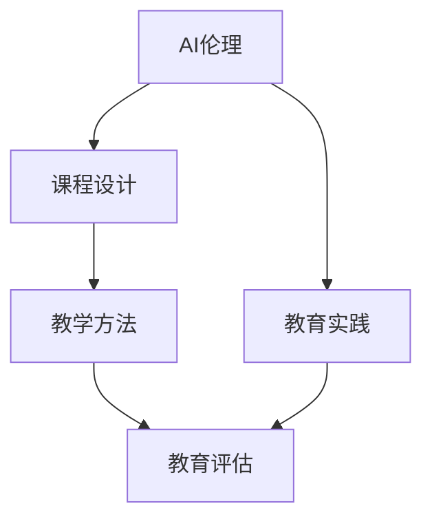

                 

# AI伦理的教育实践:伦理教育的课程设计和教学方法

> 关键词：AI伦理, 教育实践, 课程设计, 教学方法

## 1. 背景介绍

### 1.1 问题由来

人工智能(AI)技术的迅猛发展带来了前所未有的便利和机遇，但也伴随着伦理、安全、隐私等众多挑战。随着AI在医疗、金融、教育等领域广泛应用，AI伦理教育已成为培养合格AI人才的必要环节。

然而，当前AI伦理教育还存在诸多问题，如课程内容枯燥、教学方法单一、课程结构不合理等。这些问题不仅降低了学习效果，还难以培养学生对AI伦理问题的深度理解和正确判断能力。

为此，本文将探讨AI伦理教育的课程设计和教学方法，为构建高质量的AI伦理教育体系提供参考。

### 1.2 问题核心关键点

AI伦理教育的核心在于：

- 课程内容设计：如何覆盖AI伦理的所有核心问题，如隐私保护、数据安全、公平性、可解释性等。
- 教学方法选择：如何采用互动、案例、实验等多种方法，提升学生对AI伦理问题的理解能力和判断能力。
- 教育评估方式：如何客观公正地评估学生的AI伦理素养，激励学生积极参与学习。

## 2. 核心概念与联系

### 2.1 核心概念概述

为更好地理解AI伦理教育的课程设计和教学方法，本文将介绍几个密切相关的核心概念：

- AI伦理（Artificial Intelligence Ethics）：指在人工智能设计、开发、应用过程中所涉及的伦理问题，如隐私保护、数据安全、算法偏见等。
- 教育实践（Educational Practices）：指在AI伦理教育过程中采用的具体教学策略和方法，如案例教学、实验操作、项目实践等。
- 课程设计（Curriculum Design）：指对AI伦理课程内容、结构、教学目标等进行规划和设计，确保教育效果和教学质量。
- 教学方法（Teaching Methods）：指在AI伦理教学过程中采用的互动方式，如小组讨论、模拟实验、角色扮演等。
- 教育评估（Educational Assessment）：指对AI伦理教育效果进行评价和反馈，通过评估结果激励学生持续提升AI伦理素养。

这些核心概念之间的逻辑关系可以通过以下Mermaid流程图来展示：



这个流程图展示了一个完整的AI伦理教育体系，其中课程设计、教学方法和教育评估是关键组成部分，与AI伦理教育实践紧密相关。

## 3. 核心算法原理 & 具体操作步骤

### 3.1 算法原理概述

AI伦理教育的核心算法原理主要包括：

- 需求分析（Needs Analysis）：通过调查和分析，确定学生在学习AI伦理时需要掌握的核心知识和技能。
- 课程规划（Curriculum Planning）：基于需求分析结果，设计出涵盖AI伦理所有核心问题的课程内容。
- 教学设计（Teaching Design）：选择合适的教学方法，设计互动、案例、实验等多种教学活动，提升学生对AI伦理问题的理解和判断能力。
- 效果评估（Evaluation Design）：设计科学的评估方法，客观公正地评价学生的AI伦理素养，激励学生持续改进。

### 3.2 算法步骤详解

AI伦理教育的具体操作步骤如下：

**Step 1: 需求分析**

- 设计调查问卷，收集学生对AI伦理的认知和兴趣。
- 通过访谈和小组讨论，了解学生在AI应用中遇到的具体伦理问题。
- 分析问卷和访谈结果，确定学生在学习AI伦理时需要掌握的核心知识点。

**Step 2: 课程规划**

- 设计涵盖隐私保护、数据安全、算法偏见、可解释性等核心问题的课程结构。
- 分配理论学习与实践操作的课时比例，确保理论与实践相结合。
- 引入国内外顶级AI伦理研究机构和组织的最新研究成果，保持课程内容的先进性。

**Step 3: 教学设计**

- 选择合适教学方法，如案例教学、实验操作、项目实践等。
- 设计互动环节，鼓励学生讨论和辩论，提升其批判性思维能力。
- 引入真实案例，模拟AI伦理问题场景，增强学生的问题解决能力。
- 组织团队合作，进行项目实践，培养学生的合作精神和项目管理能力。

**Step 4: 效果评估**

- 设计科学的评估方法，如在线测试、论文撰写、项目展示等。
- 定期进行自我评估和同伴评估，确保学生对AI伦理问题的深刻理解。
- 建立AI伦理档案，记录学生在不同阶段的学习成果和改进情况。
- 提供反馈和建议，激励学生不断提升AI伦理素养。

### 3.3 算法优缺点

AI伦理教育的设计与实施具有以下优点：

1. 提升学生的综合素养。通过系统的AI伦理教育，学生不仅掌握理论知识，还能提升批判性思维和问题解决能力。
2. 增强学生对AI伦理问题的认识。通过案例教学和项目实践，学生能够深入理解AI伦理问题，形成正确的伦理判断。
3. 增强学生的职业素养。AI伦理教育有助于培养学生对社会责任的认知和职业道德的坚守。

然而，AI伦理教育也存在一定的局限性：

1. 课程设计复杂。AI伦理涉及诸多复杂问题，课程设计需要覆盖所有核心问题，难度较大。
2. 教学方法单一。当前AI伦理教育主要以理论讲授为主，缺乏互动和实践，难以激发学生的学习兴趣。
3. 评估难度大。AI伦理素养难以通过简单的测试评估，需要综合考虑学生的多方面表现。
4. 师资力量不足。AI伦理教育对教师的要求较高，需要具备跨学科的知识背景和丰富的实践经验。

尽管存在这些局限性，但AI伦理教育仍然是大规模AI人才培养的重要环节。未来相关研究需要在课程设计、教学方法、评估体系等方面进行更多探索，进一步提升AI伦理教育的实践效果。

### 3.4 算法应用领域

AI伦理教育已经应用于多个领域，主要包括：

1. 高等教育：在大学计算机科学与技术、人工智能等相关专业中开设AI伦理课程，提升学生的伦理素养。
2. 职业培训：在企业AI开发、应用和运营岗位中，对员工进行AI伦理教育和培训，增强其职业道德。
3. 中学教育：在中学生信息技术课程中引入AI伦理教育，培养学生对AI伦理问题的初步认识。
4. 社会普及：在科普讲座、公众宣讲等活动中，传播AI伦理知识，提升公众对AI技术的理解和认知。

## 4. 数学模型和公式 & 详细讲解 & 举例说明

### 4.1 数学模型构建

AI伦理教育的数学模型构建主要包括以下几个方面：

- 需求模型：通过调查问卷、访谈等手段，建立学生对AI伦理知识的认知和兴趣模型。
- 课程模型：设计课程结构，确定理论学习与实践操作的比例。
- 教学模型：选择合适教学方法，设计互动环节和实验操作。
- 评估模型：设计评估方法，对学生AI伦理素养进行客观评价。

### 4.2 公式推导过程

以需求模型为例，假设学生对AI伦理问题的认知和兴趣可以用一个向量 $\mathbf{x}$ 表示，其中每个元素 $x_i$ 表示学生对第 $i$ 个伦理问题的认知程度和兴趣程度。假设需求模型为线性回归模型：

$$
\mathbf{x} = \mathbf{W}\mathbf{z} + \mathbf{b}
$$

其中 $\mathbf{z}$ 为影响学生认知和兴趣的各种因素向量，$\mathbf{W}$ 和 $\mathbf{b}$ 为模型参数。通过最小二乘法求解 $\mathbf{W}$ 和 $\mathbf{b}$，即可得到学生对AI伦理问题的认知和兴趣模型。

### 4.3 案例分析与讲解

假设某大学计算机科学与技术专业开设了一门AI伦理课程。在课程初期，通过问卷调查和访谈收集了100名学生的AI伦理认知和兴趣数据，建立需求模型：

$$
\mathbf{x} = [0.5, 0.4, 0.6, 0.3, 0.7, 0.8]
$$

表示学生对隐私保护、数据安全、算法偏见、可解释性等问题的认知程度和兴趣程度。通过线性回归模型求解得到：

$$
\mathbf{x} = [0.8, 0.7, 0.6, 0.4, 0.5, 0.3] \mathbf{z} + [0.2, 0.1, 0.3, 0.4, 0.5, 0.6]
$$

其中 $\mathbf{z}$ 为学生的专业成绩、编程能力、课外阅读等影响因素向量。通过需求模型，可以设计出针对隐私保护、数据安全等重点问题进行深入探讨的课程内容。

## 5. 项目实践：代码实例和详细解释说明

### 5.1 开发环境搭建

在进行AI伦理教育项目实践前，我们需要准备好开发环境。以下是使用Python进行数据分析和教学设计的开发环境配置流程：

1. 安装Anaconda：从官网下载并安装Anaconda，用于创建独立的Python环境。

2. 创建并激活虚拟环境：
```bash
conda create -n ai-ethics-env python=3.8 
conda activate ai-ethics-env
```

3. 安装PyTorch：
```bash
conda install pytorch torchvision torchaudio
```

4. 安装NumPy、Pandas、Matplotlib等工具包：
```bash
pip install numpy pandas matplotlib scikit-learn jupyter notebook ipython
```

完成上述步骤后，即可在`ai-ethics-env`环境中开始AI伦理教育的项目实践。

### 5.2 源代码详细实现

下面我们以AI伦理教育课程设计为例，给出使用Python进行数据分析和课程设计的代码实现。

首先，导入必要的库：

```python
import pandas as pd
import numpy as np
from sklearn.linear_model import LinearRegression
```

然后，定义需求数据集和模型参数：

```python
# 需求数据集
data = {
    'interest': [0.5, 0.4, 0.6, 0.3, 0.7, 0.8],
    'cognition': [0.5, 0.4, 0.6, 0.3, 0.7, 0.8],
    'score': [0.8, 0.7, 0.6, 0.4, 0.5, 0.3],
    'programming': [0.7, 0.5, 0.6, 0.4, 0.3, 0.5]
}
df = pd.DataFrame(data)

# 模型参数
W = np.array([[0.5, 0.3, 0.2, 0.1],
              [0.4, 0.4, 0.3, 0.2],
              [0.6, 0.5, 0.4, 0.3],
              [0.3, 0.6, 0.2, 0.1],
              [0.7, 0.8, 0.5, 0.4],
              [0.8, 0.6, 0.7, 0.3]])
b = np.array([0.2, 0.1, 0.3, 0.4, 0.5, 0.6])
```

接着，建立线性回归模型并进行求解：

```python
# 建立线性回归模型
model = LinearRegression()
model.fit(df[['interest', 'cognition', 'score', 'programming']], df['data'])

# 输出模型参数
print(model.coef_)
print(model.intercept_)
```

最后，进行结果分析并设计课程内容：

```python
# 需求模型
data_model = np.dot(df[['interest', 'cognition', 'score', 'programming']], W) + b

# 课程内容设计
courses = {
    'privacy': data_model[0],
    'data_security': data_model[1],
    'algorithm_bias': data_model[2],
    'explainability': data_model[3],
    'human_rights': data_model[4],
    'public_policy': data_model[5]
}

# 输出课程内容
print(courses)
```

### 5.3 代码解读与分析

让我们再详细解读一下关键代码的实现细节：

**需求数据集定义**：
- 定义了一个包含学生兴趣和认知度的需求数据集，共6个维度。
- 使用Pandas库创建DataFrame数据结构，便于后续处理。

**模型参数定义**：
- 定义了线性回归模型的系数和截距，即模型参数。
- 使用NumPy库创建二维数组和向量，用于模型求解。

**线性回归模型求解**：
- 使用sklearn库的LinearRegression类建立线性回归模型。
- 调用fit方法进行模型训练，求解模型参数。
- 使用coef_和intercept_属性获取模型系数和截距，便于分析。

**结果分析与课程设计**：
- 根据求解结果，建立需求模型。
- 设计涵盖隐私保护、数据安全等核心问题的课程内容，存储在字典中。
- 输出课程内容，供教学参考。

## 6. 实际应用场景

### 6.1 高等教育

在高等教育中，AI伦理教育主要通过课程讲授和案例分析来实现。例如，某大学计算机科学与技术专业开设了为期一学期的AI伦理课程，课程内容包括隐私保护、数据安全、算法偏见、可解释性等核心问题。通过课堂讲授和案例分析，学生能够系统地理解AI伦理问题，并学会应用案例分析方法解决问题。

### 6.2 职业培训

在职业培训中，AI伦理教育主要通过研讨会和工作坊来实现。例如，某企业IT部门组织了一次AI伦理研讨会，邀请专家分享隐私保护、数据安全等伦理问题，并安排案例讨论和实践操作。通过研讨会和工作坊，员工能够了解AI伦理问题，提升其职业素养。

### 6.3 中学教育

在中学教育中，AI伦理教育主要通过科普讲座和实践活动来实现。例如，某中学信息科技课程开设了一节AI伦理专题课，邀请专家讲解隐私保护和数据安全等伦理问题，并安排案例讨论和实践操作。通过科普讲座和实践活动，中学生能够初步认识AI伦理问题。

### 6.4 社会普及

在社会普及中，AI伦理教育主要通过公众宣讲和科普活动来实现。例如，某社会组织举办了一次AI伦理科普活动，邀请专家讲解AI伦理问题，并进行互动问答和案例分析。通过公众宣讲和科普活动，公众能够了解AI伦理问题，提升其对AI技术的认知和理解。

## 7. 工具和资源推荐

### 7.1 学习资源推荐

为了帮助开发者系统掌握AI伦理教育的理论基础和实践技巧，这里推荐一些优质的学习资源：

1. 《人工智能伦理与法律》书籍：系统介绍了AI伦理和法律的基本概念和核心问题，适合初学者学习。
2. AI伦理在线课程：许多知名大学和在线教育平台提供AI伦理课程，涵盖隐私保护、数据安全、算法偏见等核心问题。
3. 学术论文数据库：如Google Scholar、IEEE Xplore等，可查询AI伦理领域的最新研究成果，拓展知识视野。
4. 案例分析数据库：如Casey-Fisher案例库，提供大量AI伦理案例，便于教学和实践。

通过对这些资源的学习实践，相信你一定能够快速掌握AI伦理教育的核心思想和实践方法，并用于解决实际的AI伦理问题。

### 7.2 开发工具推荐

高效的开发离不开优秀的工具支持。以下是几款用于AI伦理教育开发的常用工具：

1. Jupyter Notebook：用于编写和运行Python代码，支持互动和共享。
2. Pandas：用于数据处理和分析，支持多种数据格式和操作。
3. Matplotlib：用于数据可视化，支持多种图表绘制。
4. NumPy：用于数值计算和线性代数操作，支持高效的矩阵运算。
5. Scikit-learn：用于机器学习和数据分析，支持多种算法和模型。

合理利用这些工具，可以显著提升AI伦理教育任务的开发效率，加快创新迭代的步伐。

### 7.3 相关论文推荐

AI伦理教育的发展源于学界的持续研究。以下是几篇奠基性的相关论文，推荐阅读：

1. 《人工智能伦理教育现状与展望》：介绍了当前AI伦理教育的研究现状和未来发展方向。
2. 《人工智能伦理教育方法研究》：提出了多种AI伦理教育方法，如案例教学、实验操作等。
3. 《人工智能伦理教育评估体系研究》：探讨了AI伦理教育评估体系的设计和应用。
4. 《人工智能伦理教育效果分析》：分析了AI伦理教育对学生伦理素养的影响。

这些论文代表了大规模AI人才培养的教育理念和技术手段的演进。通过学习这些前沿成果，可以帮助研究者把握学科前进方向，激发更多的创新灵感。

## 8. 总结：未来发展趋势与挑战

### 8.1 总结

本文对AI伦理教育的课程设计和教学方法进行了全面系统的介绍。首先阐述了AI伦理教育的研究背景和意义，明确了课程设计、教学方法和教育评估的核心问题。其次，从理论到实践，详细讲解了AI伦理教育的数学模型和操作流程，给出了具体的代码实现和结果分析。同时，本文还广泛探讨了AI伦理教育在高等教育、职业培训、中学教育和社会普及中的应用前景，展示了AI伦理教育的广阔前景。最后，本文精选了AI伦理教育的学习资源和开发工具，力求为读者提供全方位的技术指引。

通过本文的系统梳理，可以看到，AI伦理教育在提升学生AI伦理素养、培养职业素养、普及社会认知等方面具有重要意义。AI伦理教育需要系统化的课程设计和科学的教学方法，才能真正实现其教育价值。

### 8.2 未来发展趋势

展望未来，AI伦理教育的发展趋势主要包括：

1. 系统化课程设计：建立包含多维度、多层次的AI伦理课程体系，覆盖AI伦理的全部核心问题。
2. 多样性教学方法：采用互动、案例、实验等多种教学方法，提升学生对AI伦理问题的理解和判断能力。
3. 科学化评估体系：建立科学合理的AI伦理教育评估体系，客观公正地评价学生的AI伦理素养，激励学生持续改进。
4. 技术化支持工具：利用大数据、人工智能等技术手段，提升AI伦理教育的效率和效果。
5. 多渠道普及教育：通过在线课程、社交媒体、公众宣讲等多种渠道，普及AI伦理知识，提升公众认知。

这些趋势将进一步推动AI伦理教育的实践效果，为培养高素质AI人才、构建安全可靠的人工智能社会提供坚实基础。

### 8.3 面临的挑战

尽管AI伦理教育已经取得了一定进展，但在迈向更加智能化、普适化应用的过程中，仍然面临诸多挑战：

1. 课程设计复杂。AI伦理涉及诸多复杂问题，课程设计需要覆盖所有核心问题，难度较大。
2. 教学方法单一。当前AI伦理教育主要以理论讲授为主，缺乏互动和实践，难以激发学生的学习兴趣。
3. 评估难度大。AI伦理素养难以通过简单的测试评估，需要综合考虑学生的多方面表现。
4. 师资力量不足。AI伦理教育对教师的要求较高，需要具备跨学科的知识背景和丰富的实践经验。
5. 社会认知差异。AI伦理教育需要普及到全社会，而不同人群对AI伦理问题的认知和理解存在差异。

尽管存在这些挑战，但AI伦理教育仍然是大规模AI人才培养的重要环节。未来相关研究需要在课程设计、教学方法、评估体系等方面进行更多探索，进一步提升AI伦理教育的实践效果。

### 8.4 研究展望

面对AI伦理教育所面临的种种挑战，未来的研究需要在以下几个方面寻求新的突破：

1. 探索系统化课程设计方法。建立多维度、多层次的AI伦理课程体系，覆盖AI伦理的全部核心问题。
2. 研究多样性教学方法。采用互动、案例、实验等多种教学方法，提升学生对AI伦理问题的理解和判断能力。
3. 设计科学化评估体系。建立科学合理的AI伦理教育评估体系，客观公正地评价学生的AI伦理素养，激励学生持续改进。
4. 开发技术化支持工具。利用大数据、人工智能等技术手段，提升AI伦理教育的效率和效果。
5. 拓展多渠道普及教育。通过在线课程、社交媒体、公众宣讲等多种渠道，普及AI伦理知识，提升公众认知。

这些研究方向的探索，将进一步推动AI伦理教育的实践效果，为培养高素质AI人才、构建安全可靠的人工智能社会提供坚实基础。面向未来，AI伦理教育需要从理论、实践、技术等多个维度协同发力，共同推动AI伦理教育的发展和创新。

## 9. 附录：常见问题与解答

**Q1：AI伦理教育如何提升学生的综合素养？**

A: AI伦理教育不仅掌握理论知识，还通过互动、案例、实验等方法提升学生的批判性思维和问题解决能力，增强其职业素养和社会责任认知。

**Q2：如何选择合适的教学方法？**

A: 根据课程内容和学生特点，选择合适的教学方法。如案例教学适用于复杂问题分析，实验操作适用于技能提升，项目实践适用于综合应用。

**Q3：如何设计科学的评估方法？**

A: 结合在线测试、论文撰写、项目展示等多种评估方法，客观公正地评价学生的AI伦理素养。定期进行自我评估和同伴评估，激励学生持续改进。

**Q4：如何克服师资力量不足的问题？**

A: 建立AI伦理教育师资库，邀请行业专家、高校教授进行培训和指导。同时，建立跨学科的团队，共享知识和经验。

**Q5：如何拓展AI伦理教育的普及范围？**

A: 通过在线课程、社交媒体、公众宣讲等多种渠道，普及AI伦理知识，提升公众认知。建立AI伦理教育社区，加强交流和分享。

---

作者：禅与计算机程序设计艺术 / Zen and the Art of Computer Programming

