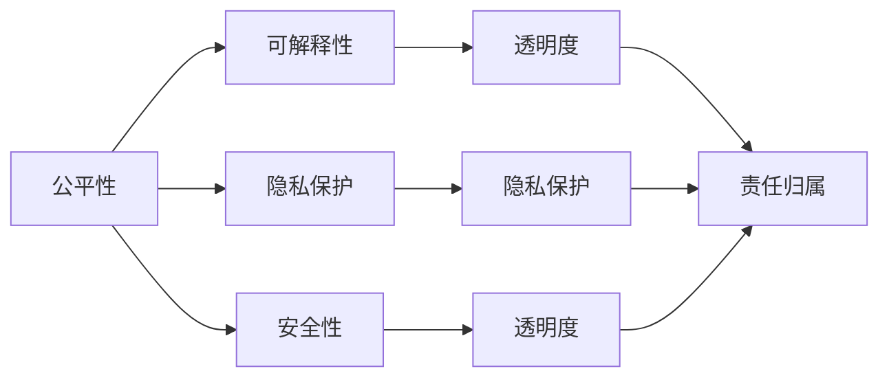

                 

# AI伦理：在模型开发中平衡效率与道德

## 1. 背景介绍

### 1.1 问题由来
随着人工智能技术的迅猛发展，特别是深度学习和自然语言处理技术的进步，AI模型在诸如图像识别、自然语言理解、机器翻译等领域取得了突破性的成果。然而，这些模型的开发和应用过程中，一个重要的议题逐渐凸显出来：如何在追求模型的高效性和性能的同时，确保模型的公平性、透明性、可解释性及道德合规性，以防止模型产生偏见、误导性输出或被不正当使用。AI伦理在模型开发中扮演着至关重要的角色，尤其在处理敏感数据和执行关键决策时，这一问题变得尤为重要。

### 1.2 问题核心关键点
AI伦理的核心在于如何在技术进步与道德准则之间找到平衡。在模型开发过程中，这一平衡点主要体现在以下几个方面：

- **公平性**：确保模型在对待不同群体和个体时不产生歧视。
- **透明度**：模型如何做出决策应是透明的，以便于审查和解释。
- **可解释性**：模型的决策过程应易于理解，便于发现和纠正错误。
- **隐私保护**：在数据收集和使用过程中，应保护个人隐私。
- **安全性**：模型及其使用应避免被恶意攻击和误用。
- **责任归属**：明确模型所有者和管理者的责任，确保合规性和问责机制。

本文将围绕这些关键点，系统探讨AI伦理在模型开发中的实践策略。

## 2. 核心概念与联系

### 2.1 核心概念概述

为更好地理解AI伦理在模型开发中的应用，我们首先需要澄清几个关键概念及其相互之间的联系：

- **公平性(Fairness)**：指模型在处理数据时，避免对特定群体产生偏见。
- **可解释性(Explainability)**：模型输出应能被合理解释，使得人类能理解其工作原理。
- **隐私保护(Privacy Protection)**：保护用户数据免遭未经授权的访问和滥用。
- **安全性(Security)**：保护模型免受未经授权的攻击和篡改。
- **责任归属(Accountability)**：明确模型开发、使用和维护的责任。

这些概念在模型开发过程中相辅相成，共同构成了AI伦理的基本框架。以下是一个简单的Mermaid流程图，展示了这些概念之间的关系：



从图中可以看出，公平性是基础，保障了模型对所有用户的平等对待。可解释性和隐私保护是提升用户信任的关键，而安全性是保护用户和数据不受侵害的保障。最终，责任归属为整个模型生命周期中的行为提供了法律和道德上的问责机制。

## 3. 核心算法原理 & 具体操作步骤
### 3.1 算法原理概述

在模型开发中，AI伦理的实践通常涉及以下几个关键步骤：

1. **数据预处理**：确保训练数据集的多样性和代表性，避免数据偏见。
2. **模型训练**：通过正则化、对抗训练等方法提升模型公平性和鲁棒性。
3. **模型评估**：使用多样化的指标和测试集评估模型性能，确保公平性和透明度。
4. **结果解释**：开发可解释模型或辅助工具，解释模型的决策过程。
5. **隐私保护**：在数据收集和使用过程中，采取隐私保护措施。
6. **安全审计**：进行安全审计，识别潜在的安全漏洞。
7. **责任分配**：明确模型开发、使用和维护的责任，确保合规性和问责。

### 3.2 算法步骤详解

以下我们将详细介绍每个步骤的详细步骤和关键考虑点：

**Step 1: 数据预处理**

数据预处理是确保模型公平性和透明性的重要环节。这一步骤包括：

1. **数据收集**：收集多样、代表性强的数据，确保覆盖所有相关群体。
2. **数据清洗**：去除噪声和异常值，确保数据质量。
3. **数据增强**：通过数据扩充、数据增强等技术，提高模型的泛化能力。
4. **数据平衡**：对不平衡的数据集进行重采样，减少偏见。

**Step 2: 模型训练**

模型训练是确保公平性和透明性的核心环节。这一步骤包括：

1. **选择模型**：根据任务需求选择合适的模型架构和训练策略。
2. **正则化**：使用L1/L2正则化、Dropout等方法，避免过拟合和偏见。
3. **对抗训练**：通过生成对抗样本，提高模型的鲁棒性和公平性。
4. **公平性约束**：在模型训练过程中，引入公平性约束，如Equalized Odd-Rank (EOR)等方法。

**Step 3: 模型评估**

模型评估是确保公平性和透明性的重要保障。这一步骤包括：

1. **指标选择**：选择合适的公平性指标，如Demographic Parity、Equal Opportunity等。
2. **测试集构建**：构建多样化的测试集，评估模型在不同群体上的性能。
3. **结果分析**：使用多种方法分析模型结果，识别潜在的偏见和错误。

**Step 4: 结果解释**

结果解释是提升模型可解释性的关键环节。这一步骤包括：

1. **可解释模型**：选择或开发可解释性强的模型，如LIME、SHAP等。
2. **解释工具**：使用可视化工具，帮助用户理解模型决策过程。
3. **交互界面**：开发易于理解的交互界面，帮助用户快速获取模型输出。

**Step 5: 隐私保护**

隐私保护是确保用户数据安全的关键环节。这一步骤包括：

1. **数据匿名化**：在数据处理过程中，去除或模糊化个人身份信息。
2. **差分隐私**：在数据收集和使用过程中，加入噪声，保护个体隐私。
3. **访问控制**：实施严格的访问控制措施，确保数据仅被授权人员访问。

**Step 6: 安全审计**

安全审计是确保模型安全性的重要手段。这一步骤包括：

1. **威胁建模**：识别潜在的威胁和攻击手段。
2. **漏洞检测**：使用自动化工具检测模型中的漏洞。
3. **渗透测试**：进行渗透测试，确保模型对各种攻击手段的抵抗力。

**Step 7: 责任归属**

责任归属是确保模型合规性和问责机制的关键环节。这一步骤包括：

1. **合规性审查**：确保模型开发和使用过程符合法律法规和伦理标准。
2. **责任划分**：明确模型所有者、开发者、使用者的责任和权利。
3. **问责机制**：建立有效的问责机制，确保模型出现问题时能够追溯和纠正。

### 3.3 算法优缺点

在模型开发过程中，AI伦理实践的优势和劣势如下：

**优点：**

- **提升公平性**：通过数据预处理和模型训练，减少偏见，提升模型的公平性。
- **增强透明度和可解释性**：通过结果解释和交互界面，提升模型的透明度和可解释性。
- **保障用户隐私**：通过数据匿名化和差分隐私，保护用户隐私。
- **提高安全性**：通过安全审计和对抗训练，提升模型的安全性。
- **明确责任归属**：通过责任划分和问责机制，确保模型开发和使用的合规性和问责性。

**缺点：**

- **复杂度增加**：在模型开发过程中，需要额外考虑伦理和合规问题，增加了复杂度。
- **时间和成本增加**：伦理实践往往需要额外的计算资源和时间投入。
- **模型效率可能降低**：正则化和对抗训练等方法可能影响模型的性能和效率。
- **伦理争议**：伦理实践标准和标准不一致，可能导致争议和分歧。

尽管如此，为了确保AI技术的可持续发展和社会接受度，伦理实践在模型开发中是不可或缺的。

### 3.4 算法应用领域

AI伦理实践在多个领域都有广泛应用，如医疗、金融、司法、交通等。以下是几个典型应用场景的详细介绍：

**医疗领域**：在医疗诊断和治疗中，确保模型对不同群体的公平性和透明度，保护患者隐私，确保诊断和治疗的合法合规。

**金融领域**：在贷款审批、信用评分等场景中，确保模型对不同群体的公平性，保护用户隐私，避免歧视性决策。

**司法领域**：在刑事案件的判决和风险评估中，确保模型的透明度和可解释性，避免偏见，保护个人隐私。

**交通领域**：在自动驾驶、交通预测等场景中，确保模型的公平性，保护用户隐私，避免安全事故。

## 4. 数学模型和公式 & 详细讲解  
### 4.1 数学模型构建

在模型开发中，AI伦理实践涉及多个数学模型的构建和应用。以下是一个简化的数学模型构建框架：

**公平性指标**：
- Demographic Parity：确保不同群体在模型输出中的比例一致。
- Equal Opportunity：确保在给定正类样本的情况下，不同群体获得正类预测的概率相等。

**可解释性模型**：
- LIME：基于局部线性模型的解释方法。
- SHAP：基于加性模型和Shapley值的解释方法。

**隐私保护**：
- 差分隐私：通过加入噪声，保护用户隐私。

**安全审计**：
- 威胁建模：识别潜在威胁和攻击手段。
- 漏洞检测：使用自动化工具检测模型漏洞。

**责任归属**：
- 合规性审查：确保模型开发和使用符合法律法规。
- 责任划分：明确模型所有者、开发者、使用者的责任。

### 4.2 公式推导过程

以下我们将详细介绍几个关键数学模型的推导过程：

**Demographic Parity**：
- 假设模型输出为 $Y$，模型输入为 $X$，$P$ 为概率函数，$\pi_i$ 为群体 $i$ 的比例。
- 定义公平性指标为 $DP$：
  $$
  DP = \max_{i} \frac{\pi_i}{\pi_{i'}} \times P(Y|X)_i
  $$
  其中 $i$ 和 $i'$ 表示不同群体。

**Equal Opportunity**：
- 定义公平性指标为 $EO$：
  $$
  EO = \max_i \frac{P(Y|X)_i}{P(Y|X)_i'}
  $$
  其中 $i$ 和 $i'$ 表示不同群体。

**LIME解释模型**：
- 假设模型为 $f$，输入为 $x$，输出为 $y$。
- 定义局部模型为 $g$：
  $$
  g(x) = f(x) + \epsilon
  $$
  其中 $\epsilon$ 为噪声。
- 求解 $g(x)$ 和 $f(x)$ 的差异：
  $$
  \min_{\epsilon} \sum_{x_i \in \mathcal{X}} \|g(x_i) - f(x_i)\|_2^2
  $$

**差分隐私**：
- 假设原始数据集为 $D$，噪声为 $\epsilon$，模型为 $M$。
- 定义差分隐私保护：
  $$
  \epsilon-DP(D, \delta) = \max_{x \in \mathcal{X}} |P(M(x), D) - P(M(x), D')|
  $$
  其中 $D'$ 为修改后数据集，$\delta$ 为差错概率。

### 4.3 案例分析与讲解

**案例1：医疗领域**

在医疗诊断中，使用AI模型进行疾病预测。数据集包含患者的医疗记录、年龄、性别等信息。模型需要在公平性和隐私保护方面进行优化：

1. **公平性优化**：确保模型对不同性别的公平性，避免性别偏见。
2. **隐私保护**：在数据收集和处理过程中，确保患者隐私不被泄露。

**案例2：金融领域**

在信用评分系统中，使用AI模型评估贷款申请人的信用风险。数据集包含申请人的收入、职业、负债等信息。模型需要在公平性和透明度方面进行优化：

1. **公平性优化**：确保模型对不同性别、种族等群体的公平性。
2. **透明度**：提供透明的评分解释，帮助用户理解模型的决策过程。

## 5. 项目实践：代码实例和详细解释说明
### 5.1 开发环境搭建

在进行AI伦理实践的模型开发过程中，首先需要搭建好开发环境。以下是使用Python进行TensorFlow和Keras开发的环境配置流程：

1. 安装Anaconda：从官网下载并安装Anaconda，用于创建独立的Python环境。

2. 创建并激活虚拟环境：
```bash
conda create -n tf-env python=3.8 
conda activate tf-env
```

3. 安装TensorFlow和Keras：
```bash
conda install tensorflow==2.3.0
conda install keras==2.4.3
```

4. 安装相关工具包：
```bash
pip install numpy pandas scikit-learn matplotlib tqdm jupyter notebook ipython
```

完成上述步骤后，即可在`tf-env`环境中开始模型开发。

### 5.2 源代码详细实现

我们以一个简单的信用评分系统为例，演示如何在Keras中实现AI伦理实践的模型开发。

首先，定义数据预处理函数：

```python
from sklearn.preprocessing import StandardScaler
from sklearn.model_selection import train_test_split
import pandas as pd
import numpy as np

def preprocess_data(data):
    # 数据标准化
    scaler = StandardScaler()
    data = scaler.fit_transform(data)
    # 数据划分
    train_data, test_data = train_test_split(data, test_size=0.2, random_state=42)
    return train_data, test_data
```

然后，定义模型训练函数：

```python
from tensorflow.keras.models import Sequential
from tensorflow.keras.layers import Dense, Dropout
from tensorflow.keras.callbacks import EarlyStopping

def train_model(model, train_data, test_data, epochs=10, batch_size=32):
    model.compile(optimizer='adam', loss='binary_crossentropy', metrics=['accuracy'])
    early_stopping = EarlyStopping(patience=3)
    model.fit(train_data, train_data[:, 0], epochs=epochs, batch_size=batch_size, validation_data=(test_data, test_data[:, 0]), callbacks=[early_stopping])
    return model
```

接着，定义模型评估函数：

```python
from sklearn.metrics import roc_auc_score, precision_recall_curve

def evaluate_model(model, test_data, y_test):
    y_pred = model.predict(test_data)
    y_pred = (y_pred > 0.5).astype(int)
    roc_auc = roc_auc_score(y_test, y_pred)
    precision, recall, _ = precision_recall_curve(y_test, y_pred)
    return roc_auc, precision, recall
```

最后，启动模型训练和评估流程：

```python
from sklearn.datasets import load_boston

# 加载数据集
data = load_boston()
X = data.data
y = data.target

# 数据预处理
train_data, test_data = preprocess_data(X)

# 创建模型
model = Sequential()
model.add(Dense(64, input_dim=13, activation='relu'))
model.add(Dropout(0.5))
model.add(Dense(1, activation='sigmoid'))

# 模型训练
model = train_model(model, train_data, test_data)

# 模型评估
roc_auc, precision, recall = evaluate_model(model, test_data, y)
print(f'ROC-AUC: {roc_auc}, Precision: {precision}, Recall: {recall}')
```

以上代码实现了基于TensorFlow和Keras的信用评分系统的开发，其中包含了数据预处理、模型训练、模型评估等步骤。在实际应用中，还需要考虑更多的AI伦理实践环节，如公平性约束、可解释性增强等。

### 5.3 代码解读与分析

让我们再详细解读一下关键代码的实现细节：

**preprocess_data函数**：
- 对数据进行标准化，以避免不同特征尺度对模型训练的影响。
- 使用sklearn的train_test_split函数，将数据划分为训练集和测试集。

**train_model函数**：
- 使用Keras的Sequential模型，添加Dense层和Dropout层，使用Adam优化器，设置损失函数为binary_crossentropy。
- 使用EarlyStopping回调，避免过拟合。

**evaluate_model函数**：
- 使用sklearn的roc_auc_score函数计算模型ROC-AUC指标。
- 使用sklearn的precision_recall_curve函数计算精确率和召回率。

**模型训练和评估流程**：
- 加载数据集
- 数据预处理
- 创建模型
- 训练模型
- 评估模型

可以看到，AI伦理实践的模型开发需要考虑更多因素，如公平性、隐私保护、可解释性等，但核心的开发流程与普通模型开发类似。

## 6. 实际应用场景
### 6.1 智能医疗

在智能医疗领域，AI伦理实践对确保模型公平性和透明度尤为重要。例如，在诊断系统中，模型需要确保对不同性别、年龄、种族等群体的公平性，避免偏见。在数据收集和处理过程中，需要确保患者隐私不被泄露，同时提供透明的诊断解释，帮助医生理解模型的决策过程。

### 6.2 金融风控

在金融风控领域，AI伦理实践对确保模型公平性和透明度同样重要。例如，在信用评分系统中，模型需要确保对不同性别、种族等群体的公平性，避免偏见。在数据收集和处理过程中，需要确保用户隐私不被泄露，同时提供透明的评分解释，帮助用户理解模型的决策过程。

### 6.3 司法判决

在司法判决领域，AI伦理实践对确保模型公平性和透明度尤为关键。例如，在判决系统中，模型需要确保对不同性别、种族等群体的公平性，避免偏见。在数据收集和处理过程中，需要确保隐私数据不被泄露，同时提供透明的判决解释，帮助法官理解模型的决策过程。

## 7. 工具和资源推荐
### 7.1 学习资源推荐

为了帮助开发者系统掌握AI伦理在模型开发中的应用，这里推荐一些优质的学习资源：

1. 《AI伦理与机器学习》系列课程：由Coursera平台提供，由伦理专家和机器学习专家共同授课，系统讲解AI伦理的基本概念和应用。

2. 《公平性、透明性与可解释性在机器学习中的应用》书籍：该书详细介绍了如何确保机器学习模型的公平性、透明性和可解释性，提供了丰富的案例和实践方法。

3. TensorFlow公平性库：官方提供的公平性库，包含公平性约束、差分隐私等功能的实现。

4. IBM Fairness 360：IBM开发的公平性工具，提供了广泛的公平性分析方法和可视化工具。

5. OpenAI CodeX：GitHub上开放源代码的AI伦理实践工具，包含多种公平性、可解释性工具的实现。

通过对这些资源的学习实践，相信你一定能够快速掌握AI伦理在模型开发中的应用，并用于解决实际的AI问题。

### 7.2 开发工具推荐

高效的开发离不开优秀的工具支持。以下是几款用于AI伦理实践的模型开发的常用工具：

1. TensorFlow：基于Python的开源深度学习框架，提供了丰富的公平性、可解释性工具。

2. Keras：高级神经网络API，基于TensorFlow构建，易于使用。

3. Scikit-learn：简单易用的机器学习库，提供了多种公平性约束和可解释性方法。

4. IBM Fairness 360：IBM开发的公平性工具，提供了广泛的公平性分析方法和可视化工具。

5. TensorBoard：TensorFlow配套的可视化工具，可实时监测模型训练状态，提供丰富的图表呈现方式。

6. Weights & Biases：模型训练的实验跟踪工具，可以记录和可视化模型训练过程中的各项指标，方便对比和调优。

合理利用这些工具，可以显著提升AI伦理实践的模型开发效率，加快创新迭代的步伐。

### 7.3 相关论文推荐

AI伦理在模型开发中的实践研究源于学界的持续研究。以下是几篇奠基性的相关论文，推荐阅读：

1. The Fairness Dimension：公平性在机器学习中的应用。

2. Fairness in Machine Learning: Survey of Biases, Prejudices, and Ethical Concerns：机器学习中公平性问题的全面综述。

3. Explainable Artificial Intelligence：AI可解释性的最新研究进展。

4. The ethics of automated decision making：AI伦理和自动决策系统。

5. Human-AI Collaboration：AI伦理和人类协作。

这些论文代表了大模型伦理实践的发展脉络。通过学习这些前沿成果，可以帮助研究者把握学科前进方向，激发更多的创新灵感。

## 8. 总结：未来发展趋势与挑战
### 8.1 研究成果总结

本文对AI伦理在模型开发中的实践策略进行了全面系统的介绍。首先阐述了AI伦理在模型开发中的重要性，明确了公平性、透明性、可解释性及隐私保护等关键概念，并介绍了这些概念在模型开发中的应用策略。其次，从原理到实践，详细讲解了公平性、隐私保护、可解释性等伦理实践的关键步骤和算法原理。最后，通过代码实例和实际应用场景，展示了AI伦理在模型开发中的具体应用。

通过本文的系统梳理，可以看到，AI伦理在模型开发中扮演着至关重要的角色，确保了模型的公平性、透明性和安全性。AI伦理的实践策略为模型开发提供了全面的指导，帮助开发者在追求模型高效性的同时，兼顾道德合规性。

### 8.2 未来发展趋势

展望未来，AI伦理实践将在模型开发中扮演更加重要的角色，其发展趋势如下：

1. **公平性成为标准**：AI伦理实践将成为模型开发的标准流程，确保模型对所有群体的公平性。

2. **隐私保护更加严格**：数据隐私和用户隐私保护将成为模型开发的重要考量，隐私保护技术将不断进步。

3. **透明度和可解释性提升**：可解释性工具和算法将不断完善，确保模型决策过程透明可解释。

4. **多领域应用拓展**：AI伦理实践将在更多领域得到应用，如医疗、金融、司法等，推动各行业的数字化转型。

5. **跨学科合作加强**：AI伦理实践需要跨学科合作，结合伦理学、社会学、法律学等多学科知识，确保模型开发和使用的合法合规。

6. **法规和技术并行推进**：AI伦理实践需要法律法规和技术手段共同推进，确保模型开发和使用的合规性。

### 8.3 面临的挑战

尽管AI伦理实践在模型开发中取得了一定进展，但仍面临诸多挑战：

1. **伦理标准不一致**：不同国家和行业对AI伦理的定义和标准存在差异，可能导致伦理实践的争议。

2. **技术实现难度大**：公平性、隐私保护等伦理实践需要复杂的算法和技术支持，实现难度较大。

3. **数据收集难度大**：高质量、多样化的数据集是伦理实践的基础，但数据收集和处理往往存在难度。

4. **模型性能下降**：伦理实践可能需要增加模型复杂度，影响模型性能和效率。

5. **合规性和问责机制缺失**：模型开发和使用的合规性和问责机制尚不完善，可能导致法律风险和伦理风险。

### 8.4 研究展望

面对AI伦理实践面临的挑战，未来的研究需要在以下几个方面寻求新的突破：

1. **统一伦理标准**：建立全球统一的AI伦理标准，确保伦理实践的一致性。

2. **简化技术实现**：开发简单易用的伦理实践工具和算法，降低技术实现难度。

3. **多样化数据集**：收集多样化、高质量的数据集，支持伦理实践的应用。

4. **优化模型性能**：结合公平性和隐私保护，优化模型性能和效率。

5. **完善合规机制**：建立完善的合规性和问责机制，确保模型开发和使用的合法合规。

这些研究方向的探索，必将引领AI伦理实践技术迈向更高的台阶，为构建安全、可靠、可解释、可控的智能系统铺平道路。面向未来，AI伦理实践需要与其他人工智能技术进行更深入的融合，如知识表示、因果推理、强化学习等，多路径协同发力，共同推动自然语言理解和智能交互系统的进步。只有勇于创新、敢于突破，才能不断拓展AI模型的边界，让智能技术更好地造福人类社会。

## 9. 附录：常见问题与解答

**Q1：AI伦理实践是否会影响模型性能？**

A: 在一定程度上，AI伦理实践可能会增加模型的复杂度，影响模型性能和效率。但通过优化算法和技术手段，可以在保证公平性和隐私保护的前提下，提升模型性能和效率。例如，可以使用公平性约束和正则化方法，确保模型在公平性目标和性能目标之间取得平衡。

**Q2：如何确保模型公平性？**

A: 确保模型公平性需要从数据收集、模型设计和训练等多个环节入手：
1. 数据收集：确保数据集的多样性和代表性。
2. 模型设计：引入公平性约束和正则化方法。
3. 模型训练：使用公平性指标和评估方法，识别和纠正偏见。

**Q3：如何保护用户隐私？**

A: 保护用户隐私需要从数据收集、存储和处理等多个环节入手：
1. 数据收集：使用差分隐私等技术，保护个体隐私。
2. 数据存储：对数据进行匿名化处理，确保数据无法被识别。
3. 数据处理：对数据进行加密处理，确保数据在传输和存储过程中的安全性。

**Q4：如何确保模型可解释性？**

A: 确保模型可解释性需要从模型设计和结果解释等多个环节入手：
1. 模型设计：选择可解释性强的模型，如LIME、SHAP等。
2. 结果解释：使用可视化工具和解释方法，帮助用户理解模型决策过程。
3. 交互界面：开发易于理解的交互界面，帮助用户快速获取模型输出。

**Q5：如何确保模型安全性？**

A: 确保模型安全性需要从模型设计、安全审计等多个环节入手：
1. 模型设计：使用对抗训练等方法，提高模型鲁棒性和安全性。
2. 安全审计：定期进行安全审计，识别和修复潜在的安全漏洞。
3. 访问控制：实施严格的访问控制措施，确保数据和模型安全。

---

作者：禅与计算机程序设计艺术 / Zen and the Art of Computer Programming

