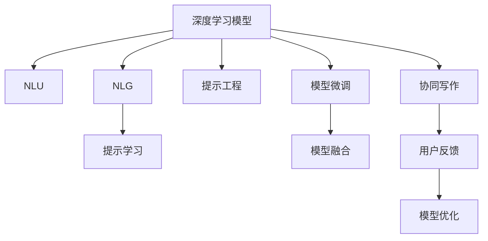

                 

## 1. 背景介绍

在人类历史上，创造力一直是推动社会进步和创新的关键力量。无论是文学、艺术，还是科学和技术，创造力的源泉都是人类天生的想象力、直觉和灵感。然而，随着信息时代的到来，工作和生活节奏的加快，人类的创造力面临着前所未有的挑战。一方面，大量的信息需要处理和整合，人类容易陷入信息过载；另一方面，跨学科、跨领域的知识需求日益增加，单独的个体难以跟上知识更新的步伐。

人工智能技术，尤其是自然语言处理(Natural Language Processing, NLP)，为解决这些问题提供了新的工具。其中，AI写作助手是一种基于深度学习技术的智能辅助写作工具，能够帮助人类提高写作效率，增强创造力。本文将系统介绍AI写作助手的原理、应用和未来发展趋势，探讨其在提高人类创造力方面的潜力。

## 2. 核心概念与联系

### 2.1 核心概念概述

AI写作助手是一种基于自然语言处理技术，通过深度学习模型对大量语料进行训练，从而实现自动生成文本、辅助写作和提高写作效率的工具。其主要功能包括：自动生成文章、修改和润色文本、提供写作建议和创意激发等。

AI写作助手的核心技术包括深度学习模型、自然语言理解(Natural Language Understanding, NLU)、自然语言生成(Natural Language Generation, NLG)和提示学习(Prompt Learning)等。

### 2.2 核心概念原理和架构的 Mermaid 流程图(Mermaid 流程节点中不要有括号、逗号等特殊字符)



**深度学习模型**：是AI写作助手的核心引擎，通过对大规模语料进行自监督或监督学习，训练得到文本生成模型。常见的模型包括Transformer、GPT系列、BERT等。

**自然语言理解(NLU)**：通过分析输入文本的语法结构、语义信息等，帮助模型理解用户意图和需求。

**自然语言生成(NLG)**：将模型的输出文本转化为自然流畅的文本，使其符合人类阅读习惯。

**提示学习**：通过精心设计输入文本的格式，引导模型生成符合特定要求的文本。

**提示工程**：对输入文本进行预处理，生成高质量的提示信息，提高模型的生成效果。

**模型微调**：根据特定任务和应用场景，对预训练模型进行微调，提升模型的性能和适应性。

**模型融合**：结合多种模型的优势，提供更全面、更准确的写作建议和辅助。

**协同写作**：通过多用户协作，利用集体的智慧，进一步提升写作效果。

**用户反馈**：通过用户的反馈数据，对模型进行优化，不断提高模型表现。

以上概念构成了AI写作助手的技术框架，各模块相互配合，共同完成文本生成和写作辅助的任务。

## 3. 核心算法原理 & 具体操作步骤

### 3.1 算法原理概述

AI写作助手的核心算法原理主要基于自然语言处理技术和深度学习模型，通过对大量语料进行自监督或监督学习，训练得到文本生成模型。其核心流程包括以下几个步骤：

1. **数据收集和预处理**：收集大规模的语料库，并对文本进行分词、去噪等预处理。

2. **模型训练**：通过自监督学习任务（如语言建模、掩码语言模型等）或监督学习任务（如文本分类、命名实体识别等）训练得到模型参数。

3. **提示设计**：根据特定任务和应用场景，设计高质量的提示信息，引导模型生成符合要求的文本。

4. **模型微调**：对预训练模型进行微调，以适应特定任务的需求。

5. **文本生成**：将用户输入的提示信息作为输入，通过模型生成文本输出。

6. **文本修正和优化**：利用自然语言理解技术对生成文本进行修正和优化，提升文本质量和可读性。

### 3.2 算法步骤详解

以文本生成为例，AI写作助手的生成过程包括以下步骤：

1. **数据准备**：收集和预处理语料库，例如维基百科、新闻、小说等。

2. **模型训练**：使用深度学习模型（如GPT、BERT）对语料库进行训练，得到文本生成模型。

3. **提示设计**：设计高质量的提示信息，如“关于新冠病毒的科普文章”，引导模型生成符合要求的文本。

4. **模型微调**：根据特定任务，对预训练模型进行微调，例如生成新闻报道、科学论文等。

5. **文本生成**：将用户输入的提示信息作为输入，通过模型生成文本输出。

6. **文本修正和优化**：利用自然语言理解技术对生成文本进行修正和优化，例如自动检测语法错误、拼写错误等。

7. **反馈迭代**：根据用户的反馈，进一步优化模型和提示信息，提升生成文本的质量。

### 3.3 算法优缺点

**优点**：
- 提高写作效率：AI写作助手可以大幅提高写作速度，特别是在撰写大量文本时，其作用尤为明显。
- 辅助创意：通过自动生成文本和提供写作建议，AI写作助手可以帮助人类挖掘和激发创意，突破思维瓶颈。
- 减轻工作负担：AI写作助手可以处理重复性、机械性工作，让人类专注于更有创造性的任务。

**缺点**：
- 依赖语料质量：生成文本的质量高度依赖于训练语料的质量，低质量的语料可能导致生成文本质量差。
- 缺乏创新性：AI写作助手生成的文本可能缺乏新颖性和独特性，无法完全替代人类创造力。
- 数据隐私和安全问题：AI写作助手需要处理大量敏感数据，可能存在隐私泄露和安全风险。

### 3.4 算法应用领域

AI写作助手已经被广泛应用于以下几个领域：

1. **内容创作**：自动生成新闻报道、文章、博客等，提高内容创作效率。
2. **教育培训**：辅助教师和学生进行教学和学习，提供个性化的写作建议和示例。
3. **企业办公**：撰写报告、邮件、合同等，提高办公效率。
4. **创意写作**：辅助作家和艺术家进行创作，提供灵感和建议。
5. **数据分析报告**：自动生成数据分析报告和摘要，提高数据解读能力。

## 4. 数学模型和公式 & 详细讲解 & 举例说明

### 4.1 数学模型构建

AI写作助手的数学模型主要基于深度学习框架，如PyTorch、TensorFlow等。以GPT模型为例，其核心数学模型如下：

$$
\text{output} = \text{softmax}(\text{MLP}(\text{encoder}(\text{token embedding})))
$$

其中，token embedding为输入文本的嵌入表示，encoder为编码器（如Transformer），MLP为多层感知机，softmax为softmax层，output为生成文本的概率分布。

### 4.2 公式推导过程

以语言建模为例，模型的目标是最小化生成文本的交叉熵损失函数：

$$
\mathcal{L} = -\frac{1}{N}\sum_{i=1}^N\sum_{t=1}^{T}\log p(x_t|x_{<t})
$$

其中，$x_t$为第$t$个时间步的文本输出，$p(x_t|x_{<t})$为在已知前$t-1$个文本的情况下，生成第$t$个文本的概率。

通过对模型进行反向传播和梯度下降，可以不断优化模型参数，最小化损失函数，从而提高生成文本的质量。

### 4.3 案例分析与讲解

以自动生成新闻报道为例，AI写作助手需要处理大量结构化的数据。以GPT-2为例，其生成过程如下：

1. **输入预处理**：对新闻文本进行分词、去除停用词等预处理，生成token embedding。

2. **编码器编码**：将token embedding输入Transformer编码器，得到上下文表示。

3. **MLP处理**：将上下文表示输入MLP，得到文本表示。

4. **softmax解码**：将文本表示通过softmax层解码，生成文本概率分布。

5. **采样生成**：从文本概率分布中采样，得到生成文本。

通过不断迭代上述过程，AI写作助手可以逐步生成高质量的新闻报道。

## 5. 项目实践：代码实例和详细解释说明

### 5.1 开发环境搭建

为了搭建AI写作助手的开发环境，需要安装以下工具和库：

1. **Python**：推荐使用Python 3.6及以上版本。

2. **深度学习框架**：如PyTorch、TensorFlow等，可以根据实际需求选择。

3. **NLP库**：如NLTK、SpaCy、TextBlob等，用于文本预处理和自然语言理解。

4. **提示工程工具**：如GPT2、GPT-3等预训练模型，以及相关提示设计工具。

### 5.2 源代码详细实现

以下是一个基于PyTorch的GPT模型实现，用于自动生成新闻报道：

```python
import torch
from torch import nn, optim
from transformers import GPT2Tokenizer, GPT2LMHeadModel

# 加载模型和分词器
tokenizer = GPT2Tokenizer.from_pretrained('gpt2')
model = GPT2LMHeadModel.from_pretrained('gpt2')

# 定义输入和目标变量
input_ids = torch.tensor([tokenizer.encode("start of news article")]).unsqueeze(0)
target_ids = torch.tensor([tokenizer.encode("end of news article")]).unsqueeze(0)

# 定义训练过程
model.train()
optimizer = optim.Adam(model.parameters(), lr=2e-5)

for i in range(10):
    optimizer.zero_grad()
    outputs = model(input_ids)
    loss = nn.CrossEntropyLoss()(outputs, target_ids)
    loss.backward()
    optimizer.step()

    print(f"Epoch {i+1}, loss: {loss.item()}")
```

**代码解释**：
1. **加载模型和分词器**：从预训练模型和分词器库中加载GPT-2模型和分词器。
2. **定义输入和目标变量**：将“start of news article”作为输入，将“end of news article”作为目标，转化为模型可以接受的token ids。
3. **训练过程**：使用Adam优化器对模型进行训练，通过交叉熵损失函数计算模型输出与目标标签之间的差异。

### 5.3 代码解读与分析

在实际应用中，AI写作助手需要处理大量复杂任务，如新闻报道、学术论文、技术文档等。通过精心设计的输入提示和模型训练策略，AI写作助手可以逐步提高生成文本的质量和准确性。

## 6. 实际应用场景

### 6.4 未来应用展望

未来，AI写作助手将在以下几个方面取得突破：

1. **跨领域应用**：AI写作助手不仅限于单一领域，将广泛应用于多个行业和学科，如医学、法律、金融等。
2. **个性化推荐**：通过分析用户行为和偏好，AI写作助手可以提供个性化内容推荐，进一步提高写作效果。
3. **实时互动**：AI写作助手可以与用户实时互动，根据用户反馈动态调整生成策略，提升文本生成质量。
4. **跨模态融合**：结合图像、视频等非文本数据，AI写作助手可以生成更具表现力和吸引力的内容。
5. **多语言支持**：支持多种语言生成，帮助全球用户提高写作效率和质量。

## 7. 工具和资源推荐

### 7.1 学习资源推荐

为了帮助开发者系统掌握AI写作助手的原理和应用，这里推荐以下学习资源：

1. **《深度学习与自然语言处理》**：讲解深度学习模型在自然语言处理中的应用，涵盖语言建模、文本分类、机器翻译等多个任务。
2. **《自然语言处理基础》**：介绍自然语言处理的基本概念和关键技术，如分词、词性标注、命名实体识别等。
3. **OpenAI GPT-3文档**：详细介绍了GPT-3模型的使用方法和优化技巧，是实际应用的重要参考。
4. **Hugging Face官方教程**：提供了丰富的预训练模型和提示设计教程，帮助开发者快速上手。

### 7.2 开发工具推荐

以下是一些用于AI写作助手开发的常用工具：

1. **PyTorch**：基于Python的深度学习框架，易于使用和扩展。
2. **TensorFlow**：由Google开发的深度学习框架，适合大规模工程应用。
3. **NLTK**：自然语言处理库，提供了分词、词性标注等功能。
4. **TextBlob**：简单易用的文本处理库，支持情感分析、翻译等功能。
5. **Prompt Engineering Tools**：如GPT2、GPT-3等预训练模型，以及相关提示设计工具。

### 7.3 相关论文推荐

AI写作助手的研究方兴未艾，以下是几篇具有代表性的论文，推荐阅读：

1. **《Neural Machine Translation by Jointly Learning to Align and Translate》**：介绍基于注意力机制的机器翻译模型，为跨领域应用提供了新的思路。
2. **《Attention Is All You Need》**：提出Transformer模型，开启了深度学习在自然语言处理中的应用。
3. **《Towards AI-Generated Content》**：探讨了AI生成内容的技术现状和未来发展方向，强调了AI写作助手的潜在价值。
4. **《GPT-3: Language Models are Few-Shot Learners》**：介绍了GPT-3模型，展示了其在少样本学习和生成能力方面的突破。

## 8. 总结：未来发展趋势与挑战

### 8.1 研究成果总结

AI写作助手作为AI领域的重要应用，已经在多个方面取得了显著成果：

1. **技术成熟**：深度学习模型的不断改进和优化，使得AI写作助手在文本生成和辅助写作方面表现出色。
2. **应用广泛**：已经在内容创作、教育培训、企业办公等多个领域得到广泛应用，提升了人类创造力。
3. **社会影响**：AI写作助手在降低写作门槛、提高写作效率等方面具有重要意义，有助于促进知识的传播和创新。

### 8.2 未来发展趋势

未来，AI写作助手将在以下几个方面取得突破：

1. **技术创新**：随着深度学习模型和自然语言处理技术的不断进步，AI写作助手的性能将进一步提升，生成文本的质量和多样性将大幅提高。
2. **跨领域应用**：AI写作助手将广泛应用于更多行业和学科，推动知识传播和创新。
3. **个性化服务**：通过分析用户行为和偏好，AI写作助手可以提供更个性化、更贴合用户需求的内容。
4. **实时互动**：AI写作助手将与用户实时互动，根据用户反馈动态调整生成策略，提升写作效果。
5. **多模态融合**：结合图像、视频等非文本数据，AI写作助手可以生成更具表现力和吸引力的内容。

### 8.3 面临的挑战

尽管AI写作助手在多个方面取得了显著成果，但仍面临以下挑战：

1. **数据依赖**：生成文本的质量高度依赖于训练数据的质量，低质量的语料可能导致生成文本质量差。
2. **隐私和伦理**：AI写作助手需要处理大量敏感数据，可能存在隐私泄露和伦理问题。
3. **偏见和歧视**：模型可能会学习到数据中的偏见和歧视，导致生成文本存在偏见和歧视。
4. **实时性和稳定性**：实时生成和动态调整生成策略，对算力和资源的消耗较高，需要优化模型和系统架构。
5. **用户体验**：如何提高用户体验，使AI写作助手更加自然流畅，是未来的重要研究方向。

### 8.4 研究展望

未来，AI写作助手的研究方向将集中在以下几个方面：

1. **数据增强**：通过数据增强技术，提高生成文本的多样性和质量。
2. **模型优化**：进一步优化深度学习模型，提高其生成能力和鲁棒性。
3. **跨模态融合**：结合图像、视频等非文本数据，生成更具表现力和吸引力的内容。
4. **实时互动**：实现实时互动，提升用户体验和写作效果。
5. **伦理和隐私**：研究如何保护用户隐私，避免生成文本中的偏见和歧视。

## 9. 附录：常见问题与解答

### Q1: AI写作助手是否会取代人类写作？

**A**：AI写作助手虽然可以辅助写作，但并不能完全取代人类写作。人类写作不仅包括文字创作，还包括情感、态度、价值观等多方面的表达，AI难以完全替代。AI写作助手更多是作为辅助工具，帮助人类提高写作效率和质量。

### Q2: AI写作助手的生成文本是否具有版权问题？

**A**：AI写作助手的生成文本是否具有版权问题，取决于生成过程是否涉及版权作品的使用和修改。如果AI写作助手在生成文本时使用了原作者的版权作品，并且未获得授权，则可能涉及版权问题。因此，AI写作助手的使用需要遵守相关法律法规，避免侵权风险。

### Q3: AI写作助手如何处理非中文文本？

**A**：AI写作助手可以处理多种语言文本，只需选择相应的预训练模型和分词器即可。例如，可以使用BERT、GPT-3等预训练模型，搭配对应的分词器，进行多语言文本生成。

### Q4: AI写作助手生成的文本是否可靠？

**A**：AI写作助手生成的文本质量高度依赖于训练数据和模型参数。虽然模型经过大量数据训练，但在特定领域和场景下，仍可能存在误差和不足。因此，在使用AI写作助手时，需要结合人类专家的经验和判断，进行综合评价和修正。

### Q5: AI写作助手是否会存在歧视和偏见？

**A**：AI写作助手可能会学习到数据中的偏见和歧视，导致生成文本存在偏见和歧视。为了避免这一问题，需要在训练数据和模型设计中加强伦理和公平性约束，使用多样化的训练数据，避免模型对特定群体存在偏见。

---

作者：禅与计算机程序设计艺术 / Zen and the Art of Computer Programming

