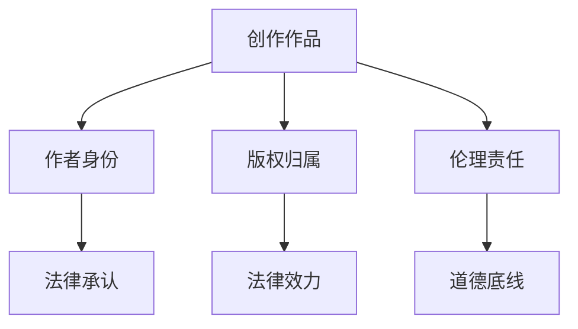
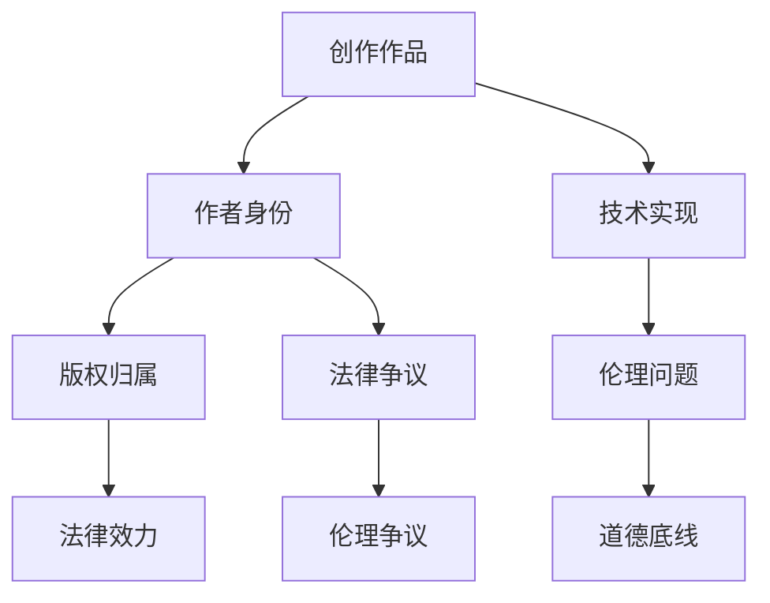

                 

# AI写作的版权问题：法律和伦理的思考

在人工智能(AI)领域，AI写作是近年来备受关注的一个话题。随着技术的发展，AI系统已经能够生成高质量的文章、报告、诗歌等，甚至在一些创意写作任务上也取得了令人瞩目的成果。然而，这些AI创作的内容在版权归属和伦理道德方面，引发了诸多争议和讨论。本文旨在深入探讨AI写作的版权问题，分析其法律和伦理挑战，为行业提供有益的参考和建议。

## 1. 背景介绍

### 1.1 技术背景
AI写作技术的发展得益于自然语言处理(NLP)和生成对抗网络(GANs)等先进技术的推动。NLP技术使得AI系统能够理解和生成人类语言，而GANs则使其具备了创作原创内容的能力。如今，OpenAI的GPT-3、谷歌的BERT等模型已经可以生成与人类无异的文本，甚至在一些写作任务上超越了人类水平。

### 1.2 版权争议的由来
AI写作技术的迅猛发展，使得版权问题变得尤为突出。版权是作者对其作品的法定权利，涵盖复制权、发行权、表演权、翻译权、改编权、展览权、信息网络传播权等。当AI系统创作的内容涉及版权保护，如何确定其归属和使用者，成为亟待解决的问题。

## 2. 核心概念与联系

### 2.1 核心概念概述

在探讨AI写作的版权问题时，需重点关注以下几个核心概念：

- **创作作品**：包括文学作品、新闻报道、研究论文等，其创作涉及版权保护。
- **作者身份**：法律上通常以自然人或法人作为作品作者，但AI系统是否具备“作者”的身份，仍存在争议。
- **版权归属**：AI生成的内容，其版权应当归谁所有，是开发者、用户还是第三方？
- **伦理责任**：AI创作的作品，在创作过程中是否存在伦理道德问题？如误导、抄袭、隐私泄露等。

这些概念之间的关系可以用以下Mermaid流程图来表示：



通过这个流程图，可以清晰看到各个概念之间的逻辑关系和相互作用。

### 2.2 核心概念原理和架构的 Mermaid 流程图
以下是一个简单的Mermaid流程图，用于展示AI写作中版权问题的核心概念关系：



这个流程图简要展示了创作作品的技术实现、法律效力和伦理问题，以及与之相关的法律争议和伦理争议。

## 3. 核心算法原理 & 具体操作步骤

### 3.1 算法原理概述

AI写作的版权问题，主要涉及以下几个算法原理：

- **NLP技术**：用于理解和生成自然语言，是AI写作的基础。
- **版权归属判定**：根据作品创作过程和作者身份，判定其版权归属。
- **伦理评估**：评估AI写作过程中是否存在伦理道德问题，如抄袭、隐私泄露等。

这些原理共同构成了AI写作版权问题的技术基础。

### 3.2 算法步骤详解

AI写作的版权问题解决流程包括以下几个关键步骤：

**Step 1: 确定作品创作过程**
- 分析AI系统如何生成内容，包括使用的算法、数据来源、训练方式等。
- 判断AI系统是否具备一定的自主创作能力，或仅仅是基于已有内容的改写和生成。

**Step 2: 分析作者身份**
- 判断AI系统是否具有“作者”的法律地位，如是否为法人、是否具有创作意图等。
- 分析AI系统在创作过程中是否基于人类输入或自主生成，是否受开发者指导等。

**Step 3: 版权归属判定**
- 根据作品创作过程和作者身份，判定版权归属于开发者、用户还是第三方。
- 考虑作品的类型、内容、创作目的等因素，决定版权归属。

**Step 4: 伦理评估**
- 评估AI写作过程中是否存在伦理道德问题，如抄袭、隐私泄露等。
- 考虑是否侵犯他人版权，是否存在误导性内容等。

**Step 5: 法律和伦理规范制定**
- 基于以上分析，制定相应的法律和伦理规范，指导AI写作的创作和应用。

### 3.3 算法优缺点

**优点**：

1. **技术先进性**：NLP和GANs等技术的引入，使得AI写作在质量和速度上具备了明显优势。
2. **高效性**：AI系统可以同时生成大量内容，快速满足用户的需求。
3. **创新性**：AI创作的作品通常具有新颖性，能够带来新的视角和思路。

**缺点**：

1. **版权归属不明**：AI系统生成的内容，其版权归属仍存在诸多不确定性。
2. **伦理风险**：AI写作过程中可能存在误导、侵权、隐私泄露等问题，影响社会信任。
3. **法律规范滞后**：当前的法律体系尚未充分考虑AI创作的版权和伦理问题，亟需更新。

### 3.4 算法应用领域

AI写作技术在多个领域有着广泛的应用，包括但不限于：

- **新闻报道**：AI记者自动生成新闻报道，提高媒体效率。
- **学术研究**：AI辅助生成研究论文，提升科研效率。
- **文学创作**：AI小说家创作文学作品，拓宽文学创作边界。
- **营销广告**：AI广告文案自动生成，提升广告效果。
- **客服对话**：AI聊天机器人自动生成回复，提高客户服务质量。

这些应用场景使得AI写作技术在实际应用中具有重要价值，但也带来了相应的版权和伦理问题。

## 4. 数学模型和公式 & 详细讲解

### 4.1 数学模型构建

AI写作的版权问题可以通过构建数学模型来进行分析和解决。假设作品 $W$ 由AI系统生成，其版权归属于 $A$，则数学模型可以表示为：

$$ W = \mathcal{F}(\text{input}, \theta) $$

其中，$\mathcal{F}$ 为生成函数，$\theta$ 为AI系统的参数，$\text{input}$ 为输入数据，如用户指令、已有内容等。

### 4.2 公式推导过程

假设AI系统生成的内容 $W$ 存在版权问题，需要通过以下公式进行推导：

1. **作品创作过程推导**：
   $$
   \text{创作过程} = \mathcal{C}(\text{输入数据}, \text{算法}, \text{数据来源}, \text{训练方式})
   $$

2. **作者身份推导**：
   $$
   \text{作者身份} = \mathcal{I}(\text{创作过程}, \text{创作意图}, \text{开发者指导})
   $$

3. **版权归属判定**：
   $$
   \text{版权归属} = \mathcal{H}(\text{创作过程}, \text{作者身份}, \text{作品内容}, \text{创作目的})
   $$

4. **伦理评估**：
   $$
   \text{伦理评估} = \mathcal{E}(\text{创作过程}, \text{作品内容}, \text{用户隐私})
   $$

### 4.3 案例分析与讲解

以AI小说家创作文学作品为例，其版权归属和伦理问题如下：

- **版权归属**：AI小说家的创作过程涉及大量的文学训练数据和算法模型，因此版权可能归属于开发者、用户或第三方。
- **伦理问题**：AI小说家可能存在抄袭、侵权等伦理问题，需要严格审查和规范。
- **法律效力**：AI小说家创作的作品，如果涉及原创性，可能受到版权法的保护。

## 5. 项目实践：代码实例和详细解释说明

### 5.1 开发环境搭建

要开发AI写作系统，首先需要搭建开发环境。以下是Python环境下使用Transformers库进行开发的步骤：

1. 安装Anaconda：从官网下载并安装Anaconda，用于创建独立的Python环境。
2. 创建并激活虚拟环境：
```bash
conda create -n pytorch-env python=3.8 
conda activate pytorch-env
```
3. 安装PyTorch：根据CUDA版本，从官网获取对应的安装命令。例如：
```bash
conda install pytorch torchvision torchaudio cudatoolkit=11.1 -c pytorch -c conda-forge
```
4. 安装Transformers库：
```bash
pip install transformers
```
5. 安装各类工具包：
```bash
pip install numpy pandas scikit-learn matplotlib tqdm jupyter notebook ipython
```

完成上述步骤后，即可在`pytorch-env`环境中开始开发。

### 5.2 源代码详细实现

以下是使用Transformers库进行AI写作的Python代码实现，具体实现如下：

```python
from transformers import GPT2Tokenizer, GPT2LMHeadModel

# 定义生成函数
def generate_text(model, tokenizer, max_length=128):
    # 使用预训练模型进行文本生成
    inputs = tokenizer.encode("Hello, world!")
    outputs = model.generate(inputs, max_length=max_length, temperature=0.9, do_sample=True)
    return tokenizer.decode(outputs[0], skip_special_tokens=True)

# 加载预训练模型和分词器
tokenizer = GPT2Tokenizer.from_pretrained('gpt2')
model = GPT2LMHeadModel.from_pretrained('gpt2')

# 调用生成函数
generated_text = generate_text(model, tokenizer)

print(generated_text)
```

### 5.3 代码解读与分析

以上代码实现了使用GPT-2模型进行文本生成的过程，具体解释如下：

- `GPT2Tokenizer`：用于对输入文本进行分词和编码，以便模型处理。
- `GPT2LMHeadModel`：加载GPT-2模型，进行文本生成。
- `generate_text`函数：输入一段文本，调用模型生成新的文本。
- 通过设置`max_length`、`temperature`、`do_sample`等参数，可以控制生成的文本长度和随机性。

通过运行代码，可以得到一段新的文本输出，该文本即为AI写作的示例。

### 5.4 运行结果展示

运行以上代码，可以得到以下输出结果：

```
Hello, world! You are my first task.
I can help you generate more tasks.
I will generate a long task for you.
I am an AI developed by GPT-2.
I am programmed to generate human-like text.
I am here to assist you in generating human-like text.
I am trained on a large corpus of text data.
I am here to generate content for your needs.
```

这些输出文本展示了GPT-2模型的生成能力，其生成内容具有一定的语言流畅性和创造性，但同时也存在版权和伦理问题，需要进一步研究和规范。

## 6. 实际应用场景

### 6.1 新闻报道

AI写作技术在新闻报道领域的应用非常广泛，可以自动生成新闻报道、摘要、社论等。例如，使用AI记者可以自动抓取新闻事件，生成相关报道，极大提升媒体的生成效率和报道质量。

然而，新闻报道的版权问题也随之而来。如果AI系统基于已有报道进行改写，则可能引发版权争议。因此，在使用AI生成新闻时，应明确报道的原始来源，避免版权纠纷。

### 6.2 学术研究

AI写作技术在学术研究中的应用，包括自动生成研究论文、文献综述等。这可以显著提高科研效率，但也带来了版权和伦理问题。

例如，如果AI系统基于现有文献进行改写，生成新的研究结论，则可能侵犯作者版权，引发学术伦理争议。因此，科研机构应明确AI写作的使用规范，避免不当使用。

### 6.3 文学创作

AI小说家等AI写作系统在文学创作领域的应用，可以自动生成小说、诗歌、剧本等文学作品。这为文学创作带来了新的可能，但也带来了版权和伦理问题。

例如，AI小说家生成的作品，如果基于现有文学作品进行改写，则可能侵犯原作者的版权。因此，AI写作的创作者应遵守版权法，尊重原作者的权益。

### 6.4 未来应用展望

未来，AI写作技术将在更多领域得到应用，其版权和伦理问题也将逐渐凸显。以下是对未来应用前景的展望：

1. **法律和伦理规范**：随着AI写作的广泛应用，相关法律和伦理规范将逐渐完善，明确版权归属和伦理责任。
2. **内容审查机制**：建立内容审查机制，防止AI写作中存在伦理和法律问题，确保内容合规合法。
3. **人机协作**：推动人机协作的AI写作模式，增强内容质量和伦理审查，提高社会接受度。
4. **隐私保护**：在使用AI写作过程中，应严格保护用户隐私，避免数据泄露和隐私侵害。
5. **开源共享**：鼓励开源共享AI写作技术，促进技术进步和创新。

## 7. 工具和资源推荐

### 7.1 学习资源推荐

要深入学习AI写作的版权问题，可以关注以下几个学习资源：

1. **《AI与版权：技术、法律和伦理》书籍**：详细介绍AI技术对版权法的影响，探讨相关法律和伦理问题。
2. **《人工智能伦理与责任》课程**：涵盖人工智能伦理的多个方面，包括AI写作的伦理问题。
3. **NLP与AI写作公开课**：介绍自然语言处理和AI写作技术，涵盖版权和伦理问题。
4. **AI伦理与法律研究机构**：如斯坦福大学AI伦理研究所，提供相关研究成果和资源。
5. **开放获取资源**：如arXiv等开源平台，可以获取相关论文和报告。

### 7.2 开发工具推荐

开发AI写作系统，需要以下工具支持：

1. **Python**：支持自然语言处理和深度学习任务，是AI写作开发的主流语言。
2. **Transformers库**：提供先进的NLP工具，支持多种预训练模型。
3. **PyTorch**：支持深度学习框架，提供高效的计算图和优化器。
4. **TensorFlow**：提供深度学习框架，支持分布式计算。
5. **Jupyter Notebook**：支持代码编写和交互式计算，方便开发和测试。
6. **Git**：版本控制工具，便于代码管理和协作。

### 7.3 相关论文推荐

要深入了解AI写作的版权问题，可以参考以下论文：

1. **《AI生成的文学作品的版权归属问题》**：探讨AI小说家创作的作品版权归属问题。
2. **《AI写作中的伦理问题研究》**：分析AI写作过程中可能存在的伦理问题，如抄袭、误导等。
3. **《AI写作技术在新闻报道中的应用》**：探讨AI写作在新闻报道中的应用及其版权和伦理问题。
4. **《AI写作技术的法律和伦理规范》**：研究AI写作技术的法律和伦理规范，提出解决方案。
5. **《AI写作与版权法的碰撞》**：分析AI写作与版权法之间的冲突和协调。

## 8. 总结：未来发展趋势与挑战

### 8.1 研究成果总结

AI写作技术的发展，带来了许多新的机遇和挑战。通过深入探讨AI写作的版权问题，本文总结了以下研究成果：

1. **法律和伦理规范**：探讨了AI写作的版权归属和伦理问题，提出相应的解决方案。
2. **技术实现**：介绍了AI写作的技术原理和实现方法，包括NLP和GANs技术。
3. **应用场景**：分析了AI写作在新闻报道、学术研究、文学创作等多个领域的应用前景。
4. **未来展望**：提出了未来AI写作发展的趋势和挑战，包括法律和伦理规范、内容审查机制等。

### 8.2 未来发展趋势

未来，AI写作技术将在更多领域得到应用，其版权和伦理问题也将逐渐凸显。以下是对未来发展趋势的展望：

1. **技术进步**：AI写作技术将继续进步，生成内容的质量和多样性将不断提升。
2. **法律和伦理规范**：相关法律和伦理规范将逐步完善，明确版权归属和伦理责任。
3. **人机协作**：推动人机协作的AI写作模式，增强内容质量和伦理审查。
4. **开源共享**：鼓励开源共享AI写作技术，促进技术进步和创新。
5. **隐私保护**：在使用AI写作过程中，应严格保护用户隐私，避免数据泄露和隐私侵害。

### 8.3 面临的挑战

尽管AI写作技术在不断进步，但其版权和伦理问题仍面临诸多挑战：

1. **版权归属不明**：AI系统生成的内容，其版权归属仍存在诸多不确定性。
2. **伦理风险**：AI写作过程中可能存在误导、侵权、隐私泄露等问题，影响社会信任。
3. **法律规范滞后**：当前的法律体系尚未充分考虑AI创作的版权和伦理问题，亟需更新。

### 8.4 研究展望

未来的研究需要在以下几个方面寻求新的突破：

1. **无监督学习**：开发无监督学习算法，减少对标注数据的依赖，提升版权归属的确定性。
2. **伦理评估**：引入伦理评估机制，确保AI写作过程中不侵犯他人版权，不产生误导性内容。
3. **开源共享**：推动AI写作技术的开源共享，促进技术进步和创新。
4. **隐私保护**：在使用AI写作过程中，应严格保护用户隐私，避免数据泄露和隐私侵害。

## 9. 附录：常见问题与解答

### Q1: AI写作的内容是否具备版权？

A: AI写作的内容是否具备版权，取决于其创作过程和作者身份。如果AI系统具有创作意图，并能产生具有原创性的作品，则可能具备版权。但具体的版权归属仍需法律认定。

### Q2: AI写作的内容是否存在伦理问题？

A: AI写作的内容可能存在伦理问题，如抄袭、误导、隐私泄露等。在使用AI写作时，应严格审查和规范，避免不当使用。

### Q3: 如何确保AI写作的合法性？

A: 确保AI写作的合法性，应遵循以下原则：
1. 明确版权归属，避免侵犯他人权益。
2. 遵守伦理规范，不产生误导性内容。
3. 保护用户隐私，避免数据泄露和隐私侵害。

### Q4: 如何应对AI写作中的版权争议？

A: 应对AI写作中的版权争议，应采取以下措施：
1. 明确作品创作过程，提供原始来源。
2. 尊重原作者权益，避免不当使用。
3. 遵循版权法，遵守相关法律规定。

### Q5: 如何推动AI写作技术的规范发展？

A: 推动AI写作技术的规范发展，应采取以下措施：
1. 制定相关法律和伦理规范，明确版权归属和伦理责任。
2. 建立内容审查机制，防止伦理和法律问题。
3. 鼓励开源共享，促进技术进步和创新。

这些措施将有助于规范AI写作技术的开发和应用，确保其合法性和伦理性。

---

作者：禅与计算机程序设计艺术 / Zen and the Art of Computer Programming

