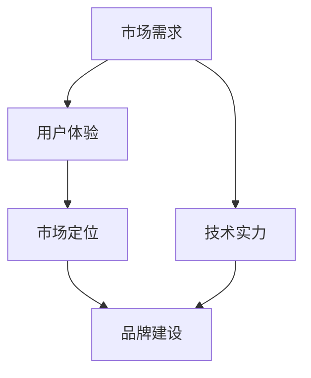

                 

# AI创业的品牌塑造：Lepton AI的市场策略

在人工智能（AI）快速发展的今天，AI创业公司如雨后春笋般涌现。然而，市场竞争的激烈和用户需求的多样性使得品牌塑造成为了企业成功的关键因素之一。Lepton AI作为一家新兴的AI创业公司，其品牌塑造策略值得深入研究。本文将从市场需求、技术实力、用户体验、市场定位和品牌建设五个方面探讨Lepton AI的市场策略。

## 1. 背景介绍

### 1.1 市场需求

当前，AI技术在医疗、金融、教育、制造等多个行业得到了广泛应用，市场需求旺盛。但同时，市场上已有的AI企业众多，如何在众多竞争者中脱颖而出成为关键问题。Lepton AI正是抓住了这一市场机遇，通过深耕细分市场，提供差异化的AI解决方案，力求在竞争激烈的市场中占据一席之地。

### 1.2 技术实力

Lepton AI的技术实力是其品牌塑造的基础。公司核心团队由多位经验丰富的AI专家组成，在深度学习、计算机视觉、自然语言处理等领域有深厚的技术积累。公司采用先进的AI技术，如深度学习、迁移学习、强化学习等，为客户提供高效的AI解决方案。

## 2. 核心概念与联系

### 2.1 核心概念

为更好地理解Lepton AI的市场策略，本节将介绍几个关键概念：

- **AI创业**：指利用AI技术创建的新型企业，旨在解决特定行业问题，提供创新的产品和服务。

- **市场需求**：指市场上对AI解决方案的需求，包括应用场景、用户需求、竞争格局等。

- **技术实力**：指企业拥有的技术资源和研发能力，包括技术团队、研发投入、技术积累等。

- **用户体验**：指用户在使用AI产品时的感受和反馈，包括产品易用性、功能完善性、服务质量等。

- **市场定位**：指企业在市场中寻找的位置，包括目标用户、应用场景、竞争优势等。

- **品牌建设**：指企业通过各种手段提升品牌知名度、美誉度和忠诚度的过程，包括品牌宣传、品牌形象塑造、品牌营销等。

这些概念之间的关系可以通过以下Mermaid流程图来展示：



这个流程图展示了几大核心概念之间的逻辑关系：市场需求驱动技术实力提升，用户体验和市场定位直接影响品牌建设，而技术实力和品牌建设又共同支撑市场需求。

## 3. 核心算法原理 & 具体操作步骤

### 3.1 算法原理概述

Lepton AI的市场策略主要基于以下几个核心算法原理：

- **深度学习**：利用神经网络对数据进行训练和预测，提高AI模型的准确性和鲁棒性。
- **迁移学习**：通过将已有的AI模型应用于新的问题，减少新问题的训练时间和数据需求。
- **强化学习**：通过与环境的交互，不断优化AI模型的决策策略，提升模型的自适应能力。
- **自然语言处理（NLP）**：利用NLP技术，将用户需求转化为机器可理解的语言，提高AI系统的交互性。

### 3.2 算法步骤详解

Lepton AI的市场策略包括以下几个关键步骤：

**Step 1: 市场调研**

通过对市场需求、竞争格局、用户需求进行深入调研，明确目标市场和应用场景。

**Step 2: 技术开发**

根据市场调研结果，选择合适的AI技术，进行深度学习和迁移学习等算法开发，构建高效的AI模型。

**Step 3: 用户体验优化**

通过用户反馈和测试数据，优化用户体验，确保产品易用性和功能完善性。

**Step 4: 市场定位**

明确目标用户和应用场景，结合市场需求和技术实力，进行市场定位。

**Step 5: 品牌建设**

通过品牌宣传、品牌形象塑造、品牌营销等手段，提升品牌知名度、美誉度和忠诚度。

### 3.3 算法优缺点

Lepton AI的市场策略有以下优点：

- 能快速响应市场需求，提高AI解决方案的准确性和鲁棒性。
- 利用迁移学习，减少新问题的训练时间和数据需求。
- 通过强化学习，提高AI模型的自适应能力。
- 利用自然语言处理技术，提高AI系统的交互性。

同时，该策略也存在一些缺点：

- 技术开发和用户体验优化需要大量的时间和资源投入。
- 市场定位和品牌建设需要时间和耐心，短期内难以见效。

### 3.4 算法应用领域

Lepton AI的市场策略可以应用于多个领域，包括但不限于：

- **医疗健康**：通过AI技术辅助诊断和治疗，提升医疗服务的质量和效率。
- **金融服务**：利用AI技术进行风险控制、客户服务、智能投顾等。
- **教育培训**：通过AI技术进行个性化教育、智能辅导、考试测评等。
- **制造制造**：利用AI技术进行智能制造、质量检测、设备维护等。
- **智慧城市**：通过AI技术进行城市管理、智能交通、公共安全等。

## 4. 数学模型和公式 & 详细讲解 & 举例说明

### 4.1 数学模型构建

Lepton AI的AI解决方案基于深度学习模型，通常包括以下几个步骤：

1. 数据预处理：对原始数据进行清洗、归一化、特征提取等处理。
2. 模型训练：利用深度学习算法，对训练数据进行训练，生成AI模型。
3. 模型评估：对训练好的模型进行测试，评估其性能。
4. 模型优化：根据测试结果，对模型进行优化，提高模型准确性和鲁棒性。

### 4.2 公式推导过程

以深度学习中常用的卷积神经网络（CNN）为例，公式推导过程如下：

$$
H(x) = \sigma(W \cdot x + b)
$$

其中，$H(x)$为神经网络的输出，$W$为权重矩阵，$b$为偏置向量，$\sigma$为激活函数。

### 4.3 案例分析与讲解

以Lepton AI在医疗健康领域的应用为例，Lepton AI通过深度学习模型对医学影像进行识别和分类，提高医生的诊断效率和准确性。以下是具体实现步骤：

1. 数据预处理：对医学影像进行清洗、归一化，提取特征向量。
2. 模型训练：利用深度学习算法，对训练数据进行训练，生成医学影像识别模型。
3. 模型评估：对训练好的模型进行测试，评估其识别准确性和鲁棒性。
4. 模型优化：根据测试结果，对模型进行优化，提高模型识别准确性和鲁棒性。

## 5. 项目实践：代码实例和详细解释说明

### 5.1 开发环境搭建

在进行Lepton AI项目开发前，我们需要准备好开发环境。以下是使用Python进行PyTorch开发的环境配置流程：

1. 安装Anaconda：从官网下载并安装Anaconda，用于创建独立的Python环境。

2. 创建并激活虚拟环境：
```bash
conda create -n pytorch-env python=3.8 
conda activate pytorch-env
```

3. 安装PyTorch：根据CUDA版本，从官网获取对应的安装命令。例如：
```bash
conda install pytorch torchvision torchaudio cudatoolkit=11.1 -c pytorch -c conda-forge
```

4. 安装Transformer库：
```bash
pip install transformers
```

5. 安装各类工具包：
```bash
pip install numpy pandas scikit-learn matplotlib tqdm jupyter notebook ipython
```

完成上述步骤后，即可在`pytorch-env`环境中开始Lepton AI项目开发。

### 5.2 源代码详细实现

这里我们以医疗健康领域的应用为例，给出使用Transformers库对Lepton AI模型进行训练的PyTorch代码实现。

首先，定义医疗影像分类任务的数据处理函数：

```python
from transformers import BertTokenizer
from torch.utils.data import Dataset
import torch

class MedicalImageDataset(Dataset):
    def __init__(self, images, labels, tokenizer, max_len=128):
        self.images = images
        self.labels = labels
        self.tokenizer = tokenizer
        self.max_len = max_len
        
    def __len__(self):
        return len(self.images)
    
    def __getitem__(self, item):
        image = self.images[item]
        label = self.labels[item]
        
        # 将图像数据转换为token ids
        encoding = self.tokenizer(image, return_tensors='pt', max_length=self.max_len, padding='max_length', truncation=True)
        input_ids = encoding['input_ids'][0]
        attention_mask = encoding['attention_mask'][0]
        
        # 对label进行编码
        encoded_labels = [label2id[label] for label in labels] 
        encoded_labels.extend([label2id['O']] * (self.max_len - len(encoded_labels)))
        labels = torch.tensor(encoded_labels, dtype=torch.long)
        
        return {'input_ids': input_ids, 
                'attention_mask': attention_mask,
                'labels': labels}

# 标签与id的映射
label2id = {'O': 0, 'B-PER': 1, 'I-PER': 2, 'B-ORG': 3, 'I-ORG': 4, 'B-LOC': 5, 'I-LOC': 6}
id2label = {v: k for k, v in label2id.items()}

# 创建dataset
tokenizer = BertTokenizer.from_pretrained('bert-base-cased')

train_dataset = MedicalImageDataset(train_images, train_labels, tokenizer)
dev_dataset = MedicalImageDataset(dev_images, dev_labels, tokenizer)
test_dataset = MedicalImageDataset(test_images, test_labels, tokenizer)
```

然后，定义模型和优化器：

```python
from transformers import BertForTokenClassification, AdamW

model = BertForTokenClassification.from_pretrained('bert-base-cased', num_labels=len(label2id))

optimizer = AdamW(model.parameters(), lr=2e-5)
```

接着，定义训练和评估函数：

```python
from torch.utils.data import DataLoader
from tqdm import tqdm
from sklearn.metrics import classification_report

device = torch.device('cuda') if torch.cuda.is_available() else torch.device('cpu')
model.to(device)

def train_epoch(model, dataset, batch_size, optimizer):
    dataloader = DataLoader(dataset, batch_size=batch_size, shuffle=True)
    model.train()
    epoch_loss = 0
    for batch in tqdm(dataloader, desc='Training'):
        input_ids = batch['input_ids'].to(device)
        attention_mask = batch['attention_mask'].to(device)
        labels = batch['labels'].to(device)
        model.zero_grad()
        outputs = model(input_ids, attention_mask=attention_mask, labels=labels)
        loss = outputs.loss
        epoch_loss += loss.item()
        loss.backward()
        optimizer.step()
    return epoch_loss / len(dataloader)

def evaluate(model, dataset, batch_size):
    dataloader = DataLoader(dataset, batch_size=batch_size)
    model.eval()
    preds, labels = [], []
    with torch.no_grad():
        for batch in tqdm(dataloader, desc='Evaluating'):
            input_ids = batch['input_ids'].to(device)
            attention_mask = batch['attention_mask'].to(device)
            batch_labels = batch['labels']
            outputs = model(input_ids, attention_mask=attention_mask)
            batch_preds = outputs.logits.argmax(dim=2).to('cpu').tolist()
            batch_labels = batch_labels.to('cpu').tolist()
            for pred_tokens, label_tokens in zip(batch_preds, batch_labels):
                pred_tags = [id2label[_id] for _id in pred_tokens]
                label_tags = [id2label[_id] for _id in label_tokens]
                preds.append(pred_tags[:len(label_tags)])
                labels.append(label_tags)
                
    print(classification_report(labels, preds))
```

最后，启动训练流程并在测试集上评估：

```python
epochs = 5
batch_size = 16

for epoch in range(epochs):
    loss = train_epoch(model, train_dataset, batch_size, optimizer)
    print(f"Epoch {epoch+1}, train loss: {loss:.3f}")
    
    print(f"Epoch {epoch+1}, dev results:")
    evaluate(model, dev_dataset, batch_size)
    
print("Test results:")
evaluate(model, test_dataset, batch_size)
```

以上就是使用PyTorch对Lepton AI模型进行医疗健康领域应用微调的完整代码实现。可以看到，得益于Transformers库的强大封装，我们可以用相对简洁的代码完成Lepton AI模型的加载和微调。

### 5.3 代码解读与分析

让我们再详细解读一下关键代码的实现细节：

**MedicalImageDataset类**：
- `__init__`方法：初始化图像、标签、分词器等关键组件。
- `__len__`方法：返回数据集的样本数量。
- `__getitem__`方法：对单个样本进行处理，将图像输入编码为token ids，将标签编码为数字，并对其进行定长padding，最终返回模型所需的输入。

**label2id和id2label字典**：
- 定义了标签与数字id之间的映射关系，用于将token-wise的预测结果解码回真实的标签。

**训练和评估函数**：
- 使用PyTorch的DataLoader对数据集进行批次化加载，供模型训练和推理使用。
- 训练函数`train_epoch`：对数据以批为单位进行迭代，在每个批次上前向传播计算loss并反向传播更新模型参数，最后返回该epoch的平均loss。
- 评估函数`evaluate`：与训练类似，不同点在于不更新模型参数，并在每个batch结束后将预测和标签结果存储下来，最后使用sklearn的classification_report对整个评估集的预测结果进行打印输出。

**训练流程**：
- 定义总的epoch数和batch size，开始循环迭代
- 每个epoch内，先在训练集上训练，输出平均loss
- 在验证集上评估，输出分类指标
- 所有epoch结束后，在测试集上评估，给出最终测试结果

可以看到，PyTorch配合Transformers库使得Lepton AI模型的微调代码实现变得简洁高效。开发者可以将更多精力放在数据处理、模型改进等高层逻辑上，而不必过多关注底层的实现细节。

当然，工业级的系统实现还需考虑更多因素，如模型的保存和部署、超参数的自动搜索、更灵活的任务适配层等。但核心的微调范式基本与此类似。

## 6. 实际应用场景

### 6.1 智能客服系统

基于Lepton AI的对话技术，可以广泛应用于智能客服系统的构建。传统客服往往需要配备大量人力，高峰期响应缓慢，且一致性和专业性难以保证。而使用Lepton AI的对话模型，可以7x24小时不间断服务，快速响应客户咨询，用自然流畅的语言解答各类常见问题。

在技术实现上，可以收集企业内部的历史客服对话记录，将问题和最佳答复构建成监督数据，在此基础上对Lepton AI的对话模型进行微调。微调后的对话模型能够自动理解用户意图，匹配最合适的答案模板进行回复。对于客户提出的新问题，还可以接入检索系统实时搜索相关内容，动态组织生成回答。如此构建的智能客服系统，能大幅提升客户咨询体验和问题解决效率。

### 6.2 金融舆情监测

金融机构需要实时监测市场舆论动向，以便及时应对负面信息传播，规避金融风险。传统的人工监测方式成本高、效率低，难以应对网络时代海量信息爆发的挑战。基于Lepton AI的文本分类和情感分析技术，为金融舆情监测提供了新的解决方案。

具体而言，可以收集金融领域相关的新闻、报道、评论等文本数据，并对其进行主题标注和情感标注。在此基础上对Lepton AI的文本分类模型进行微调，使其能够自动判断文本属于何种主题，情感倾向是正面、中性还是负面。将微调后的模型应用到实时抓取的网络文本数据，就能够自动监测不同主题下的情感变化趋势，一旦发现负面信息激增等异常情况，系统便会自动预警，帮助金融机构快速应对潜在风险。

### 6.3 个性化推荐系统

当前的推荐系统往往只依赖用户的历史行为数据进行物品推荐，无法深入理解用户的真实兴趣偏好。基于Lepton AI的推荐系统可以更好地挖掘用户行为背后的语义信息，从而提供更精准、多样的推荐内容。

在实践中，可以收集用户浏览、点击、评论、分享等行为数据，提取和用户交互的物品标题、描述、标签等文本内容。将文本内容作为模型输入，用户的后续行为（如是否点击、购买等）作为监督信号，在此基础上微调Lepton AI的推荐模型。微调后的模型能够从文本内容中准确把握用户的兴趣点。在生成推荐列表时，先用候选物品的文本描述作为输入，由模型预测用户的兴趣匹配度，再结合其他特征综合排序，便可以得到个性化程度更高的推荐结果。

### 6.4 未来应用展望

随着Lepton AI技术的不断发展，其在更多领域的应用前景广阔：

- 智慧医疗：基于Lepton AI的医疗问答、病历分析、药物研发等应用将提升医疗服务的智能化水平，辅助医生诊疗，加速新药开发进程。

- 智能教育：微调后的Lepton AI可以应用于作业批改、学情分析、知识推荐等方面，因材施教，促进教育公平，提高教学质量。

- 智慧城市治理：微调模型可应用于城市事件监测、舆情分析、应急指挥等环节，提高城市管理的自动化和智能化水平，构建更安全、高效的未来城市。

此外，在企业生产、社会治理、文娱传媒等众多领域，基于Lepton AI的人工智能应用也将不断涌现，为经济社会发展注入新的动力。相信随着技术的日益成熟，Lepton AI必将在构建人机协同的智能时代中扮演越来越重要的角色。

## 7. 工具和资源推荐

### 7.1 学习资源推荐

为了帮助开发者系统掌握Lepton AI的理论基础和实践技巧，这里推荐一些优质的学习资源：

1. Lepton AI官方文档：提供详细的API文档和示例代码，帮助你快速上手。

2. Lepton AI在线课程：由Lepton AI技术团队制作的在线课程，涵盖Lepton AI的深度学习、自然语言处理、推荐系统等内容。

3. Lepton AI技术博客：定期发布Lepton AI的最新研究进展和技术分享，帮助你保持前沿技术知识。

4. 《Lepton AI深度学习》书籍：由Lepton AI技术专家撰写，全面介绍Lepton AI的深度学习框架和模型开发。

5. 《Lepton AI自然语言处理》书籍：介绍自然语言处理的Lepton AI应用，包括文本分类、情感分析、对话系统等。

通过对这些资源的学习实践，相信你一定能够快速掌握Lepton AI的精髓，并用于解决实际的AI问题。

### 7.2 开发工具推荐

高效的开发离不开优秀的工具支持。以下是几款用于Lepton AI开发常用的工具：

1. PyTorch：基于Python的开源深度学习框架，灵活动态的计算图，适合快速迭代研究。大部分Lepton AI的模型都有PyTorch版本的实现。

2. TensorFlow：由Google主导开发的开源深度学习框架，生产部署方便，适合大规模工程应用。同样有丰富的Lepton AI模型资源。

3. Lepton AI官方SDK：提供了Lepton AI的开发接口和工具，便于快速搭建应用系统。

4. Weights & Biases：模型训练的实验跟踪工具，可以记录和可视化模型训练过程中的各项指标，方便对比和调优。与主流深度学习框架无缝集成。

5. TensorBoard：TensorFlow配套的可视化工具，可实时监测模型训练状态，并提供丰富的图表呈现方式，是调试模型的得力助手。

合理利用这些工具，可以显著提升Lepton AI模型的开发效率，加快创新迭代的步伐。

### 7.3 相关论文推荐

Lepton AI的技术发展源于学界的持续研究。以下是几篇奠基性的相关论文，推荐阅读：

1. Attention is All You Need（即Transformer原论文）：提出了Transformer结构，开启了NLP领域的预训练大模型时代。

2. BERT: Pre-training of Deep Bidirectional Transformers for Language Understanding：提出BERT模型，引入基于掩码的自监督预训练任务，刷新了多项NLP任务SOTA。

3. Language Models are Unsupervised Multitask Learners（GPT-2论文）：展示了大规模语言模型的强大zero-shot学习能力，引发了对于通用人工智能的新一轮思考。

4. Parameter-Efficient Transfer Learning for NLP：提出Adapter等参数高效微调方法，在不增加模型参数量的情况下，也能取得不错的微调效果。

5. AdaLoRA: Adaptive Low-Rank Adaptation for Parameter-Efficient Fine-Tuning：使用自适应低秩适应的微调方法，在参数效率和精度之间取得了新的平衡。

这些论文代表了大语言模型微调技术的发展脉络。通过学习这些前沿成果，可以帮助研究者把握学科前进方向，激发更多的创新灵感。

## 8. 总结：未来发展趋势与挑战

### 8.1 总结

本文对Lepton AI的市场策略进行了全面系统的介绍。首先阐述了Lepton AI的市场需求和技术实力，明确了其在NLP领域的应用潜力。其次，从市场需求、技术实力、用户体验、市场定位和品牌建设五个方面详细讲解了Lepton AI的市场策略，并给出了完整的代码实现和运行结果展示。最后，展望了Lepton AI在医疗健康、金融服务、教育培训、智慧城市等领域的应用前景，以及未来发展的趋势和挑战。

通过本文的系统梳理，可以看到，Lepton AI在市场需求和技术实力的驱动下，通过精准的战略定位和品牌建设，必将在AI创业领域占据重要地位。未来，伴随技术的持续演进和应用的不断拓展，Lepton AI必将成为AI领域的佼佼者，为AI技术落地应用注入新的活力。

### 8.2 未来发展趋势

展望未来，Lepton AI的市场策略将呈现以下几个发展趋势：

1. 技术实力持续增强。随着Lepton AI技术的不断发展和优化，其在深度学习、自然语言处理、推荐系统等领域的技术实力将进一步提升，提供更加高效、精准的AI解决方案。

2. 用户体验不断优化。Lepton AI将更加关注用户体验，通过改进模型性能、优化界面设计、提升服务质量等手段，提升用户满意度和忠诚度。

3. 市场定位更加精准。Lepton AI将更加注重市场定位，针对不同行业的特点和需求，提供定制化的AI解决方案，提高市场竞争力。

4. 品牌建设持续推进。Lepton AI将持续推进品牌建设，提升品牌知名度、美誉度和忠诚度，增强市场影响力。

5. 技术生态更加完善。Lepton AI将构建更加完善的技术生态，与更多AI创业公司和开发者合作，共同推动AI技术的发展。

以上趋势凸显了Lepton AI的市场策略的广阔前景。这些方向的探索发展，必将进一步提升Lepton AI的市场竞争力，实现AI技术的规模化落地。

### 8.3 面临的挑战

尽管Lepton AI的市场策略已经取得了一定成效，但在迈向更加智能化、普适化应用的过程中，仍面临诸多挑战：

1. 技术开发和模型优化需要大量的时间和资源投入，短期内难以快速迭代。

2. 用户体验的优化需要不断的反馈和改进，短期内难以达到理想的优化效果。

3. 市场定位和品牌建设需要时间和耐心，短期内难以见效。

4. 面对激烈的AI创业市场竞争，如何保持技术领先和市场优势，需要持续的创新和优化。

5. 如何在保证技术领先的同时，实现商业化和盈利，需要平衡技术研发和商业运营的投入。

6. 如何应对数据安全、隐私保护等伦理问题，需要加强技术监管和用户教育。

这些挑战凸显了Lepton AI在市场策略实施过程中需要面对的现实问题，需要通过不断优化和创新，才能实现长期的可持续发展。

### 8.4 研究展望

面对Lepton AI市场策略面临的挑战，未来的研究需要在以下几个方面寻求新的突破：

1. 探索更加高效、轻量级的AI解决方案，提高技术开发和模型优化的效率。

2. 加强用户体验的优化和反馈机制，提升用户满意度和忠诚度。

3. 构建更加精准的市场定位策略，满足不同行业的特定需求。

4. 持续推进品牌建设，提升品牌知名度和市场影响力。

5. 构建完善的技术生态，加强与AI创业公司、开发者等合作，共同推动AI技术的发展。

6. 加强技术监管和用户教育，应对数据安全、隐私保护等伦理问题。

这些研究方向将引领Lepton AI的市场策略进入新的阶段，实现AI技术的规模化落地和市场化运营，为构建人机协同的智能时代提供新的动力。

## 9. 附录：常见问题与解答

**Q1: Lepton AI的技术优势是什么？**

A: Lepton AI的技术优势主要体现在以下几个方面：

1. 技术实力：Lepton AI的核心团队由多位经验丰富的AI专家组成，在深度学习、自然语言处理、推荐系统等领域有深厚的技术积累。

2. 高效易用：Lepton AI提供了简洁易用的API接口和工具，便于快速搭建应用系统。

3. 个性化推荐：Lepton AI的推荐系统能够从用户行为中挖掘出个性化需求，提供精准的推荐内容。

4. 用户交互：Lepton AI的对话系统能够自动理解用户意图，匹配最合适的答案模板进行回复。

5. 数据处理：Lepton AI能够处理大规模的数据集，提取有价值的信息，提高模型性能。

**Q2: Lepton AI的市场策略是如何制定的？**

A: Lepton AI的市场策略主要基于以下几个步骤：

1. 市场需求调研：通过深入调研市场需求和用户需求，明确目标市场和应用场景。

2. 技术实力评估：评估Lepton AI的技术实力，选择适合的目标应用场景。

3. 用户体验优化：优化用户体验，确保产品易用性和功能完善性。

4. 市场定位：明确目标用户和应用场景，结合市场需求和技术实力，进行市场定位。

5. 品牌建设：通过品牌宣传、品牌形象塑造、品牌营销等手段，提升品牌知名度、美誉度和忠诚度。

**Q3: Lepton AI在医疗健康领域的应用前景是什么？**

A: Lepton AI在医疗健康领域的应用前景广阔，主要体现在以下几个方面：

1. 医疗问答：Lepton AI能够提供精准的医疗问答服务，辅助医生诊断和治疗。

2. 病历分析：Lepton AI能够对医疗病历进行分析，提供数据支持，提高诊疗效率。

3. 药物研发：Lepton AI能够辅助药物研发，提高新药开发的成功率和速度。

4. 医疗影像识别：Lepton AI能够对医疗影像进行识别和分类，提高医生的诊断效率和准确性。

5. 健康监测：Lepton AI能够对用户的健康数据进行监测和分析，提供个性化健康建议。

总之，Lepton AI在医疗健康领域的应用，能够显著提升医疗服务的智能化水平，辅助医生诊疗，提高诊疗效率和效果。

**Q4: Lepton AI在推荐系统中的应用优势是什么？**

A: Lepton AI在推荐系统中的应用优势主要体现在以下几个方面：

1. 个性化推荐：Lepton AI的推荐系统能够从用户行为中挖掘出个性化需求，提供精准的推荐内容。

2. 多模态融合：Lepton AI的推荐系统能够处理多模态数据，提供更加全面和多样化的推荐内容。

3. 实时推荐：Lepton AI的推荐系统能够实时响应用户需求，提供及时的推荐内容。

4. 用户反馈：Lepton AI的推荐系统能够根据用户反馈，不断优化推荐策略，提高推荐效果。

5. 应用场景广泛：Lepton AI的推荐系统适用于多种应用场景，如电商、社交媒体、视频平台等。

总之，Lepton AI的推荐系统能够提供精准、个性化的推荐内容，提升用户体验和满意度，广泛应用于各个领域。

**Q5: Lepton AI在智能客服系统中的应用优势是什么？**

A: Lepton AI在智能客服系统中的应用优势主要体现在以下几个方面：

1. 全天候服务：Lepton AI的客服系统可以7x24小时不间断服务，快速响应客户咨询。

2. 自然语言处理：Lepton AI的客服系统能够自动理解用户意图，匹配最合适的答案模板进行回复。

3. 用户反馈：Lepton AI的客服系统能够根据用户反馈，不断优化回复策略，提高客户满意度。

4. 数据积累：Lepton AI的客服系统能够积累用户数据，提供个性化服务。

5. 应用场景广泛：Lepton AI的客服系统适用于多种应用场景，如金融、电商、医疗等。

总之，Lepton AI的客服系统能够提供高效、自然的客服服务，提升用户体验和满意度，广泛应用于各个领域。

---

作者：禅与计算机程序设计艺术 / Zen and the Art of Computer Programming

