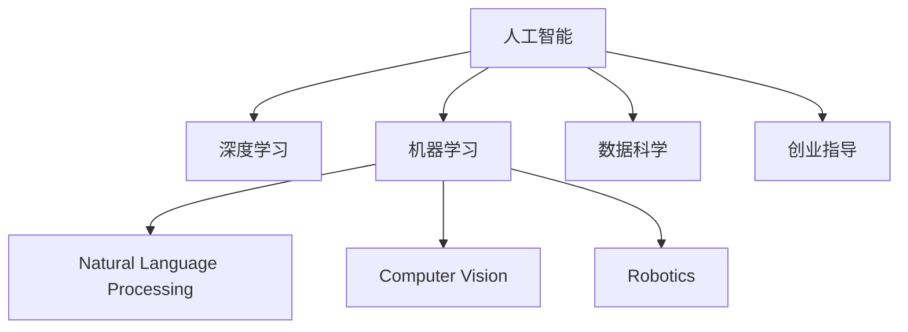

                 

# AI创业：人工智能的革命性突破

> 关键词：AI创业,人工智能,深度学习,机器学习,自然语言处理(NLP),计算机视觉(CV),机器人学,数据科学,创业指导

## 1. 背景介绍

### 1.1 问题由来
人工智能(AI)技术在过去几年中迎来了飞速发展，尤其是在深度学习(Deep Learning)和机器学习(Machine Learning)领域，取得了革命性的突破。这不仅为学术界带来了无数的新研究方向和发现，也为产业界和创业界开辟了广阔的创新空间。AI技术正在逐步渗透到各行各业，引发了产业数字化转型的浪潮。

人工智能领域的创业公司层出不穷，从机器学习算法到数据分析工具，从智能助手到自动驾驶，无数创业者和投资者将AI技术视为未来的“金矿”。然而，AI创业也面临着严峻的挑战，包括技术难度、市场竞争、数据隐私等。因此，如何理解人工智能的核心技术，把握行业发展趋势，制定科学的创业策略，对于AI创业者来说至关重要。

### 1.2 问题核心关键点
本节将重点探讨以下几个核心问题：
- AI创业的核心驱动力是什么？
- 如何在技术、产品、市场、人才等多维度构建AI创业生态？
- 当前AI创业面临的主要挑战和风险有哪些？
- AI创业的未来发展方向和趋势是什么？

这些问题的答案，将帮助我们深入理解AI创业的本质，制定更为科学的创业策略。

## 2. 核心概念与联系

### 2.1 核心概念概述

为更好地理解AI创业，本节将介绍几个密切相关的核心概念：

- **人工智能(AI)**：指通过计算机模拟人类的智能行为，实现自主学习、推理、决策和自我进化的能力。
- **深度学习(Deep Learning)**：基于多层神经网络结构的机器学习技术，用于处理复杂的非线性问题。
- **机器学习(Machine Learning)**：通过数据训练模型，使其能够自动改进算法以优化性能的计算机技术。
- **自然语言处理(NLP)**：使计算机能够理解、处理和生成人类语言的技术。
- **计算机视觉(CV)**：使计算机能够通过图像和视频信息进行感知和分析的技术。
- **机器人学(Robotics)**：结合AI技术和机械工程，使机器能够模拟人类行为的技术。
- **数据科学(Data Science)**：使用数据、算法和统计方法来解析和解释数据，从而提取有价值的信息。
- **创业指导(Entrepreneurship)**：指导创业者进行商业计划、市场分析、战略制定等活动，以推动企业成长。

这些核心概念之间的逻辑关系可以通过以下Mermaid流程图来展示：



这个流程图展示了人工智能技术在多个应用领域的广泛渗透，以及AI创业者在多个维度构建技术、产品和市场生态的需求。

## 3. 核心算法原理 & 具体操作步骤

### 3.1 算法原理概述

AI创业的核心在于将前沿的AI技术转化为有商业价值的产品和服务。这涉及到从技术选型、算法优化、产品设计到市场推广的各个环节。以下将介绍几个关键的算法原理：

- **深度学习模型构建**：基于大规模数据训练深度神经网络，通过多层非线性变换提取数据特征，用于分类、回归、生成等多种任务。
- **机器学习算法优化**：通过特征工程、模型调优、超参数搜索等技术手段，提升模型的泛化能力和性能表现。
- **自然语言处理技术**：使用词向量、Transformer等技术，实现文本理解、情感分析、机器翻译等任务。
- **计算机视觉技术**：通过卷积神经网络(CNN)、生成对抗网络(GAN)等方法，实现图像分类、目标检测、图像生成等任务。
- **机器人学习与控制**：结合深度强化学习、路径规划算法等技术，使机器人能够自主执行复杂任务。

### 3.2 算法步骤详解

以下以深度学习模型为例，详细讲解AI创业中常见的算法操作步骤：

1. **数据收集与预处理**：
   - 收集与业务场景相关的数据集，并进行清洗、标注、划分等预处理工作。
   - 使用标准数据集如ImageNet、COCO等，或自行采集标注数据进行训练。

2. **模型选择与设计**：
   - 根据任务需求选择适合的深度学习模型架构，如卷积神经网络、循环神经网络、Transformer等。
   - 设计模型超参数，如学习率、批量大小、层数等，并设置正则化、Dropout等防止过拟合的策略。

3. **模型训练与调优**：
   - 使用GPU/TPU等高性能设备进行模型训练，调整超参数以优化模型性能。
   - 采用梯度下降、Adam等优化算法更新模型参数，并监控训练过程中的损失函数和验证集指标。
   - 对模型进行调优，如学习率调整、批大小调整、正则化增强等，提升模型泛化能力。

4. **模型评估与部署**：
   - 在验证集上评估模型性能，使用精确率、召回率、F1分数等指标进行衡量。
   - 将模型封装为API接口，部署到云端或本地服务器，提供实时服务。
   - 定期更新模型，以适应数据分布的变化，提升模型鲁棒性。

### 3.3 算法优缺点

深度学习等AI算法在创业中具有以下优点：
- 高精度：深度学习模型在图像、语音、文本等任务中取得了超越人类的表现。
- 自动化：自动学习数据特征，减少人工干预，提升效率。
- 可扩展性：模型可以轻松地扩展到更多任务，满足多样化的需求。

然而，这些算法也存在一些缺点：
- 高成本：需要大量的计算资源和时间进行训练和调优。
- 可解释性不足：深度学习模型通常被视为"黑盒"，难以解释其内部工作机制。
- 数据依赖：模型性能高度依赖数据质量，数据偏差可能导致模型偏见。

### 3.4 算法应用领域

深度学习等AI算法在多个领域中得到了广泛应用，以下是一些典型场景：

- **自然语言处理(NLP)**：文本分类、情感分析、机器翻译、智能问答等。
- **计算机视觉(CV)**：图像分类、目标检测、人脸识别、图像生成等。
- **机器人学**：自动驾驶、服务机器人、协作机器人等。
- **医疗健康**：医学影像分析、疾病诊断、个性化推荐等。
- **金融服务**：信用评分、风险管理、欺诈检测等。
- **智能家居**：智能音箱、智能灯光、智能安防等。
- **游戏娱乐**：智能推荐、游戏AI、虚拟现实等。

## 4. 数学模型和公式 & 详细讲解 & 举例说明

### 4.1 数学模型构建

深度学习模型通常基于多层神经网络，通过前向传播计算输入数据的表示，通过反向传播更新模型参数。以图像分类为例，常见的数学模型构建如下：

- **输入数据**：图像 $x \in \mathbb{R}^{H \times W \times C}$，其中 $H$ 和 $W$ 为图像高和宽，$C$ 为通道数。
- **卷积层**：通过卷积操作提取局部特征 $f_{conv}(x)$，参数为 $w \in \mathbb{R}^{k \times k \times C}$。
- **池化层**：通过池化操作压缩特征图，减少参数量，参数为 $s \in \mathbb{N}$。
- **全连接层**：将特征图展平，输入全连接层，输出分类结果 $y \in \mathbb{R}^{K}$，其中 $K$ 为类别数。
- **softmax函数**：将输出转化为概率分布，用于多分类任务。

### 4.2 公式推导过程

以下是卷积神经网络(CNN)模型的主要公式推导过程：

- **前向传播**：
  $$
  x \in \mathbb{R}^{H \times W \times C}, \quad f_{conv}(x) = g(w * x + b) = \max(0, x * w + b)
  $$
  其中 $*$ 表示卷积运算，$w$ 为卷积核，$b$ 为偏置项。

- **损失函数**：
  $$
  L = \frac{1}{N} \sum_{i=1}^N \sum_{j=1}^K l(y_i, \hat{y}_j)
  $$
  其中 $N$ 为样本数，$K$ 为类别数，$l$ 为损失函数（如交叉熵）。

- **反向传播**：
  $$
  \frac{\partial L}{\partial w} = \frac{1}{N} \sum_{i=1}^N \sum_{j=1}^K \frac{\partial l}{\partial \hat{y}_j} \frac{\partial \hat{y}_j}{\partial z_j} \frac{\partial z_j}{\partial f_{conv}} \frac{\partial f_{conv}}{\partial w}
  $$
  其中 $\hat{y}_j$ 为分类结果，$z_j$ 为全连接层输出。

### 4.3 案例分析与讲解

以下以图像分类任务为例，详细讲解深度学习模型的实现过程：

1. **数据预处理**：
   - 将图像归一化到 $[0, 1]$ 范围。
   - 将图像缩放到指定大小，如 $224 \times 224$。
   - 使用随机裁剪、翻转等数据增强技术扩充训练集。

2. **模型构建**：
   - 使用PyTorch框架，定义卷积层、池化层、全连接层等组件。
   - 使用标准的ResNet、VGG等网络架构，设置适当的超参数。

3. **模型训练**：
   - 使用GPU进行模型训练，调整学习率、批大小等超参数。
   - 采用Adam优化器，使用交叉熵损失函数计算损失。
   - 定期在验证集上评估模型性能，调整超参数以提升效果。

4. **模型部署**：
   - 将模型保存为 checkpoint，使用API接口提供推理服务。
   - 部署到AWS、Google Cloud等云平台，实现实时推理。
   - 集成到企业应用中，提供实时图像分类服务。

## 5. 项目实践：代码实例和详细解释说明

### 5.1 开发环境搭建

以下是使用PyTorch进行深度学习模型训练的环境配置流程：

1. 安装Anaconda：从官网下载并安装Anaconda，用于创建独立的Python环境。

2. 创建并激活虚拟环境：
```bash
conda create -n pytorch-env python=3.8 
conda activate pytorch-env
```

3. 安装PyTorch：根据CUDA版本，从官网获取对应的安装命令。例如：
```bash
conda install pytorch torchvision torchaudio cudatoolkit=11.1 -c pytorch -c conda-forge
```

4. 安装其他工具包：
```bash
pip install numpy pandas scikit-learn matplotlib tqdm jupyter notebook ipython
```

完成上述步骤后，即可在`pytorch-env`环境中开始项目实践。

### 5.2 源代码详细实现

下面我们以图像分类任务为例，给出使用PyTorch进行深度学习模型训练的代码实现。

首先，定义模型和优化器：

```python
import torch
import torch.nn as nn
import torch.optim as optim

# 定义卷积神经网络
class CNNModel(nn.Module):
    def __init__(self):
        super(CNNModel, self).__init__()
        self.conv1 = nn.Conv2d(3, 32, 3)
        self.pool = nn.MaxPool2d(2, 2)
        self.fc1 = nn.Linear(32 * 28 * 28, 128)
        self.fc2 = nn.Linear(128, 10)

    def forward(self, x):
        x = torch.relu(self.conv1(x))
        x = self.pool(x)
        x = x.view(-1, 32 * 28 * 28)
        x = torch.relu(self.fc1(x))
        x = self.fc2(x)
        return x

# 加载数据集
import torchvision.datasets as datasets
from torchvision.transforms import transforms

train_dataset = datasets.CIFAR10(root='./data', train=True,
                                transform=transforms.ToTensor(), download=True)
test_dataset = datasets.CIFAR10(root='./data', train=False,
                               transform=transforms.ToTensor(), download=True)

# 数据预处理
train_loader = torch.utils.data.DataLoader(train_dataset, batch_size=64,
                                         shuffle=True, num_workers=4)
test_loader = torch.utils.data.DataLoader(test_dataset, batch_size=64,
                                         shuffle=False, num_workers=4)

# 定义模型、损失函数和优化器
model = CNNModel()
criterion = nn.CrossEntropyLoss()
optimizer = optim.Adam(model.parameters(), lr=0.001)

# 训练过程
epochs = 10
for epoch in range(epochs):
    for i, (images, labels) in enumerate(train_loader):
        outputs = model(images)
        loss = criterion(outputs, labels)
        optimizer.zero_grad()
        loss.backward()
        optimizer.step()
```

### 5.3 代码解读与分析

让我们再详细解读一下关键代码的实现细节：

**CNNModel类**：
- `__init__`方法：定义卷积层、池化层、全连接层等组件。
- `forward`方法：定义前向传播过程，包括卷积、池化、全连接等操作。

**数据预处理**：
- 使用`transforms.ToTensor()`方法将图像转换为张量格式。
- 使用`DataLoader`加载数据集，并设置批大小、随机采样等参数。

**模型训练**：
- 定义模型、损失函数和优化器。
- 通过循环迭代训练过程，每次前向传播计算损失函数，并反向传播更新模型参数。
- 在每个epoch结束时，使用测试集评估模型性能。

可以看到，PyTorch框架使得深度学习模型的实现变得简单高效。开发者可以通过自定义模型、数据预处理、优化器等组件，快速迭代和优化深度学习模型。

## 6. 实际应用场景

### 6.1 智能安防

深度学习模型在智能安防领域有着广泛的应用，通过图像识别和目标检测技术，可以实现人脸识别、行为分析、异常检测等功能。

在实际应用中，安防系统通常会采集大量实时视频流数据，使用深度学习模型提取关键特征，识别目标对象并标记异常行为。例如，通过监控视频实时检测非法入侵、火灾、爆炸等危险情况，及时触发警报和报警信息。

### 6.2 医疗影像

深度学习在医疗影像领域也有着重要的应用，通过图像分类、分割、诊断等技术，辅助医生进行疾病诊断和辅助决策。

例如，使用深度学习模型对医学影像进行分类，可以自动识别出肿瘤、病灶等关键区域。通过语义分割技术，可以将影像分割为不同的组织和器官，提供更详细的病理信息。同时，通过卷积神经网络进行图像生成，可以生成高精度的医学图像，用于医学研究和教学。

### 6.3 金融风控

深度学习在金融风控领域的应用主要集中在信用评分、风险管理、欺诈检测等方面。

例如，使用卷积神经网络处理用户的交易记录，可以分析用户的消费行为，预测其信用风险。通过生成对抗网络进行假账识别，可以实时检测欺诈行为，提高金融安全。同时，使用自然语言处理技术进行情感分析，可以预测市场情绪变化，辅助投资决策。

## 7. 工具和资源推荐

### 7.1 学习资源推荐

为了帮助开发者系统掌握深度学习模型的理论和实践技能，这里推荐一些优质的学习资源：

1. 《深度学习》（Goodfellow et al., 2016）：深度学习领域的经典教材，涵盖了深度学习的基础理论和常用算法。
2. CS231n《卷积神经网络》课程：斯坦福大学开设的计算机视觉课程，涵盖了深度学习在图像处理和计算机视觉中的应用。
3. CS224d《自然语言处理与深度学习》课程：斯坦福大学开设的NLP课程，介绍了深度学习在文本处理和自然语言理解中的应用。
4. PyTorch官方文档：PyTorch框架的官方文档，提供了丰富的教程和示例，是学习深度学习模型的重要资源。
5. TensorFlow官方文档：TensorFlow框架的官方文档，提供了详细的API文档和示例代码，是深度学习模型的另一个重要工具。
6. Coursera深度学习专项课程：由斯坦福大学教授Andrew Ng主讲，涵盖深度学习的基础理论和应用实践。
7. Kaggle竞赛平台：提供了大量的数据集和竞赛任务，可以帮助开发者实践和提升深度学习模型的能力。

通过对这些资源的学习实践，相信你一定能够快速掌握深度学习模型的精髓，并用于解决实际的AI应用问题。

### 7.2 开发工具推荐

高效的深度学习模型开发离不开优秀的工具支持。以下是几款用于深度学习模型开发的常用工具：

1. PyTorch：基于Python的开源深度学习框架，灵活动态的计算图，适合快速迭代研究。大部分深度学习模型都有PyTorch版本的实现。
2. TensorFlow：由Google主导开发的开源深度学习框架，生产部署方便，适合大规模工程应用。
3. Keras：基于TensorFlow和Theano的高级神经网络API，使用简单，适合快速原型开发。
4. MXNet：由Apache开发的深度学习框架，支持多种编程语言和多种硬件平台。
5. Caffe：由Berkeley开发的深度学习框架，适用于图像识别和计算机视觉任务。
6. OpenCV：计算机视觉领域的开源库，提供了丰富的图像处理和计算机视觉算法。
7. OpenAI Gym：环境模拟和强化学习测试环境，适合测试和优化深度学习模型。

合理利用这些工具，可以显著提升深度学习模型的开发效率，加快创新迭代的步伐。

### 7.3 相关论文推荐

深度学习模型和AI技术的发展源于学界的持续研究。以下是几篇奠基性的相关论文，推荐阅读：

1. ImageNet大规模视觉识别挑战（Imagenet Large Scale Visual Recognition Challenge）：这是一次重要的视觉识别竞赛，推动了深度学习在计算机视觉领域的发展。
2. AlexNet：ImageNet 2012年冠军算法，开创了深度卷积神经网络在计算机视觉中的应用。
3. VGGNet：使用非常深的卷积神经网络进行图像分类，取得了优异的性能。
4. ResNet：提出了残差网络结构，解决了深度网络训练中梯度消失的问题。
5. InceptionNet：引入了多尺度卷积操作，提升了深度神经网络的性能。
6. RNN和LSTM：循环神经网络及其变种，用于处理序列数据，如文本和语音。
7. GANs：生成对抗网络，用于生成高质量的图像和视频。
8. Attention Mechanism：注意力机制，用于提高深度学习模型的泛化能力和性能。
9. BERT：基于Transformer的预训练语言模型，推动了自然语言处理领域的发展。
10. GPT-3：由OpenAI开发的语言生成模型，展示了深度学习在自然语言处理中的强大能力。

这些论文代表了大深度学习模型和AI技术的发展脉络。通过学习这些前沿成果，可以帮助研究者把握学科前进方向，激发更多的创新灵感。

## 8. 总结：未来发展趋势与挑战

### 8.1 总结

本文对AI创业中深度学习模型的开发和应用进行了全面系统的介绍。首先阐述了AI创业的核心驱动力，明确了在技术、产品、市场、人才等多维度构建AI创业生态的必要性。其次，从深度学习模型的构建、训练、评估到部署，详细讲解了模型开发的完整流程。同时，本文还广泛探讨了深度学习模型在多个领域的应用前景，展示了其在实际应用中的广泛潜力。最后，本文精选了深度学习模型的各类学习资源，力求为读者提供全方位的技术指引。

通过本文的系统梳理，可以看到，深度学习模型在AI创业中发挥着至关重要的作用，其高精度、自动化、可扩展性等特点使其成为创业公司的重要技术基础。未来，伴随深度学习模型的不断发展，AI创业必将在更多领域得到应用，为各行各业带来颠覆性的变革。

### 8.2 未来发展趋势

展望未来，深度学习模型将呈现以下几个发展趋势：

1. **自动化与智能化**：深度学习模型将进一步自动化和智能化，通过强化学习、自监督学习等技术，实现更高效、更智能的决策和推理。
2. **多模态融合**：深度学习模型将支持多模态数据的融合，如文本、图像、语音等，实现更全面、更复杂的信息理解和处理。
3. **知识图谱与推理**：深度学习模型将与知识图谱、逻辑规则等专家知识结合，提升模型的推理能力和泛化能力。
4. **模型压缩与优化**：深度学习模型将进一步压缩和优化，减少计算资源和存储需求，提升实时性和可部署性。
5. **联邦学习与边缘计算**：深度学习模型将支持联邦学习和边缘计算，在保证数据隐私和安全性的同时，提升模型的可扩展性和性能。

### 8.3 面临的挑战

尽管深度学习模型在AI创业中取得了显著成就，但在迈向更加智能化、普适化应用的过程中，仍面临着诸多挑战：

1. **数据依赖**：深度学习模型高度依赖数据，数据偏见和数据不足可能导致模型偏见和过拟合。
2. **计算成本**：深度学习模型需要大量计算资源进行训练和推理，高昂的成本限制了模型的广泛应用。
3. **模型解释性不足**：深度学习模型通常被视为"黑盒"，难以解释其内部工作机制和决策逻辑。
4. **隐私与安全**：深度学习模型涉及大量敏感数据，数据隐私和模型安全性问题亟待解决。
5. **通用性不足**：深度学习模型在特定领域表现优秀，但在新领域和新任务上的泛化能力有待提升。

### 8.4 研究展望

面对深度学习模型在AI创业中面临的挑战，未来的研究需要在以下几个方面寻求新的突破：

1. **无监督与半监督学习**：探索无监督学习和半监督学习，降低对大规模标注数据的依赖，提升模型的泛化能力和鲁棒性。
2. **知识图谱与推理**：将知识图谱和逻辑规则与深度学习模型结合，提升模型的推理能力和泛化能力。
3. **可解释性增强**：通过注意力机制、可解释性工具等技术手段，增强深度学习模型的可解释性和可理解性。
4. **数据隐私与安全**：探索联邦学习、隐私保护技术，保护数据隐私和模型安全性。
5. **跨领域泛化**：探索跨领域泛化方法，提升深度学习模型在多个领域和任务上的表现。

这些研究方向的探索，必将引领深度学习模型和AI技术迈向更高的台阶，为AI创业提供更强大的技术支持和应用前景。面向未来，深度学习模型将与更多先进技术结合，如知识图谱、强化学习、联邦学习等，多路径协同发力，共同推动AI创业的持续创新和发展。

## 9. 附录：常见问题与解答

**Q1：深度学习模型如何处理大规模数据集？**

A: 深度学习模型通常使用GPU/TPU等高性能设备进行训练，以加速计算过程。对于大规模数据集，可以采用分布式训练、数据分块等技术手段，将数据集划分为多个子集，并行训练。此外，还可以使用数据增强技术，如随机裁剪、翻转、旋转等，扩充训练数据，提高模型泛化能力。

**Q2：深度学习模型如何避免过拟合？**

A: 深度学习模型容易过拟合，特别是在训练数据较少的情况下。为避免过拟合，可以采用以下技术手段：
1. 数据增强：通过随机裁剪、翻转、旋转等操作，扩充训练数据。
2. 正则化：使用L2正则、Dropout等技术手段，防止模型过度适应训练数据。
3. 早停策略：在验证集上监控模型性能，一旦性能不再提升，立即停止训练，避免过拟合。
4. 模型集成：使用多个模型的预测结果进行集成，减少个体模型的过拟合风险。

**Q3：深度学习模型如何部署到生产环境？**

A: 深度学习模型的部署需要考虑计算资源、模型大小、推理速度等多个因素。常见的方法包括：
1. 模型压缩：使用模型压缩技术，如剪枝、量化等，减少模型参数量，提高推理速度。
2. 模型优化：优化模型计算图，使用TensorRT等工具进行推理加速。
3. 云服务：将模型部署到云平台，如AWS、Google Cloud等，提供高性能的计算资源和扩展性。
4. 容器化：将模型封装为Docker镜像，使用Kubernetes等容器管理工具进行部署和扩展。

这些方法可以显著提高深度学习模型的部署效率和性能，确保其在生产环境中的稳定性和可扩展性。

**Q4：如何评估深度学习模型的性能？**

A: 评估深度学习模型的性能通常使用以下指标：
1. 精确率（Precision）：表示模型预测为正类的样本中，实际为正类的样本占比。
2. 召回率（Recall）：表示实际为正类的样本中，模型预测为正类的样本占比。
3. F1分数（F1 Score）：精确率和召回率的调和平均数，综合评估模型的性能。
4. AUC（Area Under Curve）：用于二分类问题，衡量模型在不同阈值下的性能表现。
5. ROC曲线：绘制模型的真正率与假正率曲线，评估模型的分类性能。

在评估过程中，可以使用交叉验证、测试集等方法，确保评估结果的公正性和可靠性。

**Q5：深度学习模型的调优策略有哪些？**

A: 深度学习模型的调优策略包括：
1. 学习率调整：使用学习率衰减、梯度累积等策略，调整学习率，防止模型过早收敛或过拟合。
2. 批大小调整：调整批大小，平衡模型性能和计算资源消耗。
3. 正则化：使用L2正则、Dropout等技术手段，防止模型过度适应训练数据。
4. 数据增强：通过随机裁剪、翻转、旋转等操作，扩充训练数据。
5. 模型集成：使用多个模型的预测结果进行集成，减少个体模型的过拟合风险。
6. 超参数搜索：使用网格搜索、随机搜索等方法，寻找最优的超参数组合。

这些调优策略可以显著提高深度学习模型的性能和泛化能力，提升其在实际应用中的表现。

---

作者：禅与计算机程序设计艺术 / Zen and the Art of Computer Programming

