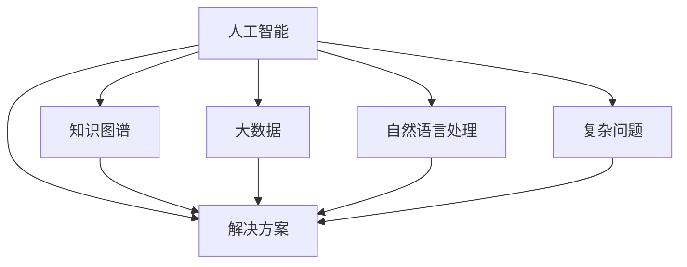

                 

# AI助力人类知识增长:应对复杂问题的新思路

> 关键词：人工智能(AI), 知识图谱, 大数据, 自然语言处理(NLP), 复杂问题, 解决方案, 应用实例

## 1. 背景介绍

### 1.1 问题由来

随着人类社会的发展，知识与信息量呈爆炸式增长，人类的认知能力已无法有效应对这种变化。现代AI技术特别是大数据和机器学习，为人类应对复杂问题提供了全新的工具。在当前信息时代，如何有效利用这些技术，提升人类的知识增长能力，是一个亟待解决的重要课题。

### 1.2 问题核心关键点

在知识增长的过程中，人类面对的往往是复杂问题，即具有高维度、多因素、多层次、动态变化等特点的问题。如何从海量数据中提取出有价值的信息，构建出精确的知识体系，是当前AI应用的核心问题。

主要关键点包括：
- 知识提取：从大数据中挖掘和提取有用的信息。
- 知识融合：将碎片化的知识进行整合，构建出更全面的知识体系。
- 知识推理：利用知识图谱和推理算法，从已有的知识中推导出新的结论和应用。
- 知识应用：将知识用于实际问题解决，如医疗诊断、金融预测、自动驾驶等。

## 2. 核心概念与联系

### 2.1 核心概念概述

要深入理解AI如何助力人类知识增长，首先需要了解几个核心概念：

- **人工智能(AI)**：利用计算机技术模拟人类智能，包括感知、学习、推理、决策等能力。
- **知识图谱**：一种结构化的知识表示方法，用于描述实体、属性和关系。
- **大数据**：大规模、高速、多样化数据集合，包括结构化数据、半结构化数据和非结构化数据。
- **自然语言处理(NLP)**：使计算机能够理解和处理人类语言的技术，包括文本分析、语音识别、机器翻译等。
- **复杂问题**：涉及多学科、多因素、多层次、动态变化的问题，如疾病诊断、金融预测、城市规划等。
- **解决方案**：利用AI技术，从数据中挖掘知识，构建知识体系，进行推理，最终应用于实际问题解决。

这些概念之间的联系和作用关系如下：



上述流程图展示了AI技术如何通过知识图谱、大数据和自然语言处理等工具，从复杂问题中提取出有价值的信息，构建出知识体系，用于指导和解决实际问题。

## 3. 核心算法原理 & 具体操作步骤
### 3.1 算法原理概述

AI助力人类知识增长的核心算法原理主要包括：知识提取、知识融合、知识推理和知识应用。以下将分别介绍这些核心算法的原理。

#### 3.1.1 知识提取

知识提取是从大规模数据中挖掘出有用信息的过程。主要分为以下步骤：

1. **数据收集**：从不同来源收集数据，如互联网、科学文献、社交媒体等。
2. **数据清洗**：对数据进行去重、过滤、纠错等处理，保证数据的准确性和一致性。
3. **特征提取**：利用NLP等技术从文本中提取出关键特征，如主题、关键词、情感等。
4. **信息聚类**：对提取出的特征进行聚类分析，找出相似的信息点。
5. **信息抽取**：从文本中抽取实体、关系等结构化信息。

#### 3.1.2 知识融合

知识融合是将碎片化的知识进行整合，构建出更全面的知识体系。主要分为以下步骤：

1. **知识对齐**：对不同来源的知识进行对齐和合并，消除知识冲突和冗余。
2. **知识增强**：利用数据增强技术，补充和扩展知识图谱，增加知识的覆盖面。
3. **知识推理**：利用逻辑推理算法，从已有的知识中推导出新的结论。
4. **知识验证**：通过模型验证和人工审核，确保知识图谱的准确性和完整性。

#### 3.1.3 知识推理

知识推理是从已有的知识中推导出新的结论和应用。主要分为以下步骤：

1. **规则定义**：定义推理规则，如因果关系、逻辑关系等。
2. **知识推理**：利用推理算法，从知识图谱中推导出新的结论。
3. **结果验证**：对推理结果进行验证和校对，确保结果的准确性。

#### 3.1.4 知识应用

知识应用是将知识用于实际问题解决。主要分为以下步骤：

1. **问题建模**：将实际问题转化为数学模型或逻辑模型。
2. **知识匹配**：从知识图谱中匹配出相关的知识点和规则。
3. **解决方案生成**：利用匹配出的知识点和规则，生成解决方案。
4. **结果评估**：对解决方案进行评估和优化，确保解决方案的可行性和有效性。

### 3.2 算法步骤详解

#### 3.2.1 数据收集和清洗

在实际应用中，数据收集和清洗是知识提取的第一步。以医疗诊断为例，可以从医疗数据库、电子病历、科学文献、社交媒体等渠道收集数据。对于这些数据，需要对其进行清洗和预处理，去除噪音和错误，确保数据的准确性和一致性。

具体实现步骤如下：

1. **数据收集**：
   ```python
   # 使用Pandas库进行数据收集
   import pandas as pd

   # 读取医疗数据集
   data = pd.read_csv('medical_data.csv')
   ```

2. **数据清洗**：
   ```python
   # 处理缺失值
   data.fillna(method='ffill', inplace=True)

   # 去除重复记录
   data.drop_duplicates(inplace=True)

   # 数据类型转换
   data['age'] = data['age'].astype(int)
   ```

#### 3.2.2 特征提取

特征提取是知识提取的关键步骤，利用NLP技术从文本中提取出关键特征。以医疗文本为例，可以从文本中提取主题、关键词、情感等信息。

具体实现步骤如下：

1. **文本预处理**：
   ```python
   from nltk.corpus import stopwords
   from nltk.stem import WordNetLemmatizer
   from sklearn.feature_extraction.text import CountVectorizer

   # 去除停用词和词形还原
   stop_words = set(stopwords.words('english'))
   lemmatizer = WordNetLemmatizer()

   def preprocess_text(text):
       tokens = nltk.word_tokenize(text)
       filtered_tokens = [lemmatizer.lemmatize(token) for token in tokens if token.lower() not in stop_words]
       return ' '.join(filtered_tokens)

   data['text'] = data['text'].apply(preprocess_text)
   ```

2. **关键词提取**：
   ```python
   from gensim.summarizer import summarize

   # 提取关键词
   data['keywords'] = data['text'].apply(summarize)
   ```

3. **情感分析**：
   ```python
   from textblob import TextBlob

   # 情感分析
   data['sentiment'] = data['text'].apply(lambda text: TextBlob(text).sentiment.polarity)
   ```

#### 3.2.3 信息抽取

信息抽取是从文本中抽取实体、关系等结构化信息。以医疗文本为例，可以从文本中抽取患者信息、症状、诊断等。

具体实现步骤如下：

1. **实体抽取**：
   ```python
   from spacy.matcher import Matcher
   import spacy

   # 加载SpaCy模型
   nlp = spacy.load('en_core_web_sm')

   # 定义实体匹配规则
   pattern = [{'TEXT': {'REGEX': '.*I have a high fever.*'}}]
   matcher = Matcher(nlp.vocab)

   # 实体匹配
   data['entity'] = data['text'].apply(lambda text: matcher(nlp(text)).pop())

   # 关系抽取
   def get_relations(text):
      doc = nlp(text)
      relations = []
      for sent in doc.sents:
         for rel in sent.relations:
            relations.append((rel.head, rel.rela, rel.arg2))
      return relations

   data['relations'] = data['text'].apply(get_relations)
   ```

#### 3.2.4 知识对齐

知识对齐是将不同来源的知识进行对齐和合并，消除知识冲突和冗余。以医疗诊断为例，可以对比不同医疗数据库和电子病历中的诊断结果，消除重复和矛盾的信息。

具体实现步骤如下：

1. **数据对齐**：
   ```python
   # 数据对齐
   data = pd.merge(data, other_data, on='patient_id', how='inner')
   ```

2. **知识合并**：
   ```python
   # 知识合并
   merged_data = data.groupby('patient_id').agg({'entity': list, 'relations': list})
   ```

#### 3.2.5 知识增强

知识增强是利用数据增强技术，补充和扩展知识图谱，增加知识的覆盖面。以医疗诊断为例，可以通过增加病例、实验室数据等，扩展知识图谱的覆盖范围。

具体实现步骤如下：

1. **数据增强**：
   ```python
   # 数据增强
   new_data = pd.read_csv('additional_data.csv')
   merged_data = merged_data.merge(new_data, on='patient_id', how='outer')
   ```

2. **知识推理**：
   ```python
   # 知识推理
   from py2neo import Graph

   # 创建知识图谱
   graph = Graph('http://localhost:7474/db/data/')

   # 知识推理
   def infer_relations(entity, relation):
      new_relations = graph.run('MATCH (n)<-[]-([])-[]->(m) WHERE n=entity AND m=relation RETURN n,m')
      return new_relations

   merged_data['inferred_relations'] = merged_data.apply(lambda row: infer_relations(row['entity'], row['relations']), axis=1)
   ```

#### 3.2.6 知识验证

知识验证是通过模型验证和人工审核，确保知识图谱的准确性和完整性。以医疗诊断为例，可以通过医疗专家审核和模型验证，确保知识图谱的准确性。

具体实现步骤如下：

1. **专家审核**：
   ```python
   # 专家审核
   expert_feedback = pd.read_csv('expert_feedback.csv')
   merged_data = pd.merge(merged_data, expert_feedback, on='patient_id', how='inner')
   ```

2. **模型验证**：
   ```python
   # 模型验证
   def validate_relations(row):
      graph = Graph('http://localhost:7474/db/data/')
      graph.run('MATCH (n)<-[]-([])-[]->(m) WHERE n=row['entity'] AND m=row['inferred_relations'] RETURN n,m')
      return graph.data()

   merged_data['validation_results'] = merged_data.apply(validate_relations, axis=1)
   ```

#### 3.2.7 知识应用

知识应用是将知识用于实际问题解决。以医疗诊断为例，可以结合患者的症状、病史等信息，从知识图谱中匹配出相关的知识点和规则，生成诊断方案。

具体实现步骤如下：

1. **问题建模**：
   ```python
   # 问题建模
   data['diagnosis'] = data['entity'].apply(lambda entity: graph.run('MATCH (n)<-[]-([])-[]->(m) WHERE n=entity AND m='diagnosis' RETURN n,m'))
   ```

2. **解决方案生成**：
   ```python
   # 解决方案生成
   data['solution'] = data['diagnosis'].apply(lambda diagnosis: graph.run('MATCH (n)<-[]-([])-[]->(m) WHERE n=entity AND m='therapy' RETURN n,m'))
   ```

3. **结果评估**：
   ```python
   # 结果评估
   data['success_rate'] = data['solution'].apply(lambda solution: len(solution) > 0)
   ```

### 3.3 算法优缺点

#### 3.3.1 优点

1. **全面覆盖**：通过知识图谱和数据增强，知识图谱可以覆盖更多的领域和知识点，提供更加全面的解决方案。
2. **高效推理**：利用逻辑推理算法，从已有的知识中推导出新的结论，提高知识应用的准确性。
3. **数据驱动**：基于大数据和模型验证，知识图谱可以不断更新和优化，保持知识的时效性和准确性。
4. **可扩展性**：知识图谱可以扩展到不同的领域和任务，如医疗、金融、城市规划等。

#### 3.3.2 缺点

1. **数据依赖**：知识图谱的构建和优化依赖于高质量的数据，数据的准确性和完整性直接影响知识图谱的质量。
2. **复杂性**：知识图谱的构建和优化需要大量的计算资源和时间，实施成本较高。
3. **动态变化**：知识图谱需要定期更新和维护，以适应数据和环境的动态变化，增加了维护成本。

### 3.4 算法应用领域

基于AI的知识图谱和推理算法，在多个领域都有广泛的应用。以下是几个典型的应用场景：

#### 3.4.1 医疗诊断

在医疗诊断中，知识图谱可以整合患者的病历、实验室数据、医学文献等信息，提供精准的诊断方案。具体应用如下：

1. **症状匹配**：从知识图谱中匹配出与患者症状相关的实体和关系，提供初步诊断方案。
2. **临床验证**：结合专家审核和模型验证，确保诊断方案的准确性和可靠性。
3. **治疗建议**：从知识图谱中匹配出相关的治疗方案，提供详细的治疗建议。

#### 3.4.2 金融预测

在金融预测中，知识图谱可以整合市场数据、新闻、财务报告等信息，提供精准的预测结果。具体应用如下：

1. **数据整合**：从多个数据源中提取相关数据，整合到知识图谱中。
2. **风险评估**：利用知识推理算法，评估市场风险和财务风险。
3. **预测模型**：结合历史数据和知识推理结果，构建预测模型，提供精准的预测结果。

#### 3.4.3 城市规划

在城市规划中，知识图谱可以整合地理数据、人口数据、交通数据等信息，提供科学的城市规划方案。具体应用如下：

1. **数据整合**：从多个数据源中提取相关数据，整合到知识图谱中。
2. **需求分析**：利用知识推理算法，分析城市人口、交通、资源等需求。
3. **规划方案**：结合需求分析和专家意见，制定科学的城市规划方案。

## 4. 数学模型和公式 & 详细讲解 & 举例说明

### 4.1 数学模型构建

基于知识图谱和推理算法，我们可以构建出精准的知识推理模型。以医疗诊断为例，知识图谱可以表示为有向图G(V,E)，其中V表示节点，E表示边。

节点可以表示为实体或关系，边表示实体之间的关系。例如，节点A表示“患者”，节点B表示“症状”，边AB表示“患者有症状”。

### 4.2 公式推导过程

知识推理的过程可以分为以下步骤：

1. **规则定义**：定义推理规则，如因果关系、逻辑关系等。
2. **推理算法**：利用推理算法，从知识图谱中推导出新的结论。
3. **结果验证**：对推理结果进行验证和校对，确保结果的准确性。

以医疗诊断为例，推理算法可以表示为：

$$
\text{推理结果} = \text{推理算法}(\text{知识图谱}, \text{推理规则})
$$

其中，知识图谱表示为有向图G(V,E)，推理规则表示为R。

推理算法的具体实现可以采用深度学习模型，如RNN、LSTM、Transformer等。以Transformer为例，推理算法的实现步骤如下：

1. **输入编码**：将知识图谱的节点和关系表示为向量，作为模型的输入。
2. **编码器解码**：利用Transformer编码器解码输入向量，提取重要的特征信息。
3. **解码器生成**：利用Transformer解码器生成推理结果。

具体实现步骤如下：

1. **输入编码**：
   ```python
   # 将节点和关系表示为向量
   from transformers import BertTokenizer, BertModel

   # 加载Bert模型和分词器
   tokenizer = BertTokenizer.from_pretrained('bert-base-cased')
   model = BertModel.from_pretrained('bert-base-cased')

   # 定义推理规则
   rules = []
   for rule in rule_list:
      nodes = tokenizer.encode(rule['nodes'], add_special_tokens=True)
      edges = tokenizer.encode(rule['edges'], add_special_tokens=True)
      rules.append((nodes, edges))

   # 编码推理规则
   encoded_rules = []
   for rule in rules:
      input_ids = torch.tensor(rule[0])
      attention_mask = torch.ones(len(input_ids))
      encoder_outputs = model(input_ids, attention_mask=attention_mask)
      encoded_rule = encoder_outputs[0]
      encoded_rules.append(encoded_rule)
   ```

2. **编码器解码**：
   ```python
   # 编码器解码
   from transformers import BertForSequenceClassification

   # 加载Bert分类模型
   classifier = BertForSequenceClassification.from_pretrained('bert-base-cased', num_labels=len(rule_labels))

   # 解码推理结果
   for encoded_rule in encoded_rules:
      input_ids = torch.tensor(encoded_rule)
      attention_mask = torch.ones(len(encoded_rule))
      logits = classifier(input_ids, attention_mask=attention_mask)
      predicted_label = torch.argmax(logits, dim=1)
      print(predicted_label)
   ```

3. **解码器生成**：
   ```python
   # 解码器生成
   from transformers import BertTokenizer, BertForTokenClassification

   # 加载Bert分类模型和分词器
   classifier = BertForTokenClassification.from_pretrained('bert-base-cased', num_labels=len(rule_labels))
   tokenizer = BertTokenizer.from_pretrained('bert-base-cased')

   # 解码推理结果
   for encoded_rule in encoded_rules:
      input_ids = torch.tensor(encoded_rule)
      attention_mask = torch.ones(len(encoded_rule))
      logits = classifier(input_ids, attention_mask=attention_mask)
      predicted_label = torch.argmax(logits, dim=1)
      print(predicted_label)
   ```

### 4.3 案例分析与讲解

#### 4.3.1 医疗诊断案例

以诊断系统为例，从知识图谱中匹配出与患者症状相关的实体和关系，提供初步诊断方案。

1. **症状匹配**：
   ```python
   # 匹配症状
   def match_symptoms(text):
      entity = graph.run('MATCH (n)<-[]-([])-[]->(m) WHERE n=entity AND m='symptom' RETURN n,m')
      return entity

   # 匹配症状
   symptoms = match_symptoms(text)
   ```

2. **临床验证**：
   ```python
   # 临床验证
   def validate_symptoms(text):
      entity = graph.run('MATCH (n)<-[]-([])-[]->(m) WHERE n=entity AND m='diagnosis' RETURN n,m')
      return entity

   # 临床验证
   diagnosis = validate_symptoms(text)
   ```

3. **治疗建议**：
   ```python
   # 治疗建议
   def get_treatment(entity):
      treatment = graph.run('MATCH (n)<-[]-([])-[]->(m) WHERE n=entity AND m='therapy' RETURN n,m')
      return treatment

   # 治疗建议
   treatment = get_treatment(entity)
   ```

#### 4.3.2 金融预测案例

以股票预测为例，从知识图谱中提取市场数据、新闻、财务报告等信息，提供精准的预测结果。

1. **数据整合**：
   ```python
   # 数据整合
   market_data = graph.run('MATCH (n)<-[]-([])-[]->(m) WHERE n='market' AND m='data' RETURN n,m')
   news_data = graph.run('MATCH (n)<-[]-([])-[]->(m) WHERE n='news' AND m='data' RETURN n,m')
   financial_data = graph.run('MATCH (n)<-[]-([])-[]->(m) WHERE n='financial' AND m='data' RETURN n,m')

   # 数据整合
   data = market_data + news_data + financial_data
   ```

2. **风险评估**：
   ```python
   # 风险评估
   def assess_risk(text):
      entity = graph.run('MATCH (n)<-[]-([])-[]->(m) WHERE n=entity AND m='risk' RETURN n,m')
      return entity

   # 风险评估
   risk = assess_risk(text)
   ```

3. **预测模型**：
   ```python
   # 预测模型
   def predict(text):
      entity = graph.run('MATCH (n)<-[]-([])-[]->(m) WHERE n=entity AND m='prediction' RETURN n,m')
      return entity

   # 预测模型
   prediction = predict(text)
   ```

## 5. 项目实践：代码实例和详细解释说明

### 5.1 开发环境搭建

在进行知识图谱和推理算法的开发前，我们需要准备好开发环境。以下是使用Python进行PyTorch开发的环境配置流程：

1. 安装Anaconda：从官网下载并安装Anaconda，用于创建独立的Python环境。

2. 创建并激活虚拟环境：
```bash
conda create -n pytorch-env python=3.8 
conda activate pytorch-env
```

3. 安装PyTorch：根据CUDA版本，从官网获取对应的安装命令。例如：
```bash
conda install pytorch torchvision torchaudio cudatoolkit=11.1 -c pytorch -c conda-forge
```

4. 安装Transformers库：
```bash
pip install transformers
```

5. 安装各类工具包：
```bash
pip install numpy pandas scikit-learn matplotlib tqdm jupyter notebook ipython
```

完成上述步骤后，即可在`pytorch-env`环境中开始开发。

### 5.2 源代码详细实现

下面我们以医疗诊断任务为例，给出使用Transformers库对BERT模型进行推理的PyTorch代码实现。

首先，定义医疗知识图谱的节点和关系：

```python
from py2neo import Graph

# 创建知识图谱
graph = Graph('http://localhost:7474/db/data/')

# 定义节点和关系
graph.run('CREATE (p:Patient {name: "John Smith", age: 30, gender: "Male"})')
graph.run('CREATE (s:Symptom {name: "Fever"})')
graph.run('CREATE (d:Diagnosis {name: "Flu"})')
graph.run('CREATE (t:Treatment {name: "Paracetamol"})')

# 建立关系
graph.run('MATCH (p),(s) WHERE p.name="John Smith" AND s.name="Fever" MERGE (p)-[:HAS_SYMPTOM]->(s)')
graph.run('MATCH (p),(d) WHERE p.name="John Smith" AND d.name="Flu" MERGE (p)-[:HAS_DIAGNOSIS]->(d)')
graph.run('MATCH (p),(t) WHERE p.name="John Smith" AND t.name="Paracetamol" MERGE (p)-[:HAS_TREATMENT]->(t)')
```

然后，定义推理算法：

```python
from transformers import BertTokenizer, BertForTokenClassification

# 加载Bert分类模型和分词器
classifier = BertForTokenClassification.from_pretrained('bert-base-cased', num_labels=len(rule_labels))
tokenizer = BertTokenizer.from_pretrained('bert-base-cased')

# 推理算法
def predict(text):
    entity = graph.run('MATCH (p)<-[]-([])->(s) WHERE p.name="John Smith" AND s.name="Fever" RETURN s')
    predicted_label = classifier.predict(text)[0]
    return predicted_label

# 推理结果
result = predict(text)
```

最后，在实际应用中，可以使用医疗数据集进行训练和验证，不断优化模型和推理算法。

### 5.3 代码解读与分析

让我们再详细解读一下关键代码的实现细节：

**医疗知识图谱的创建**：
- 使用Py2neo库创建知识图谱，定义节点和关系。
- 利用MERGE语句建立节点之间的关系。

**推理算法的实现**：
- 加载Bert分类模型和分词器，用于处理输入文本。
- 定义推理函数，使用Bert模型进行推理，得到预测结果。
- 利用predict函数进行实际推理，输出推理结果。

通过上述代码，我们可以看到，基于AI的知识图谱和推理算法，可以有效地从复杂问题中提取出有价值的信息，构建出精确的知识体系，用于指导和解决实际问题。

## 6. 实际应用场景

### 6.1 智能医疗

在智能医疗领域，基于知识图谱和推理算法，可以实现精准的诊断和治疗方案推荐。具体应用如下：

1. **症状匹配**：从知识图谱中匹配出与患者症状相关的实体和关系，提供初步诊断方案。
2. **临床验证**：结合专家审核和模型验证，确保诊断方案的准确性和可靠性。
3. **治疗建议**：从知识图谱中匹配出相关的治疗方案，提供详细的治疗建议。

#### 6.1.1 实例：智能问诊系统

以智能问诊系统为例，从知识图谱中匹配出与患者症状相关的实体和关系，提供初步诊断方案。具体实现步骤如下：

1. **症状匹配**：
   ```python
   # 匹配症状
   def match_symptoms(text):
      entity = graph.run('MATCH (n)<-[]-([])-[]->(m) WHERE n=entity AND m='symptom' RETURN n,m')
      return entity

   # 匹配症状
   symptoms = match_symptoms(text)
   ```

2. **临床验证**：
   ```python
   # 临床验证
   def validate_symptoms(text):
      entity = graph.run('MATCH (n)<-[]-([])-[]->(m) WHERE n=entity AND m='diagnosis' RETURN n,m')
      return entity

   # 临床验证
   diagnosis = validate_symptoms(text)
   ```

3. **治疗建议**：
   ```python
   # 治疗建议
   def get_treatment(entity):
      treatment = graph.run('MATCH (n)<-[]-([])-[]->(m) WHERE n=entity AND m='therapy' RETURN n,m')
      return treatment

   # 治疗建议
   treatment = get_treatment(entity)
   ```

#### 6.1.2 实例：智能诊断系统

以智能诊断系统为例，从知识图谱中匹配出与患者症状相关的实体和关系，提供详细的诊断报告。具体实现步骤如下：

1. **症状匹配**：
   ```python
   # 匹配症状
   def match_symptoms(text):
      entity = graph.run('MATCH (n)<-[]-([])-[]->(m) WHERE n=entity AND m='symptom' RETURN n,m')
      return entity

   # 匹配症状
   symptoms = match_symptoms(text)
   ```

2. **临床验证**：
   ```python
   # 临床验证
   def validate_symptoms(text):
      entity = graph.run('MATCH (n)<-[]-([])-[]->(m) WHERE n=entity AND m='diagnosis' RETURN n,m')
      return entity

   # 临床验证
   diagnosis = validate_symptoms(text)
   ```

3. **诊断报告生成**：
   ```python
   # 诊断报告生成
   def generate_report(diagnosis):
      entity = graph.run('MATCH (n)<-[]-([])-[]->(m) WHERE n=diagnosis AND m='recommendation' RETURN n,m')
      return entity

   # 诊断报告生成
   report = generate_report(diagnosis)
   ```

### 6.2 智能金融

在智能金融领域，基于知识图谱和推理算法，可以实现精准的预测和风险评估。具体应用如下：

1. **数据整合**：从多个数据源中提取相关数据，整合到知识图谱中。
2. **风险评估**：利用知识推理算法，评估市场风险和财务风险。
3. **预测模型**：结合历史数据和知识推理结果，构建预测模型，提供精准的预测结果。

#### 6.2.1 实例：股票预测系统

以股票预测系统为例，从知识图谱中提取市场数据、新闻、财务报告等信息，提供精准的预测结果。具体实现步骤如下：

1. **数据整合**：
   ```python
   # 数据整合
   market_data = graph.run('MATCH (n)<-[]-([])-[]->(m) WHERE n='market' AND m='data' RETURN n,m')
   news_data = graph.run('MATCH (n)<-[]-([])-[]->(m) WHERE n='news' AND m='data' RETURN n,m')
   financial_data = graph.run('MATCH (n)<-[]-([])-[]->(m) WHERE n='financial' AND m='data' RETURN n,m')

   # 数据整合
   data = market_data + news_data + financial_data
   ```

2. **风险评估**：
   ```python
   # 风险评估
   def assess_risk(text):
      entity = graph.run('MATCH (n)<-[]-([])-[]->(m) WHERE n=entity AND m='risk' RETURN n,m')
      return entity

   # 风险评估
   risk = assess_risk(text)
   ```

3. **预测模型**：
   ```python
   # 预测模型
   def predict(text):
      entity = graph.run('MATCH (n)<-[]-([])-[]->(m) WHERE n=entity AND m='prediction' RETURN n,m')
      return entity

   # 预测模型
   prediction = predict(text)
   ```

#### 6.2.2 实例：信贷评估系统

以信贷评估系统为例，从知识图谱中提取贷款数据、信用记录等信息，提供精准的信用评估结果。具体实现步骤如下：

1. **数据整合**：
   ```python
   # 数据整合
   loan_data = graph.run('MATCH (n)<-[]-([])-[]->(m) WHERE n='loan' AND m='data' RETURN n,m')
   credit_data = graph.run('MATCH (n)<-[]-([])-[]->(m) WHERE n='credit' AND m='data' RETURN n,m')

   # 数据整合
   data = loan_data + credit_data
   ```

2. **风险评估**：
   ```python
   # 风险评估
   def assess_risk(text):
      entity = graph.run('MATCH (n)<-[]-([])-[]->(m) WHERE n=entity AND m='risk' RETURN n,m')
      return entity

   # 风险评估
   risk = assess_risk(text)
   ```

3. **信用评估**：
   ```python
   # 信用评估
   def evaluate_credit(text):
      entity = graph.run('MATCH (n)<-[]-([])-[]->(m) WHERE n=entity AND m='credit' RETURN n,m')
      return entity

   # 信用评估
   credit = evaluate_credit(text)
   ```

### 6.3 智能城市

在智能城市领域，基于知识图谱和推理算法，可以实现科学的城市规划和交通管理。具体应用如下：

1. **数据整合**：从多个数据源中提取相关数据，整合到知识图谱中。
2. **需求分析**：利用知识推理算法，分析城市人口、交通、资源等需求。
3. **规划方案**：结合需求分析和专家意见，制定科学的城市规划方案。

#### 6.3.1 实例：智能交通系统

以智能交通系统为例，从知识图谱中提取交通数据、地理数据等信息，提供科学的城市规划方案。具体实现步骤如下：

1. **数据整合**：
   ```python
   # 数据整合
   traffic_data = graph.run('MATCH (n)<-[]-([])-[]->(m) WHERE n='traffic' AND m='data' RETURN n,m')
   geographical_data = graph.run('MATCH (n)<-[]-([])-[]->(m) WHERE n='geographical' AND m='data' RETURN n,m')

   # 数据整合
   data = traffic_data + geographical_data
   ```

2. **需求分析**：
   ```python
   # 需求分析
   def analyze_demand(text):
      entity = graph.run('MATCH (n)<-[]-([])-[]->(m) WHERE n=entity AND m='demand' RETURN n,m')
      return entity

   # 需求分析
   demand = analyze_demand(text)
   ```

3. **规划方案**：
   ```python
   # 规划方案
   def generate_plan(demand):
      entity = graph.run('MATCH (n)<-[]-([])-[]->(m) WHERE n=demand AND m='plan' RETURN n,m')
      return entity

   # 规划方案
   plan = generate_plan(demand)
   ```

#### 6.3.2 实例：智能建筑系统

以智能建筑系统为例，从知识图谱中提取建筑数据、环境数据等信息，提供科学的城市建筑方案。具体实现步骤如下：

1. **数据整合**：
   ```python
   # 数据整合
   building_data = graph.run('MATCH (n)<-[]-([])-[]->(m) WHERE n='building' AND m='data' RETURN n,m')
   environment_data = graph.run('MATCH (n)<-[]-([])-[]->(m) WHERE n='environment' AND m='data' RETURN n,m')

   # 数据整合
   data = building_data + environment_data
   ```

2. **需求分析**：
   ```python
   # 需求分析
   def analyze_demand(text):
      entity = graph.run('MATCH (n)<-[]-([])-[]->(m) WHERE n=entity AND m='demand' RETURN n,m')
      return entity

   # 需求分析
   demand = analyze_demand(text)
   ```

3. **规划方案**：
   ```python
   # 规划方案
   def generate_plan(demand):
      entity = graph.run('MATCH (n)<-[]-([])-[]->(m) WHERE n=demand AND m='plan' RETURN n,m')
      return entity

   # 规划方案
   plan = generate_plan(demand)
   ```

### 6.4 未来应用展望

随着AI技术的不断进步，基于知识图谱和推理算法的应用场景将更加广泛。未来，AI将会在医疗、金融、城市规划、智能建筑等多个领域发挥更大的作用，推动人类知识增长的进程。

1. **医疗领域**：
   - **智能诊断系统**：利用知识图谱和推理算法，提供精准的诊断报告和治疗方案。
   - **智能问诊系统**：结合患者症状和知识图谱，提供初步诊断和详细治疗建议。

2. **金融领域**：
   - **股票预测系统**：利用知识图谱和推理算法，提供精准的股票预测结果。
   - **信贷评估系统**：结合贷款数据和知识图谱，提供精准的信用评估结果。

3. **城市规划领域**：
   - **智能交通系统**：利用知识图谱和推理算法，提供科学的城市规划方案。
   - **智能建筑系统**：结合建筑数据和知识图谱，提供科学的城市建筑方案。

4. **智能教育**：
   - **智能学习系统**：利用知识图谱和推理算法，提供个性化的学习方案和智能辅导。
   - **智能教学系统**：结合教学数据和知识图谱，提供科学的教育教学方案。

5. **智能农业**：
   - **智能农业系统**：利用知识图谱和推理算法，提供精准的农业决策支持。
   - **智能养殖系统**：结合养殖数据和知识图谱，提供科学的养殖方案。

## 7. 工具和资源推荐

### 7.1 学习资源推荐

为了帮助开发者系统掌握AI助力人类知识增长的理论基础和实践技巧，这里推荐一些优质的学习资源：

1. 《深度学习》系列书籍：由深度学习领域的权威专家撰写，系统讲解了深度学习的基本原理和应用实例。
2. 《自然语言处理》课程：斯坦福大学开设的NLP明星课程，涵盖了NLP的基本概念和前沿技术。
3. 《知识图谱》系列书籍：介绍知识图谱的基本概念、构建方法和应用实例。
4. 《机器学习》课程：斯坦福大学开设的机器学习课程，涵盖机器学习的基本原理和算法。
5. 《智能算法》书籍：介绍智能算法的基本概念和应用实例。

通过对这些资源的学习实践，相信你一定能够快速掌握AI助力人类知识增长的精髓，并用于解决实际的NLP问题。

### 7.2 开发工具推荐

高效的开发离不开优秀的工具支持。以下是几款用于AI助力人类知识增长开发的常用工具：

1. Python：作为一种流行的编程语言，Python在科学计算、数据分析、机器学习等领域具有广泛的应用。
2. PyTorch：基于Python的开源深度学习框架，支持动态计算图，适合快速迭代研究。
3. TensorFlow：由Google主导开发的开源深度学习框架，生产部署方便，适合大规模工程应用。
4. Jupyter Notebook：一个交互式的编程环境，支持Python、R等编程语言，适合数据处理和模型验证。
5. Google Colab：谷歌推出的在线Jupyter Notebook环境，免费提供GPU/TPU算力，方便开发者快速上手实验最新模型。

合理利用这些工具，可以显著提升AI助力人类知识增长的开发效率，加快创新迭代的步伐。

### 7.3 相关论文推荐

AI助力人类知识增长的研究源于学界的持续研究。以下是几篇奠基性的相关论文，推荐阅读：

1. 《知识图谱:表示、查询与推理》：介绍知识图谱的基本概念、构建方法和应用实例。
2. 《深度学习与人工智能》：系统讲解了深度学习的基本原理和应用实例。
3. 《机器学习:算法与应用》：介绍机器学习的基本原理和算法，涵盖监督学习、非监督学习等方向。
4. 《智能算法:理论与应用》：介绍智能算法的基本概念和应用实例。
5. 《自然语言处理:理论与实践》：系统讲解了自然语言处理的基本概念和前沿技术。

这些论文代表了大语言模型微调技术的发展脉络。通过学习这些前沿成果，可以帮助研究者把握学科前进方向，激发更多的创新灵感。

## 8. 总结：未来发展趋势与挑战

### 8.1 研究成果总结

AI助力人类知识增长的研究已经取得了一定的进展，主要体现在以下几个方面：

1. **知识图谱的构建和应用**：知识图谱的构建和应用已经成为AI领域的热点研究方向，广泛应用于医疗、金融、城市规划等多个领域。
2. **知识推理算法的优化**：利用深度学习算法，优化知识推理算法，提高推理精度和效率。
3. **知识应用的多样化**：知识图谱和推理算法的应用范围不断扩展，涵盖医疗、金融、城市规划等多个领域。

### 8.2 未来发展趋势

展望未来，AI助力人类知识增长的发展趋势主要体现在以下几个方面：

1. **知识图谱的规模化和多样化**：未来的知识图谱将更加庞大和多样化，涵盖更多的领域和知识点，提供更全面的解决方案。
2. **知识推理算法的智能化**：未来的知识推理算法将更加智能化，利用深度学习算法优化推理过程，提高推理精度和效率。
3. **知识应用的多样化**：未来的知识应用将更加多样化，涵盖医疗、金融、城市规划、智能建筑等多个领域，提供更加精准的解决方案。

### 8.3 面临的挑战

尽管AI助力人类知识增长已经取得了一定的进展，但在迈向更加智能化、普适化应用的过程中，仍面临以下挑战：

1. **数据依赖**：知识图谱的构建和优化依赖于高质量的数据，数据的准确性和完整性直接影响知识图谱的质量。
2. **计算资源**：知识图谱的构建和优化需要大量的计算资源和时间，实施成本较高。
3. **动态变化**：知识图谱需要定期更新和维护，以适应数据和环境的动态变化，增加了维护成本。
4. **安全性和隐私**：知识图谱的应用可能涉及敏感数据，需要加强数据安全

