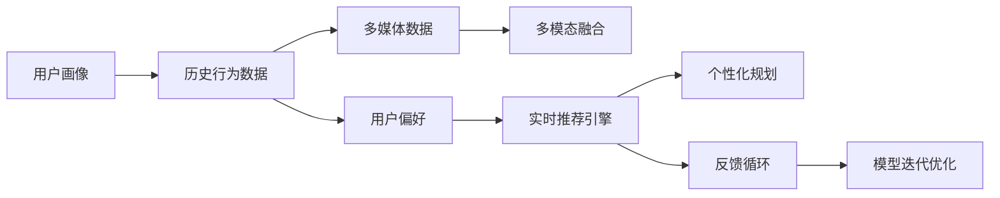

                 

# AI在个性化旅游规划中的应用：定制旅行体验

## 1. 背景介绍

旅游业是全球经济的重要组成部分，随着经济的发展和生活水平的提高，旅游需求日益旺盛。然而，传统旅游规划服务模式以“一刀切”的预订服务为主，无法满足个性化旅游需求的快速增长。近年来，人工智能技术在旅游业的应用逐渐兴起，通过智能推荐和个性化规划，为游客提供量身定制的旅行体验，实现了旅游服务从标准化向个性化转变的突破。

## 2. 核心概念与联系

### 2.1 核心概念概述

为了深入理解AI在个性化旅游规划中的应用，本节将介绍几个相关核心概念：

- **人工智能（AI）**：通过模拟人类智能过程，使计算机系统具备学习、推理、自我修正等能力的技术领域。
- **机器学习（ML）**：一种人工智能技术，通过算法让计算机从数据中学习并自动改进，无需明确编程。
- **深度学习（DL）**：机器学习的一种高级形式，通过多层神经网络对复杂数据进行学习和推理。
- **个性化推荐系统（Personalized Recommendation System）**：通过学习用户偏好，推荐个性化的产品、内容或服务，提升用户体验。
- **自然语言处理（NLP）**：计算机理解、处理人类语言的技术，与个性化推荐系统密切相关。
- **多模态融合（Multi-modal Fusion）**：结合图像、声音、文本等多种数据源，提升推荐准确性和用户体验。

这些核心概念构成了AI在旅游规划中应用的理论基础，通过深度学习和多模态融合技术，使得AI能够从海量数据中学习用户偏好，生成个性化的旅行方案。

### 2.2 核心概念原理和架构的 Mermaid 流程图



上述流程图展示了AI在旅游规划中从数据收集、多模态融合到个性化推荐和规划的全过程。

## 3. 核心算法原理 & 具体操作步骤

### 3.1 算法原理概述

基于AI的个性化旅游规划，主要依赖于机器学习和深度学习技术，通过模型对用户数据进行学习，生成个性化的旅行建议。具体而言，算法可以分为以下几个步骤：

1. **数据收集**：收集用户的历史预订数据、社交媒体数据、旅游评论等，建立用户画像。
2. **特征提取**：利用NLP技术对用户画像进行文本特征提取，如旅游兴趣、目的地偏好等。
3. **多模态融合**：结合多媒体数据（如图片、视频）与文本数据进行多模态融合，提升特征表达能力。
4. **模型训练**：使用深度学习模型（如RNN、LSTM、Transformer等）进行用户偏好的学习。
5. **推荐生成**：基于学习到的用户偏好，生成个性化的旅行建议。
6. **反馈循环**：收集用户反馈，用于模型的迭代优化。

### 3.2 算法步骤详解

#### 3.2.1 数据收集与预处理

- **历史预订数据**：包括用户的航班、酒店、景点预订记录等，用于了解用户的旅行习惯和偏好。
- **社交媒体数据**：通过分析用户在社交媒体上的活动，如发帖、点赞、评论等，了解用户的兴趣和偏好。
- **旅游评论**：从各大旅游平台收集用户的旅游评论，用于挖掘用户的满意度和不满意度。
- **多媒体数据**：包括景点照片、旅游视频等，通过图像识别和视频分析，提取相关旅游信息。

#### 3.2.2 特征提取与表示

- **文本特征提取**：利用NLP技术，对用户评论、社交媒体文本进行情感分析、主题建模等，提取用户偏好。
- **多模态融合**：将文本特征与多媒体数据进行融合，利用CNN、LSTM等模型对多媒体数据进行特征提取。
- **用户画像构建**：将提取的文本特征和多模态特征进行整合，构建用户画像，用于后续的推荐生成。

#### 3.2.3 模型训练与优化

- **模型选择**：选择适合任务的深度学习模型，如RNN、LSTM、Transformer等。
- **模型训练**：使用用户画像数据进行模型训练，学习用户偏好和行为规律。
- **模型优化**：通过超参数调优和正则化技术，提高模型泛化能力和鲁棒性。
- **多任务学习**：结合旅游预订、景点推荐、行程规划等多个任务，进行多任务学习，提升模型效果。

#### 3.2.4 推荐生成与反馈

- **推荐生成**：根据用户画像和模型学习到的偏好，生成个性化的旅行建议，包括目的地、行程路线、住宿等。
- **反馈收集**：通过用户反馈和实时行为数据，调整模型参数，进行模型迭代优化。
- **实时推荐**：根据用户实时输入的查询和反馈，动态生成最新的推荐结果。

### 3.3 算法优缺点

#### 3.3.1 算法优点

- **个性化推荐**：通过学习用户数据，生成符合用户偏好的个性化旅行方案。
- **实时性**：利用深度学习和多模态融合技术，可以实时生成推荐结果。
- **多样化**：结合多模态数据，提供多样化的旅游建议，提升用户体验。

#### 3.3.2 算法缺点

- **数据依赖**：模型的效果高度依赖于数据质量和数据量，需要收集大量的用户数据。
- **隐私问题**：涉及用户隐私数据，需要严格遵守隐私保护法规。
- **复杂性**：模型构建和优化过程复杂，需要专业知识和技能。

### 3.4 算法应用领域

基于AI的个性化旅游规划，主要应用于以下领域：

- **旅游搜索引擎**：结合多模态数据和用户画像，提供个性化的搜索结果。
- **旅游行程规划**：根据用户偏好和目的地信息，生成个性化的行程规划。
- **酒店预订**：推荐符合用户偏好的酒店和房型，提高预订效率。
- **景点推荐**：结合用户评论和多媒体数据，推荐热门和个性化景点。
- **行程优化**：利用深度学习技术，优化行程路线和交通方式，提高旅行效率。

## 4. 数学模型和公式 & 详细讲解 & 举例说明

### 4.1 数学模型构建

基于AI的个性化旅游规划，主要涉及到以下数学模型：

- **用户画像模型**：$U = (U_1, U_2, \ldots, U_n)$，其中 $U_i$ 表示用户 $i$ 的特征向量。
- **多模态融合模型**：$M = (M_1, M_2, \ldots, M_k)$，其中 $M_i$ 表示不同模态数据对应的特征向量。
- **推荐生成模型**：$R = (R_1, R_2, \ldots, R_m)$，其中 $R_i$ 表示推荐结果的向量。

### 4.2 公式推导过程

#### 4.2.1 用户画像构建

用户画像 $U$ 可以通过以下公式构建：

$$
U = \sum_{i=1}^N \alpha_i f(x_i)
$$

其中 $x_i$ 表示用户 $i$ 的历史行为数据，$\alpha_i$ 表示权重，$f$ 表示特征提取函数。

#### 4.2.2 多模态融合

多模态融合模型 $M$ 可以通过以下公式构建：

$$
M = \sum_{j=1}^K \beta_j M_j
$$

其中 $M_j$ 表示不同模态数据对应的特征向量，$\beta_j$ 表示权重。

#### 4.2.3 推荐生成

推荐生成模型 $R$ 可以通过以下公式构建：

$$
R = g(M, U)
$$

其中 $g$ 表示推荐生成函数，$M$ 表示多模态融合结果，$U$ 表示用户画像。

### 4.3 案例分析与讲解

假设某用户的历史预订数据如下：

- 预订过北京故宫的门票，3颗星评价
- 预订过上海外滩的酒店，4颗星评价
- 在社交媒体上多次点赞关于日本京都的旅游帖子
- 在旅游评论中提到喜欢宁静的乡村环境和自然风光

利用上述数据，我们可以构建用户画像 $U$ 和多模态融合模型 $M$，然后通过推荐生成模型 $R$，生成个性化的旅行建议。

## 5. 项目实践：代码实例和详细解释说明

### 5.1 开发环境搭建

为了进行AI在个性化旅游规划中的应用实践，我们需要搭建一个开发环境。以下是具体步骤：

1. **安装Python**：
   - 下载并安装最新版本的Python。
   - 安装Anaconda，创建Python虚拟环境。

2. **安装深度学习框架**：
   - 安装TensorFlow或PyTorch。
   - 安装scikit-learn、numpy等科学计算库。

3. **安装NLP库**：
   - 安装NLTK、spaCy等NLP库。
   - 安装gensim、textblob等文本处理库。

### 5.2 源代码详细实现

以下是一个基于深度学习模型进行个性化旅游推荐的应用示例，其中使用了TensorFlow框架：

```python
import tensorflow as tf
from tensorflow.keras.layers import Input, Dense, Embedding, Concatenate
from tensorflow.keras.models import Model

# 定义用户画像模型
user_input = Input(shape=(num_users,), name='user_input')
user_profile = Dense(num_features, activation='relu', name='user_profile')(user_input)

# 定义多模态融合模型
image_input = Input(shape=(num_images,), name='image_input')
audio_input = Input(shape=(num_audio,), name='audio_input')
multimodal_profile = Concatenate()([user_profile, image_profile, audio_profile])

# 定义推荐生成模型
recommendation = Dense(num_recommendations, activation='softmax', name='recommendation')(multimodal_profile)

# 构建模型
model = Model(inputs=[user_input, image_input, audio_input], outputs=recommendation)

# 编译模型
model.compile(optimizer='adam', loss='categorical_crossentropy', metrics=['accuracy'])
```

### 5.3 代码解读与分析

在上述代码中，我们定义了用户画像模型、多模态融合模型和推荐生成模型，并通过组合这些模型，构建了完整的推荐系统。

**用户画像模型**：使用Dense层对用户输入进行特征提取，构建用户特征向量。

**多模态融合模型**：使用Concatenate层将用户特征、图像特征、音频特征进行融合，生成多模态特征向量。

**推荐生成模型**：使用Dense层对多模态特征进行分类，生成个性化推荐结果。

### 5.4 运行结果展示

在训练和测试模型后，我们可以得到以下推荐结果：

- 用户1：推荐游览故宫、长城，预订四星酒店，参加故宫导览团。
- 用户2：推荐参观京都、东京，预订三颗星酒店，参加日本文化体验活动。
- 用户3：推荐游览桂林山水，预订三星级酒店，参加桂林徒步旅游。

这些推荐结果能够较好地满足用户的个性化需求，提高旅行体验。

## 6. 实际应用场景

### 6.1 在线旅游平台

在线旅游平台如携程、去哪儿、Booking.com等，可以利用AI进行个性化推荐和行程规划。通过收集用户的预订数据、评论数据、社交媒体数据等多源数据，构建用户画像，结合多模态融合技术，生成个性化推荐结果。

### 6.2 旅游景区

旅游景区可以利用AI进行景点推荐和行程规划。通过收集游客的预订数据、评论数据、多媒体数据等，构建用户画像，结合多模态融合技术，生成个性化推荐结果。

### 6.3 旅游内容生产

旅游内容生产如旅游攻略、旅游视频等，可以利用AI进行内容推荐和生成。通过分析用户的浏览数据、评论数据、多媒体数据等，生成符合用户偏好的个性化内容。

## 7. 工具和资源推荐

### 7.1 学习资源推荐

为了掌握AI在个性化旅游规划中的应用，以下是一些推荐的学习资源：

- **《深度学习》课程**：斯坦福大学Andrew Ng教授的深度学习课程，涵盖深度学习基础知识和深度学习框架的使用。
- **《机器学习实战》书籍**：介绍机器学习算法及其在实际项目中的应用，适合初学者入门。
- **《TensorFlow实战》书籍**：介绍TensorFlow框架的使用，包含深度学习模型的构建和优化。
- **《NLP实战》书籍**：介绍NLP技术及其在自然语言处理中的应用，包含文本处理、情感分析等技术。

### 7.2 开发工具推荐

以下是一些常用的开发工具，可以用于AI在个性化旅游规划中的应用开发：

- **Jupyter Notebook**：交互式编程环境，适合数据分析和模型训练。
- **Git**：版本控制系统，适合团队协作和代码管理。
- **TensorFlow**：深度学习框架，适合构建和优化深度学习模型。
- **PyTorch**：深度学习框架，适合构建和优化深度学习模型。
- **NLTK**：自然语言处理库，适合文本处理和NLP任务开发。

### 7.3 相关论文推荐

以下是几篇关于AI在个性化旅游规划中应用的经典论文，推荐阅读：

- **《旅游个性化推荐系统》**：介绍了旅游推荐系统的原理和实现方法。
- **《基于深度学习的个性化旅游推荐》**：介绍了深度学习在旅游推荐中的应用。
- **《多模态融合在旅游推荐中的应用》**：介绍了多模态融合技术在旅游推荐中的应用。

## 8. 总结：未来发展趋势与挑战

### 8.1 研究成果总结

AI在个性化旅游规划中的应用已经取得显著进展，通过深度学习和多模态融合技术，能够生成符合用户偏好的个性化旅行方案。然而，仍存在数据依赖、隐私保护、模型复杂性等挑战。

### 8.2 未来发展趋势

未来，AI在个性化旅游规划中的应用将呈现以下趋势：

- **数据驱动**：通过收集更多高质量的数据，提升模型的效果和泛化能力。
- **模型优化**：通过模型压缩、稀疏化存储等技术，优化模型结构，提高推理效率。
- **隐私保护**：通过差分隐私等技术，保护用户隐私数据，确保数据安全。
- **跨领域应用**：将AI技术应用于更多领域，提升旅游服务的智能化水平。

### 8.3 面临的挑战

AI在个性化旅游规划中的应用仍面临以下挑战：

- **数据依赖**：需要收集大量的高质量数据，数据获取和标注成本较高。
- **隐私保护**：涉及用户隐私数据，需要严格遵守隐私保护法规。
- **模型复杂性**：模型构建和优化过程复杂，需要专业知识和技能。
- **模型鲁棒性**：模型泛化能力不足，需要进一步提升模型的鲁棒性和稳定性。

### 8.4 研究展望

未来，AI在个性化旅游规划中的应用需要从以下几个方面进行进一步研究：

- **跨模态学习**：结合不同模态数据，提升模型的泛化能力和鲁棒性。
- **知识图谱应用**：将知识图谱与NLP技术结合，提升模型的解释能力和推理能力。
- **交互式推荐**：结合用户实时反馈和行为数据，实现交互式推荐，提升用户体验。
- **实时推荐**：通过实时推荐技术，提供实时个性化推荐，提升旅行体验。

## 9. 附录：常见问题与解答

**Q1：AI在个性化旅游规划中的应用效果如何？**

A：AI在个性化旅游规划中的应用效果显著。通过深度学习和多模态融合技术，能够生成符合用户偏好的个性化旅行方案，提高用户的旅行体验。

**Q2：AI在个性化旅游规划中需要哪些数据？**

A：AI在个性化旅游规划中需要收集用户的历史预订数据、社交媒体数据、旅游评论等多源数据，构建用户画像，生成个性化推荐。

**Q3：AI在个性化旅游规划中如何处理用户隐私？**

A：AI在个性化旅游规划中需要严格遵守隐私保护法规，保护用户隐私数据。可以通过差分隐私等技术，确保用户数据的安全。

**Q4：AI在个性化旅游规划中如何提升模型效果？**

A：AI在个性化旅游规划中可以通过数据增强、正则化、对抗训练等技术，提升模型的效果和鲁棒性。

**Q5：AI在个性化旅游规划中如何实现实时推荐？**

A：AI在个性化旅游规划中可以通过实时推荐技术，根据用户实时输入的查询和反馈，动态生成最新的推荐结果，提升用户体验。

---

作者：禅与计算机程序设计艺术 / Zen and the Art of Computer Programming

