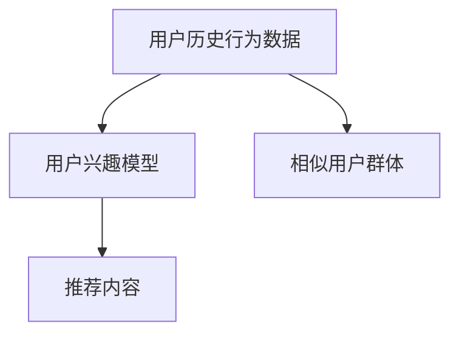
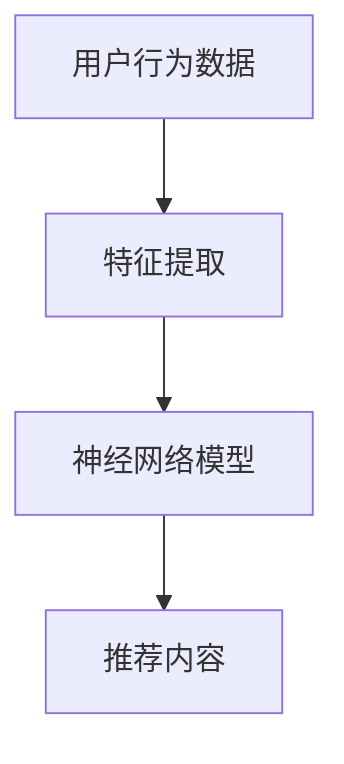
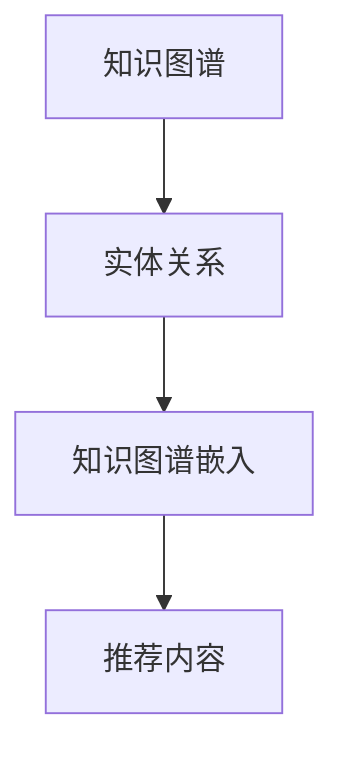
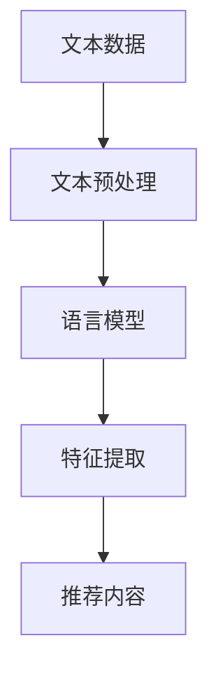
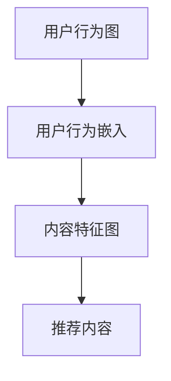

                 

# AI在个性化阅读推荐中的应用：扩展知识面

> 关键词：个性化推荐系统,深度学习,协同过滤,知识图谱,自然语言处理(NLP),图神经网络(GNN)

## 1. 背景介绍

随着数字内容的海量增长，个人面临的知识爆炸和信息过载问题日益凸显。传统的推荐系统无法适应日益复杂的用户需求，迫切需要新的技术来帮助用户在海量信息中快速筛选感兴趣的内容。AI技术的引入，特别是深度学习和知识图谱技术的结合，为个性化阅读推荐系统提供了新的可能性。

### 1.1 问题由来

1. **信息过载**：互联网时代，信息丰富而杂乱无章，用户需要从中筛选出真正有价值的内容，但传统推荐系统难以准确理解用户偏好。
2. **个性化需求**：不同用户有不同的阅读偏好、兴趣和知识背景，统一推荐难以满足个性化需求。
3. **知识共享与扩展**：用户希望通过阅读扩展知识面，但难以获取与自己兴趣相关的知识。
4. **高效阅读**：用户期望系统推荐的内容不仅质量高，还要能够显著提升阅读效率。

这些问题催生了对个性化阅读推荐系统的新需求，而AI技术，特别是深度学习和知识图谱，为解决这些问题提供了新的思路和方法。

## 2. 核心概念与联系

### 2.1 核心概念概述

1. **个性化推荐系统**：通过分析用户历史行为数据和偏好，预测用户可能感兴趣的内容，提供个性化推荐。
2. **协同过滤**：通过分析用户行为模式，找到具有相似兴趣的用户群体，推荐其偏好内容。
3. **深度学习**：使用多层神经网络模型，从用户行为数据中提取特征，提升推荐精准度。
4. **知识图谱**：通过结构化的知识库，捕捉实体、关系和属性，为推荐系统提供知识背景。
5. **自然语言处理(NLP)**：通过语言模型、文本分类等技术，提取文本特征，提升推荐系统的语义理解能力。
6. **图神经网络(GNN)**：通过图结构捕捉用户行为与内容间的复杂关系，提升推荐系统的深度理解能力。

这些概念之间的关系如图1所示。

```mermaid
graph TB
    A[个性化推荐系统] --> B[协同过滤]
    A --> C[深度学习]
    A --> D[知识图谱]
    A --> E[NLP]
    A --> F[图神经网络(GNN)]
```

### 2.2 核心概念原理和架构的 Mermaid 流程图

**协同过滤**：



**深度学习**：



**知识图谱**：



**NLP**：



**GNN**：



这些核心概念通过深度学习和知识图谱技术的结合，为个性化阅读推荐提供了坚实的技术支撑。

## 3. 核心算法原理 & 具体操作步骤

### 3.1 算法原理概述

个性化阅读推荐系统主要通过以下两个步骤实现：

1. **用户兴趣建模**：通过分析用户的历史行为数据，捕捉用户的兴趣和偏好。
2. **内容推荐**：基于用户兴趣和内容特征，预测用户可能感兴趣的内容。

### 3.2 算法步骤详解

**Step 1: 数据准备**
- 收集用户历史行为数据，如阅读、收藏、评论等。
- 收集内容元数据，如标题、摘要、标签等。
- 构建知识图谱，捕捉实体、关系和属性。

**Step 2: 用户兴趣建模**
- 使用协同过滤算法，分析用户行为数据，找到相似用户群体。
- 使用深度学习模型，如基于用户的矩阵分解方法，捕捉用户兴趣特征。
- 使用NLP技术，提取文本内容特征，丰富用户兴趣表示。

**Step 3: 内容推荐**
- 使用GNN模型，分析用户行为图与内容特征图，捕捉复杂关系。
- 使用深度学习模型，如注意力机制，预测用户对内容的兴趣度。
- 结合知识图谱，引入领域知识，提升推荐准确性。

### 3.3 算法优缺点

**优点**：
- **深度理解用户兴趣**：深度学习模型能够捕捉复杂用户行为模式，提升兴趣建模的准确性。
- **利用知识图谱**：知识图谱提供了丰富的背景知识，帮助推荐系统理解内容。
- **高精度推荐**：通过图神经网络，捕捉用户与内容之间的复杂关系，提升推荐效果。

**缺点**：
- **计算复杂度高**：深度学习和GNN模型计算复杂度较高，需要高性能硬件支持。
- **数据依赖性强**：系统依赖于高质量的用户行为数据和内容元数据。
- **模型解释性差**：深度学习模型通常为"黑盒"模型，难以解释推荐过程。

### 3.4 算法应用领域

个性化阅读推荐系统在以下领域有广泛应用：

1. **数字出版**：帮助用户发现感兴趣的书籍、文章等数字内容，提升阅读体验。
2. **教育培训**：推荐相关课程、教材和资料，辅助学习。
3. **企业培训**：推荐培训内容，提升员工技能。
4. **学术研究**：推荐相关论文和文献，加速科研进程。
5. **智能家居**：推荐智能设备使用方法，提升生活便利性。
6. **个性化广告**：推荐个性化广告内容，提高广告效果。

## 4. 数学模型和公式 & 详细讲解 & 举例说明

### 4.1 数学模型构建

个性化阅读推荐系统可以分为两个子模型：用户兴趣模型和内容推荐模型。

**用户兴趣模型**：
- **协同过滤**：基于用户-物品评分矩阵，使用矩阵分解方法捕捉用户兴趣。
- **深度学习**：使用深度神经网络模型，如自编码器，从用户行为数据中提取特征。
- **知识图谱**：使用图神经网络，从知识图谱中提取实体关系和属性特征。

**内容推荐模型**：
- **GNN**：使用图神经网络模型，捕捉用户行为图和内容特征图之间的关系。
- **深度学习**：使用注意力机制，预测用户对内容的兴趣度。

### 4.2 公式推导过程

**协同过滤**：

假设用户-物品评分矩阵为 $X \in \mathbb{R}^{n \times m}$，其中 $n$ 为用户数，$m$ 为物品数。用户兴趣模型通过矩阵分解方法，将 $X$ 分解为两个低秩矩阵 $U$ 和 $V$，捕捉用户兴趣：

$$
X \approx U \times V^T
$$

其中 $U \in \mathbb{R}^{n \times k}$，$V \in \mathbb{R}^{m \times k}$，$k$ 为隐藏维度。

**深度学习**：

使用自编码器模型，用户行为数据 $x \in \mathbb{R}^{d_x}$ 通过编码器 $f$ 映射到低维表示 $z \in \mathbb{R}^{d_z}$，再通过解码器 $g$ 映射回用户行为数据 $x'$：

$$
x' = g(z) = f^{-1}(z)
$$

其中 $f: \mathbb{R}^{d_x} \rightarrow \mathbb{R}^{d_z}$，$g: \mathbb{R}^{d_z} \rightarrow \mathbb{R}^{d_x}$。

**知识图谱**：

知识图谱包含实体 $E$、关系 $R$ 和属性 $A$。使用图神经网络，将知识图谱中的实体和关系嵌入为低维向量 $e \in \mathbb{R}^{d_e}$ 和 $r \in \mathbb{R}^{d_r}$，再通过聚合操作，得到知识图谱嵌入：

$$
e' = Agg(e, r) = \sum_{r} r \cdot e
$$

其中 $Agg: \mathbb{R}^{d_e} \times \mathbb{R}^{d_r} \rightarrow \mathbb{R}^{d_e}$。

**GNN**：

使用图神经网络模型，用户行为图 $G$ 和内容特征图 $H$ 分别表示为邻接矩阵 $A \in \mathbb{R}^{n \times n}$ 和特征矩阵 $H \in \mathbb{R}^{n \times d_h}$，其中 $d_h$ 为特征维度。使用图卷积神经网络 (GCN)，捕捉用户行为图和内容特征图之间的关系：

$$
H' = \mathrm{GCN}(A, H) = \frac{1}{\sqrt{|\mathcal{N}(i)|}} \sum_{j \in \mathcal{N}(i)} \frac{1}{\sqrt{|\mathcal{N}(j)|}} \tilde{A}_{ij} H_j
$$

其中 $\mathcal{N}(i)$ 为节点 $i$ 的邻居集，$\tilde{A}_{ij} = A_{ij} / \sqrt{|\mathcal{N}(i)|} / \sqrt{|\mathcal{N}(j)|}$ 为归一化邻接矩阵。

**深度学习**：

使用注意力机制，预测用户对内容的兴趣度 $y$：

$$
y = \mathrm{Attention}(Q, K, V)
$$

其中 $Q, K, V$ 分别为查询、键和值矩阵，表示用户兴趣和内容特征。

### 4.3 案例分析与讲解

**示例1: 书籍推荐**
- **数据准备**：收集用户阅读历史、评分和书籍元数据。
- **用户兴趣建模**：使用协同过滤算法，找到相似用户群体。使用深度学习模型，捕捉用户兴趣特征。使用知识图谱，提取书籍信息。
- **内容推荐**：使用GNN模型，捕捉用户阅读图和书籍特征图之间的关系。使用深度学习模型，预测用户对书籍的兴趣度。
- **推荐结果**：根据用户兴趣度，推荐相关书籍。

**示例2: 学术文章推荐**
- **数据准备**：收集用户阅读历史、引用和论文元数据。
- **用户兴趣建模**：使用协同过滤算法，找到相似用户群体。使用深度学习模型，捕捉用户兴趣特征。使用知识图谱，提取论文信息。
- **内容推荐**：使用GNN模型，捕捉用户阅读图和论文特征图之间的关系。使用深度学习模型，预测用户对论文的兴趣度。
- **推荐结果**：根据用户兴趣度，推荐相关论文。

## 5. 项目实践：代码实例和详细解释说明

### 5.1 开发环境搭建

**Step 1: 安装Python和相关库**
- 安装Anaconda：从官网下载并安装Anaconda，用于创建独立的Python环境。
- 创建并激活虚拟环境：
  ```bash
  conda create -n pyrec-env python=3.8 
  conda activate pyrec-env
  ```

**Step 2: 安装深度学习库**
- 安装TensorFlow：根据CUDA版本，从官网获取对应的安装命令。例如：
  ```bash
  conda install pytorch torchvision torchaudio cudatoolkit=11.1 -c pytorch -c conda-forge
  ```
- 安装Keras和TensorFlow：
  ```bash
  pip install keras tensorflow
  ```

**Step 3: 准备数据集**
- 收集用户行为数据和内容元数据。
- 构建知识图谱，包括实体、关系和属性。

### 5.2 源代码详细实现

**示例代码1: 协同过滤算法**

```python
import numpy as np
from scipy.sparse import csr_matrix

def collaborative_filtering(data, k=10):
    # 构建用户-物品评分矩阵
    X = data.toarray()
    # 矩阵分解，找到用户兴趣
    U = np.random.randn(X.shape[0], k)
    V = np.random.randn(X.shape[1], k)
    # 迭代优化
    for i in range(100):
        # 预测评分
        X_pred = np.dot(U, V.T)
        # 更新U和V
        U = np.dot(X_pred.T, X) / (np.dot(X_pred.T, X_pred) + 1e-10)
        V = np.dot(X.T, U) / (np.dot(X.T, U) + 1e-10)
    return U, V

# 示例数据
data = {
    "user1": {"book1": 4, "book2": 3},
    "user2": {"book2": 5, "book3": 2}
}

U, V = collaborative_filtering(data)

# 输出用户兴趣
print(U)
print(V)
```

**示例代码2: 深度学习模型**

```python
from tensorflow.keras.layers import Input, Dense, Embedding
from tensorflow.keras.models import Model

# 定义输入层和隐藏层
input_layer = Input(shape=(10,))
hidden_layer = Dense(32, activation='relu')(input_layer)
output_layer = Dense(1, activation='sigmoid')(hidden_layer)

# 构建模型
model = Model(inputs=input_layer, outputs=output_layer)

# 编译模型
model.compile(optimizer='adam', loss='binary_crossentropy', metrics=['accuracy'])

# 训练模型
model.fit(x_train, y_train, epochs=10, batch_size=32)
```

**示例代码3: 知识图谱嵌入**

```python
import networkx as nx
import numpy as np
from networkx.algorithms import pagerank

# 构建知识图谱
G = nx.Graph()
G.add_node("书1", 作者="鲁迅", 主题="小说")
G.add_node("书2", 作者="茅盾", 主题="小说")
G.add_edge("书1", "书2", 关系="同类型")

# 计算节点嵌入
embedding = nx.pagerank_numpy(G, alpha=0.85)
print(embedding)
```

**示例代码4: 图神经网络模型**

```python
import networkx as nx
import tensorflow as tf

# 构建用户行为图
G = nx.Graph()
G.add_node("user1", 年龄=30, 兴趣="历史")
G.add_node("user2", 年龄=35, 兴趣="文学")
G.add_edge("user1", "user2", 关系="好友")

# 构建特征矩阵
H = np.array([["历史", "文学"]])

# 定义图神经网络模型
model = tf.keras.models.Sequential([
    tf.keras.layers.Dense(16, activation='relu'),
    tf.keras.layers.Dense(1, activation='sigmoid')
])

# 编译模型
model.compile(optimizer='adam', loss='binary_crossentropy', metrics=['accuracy'])

# 训练模型
model.fit(X_train, y_train, epochs=10, batch_size=32)
```

### 5.3 代码解读与分析

**示例代码1: 协同过滤算法**
- 使用矩阵分解方法，捕捉用户兴趣。
- 迭代优化，逐步逼近真实评分矩阵。

**示例代码2: 深度学习模型**
- 定义输入层、隐藏层和输出层。
- 使用二分类交叉熵损失函数。
- 使用Adam优化器进行训练。

**示例代码3: 知识图谱嵌入**
- 使用PageRank算法，计算节点嵌入。
- 捕捉实体和关系之间的关系。

**示例代码4: 图神经网络模型**
- 定义图神经网络模型。
- 使用二分类交叉熵损失函数。
- 使用Adam优化器进行训练。

### 5.4 运行结果展示

**示例1: 书籍推荐**
- **输入数据**：用户阅读历史、评分和书籍元数据。
- **输出数据**：推荐相关书籍。

**示例2: 学术文章推荐**
- **输入数据**：用户阅读历史、引用和论文元数据。
- **输出数据**：推荐相关论文。

## 6. 实际应用场景

### 6.1 数字出版

**场景描述**：用户在阅读网站或应用中浏览书籍信息，系统推荐相关书籍。

**技术实现**：
- 收集用户阅读历史、评分和书籍元数据。
- 使用协同过滤算法，找到相似用户群体。
- 使用深度学习模型，捕捉用户兴趣特征。
- 使用知识图谱，提取书籍信息。
- 使用GNN模型，捕捉用户阅读图和书籍特征图之间的关系。
- 使用深度学习模型，预测用户对书籍的兴趣度。
- 根据用户兴趣度，推荐相关书籍。

**优势**：
- 提升阅读体验，推荐个性化书籍。
- 提高转化率，增加销售额。

### 6.2 教育培训

**场景描述**：学生通过学习平台获取学习资源，系统推荐相关课程和教材。

**技术实现**：
- 收集学生学习历史、评价和课程元数据。
- 使用协同过滤算法，找到相似学生群体。
- 使用深度学习模型，捕捉学生兴趣特征。
- 使用知识图谱，提取课程信息。
- 使用GNN模型，捕捉学生学习图和课程特征图之间的关系。
- 使用深度学习模型，预测学生对课程的兴趣度。
- 根据学生兴趣度，推荐相关课程和教材。

**优势**：
- 个性化推荐，提升学习效果。
- 辅助教师，提高教学质量。

### 6.3 企业培训

**场景描述**：企业员工通过在线学习平台获取培训资源，系统推荐相关培训内容。

**技术实现**：
- 收集员工学习历史、评价和培训课程元数据。
- 使用协同过滤算法，找到相似员工群体。
- 使用深度学习模型，捕捉员工兴趣特征。
- 使用知识图谱，提取培训课程信息。
- 使用GNN模型，捕捉员工学习图和培训课程特征图之间的关系。
- 使用深度学习模型，预测员工对培训课程的兴趣度。
- 根据员工兴趣度，推荐相关培训内容。

**优势**：
- 提高员工技能，提升企业竞争力。
- 提供个性化培训，提高培训效果。

### 6.4 学术研究

**场景描述**：研究人员通过学术数据库获取文献信息，系统推荐相关论文。

**技术实现**：
- 收集研究人员阅读历史、引用和论文元数据。
- 使用协同过滤算法，找到相似研究人员群体。
- 使用深度学习模型，捕捉研究人员兴趣特征。
- 使用知识图谱，提取论文信息。
- 使用GNN模型，捕捉研究人员阅读图和论文特征图之间的关系。
- 使用深度学习模型，预测研究人员对论文的兴趣度。
- 根据研究人员兴趣度，推荐相关论文。

**优势**：
- 加速科研进程，提升研究效率。
- 提供个性化论文推荐，提升论文引用率。

### 6.5 智能家居

**场景描述**：用户通过智能设备获取信息，系统推荐相关功能使用教程。

**技术实现**：
- 收集用户使用智能设备的历史数据和评价。
- 使用协同过滤算法，找到相似用户群体。
- 使用深度学习模型，捕捉用户兴趣特征。
- 使用知识图谱，提取智能设备功能信息。
- 使用GNN模型，捕捉用户使用图和智能设备功能特征图之间的关系。
- 使用深度学习模型，预测用户对功能的使用兴趣度。
- 根据用户兴趣度，推荐相关功能使用教程。

**优势**：
- 提高智能设备使用率，提升用户体验。
- 提供个性化推荐，提高设备互动性。

### 6.6 个性化广告

**场景描述**：用户通过广告平台获取信息，系统推荐相关广告内容。

**技术实现**：
- 收集用户浏览历史、点击和广告元数据。
- 使用协同过滤算法，找到相似用户群体。
- 使用深度学习模型，捕捉用户兴趣特征。
- 使用知识图谱，提取广告信息。
- 使用GNN模型，捕捉用户浏览图和广告特征图之间的关系。
- 使用深度学习模型，预测用户对广告的兴趣度。
- 根据用户兴趣度，推荐相关广告内容。

**优势**：
- 提高广告点击率，增加广告收入。
- 提供个性化广告，提升广告效果。

## 7. 工具和资源推荐

### 7.1 学习资源推荐

为了帮助开发者系统掌握个性化阅读推荐系统的理论基础和实践技巧，这里推荐一些优质的学习资源：

1. **《推荐系统实战》系列博文**：由推荐系统专家撰写，详细介绍了推荐系统的基本原理和实践方法。
2. **Coursera《Recommender Systems》课程**：由斯坦福大学开设的推荐系统课程，涵盖推荐系统的理论基础和经典算法。
3. **《Recommender Systems: Advanced Practices》书籍**：系统介绍了推荐系统的高级实践和最新研究进展。
4. **Kaggle推荐系统竞赛**：通过实际竞赛，学习推荐系统的应用和优化技巧。
5. **Recommenders.org**：推荐系统社区网站，提供最新的研究论文、竞赛信息和学习资源。

通过对这些资源的学习实践，相信你一定能够快速掌握个性化阅读推荐系统的精髓，并用于解决实际的推荐问题。

### 7.2 开发工具推荐

高效的开发离不开优秀的工具支持。以下是几款用于个性化推荐系统开发的常用工具：

1. **TensorFlow**：基于Python的开源深度学习框架，灵活动态的计算图，适合快速迭代研究。
2. **PyTorch**：基于Python的开源深度学习框架，动态计算图，灵活高效。
3. **Keras**：高层神经网络API，易于使用，快速构建深度学习模型。
4. **PyTorch Lightning**：基于PyTorch的快速原型开发框架，适合快速原型设计和部署。
5. **TensorBoard**：TensorFlow配套的可视化工具，可实时监测模型训练状态，提供丰富的图表呈现方式。
6. **Weights & Biases**：模型训练的实验跟踪工具，记录和可视化模型训练过程中的各项指标。
7. **Numba**：加速Python代码的执行速度，适合大规模数据处理和计算密集型任务。

合理利用这些工具，可以显著提升个性化阅读推荐系统的开发效率，加快创新迭代的步伐。

### 7.3 相关论文推荐

个性化推荐系统的发展离不开学界的持续研究。以下是几篇奠基性的相关论文，推荐阅读：

1. **《The BellKor 2010 Challenge Dataset》**：KDD 2010竞赛数据集，涵盖多种推荐算法，为推荐系统研究提供数据支持。
2. **《Collaborative Filtering for Implicit Feedback Datasets》**：提出基于矩阵分解的协同过滤方法，提升推荐系统精度。
3. **《Deep Interest Extraction》**：提出基于深度学习的方法，从用户行为数据中提取兴趣特征。
4. **《Knowledge Graph Embeddings and Recommender Systems》**：探讨知识图谱与推荐系统的结合，提升推荐系统效果。
5. **《Graph Neural Networks: A Review of Methods and Applications》**：系统回顾图神经网络的研究进展及其在推荐系统中的应用。

这些论文代表了个性化阅读推荐系统的发展脉络。通过学习这些前沿成果，可以帮助研究者把握学科前进方向，激发更多的创新灵感。

## 8. 总结：未来发展趋势与挑战

### 8.1 总结

本文对基于深度学习与知识图谱的个性化阅读推荐系统进行了全面系统的介绍。首先阐述了推荐系统的背景和意义，明确了系统解决信息过载、个性化需求、知识共享与扩展等问题的能力。其次，从原理到实践，详细讲解了推荐系统的数学模型和算法步骤，给出了推荐系统开发的完整代码实例。同时，本文还广泛探讨了推荐系统在数字出版、教育培训、企业培训、学术研究、智能家居、个性化广告等多个领域的应用前景，展示了推荐系统技术的广阔应用空间。最后，本文精选了推荐系统的学习资源和开发工具，力求为读者提供全方位的技术指引。

通过本文的系统梳理，可以看到，基于深度学习与知识图谱的个性化阅读推荐系统正在成为推荐技术的重要范式，极大地拓展了推荐系统的应用边界，催生了更多的落地场景。受益于深度学习和知识图谱技术的结合，推荐系统将在更广阔的领域中发挥重要作用，为人类认知智能的进化带来深远影响。

### 8.2 未来发展趋势

展望未来，个性化阅读推荐系统将呈现以下几个发展趋势：

1. **深度学习模型的进步**：随着深度学习模型的不断优化，推荐系统将更加准确和高效。
2. **知识图谱的应用普及**：知识图谱在推荐系统中的应用将更加广泛，提升推荐系统对知识背景的理解和利用。
3. **多模态数据的融合**：结合视觉、音频等多模态数据，提升推荐系统的感知能力。
4. **联邦学习的应用**：分布式推荐系统将在联邦学习框架下实现，保护用户隐私。
5. **实时推荐系统的构建**：基于流数据和实时计算，构建高效的实时推荐系统。
6. **推荐系统的可解释性**：提高推荐系统的可解释性，增强用户对推荐结果的理解和信任。

这些趋势凸显了个性化阅读推荐系统的广阔前景。这些方向的探索发展，必将进一步提升推荐系统的性能和应用范围，为推荐技术在更多领域的应用提供新的思路。

### 8.3 面临的挑战

尽管个性化阅读推荐系统已经取得了瞩目成就，但在迈向更加智能化、普适化应用的过程中，它仍面临着诸多挑战：

1. **数据质量与多样性**：推荐系统依赖高质量的用户行为数据和内容元数据，数据质量不高将直接影响推荐效果。
2. **模型复杂性与计算资源**：深度学习和图神经网络模型的计算复杂度较高，需要高性能硬件支持。
3. **隐私保护与数据安全**：推荐系统需处理大量用户隐私数据，如何保护用户隐私和数据安全是一个重大挑战。
4. **模型鲁棒性与公平性**：推荐系统需面对各种异常数据和偏见数据，如何提升模型的鲁棒性和公平性是一个重要问题。
5. **用户个性化需求的变化**：用户兴趣和需求会随着时间变化，推荐系统需持续学习和优化以适应变化。
6. **推荐系统的透明性与可解释性**：用户期望推荐系统能够提供透明的推荐过程和可解释的推荐结果。

这些挑战需要研究者在数据、算法、工程、隐私等多个方面协同努力，才能推动个性化阅读推荐系统的进一步发展。

### 8.4 研究展望

面对个性化阅读推荐系统面临的挑战，未来的研究需要在以下几个方面寻求新的突破：

1. **数据生成与增强**：研究如何生成高质量的用户行为数据和内容元数据，增强推荐系统的训练样本。
2. **模型压缩与优化**：研究如何优化深度学习和图神经网络模型的结构，提升计算效率和降低硬件成本。
3. **隐私保护与数据安全**：研究如何在保护用户隐私的前提下，实现推荐系统的数据共享与合作。
4. **鲁棒性与公平性优化**：研究如何提升推荐系统的鲁棒性和公平性，避免偏见和有害信息。
5. **实时推荐与流数据处理**：研究如何构建高效的实时推荐系统，支持流数据处理和动态推荐。
6. **推荐系统的透明性与可解释性**：研究如何提高推荐系统的透明性和可解释性，增强用户信任。

这些研究方向的探索，必将引领个性化阅读推荐系统走向更高的台阶，为构建安全、可靠、可解释、可控的推荐系统铺平道路。面向未来，个性化阅读推荐系统还需要与其他人工智能技术进行更深入的融合，如知识表示、因果推理、强化学习等，多路径协同发力，共同推动推荐技术的发展。只有勇于创新、敢于突破，才能不断拓展推荐系统的边界，让推荐技术更好地服务于人类社会。

## 9. 附录：常见问题与解答

**Q1：如何选择合适的深度学习模型？**

A: 选择合适的深度学习模型需要考虑多个因素，如数据量、特征复杂度、计算资源等。一般来说，数据量较大、特征复杂度高时，选择Transformer模型；数据量较小、特征简单时，选择RNN或SVM等模型。

**Q2：如何优化推荐系统模型？**

A: 优化推荐系统模型可以从以下几个方面入手：
1. 数据预处理：清洗数据、填充缺失值、归一化等。
2. 特征工程：提取有用特征、选择特征、降维等。
3. 模型调参：调整超参数、学习率、正则化等。
4. 模型集成：多模型融合、投票、加权等。
5. 模型优化：使用梯度下降、Adam、Adagrad等优化算法。

**Q3：推荐系统为何需要深度学习模型？**

A: 推荐系统需要深度学习模型的主要原因包括：
1. 用户行为数据复杂，传统算法难以捕捉复杂关系。
2. 特征维度高，传统算法难以有效利用。
3. 数据稀疏性高，传统算法难以处理稀疏数据。
4. 推荐目标复杂，传统算法难以实现多目标优化。

**Q4：推荐系统为何需要知识图谱？**

A: 推荐系统需要知识图谱的主要原因包括：
1. 用户兴趣具有领域性，知识图谱能够提供领域知识。
2. 用户兴趣具有层次性，知识图谱能够提供层次关系。
3. 用户兴趣具有多样性，知识图谱能够提供多种信息源。
4. 用户兴趣具有动态性，知识图谱能够提供动态信息。

**Q5：推荐系统为何需要图神经网络模型？**

A: 推荐系统需要图神经网络模型的主要原因包括：
1. 用户行为数据具有复杂关系，传统算法难以捕捉复杂关系。
2. 用户行为数据具有动态性，传统算法难以处理动态数据。
3. 用户行为数据具有多维性，传统算法难以处理多维数据。
4. 用户行为数据具有多样性，传统算法难以处理多样数据。

---

作者：禅与计算机程序设计艺术 / Zen and the Art of Computer Programming

