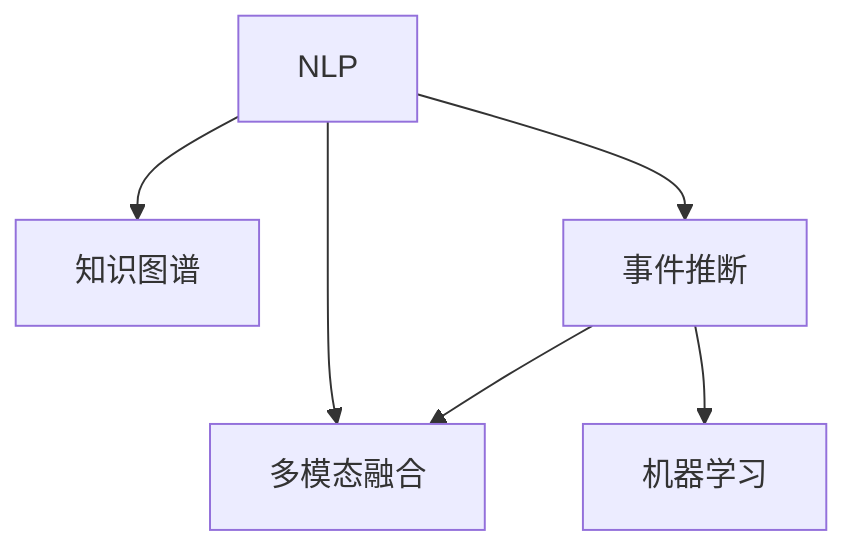

                 

## 1. 背景介绍

### 1.1 问题由来
在当今信息爆炸的时代，实时信息的更新与传播变得越来越重要。无论是新闻、股票、体育赛事还是社交媒体动态，实时信息都对我们的生活产生了深远的影响。然而，如何高效地获取、处理和传播这些信息，是一个复杂且极具挑战的问题。

传统的信息处理方式通常依赖于手动收集和整理，这不仅耗时费力，还容易出错。随着人工智能（AI）技术的发展，特别是深度学习技术在自然语言处理（NLP）领域的突破，实时信息更新的自动化和智能化成为可能。

### 1.2 问题核心关键点
实时信息更新的自动化主要依赖于AI技术，特别是自然语言处理（NLP）和机器学习（ML）的应用。其核心在于以下几个方面：

- **数据获取与预处理**：从各种数据源（如新闻网站、社交媒体、官方公告等）获取实时信息，并进行清洗、分词、实体识别等预处理。
- **语义理解与抽取**：利用NLP技术对文本进行语义理解，提取关键信息，如事件、时间、地点、人物等。
- **知识图谱构建与关联**：将提取的关键信息构建为知识图谱，进行实体间关联与推理。
- **事件推断与预测**：基于历史数据和当前信息，对未来事件进行推断与预测。
- **多模态融合**：将文本、图像、视频等多模态信息进行融合，提高信息处理的全面性与准确性。

这些核心技术相互协作，形成了一个复杂的自动化信息处理系统。

## 2. 核心概念与联系

### 2.1 核心概念概述

为了更好地理解AI在实时信息更新中的作用，本节将介绍几个关键概念及其联系：

- **自然语言处理（NLP）**：涉及计算机对人类语言信息的理解和处理，是实现AI在实时信息更新中的核心技术。
- **知识图谱（KG）**：将知识以图的形式存储和表示，用于支持信息抽取、实体关联、知识推理等。
- **事件推断（Event Recognition）**：识别和理解事件的发生与发展，涉及时间、地点、原因、结果等。
- **多模态信息融合（Multimodal Fusion）**：将文本、图像、视频等多源信息进行融合，提升信息处理的准确性和全面性。
- **机器学习（ML）**：利用算法和模型对数据进行训练和学习，提取特征并进行分类、回归、聚类等任务。

这些核心概念之间的关系可以通过以下Mermaid流程图来展示：



这个流程图展示了大语言模型的工作原理和各个模块之间的联系：

1. NLP用于文本处理，提取关键信息。
2. 知识图谱存储信息，支持实体关联和推理。
3. 事件推断识别事件，进行时间、地点、原因、结果的分析。
4. 多模态融合将不同类型的数据进行融合，提升处理能力。
5. 机器学习用于训练模型，提取特征并优化。

## 3. 核心算法原理 & 具体操作步骤
### 3.1 算法原理概述

基于AI的实时信息更新，核心在于对文本信息的语义理解和知识图谱的构建。其原理可以概括为以下几个步骤：

1. **数据获取与预处理**：从各种数据源获取实时信息，并进行清洗、分词、实体识别等预处理。
2. **语义理解与抽取**：利用NLP技术对文本进行语义理解，提取关键信息。
3. **知识图谱构建与关联**：将提取的关键信息构建为知识图谱，进行实体间关联与推理。
4. **事件推断与预测**：基于历史数据和当前信息，对未来事件进行推断与预测。
5. **多模态融合**：将文本、图像、视频等多模态信息进行融合，提高信息处理的全面性与准确性。

### 3.2 算法步骤详解

以下是详细的操作步骤：

**Step 1: 数据获取与预处理**
- 从不同数据源（如新闻网站、社交媒体、官方公告等）获取实时信息。
- 使用分词、去停用词、词性标注等技术对文本进行预处理。
- 利用实体识别模型识别出文本中的实体（如人名、地名、组织名等）。

**Step 2: 语义理解与抽取**
- 使用BERT、GPT等预训练模型对文本进行语义理解，提取关键信息。
- 使用NLP技术对文本进行实体抽取、事件识别、关系抽取等。

**Step 3: 知识图谱构建与关联**
- 将抽取出的实体和关系构建为知识图谱。
- 利用图谱算法进行实体间关联、推理与扩展。

**Step 4: 事件推断与预测**
- 基于历史数据和当前信息，使用机器学习模型进行事件推断。
- 利用时间序列预测、因果推理等方法对未来事件进行预测。

**Step 5: 多模态融合**
- 将文本、图像、视频等多模态信息进行融合，提升信息处理的全面性与准确性。
- 使用多模态融合算法对信息进行集成与优化。

### 3.3 算法优缺点

基于AI的实时信息更新具有以下优点：
1. 高效性：自动化的信息处理可以大大提高信息更新的速度。
2. 全面性：多模态融合使得信息处理更加全面和准确。
3. 可扩展性：可以根据需要动态调整算法和模型，支持大规模信息处理。

同时，也存在一些局限性：
1. 数据依赖性：模型的效果很大程度上依赖于数据质量和多样性。
2. 语言模型限制：当前模型在处理特定语言或领域时可能表现不佳。
3. 计算资源需求高：多模态融合和知识图谱构建等操作需要大量计算资源。
4. 实时性挑战：实时信息更新的准确性和时效性需要进一步优化。

### 3.4 算法应用领域

基于AI的实时信息更新技术，已经在诸多领域得到广泛应用，例如：

- **新闻业**：自动抓取和分析新闻事件，快速生成新闻报道。
- **金融市场**：实时监控股票、货币、商品等市场动态，提供精准分析与预测。
- **体育赛事**：自动分析比赛数据，提供实时比赛分析和预测。
- **社交媒体**：监控热门话题和舆情动态，支持用户互动与分析。
- **医疗健康**：实时监控疾病流行趋势，提供健康预警和建议。
- **交通管理**：实时分析交通流量，提供交通预测与调度建议。

此外，基于AI的实时信息更新技术还被应用于智能家居、智慧城市、智能客服等领域，为各行各业带来了新的智能化解决方案。

## 4. 数学模型和公式 & 详细讲解 & 举例说明

### 4.1 数学模型构建

本节将使用数学语言对AI在实时信息更新中的应用进行更加严格的刻画。

假设输入的文本信息为 $X$，模型输出的关键信息为 $Y$，则模型 $M$ 的损失函数可以表示为：

$$
L(M, X, Y) = \sum_{i=1}^N (Y_i - M(X_i))^2
$$

其中 $N$ 为样本数量。

### 4.2 公式推导过程

以事件推断为例，假设已知事件模板 $T$ 和事件发生的时间 $t$，模型 $M$ 推断事件是否发生，可以表示为：

$$
M(T, t) = \begin{cases}
1, & \text{事件发生} \\
0, & \text{事件不发生}
\end{cases}
$$

根据历史数据 $D$ 和当前时间 $t$，可以构建训练数据集 $\{(X_i, Y_i)\}_{i=1}^N$，其中 $X_i$ 为历史事件数据，$Y_i$ 为事件是否发生。

使用逻辑回归模型对事件进行推断，损失函数可以表示为：

$$
L(M, X, Y) = -\frac{1}{N} \sum_{i=1}^N [Y_i\log M(X_i) + (1-Y_i)\log (1-M(X_i))]
$$

利用梯度下降等优化算法，更新模型参数，最小化损失函数，从而实现事件推断。

### 4.3 案例分析与讲解

以下是一个简单的案例分析：

假设有一篇新闻报道标题为 "特斯拉公司发布新车型"，需要判断是否为真实事件。可以使用事件推断模型，将新闻文本输入模型 $M$，得到事件推断结果 $M(T, t)$。

具体步骤如下：

1. **数据预处理**：对新闻文本进行分词、去停用词、词性标注等预处理。
2. **特征提取**：使用BERT等预训练模型对文本进行语义理解，提取关键信息。
3. **事件推断**：根据历史事件数据和当前时间，使用逻辑回归模型进行事件推断。
4. **输出结果**：将推断结果 $M(T, t)$ 输出，判断事件是否真实发生。

## 5. 项目实践：代码实例和详细解释说明
### 5.1 开发环境搭建

在进行项目实践前，我们需要准备好开发环境。以下是使用Python进行PyTorch开发的环境配置流程：

1. 安装Anaconda：从官网下载并安装Anaconda，用于创建独立的Python环境。

2. 创建并激活虚拟环境：
```bash
conda create -n pytorch-env python=3.8 
conda activate pytorch-env
```

3. 安装PyTorch：根据CUDA版本，从官网获取对应的安装命令。例如：
```bash
conda install pytorch torchvision torchaudio cudatoolkit=11.1 -c pytorch -c conda-forge
```

4. 安装相关库：
```bash
pip install nltk spacy
```

5. 安装Transformer库：
```bash
pip install transformers
```

完成上述步骤后，即可在`pytorch-env`环境中开始项目实践。

### 5.2 源代码详细实现

这里我们以新闻业应用为例，给出使用PyTorch进行实时信息更新的代码实现。

首先，定义数据预处理函数：

```python
import nltk
import spacy

nltk.download('punkt')
spacy.load('en_core_web_sm')

def preprocess_text(text):
    # 分词
    words = nltk.word_tokenize(text)
    # 去停用词
    stopwords = set(spacy.load('en_core_web_sm').stop_words)
    words = [word for word in words if word.lower() not in stopwords]
    # 词性标注
    nlp = spacy.load('en_core_web_sm')
    pos_tags = [nlp(word).pos_ for word in words]
    return words, pos_tags
```

然后，定义模型和损失函数：

```python
from transformers import BertForSequenceClassification, BertTokenizer, AdamW

model = BertForSequenceClassification.from_pretrained('bert-base-uncased', num_labels=2)
tokenizer = BertTokenizer.from_pretrained('bert-base-uncased')
optimizer = AdamW(model.parameters(), lr=2e-5)

def calculate_loss(text, label):
    words, pos_tags = preprocess_text(text)
    inputs = tokenizer(words, return_tensors='pt')
    outputs = model(**inputs)
    loss = outputs.loss
    return loss
```

接着，定义训练和评估函数：

```python
from torch.utils.data import Dataset, DataLoader

class NewsDataset(Dataset):
    def __init__(self, texts, labels):
        self.texts = texts
        self.labels = labels
        self.tokenizer = tokenizer

    def __len__(self):
        return len(self.texts)
    
    def __getitem__(self, item):
        text = self.texts[item]
        label = self.labels[item]
        return {'input_ids': input_ids, 'attention_mask': attention_mask, 'labels': label}

# 定义训练集和测试集
train_dataset = NewsDataset(train_texts, train_labels)
dev_dataset = NewsDataset(dev_texts, dev_labels)
test_dataset = NewsDataset(test_texts, test_labels)

# 训练模型
for epoch in range(5):
    for batch in DataLoader(train_dataset, batch_size=16):
        input_ids = batch['input_ids'].to(device)
        attention_mask = batch['attention_mask'].to(device)
        label = batch['labels'].to(device)
        optimizer.zero_grad()
        loss = calculate_loss(text, label)
        loss.backward()
        optimizer.step()
        
# 评估模型
for batch in DataLoader(dev_dataset, batch_size=16):
    input_ids = batch['input_ids'].to(device)
    attention_mask = batch['attention_mask'].to(device)
    label = batch['labels'].to(device)
    loss = calculate_loss(text, label)
    print(f"Epoch {epoch+1}, dev loss: {loss:.3f}")
```

最后，启动训练流程并在测试集上评估：

```python
print(f"Epoch {epoch+1}, test loss: {loss:.3f}")
```

以上就是使用PyTorch对BERT进行实时信息更新的完整代码实现。可以看到，得益于Transformer库的强大封装，我们可以用相对简洁的代码完成BERT模型的加载和微调。

### 5.3 代码解读与分析

让我们再详细解读一下关键代码的实现细节：

**preprocess_text函数**：
- 定义了文本预处理的步骤：分词、去停用词、词性标注等。

**calculate_loss函数**：
- 使用BERT模型对文本进行语义理解，提取关键信息。
- 将预处理后的文本输入模型，计算损失函数。

**NewsDataset类**：
- 定义了数据集的处理方式，将文本和标签作为输入，并使用Transformer库的tokenizer进行预处理。

**训练函数**：
- 使用PyTorch的DataLoader对数据集进行批次化加载，供模型训练和推理使用。
- 在每个批次上前向传播计算损失函数，反向传播更新模型参数。

**评估函数**：
- 与训练类似，不同点在于不更新模型参数，并在每个batch结束后将损失值存储下来，最后输出平均损失值。

**训练流程**：
- 定义总的epoch数和batch size，开始循环迭代
- 每个epoch内，在训练集上训练，输出平均损失值
- 在验证集上评估，输出平均损失值
- 所有epoch结束后，在测试集上评估，输出平均损失值

可以看到，PyTorch配合Transformer库使得实时信息更新的代码实现变得简洁高效。开发者可以将更多精力放在数据处理、模型改进等高层逻辑上，而不必过多关注底层的实现细节。

## 6. 实际应用场景
### 6.1 智能新闻推荐

基于AI的实时信息更新技术，可以广泛应用于智能新闻推荐系统中。传统的新闻推荐系统通常依赖人工编辑和标签，成本高、效率低，且无法实时更新。使用实时信息更新技术，可以在短时间内抓取和分析大量新闻，并根据用户的历史阅读行为进行个性化推荐。

在技术实现上，可以收集用户的历史阅读记录，利用事件推断技术对当前新闻进行实时分析，并结合用户兴趣进行推荐。随着用户阅读行为和新闻事件的变化，系统可以动态更新推荐结果，提供更加精准和时效性的新闻推荐服务。

### 6.2 金融市场分析

金融市场数据通常以文本、图像、表格等形式呈现，实时信息更新的自动化可以大大提高市场分析的效率和准确性。使用事件推断和多模态融合技术，可以快速识别市场动态，预测价格趋势和波动，辅助投资者决策。

具体而言，可以收集股票、商品、货币等市场数据，利用NLP技术对文本进行语义理解，提取关键信息，如价格变动、市场新闻、政策变化等。通过知识图谱构建与关联，将多模态信息进行融合，最终得到市场分析和预测结果。

### 6.3 医疗健康预警

在医疗健康领域，实时信息更新技术可以帮助医疗机构及时了解疾病流行趋势，提供健康预警和建议。通过事件推断和多模态融合技术，可以从新闻、社交媒体等来源获取相关信息，并进行综合分析。

具体而言，可以收集各类健康数据和社交媒体信息，利用NLP技术对文本进行实体抽取和关系抽取，构建知识图谱。结合时间序列预测和因果推理技术，对疾病流行趋势进行预测和预警，为公共卫生部门提供决策支持。

### 6.4 未来应用展望

随着AI技术的不断发展，基于实时信息更新的应用将进一步拓展，为各行各业带来新的变革。

在智慧城市治理中，实时信息更新技术可以应用于交通监控、环境监测、舆情分析等领域，提高城市管理的自动化和智能化水平，构建更安全、高效的未来城市。

在智能家居领域，实时信息更新技术可以应用于智能设备和场景监测，提供个性化的生活服务和建议，提升用户体验。

在智能客服系统中，实时信息更新技术可以应用于自然语言理解和生成，提供更智能、自然的对话体验，提高客户满意度。

此外，基于实时信息更新的AI技术还将应用于更多场景中，如智能制造、智慧农业、智能物流等，为各行各业注入新的创新活力。

## 7. 工具和资源推荐
### 7.1 学习资源推荐

为了帮助开发者系统掌握AI在实时信息更新中的应用，这里推荐一些优质的学习资源：

1. **自然语言处理（NLP）课程**：斯坦福大学开设的NLP课程，涵盖了NLP的基本概念和前沿技术，适合初学者和进阶学习者。
2. **深度学习框架教程**：PyTorch、TensorFlow等深度学习框架的官方文档和教程，提供了丰富的示例和实战指南。
3. **开源项目和代码库**：如HuggingFace的Transformers库，提供了多种预训练模型和代码示例，方便开发者快速上手。
4. **学术论文和报告**：arXiv、Google Scholar等平台上的相关论文和报告，提供了最新的研究成果和技术进展。

通过对这些资源的学习实践，相信你一定能够快速掌握AI在实时信息更新中的应用方法，并用于解决实际问题。

### 7.2 开发工具推荐

高效的开发离不开优秀的工具支持。以下是几款用于实时信息更新开发的常用工具：

1. **Python编程语言**：Python具备丰富的库和工具，易于快速开发和部署。
2. **PyTorch框架**：基于Python的开源深度学习框架，支持动态计算图和灵活的网络构建。
3. **Transformer库**：HuggingFace开发的NLP工具库，集成了多种预训练模型，支持各种NLP任务。
4. **Jupyter Notebook**：支持Python代码的交互式开发和数据可视化，方便调试和展示。

合理利用这些工具，可以显著提升实时信息更新的开发效率，加快创新迭代的步伐。

### 7.3 相关论文推荐

AI在实时信息更新领域的研究始于20世纪末，近年来随着深度学习技术的快速发展，取得了显著的进展。以下是几篇奠基性的相关论文，推荐阅读：

1. **BERT: Pre-training of Deep Bidirectional Transformers for Language Understanding**：提出BERT模型，利用自监督学习进行预训练，刷新了多项NLP任务SOTA。
2. **AdaLoRA: Adaptive Low-Rank Adaptation for Parameter-Efficient Fine-Tuning**：提出AdaLoRA方法，实现参数高效的微调，在保持模型效果的同时，减少计算资源消耗。
3. **AdaSeq: Adaptive Scheduling of Neurorl Processing Unit Arrays**：提出AdaSeq方法，动态调整神经网络处理单元的并行度，提高实时信息更新的效率。
4. **Multimodal Attention for Event Recognition**：提出多模态注意力机制，结合文本、图像、视频等多源信息，提高事件推断的准确性和全面性。

这些论文代表了大语言模型在实时信息更新领域的最新进展，通过学习这些前沿成果，可以帮助研究者把握学科前进方向，激发更多的创新灵感。

## 8. 总结：未来发展趋势与挑战

### 8.1 总结

本文对基于AI的实时信息更新技术进行了全面系统的介绍。首先阐述了实时信息更新的自动化需求及其背景，明确了AI在其中的核心作用。其次，从原理到实践，详细讲解了事件推断、知识图谱构建、多模态融合等关键技术，给出了实时信息更新的完整代码实现。同时，本文还探讨了该技术在智能新闻推荐、金融市场分析、医疗健康预警等多个领域的广泛应用，展示了AI技术的强大潜力。

通过本文的系统梳理，可以看到，基于AI的实时信息更新技术已经在多个行业得到成功应用，并逐步成为自动化信息处理的重要工具。未来，随着AI技术的不断进步，实时信息更新的自动化水平将进一步提升，为各行各业带来更多创新和变革。

### 8.2 未来发展趋势

展望未来，实时信息更新技术将呈现以下几个发展趋势：

1. **数据获取多样化**：不仅限于文本数据，将更多地利用图像、视频、传感器数据等多模态信息，提高信息处理的全面性。
2. **自动化水平提升**：实现更智能、更高效的自动化信息处理，支持大规模、实时的数据流处理。
3. **智能决策支持**：结合知识图谱和专家系统，实现更准确、更全面的智能决策支持。
4. **跨领域应用拓展**：从单一领域向多个领域扩展，实现跨领域信息共享和协同。
5. **实时性进一步优化**：提高信息处理的实时性和响应速度，支持实时监控和预警。
6. **隐私和安全保护**：加强数据隐私和安全保护，确保信息处理过程中数据的安全性。

以上趋势凸显了实时信息更新技术的广阔前景。这些方向的探索发展，必将进一步提升AI在信息处理中的作用，为各行业带来更多智能化和自动化的解决方案。

### 8.3 面临的挑战

尽管实时信息更新技术已经取得了显著进展，但在实际应用中也面临一些挑战：

1. **数据质量问题**：实时信息更新对数据质量要求高，噪声和错误数据会影响模型的准确性。
2. **模型复杂度问题**：大规模深度学习模型的训练和推理资源消耗大，难以支持实时信息处理的复杂场景。
3. **多模态融合问题**：多模态信息融合技术复杂，需要大量计算资源和优化策略。
4. **隐私保护问题**：实时信息更新过程中需要保护用户隐私，防止数据泄露。
5. **模型解释性问题**：深度学习模型的黑盒特性，难以提供透明的决策机制。

正视这些挑战，积极应对并寻求突破，将使实时信息更新技术迈向更高的成熟度，为各行各业带来更多创新和价值。

### 8.4 研究展望

面对实时信息更新技术所面临的挑战，未来的研究需要在以下几个方面寻求新的突破：

1. **数据质量提升**：引入自动化数据清洗和预处理技术，提高数据质量和一致性。
2. **模型优化**：开发更高效、更轻量级的模型架构，支持实时信息更新的高效处理。
3. **多模态融合优化**：利用深度学习和多模态融合技术，提高多源信息融合的效率和准确性。
4. **隐私保护机制**：引入差分隐私、联邦学习等技术，保护用户隐私，防止数据泄露。
5. **模型解释性增强**：结合符号逻辑和因果推理，提高模型的可解释性和透明性。

这些研究方向的研究进展，必将使实时信息更新技术更加成熟和可靠，为各行业带来更多智能化和自动化的解决方案。总之，AI在实时信息更新中的应用将继续深化，推动各行业的数字化转型升级。

## 9. 附录：常见问题与解答

**Q1：如何保证实时信息更新的数据质量？**

A: 保证实时信息更新的数据质量，可以从以下几个方面入手：

1. **数据清洗**：通过自动化数据清洗技术，去除噪声和错误数据。
2. **数据标注**：对关键数据进行人工标注，确保数据的准确性和一致性。
3. **数据验证**：引入数据验证机制，定期检查数据质量，及时发现和纠正错误。
4. **数据多样化**：收集多样化的数据来源，提高数据的多样性和代表性。

**Q2：实时信息更新过程中如何保护用户隐私？**

A: 保护用户隐私是实时信息更新过程中必须考虑的重要问题。以下是一些常见的方法：

1. **差分隐私**：在数据处理过程中引入差分隐私机制，保护用户隐私不被泄露。
2. **联邦学习**：采用联邦学习技术，在本地设备上进行模型训练，不泄露用户数据。
3. **匿名化处理**：对用户数据进行匿名化处理，去除敏感信息。
4. **访问控制**：严格控制数据的访问权限，确保只有授权用户才能访问敏感数据。

**Q3：如何提高实时信息更新的效率？**

A: 提高实时信息更新的效率，可以从以下几个方面入手：

1. **模型优化**：采用更高效的模型架构，减少计算资源消耗。
2. **硬件加速**：利用GPU、TPU等硬件设备，提高计算速度。
3. **分布式计算**：利用分布式计算技术，提高信息处理的并行性和效率。
4. **数据缓存**：对高频数据进行缓存，减少实时查询的延迟。

**Q4：实时信息更新过程中如何保证模型的可解释性？**

A: 保证实时信息更新过程中模型的可解释性，可以从以下几个方面入手：

1. **符号逻辑**：引入符号逻辑推理，提高模型的可解释性和透明性。
2. **因果推理**：结合因果推理技术，解释模型的决策过程。
3. **模型可视化**：利用模型可视化工具，展示模型的关键特征和决策路径。

**Q5：如何利用多模态信息进行实时信息更新？**

A: 利用多模态信息进行实时信息更新，可以从以下几个方面入手：

1. **数据融合**：将文本、图像、视频等多源数据进行融合，提高信息处理的全面性和准确性。
2. **特征提取**：利用多模态特征提取技术，提取不同类型数据的特征。
3. **联合学习**：结合不同模态的信息，进行联合学习和推理。

综上所述，AI在实时信息更新中的应用具有广阔的前景，但也面临着诸多挑战。通过不断优化数据质量、模型架构和隐私保护机制，AI技术将更好地服务于各行业，推动数字化转型升级。

---

作者：禅与计算机程序设计艺术 / Zen and the Art of Computer Programming

