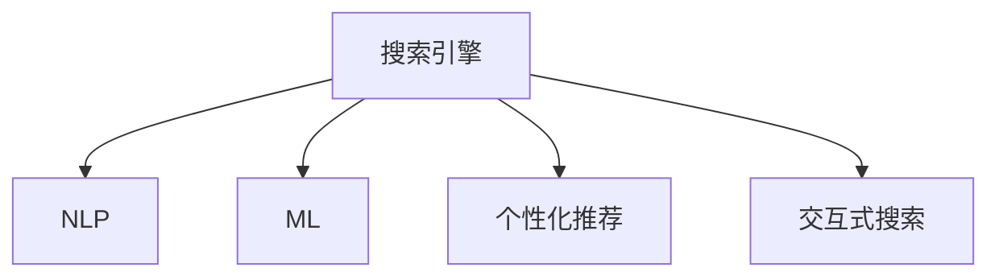

                 

# AI在搜索结果呈现方式上的创新

> 关键词：AI, 自然语言处理, 搜索引擎, 智能排序, 个性化展示, 交互式搜索

## 1. 背景介绍

随着互联网和信息技术的飞速发展，人们获取信息的途径变得日益多样化。搜索引擎作为信息获取的重要工具，其搜索结果的呈现方式直接影响用户体验和信息的获取效率。传统搜索引擎以关键词为核心的文本匹配方式，尽管准确度较高，但无法满足个性化和交互式搜索的需求。而人工智能技术的应用，为搜索引擎的智能化转型带来了新的契机。

### 1.1 问题由来

传统搜索引擎主要依赖于关键词匹配和文本相关度排序。当用户输入查询词时，搜索引擎会遍历整个网页库，找到与查询词最相关的网页返回给用户。然而，这种基于关键词的匹配方式有以下局限性：

- **同义词理解不足**：搜索引擎无法识别同义词，导致搜索结果不全面。
- **上下文理解不足**：搜索结果缺乏对查询上下文的理解，无法准确把握用户意图。
- **个性化不足**：搜索结果缺少对用户历史查询、行为习惯的分析，无法提供个性化展示。

为了解决这些问题，搜索引擎开始引入人工智能技术，提升搜索结果的智能性和个性化程度。

### 1.2 问题核心关键点

AI在搜索结果呈现方式上的创新主要体现在以下几个方面：

- **自然语言处理**：通过理解和分析用户查询语句，提取关键词、实体、意图等信息，提升匹配精准度。
- **智能排序**：利用机器学习模型对搜索结果进行排序，优先展示与用户查询最相关的网页。
- **个性化展示**：根据用户行为和偏好，推荐最符合其需求的结果。
- **交互式搜索**：提供实时互动的功能，如自动补全、搜索纠错、语音搜索等，提升用户体验。

本文将围绕这些核心点，系统介绍AI在搜索结果呈现方式上的创新。

## 2. 核心概念与联系

### 2.1 核心概念概述

为更好地理解AI在搜索结果呈现方式上的创新，本节将介绍几个密切相关的核心概念：

- **搜索引擎**：通过爬取互联网上的网页，建立索引，根据用户查询返回相关网页的系统。
- **自然语言处理(NLP)**：处理和分析人类语言的技术，包括文本匹配、实体识别、意图理解等。
- **机器学习(ML)**：通过数据训练模型，使其具备某种预测或决策能力。
- **个性化推荐**：根据用户历史行为和偏好，推荐最适合的内容。
- **交互式搜索**：提供实时互动的搜索功能，提升用户体验。

这些概念之间的逻辑关系可以通过以下Mermaid流程图来展示：



这个流程图展示了这个创新过程的关键步骤：

1. 用户输入查询，搜索引擎收集网页并索引。
2. 搜索引擎利用NLP技术分析查询语句，提取关键信息。
3. 利用ML模型对搜索结果排序，提升相关性。
4. 结合个性化推荐，提升用户满意度。
5. 引入交互式搜索，提升用户体验。

## 3. 核心算法原理 & 具体操作步骤
### 3.1 算法原理概述

AI在搜索结果呈现方式上的创新主要依赖于以下几个核心算法原理：

- **文本匹配**：利用NLP技术，提升关键词匹配的准确度和上下文理解能力。
- **排序算法**：利用ML模型，优化搜索结果排序，提升相关性。
- **推荐算法**：利用个性化推荐算法，提升搜索结果的个性化程度。
- **交互算法**：利用交互式技术，提升搜索体验。

### 3.2 算法步骤详解

#### 3.2.1 文本匹配

文本匹配是AI在搜索结果呈现方式上的基础。以下是一个基本的文本匹配算法步骤：

1. **查询理解**：对用户查询进行分词、词性标注、实体识别等处理，提取关键词和上下文信息。
2. **网页匹配**：对网页进行分词处理，计算与查询的相似度，确定相关性。
3. **排序**：根据相似度排序，将最相关的网页展示给用户。

具体实现中，可以使用TF-IDF、BM25等经典文本匹配算法，也可以引入深度学习模型，如BERT、ELMO等，提升匹配效果。

#### 3.2.2 排序算法

排序算法是提升搜索结果相关性的关键。以下是一个基于ML的排序算法步骤：

1. **特征提取**：从网页中提取特征，如TF-IDF值、文本长度、URL权威性等。
2. **模型训练**：利用监督学习算法，训练排序模型，如随机森林、神经网络等。
3. **排序**：将网页输入模型，输出排序得分，按照得分排序展示。

基于ML的排序算法，可以充分利用网页的文本内容、链接结构、用户行为等多样信息，提升排序的准确性。

#### 3.2.3 个性化推荐

个性化推荐是提升用户满意度的重要手段。以下是一个基于协同过滤的个性化推荐算法步骤：

1. **用户画像**：根据用户历史查询、点击、停留时间等行为数据，建立用户画像。
2. **相似性计算**：计算用户画像与网页特征的相似性，确定相关性。
3. **推荐**：根据相似性排序，推荐最相关的网页。

协同过滤算法可以通过聚类、矩阵分解等方法，进一步提升推荐效果。

#### 3.2.4 交互算法

交互算法是提升用户体验的关键。以下是一个基于自然语言处理的交互算法步骤：

1. **自动补全**：根据用户输入的前缀，预测可能的关键词，自动补全查询。
2. **搜索纠错**：根据用户输入的查询，识别可能的拼写错误，给出纠错建议。
3. **语音搜索**：将用户的语音输入转换为文本，进行匹配和展示。

交互算法可以显著提升搜索效率和准确性，改善用户体验。

### 3.3 算法优缺点

AI在搜索结果呈现方式上的创新具有以下优点：

- **准确度高**：通过NLP和ML技术，提升关键词匹配和排序的准确度。
- **个性化强**：结合个性化推荐算法，提供更符合用户需求的搜索结果。
- **用户体验好**：引入交互式搜索功能，提升搜索效率和准确性。

同时，该方法也存在以下局限性：

- **计算资源需求大**：NLP和ML模型需要大量计算资源，对硬件要求高。
- **数据质量要求高**：需要高质量的标注数据和用户行为数据，才能训练出高精度的模型。
- **模型复杂度高**：深度学习模型通常结构复杂，训练和推理过程耗时较长。

尽管存在这些局限性，但AI在搜索结果呈现方式上的创新已经成为搜索引擎智能化升级的重要方向。

### 3.4 算法应用领域

AI在搜索结果呈现方式上的创新已经广泛应用于多个领域：

- **新闻搜索**：提供个性化推荐和实时新闻推荐，提升用户的新闻阅读体验。
- **电商搜索**：结合商品属性、用户画像、交易记录等数据，提供个性化推荐和商品搭配建议。
- **社交媒体**：根据用户兴趣和行为，推荐相关内容，提升信息获取效率。
- **旅游搜索**：提供景点推荐、攻略、用户评论等，提升旅游规划体验。
- **健康搜索**：提供个性化医疗建议、医生推荐等，提升健康服务质量。

AI在搜索结果呈现方式上的创新，正在逐步改变人们的信息获取方式，提升搜索引擎的用户体验和信息获取效率。

## 4. 数学模型和公式 & 详细讲解 & 举例说明

### 4.1 数学模型构建

在搜索结果呈现方式的创新过程中，涉及到多个数学模型。以下以搜索排序为例，构建一个基于ML的排序模型：

1. **特征提取**：将网页文本转换为向量表示，如使用TF-IDF、Word2Vec等。
2. **模型选择**：选择适合的机器学习模型，如线性回归、随机森林、神经网络等。
3. **损失函数**：选择适合的损失函数，如均方误差、交叉熵等。
4. **优化算法**：选择适合的优化算法，如梯度下降、Adam等。

### 4.2 公式推导过程

以下以线性回归模型为例，推导排序模型的公式：

设 $y_i$ 为网页的相关性评分，$x_i$ 为网页的特征向量，模型为 $y_i = \beta_0 + \beta_1 x_{i1} + \beta_2 x_{i2} + \ldots + \beta_n x_{in}$，则损失函数为：

$$
L = \frac{1}{N} \sum_{i=1}^N (y_i - \beta_0 - \beta_1 x_{i1} - \beta_2 x_{i2} - \ldots - \beta_n x_{in})^2
$$

梯度下降算法的更新公式为：

$$
\beta_j = \beta_j - \alpha \frac{\partial L}{\partial \beta_j}
$$

其中 $\alpha$ 为学习率。

### 4.3 案例分析与讲解

假设某电商平台的搜索结果排序模型采用线性回归模型，其特征向量 $x_i$ 包括商品价格、用户评分、描述长度等。模型的训练数据集包含1000个商品-用户点击记录，通过交叉验证，模型超参数设置为 $\alpha = 0.01$，迭代次数为1000次。

训练过程中，模型不断调整系数 $\beta_0, \beta_1, \beta_2, \ldots, \beta_n$，使得预测的网页相关性评分 $y_i$ 与真实评分 $y_i$ 的误差最小。通过多次迭代，模型最终收敛，得到了最优的参数值，即可用于对新网页进行相关性排序。

## 5. 项目实践：代码实例和详细解释说明

### 5.1 开发环境搭建

在进行搜索排序实践前，我们需要准备好开发环境。以下是使用Python进行PyTorch开发的环境配置流程：

1. 安装Anaconda：从官网下载并安装Anaconda，用于创建独立的Python环境。
2. 创建并激活虚拟环境：
```bash
conda create -n search-env python=3.8 
conda activate search-env
```
3. 安装PyTorch：根据CUDA版本，从官网获取对应的安装命令。例如：
```bash
conda install pytorch torchvision torchaudio cudatoolkit=11.1 -c pytorch -c conda-forge
```
4. 安装TensorFlow：
```bash
pip install tensorflow
```
5. 安装Scikit-Learn：
```bash
pip install scikit-learn
```

完成上述步骤后，即可在`search-env`环境中开始搜索排序实践。

### 5.2 源代码详细实现

以下是一个基于线性回归的搜索排序模型的PyTorch实现：

```python
import torch
import torch.nn as nn
import torch.optim as optim
from sklearn.model_selection import train_test_split
from sklearn.metrics import mean_squared_error

class LinearRegression(nn.Module):
    def __init__(self, n_features):
        super(LinearRegression, self).__init__()
        self.linear = nn.Linear(n_features, 1)

    def forward(self, x):
        return self.linear(x)

def train_model(X, y, epochs, batch_size, learning_rate):
    X_train, X_test, y_train, y_test = train_test_split(X, y, test_size=0.2)
    model = LinearRegression(X.shape[1])
    optimizer = optim.SGD(model.parameters(), lr=learning_rate)
    criterion = nn.MSELoss()
    for epoch in range(epochs):
        for i in range(0, len(X_train), batch_size):
            inputs = torch.from_numpy(X_train[i:i+batch_size, :])
            targets = torch.from_numpy(y_train[i:i+batch_size, :])
            optimizer.zero_grad()
            outputs = model(inputs)
            loss = criterion(outputs, targets)
            loss.backward()
            optimizer.step()
        if epoch % 10 == 0:
            train_preds = model(X_train).detach().numpy()
            train_rmse = mean_squared_error(y_train, train_preds)
            print(f"Epoch {epoch+1}, Train RMSE: {train_rmse:.4f}")
    return model

def evaluate_model(model, X_test, y_test):
    y_preds = model(X_test).detach().numpy()
    test_rmse = mean_squared_error(y_test, y_preds)
    print(f"Test RMSE: {test_rmse:.4f}")

def main():
    # 加载数据集
    X = pd.read_csv('search_data.csv', header=None)
    y = pd.read_csv('search_labels.csv', header=None)[0]
    # 数据预处理
    X_train, X_test, y_train, y_test = train_test_split(X, y, test_size=0.2)
    # 模型训练
    epochs = 1000
    batch_size = 32
    learning_rate = 0.01
    model = train_model(X_train, y_train, epochs, batch_size, learning_rate)
    # 模型评估
    evaluate_model(model, X_test, y_test)

if __name__ == '__main__':
    main()
```

这里我们通过线性回归模型对搜索排序进行模拟，展示了模型训练和评估的基本步骤。在实际应用中，模型的特征提取、数据预处理等环节需要根据具体任务进行调整。

### 5.3 代码解读与分析

让我们再详细解读一下关键代码的实现细节：

**LinearRegression类**：
- `__init__`方法：初始化模型参数，包括线性层权重和偏置。
- `forward`方法：前向传播计算模型输出。

**train_model函数**：
- 使用sklearn的train_test_split方法将数据集划分为训练集和测试集。
- 定义模型、优化器和损失函数。
- 在每个epoch内，对训练集数据进行批量处理，前向传播计算损失函数，反向传播更新模型参数。
- 每十个epoch输出训练误差，评估模型效果。
- 最终返回训练好的模型。

**evaluate_model函数**：
- 使用测试集数据进行模型评估，计算均方误差。

**main函数**：
- 加载数据集，并进行数据预处理。
- 调用train_model函数训练模型。
- 调用evaluate_model函数评估模型效果。

可以看到，PyTorch配合scikit-learn，可以很方便地进行搜索排序模型的开发和评估。

## 6. 实际应用场景

### 6.1 新闻搜索

新闻搜索平台可以通过AI技术，提升个性化推荐和实时性。以下是一个典型的新闻搜索应用场景：

1. **用户查询**：用户输入关键词或搜索问题，如“今日热点新闻”。
2. **文本匹配**：使用NLP技术提取查询关键词和实体，计算网页匹配得分。
3. **排序**：利用ML模型对搜索结果排序，优先展示最新、最相关的新闻。
4. **推荐**：结合用户历史阅读记录，推荐相关新闻。
5. **交互**：提供搜索纠错、自动补全等功能，提升用户体验。

通过AI技术，新闻搜索平台可以实现更加智能、个性化的新闻推荐，满足用户的多样化需求。

### 6.2 电商搜索

电商搜索平台可以通过AI技术，提升商品推荐和搜索效率。以下是一个典型的电商搜索应用场景：

1. **用户查询**：用户输入关键词或搜索问题，如“笔记本电脑”。
2. **文本匹配**：使用NLP技术提取查询关键词和实体，计算网页匹配得分。
3. **排序**：利用ML模型对搜索结果排序，优先展示高评分、高评价的商品。
4. **推荐**：结合用户历史购买记录，推荐相关商品和搭配商品。
5. **交互**：提供搜索纠错、商品筛选等功能，提升用户体验。

通过AI技术，电商搜索平台可以实现更加个性化、高效的搜索推荐，提升用户的购物体验。

### 6.3 社交媒体

社交媒体平台可以通过AI技术，提升内容推荐和互动体验。以下是一个典型的社交媒体应用场景：

1. **用户发布**：用户发布内容，如“今天天气真好”。
2. **文本匹配**：使用NLP技术提取内容关键词和实体，计算与用户兴趣的匹配得分。
3. **排序**：利用ML模型对推荐内容排序，优先展示高互动性、高相关性内容。
4. **推荐**：结合用户历史互动记录，推荐相关内容和用户。
5. **交互**：提供自动回复、语音搜索等功能，提升用户体验。

通过AI技术，社交媒体平台可以实现更加智能、个性化的内容推荐，提升用户互动体验。

## 7. 工具和资源推荐

### 7.1 学习资源推荐

为了帮助开发者系统掌握AI在搜索结果呈现方式上的创新，这里推荐一些优质的学习资源：

1. 《深度学习》课程：斯坦福大学提供的深度学习基础课程，讲解深度学习的基本概念和算法原理。
2. 《自然语言处理与深度学习》课程：吴恩达教授的NLP入门课程，讲解NLP技术的基本概念和应用场景。
3. 《机器学习实战》书籍：书籍详细讲解了机器学习的基本概念和算法实现，提供了大量的实例代码。
4. PyTorch官方文档：PyTorch官方文档提供了丰富的学习资源和样例代码，帮助开发者快速上手深度学习。
5. TensorFlow官方文档：TensorFlow官方文档提供了丰富的学习资源和样例代码，帮助开发者快速上手深度学习。

通过对这些资源的学习实践，相信你一定能够快速掌握AI在搜索结果呈现方式上的创新，并用于解决实际的搜索引擎问题。

### 7.2 开发工具推荐

高效的开发离不开优秀的工具支持。以下是几款用于搜索引擎开发的常用工具：

1. PyTorch：基于Python的开源深度学习框架，灵活动态的计算图，适合快速迭代研究。大部分深度学习模型都有PyTorch版本的实现。
2. TensorFlow：由Google主导开发的开源深度学习框架，生产部署方便，适合大规模工程应用。
3. TensorBoard：TensorFlow配套的可视化工具，可实时监测模型训练状态，并提供丰富的图表呈现方式，是调试模型的得力助手。
4. Weights & Biases：模型训练的实验跟踪工具，可以记录和可视化模型训练过程中的各项指标，方便对比和调优。
5. Jupyter Notebook：交互式编程环境，支持Python和R等编程语言，适合进行数据处理和模型开发。

合理利用这些工具，可以显著提升搜索引擎开发的效率，加快创新迭代的步伐。

### 7.3 相关论文推荐

AI在搜索结果呈现方式上的创新源于学界的持续研究。以下是几篇奠基性的相关论文，推荐阅读：

1. Attention is All You Need：提出了Transformer结构，开启了NLP领域的预训练大模型时代。
2. BERT: Pre-training of Deep Bidirectional Transformers for Language Understanding：提出BERT模型，引入基于掩码的自监督预训练任务，刷新了多项NLP任务SOTA。
3. Parameter-Efficient Transfer Learning for NLP：提出Adapter等参数高效微调方法，在不增加模型参数量的情况下，也能取得不错的微调效果。
4. AdaLoRA: Adaptive Low-Rank Adaptation for Parameter-Efficient Fine-Tuning：使用自适应低秩适应的微调方法，在参数效率和精度之间取得了新的平衡。

这些论文代表了大模型在搜索结果呈现方式上的创新发展脉络。通过学习这些前沿成果，可以帮助研究者把握学科前进方向，激发更多的创新灵感。

## 8. 总结：未来发展趋势与挑战

### 8.1 总结

本文对AI在搜索结果呈现方式上的创新进行了全面系统的介绍。首先阐述了AI在搜索引擎智能化转型中的重要意义，明确了NLP、ML等技术在搜索结果呈现方式上的关键作用。其次，从原理到实践，详细讲解了文本匹配、排序、推荐等核心算法，给出了搜索引擎开发的完整代码实例。同时，本文还广泛探讨了AI在新闻搜索、电商搜索、社交媒体等多个领域的应用前景，展示了AI在搜索结果呈现方式上的广泛应用。最后，本文精选了相关学习资源和开发工具，力求为读者提供全方位的技术指引。

通过本文的系统梳理，可以看到，AI在搜索结果呈现方式上的创新正在逐步改变搜索引擎的用户体验，提升信息获取效率。未来，伴随AI技术的不断进步，搜索引擎将变得更加智能、个性化，成为人们获取信息的重要工具。

### 8.2 未来发展趋势

展望未来，AI在搜索结果呈现方式上的创新将呈现以下几个发展趋势：

1. **深度学习模型的普及**：深度学习模型在搜索排序和推荐算法中的普及，将进一步提升搜索结果的准确性和个性化程度。
2. **跨领域模型融合**：将不同领域的数据和知识进行融合，提升搜索结果的多样性和实用性。
3. **交互式搜索**：引入语音搜索、自然语言处理等功能，提升搜索体验。
4. **实时性增强**：利用实时数据和流计算技术，提升搜索排序的实时性和效率。
5. **个性化推荐**：结合用户行为数据和外部信息，提升个性化推荐的效果。
6. **多模态搜索**：将文本、图像、语音等多模态数据进行融合，提升搜索效率和准确性。

以上趋势凸显了AI在搜索结果呈现方式上的巨大潜力，将进一步提升搜索引擎的用户体验和信息获取效率。

### 8.3 面临的挑战

尽管AI在搜索结果呈现方式上的创新已经取得了瞩目成就，但在迈向更加智能化、普适化应用的过程中，它仍面临着诸多挑战：

1. **数据质量要求高**：高质量的标注数据和用户行为数据是训练高质量模型的基础，但获取这些数据需要大量人力和时间。
2. **模型复杂度高**：深度学习模型通常结构复杂，训练和推理过程耗时较长，对计算资源要求高。
3. **模型鲁棒性不足**：模型面对域外数据时，泛化性能往往大打折扣，需要进一步提升模型鲁棒性。
4. **隐私保护问题**：搜索过程中需要收集用户行为数据，如何保护用户隐私是一个重要的挑战。
5. **安全性问题**：搜索模型可能被恶意利用，需要加强模型安全性和鲁棒性。

尽管存在这些挑战，但AI在搜索结果呈现方式上的创新仍然是大数据、云计算时代的重要方向，将为搜索引擎带来巨大的变革。未来需要从数据获取、模型设计、隐私保护等多个维度协同发力，才能更好地发挥AI技术在搜索结果呈现方式上的创新作用。

### 8.4 研究展望

面向未来，AI在搜索结果呈现方式上的创新还需要在以下几个方面寻求新的突破：

1. **跨模态搜索**：将不同模态的数据进行融合，提升搜索结果的多样性和实用性。
2. **多任务学习**：将多个任务进行联合训练，提升模型的泛化能力和效率。
3. **实时搜索**：利用流计算和大数据技术，提升搜索结果的实时性和效率。
4. **个性化搜索**：结合用户行为数据和外部信息，提升个性化推荐的效果。
5. **隐私保护**：采用差分隐私等技术，保护用户隐私。

这些研究方向将进一步推动AI在搜索结果呈现方式上的创新，为搜索引擎带来更加智能、高效、安全的用户体验。

## 9. 附录：常见问题与解答

**Q1：AI在搜索结果呈现方式上如何提高个性化推荐？**

A: AI在搜索结果呈现方式上提高个性化推荐主要通过以下几个步骤：

1. **用户画像构建**：通过用户的历史查询、点击、停留时间等行为数据，构建用户画像。
2. **相似性计算**：计算用户画像与网页特征的相似性，确定相关性。
3. **推荐排序**：根据相似性排序，推荐最相关的网页。

具体实现中，可以使用协同过滤、矩阵分解等算法，进一步提升推荐效果。

**Q2：AI在搜索结果呈现方式上如何提升实时性？**

A: AI在搜索结果呈现方式上提升实时性主要通过以下几个步骤：

1. **实时数据采集**：实时采集用户的查询数据和网页更新数据。
2. **流计算**：利用流计算技术，对实时数据进行处理和分析。
3. **实时排序**：根据实时数据进行排序，更新搜索结果。

具体实现中，可以使用Flink、Spark Streaming等流计算框架，实时处理数据，提升搜索排序的实时性。

**Q3：AI在搜索结果呈现方式上如何保障用户隐私？**

A: AI在搜索结果呈现方式上保障用户隐私主要通过以下几个步骤：

1. **匿名化处理**：对用户的隐私数据进行匿名化处理，保护用户身份信息。
2. **差分隐私**：采用差分隐私技术，限制模型的反向传播过程，保护用户隐私。
3. **数据加密**：对用户的隐私数据进行加密处理，防止数据泄露。

具体实现中，可以使用Differential Privacy、FHE等隐私保护技术，保障用户隐私。

**Q4：AI在搜索结果呈现方式上如何提升模型鲁棒性？**

A: AI在搜索结果呈现方式上提升模型鲁棒性主要通过以下几个步骤：

1. **数据扩充**：扩充训练数据集，增加模型的泛化能力。
2. **对抗训练**：引入对抗样本，提高模型的鲁棒性。
3. **多任务学习**：将多个任务进行联合训练，提升模型的泛化能力和鲁棒性。

具体实现中，可以使用对抗生成网络（GAN）、多任务学习（MTL）等技术，提升模型鲁棒性。

**Q5：AI在搜索结果呈现方式上如何提高准确度？**

A: AI在搜索结果呈现方式上提高准确度主要通过以下几个步骤：

1. **数据预处理**：对数据进行清洗、去噪、标准化等预处理。
2. **特征提取**：使用NLP技术，提取文本特征，如TF-IDF、Word2Vec等。
3. **模型训练**：选择合适的机器学习模型，如线性回归、神经网络等，进行训练。

具体实现中，可以使用TF-IDF、Word2Vec、BERT等算法，提升文本匹配的准确度。

---

作者：禅与计算机程序设计艺术 / Zen and the Art of Computer Programming

