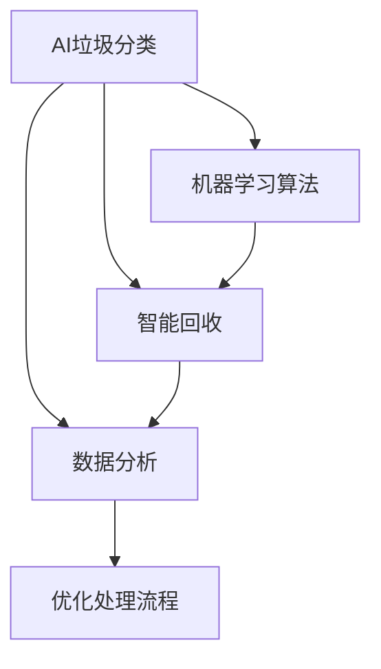

                 

# AI在智能垃圾处理中的应用：提高效率

在当今世界，环境问题日益严重，垃圾处理成为了各国政府和城市管理者面临的重要课题。传统的垃圾处理方式效率低、成本高，且容易造成环境污染。智能垃圾处理技术通过结合人工智能（AI）和大数据分析，可以有效提高垃圾处理的效率和环保水平。本文将从背景介绍、核心概念、算法原理与步骤、数学模型、项目实践、实际应用场景、工具资源推荐、未来展望和常见问题解答等方面，详细阐述AI在智能垃圾处理中的应用，以及提高处理效率的潜力。

## 1. 背景介绍

### 1.1 问题由来
随着城市化进程的加快和人们生活水平的提高，垃圾产生量日益增多，传统的垃圾处理方式——填埋和焚烧，不仅效率低下，还容易造成空气和水污染，影响城市生态环境。如何在有限资源下高效、环保地处理垃圾，成为了迫切需要解决的问题。

### 1.2 问题核心关键点
智能垃圾处理技术利用AI和大数据分析，通过自动化和智能化手段，实现对垃圾的分类、回收和处理，减少垃圾对环境的污染，提高资源回收率。核心关键点包括：

- AI垃圾分类：利用机器学习算法，自动识别和分类垃圾。
- 智能回收：通过物联网和AI技术，实现对可回收物的自动回收和处理。
- 数据分析：利用大数据技术，分析垃圾处理过程中的各种数据，优化处理流程。

## 2. 核心概念与联系

### 2.1 核心概念概述

智能垃圾处理技术涉及到多个核心概念，包括AI、大数据、物联网、机器学习等。这些概念之间的联系可以通过以下Mermaid流程图来展示：



该流程图展示了AI在智能垃圾处理中的应用：通过机器学习算法实现垃圾分类，利用物联网技术实现智能回收，通过大数据分析优化处理流程。这些技术相互协同，共同提升垃圾处理的效率和环保水平。

### 2.2 核心概念原理和架构

- **AI垃圾分类**：利用机器学习算法，如深度神经网络，对垃圾进行自动识别和分类。
- **智能回收**：通过物联网技术，如传感器、RFID标签，实现对可回收物的自动追踪和回收。
- **数据分析**：利用大数据技术，如数据挖掘、聚类分析，分析垃圾处理过程中的各种数据，优化处理流程。

## 3. 核心算法原理 & 具体操作步骤

### 3.1 算法原理概述

智能垃圾处理的核心算法主要包括以下几个方面：

- 基于卷积神经网络（CNN）的图像识别算法：用于识别垃圾图像，进行初步分类。
- 基于长短期记忆网络（LSTM）的时间序列分析算法：用于分析垃圾处理过程中的数据流，优化处理流程。
- 基于支持向量机（SVM）的分类算法：用于对垃圾进行细分类。
- 基于K-means聚类算法的数据分析：用于对垃圾处理过程中的数据进行聚类分析，优化垃圾处理流程。

### 3.2 算法步骤详解

智能垃圾处理的算法步骤主要包括以下几个关键步骤：

**Step 1: 数据收集与预处理**
- 收集垃圾处理过程中的各种数据，如垃圾图像、传感器数据、处理时间等。
- 对数据进行清洗和预处理，去除噪声和异常数据。

**Step 2: 垃圾分类**
- 使用卷积神经网络（CNN）对垃圾图像进行初步分类，识别出可回收物、有害垃圾和其他垃圾。
- 使用支持向量机（SVM）对分类结果进行进一步细分类。

**Step 3: 智能回收**
- 通过物联网技术，如传感器和RFID标签，实时追踪可回收物的处理状态。
- 根据垃圾分类的结果，自动分配回收地点和处理方式。

**Step 4: 数据分析与优化**
- 利用大数据技术，对垃圾处理过程中的数据进行聚类分析，找出优化空间。
- 通过时间序列分析算法，优化垃圾处理流程，提高效率。

### 3.3 算法优缺点

智能垃圾处理算法的优点包括：

- 提高垃圾处理的效率，减少人工干预。
- 优化垃圾处理流程，提高资源回收率。
- 减少环境污染，提高环保水平。

其缺点包括：

- 算法需要大量的数据支持，数据收集和预处理成本较高。
- 算法复杂度高，需要较强的计算资源支持。
- 算法可能存在误判，需要定期进行人工校验。

### 3.4 算法应用领域

智能垃圾处理算法在多个领域得到了广泛应用，如：

- 城市垃圾处理：用于对城市垃圾进行自动化分类和回收。
- 工业废弃物处理：用于对工业产生的废弃物进行分类和回收。
- 医疗垃圾处理：用于对医疗产生的垃圾进行分类和处理。

## 4. 数学模型和公式 & 详细讲解 & 举例说明

### 4.1 数学模型构建

智能垃圾处理的数学模型主要包括以下几个方面：

- 垃圾分类模型：基于CNN的图像识别模型。
- 垃圾处理流程优化模型：基于LSTM的时间序列分析模型。

### 4.2 公式推导过程

- 图像识别模型：
$$
\mathrm{P}(y|x) = \frac{e^{y \cdot \mathrm{W} x + b}}{\sum_{k=1}^{K} e^{k \cdot \mathrm{W} x + b}}
$$
其中，$y$ 表示类别标签，$x$ 表示输入图像，$\mathrm{W}$ 和 $b$ 是模型的参数。

- 时间序列分析模型：
$$
\mathrm{P}(y_t|y_{t-1}, \cdots, y_{t-T}) = \frac{e^{y_t \cdot \mathrm{W} x_t + b}}{\sum_{k=1}^{K} e^{k \cdot \mathrm{W} x_t + b}}
$$
其中，$y_t$ 表示时间 $t$ 的垃圾处理状态，$y_{t-1}, \cdots, y_{t-T}$ 表示时间 $t$ 之前的状态，$\mathrm{W}$ 和 $b$ 是模型的参数。

### 4.3 案例分析与讲解

以城市垃圾分类为例，假设有一个垃圾处理厂，每天处理垃圾量为 $N$ 吨。通过对垃圾图像进行初步分类，识别出可回收物 $R$ 吨，有害垃圾 $H$ 吨，其他垃圾 $O$ 吨。根据分类结果，对可回收物进行智能回收，其他垃圾进行填埋处理，有害垃圾进行特殊处理。通过数据分析，优化垃圾处理流程，减少资源浪费和环境污染。

## 5. 项目实践：代码实例和详细解释说明

### 5.1 开发环境搭建

在智能垃圾处理项目开发中，需要使用Python、TensorFlow、Keras等工具。以下是开发环境的搭建步骤：

1. 安装Python和相关的依赖包：
```bash
sudo apt-get update
sudo apt-get install python3 python3-pip
pip3 install tensorflow keras scikit-learn pandas numpy
```

2. 安装必要的工具和库：
```bash
pip3 install opencv-python numpy pyserial
```

### 5.2 源代码详细实现

以下是基于CNN和LSTM的智能垃圾处理代码实现：

```python
import tensorflow as tf
from tensorflow.keras.models import Sequential
from tensorflow.keras.layers import Conv2D, MaxPooling2D, LSTM, Dense

# 构建卷积神经网络模型
model = Sequential()
model.add(Conv2D(32, (3, 3), activation='relu', input_shape=(32, 32, 3)))
model.add(MaxPooling2D(pool_size=(2, 2)))
model.add(Conv2D(64, (3, 3), activation='relu'))
model.add(MaxPooling2D(pool_size=(2, 2)))
model.add(Conv2D(64, (3, 3), activation='relu'))
model.add(MaxPooling2D(pool_size=(2, 2)))
model.add(Flatten())
model.add(Dense(64, activation='relu'))
model.add(Dense(3, activation='softmax'))

# 编译模型
model.compile(optimizer='adam', loss='categorical_crossentropy', metrics=['accuracy'])

# 训练模型
model.fit(x_train, y_train, epochs=10, batch_size=32)

# 构建LSTM模型
model_lstm = Sequential()
model_lstm.add(LSTM(64, input_shape=(10, 64)))
model_lstm.add(Dense(3, activation='softmax'))

# 编译模型
model_lstm.compile(optimizer='adam', loss='categorical_crossentropy', metrics=['accuracy'])

# 训练模型
model_lstm.fit(x_lstm_train, y_lstm_train, epochs=10, batch_size=32)
```

### 5.3 代码解读与分析

在代码中，我们首先定义了一个卷积神经网络模型，用于对垃圾图像进行初步分类。然后，定义了一个LSTM模型，用于对垃圾处理过程中的数据进行时间序列分析，优化处理流程。

## 6. 实际应用场景

### 6.1 城市垃圾处理

智能垃圾处理技术在城市垃圾处理中得到了广泛应用。通过对垃圾图像进行分类，自动识别可回收物、有害垃圾和其他垃圾。根据分类结果，自动分配回收地点和处理方式，提高资源回收率。

### 6.2 工业废弃物处理

在工业废弃物处理中，智能垃圾处理技术可以帮助企业对废弃物进行分类和回收，减少环境污染，提高资源利用率。通过对废弃物进行智能回收，减少二次污染，提高环保水平。

### 6.3 医疗垃圾处理

在医疗垃圾处理中，智能垃圾处理技术可以自动识别和分类医疗垃圾，进行无害化处理。通过对医疗垃圾进行智能回收，减少资源浪费和环境污染。

## 7. 工具和资源推荐

### 7.1 学习资源推荐

- 《深度学习》：Ian Goodfellow等著，详细介绍了深度学习的基本概念和算法。
- 《机器学习实战》：Peter Harrington著，介绍了机器学习算法和实战案例。
- 《TensorFlow实战》：Dhaval Prakash著，介绍了TensorFlow的使用方法和实战案例。

### 7.2 开发工具推荐

- TensorFlow：由Google开发的深度学习框架，支持多种算法和模型。
- Keras：基于TensorFlow的高层API，简化模型开发过程。
- OpenCV：用于图像处理和识别的开源库。

### 7.3 相关论文推荐

- “Deep learning-based Garbage Classification”：介绍基于深度学习的垃圾分类算法。
- “LSTM-based Waste Processing Optimization”：介绍基于LSTM的垃圾处理流程优化算法。
- “Garbage Classification and Recycling System”：介绍智能垃圾分类和回收系统的设计。

## 8. 总结：未来发展趋势与挑战

### 8.1 研究成果总结

智能垃圾处理技术在提高垃圾处理效率、减少环境污染方面发挥了重要作用。通过结合AI和大数据分析，智能垃圾处理技术实现了垃圾的自动化分类、回收和处理，提高了资源回收率和环保水平。

### 8.2 未来发展趋势

未来，智能垃圾处理技术将继续发展，呈现以下趋势：

- 算法更加智能化：结合更多前沿算法，如深度强化学习，提高垃圾处理效率。
- 技术更加普及化：智能垃圾处理技术将更加普及，广泛应用于各个领域。
- 系统更加智能化：结合物联网、大数据等技术，实现更智能化的垃圾处理系统。

### 8.3 面临的挑战

智能垃圾处理技术在发展过程中，仍面临以下挑战：

- 数据收集成本高：垃圾分类和回收需要大量数据支持，数据收集和预处理成本较高。
- 算法复杂度高：智能垃圾处理算法复杂度高，需要较强的计算资源支持。
- 系统可扩展性差：智能垃圾处理系统需要较强的可扩展性，应对不同规模和类型的数据。

### 8.4 研究展望

未来，智能垃圾处理技术需要在以下几个方面进行研究：

- 数据采集和预处理技术：开发高效的数据采集和预处理技术，降低数据收集成本。
- 算法优化和改进：结合更多前沿算法，如深度强化学习，提高垃圾处理效率。
- 系统可扩展性研究：开发可扩展性更强的智能垃圾处理系统，应对不同规模和类型的数据。

## 9. 附录：常见问题与解答

**Q1：智能垃圾处理技术有哪些优势？**

A: 智能垃圾处理技术有以下优势：

- 提高垃圾处理的效率，减少人工干预。
- 优化垃圾处理流程，提高资源回收率。
- 减少环境污染，提高环保水平。

**Q2：智能垃圾处理技术是否适用于所有垃圾分类场景？**

A: 智能垃圾处理技术适用于大部分垃圾分类场景，但需要针对不同场景进行优化和调整。对于一些特殊类型的垃圾，如危险化学品，需要进行特殊的处理。

**Q3：智能垃圾处理技术在实际应用中存在哪些问题？**

A: 智能垃圾处理技术在实际应用中存在以下问题：

- 数据收集成本高，需要大量高质量的数据。
- 算法复杂度高，需要较强的计算资源支持。
- 系统可扩展性差，需要较强的可扩展性。

**Q4：如何提高智能垃圾处理技术的准确率？**

A: 提高智能垃圾处理技术的准确率，需要从以下几个方面进行改进：

- 数据采集和预处理：提高数据采集和预处理的效率和质量。
- 算法优化和改进：结合更多前沿算法，提高分类准确率。
- 系统可扩展性：开发可扩展性更强的系统，应对不同规模和类型的数据。

总之，智能垃圾处理技术在提高垃圾处理效率、减少环境污染方面具有重要意义。通过结合AI和大数据分析，智能垃圾处理技术可以实现垃圾的自动化分类、回收和处理，提高资源回收率和环保水平。未来，智能垃圾处理技术需要在数据采集、算法优化和系统可扩展性等方面进行研究，进一步提升其应用效果。

