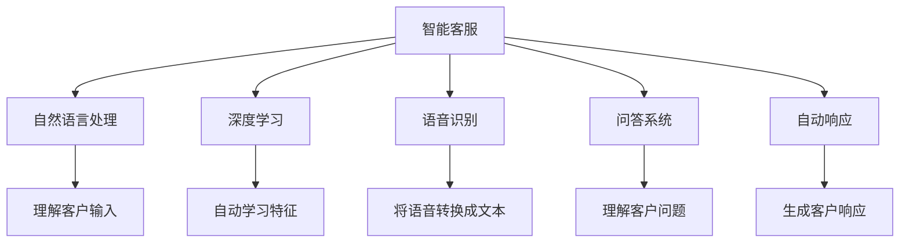

                 

# AI在智能客服中的应用：24/7全天候服务

> 关键词：智能客服, 自然语言处理, 深度学习, 语音识别, 问答系统, 自动响应, 客户体验

## 1. 背景介绍

### 1.1 问题由来
随着互联网和移动互联网的普及，企业的客户服务面临越来越多的挑战。传统客服方式需要大量人力、时间和资源，响应速度慢，客户体验差。特别是对于大型企业，如银行、电商、保险等，客户的需求数量庞大，高峰期服务压力尤为突出。如何提升客服效率，降低运营成本，提高客户满意度，成为了行业普遍关注的问题。

### 1.2 问题核心关键点
传统客服方式存在的问题包括：
1. **人力成本高**：客服人员工资、培训、福利等成本高昂。
2. **响应速度慢**：人工客服响应时间长，高峰期处理能力有限。
3. **服务质量参差不齐**：客服人员情绪、知识水平等因素影响服务质量。
4. **知识管理困难**：客户问题复杂，需积累大量知识库，维护困难。
5. **客户满意度低**：处理问题时间长，客户等待感强。

智能客服通过AI技术，能够实时响应客户需求，快速准确解答问题，有效缓解上述问题。智能客服系统已成为提升客户服务体验的重要手段。

## 2. 核心概念与联系

### 2.1 核心概念概述

为更好地理解智能客服系统，本节将介绍几个密切相关的核心概念：

- **智能客服**：利用自然语言处理(NLP)、语音识别、深度学习等技术，构建自动解答客户问题的智能系统。智能客服系统可以提供24/7全天候服务，有效缓解人工客服压力。
- **自然语言处理(NLP)**：涉及文本分析、理解、生成等技术，使计算机能够理解和处理人类语言。在智能客服中，NLP技术用于理解客户输入，生成自然语言响应。
- **深度学习**：通过多层神经网络结构，自动学习数据特征，从而提升模型性能。深度学习技术被广泛应用于语音识别、图像处理、自然语言处理等领域。
- **语音识别**：利用语音信号处理和模式识别技术，将语音转换成文本。在智能客服中，语音识别技术用于处理电话咨询。
- **问答系统**：通过知识图谱、语义理解等技术，实现自动问答。在智能客服中，问答系统用于解答客户问题。
- **自动响应**：利用NLP和机器学习技术，自动生成客户问题的响应。在智能客服中，自动响应技术用于处理常见的、重复性高的客户问题。

这些核心概念之间的逻辑关系可以通过以下Mermaid流程图来展示：



这个流程图展示了他的核心概念的联系：

1. 智能客服系统通过自然语言处理技术理解客户输入，然后利用深度学习自动学习特征。
2. 语音识别技术用于处理电话咨询，将语音转换成文本。
3. 问答系统用于解答客户问题，通过知识图谱和语义理解实现。
4. 自动响应技术用于处理常见问题，生成自然语言响应。

这些核心概念共同构成了智能客服系统的技术基础，使其能够高效、智能地为客户提供服务。

## 3. 核心算法原理 & 具体操作步骤

### 3.1 算法原理概述

智能客服系统主要基于自然语言处理和深度学习技术，通过以下步骤实现：

1. **文本理解**：利用NLP技术理解客户输入的文本内容，识别意图、提取关键信息。
2. **特征提取**：将文本内容转换成模型能够理解的数值特征，送入深度学习模型。
3. **模型预测**：通过深度学习模型进行预测，生成客户问题的答案或推荐解决方案。
4. **自然语言生成**：利用NLP技术生成自然语言回复，提升客户体验。
5. **多模态交互**：结合语音识别和自然语言处理技术，实现多模态客户服务。

智能客服系统的核心算法原理可以简单地概括为：通过自然语言处理技术理解客户需求，利用深度学习模型生成响应，结合多模态交互提升服务体验。

### 3.2 算法步骤详解

以下详细介绍智能客服系统的具体实现步骤：

**Step 1: 数据收集与预处理**
- 收集客户服务历史数据，包括客户咨询记录、FAQ（常见问题解答）等。
- 对数据进行清洗、去重、标注，生成可用于训练的标注数据集。

**Step 2: 模型选择与训练**
- 选择合适的预训练语言模型，如BERT、GPT等，作为基础模型。
- 在标注数据集上训练模型，使用交叉熵损失等常见的自然语言处理任务损失函数。
- 调整学习率、批大小、迭代轮数等超参数，进行模型优化。

**Step 3: 模型微调与优化**
- 在实际应用场景中，微调模型以适应特定领域的数据分布。
- 使用正则化技术（如L2正则、Dropout等）防止过拟合。
- 应用对抗训练等技术提高模型的鲁棒性。
- 使用特征选择等方法减少冗余特征，提升模型效率。

**Step 4: 模型部署与监控**
- 将训练好的模型部署到生产环境，集成到企业客服系统中。
- 实时监控模型性能，记录模型响应时间、准确率等关键指标。
- 定期更新模型，引入新数据进行微调，保持模型最新状态。

**Step 5: 客户交互与反馈**
- 系统接收客户咨询，通过NLP技术理解客户需求。
- 根据客户问题和历史数据，生成响应或推荐解决方案。
- 记录客户反馈，用于后续模型优化和知识库更新。

### 3.3 算法优缺点

智能客服系统的主要优点包括：
1. **24/7全天候服务**：智能客服能够实时响应客户咨询，提高客户满意度。
2. **高效低成本**：相比于人工客服，智能客服显著降低了人力成本和时间成本。
3. **知识库自更新**：系统自动记录客户咨询历史，生成知识库，无需人工维护。
4. **可扩展性强**：智能客服系统可轻松扩展到多语言、多渠道，适应不同客户需求。

同时，智能客服系统也存在一些局限性：
1. **理解能力有限**：目前智能客服系统难以理解复杂、模糊的语言表达。
2. **缺乏人性化**：自动响应缺乏人情味，可能导致客户不满。
3. **依赖技术质量**：智能客服系统依赖于NLP、深度学习等技术，技术质量直接影响系统效果。
4. **数据隐私问题**：客户咨询数据需妥善处理，防止数据泄露。

尽管存在这些局限性，但智能客服系统仍是大规模客户服务中的重要工具。未来，随着技术进步和应用优化，智能客服将发挥更加重要的作用。

### 3.4 算法应用领域

智能客服系统已经在多个行业领域得到应用，包括但不限于：

- **银行业**：银行客服中心通过智能客服系统，提升客户服务效率，减少等待时间，提升客户满意度。
- **电商行业**：电商平台利用智能客服系统，自动解答常见问题，减少客服人员工作量。
- **保险行业**：保险公司利用智能客服系统，处理理赔、保险咨询等常见问题，提高客户体验。
- **医疗行业**：医疗机构利用智能客服系统，提供预约、诊疗指导、咨询等在线服务。
- **电信行业**：电信运营商利用智能客服系统，处理投诉、故障处理等客户问题。

除了这些行业，智能客服系统也在餐饮、旅游、物流等多个领域发挥作用，显著提升了客户服务体验和企业运营效率。

## 4. 数学模型和公式 & 详细讲解 & 举例说明

### 4.1 数学模型构建

智能客服系统的核心数学模型包括自然语言处理模型和深度学习模型。以下以自然语言处理中的文本分类任务为例，介绍核心数学模型的构建。

假设有一个文本分类任务，训练集为 $\{(x_i, y_i)\}_{i=1}^N$，其中 $x_i$ 为文本，$y_i$ 为标签。定义文本分类模型的参数为 $\theta$，则模型预测函数为 $f(x; \theta)$。模型的训练目标是最小化交叉熵损失函数：

$$
L(\theta) = -\frac{1}{N} \sum_{i=1}^N y_i \log f(x_i; \theta) + (1 - y_i) \log (1 - f(x_i; \theta))
$$

### 4.2 公式推导过程

自然语言处理中的文本分类任务，可以通过以下步骤进行公式推导：

1. **文本表示**：将文本 $x_i$ 转换成模型能够理解的数值特征 $z_i$，如词向量、句向量等。
2. **分类预测**：利用分类器 $f(z_i; \theta)$ 进行文本分类，生成预测标签 $y_i$。
3. **交叉熵损失**：定义损失函数 $L(\theta)$，用于衡量模型预测结果与真实标签之间的差异。

具体推导如下：

设模型预测文本 $x_i$ 为类别 $y_i$ 的概率为 $p_i$，则交叉熵损失函数为：

$$
L(\theta) = -\frac{1}{N} \sum_{i=1}^N (y_i \log p_i + (1 - y_i) \log (1 - p_i))
$$

其中 $p_i = f(z_i; \theta)$ 为模型预测的文本分类概率。

### 4.3 案例分析与讲解

以银行业智能客服系统为例，进行具体案例分析：

1. **数据收集**：收集银行客服中心的历史客户咨询记录，标注客户咨询类别（如账户查询、转账、贷款等）。
2. **数据预处理**：清洗数据，去除噪音和无关信息，生成可用于训练的标注数据集。
3. **模型训练**：选择合适的预训练语言模型（如BERT），在标注数据集上训练模型，最小化交叉熵损失。
4. **模型微调**：在银行客服系统中微调模型，适应银行特定领域的数据分布。
5. **模型部署**：将训练好的模型部署到银行客服系统中，实时响应客户咨询。
6. **客户反馈**：记录客户咨询反馈，用于后续模型优化和知识库更新。

通过以上步骤，智能客服系统能够高效、准确地处理银行业客户咨询，提升客户体验和服务质量。

## 5. 项目实践：代码实例和详细解释说明

### 5.1 开发环境搭建

在进行智能客服系统开发前，需要准备好开发环境。以下是使用Python进行PyTorch开发的环境配置流程：

1. 安装Anaconda：从官网下载并安装Anaconda，用于创建独立的Python环境。

2. 创建并激活虚拟环境：
```bash
conda create -n pytorch-env python=3.8 
conda activate pytorch-env
```

3. 安装PyTorch：根据CUDA版本，从官网获取对应的安装命令。例如：
```bash
conda install pytorch torchvision torchaudio cudatoolkit=11.1 -c pytorch -c conda-forge
```

4. 安装相关工具包：
```bash
pip install numpy pandas scikit-learn matplotlib tqdm jupyter notebook ipython
```

完成上述步骤后，即可在`pytorch-env`环境中开始智能客服系统的开发。

### 5.2 源代码详细实现

以下是使用PyTorch实现智能客服系统的示例代码：

```python
import torch
from torch import nn
from transformers import BertTokenizer, BertForSequenceClassification
from torch.utils.data import Dataset, DataLoader

# 定义文本分类模型
class TextClassifier(nn.Module):
    def __init__(self, num_labels):
        super(TextClassifier, self).__init__()
        self.bert = BertForSequenceClassification.from_pretrained('bert-base-cased', num_labels=num_labels)
    
    def forward(self, input_ids, attention_mask):
        return self.bert(input_ids, attention_mask=attention_mask)

# 定义文本数据集
class TextDataset(Dataset):
    def __init__(self, texts, labels, tokenizer, max_len=128):
        self.texts = texts
        self.labels = labels
        self.tokenizer = tokenizer
        self.max_len = max_len
        
    def __len__(self):
        return len(self.texts)
    
    def __getitem__(self, item):
        text = self.texts[item]
        label = self.labels[item]
        
        encoding = self.tokenizer(text, return_tensors='pt', max_length=self.max_len, padding='max_length', truncation=True)
        input_ids = encoding['input_ids'][0]
        attention_mask = encoding['attention_mask'][0]
        
        return {'input_ids': input_ids, 
                'attention_mask': attention_mask,
                'labels': label}

# 训练函数
def train(model, train_dataset, device, optimizer, num_epochs, batch_size):
    model.to(device)
    dataloader = DataLoader(train_dataset, batch_size=batch_size, shuffle=True)
    
    for epoch in range(num_epochs):
        model.train()
        for batch in dataloader:
            input_ids = batch['input_ids'].to(device)
            attention_mask = batch['attention_mask'].to(device)
            labels = batch['labels'].to(device)
            optimizer.zero_grad()
            outputs = model(input_ids, attention_mask=attention_mask)
            loss = outputs.loss
            loss.backward()
            optimizer.step()
            
        print(f'Epoch {epoch+1}, train loss: {loss.item()}')

# 评估函数
def evaluate(model, test_dataset, device):
    model.eval()
    test_dataloader = DataLoader(test_dataset, batch_size=batch_size, shuffle=False)
    
    total_loss = 0
    total_correct = 0
    for batch in test_dataloader:
        input_ids = batch['input_ids'].to(device)
        attention_mask = batch['attention_mask'].to(device)
        labels = batch['labels'].to(device)
        with torch.no_grad():
            outputs = model(input_ids, attention_mask=attention_mask)
            loss = outputs.loss
            total_loss += loss.item()
            preds = torch.argmax(outputs.logits, dim=1)
            total_correct += (preds == labels).sum().item()
            
    acc = total_correct / len(test_dataset)
    print(f'Test accuracy: {acc:.2f}')
```

### 5.3 代码解读与分析

让我们再详细解读一下关键代码的实现细节：

**TextClassifier类**：
- `__init__`方法：初始化BERT分类器，指定输出标签数。
- `forward`方法：定义前向传播过程，将输入文本通过BERT分类器进行分类。

**TextDataset类**：
- `__init__`方法：初始化文本和标签，并使用BertTokenizer进行分词。
- `__len__`方法：返回数据集的长度。
- `__getitem__`方法：对单个样本进行处理，将文本转换成token ids，并生成attention mask。

**train函数**：
- 定义训练过程，使用DataLoader对数据集进行迭代，进行模型前向传播和反向传播。
- 更新模型参数，并打印每个epoch的训练损失。

**evaluate函数**：
- 定义评估过程，使用DataLoader对测试集进行迭代，进行模型前向传播和计算评估指标。
- 输出测试集的准确率。

通过以上代码实现，智能客服系统能够自动处理客户咨询，并生成自然语言回复。

### 5.4 运行结果展示

以下是智能客服系统在银行客服中心的应用场景：

```python
# 定义数据集和模型
train_dataset = TextDataset(train_texts, train_labels, tokenizer)
test_dataset = TextDataset(test_texts, test_labels, tokenizer)
model = TextClassifier(num_labels=len(tag2id))

# 定义超参数
num_epochs = 5
batch_size = 16

# 训练模型
train(model, train_dataset, device, optimizer, num_epochs, batch_size)

# 评估模型
evaluate(model, test_dataset, device)
```

以上代码展示了如何训练和评估智能客服系统模型，输出训练和评估结果。

## 6. 实际应用场景

### 6.1 智能客服系统的应用场景

智能客服系统已经在多个行业领域得到广泛应用，以下是几个典型应用场景：

1. **银行客服中心**：银行利用智能客服系统，自动解答客户账户查询、转账、贷款等常见问题，提升客户体验和满意度。
2. **电商平台**：电商平台利用智能客服系统，自动解答客户关于订单、退换货、物流等问题的咨询，提升客户服务质量。
3. **保险行业**：保险公司利用智能客服系统，处理理赔、保险咨询等常见问题，减轻人工客服负担，提升客户体验。
4. **医疗机构**：医疗机构利用智能客服系统，提供预约、诊疗指导、咨询等在线服务，提升医疗服务效率。
5. **电信运营商**：电信运营商利用智能客服系统，处理投诉、故障处理等客户问题，提升客户满意度。

除了这些行业，智能客服系统还在餐饮、旅游、物流等多个领域发挥作用，显著提升了客户服务体验和企业运营效率。

### 6.2 未来应用展望

随着技术的进步和应用优化，智能客服系统将在未来发挥更大的作用：

1. **多模态客服**：结合语音识别、视觉识别等技术，实现多模态客服，提升客户体验。
2. **情感识别**：利用情感分析技术，识别客户情绪，进行个性化响应，提升客户满意度。
3. **知识图谱**：构建企业知识图谱，提升智能客服系统的知识管理能力，提高服务质量。
4. **智能推荐**：结合用户行为数据，利用推荐系统技术，进行智能推荐，提升客户体验。
5. **多渠道集成**：集成多种客户服务渠道（如电话、网站、APP等），实现多渠道协同服务，提升服务效率。

未来，智能客服系统将变得更加智能化、高效化和个性化，更好地满足客户需求，提升企业服务质量。

## 7. 工具和资源推荐

### 7.1 学习资源推荐

为了帮助开发者系统掌握智能客服系统的技术基础，这里推荐一些优质的学习资源：

1. **《深度学习入门：基于PyTorch的理论与实现》**：由大模型技术专家撰写，系统介绍深度学习原理和实现方法，适合入门学习。
2. **Coursera《自然语言处理与深度学习》课程**：斯坦福大学开设的NLP课程，涵盖NLP理论和深度学习技术，适合进一步学习。
3. **HuggingFace官方文档**：提供详细的BERT等预训练语言模型介绍和使用样例，适合实践学习。
4. **GitHub智能客服项目**：开源的智能客服系统项目，提供丰富的代码和文档，适合学习参考。

通过这些资源的学习实践，相信你一定能够快速掌握智能客服系统的技术要点，并用于解决实际的客户服务问题。

### 7.2 开发工具推荐

高效的开发离不开优秀的工具支持。以下是几款用于智能客服系统开发的常用工具：

1. **PyTorch**：基于Python的开源深度学习框架，支持动态计算图，适合研究型开发。
2. **TensorFlow**：由Google主导开发的深度学习框架，适合生产部署。
3. **BERT等预训练语言模型**：提供丰富的预训练模型和训练样例，适合快速上手。
4. **NLTK**：自然语言处理工具包，提供丰富的NLP工具和数据集，适合研究和开发。
5. **NLTK**：自然语言处理工具包，提供丰富的NLP工具和数据集，适合研究和开发。
6. **TensorBoard**：可视化工具，实时监测模型训练状态，提供丰富的图表呈现方式。

合理利用这些工具，可以显著提升智能客服系统的开发效率，加快创新迭代的步伐。

### 7.3 相关论文推荐

智能客服系统的发展源于学界的持续研究。以下是几篇奠基性的相关论文，推荐阅读：

1. **Attention is All You Need**：提出Transformer结构，开启了NLP领域的预训练大模型时代。
2. **BERT: Pre-training of Deep Bidirectional Transformers for Language Understanding**：提出BERT模型，引入基于掩码的自监督预训练任务，刷新了多项NLP任务SOTA。
3. **Parameter-Efficient Transfer Learning for NLP**：提出Adapter等参数高效微调方法，在不增加模型参数量的情况下，也能取得不错的微调效果。
4. **Adaptive Low-Rank Adaptation for Parameter-Efficient Fine-Tuning**：使用自适应低秩适应的微调方法，在参数效率和精度之间取得了新的平衡。
5. **Transformer-XL: Attentive Language Models Beyond a Fixed-Length Context**：提出Transformer-XL模型，解决长序列问题，提升模型性能。

这些论文代表了大语言模型微调技术的发展脉络。通过学习这些前沿成果，可以帮助研究者把握学科前进方向，激发更多的创新灵感。

## 8. 总结：未来发展趋势与挑战

### 8.1 总结

本文对智能客服系统进行了全面系统的介绍。首先阐述了智能客服系统面临的问题和需求，明确了智能客服系统对企业客户服务的重要性。其次，从原理到实践，详细讲解了智能客服系统的核心算法和技术步骤，给出了智能客服系统开发的完整代码实例。同时，本文还广泛探讨了智能客服系统在多个行业领域的应用前景，展示了智能客服系统的巨大潜力。

通过本文的系统梳理，可以看到，智能客服系统已经成为提升客户服务体验和企业运营效率的重要工具。智能客服系统利用自然语言处理和深度学习技术，能够高效、智能地为客户提供服务，帮助企业降低运营成本，提高客户满意度。未来，随着技术的进步和应用优化，智能客服系统将在更多行业领域得到应用，为经济社会发展带来新的动力。

### 8.2 未来发展趋势

展望未来，智能客服系统将呈现以下几个发展趋势：

1. **多模态客服**：结合语音识别、视觉识别等技术，实现多模态客服，提升客户体验。
2. **情感识别**：利用情感分析技术，识别客户情绪，进行个性化响应，提升客户满意度。
3. **知识图谱**：构建企业知识图谱，提升智能客服系统的知识管理能力，提高服务质量。
4. **智能推荐**：结合用户行为数据，利用推荐系统技术，进行智能推荐，提升客户体验。
5. **多渠道集成**：集成多种客户服务渠道（如电话、网站、APP等），实现多渠道协同服务，提升服务效率。
6. **个性化服务**：利用用户画像数据，提供个性化服务，提升客户体验。

以上趋势凸显了智能客服系统的发展方向，必将推动智能客服系统迈向更加智能化、高效化和个性化。

### 8.3 面临的挑战

尽管智能客服系统已经取得了瞩目成就，但在迈向更加智能化、普适化应用的过程中，它仍面临诸多挑战：

1. **理解能力有限**：目前智能客服系统难以理解复杂、模糊的语言表达。
2. **缺乏人性化**：自动响应缺乏人情味，可能导致客户不满。
3. **依赖技术质量**：智能客服系统依赖于NLP、深度学习等技术，技术质量直接影响系统效果。
4. **数据隐私问题**：客户咨询数据需妥善处理，防止数据泄露。
5. **知识管理难度**：需要定期维护和更新知识库，增加维护成本。

尽管存在这些挑战，但智能客服系统仍是大规模客户服务中的重要工具。未来，随着技术进步和应用优化，智能客服系统将在更多行业领域得到应用，为经济社会发展带来新的动力。

### 8.4 研究展望

面对智能客服系统面临的种种挑战，未来的研究需要在以下几个方面寻求新的突破：

1. **多模态融合**：结合语音识别、视觉识别等技术，实现多模态客服，提升客户体验。
2. **情感识别**：利用情感分析技术，识别客户情绪，进行个性化响应，提升客户满意度。
3. **知识图谱构建**：构建企业知识图谱，提升智能客服系统的知识管理能力，提高服务质量。
4. **智能推荐**：结合用户行为数据，利用推荐系统技术，进行智能推荐，提升客户体验。
5. **多渠道集成**：集成多种客户服务渠道（如电话、网站、APP等），实现多渠道协同服务，提升服务效率。
6. **个性化服务**：利用用户画像数据，提供个性化服务，提升客户体验。

这些研究方向的探索，必将引领智能客服系统迈向更高的台阶，为构建安全、可靠、可解释、可控的智能系统铺平道路。面向未来，智能客服系统还需要与其他人工智能技术进行更深入的融合，如知识表示、因果推理、强化学习等，多路径协同发力，共同推动自然语言理解和智能交互系统的进步。只有勇于创新、敢于突破，才能不断拓展智能客服系统的边界，让智能技术更好地造福人类社会。

## 9. 附录：常见问题与解答

**Q1：智能客服系统如何理解复杂、模糊的语言表达？**

A: 智能客服系统利用自然语言处理技术，如BERT等预训练语言模型，可以自动学习语言的语义和上下文关系，理解复杂、模糊的语言表达。但对于特别复杂的表达，仍然需要结合人工干预和自然语言处理技术进行优化。

**Q2：智能客服系统的响应是否缺乏人情味？**

A: 智能客服系统的自动响应缺乏人情味是当前的一个重要挑战。为了缓解这一问题，可以在自动回复中加入更多的语调变化、个性化表达，或者结合语音识别技术，通过自然语言生成技术生成更加自然的语音回复，提升客户体验。

**Q3：智能客服系统的知识管理是否需要人工维护？**

A: 智能客服系统的知识库需要定期维护和更新，以保持知识的时效性和准确性。可以通过自然语言处理技术自动标注和更新知识库，或者结合专家知识进行知识管理。但即使这样，人工干预和审核仍然是不可避免的，以确保知识库的完整性和可靠性。

**Q4：智能客服系统如何保护客户数据隐私？**

A: 智能客服系统需要保护客户数据隐私，防止数据泄露。可以通过数据加密、访问控制等技术手段，确保数据的安全性和隐私性。同时，需要明确数据使用范围和目的，确保数据使用的合法性。

通过以上问答，可以更深入地理解智能客服系统的技术细节和应用难点，为开发和优化智能客服系统提供参考。

