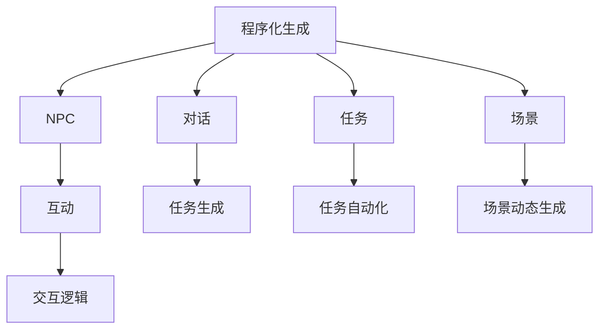

                 

# AI在游戏开发中的应用：从NPC到程序化生成

> 关键词：人工智能,程序化生成,自然语言处理,NPC,自动化,优化

## 1. 背景介绍

随着人工智能技术的快速发展，游戏开发领域正经历一场革命性的变革。从最初的简单的AI对话系统到如今复杂的程序化生成，AI技术在游戏中的应用已从边缘走向核心。特别是程序化生成技术，凭借其高效、可扩展、多样化的优势，正在改变游戏开发的未来。

### 1.1 问题由来

传统游戏开发需要消耗大量的人力和时间，尤其是对于大规模、高自由度的游戏，制作成本和维护难度极高。而人工智能，尤其是程序化生成技术，通过算法自动化生成游戏元素，可以大幅降低制作成本，提升游戏质量和开发效率。

**背景问题**：
- 游戏制作成本高昂。游戏开发涉及复杂的设计和大量的编程工作，导致开发周期长、人力成本高。
- 游戏元素缺乏多样性。传统的由设计团队手动生成游戏元素，效率低、成本高，且容易出现重复和冗余。
- 游戏内容更新困难。游戏上线后，一旦需要更新或新增内容，必须从头开始制作，耗时耗力。

### 1.2 问题核心关键点

程序化生成技术的核心在于，通过数学模型、算法和人工智能技术，自动化地生成游戏内容，包括角色(NPC)、对话、任务、场景等。其关键点在于：

1. **算法自动化**：通过算法自动化生成游戏元素，无需人工干预。
2. **多样性**：生成的游戏元素种类丰富，风格各异。
3. **可扩展性**：可以无限扩展游戏内容，支持游戏世界的动态生成。
4. **高效性**：大幅度提高游戏开发效率，降低成本。

## 2. 核心概念与联系

### 2.1 核心概念概述

在讨论程序化生成技术之前，需要先理解几个关键概念：

- **程序化生成(Procedural Generation)**：通过算法自动化生成游戏内容的技术，广泛应用于游戏设计、城市规划、建筑设计等多个领域。
- **自然语言处理(Natural Language Processing, NLP)**：使计算机能够理解、处理和生成人类语言的技术，包括语音识别、文本处理、机器翻译等。
- **NPC**：即非玩家角色，游戏世界中扮演重要角色的虚拟角色，用于提供任务、对话、互动等功能。

### 2.2 核心概念原理和架构的 Mermaid 流程图



**图说明**：程序化生成技术通过算法自动化生成游戏中的NPC、对话、任务、场景等元素，支持游戏世界的动态生成和互动。

## 3. 核心算法原理 & 具体操作步骤

### 3.1 算法原理概述

程序化生成技术的核心是利用算法和数学模型，自动化生成游戏元素。其主要原理包括以下几个方面：

1. **随机算法**：使用随机数生成算法，保证生成的游戏元素多样性和随机性。
2. **自适应算法**：根据游戏世界的规则和玩家行为，动态调整算法参数，保证生成的内容符合游戏逻辑。
3. **演化算法**：通过迭代优化算法，不断改进生成质量，提高游戏体验。

### 3.2 算法步骤详解

程序化生成技术的步骤大致包括以下几个方面：

1. **初始化参数**：定义算法需要使用的初始参数，如随机种子、迭代次数、算法参数等。
2. **数据结构设计**：设计用于存储和组织生成结果的数据结构，如数组、树、图等。
3. **生成算法实现**：实现具体的生成算法，如随机数生成、规则引擎、迭代优化等。
4. **测试和调试**：对生成的结果进行测试和调试，保证生成的内容符合游戏要求。
5. **优化和迭代**：根据测试结果，不断优化算法参数和生成逻辑，提升生成质量。

### 3.3 算法优缺点

程序化生成技术的优点包括：

1. **高效性**：自动化生成内容，大幅降低开发成本和制作时间。
2. **可扩展性**：可以无限扩展游戏内容，支持动态生成。
3. **多样性**：生成的内容丰富多样，风格各异。

其缺点主要在于：

1. **初始设计困难**：需要仔细设计和调整算法，才能生成高质量的游戏内容。
2. **依赖游戏规则**：生成的内容依赖于游戏规则，修改规则后需要重新生成内容。
3. **缺乏个性化**：生成的内容较为通用，难以根据玩家偏好进行调整。

### 3.4 算法应用领域

程序化生成技术广泛应用于游戏开发的各个环节，包括但不限于以下几个领域：

1. **NPC生成**：自动生成游戏中的NPC，包括外观、对话、行为等。
2. **场景生成**：自动生成游戏中的场景，如地图、建筑、物品等。
3. **任务生成**：自动生成游戏中的任务，包括任务目标、奖励、难度等。
4. **对话生成**：自动生成游戏中的对话，提升NPC的互动性和可玩性。
5. **随机事件**：自动生成游戏中的随机事件，增加游戏的趣味性和不可预测性。

## 4. 数学模型和公式 & 详细讲解 & 举例说明

### 4.1 数学模型构建

程序化生成技术中的数学模型主要基于随机算法和规则引擎。以下是一个简单的NPC生成算法示例：

- **输入**：游戏世界的规则、玩家行为、时间等。
- **输出**：一个符合游戏规则的NPC。

### 4.2 公式推导过程

以NPC生成为例，假设我们有一个规则库，包含生成NPC所需的规则，如年龄、性别、职业、外貌等。我们可以使用以下公式来计算生成NPC的概率：

$$ P(NPC) = \sum_{i=1}^n P(R_i) \cdot P(NPC|R_i) $$

其中，$P(R_i)$表示规则$R_i$发生的概率，$P(NPC|R_i)$表示在规则$R_i$发生的情况下生成NPC的概率。

### 4.3 案例分析与讲解

假设我们有一个简单的规则库，包含以下规则：

- 年龄在18-25岁之间。
- 性别为男。
- 职业为学生。
- 外貌为阳光型。

我们定义规则的概率为：

- $P(R_1) = 0.5$（年龄）
- $P(R_2) = 0.3$（性别）
- $P(R_3) = 0.2$（职业）
- $P(R_4) = 0.4$（外貌）

生成NPC的概率为：

- $P(NPC|R_1) = 0.8$
- $P(NPC|R_2) = 0.7$
- $P(NPC|R_3) = 0.6$
- $P(NPC|R_4) = 0.9$

根据上述公式，我们可以计算得到：

$$ P(NPC) = 0.5 \cdot 0.8 + 0.3 \cdot 0.7 + 0.2 \cdot 0.6 + 0.4 \cdot 0.9 = 0.97 $$

因此，生成的NPC的概率为97%。

## 5. 项目实践：代码实例和详细解释说明

### 5.1 开发环境搭建

在进行程序化生成技术的开发实践前，需要先准备好开发环境。以下是使用Python进行开发的环境配置流程：

1. 安装Python：从官网下载并安装Python 3.7及以上版本。
2. 安装依赖库：使用pip安装numpy、pandas、matplotlib等常用库。
3. 搭建开发环境：创建虚拟环境，使用conda或virtualenv工具搭建。

### 5.2 源代码详细实现

以下是一个简单的NPC生成算法示例，使用Python实现：

```python
import random

class NPC:
    def __init__(self):
        self.age = random.randint(18, 25)
        self.gender = random.choice(['男', '女'])
        self.profession = random.choice(['学生', '教师', '医生'])
        self.appearance = random.choice(['sunny', 'grumpy', 'cool'])

    def __str__(self):
        return f"年龄：{self.age}，性别：{self.gender}，职业：{self.profession}，外貌：{self.appearance}"
```

### 5.3 代码解读与分析

**NPC类**：
- `__init__`方法：初始化NPC的年龄、性别、职业和外貌。
- `__str__`方法：返回NPC的字符串表示。

该代码展示了NPC生成的基本逻辑。首先定义一个NPC类，包含年龄、性别、职业和外貌四个属性。在初始化时，使用随机数生成年龄和外貌，使用随机选择生成性别和职业。最后，使用`__str__`方法返回NPC的字符串表示。

## 6. 实际应用场景

### 6.1 NPC生成

NPC生成是程序化生成技术的重要应用场景之一。在游戏中，NPC扮演着重要的角色，提供任务、对话、互动等功能。通过程序化生成技术，可以自动生成大量的NPC，提升游戏的可玩性和互动性。

**应用场景**：
- **任务分配**：自动生成NPC，分配任务给玩家。
- **对话生成**：自动生成NPC的对话，提升游戏的交互性。
- **互动生成**：自动生成NPC的行为和互动逻辑，增加游戏的趣味性。

### 6.2 场景生成

场景生成是程序化生成技术的另一个重要应用场景。游戏中的场景包括地图、建筑、物品等，通过程序化生成技术，可以自动生成多种多样的场景，支持游戏世界的动态生成。

**应用场景**：
- **地图生成**：自动生成游戏中的地图，包括地形、建筑物、道路等。
- **建筑生成**：自动生成游戏中的建筑，如商店、住宅、工厂等。
- **物品生成**：自动生成游戏中的物品，如武器、装备、道具等。

### 6.3 任务生成

任务生成是通过程序化生成技术自动生成游戏中的任务，提升游戏的可玩性和挑战性。通过任务生成，可以动态生成任务，增加游戏的不可预测性。

**应用场景**：
- **随机任务**：自动生成随机任务，提升游戏的趣味性。
- **主线任务**：自动生成主线任务，引导玩家探索游戏世界。
- **支线任务**：自动生成支线任务，增加游戏的深度和丰富度。

## 7. 工具和资源推荐

### 7.1 学习资源推荐

为了帮助开发者系统掌握程序化生成技术的理论基础和实践技巧，以下是一些优质的学习资源：

1. **《Procedural Generation in Game Development》**：详细介绍程序化生成技术在游戏开发中的应用，包括NPC、场景、任务等。
2. **Coursera的《Introduction to Game Development》**：由著名游戏开发者授课，涵盖程序化生成技术的理论基础和实践技巧。
3. **Udemy的《Procedural Generation for Game Designers》**：专为游戏设计师设计，详细讲解程序化生成技术在游戏中的应用。
4. **《Game Programming Patterns》**：详细介绍游戏编程模式，包括程序化生成技术在内。
5. **GitHub上的《Procedural Generation Examples》**：提供多种程序化生成算法的示例代码，方便学习和实践。

### 7.2 开发工具推荐

程序化生成技术的开发过程中，需要选择合适的工具和库，以下是一些常用的工具和库：

1. **Unity**：流行的游戏引擎，支持程序化生成技术的实现。
2. **Unreal Engine**：另一个流行的游戏引擎，支持复杂的程序化生成算法。
3. **Python**：简单易学的编程语言，支持多种库和工具。
4. **C#**：Unity中常用的编程语言，易于开发和部署。
5. **Unity Asset Store**：提供各种游戏开发资源和插件，包括程序化生成技术。

### 7.3 相关论文推荐

程序化生成技术的发展源于学界的持续研究。以下是几篇奠基性的相关论文，推荐阅读：

1. **《Procedural Content Generation for Games》**：由国外知名游戏开发者撰写，详细介绍程序化生成技术在游戏中的实现。
2. **《Generative Models in Games》**：介绍多种程序化生成算法，如Perlin噪声、Voronoi图等。
3. **《Procedural Content Generation in Game Development》**：由著名游戏设计师撰写，详细介绍程序化生成技术在游戏中的实现。
4. **《Procedural Generation of Virtual Environments》**：介绍程序化生成技术在虚拟环境中的应用。
5. **《Real-Time Procedural Content Generation》**：介绍实时程序化生成算法的实现，支持游戏的动态生成。

## 8. 总结：未来发展趋势与挑战

### 8.1 研究成果总结

程序化生成技术在游戏开发中的应用，正在从边缘走向核心，成为游戏开发的重要组成部分。通过算法自动化生成游戏元素，大幅提升了游戏开发的效率和质量，降低了开发成本。

### 8.2 未来发展趋势

展望未来，程序化生成技术的发展趋势如下：

1. **智能化增强**：引入人工智能和机器学习技术，提升生成的内容的智能性和可玩性。
2. **可定制化提升**：通过用户自定义规则，生成符合玩家偏好的游戏内容。
3. **多模态融合**：结合视觉、听觉、文本等多种模态，生成更丰富、更真实的游戏世界。
4. **动态生成优化**：引入动态生成技术，提升游戏世界的动态性和趣味性。
5. **实时生成支持**：支持游戏的实时生成和动态调整，提升用户体验。

### 8.3 面临的挑战

程序化生成技术在游戏开发中面临以下挑战：

1. **初始设计困难**：需要仔细设计和调整算法，才能生成高质量的游戏内容。
2. **依赖游戏规则**：生成的内容依赖于游戏规则，修改规则后需要重新生成内容。
3. **缺乏个性化**：生成的内容较为通用，难以根据玩家偏好进行调整。
4. **生成质量不稳定**：生成的内容质量不稳定，容易出现重复和冗余。

### 8.4 研究展望

未来，程序化生成技术需要进一步探索和优化，主要包括以下几个方面：

1. **智能化增强**：引入人工智能和机器学习技术，提升生成的内容的智能性和可玩性。
2. **可定制化提升**：通过用户自定义规则，生成符合玩家偏好的游戏内容。
3. **多模态融合**：结合视觉、听觉、文本等多种模态，生成更丰富、更真实的游戏世界。
4. **动态生成优化**：引入动态生成技术，提升游戏世界的动态性和趣味性。
5. **实时生成支持**：支持游戏的实时生成和动态调整，提升用户体验。

## 9. 附录：常见问题与解答

**Q1: 程序化生成技术在实际应用中存在哪些局限性？**

A: 程序化生成技术在实际应用中存在以下局限性：
- **初始设计困难**：需要仔细设计和调整算法，才能生成高质量的游戏内容。
- **依赖游戏规则**：生成的内容依赖于游戏规则，修改规则后需要重新生成内容。
- **缺乏个性化**：生成的内容较为通用，难以根据玩家偏好进行调整。
- **生成质量不稳定**：生成的内容质量不稳定，容易出现重复和冗余。

**Q2: 如何提高程序化生成技术的生成质量？**

A: 提高程序化生成技术的生成质量主要从以下几个方面入手：
- **改进算法设计**：优化算法设计，减少生成内容的重复和冗余。
- **引入人工智能**：引入人工智能和机器学习技术，提升生成的内容的智能性和可玩性。
- **用户定制化**：提供用户自定义规则，生成符合玩家偏好的游戏内容。
- **多模态融合**：结合视觉、听觉、文本等多种模态，生成更丰富、更真实的游戏世界。
- **动态生成优化**：引入动态生成技术，提升游戏世界的动态性和趣味性。

**Q3: 程序化生成技术在实际应用中如何与人工智能结合？**

A: 程序化生成技术可以与人工智能技术紧密结合，提升生成的内容的智能性和可玩性。以下是几种结合方式：
- **引入人工智能生成**：通过人工智能生成对话、任务、场景等内容，提升游戏世界的智能性和可玩性。
- **结合机器学习优化**：通过机器学习优化生成算法，提升生成内容的智能性和多样性。
- **引入强化学习**：通过强化学习优化生成策略，提升生成内容的可玩性和互动性。

**Q4: 程序化生成技术在游戏开发中的应用前景如何？**

A: 程序化生成技术在游戏开发中的应用前景非常广阔，主要体现在以下几个方面：
- **提升游戏开发效率**：通过算法自动化生成游戏内容，大幅降低开发成本和制作时间。
- **增强游戏可玩性**：生成的内容丰富多样，风格各异，提升游戏的可玩性和互动性。
- **支持游戏世界的动态生成**：通过程序化生成技术，支持游戏世界的动态生成，提升游戏世界的动态性和趣味性。
- **支持实时生成**：支持游戏的实时生成和动态调整，提升用户体验。

通过上述系统梳理，可以看出程序化生成技术在游戏开发中的应用前景广阔，未来将会在游戏开发中扮演越来越重要的角色。开发者需要不断探索和优化程序化生成技术，才能更好地满足游戏开发的需求，提升游戏质量和用户体验。

---

作者：禅与计算机程序设计艺术 / Zen and the Art of Computer Programming

