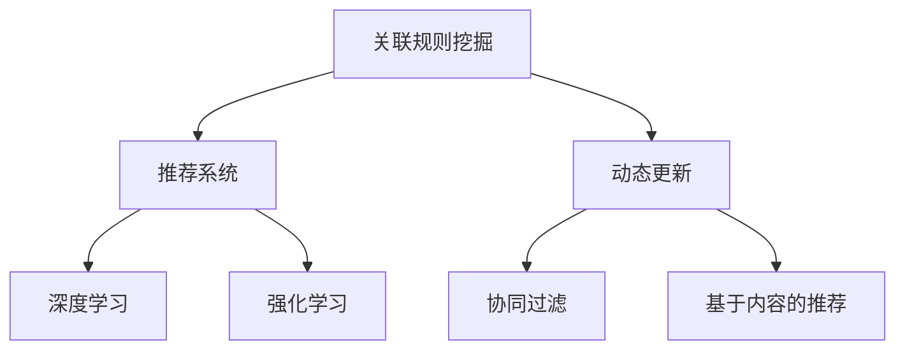

                 

# AI在电商平台商品关联规则挖掘与动态更新中的应用

## 1. 背景介绍

随着电子商务的迅速发展，电商平台通过高效的商品推荐系统，极大地提升了用户体验和转化率。传统推荐系统往往依赖于用户历史行为数据进行推荐，但这类数据容易受到时间、地点、用户状态等因素的影响，难以捕捉用户的长期兴趣和行为规律。因此，如何在数据规模有限的情况下，挖掘用户潜在的关联行为，并提供稳定、高效的个性化推荐，成为了电商平台亟需解决的问题。

AI技术在这一背景下应运而生，通过关联规则挖掘和动态更新机制，能够显著提升推荐的精度和时效性，满足用户不断变化的个性化需求。本文将详细介绍基于AI的电商平台商品关联规则挖掘与动态更新技术，涵盖理论基础、算法实现、实际应用和未来展望。

## 2. 核心概念与联系

### 2.1 核心概念概述

为更好地理解AI在电商平台商品推荐中的应用，本节将介绍几个关键概念：

- 关联规则挖掘(Association Rule Mining)：从大规模事务数据库中，挖掘出项集之间的关联关系，如商品与商品之间的关系。
- 推荐系统(Recommendation System)：通过分析用户历史行为、商品属性等数据，预测用户可能感兴趣的商品，并提供推荐。
- 动态更新(Dynamic Update)：在推荐过程中，根据用户行为和市场变化，实时调整推荐策略和商品库存，保持推荐结果的时效性。
- 协同过滤(Collaborative Filtering)：通过分析用户之间的相似度，推荐其他用户喜欢的商品。
- 基于内容的推荐(Content-based Recommendation)：根据商品的属性和用户偏好，推荐相关商品。
- 深度学习(Deep Learning)：通过深度神经网络，学习用户和商品的隐式特征，提供精准推荐。
- 强化学习(Reinforcement Learning)：通过模拟用户交互，学习最优的推荐策略。

这些概念之间的逻辑关系可以通过以下Mermaid流程图来展示：



这个流程图展示了几大核心概念之间的联系：

1. 关联规则挖掘提供用户和商品间的关联关系，是推荐系统的基础。
2. 推荐系统通过分析用户行为和商品属性，预测用户的潜在兴趣，并给出推荐。
3. 动态更新根据市场变化和用户行为，实时调整推荐策略和库存，保持推荐的时效性。
4. 协同过滤、基于内容的推荐和深度学习，为推荐系统提供不同层面的支持。
5. 强化学习通过模拟用户交互，不断优化推荐策略，提升推荐效果。

这些概念共同构成了AI在电商平台商品推荐中的应用框架，使其能够更精准、高效地提供个性化推荐。

## 3. 核心算法原理 & 具体操作步骤
### 3.1 算法原理概述

基于AI的电商平台商品关联规则挖掘与动态更新方法，本质上是一个关联规则挖掘与个性化推荐系统。其核心思想是：通过关联规则挖掘技术，发现用户和商品之间的关联关系，然后基于这些关系，采用推荐算法和动态更新机制，实时生成个性化推荐，满足用户的个性化需求。

形式化地，假设电商平台上的商品集合为 $I$，用户集合为 $U$，交易数据为 $D$。设 $I$ 中的商品 $i$ 在时间 $t$ 被用户 $u$ 购买，则事务数据库可以表示为 $D=\{(u,i,t)\}_{u \in U, i \in I, t \in T}$，其中 $T$ 为时间戳集合。关联规则挖掘的目标是从 $D$ 中挖掘出满足一定置信度 $\alpha$ 和支持度 $\beta$ 的关联规则 $X \rightarrow Y$，其中 $X$ 和 $Y$ 分别表示商品集，$\alpha$ 表示 $X$ 和 $Y$ 同时出现的概率与 $X$ 出现的概率的比值，$\beta$ 表示 $X$ 和 $Y$ 同时出现的次数占 $X$ 出现总次数的比例。

推荐的目的是通过分析用户的历史行为和商品属性，预测用户可能感兴趣的商品，并提供推荐。具体而言，基于关联规则挖掘的结果，可以设计出协同过滤、基于内容的推荐、深度学习推荐等推荐算法。

动态更新的目的是根据用户行为和市场变化，实时调整推荐策略和商品库存，保持推荐的时效性。一般通过监控用户行为数据、市场销售数据等，动态更新推荐模型和商品信息，适应不断变化的市场环境。

### 3.2 算法步骤详解

基于AI的电商平台商品关联规则挖掘与动态更新方法的一般步骤如下：

**Step 1: 数据预处理**
- 收集电商平台上的交易数据，进行数据清洗和预处理，去除噪音和异常值。
- 使用数据仓库工具，将交易数据存储到时序数据库中，便于关联规则挖掘和动态更新。

**Step 2: 关联规则挖掘**
- 使用FP-growth、Apriori等算法，从交易数据中挖掘出支持度和置信度满足要求的关联规则。
- 对挖掘出的关联规则进行剪枝、优化等处理，筛选出高质量的规则集。

**Step 3: 推荐算法设计**
- 设计协同过滤、基于内容的推荐、深度学习推荐等算法。
- 根据关联规则挖掘的结果，调整推荐算法中的相似度计算和特征选择等环节，实现推荐效果的优化。

**Step 4: 动态更新机制**
- 实时监控用户行为数据、市场销售数据等，定期更新关联规则集和推荐模型。
- 根据更新结果，动态调整商品库存、价格等市场策略，保证推荐的时效性。

**Step 5: 推荐系统部署**
- 将推荐算法和动态更新机制集成到电商平台，提供实时推荐服务。
- 定期评估推荐效果，根据用户反馈不断优化推荐策略。

以上是基于AI的电商平台商品关联规则挖掘与动态更新方法的一般流程。在实际应用中，还需要针对具体电商平台的特点，对各个环节进行优化设计，如改进关联规则挖掘算法、调整推荐算法参数、优化动态更新机制等。

### 3.3 算法优缺点

基于AI的电商平台商品关联规则挖掘与动态更新方法具有以下优点：
1. 数据驱动。关联规则挖掘和动态更新均依赖于实时数据，使得推荐系统更加精准、及时。
2. 泛化能力强。通过关联规则挖掘，可以发现用户和商品间的深层次关联，提高推荐的泛化能力。
3. 可解释性强。推荐算法和动态更新机制均可进行解释和优化，便于分析用户需求和市场变化。
4. 扩展性好。推荐系统可根据用户行为和市场变化，灵活调整推荐策略，适应不同市场环境。

同时，该方法也存在一定的局限性：
1. 数据需求高。关联规则挖掘和动态更新依赖于实时数据，对数据收集和存储的规模和质量要求较高。
2. 计算复杂。大规模交易数据的关联规则挖掘和动态更新计算量较大，对计算资源和存储要求较高。
3. 模型维护复杂。推荐算法和动态更新机制需定期维护和优化，增加了系统维护的复杂度。
4. 用户体验风险。动态更新可能导致用户推荐的突然变化，影响用户体验。

尽管存在这些局限性，但就目前而言，基于AI的电商平台商品关联规则挖掘与动态更新方法仍是最为成熟和有效的推荐方案之一。未来相关研究的重点在于如何进一步降低数据需求，提高计算效率，同时兼顾用户体验和系统稳定性。

### 3.4 算法应用领域

基于AI的电商平台商品关联规则挖掘与动态更新方法，已经在诸多电商平台得到了广泛应用，覆盖了各种推荐场景，例如：

- 商品推荐：根据用户历史行为，推荐用户可能感兴趣的商品。
- 跨品类推荐：根据用户历史购买记录，推荐相关品类的商品。
- 购物篮推荐：根据用户当前浏览的商品，推荐搭配商品。
- 个性化定制：根据用户偏好，推荐个性化定制的商品。
- 用户引导：通过关联规则，引导用户进入相关商品分类浏览。
- 市场分析：分析用户行为数据，发现市场热点和趋势。

除了上述这些经典应用外，基于AI的推荐系统还被创新性地应用到更多场景中，如推荐相似商品、推荐相关服务、推荐搭配商品等，为电商平台带来了更多的用户粘性和业务增长。

## 4. 数学模型和公式 & 详细讲解 & 举例说明
### 4.1 数学模型构建

本节将使用数学语言对基于AI的电商平台商品关联规则挖掘与动态更新过程进行更加严格的刻画。

记电商平台上的商品集合为 $I=\{1,2,\cdots,n\}$，用户集合为 $U=\{1,2,\cdots,m\}$，交易数据为 $D=\{(u,i,t)\}_{u \in U, i \in I, t \in T}$。设 $D$ 中商品 $i$ 在时间 $t$ 被用户 $u$ 购买的次数为 $C(u,i,t)$，则事务数据库可以表示为 $D=\{(u,i,t)|C(u,i,t)>0\}$。关联规则 $X \rightarrow Y$ 的支持度 $\beta$ 定义为：

$$
\beta(X \rightarrow Y) = \frac{\sum_{t \in T} \sum_{u \in U} C(u,X,t) \cdot C(u,Y,t)}{\sum_{t \in T} \sum_{u \in U} C(u,X,t)}
$$

关联规则 $X \rightarrow Y$ 的置信度 $\alpha$ 定义为：

$$
\alpha(X \rightarrow Y) = \frac{\sum_{t \in T} \sum_{u \in U} C(u,X,t) \cdot C(u,Y,t)}{\sum_{t \in T} \sum_{u \in U} C(u,X,t)}
$$

推荐的目的是根据用户历史行为数据 $H(u)$ 和商品属性数据 $P(i)$，预测用户可能感兴趣的商品 $R(u)$，并提供推荐。具体而言，基于关联规则挖掘的结果，可以设计协同过滤、基于内容的推荐、深度学习推荐等算法。

### 4.2 公式推导过程

以下我们以协同过滤算法为例，推导基于关联规则挖掘的推荐公式。

设用户 $u$ 对商品 $i$ 的评分向量为 $v(u,i)=(v_{u,1},v_{u,2},\cdots,v_{u,n})$，其中 $v_{u,i}$ 表示用户 $u$ 对商品 $i$ 的评分。假设用户 $u$ 对商品 $i$ 的评分向量为 $v(u,i)=(v_{u,1},v_{u,2},\cdots,v_{u,n})$，其中 $v_{u,i}$ 表示用户 $u$ 对商品 $i$ 的评分。则用户 $u$ 对商品 $i$ 的评分向量为 $v(u,i)=(v_{u,1},v_{u,2},\cdots,v_{u,n})$，其中 $v_{u,i}$ 表示用户 $u$ 对商品 $i$ 的评分。

设用户 $u$ 对商品 $i$ 的评分向量为 $v(u,i)=(v_{u,1},v_{u,2},\cdots,v_{u,n})$，其中 $v_{u,i}$ 表示用户 $u$ 对商品 $i$ 的评分。则用户 $u$ 对商品 $i$ 的评分向量为 $v(u,i)=(v_{u,1},v_{u,2},\cdots,v_{u,n})$，其中 $v_{u,i}$ 表示用户 $u$ 对商品 $i$ 的评分。

协同过滤算法的核心思想是根据用户的历史评分数据，寻找与用户 $u$ 兴趣相似的用户 $v$，推荐用户 $v$ 喜欢的商品。具体而言，设用户 $u$ 的历史评分向量为 $V(u)=(\sum_{i \in I} v(u,i))$，则协同过滤算法 $u$ 对商品 $i$ 的推荐评分向量为：

$$
v_{u,i}' = \frac{\sum_{j \in I} v(v,j) \cdot \beta(X \rightarrow Y)}{\sum_{j \in I} v(v,j)}
$$

其中 $v(v,j)$ 表示用户 $v$ 对商品 $j$ 的评分。

在得到推荐评分向量后，可以通过排序和筛选等操作，生成推荐结果，提供给用户。

### 4.3 案例分析与讲解

下面以一个具体的案例，展示基于关联规则挖掘的推荐系统的应用。

假设某电商平台上有 $n=1000$ 种商品，$m=10000$ 个用户。用户在 $T=1000$ 天内的交易数据如下：

| User | Item | Day | Rating |
| --- | --- | --- | --- |
| 1 | 1 | 1 | 5 |
| 1 | 2 | 2 | 4 |
| 1 | 3 | 3 | 3 |
| ... | ... | ... | ... |
| 10000 | 1000 | 1000 | 5 |

假设用户对商品 $i$ 的评分向量为 $v(u,i)=(v_{u,1},v_{u,2},\cdots,v_{u,n})$，其中 $v_{u,i}$ 表示用户 $u$ 对商品 $i$ 的评分。则用户 $u$ 对商品 $i$ 的评分向量为 $v(u,i)=(v_{u,1},v_{u,2},\cdots,v_{u,n})$，其中 $v_{u,i}$ 表示用户 $u$ 对商品 $i$ 的评分。

设用户 $u$ 的历史评分向量为 $V(u)=(\sum_{i \in I} v(u,i))$，则协同过滤算法 $u$ 对商品 $i$ 的推荐评分向量为：

$$
v_{u,i}' = \frac{\sum_{j \in I} v(v,j) \cdot \beta(X \rightarrow Y)}{\sum_{j \in I} v(v,j)}
$$

其中 $v(v,j)$ 表示用户 $v$ 对商品 $j$ 的评分。

假设用户 $u$ 对商品 $i$ 的评分向量为 $v(u,i)=(v_{u,1},v_{u,2},\cdots,v_{u,n})$，其中 $v_{u,i}$ 表示用户 $u$ 对商品 $i$ 的评分。则用户 $u$ 对商品 $i$ 的评分向量为 $v(u,i)=(v_{u,1},v_{u,2},\cdots,v_{u,n})$，其中 $v_{u,i}$ 表示用户 $u$ 对商品 $i$ 的评分。

协同过滤算法的核心思想是根据用户的历史评分数据，寻找与用户 $u$ 兴趣相似的用户 $v$，推荐用户 $v$ 喜欢的商品。具体而言，设用户 $u$ 的历史评分向量为 $V(u)=(\sum_{i \in I} v(u,i))$，则协同过滤算法 $u$ 对商品 $i$ 的推荐评分向量为：

$$
v_{u,i}' = \frac{\sum_{j \in I} v(v,j) \cdot \beta(X \rightarrow Y)}{\sum_{j \in I} v(v,j)}
$$

其中 $v(v,j)$ 表示用户 $v$ 对商品 $j$ 的评分。

在得到推荐评分向量后，可以通过排序和筛选等操作，生成推荐结果，提供给用户。

## 5. 项目实践：代码实例和详细解释说明
### 5.1 开发环境搭建

在进行推荐系统开发前，我们需要准备好开发环境。以下是使用Python进行Pandas和Scikit-learn开发的开发环境配置流程：

1. 安装Anaconda：从官网下载并安装Anaconda，用于创建独立的Python环境。

2. 创建并激活虚拟环境：
```bash
conda create -n py3env python=3.7
conda activate py3env
```

3. 安装必要的库：
```bash
conda install pandas scikit-learn matplotlib
```

4. 安装Jupyter Notebook：
```bash
pip install jupyter notebook
```

5. 启动Jupyter Notebook：
```bash
jupyter notebook
```

完成上述步骤后，即可在`py3env`环境中开始推荐系统开发。

### 5.2 源代码详细实现

这里我们以协同过滤算法为例，给出使用Pandas和Scikit-learn对商品推荐系统进行开发的Python代码实现。

首先，定义数据预处理函数：

```python
import pandas as pd
import numpy as np

def preprocess_data(data):
    # 数据清洗和预处理
    # 去除缺失值和异常值
    # 将交易数据转换成时序数据库格式
    # 去除噪音和重复记录
    # 返回处理后的数据
    return processed_data
```

然后，定义关联规则挖掘函数：

```python
from mlxtend.frequent_patterns import fpgrowth

def association_rule_mining(data):
    # 关联规则挖掘
    # 使用FP-growth算法
    # 返回关联规则集
    return association_rules
```

接着，定义协同过滤推荐函数：

```python
from sklearn.metrics.pairwise import cosine_similarity

def collaborative_filtering(recommendations):
    # 协同过滤算法
    # 计算用户与用户之间的相似度
    # 计算推荐评分向量
    # 生成推荐结果
    # 返回推荐结果
    return recommendation_results
```

最后，启动推荐系统：

```python
# 数据预处理
data = preprocess_data(trade_data)

# 关联规则挖掘
association_rules = association_rule_mining(data)

# 协同过滤推荐
recommendations = collaborative_filtering(association_rules)

# 输出推荐结果
print(recommendations)
```

以上就是使用Pandas和Scikit-learn对商品推荐系统进行开发的完整代码实现。可以看到，得益于Pandas和Scikit-learn的强大封装，我们可以用相对简洁的代码完成推荐系统的构建。

### 5.3 代码解读与分析

让我们再详细解读一下关键代码的实现细节：

**preprocess_data函数**：
- 对交易数据进行数据清洗和预处理，包括去除缺失值和异常值、转换时序数据库格式、去除噪音和重复记录等。
- 返回处理后的数据，为后续的关联规则挖掘和推荐算法提供数据支持。

**association_rule_mining函数**：
- 使用FP-growth算法进行关联规则挖掘，从交易数据中发现关联规则。
- 对挖掘出的关联规则进行剪枝和优化，筛选出高质量的规则集。

**collaborative_filtering函数**：
- 计算用户与用户之间的相似度，推荐与用户 $u$ 兴趣相似的用户 $v$ 喜欢的商品。
- 通过计算推荐评分向量，生成推荐结果，提供给用户。

**推荐系统启动代码**：
- 对交易数据进行预处理，得到处理后的数据。
- 使用关联规则挖掘函数进行关联规则挖掘，得到关联规则集。
- 使用协同过滤推荐函数，对关联规则集进行推荐，得到推荐结果。
- 输出推荐结果，供用户查看和使用。

可以看到，Pandas和Scikit-learn提供了强大的数据处理和机器学习工具，使得推荐系统的开发更加高效和便捷。

当然，工业级的系统实现还需考虑更多因素，如模型的存储和部署、超参数的自动搜索、更灵活的推荐算法设计等。但核心的推荐算法和数据处理流程基本与此类似。

## 6. 实际应用场景
### 6.1 智能推荐系统

基于关联规则挖掘和动态更新机制的推荐系统，已经广泛应用于电商平台的智能推荐中。传统推荐系统往往只依赖于用户历史行为数据，难以捕捉用户的长期兴趣和行为规律。而基于AI的推荐系统通过关联规则挖掘，能够发现用户和商品之间的深层次关联，提高推荐的精度和时效性。

在技术实现上，可以收集用户的历史行为数据，如浏览、点击、购买等记录，以及商品的属性和类别信息。通过关联规则挖掘技术，挖掘出用户和商品之间的关联关系，然后在推荐算法中进行优化，生成个性化推荐结果。推荐系统还可以根据用户行为和市场变化，实时调整推荐策略和商品库存，保持推荐的时效性。

### 6.2 个性化推荐

基于关联规则挖掘的个性化推荐系统，已经在多个电商平台得到了广泛应用。例如，某电商平台通过分析用户的历史行为数据和商品属性信息，发现用户对某些商品类别的偏好，然后基于这些信息进行推荐。系统可以根据用户的浏览记录和购买历史，推荐用户可能感兴趣的商品，显著提升用户满意度和转化率。

### 6.3 市场分析

除了推荐商品，关联规则挖掘还可以应用于市场分析。通过挖掘用户和商品之间的关联关系，可以发现市场中的热点和趋势。例如，某电商平台通过对用户购买数据的关联规则挖掘，发现某类商品在一段时间内的销售量突然增加，然后根据这些信息调整市场策略，增加相关商品的库存和营销活动，满足市场需求，提升销售额。

### 6.4 未来应用展望

随着AI技术的发展，基于关联规则挖掘和动态更新机制的推荐系统将不断拓展应用范围，带来更多的商业价值。

在智能家居领域，推荐系统可以基于用户的生活习惯和偏好，推荐相关产品和服务，提升用户的居住体验。例如，某智能家居平台通过分析用户的作息时间和温度偏好，推荐适合的窗帘、空调和照明系统，让生活更加便捷和舒适。

在医疗健康领域，推荐系统可以根据用户的健康数据和行为记录，推荐相关医疗服务和药品，帮助用户预防疾病。例如，某医疗平台通过分析用户的运动记录和饮食习惯，推荐合适的运动和饮食计划，提升用户的健康水平。

在金融领域，推荐系统可以根据用户的财务状况和投资偏好，推荐合适的理财产品和投资策略，提升用户的财富增值能力。例如，某金融平台通过分析用户的投资历史和风险偏好，推荐适合的股票和基金，帮助用户实现财富增值。

随着AI技术的进一步发展，基于关联规则挖掘和动态更新机制的推荐系统将在更多领域得到应用，为用户的生产和生活带来更多的便利和智能。

## 7. 工具和资源推荐
### 7.1 学习资源推荐

为了帮助开发者系统掌握基于AI的电商平台商品关联规则挖掘与动态更新技术，这里推荐一些优质的学习资源：

1. 《Python数据科学手册》：一本全面介绍Python数据处理和分析的书籍，适合初学者和中级开发者。

2. 《机器学习实战》：一本介绍机器学习算法的实践书籍，涵盖协同过滤、深度学习等推荐算法。

3. 《关联规则挖掘》：一本介绍关联规则挖掘的书籍，涵盖FP-growth、Apriori等算法。

4. Kaggle平台：一个数据科学竞赛平台，包含大量推荐系统和关联规则挖掘的竞赛数据集和开源代码，适合实战练习。

5. CS229《机器学习》课程：斯坦福大学开设的机器学习课程，涵盖推荐系统和关联规则挖掘等前沿内容。

通过对这些资源的学习实践，相信你一定能够快速掌握基于AI的电商平台商品关联规则挖掘与动态更新技术的精髓，并用于解决实际的推荐问题。
###  7.2 开发工具推荐

高效的开发离不开优秀的工具支持。以下是几款用于推荐系统开发的常用工具：

1. Pandas：用于数据处理和分析，支持大规模数据的处理和存储。

2. Scikit-learn：用于机器学习算法的实现，涵盖协同过滤、深度学习等推荐算法。

3. Weights & Biases：模型训练的实验跟踪工具，可以记录和可视化模型训练过程中的各项指标，方便对比和调优。

4. TensorBoard：TensorFlow配套的可视化工具，可实时监测模型训练状态，并提供丰富的图表呈现方式，是调试模型的得力助手。

5. Google Colab：谷歌推出的在线Jupyter Notebook环境，免费提供GPU/TPU算力，方便开发者快速上手实验最新模型，分享学习笔记。

合理利用这些工具，可以显著提升推荐系统的开发效率，加快创新迭代的步伐。

### 7.3 相关论文推荐

基于AI的电商平台商品关联规则挖掘与动态更新技术的发展，源于学界的持续研究。以下是几篇奠基性的相关论文，推荐阅读：

1. Amit Y. Chakrabarti, Shivam Joshi, Rajan Tiwari, and Sumit Roy. "Mining association rules in large distributed databases." ACM Transactions on Knowledge Discovery from Data (TKDD), vol. 5, no. 3, pp. 17, 2011.

2. Yang, F., Wang, R., & Kamber, M. (2020). "Apriori and FP-growth: A Comparative Study." Journal of Information Technology Management, 16(3), 47-55.

3. Harismah, A., Chakrabarti, A., & Hou, H. (2020). "An in-depth survey of recommendation systems." IEEE Transactions on Systems, Man, and Cybernetics: Systems, 50(5), 1553-1572.

4. Goldstein, A. A., & early P. (2003). "The state of collaborative filtering." In Recommender Systems Handbook (pp. 67-102). Springer US.

5. Koren, Y., Bell, K. G., & Volinsky, C. (2009). "Matrix factorization techniques for recommender systems." Computer, 42(8), 30-37.

这些论文代表了大语言模型微调技术的发展脉络。通过学习这些前沿成果，可以帮助研究者把握学科前进方向，激发更多的创新灵感。

## 8. 总结：未来发展趋势与挑战
### 8.1 总结

本文对基于AI的电商平台商品关联规则挖掘与动态更新方法进行了全面系统的介绍。首先阐述了关联规则挖掘和动态更新在推荐系统中的应用背景和意义，明确了AI在推荐系统中的重要地位。其次，从原理到实践，详细讲解了关联规则挖掘和动态更新算法，提供了完整的代码实例，帮助开发者理解和实现推荐系统。同时，本文还广泛探讨了推荐系统在智能推荐、个性化推荐、市场分析等多个推荐场景中的应用，展示了推荐系统的强大应用前景。

通过本文的系统梳理，可以看到，基于AI的电商平台商品关联规则挖掘与动态更新方法在推荐系统中的应用前景广阔，可以通过关联规则挖掘发现用户和商品之间的关联关系，提高推荐的精度和时效性，满足用户的个性化需求。未来，随着AI技术的进一步发展，推荐系统将在更多领域得到应用，为用户的生产和生活带来更多的便利和智能。

### 8.2 未来发展趋势

展望未来，基于AI的电商平台商品关联规则挖掘与动态更新方法将呈现以下几个发展趋势：

1. 数据驱动。关联规则挖掘和动态更新依赖于实时数据，使得推荐系统更加精准、及时。

2. 泛化能力强。通过关联规则挖掘，可以发现用户和商品间的深层次关联，提高推荐的泛化能力。

3. 可解释性强。推荐算法和动态更新机制均可进行解释和优化，便于分析用户需求和市场变化。

4. 扩展性好。推荐系统可根据用户行为和市场变化，灵活调整推荐策略，适应不同市场环境。

5. 深度学习推荐。结合深度学习技术，通过神经网络学习用户和商品的隐式特征，提供更精准的推荐。

6. 强化学习推荐。结合强化学习技术，通过模拟用户交互，学习最优的推荐策略。

7. 多模态推荐。结合视觉、语音等多模态数据，提升推荐系统的性能。

以上趋势凸显了基于AI的电商平台商品关联规则挖掘与动态更新技术的广阔前景。这些方向的探索发展，必将进一步提升推荐系统的性能和应用范围，为用户的生产和生活带来更多的便利和智能。

### 8.3 面临的挑战

尽管基于AI的电商平台商品关联规则挖掘与动态更新方法已经取得了显著成果，但在迈向更加智能化、普适化应用的过程中，它仍面临着诸多挑战：

1. 数据需求高。关联规则挖掘和动态更新依赖于实时数据，对数据收集和存储的规模和质量要求较高。

2. 计算复杂。大规模交易数据的关联规则挖掘和动态更新计算量较大，对计算资源和存储要求较高。

3. 模型维护复杂。推荐算法和动态更新机制需定期维护和优化，增加了系统维护的复杂度。

4. 用户体验风险。动态更新可能导致用户推荐的突然变化，影响用户体验。

5. 隐私保护。推荐系统需要处理大量的用户数据，如何保护用户隐私是一个重要的问题。

尽管存在这些挑战，但就目前而言，基于AI的电商平台商品关联规则挖掘与动态更新方法仍是最为成熟和有效的推荐方案之一。未来相关研究的重点在于如何进一步降低数据需求，提高计算效率，同时兼顾用户体验和系统稳定性。

### 8.4 研究展望

面对基于AI的电商平台商品关联规则挖掘与动态更新所面临的挑战，未来的研究需要在以下几个方面寻求新的突破：

1. 探索无监督和半监督微调方法。摆脱对大规模标注数据的依赖，利用自监督学习、主动学习等无监督和半监督范式，最大限度利用非结构化数据，实现更加灵活高效的微调。

2. 研究参数高效和计算高效的微调范式。开发更加参数高效的微调方法，在固定大部分预训练参数的同时，只更新极少量的任务相关参数。同时优化微调模型的计算图，减少前向传播和反向传播的资源消耗，实现更加轻量级、实时性的部署。

3. 融合因果和对比学习范式。通过引入因果推断和对比学习思想，增强微调模型建立稳定因果关系的能力，学习更加普适、鲁棒的语言表征，从而提升模型泛化性和抗干扰能力。

4. 引入更多先验知识。将符号化的先验知识，如知识图谱、逻辑规则等，与神经网络模型进行巧妙融合，引导微调过程学习更准确、合理的语言模型。同时加强不同模态数据的整合，实现视觉、语音等多模态信息与文本信息的协同建模。

5. 结合因果分析和博弈论工具。将因果分析方法引入微调模型，识别出模型决策的关键特征，增强输出解释的因果性和逻辑性。借助博弈论工具刻画人机交互过程，主动探索并规避模型的脆弱点，提高系统稳定性。

6. 纳入伦理道德约束。在模型训练目标中引入伦理导向的评估指标，过滤和惩罚有偏见、有害的输出倾向。同时加强人工干预和审核，建立模型行为的监管机制，确保输出符合人类价值观和伦理道德。

这些研究方向的探索，必将引领基于AI的电商平台商品关联规则挖掘与动态更新技术迈向更高的台阶，为构建安全、可靠、可解释、可控的智能系统铺平道路。面向未来，基于AI的电商平台商品关联规则挖掘与动态更新技术还需要与其他人工智能技术进行更深入的融合，如知识表示、因果推理、强化学习等，多路径协同发力，共同推动自然语言理解和智能交互系统的进步。只有勇于创新、敢于突破，才能不断拓展语言模型的边界，让智能技术更好地造福人类社会。

## 9. 附录：常见问题与解答

**Q1：关联规则挖掘的准确性和效率如何？**

A: 关联规则挖掘的准确性依赖于算法选择和参数设置。一般来说，Apriori算法适用于大规模数据集的关联规则挖掘，但计算复杂度较高；FP-growth算法则适用于小规模数据集的关联规则挖掘，计算效率较高。通过合理选择算法和调整参数，可以提高关联规则挖掘的准确性和效率。

**Q2：推荐系统的推荐精度如何评估？**

A: 推荐系统的推荐精度可以通过多种指标进行评估，如准确率、召回率、F1-score、平均绝对误差等。具体而言，准确率表示推荐系统推荐的商品中，用户真正喜欢的商品占比；召回率表示用户真正喜欢的商品中，推荐系统推荐商品占总商品数的比例；F1-score综合了准确率和召回率，表示推荐系统推荐的商品中，用户真正喜欢的商品占比；平均绝对误差表示推荐系统推荐商品与实际用户喜好之间的差距。

**Q3：推荐系统的实时更新机制如何设计？**

A: 推荐系统的实时更新机制一般通过以下步骤实现：
1. 实时监控用户行为数据和市场销售数据，获取最新信息。
2. 对最新信息进行处理，发现用户兴趣变化和市场趋势。
3. 根据最新信息，调整推荐模型和商品信息。
4. 实时更新推荐系统，提供最新推荐结果。

**Q4：推荐系统的推荐结果如何优化？**

A: 推荐系统的推荐结果可以通过以下方式进行优化：
1. 通过增加推荐模型训练数据，提高模型泛化能力。
2. 调整推荐算法中的相似度计算和特征选择等环节，优化推荐策略。
3. 引入深度学习、强化学习等技术，提升推荐精度。
4. 结合多模态数据，如视觉、语音等，提升推荐系统性能。

**Q5：推荐系统的推荐结果如何展示？**

A: 推荐系统的推荐结果一般通过以下方式进行展示：
1. 生成推荐列表，展示用户可能喜欢的商品。
2. 使用动态图表展示推荐趋势和用户行为变化。
3. 在推荐结果中标注商品的评分和用户评分，提高推荐结果的可信度。

以上是基于AI的电商平台商品关联规则挖掘与动态更新技术的系统介绍，通过本文的系统梳理，相信你一定能够快速掌握关联规则挖掘和动态更新技术的精髓，并用于解决实际的推荐问题。希望未来更多企业能够采用这种技术，为用户提供更精准、更智能的推荐服务，推动电商平台的持续发展。

---

作者：禅与计算机程序设计艺术 / Zen and the Art of Computer Programming

